# Ansys Icepak Tutorials 2022 R1

> 官方教程手册全文（合并版）。

---

# Ansys Icepak Tutorials (2022 R1)

> 官方教程手册封面页。完整章节目录见 README.md。

---

## Chapter 1: Using This Manual

### 1.1.What’s In This Manual

This manual contains tutorials that teach you how to use Ansys Icepak to solve different types of problems. In each tutorial, features related to problem setup and postprocessing are demonstrated.

The tutorial Finned Heat Sink (p. 5) provides detailed instructions designed to introduce the beginner to Ansys Icepak. This tutorial provides explicit instructions for all steps in the problem setup, solution, and postprocessing. The remaining tutorials assume that you have read or solved the tutorial Finned Heat Sink (p. 5), or that you are already familiar with Ansys Icepak and its interface. In these tutorials, some steps will not be shown explicitly. The input files are available for download on the Ansys Help site.

### 1.2. How To Use This Manual

Depending on your familiarity with computational fluid dynamics and Ansys Icepak, you can use this tutorial guide in a variety of ways:

1.2.1. For the Beginner

1.2.2. For the Experienced User

#### 1.2.1. For the Beginner

If you are a beginning user of Ansys Icepak, you should first read and solve the tutorial Finned Heat Sink (p. 5), in order to familiarize yourself with the interface and with basic setup and solution pro- cedures. You may then want to try a tutorial that demonstrates features that you are going to use in your application. For example, if you are planning to solve a problem involving radiation, you should look at the tutorial Radiation Modeling (p. 265).

You may want to refer to other tutorials for instructions on using specific features, such as grouping objects, even if the problem solved in the tutorial is not of particular interest to you.

#### 1.2.2. For the Experienced User

If you are an experienced Ansys Icepak user, you can read and/or solve the tutorial(s) that demonstrate features that you are going to use in your application. For example, if you are planning to solve a problem involving radiation, you should look at the tutorial Radiation Modeling (p. 265).

You may want to refer to other tutorials for instructions on using specific features, such as grouping objects, even if the problem solved in the tutorial is not of particular interest to you.

### 1.1. What’s In This Manual

### 1.3.Typographical Conventions Used In This Manual

Several typographical conventions are used in this manual’s text to facilitate your learning process.

• Different type styles are used to indicate graphical user interface menu items and text inputs that you enter (for example,**Open project** panel, enter the name projectname).

• A mini flow chart is used to indicate the menu selections that lead you to a specific panel. For example,

**Model** → **Generate mesh**

indicates that the **Generate mesh** option can be selected from the **Model** menu at the top of the Ansys Icepak main window.

The arrow points from a specific menu toward the item you should select from that menu.

• A mini flow chart is also used to indicate the list tree selections that lead you to a specific panel or operation. For example,

**Problem setup** →

**Basic parameters**

indicates that the **Basic parameters** item can be selected from the **Problem setup** node in the **Model manager** window

• Pictures of toolbar buttons are also used to indicate the button that will lead you to a specific panel. For example,

indicates that you will need to click on this button (in this case, to open the **Walls** panel) in the toolbar.

### 1.4. Mouse Conventions Used In This Manual

The default mouse buttons used to manipulate your model in the graphics window are described in Manipulating Graphics With the Mouse in the Icepak User’s Guide. Although you can change the mouse controls in Ansys Icepak to suit your preferences, this manual assumes that you are using the default settings for the mouse controls. If you change the default mouse controls, you will need to use the mouse buttons you have specified instead of the mouse buttons that the manual tells you to use.

### 1.5.When To Call Your Ansys Icepak Support Engineer

The Ansys Icepak support engineers can help you to plan your modeling projects and to overcome any difficulties you encounter while using Ansys Icepak. If you encounter difficulties we invite you to call your support engineer for assistance. However, there are a few things that we encourage you to do before calling:

1. Read the section(s) of the manual containing information on the options you are trying to use.

2. Recall the exact steps you were following that led up to and caused the problem.

3. Write down the exact error message that appeared, if any.

4. For particularly difficult problems, package up the project in which the problem occurred (see Un- packing Model Files in the Icepak User’s Guide for instructions) and send it to your support engineer.

### 1.3. Typographical Conventions Used In This Manual

### 1.5. When To Call Your Ansys Icepak Support Engineer

This is the best source that we can use to reproduce the problem and thereby help to identify the cause.

---

## Chapter 2: Finned Heat Sink

### 2.1. Introduction

This tutorial demonstrates how to model a finned heat sink using Ansys Icepak as well as many features and functions essential to any Ansys Icepak project. For the sake of brevity, many of the later tutorials do not cover basic steps or explain the steps in detail as those tutorials assume you have completed this tutorial beforehand.

In this tutorial you will learn how to:

• Create a new project.

• Create a model using blocks, openings, fans, sources, and plates.

• Generate a mesh for your model.

• Set up a simulation with various physical conditions and parameters, including turbulence.

• Calculate a solution.

• Post-process your results by using object faces, plane cuts, and isosurfaces to create contours and vector fields.

**Note:**

Mesh counts and solution results may differ slightly due to enhancements to the meshing algorithm and Fluent solver, respectively.

### 2.2. Prerequisites

This tutorial assumes that you have little to no experience with Ansys Icepak and thus each step is de- scribed explicitly.

### 2.3. Problem Description

The cabinet contains an array of five high-power devices, a backing plate, ten fins, three fans, and a free opening, as shown in Figure 2.1: Problem Specification (p. 6). The fins and backing plate are con- structed of extruded aluminum. Each fan has a total volume flow rate of 18 cfm and each source dissipates power at the rate of 33 W. According to the design objective, the base of the devices should not exceed 65°C when air sweeps the fins at an ambient temperature of 20°C.

**Figure 2.1: Problem Specification**

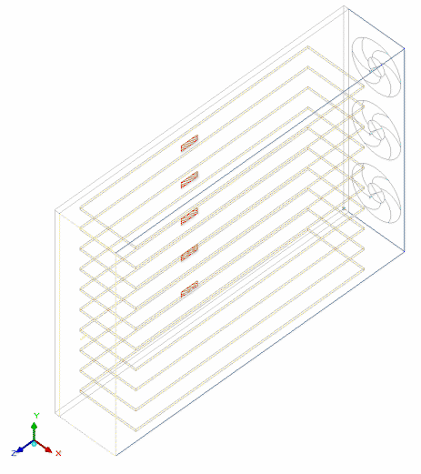

### 2.4. Step 1: Create a New Project

1. Start Ansys Icepak, as described in Starting Ansys Icepak.

When Ansys Icepak starts, the **Welcome to Icepak** panel opens automatically.

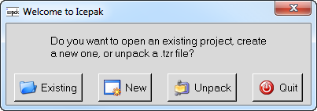

2. Click **New** in the **Welcome to Icepak** panel to start a new Ansys Icepak project.

The **New project** panel appears.

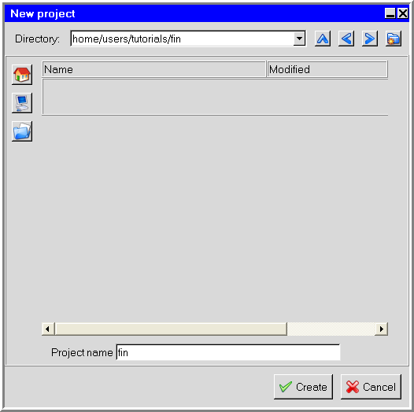

3. Specify a name for your project and click **Create**.

Ansys Icepak creates a default cabinet with the dimensions 1 m 1 m 1 m, and displays the cabinet in the graphics window.

**Note:**

You can rotate the cabinet around a central point using the left mouse button, or you can translate it to any point on the screen using the middle mouse button. You can zoom into and out from the cabinet using the right mouse button. To restore the cabinet to its default orientation, select **Home position** in the **Orient** menu. Alternatively, you can

click the **Home position** icon (

) above the graphics display window or press the **H** key.

### 2.5. Step 2: Build the Model

To build the model, you will first resize the cabinet to its proper size. Then you will create the backing plate and opening, followed by the elements that will be duplicated (that is, the fans, fins, and devices).

1. Resize the default cabinet in the **Cabinet** panel.

**Model**

**Cabinet**

**Tip:**

You can also open the **Cabinet** panel by selecting the **Cabinet** item in the **Model manager** window and then clicking the **Edit object** button (

) in the **Object modification** toolbar. Resizing of the cabinet object can also be done in the geometry window in the lower right hand corner of the GUI.

a. In the **Cabinet** panel, click the **Geometry** tab.

b. Under **Location**, enter the following coordinates:

| xS | 0 | xE | 0.075 |
| --- | --- | --- | --- |
| yS | 0 | yE | 0.25 |
| zS | 0 | zE | 0.356 |

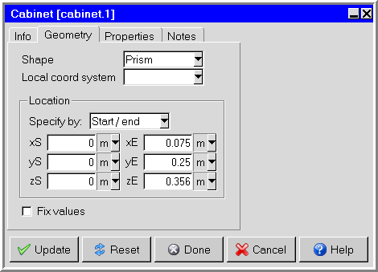

c. Click **Done** to resize the cabinet and close the panel.

d. In the **Orient** menu, select **Scale to fit** to scale the view of the cabinet to fit the graphics window.

**Extra:**

You can also scale the view by clicking the **Scale to fit** button (

).

**Extra:**

After selecting the object to be edited in the **Model manager** window, there are several ways you can open the **Edit** panel:

• Double-click the object in the **Model manager** window, or

– Type **Ctrl**+**E**, or

– Right-click the object in the **Model manager** window and scroll to **Edit** object,

or

– Click the **Edit** button in the object geometry window located in the bottom right-

hand corner, or

– Click the **Edit** icon (

) in the model toolbar.

2. Create the backing plate.

The backing plate is 0.006 m thick and divides the cabinet into two regions: the device side (where the high-power devices are contained in a housing) and the fin side (where the fins dissipate heat generated by the devices). The backing plate is represented in the model by a solid prism block.

**Extra:**

Blocks and conducting thick plates allow six-sided control for meshing and thermal spe- cifications. Conducting thin plates, however, have no physical thickness and therefore allow for only two-sided control.

a. Click the **Create blocks** button (

) to create a new block.

Ansys Icepak creates a new solid prism block in the center of the cabinet. You need to change the size of the block.

b. Click the **Edit object** button (

) to open the **Blocks** panel.

c. Click the **Geometry** tab.

d. Enter the following coordinates for the block:

| xS | 0 | xE | 0.006 |
| --- | --- | --- | --- |
| yS | 0 | yE | 0.25 |
| zS | 0 | zE | 0.356 |

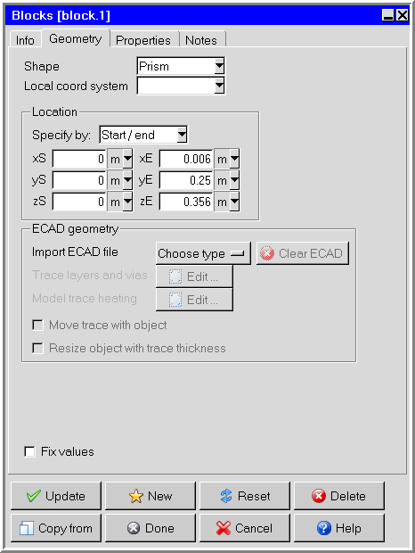

e. Click **Done** to modify the block and close the panel.

3. Create the free opening on the fin side of the backing plate.

a. Click the **Create openings** button (

) to create a new opening.

Ansys Icepak creates a free rectangular opening on the X-Y plane at the center of the cabinet. You need to change the size of the opening.

b. Click the **Edit object** button (

) to open the **Openings** panel.

c. Click the **Geometry** tab.

d. Enter the following coordinates for the opening:

| xS | 0.006 | xE | 0.075 |
| --- | --- | --- | --- |
| yS | 0 | yE | 0.25 |
| zS | 0.356 | zE | — |

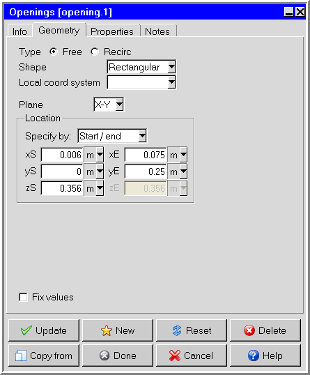

e. Click **Done** to modify the opening and close the panel.

4. Create the first fan.

Each fan is physically identical to the others, except with respect to its location on the cabinet wall. To create the set of three fans, you will build a single fan as a template and then create two copies, each with a specified offset in the y direction.

a. Click the **Create fans** button (

) to create a new fan.

Ansys Icepak creates a free circular fan lying in the X-Y plane in the center of the cabinet. You need to change the size of the fan and specify its volumetric flow rate.

b. Click the **Edit object** (

) to open the **Fans** panel.

c. Click the **Geometry** tab.

d. Enter the following coordinates for the fan:

| xC | 0.04 |
| --- | --- |
| yC | 0.0475 |

0 **zC**

e. Enter 0.03 for the external radius (**Radius**), and 0.01 for the internal radius (**Int Radius**).

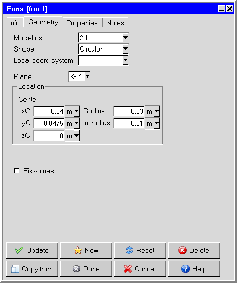

f. Click the **Properties** tab.

g. Keep the default **Fan type** of **Intake**.

h. Under the **Fan flow** tab, select **Fixed** and **Volumetric**. Enter a volumetric flow rate of 18 cfm.

**Note:**

Make sure to update the units to cfm by clicking on the triangle button and selecting cfm from the drop-down list.

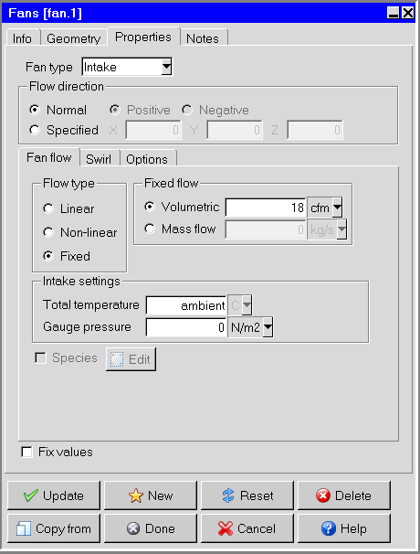

i. Click **Done** to modify the fan and close the panel.

5. Copy the first fan (**fan.1**) to create the second and third fans (**fan.1.1** and **fan.1.2**).

a. In the graphics display window, select **fan.1** using the right mouse button.

b. In the object context menu, select **Copy** and the **Copy fan fan.1** panel opens.

c. Enter 2 as the **Number of copies**.

d. Select the **Translate** option and specify a **Y offset** of 0.0775 m.

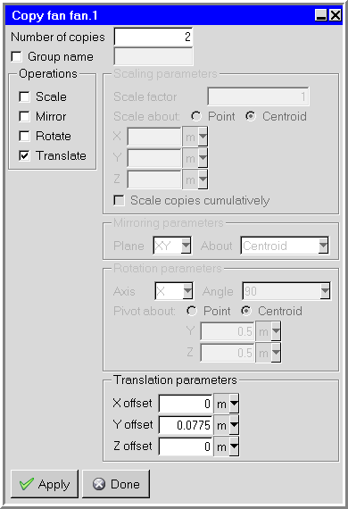

e. Click **Apply**.

Ansys Icepak makes two copies of the original fan, each offset by 0.0775 m in the y direction from the previous one.

**Extra::**

Alternatively, you can simply select the object(s) you need to copy in the **Model manager** window and then press **Ctrl**+**C** to bring up the **Copy** panel for the object(s).

6. Create the first high-power device.

Like the fans, each device is physically identical to the others, except with respect to its location in the cabinet. To create the set of five devices, you will build a single rectangular planar source as a template and then create four copies, each with a specified offset in the y direction.

a. Click the **Create sources** button (

) to create a source.

Ansys Icepak creates a free rectangular source in the center of the cabinet. You need to change the geometry and size of the source and specify its heat source parameters.

**Note:**

For planar objects, select the desired plane first, then enter the coordinates.

b. Click the **Edit object** button (

) to open the **Sources** panel.

c. Click the **Geometry** tab.

d. Keep the default selection of **Rectangular**.

e. In the **Plane** drop-down list, select **Y-Z**.

f. Enter the following coordinates for the source:

| xS | 0 | xE | — |
| --- | --- | --- | --- |
| yS | 0.0315 | yE | 0.0385 |
| zS | 0.1805 | zE | 0.2005 |

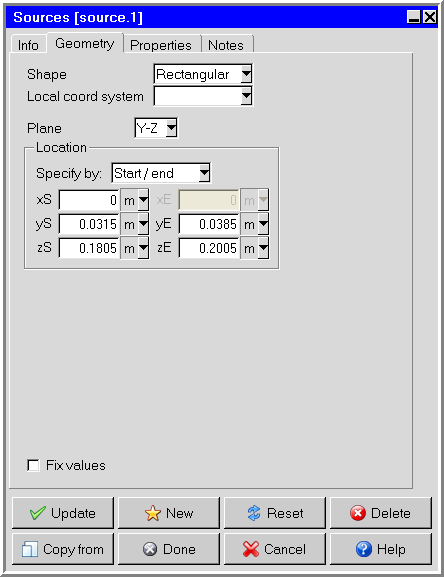

g. Click the **Properties** tab.

h. Under **Thermal specification**, set the **Total power** to 33 W.

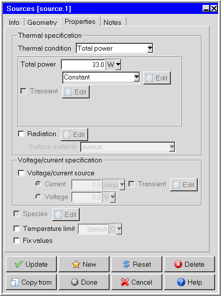

i. Click **Done** to modify the source and close the panel.

7. Copy the first device (**source.1**) to create the other four devices (**source.1.1**,**source.1.2**,**source.1.3**, and **source.1.4**).

a. In the **Model manager** window, select the **source.1** item under the **Model** node.

b. Click the **Copy object** button (

).

c. Follow the same instructions that you used above to copy the fans, using a **Y offset** of 0.045 m to create 4 copies.

8. Create the first fin.

Like the fans and devices, each fin is physically identical to the others, except with respect to its location in the cabinet. To create the array of ten fins, you will build a single rectangular plate as a template, and then create nine copies, each with a specified offset in the y direction.

a. Click the **Create plates** button (

) to create a plate.

Ansys Icepak creates a free rectangular plate on the X-Y plane at the center of the cabinet. You need to change the orientation and size of the plate and specify its thermal parameters.

b. Click the **Edit object** button (

) to open the **Plates** panel.

c. Click the **Geometry** tab.

d. In the **Plane** drop-down list, select **X-Z**.

e. Enter the following coordinates for the plate:

| xS | 0.006 | xE | 0.075 |
| --- | --- | --- | --- |
| yS | 0.0125 | yE | — |
| zS | 0.05 | zE | 0.331 |

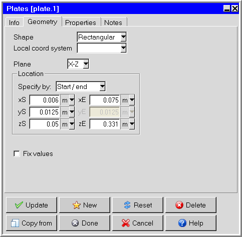

f. Click the **Properties** tab.

g. Under **Thermal model**, select **Conducting thick** from the drop-down menu.

h. Set the **Thickness** to 0.0025 m.

i. Keep **default** as the **Solid material**.

**Note:**

Since the default solid material is extruded aluminum, you do not need to explicitly specify the material here.

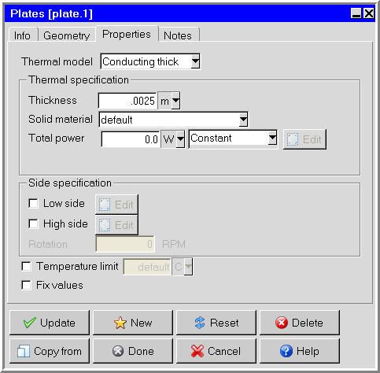

j. Click **Done** to modify the plate and close the panel.

9. Copy the first fin (**plate.1**) to create the other nine fins (**plate.1.1**,**plate.1.2**, ...,**plate.1.9**).

a. In the **Model manager** window, select the **plate.1** item under the **Model** node.

b. Click the **Copy object** button (

).

c. Follow the same instructions that you used above to copy the fans, using a **Y offset** of 0.025 m to create 9 copies.

The completed model is shown in Figure 2.2: Completed Model for the Finned Heat Sink (p. 19), visible in the **Isometric** view (available in the **Orient** menu or by clicking the **Isometric view** button

(

)).

**Note:**

You can remove the object names by clicking the **Display object names** button (

).

**Figure 2.2: Completed Model for the Finned Heat Sink**

10. Display objects by type.

You can display all object types, filter blocks by type (fluid, solid, network, hollow), and display blocks with traces and/or CAD block. This feature is useful for model verification. You can display all plate objects that have the conducting thick sub type.

a. **Model** **Show objects by type**

b. The **Show objects by type** panel appears as shown in Figure 2.3: Show objects by type Pan-

el (p. 19).

**Figure 2.3: Show objects by type Panel**

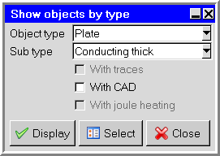

c. Select **Plate** for **Object type** and **Conducting thick** for **Sub type**.

d. Click **Display** to show the conducting thick plates. The model then appears as in Figure 2.4: Display

of Conducting Thick Plate Objects (p. 20).

**Figure 2.4: Display of Conducting Thick Plate Objects**

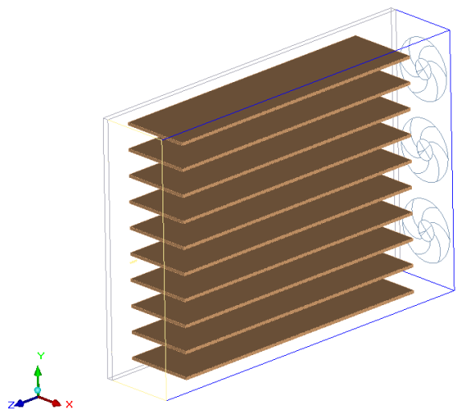

e. Click **Close** to exit the **Show objects by type** panel.

11. Check the model to be sure that there are no problems (for example, objects that are too close to- gether to allow for proper mesh generation).

**Model** **Check model**

**Note:**

You can also click the **Check model** button (

) to check the model.

**Note:**

Ansys Icepak should report in the **Message** window that 0 problems were found.

12. Check the definition of the modeling objects to ensure that you specified them properly.

**View** **Summary (HTML)**

The summary report now appears in a web browser. The summary displays a list of all the objects in the model and all the parameters that have been set for each object. You can view the detailed version of the summary by clicking the appropriate object names or property specifications. If you notice any incorrect specifications, you can return to the appropriate modeling object panel and change the settings in the same way that you originally entered them.

**Note:**

The summary report also shows the user-specified material properties for each of the objects to help identify the proper material specifications. Figure 2.5: Partial Table of Summary Report for Blocks (p. 21) shows the summary report for **block.1**, which includes its material specifications.

**Figure 2.5: Partial Table of Summary Report for Blocks**

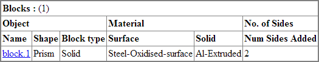

### 2.6. Step 3: Generate a Mesh

You will generate the mesh in two steps. First you will create a coarse mesh and examine it to determine where further mesh refinement is required. Then you will refine the mesh based on your observations of the coarse mesh.

**Extra:**

For more information on how to refine a mesh locally, refer to Refining the Mesh Locally.

**Model** **Generate mesh**

**Extra:**

You can also generate a mesh by clicking the **Generate mesh** button (

), which opens the **Mesh control** panel.

1. Generate a coarse (minimum-count) mesh.

a. In the **Mesh control** panel, select **Coarse** in the **Mesh parameters** drop-down list.

Ansys Icepak updates the panel with the default meshing parameters for a coarse (minimum- count) mesh, shown in the panel below.

b. Set the **Mesh units** and all the **Minimum gap** units to mm.

c. Set the **Minimum gap** to 1 mm for **X**,**Y**, and **Z**.

d. Set the **Max X size** to 3.5, the **Max Y size** to 12.5, and the **Max Z size** to 17.5.

e. Click the **Generate** button to generate the coarse mesh.

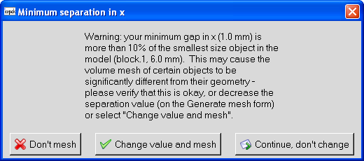

**Note:**

If the **Allow minimum gap changes** option is unchecked under the **Misc** tab, Ansys Icepak will inform you that your minimum object separation is more than 10% of the smallest size object in the model. You can stop the meshing process, ignore the warning, or allow Ansys Icepak to correct the values.

f. If this warning appears, click **Change value and mesh** in the **Minimum separation in x** and **Minimum separation in y** panels to accept the recommended changes to your model and continue generating the mesh.

2. Examine the coarse mesh on a cross-section of the model.

a. Click the **Display** tab.

b. Select the **Cut plane** option.

c. In the **Set position** drop-down list, select **X plane through center**.

d. Select the **Display mesh** option.

The mesh display plane is perpendicular to the fins, and aligned with the devices, as shown in Figure 2.6: Coarse Mesh on the Y-Z Plane (p. 26).

**Note:**

The number of elements may vary slightly on different machines.

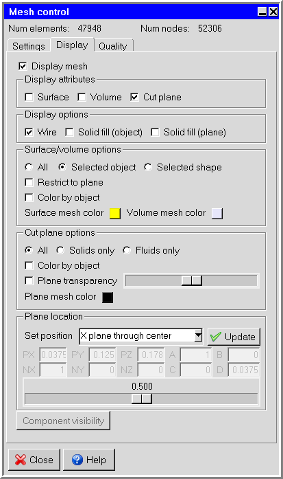

**Figure 2.6: Coarse Mesh on the Y-Z Plane**

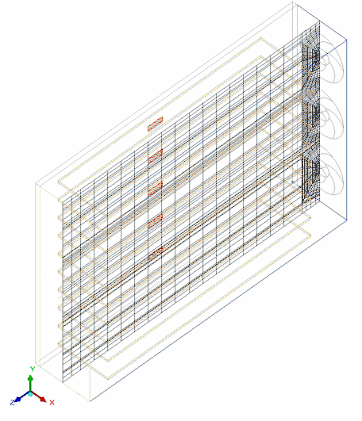

e. Use the slider bar to move the plane cut through the model. See Figure 2.7: Fine and Coarse

Mesh on the Y-Z Plane (p. 27) to examine a close-up view of the coarse mesh.

**Note:**

You can change the mesh color using the **Surface mesh color** and the **Plane mesh** **color** options.

The mesh elements near the fins are too large to sufficiently resolve the problem physics. In the next step, you will generate a finer mesh.

3. Generate a finer mesh.

a. Click the **Settings** tab.

b. Under the **Global** tab, select **Normal** in the **Mesh parameters** drop-down list.

Ansys Icepak updates the panel with the default meshing parameters under the **Global** tab.

4. Click the **Generate** button in the **Mesh control** panel to generate the finer mesh.

5. Examine the new mesh.

The graphics display updates automatically to show the new mesh. Click the **Display** tab and use slider bar to advance the plane cut and view the mesh throughout the model.

**Figure 2.7: Fine and Coarse Mesh on the Y-Z Plane**

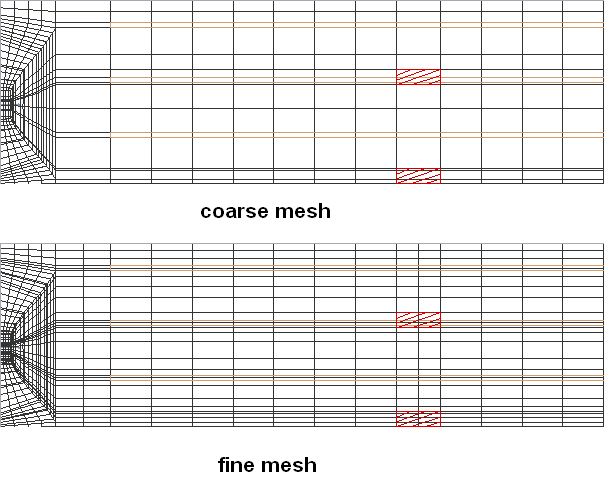

6. Turn off the mesh display.

a. Click the **Display** tab in the **Mesh control** panel.

b. Deselect the **Display mesh** option.

c. Click **Close** to close the **Mesh control** panel.

**Note:**

After deselecting the **Display mesh** option and closing the **Mesh control** panel, you can display the mesh on selected objects by using the context menu in the graphics display window. To display the context menu, hold down the **Shift** key and press the right mouse button anywhere in the graphics window, but not on an object. Select **Display mesh** and select the object you want it displayed on.

**Figure 2.8: Display mesh Option**

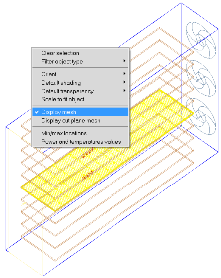

### 2.7. Step 4: Physical and Numerical Settings

Before starting the solver, first review estimates of the Reynolds and Peclet numbers to check that the proper flow regime is being modeled.

1. Check the values of the Reynolds and Peclet numbers.

**Solution settings**

**Basic settings**

**Figure 2.9: Basic settings panel**

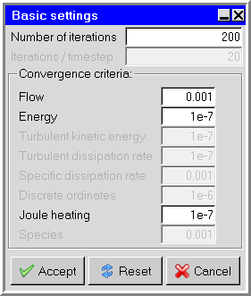

a. Click the **Reset** button as shown in Figure 2.9: Basic settings panel (p. 29).**Reset** calculates the Reynolds and Peclet numbers.

b. Check the values printed to the **Message** window.

The Reynolds and Peclet numbers are approximately 13,000 and 9,000, respectively, so the flow is turbulent. Ansys Icepak consequently recommends setting the flow regime to turbulent.

**Note:**

These values are only estimates, based on the current model setup. Actual values may vary, and may need verification, depending on your design.

c. Change the **Number of iterations** to **200**.

d. Click **Accept** to save the solver settings.

2. Using the **Problem setup wizard**, enable turbulence modeling using the zero equation turbulence model and neglecting radiation heat transfer.

a. In the **Model manager** window, right-click

**Problem setup** and then select **Problem setup** **wizard** (Figure 2.10: Problem setup wizard panel at step 1 of 14 (p. 30)). The **Problem setup** **wizard** provides a simple interface with user guidance for defining the physics of the model.

**Figure 2.10: Problem setup wizard panel at step 1 of 14**

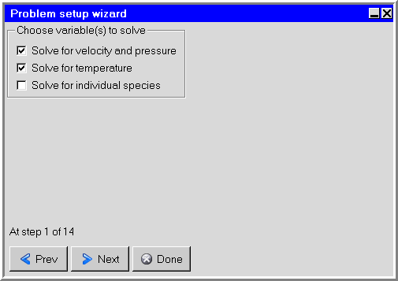

b. For step 1 of 14, keep the default settings for check boxes. Click **Next**.

c. For step 2 of 14, keep the default flow condition selected. Click **Next**.

d. Note that you are now at step 5 of 14 according to the **Problem setup wizard** panel, shown in

Figure 2.11: Problem setup wizard at step 5 of 14 (p. 31). Ensure that you select **Set flow regime** **to turbulent**.

**Extra:**

Hold your mouse pointer over any selection in the **Problem setup wizard** to have a text bubble appear for additional information on the selection, as shown in Fig- ure 2.11: Problem setup wizard at step 5 of 14 (p. 31).

**Figure 2.11: Problem setup wizard at step 5 of 14**

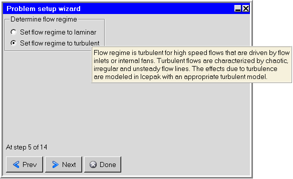

Click **Next**.

e. For step 6 of 14, select **Zero equation (mixing length)** as your turbulence model. Click **Next**.

f. For step 7 of 14, select **Ignore heat transfer due to radiation**. Click **Next**.

g. Note that you are now at step 9 of 14 according to the panel. Leave the check box empty to

exclude solar radiation and click **Next**.

h. For step 10 of 14, select **Variables do not vary with time (steady-state)** for steady-state simu-

lation. Click **Next**.

i. Note that you are now at step 14 of 14, as shown in Figure 2.12: Problem setup wizard at step 14 of 14 (p. 32). Ignore altitude effects by leaving the check boxes empty. Click **Done** to finish the **Problem setup wizard**, fully defining the problem setup.

**Figure 2.12: Problem setup wizard at step 14 of 14**

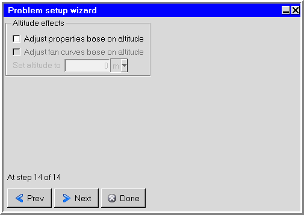

**Note:**

You can edit these settings and other aspects of the problem setup by double-clicking

**Basic parameters** in the **Model manager** window. Figure 2.13: Basic parameters panel (p. 33) shows the **Basic parameters** panel.

**Figure 2.13: Basic parameters panel**

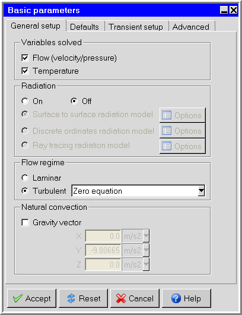

### 2.8. Step 5: Save the Model

Ansys Icepak automatically saves the model for you before it starts the calculation, but it is a good idea to save the model (including the mesh) yourself as well. If you exit Ansys Icepak before you start the calculation, you will be able to open the job you saved and continue your analysis in a future Ansys Icepak session. (If you start the calculation in the current Ansys Icepak session, Ansys Icepak will simply overwrite your job file when it saves the model.)

**File** **Save project**

**Note:**

Alternatively, you can click the

button in the **File commands** toolbar.

### 2.9. Step 6: Calculate a Solution

1. Start the calculation.

**Solve** **Run solution**

**Note:**

You can click the **Run solution** button (

) in the **Model and solve** toolbar.

**Figure 2.14: Solve Panel**

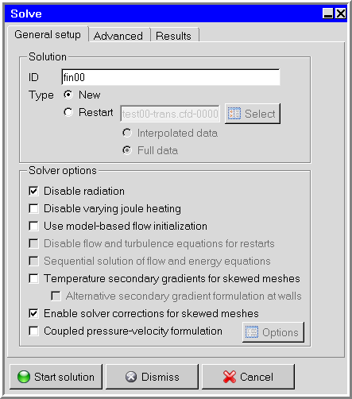

2. Match your settings to those of Figure 2.14: Solve Panel (p. 34).

3. Click **Start solution** to start the solver.

**Note:**

No universal metric exists for judging convergence; a good indicator is when the solution no longer changes with more iterations and when the residuals have decreased to a certain degree. The default criterion is that each residual reduces to a value of less than

except the energy residual, for which the default criterion is . It is a good idea

to judge convergence not only by examining residual levels, but also by monitoring rel- evant integrated quantities.

Ansys Icepak begins to calculate a solution for the model, and a separate window opens where the solver prints the numerical values of the residuals. Ansys Icepak also opens the **Solution residuals** graphics display and control window, where it displays the convergence history for the calculation.

Upon completion of the calculation, your residual plot will look something like Figure 2.15: Plot of Solution Residuals (p. 35). You can zoom in the residual plot by using the left mouse.

**Note:**

The actual values of the residuals may differ slightly on different machines, so your plot may not look exactly the same as Figure 2.15: Plot of Solution Residuals (p. 35).

**Figure 2.15: Plot of Solution Residuals**

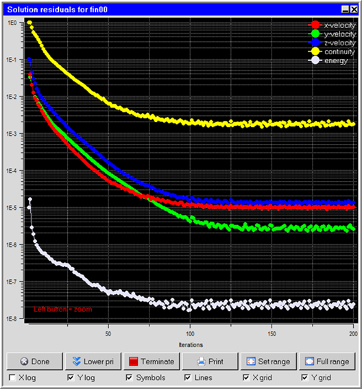

4. Click **Done** in the **Solution residuals** window to close it.

### 2.10. Step 7: Examine the Results

Ansys Icepak provides a number of ways to view and examine the solution results, including:

• plane cut views

• object face views

• summary report

The following steps illustrate how to generate and display each view.

**Note:**

The objective of this exercise is to determine whether the air flow and heat transfer associated with the heat sink (fans and fins) are sufficient to maintain device temperatures below 65°C. You can accomplish this by creating different plane cuts and monitoring the velocity vector and temperature on it. Plane-cut views allow you to observe the variation in a solution variable across the surface of a plane.

You will use the **Plane cut** panel to view the direction and magnitude of velocity across a horizontal plane.

1. To open the **Plane cut** panel, select **Plane cut** in the **Post** menu.

**Extra:**

You can also open the **Plane cut** panel by clicking the **Plane cut** button (

).

2. Display velocity vectors on a plane cut on the fin side of the enclosure.

**Post** **Plane cut**

a. In the **Name** field, enter the name cut-velocity as shown in Figure 2.16: Plane cut Panel for cut-velocity (p. 37).

b. In the **Set position** drop-down list, select **X plane through center**.

**Tip:**

Click the drop-down arrow button located next to the **Set position** text field to open the drop-down list.

c. Select the **Show vectors** option.

**Figure 2.16: Plane cut Panel for cut-velocity**

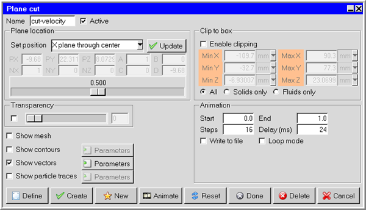

d. Click **Parameters** next to the **Show vectors** option.

e. In the **Display options** box, select **Dart** in the **Arrow style** drop-down menu (Figure 2.17: Plane

cut vectors Panel for cut-velocity (p. 37)). This will display the vectors as dart-like objects.

**Figure 2.17: Plane cut vectors Panel for cut-velocity**

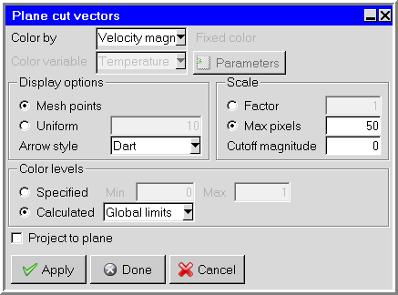

f. Click **Done** to exit out of the panel.

g. Click **Create**.

h. In the **Orient** menu, select **Orient positive X**.

This orients the model as shown in Figure 2.18: Velocity Vectors on the Fin Side of the Enclos- ure (p. 38). You can see that the maximum velocity occurs at the fan blades. The lowest velocity occurs between the top fin and the adjacent cabinet wall, and between the bottom fin and the adjacent cabinet wall.

**Extra:**

You can also select the positive X orientation by clicking the **Orient positive X** button

(

).

**Figure 2.18: Velocity Vectors on the Fin Side of the Enclosure**

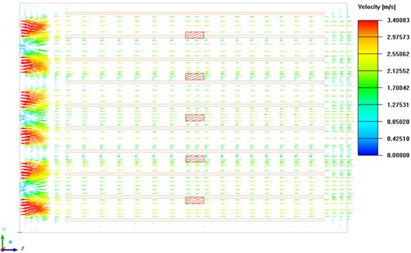

i. In the **Plane cut** panel, turn off the **Active** option.

This temporarily removes the velocity vector display from the graphics window, so that you can more easily view the next post-processing object.

**Note:**

You can later open the **Inactive** folder in the **Model manager** window and locate cut_velocity. The object cut_velocity can be either deleted or reactivated by dragging it to **Trash** or to the **Post-processing** folder, as well as within the right- click context menu.

3. Display contours of temperature on the fin side of the enclosure.

a. Click **New** in the **Plane cut** panel.

b. In the **Name** field, enter the name cut-temperature.

c. In the **Set position** drop-down list, select **X plane through center**.

d. Select the **Show contours** option and click **Parameters**.

The **Plane cut contours** panel opens.

e. Keep the default selection of **Temperature**.

f. For **Shading options**, keep the default selection of **Banded**.

g. For **Color levels**, select **Calculated** and then select **This object** from the drop-down list.

h. Click **Apply**.

Ansys Icepak computes the color range for the display based on the range of temperatures on this plane cut.

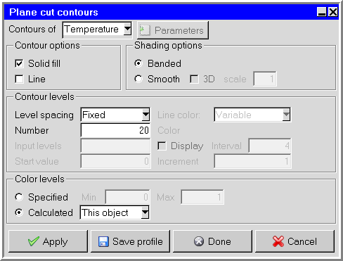

i. Click **Done** to save the new settings, close the panel, and update the graphics display.

The graphics display updates to show the temperature contour plot. The actual values of tem- perature may slightly differ on different systems. You can use the scroll bar to change the x- location of the plane cut. In addition, the plane cut can be dragged through the model when you hold down the **Shift** key and the middle mouse button on the plane. Ensure you click the edge of the plane cut so as to not move any objects.

Figure 2.19: Temperature Contours on the Fin Side of the Enclosure (p. 40) shows that heat is conducted through the fins in both directions away from the sources as well as the thermal boundary layers resulting from the forced convection.

**Figure 2.19: Temperature Contours on the Fin Side of the Enclosure**

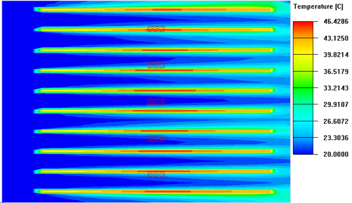

j. In the **Plane cut** panel, deselect the **Active** option.

4. Display velocity vectors superimposed with pressure contours.

a. Click **New** in the **Plane cut** panel.

b. In the **Name** field, enter the name cut-prvelocity.

c. In the **Set position** drop-down list, select **X plane through center**.

d. Specify the display of velocity vectors.

i. Select the **Show vectors** option and click **Parameters**.

The **Plane cut vectors** panel opens.

ii. Select **Fixed** from the **Color by** drop-down list.

iii. Click the square next to **Fixed color** and select black from the color palette.

iv. Click **Done** to close the panel.

e. Specify the display of contours of pressure.

i. Select the **Show contours** option and click **Parameters**.

The **Plane cut contours** panel opens.

ii. In the **Plane cut contours** panel, select **Pressure** in the **Contours of** drop-down list.

iii. For **Shading options**, keep the default selection of **Banded**.

iv. For **Color levels**, select **Calculated** and then select **This object** from the drop-down list.

v. Click **Done** to save the new settings, close the panel, and update the graphics display.

The graphics display updates to show the pressure contour plot superimposed onto the ve- locity vector plot.

Figure 2.20: Pressure Contours and Velocity Vectors on the Fin Side of the Enclosure (p. 41) shows isolated regions of high pressure immediately downstream of the fans, including local maxima at the upstream tips of the fins.

**Figure 2.20: Pressure Contours and Velocity Vectors on the Fin Side of the Enclosure**

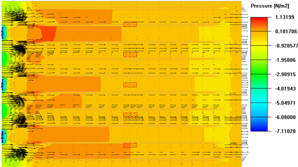

f. In the **Plane cut** panel, turn off the **Active** option.

5. Display contours of temperature on all five high-power devices.

An object-face view allows you to examine the distribution of a solution variable on one or more faces of an object in the model. To generate an object-face view, you must select the object and specify both the variable to be displayed (for example, temperature) and the attributes of the view (for example, shading type).

You will use the **Object face** panel to create a solid-band object-face view of temperature on all five high-power devices and on the backing plate.

a. To open the **Object face** panel, select **Object face** in the **Post** menu.

**Post** **Object face**

**Extra:**

You can also open the **Object face** panel by clicking the **Object face** button (

).

b. In the **Name** field, enter the name face-tempsource.

c. In the **Object** drop-down list, click **source.1**, hold down the **Shift** key, and click **source.1.4** to select all the sources, and click the **Accept** button.

d. Select the **Show contours** option.

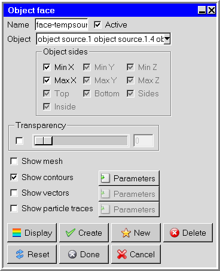

e. Click **Parameters** next to the **Show contours** option.

The **Object face contours** panel opens.

f. In the **Object face contours** panel, keep the default selection of **Temperature** in the **Contours** **of** drop-down list.

g. For **Shading options**, keep the default selection of **Banded**.

h. For **Color levels**, select **Calculated** and then select **This object** from the drop-down list.

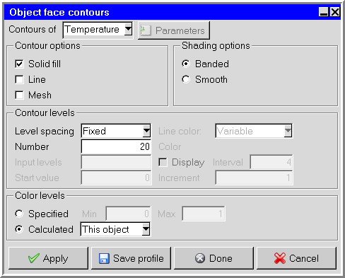

i. Click **Done** to save the new settings, close the panel, and update the graphics display.

The graphics display updates to show the temperature contours on the sources.

j. Use your right mouse button to zoom in and look more closely at each source.

Figure 2.21: Temperature Contours on the Five Devices (p. 44) shows a view with the temperature contours on all five sources. The temperature distributions are similar for all sources: warm in the center and decreasing in temperature toward the edges of the source. Temperature distribu- tions on the top and bottom sources are similar to each other, as are distributions on the two remaining sources.

**Note:**

To view the temperature contours on an individual source, hold down the **Shift** key and drag a box around a source object using the left mouse button. The source object will show as highlighted in the **Model manager** window. Right-click the source object to display the context menu and select **Create** **Object face(s)** **Separate**. Ansys Icepak displays the **Object face** panel for that particular object. Change the settings to match the ones used above for all source objects and click **Create**.

**Figure 2.21: Temperature Contours on the Five Devices**

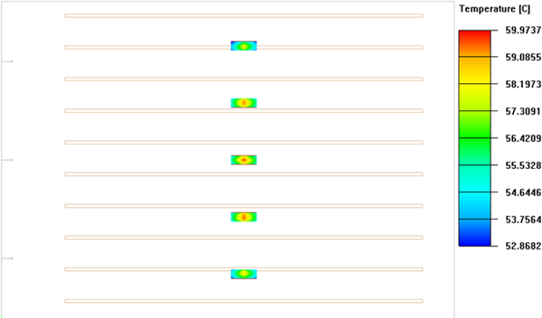

k. In the **Object face** panel, deselect the **Active** option.

6. Display line contours of temperature on the backing plate.

a. Click **New** in the **Object face** panel.

b. In the **Name** field, enter the name face-tempblock.

c. In the **Object** drop-down list, select **block.1** and click **Accept**.

d. Select the **Show contours** option and click **Parameters**.

The **Object face contours** panel opens.

e. In the **Object face contours** panel, keep the default selection of **Temperature** in the **Contours**

**of** drop-down list.

f. For **Contour options**, deselect **Solid fill** and select **Line**.

g. For **Level spacing**, select **Fixed** and set the **Number** of contour lines to 200.

h. For **Color levels**, select **Calculated** and then select **This object** from the drop down list.

i. Click **Done** to save the new settings, close the panel, and update the graphics display.

The graphics display updates to show the temperature contours on the block. Figure 2.22: Tem- perature Contours on the Backing Plate (p. 45) shows that most of the heat is confined to the region near the sources. The maximum temperature occurs near the middle three sources.

**Figure 2.22: Temperature Contours on the Backing Plate**

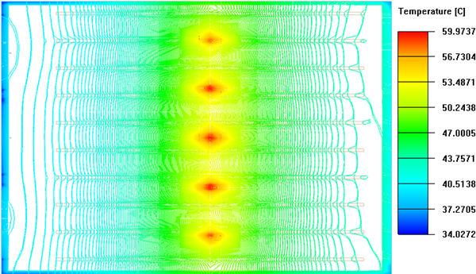

j. Click **Done** in the **Object face** panel to close the panel. Deselect the **Active** option for the object face in the **Model manager** window.

7. Utilize the **Transparency** slider in the **Plane cut** panel to help visualize multiple plane cuts simul- taneously.

a. Refer to Figure 2.16: Plane cut Panel for cut-velocity (p. 37). Select **Active** in the**Plane cut** panel to display in the graphics display window. Select the check box for the **Transparency** slider in order to enable transparency. Click and drag the slider between the allowable values **0.00–0.99** to control the degree of transparency. In the **Plane cut** panel, deselect the **Active** option.

b. Click **Done** in the **Plane cut** panel to close the panel.

c. Figure 2.23: Example of Transparency Feature with Multiple Plane cut Contours (p. 46) is a com- bination of two plane cut temperature contours and a partially transparent pressure contour as an example of the **Transparency** feature. Notice that the single, semi-transparent pressure contour allows concurrent visualization of the temperature profiles immediately next to the block.

**Figure 2.23: Example of Transparency Feature with Multiple Plane cut Contours**

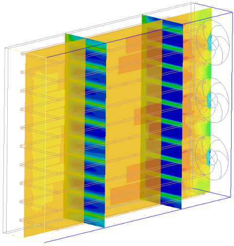

8. Create a summary report of object-specific solution data.**Summary reports** can provide physical information from the solution about specific **Model** objects,**Groups** objects,**Post-processing** objects and **Points** objects. Follow the steps below to create a summary report:

a. First, make the post-processing object **cut-temperature** active again by accessing the context menu under the **Inactive** node in the **Model manager** window.

b. **Report** **Summary report**

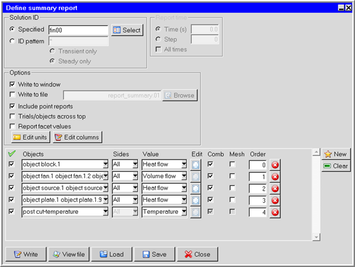

c. Click **New** in the **Define summary report** panel five times to create 5 rows of **Objects**.

d. In the first row, select **object block.1**, then click **Accept**. In the **Value** drop-down menu,

select **Heat flow**.

**Note:**

Although you did not change the default settings of the check boxes **Comb** and **Mesh**, you may encounter projects in which you need to change these.**Comb** refers to “combined”: The report generates a single, combined value for all the sides selected; deselecting the option would report the side values separately. **Mesh** allows you to report on the reduced mesh of the selected object in the case that an object intersects with other objects and the mesh in the intersecting region might not necessarily belong to the object of interest.

e. In the second row, use the **Shift** key to select all 3 fans, then click **Accept**. In the **Value**

drop-down menu, select **Volume flow**.

f. In the third row, use the **Shift** key to select all 5 sources, then click **Accept**. In the **Value** drop-down menu, select **Heat flow**.

g. In the fourth row, use the **Shift** key to select all 10 plates, then click **Accept**. In the **Value**

drop-down menu, select **Heat flow**.

h. In the fifth row, select **post cut-temperature**, then click **Accept**. Keep the default settings

in the other fields.

i. Click **Write** to generate a panel for the object summary report (Figure 2.24: Report summary data Panel (p. 48)). Examine the values reported and confirm they are consistent with the physics of the model. Click **Done** to exit out of this panel, then **Close** to exit the **Define** **summary report** panel.

**Figure 2.24: Report summary data Panel**

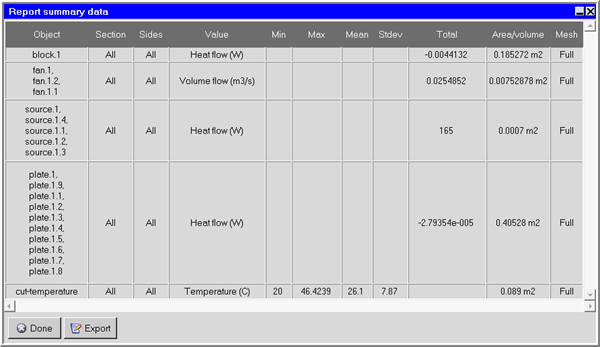

9. Save the post-processing objects created.

a. Select **Save post objects to file** in the **Post** menu.

b. Click **Save** in the **File selection** window that opens.

Upon saving the project, all objects created during post-processing are saved within a **post_objects** file for future retrieval.

### 2.11. Step 8: Summary

In this tutorial, you have determined the ability of the specified heat sink to maintain source temperatures below 65°C. Post-processing results show that the maximum source temperature is about 60°C, indicating that the heat sink provides adequate cooling for the sources.

In addition, you have learned the basic workflow of an Ansys Icepak project, including model building, mesh generation, problem setup, solution calculation, and post-processing as well essential features and functions that you will likely use in later tutorials or your own projects.

We repeat some of the tips and best practices found in this tutorial for your convenience:

1. Best Practices

a. Check the default materials, properties, and operating conditions under the **Defaults** tab in the

**Basic parameters** panel. These defaults often render some specifications unnecessary.

b. Use the **Show objects by type** feature to verify your model objects by type.

c. Use the **Check model** feature to ensure there are no problems with the model.

d. View the HTML summary report (**View** **Summary (HTML)**) to ensure proper specification of geometries, properties, and materials for each object.

e. Select the **Allow minimum gap changes** option in the **Misc** tab of the **Mesh control** panel to

allow Ansys Icepak to avoid unnecessary meshing due to inadvertent misalignments in the model. This is suitable for this tutorial but may not be in other projects.

f. Select **Normal** in the **Mesh parameters** field when flow structures require finer grids than possible with **Coarse** meshing.

g. Use the **Problem setup wizard** for guided problem setup. Edit the problem setup if needed

using the

**Basic parameters** panel.

h. Save the model and mesh before starting the solution so that you can open the saved job and

continue analysis in a future session.

i. Judge convergence by monitoring residual levels as well as relevant integrated quantities, which should eventually stop changing significantly with more iterations.

2. Tips and Tricks

a. Explore the several methods to complete a task as you work through a problem in Ansys Icepak. For example, you can edit model object geometries by using their object edit panel, or you can use the **Edit** window in the bottom right-hand corner while having the object node selected in the **Model manager** window. Use the options best suited for you to help streamline your workflow.

b. Choose blocks and plates according to your needs. Blocks and conducting thick plates allow six-

sided control for meshing and thermal specifications. Conducting thin plates, however, have no physical thickness and therefore allow for only two-sided control.

c. Remove object names by clicking the **Display object names** button (

) to reduce visual clutter in the graphics window.

d. Use the **Reset** button in the **Basic settings** panel to have Ansys Icepak estimate dimensionless

numbers (for example, the Reynolds and Peclet numbers for forced convection) and determine the appropriate flow regime.

e. Hold your mouse pointer over any selection in the **Problem setup wizard** to have a text bubble

appear for additional information on the selection.

f. Use the **Transparency** slider in the post-processing object edit panels to improve visualization of post-processing objects.

g. Use the post summary report to view an object-specific summary of the solution results.

### 2.12. Step 9: Additional Exercise

To determine the effectiveness of the heat sink under conditions involving the failure of the middle fan, you can either deactivate **fan.1.1** or edit it **fan.1.1** to fail. To make it fail, edit it by double-clicking on **fan.1.1** in the model manager window, go to the **Properties** tab and select **Failed** under the **Options** tab, assign a **free area ratio** of **0.3**, and click **Done**. Mesh the model and solve it again using a different solution ID. Compare the new results with the previous setup.

**Note:**

When you are finished examining the results, you can end the Ansys Icepak session by clicking **Quit** in the **File** menu.

**File** **Quit**

---

## Chapter 3: RF Amplifier

### 3.1. Introduction

This tutorial demonstrates how to model an RF amplifier using Ansys Icepak as well as many features and functions essential to any Ansys Icepak project. For the sake of brevity, many of the later tutorials do not cover basic steps or explain the steps in detail as those tutorials assume you have completed this and/or the last tutorial (Finned Heat Sink (p. 5)) beforehand.

In this tutorial you will learn how to:

• Create a new project.

• Create a model using openings, fans, sources, enclosures, PCBs, heat sinks, and walls.

• Use non-conformal meshing.

• Set up a simulation with various physical conditions and parameters, including turbulence and natural convection.

• Calculate a solution.

• Post-process your results by using power and temperature limits, object faces, plane cuts, isosurfaces and variation plots.

**Note:**

Mesh counts and solution results may differ slightly due to enhancements to the meshing algorithm and Fluent solver, respectively.

### 3.2. Prerequisites

This tutorial assumes that you have little experience with Ansys Icepak but that you are generally famil- iar with the interface. If you are not, review the Sample Session in the Icepak User’s Guide.

### 3.3. Problem Description

RF amplifiers are typically sealed enclosures that are placed within larger systems. They present a chal- lenge from the thermal management perspective because no direct exchange of air exists between the interior of the amplifier and the ambient. The common method of cooling such subsystems is to mount a large heat sink on the amplifier housing that cools all the devices within the enclosure. A simplified version of an RF amplifier (Figure 3.1: Schematic of the RF Amplifier (p. 52)) will serve as the model for

this tutorial. There will be free convection inside the amplifier and forced convection in the external domain.

**Figure 3.1: Schematic of the RF Amplifier**

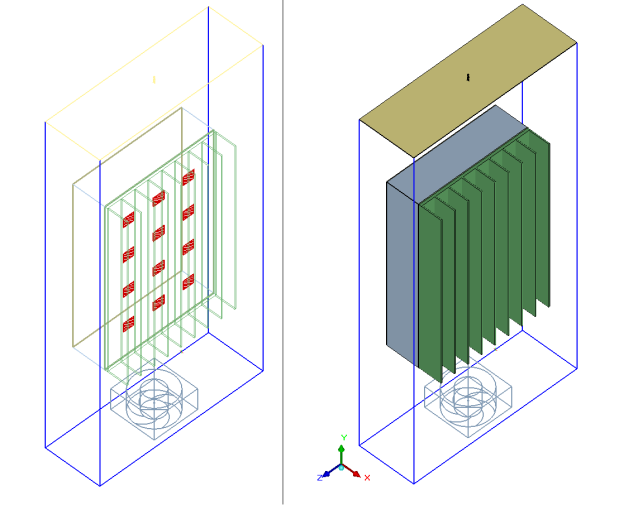

### 3.4. Step 1: Create a New Project

1. Start Ansys Icepak, as described in Starting Ansys Icepak from the User’s Guide.

When Ansys Icepak starts, the **Welcome to Icepak** panel opens automatically.

2. Click **New** in the **Welcome to Icepak** panel to start a new Ansys Icepak project.

The **New project** panel appears.

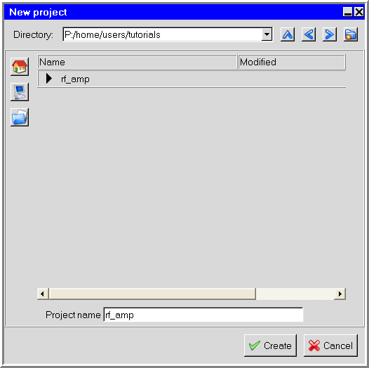

3. Specify the name **rf_amp** for your project and click **Create**.

Ansys Icepak creates a default cabinet with the dimensions 1 m 1 m 1 m, and displays the cabinet in the graphics window.

**Note:**

You can rotate the cabinet around a central point using the left mouse button, or you can translate it to any point on the screen using the middle mouse button. You can zoom into and out from the cabinet using the right mouse button. To restore the cabinet to its default orientation, select the **Home position** in the **Orient** menu. Alternatively, you

can click the **Home position** icon (

) above the graphics window or press the **H** key.

### 3.5. Step 2: Build the Model

To build the model, you will first resize the cabinet to its proper size. Then you will create the amplifier housing, devices (heat sources), PCB, heatsink, fan and other geometrical objects.

1. Resize the default cabinet and create an opening on one side of the cabinet.

**Model**

**Cabinet**

Select the cabinet in the **Model manager** window and specify the following in the object geometry window:

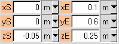

**Note:**

After selecting the object to be edited in the **Model manager** window, there are several ways you can open the **Edit** panel:

• Double-click the object in the **Model manager** window, or

– Type **Ctrl**+**e**, or

– Right-click the object in the **Model manager** window and scroll to **Edit** object, or

– Click the **Edit** button in the object geometry window, or

– Click the **Edit object** icon (

) in the model toolbar

**Figure 3.2: The Cabinet Geometry Tab Panel**

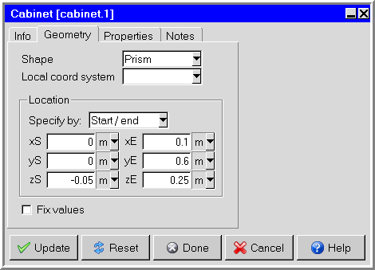

One side of this cabinet has an opening. To assign **Properties** on this boundary, in the **Properties** tab of the **Cabinet** object panel (Figure 3.3: The Cabinet Boundary Panel (p. 55)):

a. Change the **Max y** **Wall type** to be an **Opening**.

b. Click **Done** to accept the inputs and close the panel.

**Figure 3.3: The Cabinet Boundary Panel**

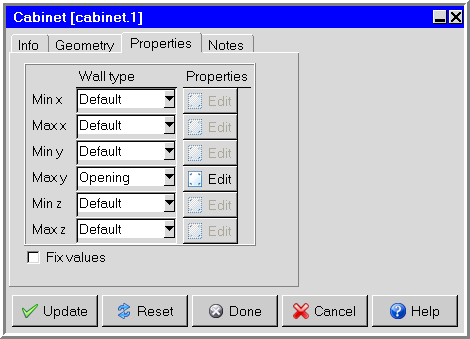

2. Create the Y and Z faces of the amplifier housing as an enclosure using the enclosure object.

Click the **Create enclosures** icon (

) in the model toolbar, then specify the following **Name** and dimensions:

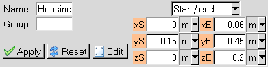

In the **Properties** tab specify the followings:

a. Change the **Boundary type** to **Open** for **Min X** and **Max X**. For others, retain the boundary type as **Thin**.

b. Specify the **Solid material** as **Polystyrene-rigid-R12**.

**Tip:**

You have to scroll down the list to find this material.

c. Click **Done**.

**Figure 3.4: The Enclosure Panel**

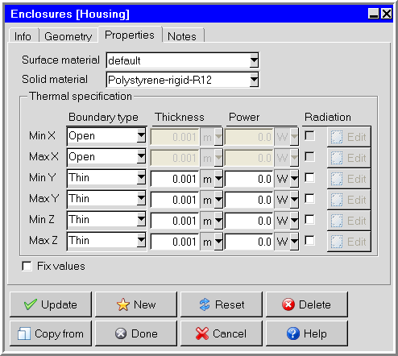

3. Create a wall on the Xmin face of the amplifier housing to cover the Xmin side of the enclosure. Click the **Create walls** icon (

) in the model toolbar to create a new wall.

In the object edit window, name the wall Xmin and change the plane to **Y-Z**.

4. Use **Morph Edges** to align the wall and then specify the wall properties.

**Note:**

Although you are using the align tools to place the wall at the desired locations, you could also specify the dimensions/locations of the wall in the **Geometry** tab and achieve the same result. However, the align tools are faster and thus the recommended method.

To start the process, click the **Morph edges** icon (

) in the model toolbar. Now, follow the step- by-step procedure described below:

a. Select the Zmax edge of the wall, indicated by the red edge in the figure (Figure 3.5: Schematic Showing Edge Identities for Alignment (p. 57)) by left mouse clicking it in the graphical window. Notice that it turns red to indicate that it has been selected.

b. Click the middle mouse button to accept this edge.

c. Select the lower Zmax edge of the enclosure, indicated by the yellow edge in the figure (Fig- ure 3.5: Schematic Showing Edge Identities for Alignment (p. 57)) with the left mouse button. Notice that it turns yellow to indicate its selection.

**Figure 3.5: Schematic Showing Edge Identities for Alignment**

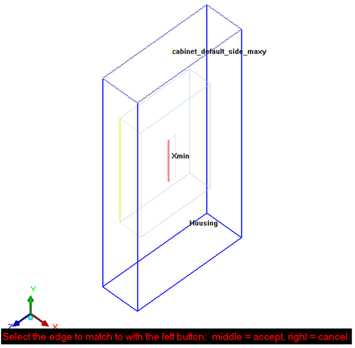

d. Click the middle mouse button to accept the transformation. The wall**Xmin** should have now

been moved and resized. Now the wall should extend to the entire Xmin side of the enclosure.

To specify the remaining wall dimension, stay in the **Morph edges** mode and complete the following steps:

a. Click the **Zmin** edge of the wall with the left mouse button. Be sure that the**Zmin** edge of the wall (and not the enclosure edge) is highlighted in red. By repeatedly clicking the left mouse button, Ansys Icepak cycles through all possible edges.

b. Click the middle mouse button to accept.

c. Using the left mouse button, click the lower Zmin edge of the enclosure.

d. Click the middle mouse button to accept. The wall now forms the Xmin face of the enclosure.

e. Click the right mouse button to exit the **Morph edges** mode.

The resulting model is shown in Figure 3.6: Geometry with Wall (p. 58) with shading to highlight new definitions. Shading is available under the **Info** tab in most panels.

**Figure 3.6: Geometry with Wall**

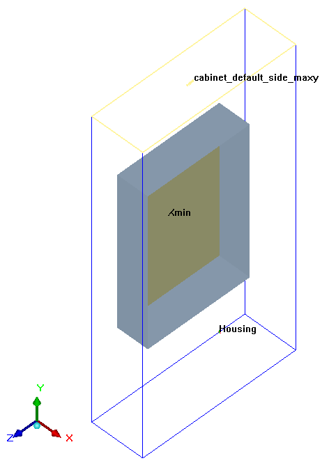

Double-click the newly created wall object (**Xmin**) in the **Model manager** window to open the **Walls** panel. Specify the following properties to the wall in the **Properties** tab.

a. Specify a **Wall thickness** of **1** mm (**0.001** m).

b. Specify the **Solid material** as **Polystyrene-rigid-R12** under **Plastics**.

c. Specify the **External conditions** as **Heat transfer coefficient** and click the **Edit** button.

The **Wall external thermal conditions** panel opens.

i. Select **Heat transfer coeff** in the **Thermal conditions** group box.

ii. Set the **Heat transfer coeff** to 5 W/K-m2.

iii. Click **Done** to close the **Wall external thermal conditions** panel.

iv. Click **Done** to close **Walls** panel (Figure 3.7: The Walls Panel (p. 59)).

**Figure 3.7: The Walls Panel**

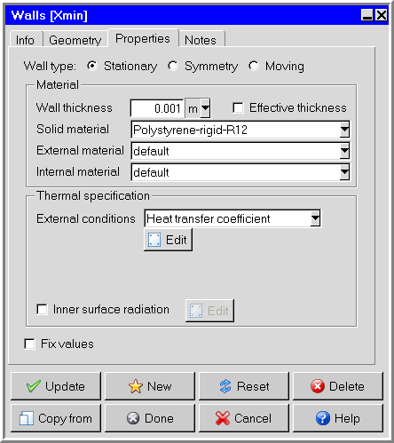

5. Create the PCB.

The PCB will cover the **Xmax** side of the enclosure.

a. Click the **Create printed circuit boards** icon (

) in the **Model toolbar** to create a PCB and double-click the PCB object in the **Model manager** window.

b. Specify the following in the geometry window:

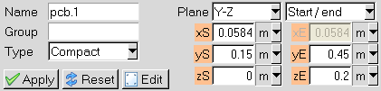

c. Specify the **Trace layer type** as **Detailed** and specify the parameters under **Trace layer para-** **meters** (make sure that you enter both columns) in the **Properties** tab as shown in Figure 3.8: The Printed circuit boards Panel (p. 60). Click the **Add layer** button 3 more times. There is a total of four internal layers.

**Note:**

Specify the layer thicknesses in microns.

Notice that the **Effective conductivity** in plane and normal directions are updated when you click the **Update**button (Figure 3.8: The Printed circuit boards Panel (p. 60)).

**Figure 3.8: The Printed circuit boards Panel**

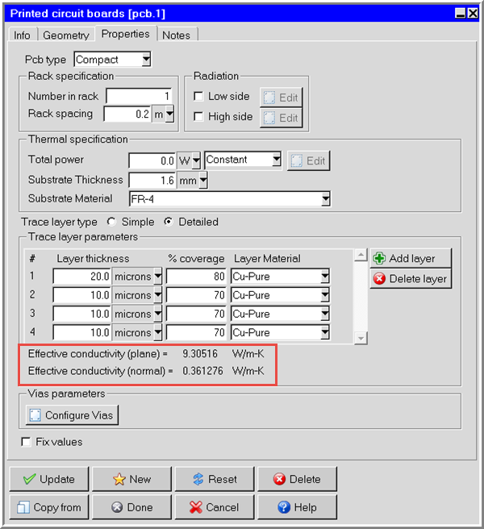

d. Click **Done** to close the **Printed circuit boards** panel.

6. Create the devices as 2D sources.

There are 12 devices on the bottom side of the PCB. Create these devices as 2D sources. The following steps show you how to create one and then use the copy utility to create the remaining 11 sources.

a. Click the **Create sources** icon (

) in the model toolbar to create a source and double-click the source object in the **Model manager** window.

b. Specify the following source name, dimensions, and properties.

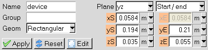

c. In the **Properties** tab, specify the **Total power** as **7** W (Figure 3.9: The Sources Panel (p. 62)) and click **Done**.

**Figure 3.9: The Sources Panel**

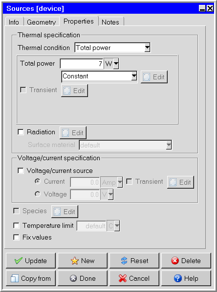

d. Create two copies of the source and separate them by 0.055 m in the Z direction. Follow the

steps below for copying the source object.

i. Right-click the source object and choose the **Copy** option. Alternatively, click the source object in the **Model manager** window and press **Ctrl**+**C** to bring up the **Copy** panel.

ii. Specify the **Number of copies** as **2**.

iii. Select the **Translate** option.

iv. Specify a **Z offset** of **0.055** m.

v. Click **Apply** to copy the object.

**Figure 3.10: The Copy source device Panel**

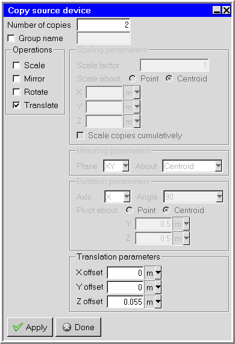

e. Similarly, create the other source objects (devices) by copying the sources created in the previous

steps.

i. Click and select device, then while holding down the **Ctrl** key, select device.1, and device.2. Right-click and choose the **Copy** option, or press **Ctrl**+**c**.

ii. Specify the **Number of copies** as **3**.

iii. Turn on the **Translate** option.

iv. Specify a **Y offset** of **0.064** m.

v. Click **Apply** to copy the object.

**Note:**

Following these two copy actions, you should now have 12 sources (Figure 3.11: Geo- metry with Devices (p. 64)) in a four rows by three columns pattern.

**Figure 3.11: Geometry with Devices**

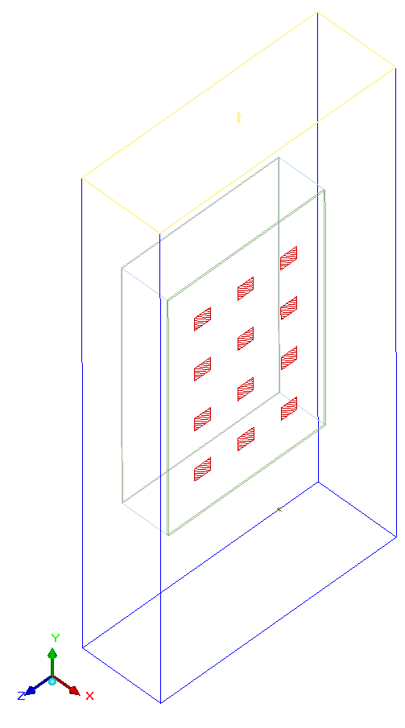

7. Create the heat sink.

You will create an extruded fin heat sink with the flow in the Y direction to remove heat from the PCB.

a. Click the **Create heat sinks** icon (

) in the **Model** toolbar to create a heat sink and double- click the heat sink object in the **Model manager** window. Specify the following dimensions in the geometry window.

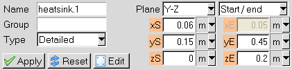

b. In the **Heat sinks** object panel, select the **Geometry** tab, and specify a **Base height** of **0.004**

m and an **Overall height** of **0.04** m.

c. Specify the properties of the heat sink as shown in Figure 3.12: The Heat sinks Panel (p. 65) below. Note that you are not changing parameters in the **Flow/thermal data**,**Pressure loss**, or **Interface** tabs.

**Figure 3.12: The Heat sinks Panel**

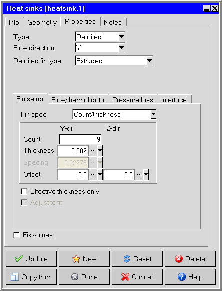

d. Click **Done** to close the **Heat sinks** panel.

8. Create the fan.

For this model, we will make use of Ansys Icepak’s fan library and search tool.

a. Select the **Library** tab in the model manager window (Figure 3.13: Search Fan library Panel (p. 67)).

b. Right-click **Libraries** in the **Model manager** window and choose **Search fans**.

The **Search fan library** dialog appears.

i. In the **Physical** tab, deactivate the **Min fan size** and enter **80** mm for the **Max fan size**.

ii. Select the **Thermal/flow** tab, enable the **Min flow rate** option and specify a **Min flow rate** of **80** cfm.

**Note:**

The minimum flow rate used in the search criteria implies the minimum free flow of the fans.

iii. Click the **Search** button.

**Note:**

Ansys Icepak lists all the fans in its libraries that satisfy these conditions.

c. Select the fan called delta.FFB0812_24EHE in the **Name** column by clicking it.

d. Click **Create** to load the fan into the model.

**Figure 3.13: Search Fan library Panel**

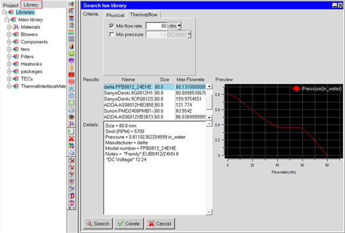

e. Now, specify the location of the fan. Resize the fan geometry as shown in Figure 3.14: The Fans

Panel (p. 68). Note the plane orientation is **X-Z**.

**Figure 3.14: The Fans Panel**

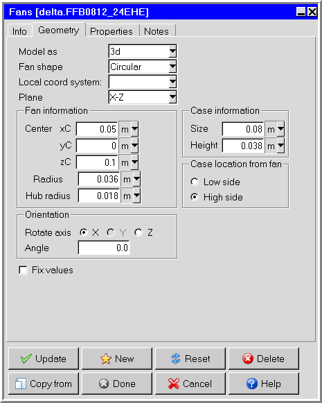

The final geometry should look like Figure 3.15: The Final Geometry (p. 69).

**Figure 3.15: The Final Geometry**

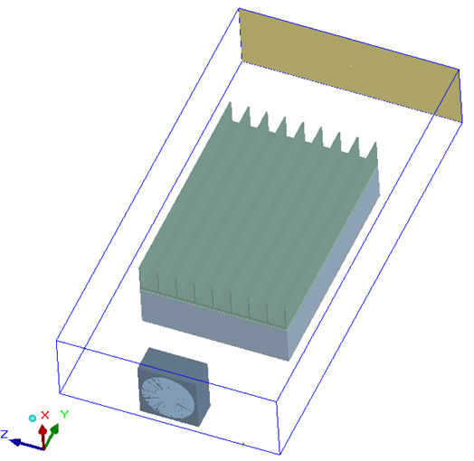

f. Display objects by type.

You can enable the display of all object types, the filtering of blocks by type (fluid, solid, network, hollow), and the display of blocks with traces and/or CAD block. This feature is useful here to view the otherwise unseen devices behind the heat sink. Generally, this also aids in model veri- fication.

i. **Model** **Show objects by type**

ii. The **Show objects by type** panel appears as shown in Figure 3.16: Show objects by type Panel (p. 70).

**Figure 3.16: Show objects by type Panel**

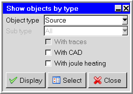

iii. Click **Display** to show the devices. The model then appears as in Figure 3.17: Displaying Objects

of Type Source (p. 70).

**Figure 3.17: Displaying Objects of Type Source**

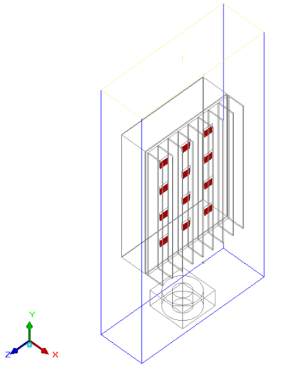

iv. Click **Close** to exit the **Show objects by type** panel.

g. Check the definition of the modeling objects to ensure that you specified them properly.

**View** **Summary (HTML)**

**Note:**

The HTML version of the summary displays in your web browser. The summary displays a list of all the objects in the model and all the parameters that have been set for each object. You can view the detailed version of the summary by clicking the appro- priate object names or property specifications. If you notice any incorrect specifications, you can return to the appropriate modeling object panel and change the settings in the same way that you originally entered them.

### 3.6. Step 3: Create Assemblies

For both organizational purposes and to have a finer mesh in the fan and enclosure, you will create two assemblies. The first assembly consists of the RF amplifier and heat sink; the second assembly consists only of the fan.

1. To create the amplifier assembly:

a. Select the **positive X** view by either using the icon in the shortcut menu or simply press **Shift**+**X** and then **S** to scale to fit the view in the graphics window.

b. While pressing **Shift**, drag a bounding box around the amplifier using the left mouse button.

Do not drag the bounding box around the fan. Release the mouse button and notice that all of the objects forming the amplifier and heat sink have been selected in the **Model manager** window.

c. Right-click the highlighted enclosure ("Housing") in the **Model manager** window and select **Create** and then **Assembly** from the list. You have now added all of the selected objects to the assembly.

d. In the **Object geometry window**, rename assembly.1 to amplifier and click**Apply**.

2. Create a new assembly for the fan object:

a. Click the **Create assemblies** icon (

) in the model toolbar to create a new assembly.

b. In the **Model manager** window, use the left mouse button to drag the fan,

delta.FFB0812_24EHE, into the new assembly to add the fan to this assembly.

c. In the **Object geometry window**, rename this assembly as fan and click **Apply**.

**Figure 3.18: Two Assemblies**

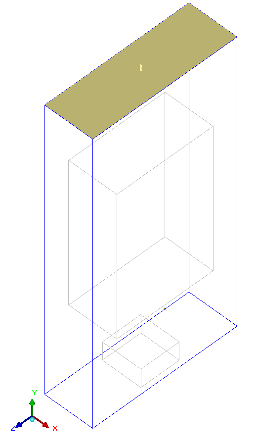

### 3.7. Step 4: Generate a Mesh

Before generating a mesh, specify the slack values for the assemblies.

**Note:**

**Slack** values represent a finite offset from an object to a **non-conformal** mesh boundary and are required when meshing assemblies separately. Selecting small slack values can decrease the total number of cells in the mesh with a negligible change in accuracy. On the other hand slack values that are too large may cause excessive mesh bleeding. It is good practice to set slack values such that two or three cells fit in the slack region. Note that in this particular model the gap between the two assemblies is large enough to accommodate nonzero slack values. Refer to Zero Slack with Non-Conformal Mesh- ing (p. 435) for more discussion on slack values.

1. Edit both assemblies (right-click the assembly name in the model toolbar and select **Edit**), then select the **Meshing** tab.

2. Toggle **Mesh separately** and then specify the slack values indicated in the following table. Make sure you remember to add slack values to *both* assemblies.

**Table 3.1: Slack Values for the Amplifier and Fan**

| Name | Min X | Min Y | Min Z | Max X | Max Y | Max Z |
| --- | --- | --- | --- | --- | --- | --- |
| Amplifier | 0 | 0.02 | 0.01 | 0 | 0.05 | 0.01 |
| Fan | 0.01 | 0 | 0.01 | 0.01 | 0.05 | 0.01 |

**Figure 3.19: Fan Assemblies Panel**

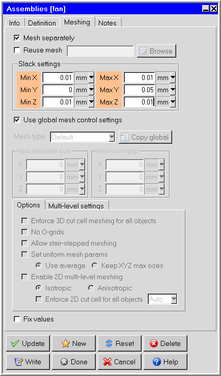

3. To create the mesh, go to **Model** **Generate Mesh**. The **Mesh control** panel (Figure 3.20: The Mesh control Panel (p. 75)) appears. You can also open the **Mesh control** panel by clicking the

**Generate mesh** icon (

) in the shortcut menu.

**Figure 3.20: The Mesh control Panel**

4. First, generate a coarse mesh by choosing **Coarse** in the **Mesh parameters** drop-down list in the **Global** tab, as shown in Figure 3.20: The Mesh control Panel (p. 75). Click **Generate** to create a mesh.

**Note:**

If you have unchecked **Allow minimum gap changes** in the **Misc** tab, the **Minimum** **separation** warning will appear. This warning message appears when the minimum gap specified is more than 10% of the smallest sized object in the model. Select **Change** **value and mesh** if the warning message pops up.

5. To view the mesh, display a plane cut view through the center of the cabinet, perpendicular to the fins (y-z plane).

6. To create a plane cut, follow these steps:

a. Click the **Display** tab at the top of the **Mesh control** panel.

b. Toggle **Display mesh** and **Cut plane**.

c. Under **Plane location**, set position to **X plane through center** in the drop-down list.

d. Press **Shift**+**X** to orient to the **positive X** direction and view the newly created cut plane.

e. Move the plane using the slider bar to see different views.

Make sure that the amplifier assembly is expanded and inspect the cells adjacent to the heat sink fins. Notice that the resolution is coarse (Figure 3.21: Coarse and Fine Mesh (p. 77)), with only a couple of cells between the fins. As the flow passes between the fins, the boundary layers will grow and their degree of resolution will dictate the accuracy of the simulation. You want to have at least three to four cells between the fins to adequately resolve the growth of the boundary layers. Refining the mesh results in better resolution.

7. Select **Normal** in the **Mesh parameters** drop-down list in the **Settings** tab. Click **Generate** and in- spect the resulting mesh. Note that this has increased the number of cells between adjacent fins (Figure 3.21: Coarse and Fine Mesh (p. 77)), providing better resolution of the boundary layers.

You can display the mesh on selected objects or the cut plane by using the context menu in the graphics window. To display the context menu, hold down the **Shift** key and press the right mouse button anywhere in the graphics window. Select **Display mesh** or **Display cut plane mesh** in the context menu and the mesh will be displayed on selected objects or the cut plane will be displayed.

It is also a good practice to select the **Quality** tab and review the **Face Alignment**,**Volume**, and **Skewness**. The histograms show the quality metric (Face Alignment, Volume or Skewness) versus the number of cells. Clicking the bars that form the histogram displays the cells with that value in the graphics window.

**Figure 3.21: Coarse and Fine Mesh**

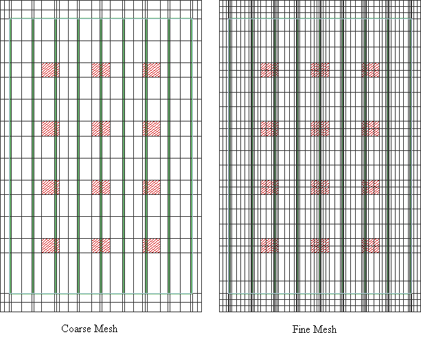

8. Once you have explored the mesh quality, click **Close** to dismiss the **Mesh control** dialog box.

### 3.8. Step 5: Physical and Numerical Settings

Before starting the solver, you will first review estimates of the Reynolds and Peclet numbers to check that the proper flow regime is being modeled.

1. Check the values of the Reynolds and Peclet numbers.

**Solution settings**

**Basic settings**

a. Click the **Reset** button (Figure 3.22: The Basic settings Panel (p. 78)).

**Figure 3.22: The Basic settings Panel**

b. Check the values printed to the **Message** window.

The Reynolds and Peclet numbers are approximately 55000.0 and 40000.0 respectively, so the flow is turbulent. Ansys Icepak recommends setting the flow regime to turbulent.

**Note:**

These values are only estimates, based on the current model setup. Actual values may vary, and may need to be verified, depending on your design.

c. Click **Accept** to save the solver settings.

2. Using the **Problem setup wizard**, enable turbulence modeling using the zero equation turbulence model and neglecting radiation heat transfer.

a. In the **Model manager** window, right-click **Problem setup** (

) and then select **Problem setup** **wizard**. Figure 3.23: Problem setup wizard panel at step 1 of 14 (p. 79) shows what appears. The **Problem setup wizard** provides a simple interface with user guidance for defining the physics of the model.

**Figure 3.23: Problem setup wizard panel at step 1 of 14**

b. For step 1 of 14, indicated in the bottom-left corner of the **Problem setup wizard** panel, keep

the default settings for the check boxes. Click **Next**.

c. For step 2 of 14, select **Flow is buoyancy driven (natural convection)** as in Figure 3.24: Problem setup wizard panel at step 2 of 14 (p. 80), since natural convection is not negligible inside the RF amplifier. Click **Next**.

**Figure 3.24: Problem setup wizard panel at step 2 of 14**

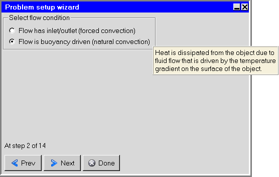

**Note:**

Hold your mouse pointer over any selection in the **Problem setup wizard** to have a text bubble appear for additional information on the selection, as shown in Fig- ure 3.24: Problem setup wizard panel at step 2 of 14 (p. 80).

d. For step 3 of 14, keep the default setting of **Use Boussinesq approximation** for the natural

convection model.

e. For step 4 of 14, keep the **Operating pressure** at the default value of **101325.0** N/m2. Select

**Set gravitational acceleration** and leave the default values for all directions, as shown in Fig- ure 3.25: Problem setup wizard at step 4 of 14 (p. 81). Click **Next**.

**Figure 3.25: Problem setup wizard at step 4 of 14**

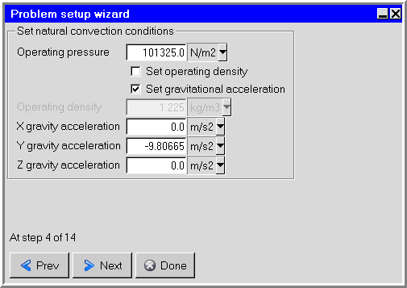

f. For step 5 of 14, select **Set flow regime to turbulent** to enable turbulence modeling, shown in Figure 3.26: Problem setup wizard at step 5 of 14 (p. 81). Click **Next**.

**Figure 3.26: Problem setup wizard at step 5 of 14**

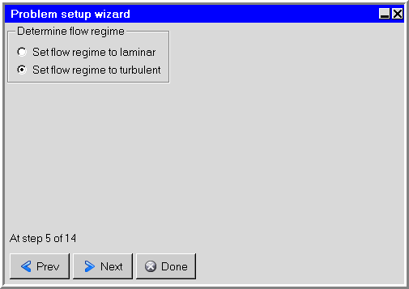

g. For step 6 of 14, select **Zero equation (mixing length)** to choose the zero equation turbulent

model, shown in Figure 3.27: Problem setup wizard at step 6 of 14 (p. 82). Click **Next**.

**Figure 3.27: Problem setup wizard at step 6 of 14**

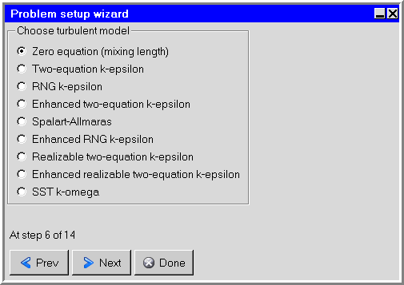

h. For step 7 of 14, turn off radiation by selecting **Ignore heat transfer due to radiation**. Click

**Next**.

i. For step 9 of 14, keep the check box clear to ignore solar radiation. Click **Next**.

j. For step 10 of 14, keep the default setting of **Variables do not vary with time (steady-state)** for steady-state simulation. Click **Next**.

k. For step 14 of 14, keep the check boxes clear to ignore altitude effects. Finally, click **Done** to finish the **Problem setup wizard**. These settings now fully define the problem setup.

**Note:**

You can edit these settings and other aspects of the problem setup by double-clicking

(

) **Basic parameters** in the **Model manager** window. Figure 3.28: Basic parameters panel (p. 83) shows the **Basic parameters** panel that appears.

**Figure 3.28: Basic parameters panel**

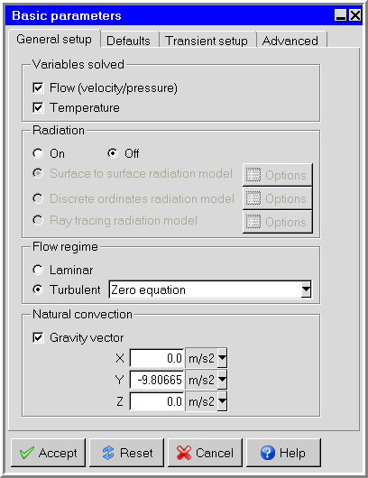

3. Return to the **Basic settings** panel, specify the number of iterations as **300**, click **Reset** and then **Accept** again.

4. Set up the temperature limits for all the sources.

**Model** **Power and temperature limits**

a. Figure 3.29: Panel of Power and temperature limit setup (p. 84) shows the required settings for the next few steps.

**Figure 3.29: Panel of Power and temperature limit setup**

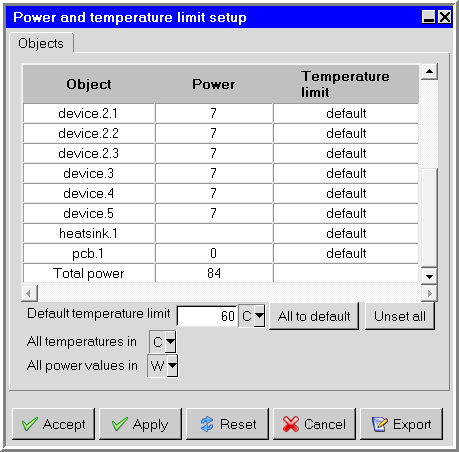

b. Enter a new value of **60** C for **Default temperature limit**.

c. Click **All to default**.

d. Click **Apply** and then click **Accept** to close the panel.

**Note:**

Ansys Icepak uses the default temperature limit during post-processing to identify components that exceed their limits or components that are close to this limit. Ansys Icepak does not use this value to solve the problem.

### 3.9. Step 6: Save the Model

Ansys Icepak will save the model for you automatically before it starts the calculation, but it is a good idea to save the model yourself as well. If you exit Ansys Icepak before you start the calculation, you will be able to open the job you saved and continue your analysis in a future Ansys Icepak session. (If you start the calculation in the current Ansys Icepak session, Ansys Icepak will simply overwrite your job file when it saves the model.)

**File** **Save project**

**Note:**

You can click the save button (

) in the **File commands** toolbar.

### 3.10. Step 7: Calculate a Solution

1. Create monitors.

**Note:**

It is good practice to monitor the solution progress for certain objects. Dragging the object in the **Model manager** window and placing it in the **Points** folder can accomplish this.

a. Drag device.2 and cabinet_default_side_maxY into the **Points** folder.

b. Right-click the cabinet_default_side_maxY in the **Points** folder.

c. Select **Edit** and deselect **Temperature** and select **Velocity** (Figure 3.30: The Modify point Panel (p. 85)).

d. Click **Done** to accept the modifications and to dismiss the per-object’s **Modify point** panel.

**Figure 3.30: The Modify point Panel**

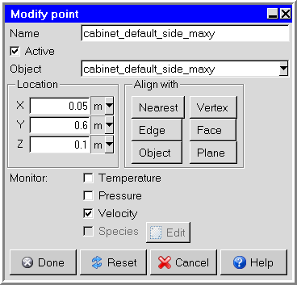

2. Start the calculation.

**Solve** **Run solution**

a. Since this particular example has neither radiation nor blocks with joule heating, ensure that you select **Disable radiation** and deselect **Disable varying joule heating**.

**Note:**

**Disable radiation** instructs Ansys Icepak not to calculate radiation parameters for the model. For cases in which your model has blocks with joule heating, only then should you select **Disable varying joule heating**. Otherwise, leave the option deselected. Refer to Using the Solve Panel to Set the Solver Controls in the Ansys Icepak User’s Guide for more information on the settings in the **Solve** panel.

b. Select **Write overview of results when finished** in the **Results** tab.

c. Click the **Start solution** button to start the solver. While iterating the solution, windows will appear showing convergence history, Figure 3.31: Convergence Plot (p. 87) and Figure 3.32: Mon- itor Plot - Temperature (p. 88).

**Note:**

Alternatively, you can click the **Run solution** icon (

) in the model and solve toolbar to display the **Run solution** panel.

**Figure 3.31: Convergence Plot**

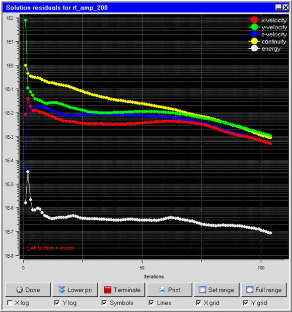

**Figure 3.32: Monitor Plot - Temperature**

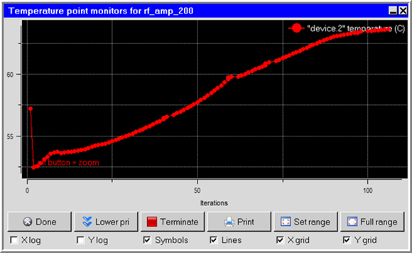

**Figure 3.33: Monitor Plot - Velocity**

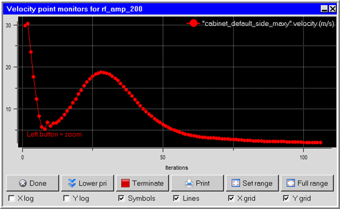

### 3.11. Step 8: Examine the Results

Once the model has converged (Figure 3.31: Convergence Plot (p. 87) and Figure 3.32: Monitor Plot - Temperature (p. 88)), Ansys Icepak automatically generates a solution overview report. This report contains detailed information, such as object-based mass and volumetric flow rates, fan operating points, heat flows for objects with specified power, heat flows for objects that communicate with the ambient, maximum temperatures, and overall balances.

Carefully review the solution overview and note that the solution satisfies conservation of mass and energy (scroll to the bottom of the report). Also note the fan operating point. The solution overview is automatically saved and can be reopened from **Report** **Solution overview** **Create**.

1. Compare the object temperature values for all sources with the temperature limits assigned.

**Post** **Power and temperature values**

The **Power and temperature limit setup** panel appears.

a. Click **Show too hot**.

The Power and Temperature limit setup show the default temperature limit and the resulting maximum temperature value for each source next to them.

If an assembly is expanded in the **Model manager** window and if the resulting temperature of any object exceeds the temperature limit specified, Ansys Icepak shows all the critical objects in red color.

b. Click **Accept** to close the dialog box.

2. Create object faces.

**Note:**

Ensure that the amplifier and fan assemblies are expanded, so that the fins are visible.

a. Press **Shift**+**Z** to orient the view in the **positive Z** direction.

b. To create an object face, click the **Object face** icon (

) in the shortcut toolbar.

c. In the **Object** drop down list, specify heatsink.1 as the object and click **Accept**.

d. Select **Show contours** and click the **Parameters** button (adjacent to **show contours**) to access

the **Object face contours** edit dialog box.

i. Select **This object** in the drop-box adjacent to **Calculated** to use the object-based range.

ii. Click **Done** to close the **Object face contours** panel.

e. Click **Done** to close the **Object face** panel.

**Note:**

You can also create contours on heatsink.1 by selecting this object in the **Model** **manager** window and right-clicking to display the context menu. Select **Create**>**Object** **face(s)**>**Separate** and the **Object face** panel will appear. The **Object face** panel is displayed for that particular object.

**Figure 3.34: Object face Panel**

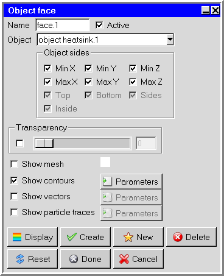

**Note:**

Using the mouse, rotate the heat sink to examine the surface temperature distribution. Notice that the location of the devices is clearly discernible on the bottom of the heat sink. Also note that the devices get progressively hotter in the flow direction (Fig- ure 3.35: Temperature Contours on the Heat Sink Object Face (p. 91)).

**Figure 3.35: Temperature Contours on the Heat Sink Object Face**

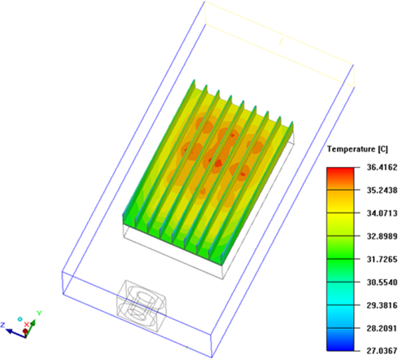

**Note:**

Notice that face.1 has now appeared in the **Model manager** window in the **Post-** **processing** folder. Right-click face.1 and note that you can make it active, edit it, or delete it. You can move face.1 into the **Inactive** folder by dragging and dropping face.1 within the **Model manager** window. You can make face.1 active again or delete it by dragging it to **Trash** or to the **Post-processing** folder, as well as with the right-click dialog.

3. Create plane cuts.

a. To create a plane cut, click the **Plane cut** icon (

) in the shortcut toolbar.

b. Select the **Set position** as **Point and normal** and select **Show vectors**, as shown in the panel

below. Enter **PX**,**PY**, and **PZ**, as well as **NX**,**NY**, and **NZ** according to Figure 3.36: Plane cut Pan- el (p. 92). You may also specify the point’s coordinates as **0.680** by using the slider at the bottom of the **Plane location** box in the same panel.

**Figure 3.36: Plane cut Panel**

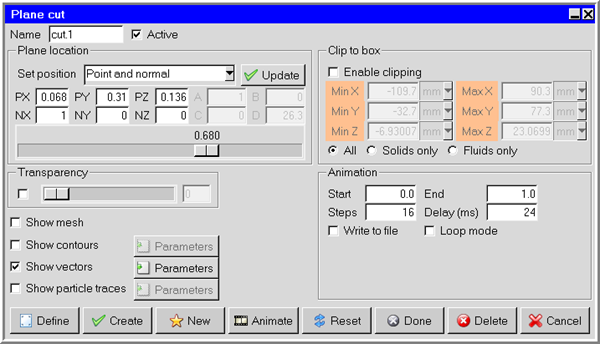

c. Click the **Parameters** button adjacent to **Show vectors**.

d. Select **Uniform** in **Display options** group box and specify value as **5000**. The **Uniform** option

for the velocity will uniformly place the vectors among the 5000 data points.

e. Select **This object** in the drop-box adjacent to **Calculated** and click **Done** to close the panel.

The vector plots are shown in the graphics window (Figure 3.37: Plane Cut of Velocity Vector Field (p. 93)).

**Figure 3.37: Plane Cut of Velocity Vector Field**

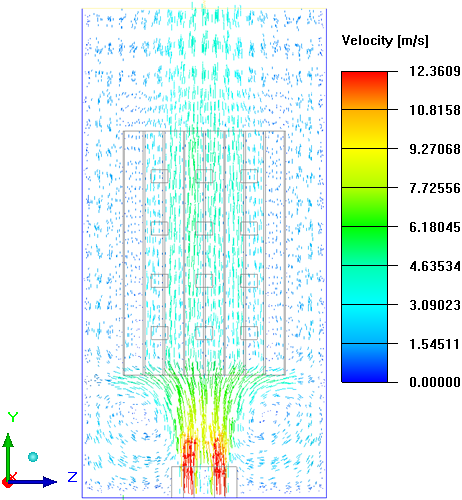

**Note:**

Examining the vector plot, we can see that the flow pattern is symmetric, with two large recirculating zones adjacent to the fan. Zoom into the region directly in front of the fan and notice that two smaller recirculating zones exist in front of the hub. These local effects can be important when objects are close to the hub region.

**Note:**

You can move a plane cut through a model by pressing the **Shift** key, holding down the middle mouse button on an edge of the plane cut and dragging the plane cut through the model in the graphics window.

4. Create isosurfaces.

a. Click the **Isosurface** icon (

) in the shortcut toolbar.

b. Specify **Temperature** as the **Variable**, input a **Value** of 55°C, and select **Show contours** and

click **Parameters**. In the **Isosurface contours** panel, select **Smooth** for **Shading options** and **This object** in the drop-box adjacent to **Calculated**. Click **Done**.

c. Click **Update** in the **Isosurface** panel and notice that an isosurface has been placed around all of the sources, indicating that they have temperatures equal to 55°C (Figure 3.38: Temperature Isosurface Contour of 55°C for Sources (p. 94)).

**Figure 3.38: Temperature Isosurface Contour of 55°C for Sources**

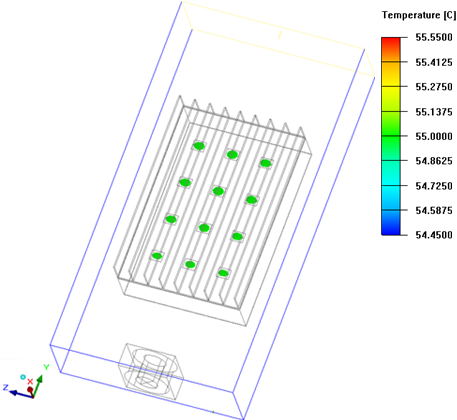

d. Now, change the **Variable** to **Speed** and input a **Value** of 4. Click **Update**. Notice that the regions

with velocities in excess of 4 m/s are now displayed (Figure 3.39: Temperature Contours on Isosurface of Speed 4 m/s (p. 95)).

**Figure 3.39: Temperature Contours on Isosurface of Speed 4 m/s**

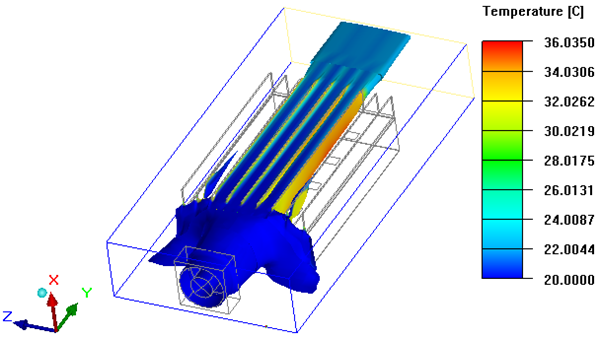

5. Utilize the **Transparency** slider to help visualize multiple post-processing objects simultaneously.

a. With the previously created isosurface still active, select the plane cut (cut.1) in the **Model** **manager** window and select **Active** to make it visible again.

b. Edit iso.1. Select the **Transparency** check box, shown in Figure 3.40: Isosurface Panel with

Transparency Enabled (p. 95). Set the value to **0.63**.

**Figure 3.40: Isosurface Panel with Transparency Enabled**

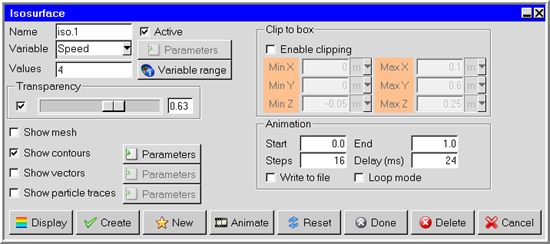

c. Click **Done** to show the isosurface and plane cut simultaneously (Figure 3.41: Concurrent Visual- ization of Semi-Transparent Isosurface and Opaque Plane cut (p. 96)). Notice the semi-transparency of the isosurface allows the concurrent visualization of the opaque velocity flow field near the fan.

**Figure 3.41: Concurrent Visualization of Semi-Transparent Isosurface and Opaque Plane** **cut**

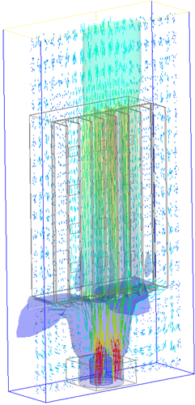

**Note:**

You can access the **Transparency** slider in the following post-processing objects: **Object face**,**Plane cut**, and **Isosurface**.

6. Create a summary report of object-specific solution data.**Summary reports** can provide physical information from the solution about specific **Model** objects,**Groups** objects,**Post-processing** objects and **Points** objects. Follow the steps below to create a summary report:

a. First, make the post-processing object **face.1** active again by accessing the context menu under the **Inactive** node in the **Model manager** window.

b. **Report** **Summary report**

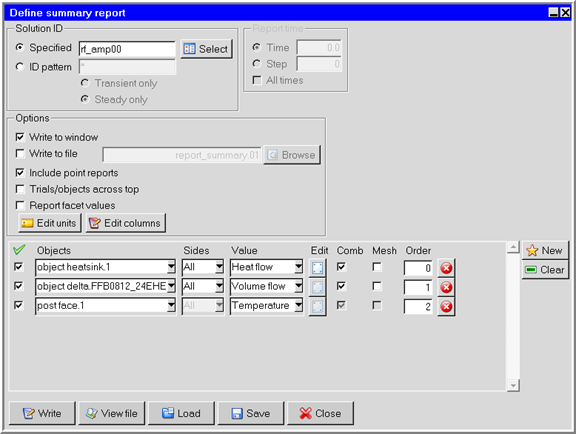

c. Click **New** in the **Define summary report** panel three times to create 3 rows of **Objects**.

d. In the first row, select **object heatsink.1**, then click **Accept**. In the **Value** drop-down menu, select

**Heat flow**.

**Note:**

Although you did not change the default settings of the check boxes **Comb** and **Mesh**, you may encounter projects in which you need to change these.**Comb** refers to “combined”: The report generates a single, combined value for all the sides selected; deselecting the option would report the side values separately.**Mesh** allows you to report on the reduced mesh of the selected object in the case that an object intersects with other objects and the mesh in the intersecting region might not necessarily be- long to the object of interest.

e. In the second row, select the fan,**object delta.FFB0812_24EHE**, then click **Accept**. In the **Value**

drop-down menu, select **Volume flow**.

f. In the third row, select **post face.1**, then click **Accept**. In the **Value** drop-down menu, select **Temperature**.

g. Click **Write** to generate a panel for the object summary report (Figure 3.42: Report summary data

Panel (p. 98)). Examine the values reported and confirm they are consistent with the physics of the model. Click **Done** to exit out of this panel, then **Close** to exit the **Define summary report** panel.

**Figure 3.42: Report summary data Panel**

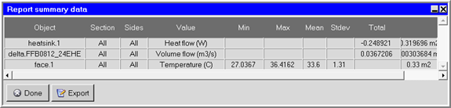

7. Create variation plots.

a. Click the **Variation plot** icon (

) in the shortcut toolbar.

**Note:**

Before creating the variation plots, ensure that the amplifier assembly is expanded, so that the fins are visible. Next, press **Shift**+**Z** to orient the view in the **positive Z** direction.

b. Within the variation plot dialog box, complete the following:

i. Specify the **Variable** as **UY**.

ii. Click the **From screen** button.

iii. Click the center of the heat sink fins.

iv. Click **Create**.

c. An X-Y plot of UY velocity versus Z coordinate is now visible (Figure 3.43: Variation Plot of UY Velocity Versus Z Coordinate (p. 99)). Toggle the **Symbols** button and notice that the velocity profile across the solution domain is represented with a solid line at the post-processing locations. Notice that Ansys Icepak creates a locally colored line according to the UY velocity magnitude, seen in the graphics window.

**Figure 3.43: Variation Plot of UY Velocity Versus Z Coordinate**

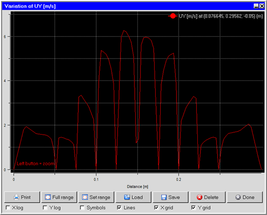

d. Save the X-Y plot.

i. Click the **Save** button at the bottom of the **Variation of UY** plot window.

ii. Enter a file name in the resulting **Save curve** dialog box.

iii. Click **Save** to save the file in the model folder.

### 3.12. Step 9: Summary

In this tutorial, you have learned about the basic usage of enclosure, PCB, source and heat sink objects to create an RF amplifier. You have also learned how to use Ansys Icepak’s fan library and search tool. Furthermore, this tutorial has introduced you to evaluating mesh quality as well as non-conformal meshing to reduce cell count and computational cost.

You have now learned the basic workflow of an Ansys Icepak project, including model building, mesh generation, problem setup, solution calculation, and post-processing as well essential features and functions that you will likely use in later tutorials or your own projects.

We repeat some of the tips and best practices found in this tutorial for your convenience:

1. Best Practices

a. Check the default materials, properties, and operating conditions under the **Defaults** tab in the

**Basic parameters** panel. These defaults often render some specifications unnecessary.

b. Use the alignment and morph tools to position objects based on other existing objects. This can

be faster than specifying object dimensions and coordinates in many situations.

c. Use the **Show objects by type** feature to verify your model objects by type.

d. View the HTML summary report (**View** **Summary (HTML)**) to ensure proper specification of geometries, properties, and materials for each object.

e. Reduce mesh counts and consequently decrease run times in regions requiring less resolution

by creating separately meshed assemblies when appropriate. Also select suitable slack values that improve the convergence rate while avoiding mesh bleeding.

f. Select the **Allow minimum gap changes** option in the **Misc** tab of the **Mesh control** panel to allow Ansys Icepak to avoid unnecessary meshing due to inadvertent misalignments in the model. This is suitable for this tutorial but may not be in other projects.

g. Ensure that you have at least three to four cells between fins to resolve adequately the boundary

layers between them by visually inspecting the mesh. Refine the mesh as necessary by using **Normal** meshing.

h. Evaluate your mesh quality under the **Quality** tab in the **Mesh control** panel.

i. Use the **Problem setup wizard** for guided problem setup. Edit the problem setup if needed

using the

**Basic parameters** panel.

j. Judge convergence by monitoring residual levels as well as relevant integrated quantities for certain objects with point monitors, which should eventually stop changing significantly with more iterations.

2. Tips and Tricks

a. Explore the several methods to complete a task as you work through a problem in Ansys Icepak. For example, you can edit model object geometries by using their object edit panel, or you can use the **Edit** window in the bottom right-hand corner while having the object node selected in the **Model manager** window. Use the options best suited for you to help streamline your workflow.

b. Cycle through all possible edges in the**Morph edges** mode by repeatedly clicking the left mouse

button. This is useful in case you have difficulty selecting an edge.

c. Remove object names by clicking the **Display object names** button (

) to reduce visual clutter in the graphics window.

d. Highlight critical regions using the **Power and temperature limits** feature (**Model** **Power** **and temperature limits**) to designate maximum power and temperature, which can then be highlighted in the graphics window after the solution calculation (**Post** **Power and temper-** **ature values**). Note that setting these limits does not affect how Ansys Icepak calculates the solution.

e. Use the **Reset** button in the **Basic settings** panel to have Ansys Icepak estimate dimensionless

numbers (for example, the Reynolds and Peclet numbers for forced convection) and determine the appropriate flow regime.

f. Hold your mouse pointer over any selection in the **Problem setup wizard** to have a text bubble appear for additional information on the selection.

g. Use the **Transparency** slider in the post-processing object edit panels to improve visualization

of post-processing objects.

h. Move a plane cut through a model by pressing the **Shift** key, holding down the middle mouse

button on an edge of the plane cut and dragging the plane cut through the model in the graphics window.

i. Expand all of your assemblies quickly by right-clicking

**Model** in the **Model manager** window then selecting **Expand all**.

---

## Chapter 4: Use of Parameterization to Optimize Fan Location

### 4.1. Introduction

The purpose of this tutorial is to demonstrate Ansys Icepak parametric and optimization features with the help of a small system-level model.

In this tutorial, you will learn how to:

• Use network blocks as one way of modeling packages.

• Specify a contact resistance using side specifications of a block object.

• Define a variable as a parameter and solve the parametric trials to optimize your model for maximum performance.

• Specify fan curves and dynamically update them.

• Use local coordinate systems.

• Generate a summary report for multiple parametric solutions.

The tutorial will guide you through the usual workflow with additional steps specific to this exercise: creating a project, building the model, creating separately meshed assemblies, generating a mesh, setting up parametric trials, creating point monitors, problem setup, calculating solutions, post-processing, as well as an additional exercise to model the effects of higher altitude on the system.

**Note:**

Mesh counts and solution results may differ slightly due to enhancements to the meshing algorithm and Fluent solver, respectively.

### 4.2. Prerequisites

This tutorial assumes that you have little experience with Ansys Icepak, but that you are generally famil- iar with the interface. If you are not, review Sample Session in the Icepak User’s Guide and the Finned Heat Sink (p. 5) tutorial in this guide as some of the steps that were discussed in these tutorials will not be repeated here.

### 4.3. Problem Description

The system-level model consists of a series of IC chips on a PCB. A fan is used for forced convection cooling of the power dissipating devices. A bonded fin extruded heat sink with eight 0.008 m thick fins is attached to the IC chips. The fan flow rate is defined by a nonlinear fan curve. The system also consists of a perforated thin grille. A study is carried out for the optimum location of the fan by using the parameterization feature in Ansys Icepak.

**Figure 4.1: Schematic of the Geometry**

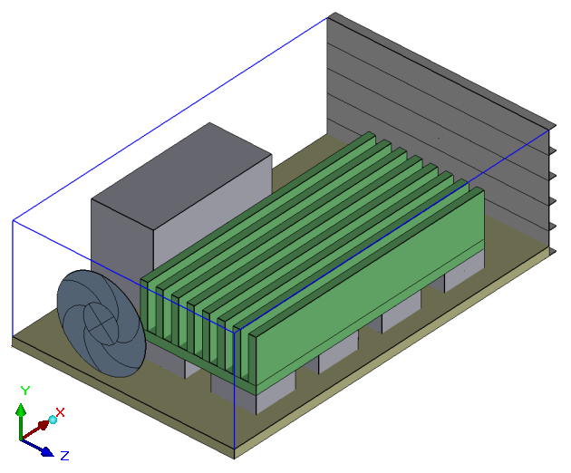

### 4.4. Step 1: Create a New Project

1. Start Ansys Icepak, as described in Starting Ansys Icepak in the Icepak User’s Guide.

When Ansys Icepak starts, the **Welcome to Icepak** panel opens automatically.

2. Click **New** in the **Welcome to Icepak** panel to start a new Ansys Icepak project.

3. Specify a name for your project (for example,**fan_locations**) and click **Create**.

Ansys Icepak creates a default cabinet with the dimensions 1 m 1 m 1 m, and displays the cabinet in the graphics window. You will modify this cabinet in the next section.

### 4.5. Step 2: Build the Model

1. Resize the default cabinet.

The cabinet forms the boundary of your computational model. Press the isometric view icon (

) for a 3D view. Select **Cabinet** in the **Model manager** window and enter the location values as shown in the geometry window below. The geometry window can be found in the lower right hand corner of the GUI.

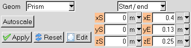

2. Create the Fan.

Click the **Create fans** icon (

) in the object toolbar next to the **Model manager** window to create a 2D intake circular fan on one side of the cabinet. Change the plane to **yz** and enter the location values shown in the geometry window below:

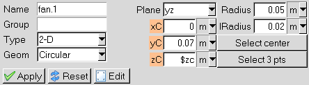

• Defining a parameter for multiple trials.

One of the objectives of this exercise is to parameterize the location of the fan. To create a para- metric variable in Ansys Icepak, input a $ sign followed by the variable name. Thus, to create the parametric variable “zc”, type $zc in the **zC** box in addition to the other location values, and click **Apply**. When Ansys Icepak asks you for an initial value of "zc", enter an initial value of 0.1, and click **Done**.

**Figure 4.2: The Param value Panel**

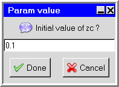

We will now set the physical properties that will define the fan behavior:

a. Edit the fan object and go to **Properties** tab.

b. In the **Properties** tab, retain the selection of **Intake** for **Fan type** and select **Non-linear** in the

**Fan flow** tab.

c. Enter the characteristic curve by clicking on the **Edit** button and selecting **Text Editor** in the drop-down list in the **Non-linear curve** group box.

**Figure 4.3: The Fans Panel (Properties Tab)**

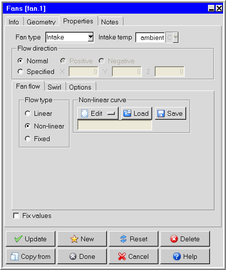

d. First change the units of the volume flow rate and pressure according to the units in

Table 4.1: Values for the Curve Specification Panel (p. 106) and enter the values in pairs with a space between them in the **Curve specification** panel.

**Table 4.1: Values for the Curve Specification Panel**

| Volume Flow (CFM) | Pressure (in water) _ |
| --- | --- |
| 0 | 0.42 |
| 20 | 0.28 |
| 40 | 0.2 |
| 60 | 0.14 |
| 80 | 0.04 |

0.0 90

**Note:**

Pay attention to the two zero values in Table 4.1: Values for the Curve Specification Panel (p. 106). In general, you should start a fan curve specification with a zero flow rate and end the specification with a zero pressure.

e. Click **Accept** to close the form.

f. Select the **Edit** button again in the **Non-linear curve** group box and click **Graph Editor** in the drop-down list to view the fan curve (Figure 4.4: The Fan Curve Panel (p. 107) ).

**Figure 4.4: The Fan Curve Panel**

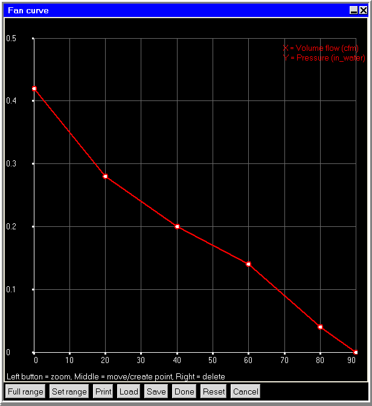

g. Click **Done** to close the **Fan curve** panel.

h. In the **Properties** tab under the **Swirl** tab, located next to the **Fan flow** tab, set the **RPM** of the

fan to 4000.

i. In the **Properties** tab, set the **Operating RPM** of 2000 in the **Options** tab, located next to the **Swirl** tab.

**Note:**

The **RPM** under the **Swirl** tab specifies the nominal RPM of the fan from the existing fan curve. The **Operating RPM** in the **Options** tab is a working RPM value used in conjunction with the nominal RPM to dynamically scale and update the fan curve according to the fan laws. The nominal RPM can also be used to compute the swirl factor. Refer to Chapter 21: Fans in the User’s Guide for more information regarding fan objects.

j. Click **Update** and **Done** to close the fan window.

Now the model looks as shown in Figure 4.5: Model with Fan (p. 108).

**Figure 4.5: Model with Fan**

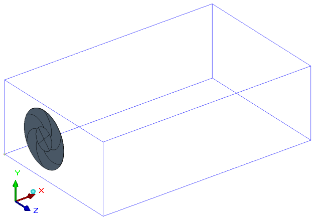

**Note:**

The shading of the fan object can be changed by changing the **Shading** option under the **Info** tab to change the shading of just that object, or by leaving it as **default** and changing the default shading option by going to **View** **Default shading** to change the shading of all objects that have **default** shading selected.

3. Set up a grille.

a. Click the **Create grille** icon (

) for creating a new grille, set its plane to **Y-Z**. Then, using the **Morph faces** (

) option move the grille to the max-X face of the cabinet. After clicking the icon (

), the graphics display window presents step by step instructions on how to use the **Morph** **faces** option. Alternatively, you can use the coordinates shown in the geometry window below:

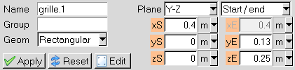

b. Now define properties for the grille by clicking the **Properties** tab.

**Note:**

This is a 50% open perforated thin grille.

i. For the **Velocity loss coefficient**, keep the default selection of **Automatic**.

ii. Specify a **Free area ratio** of 0.5.

**Note:**

The free area ratio is the ratio of the area through which the fluid can flow unobstructed to the total planar area of the obstruction. Ansys Icepak calcu- lates the loss coefficient of the grille based on the free area ratio. Different resistance types govern the method of calculation. See Pressure Drop Calcu- lations for Grilles in the User’s Guide for more information on the free area ratio and the various pressure drop calculation methods.

iii. Retain **Perforated thin vent** for the **Resistance type**. Refer to Figure 4.6: Grille Panel (Prop-

erties Tab) (p. 110) for the correct settings.

**Figure 4.6: Grille Panel (Properties Tab)**

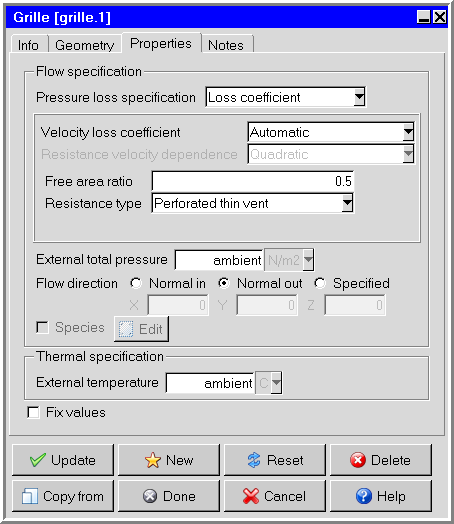

iv. Click **Update** and then **Done** to close the panel.

For more details on loss coefficient data, refer to *Handbook of Hydraulic Resistance*, by I. E. Idel'chik.

The model looks as shown in Figure 4.7: Model with Fan and Grille (p. 111).

**Figure 4.7: Model with Fan and Grille**

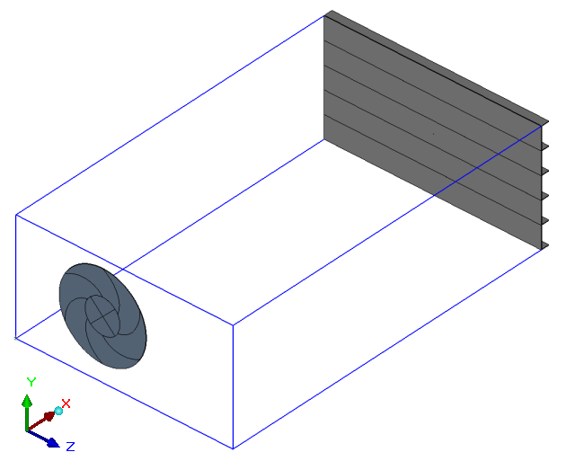

4. Set up a wall.

**Note:**

The model includes a 0.01 m thick PCB that touches and covers the entire min-Y floor

of the cabinet. The PCB is exposed to the outside with a known heat flux of 20 W/m2. In order to consider the heat flux, we will use a wall object to simulate the PCB.

a. Click the **Create walls** icon (

) to create a new wall. We will define the geometry and physical parameters for the wall object:

i. Make the plane **X-Z**.

ii. Use the **Morph faces** icon (

) from the model toolbar to align the wall object with the entire min-Y floor of the cabinet.

**Note:**

If you have difficulty selecting faces, try clicking near the edge of a face. Clicking correctly should highlight the entire face in red.

iii. Edit the **Wall** object and go to **Properties** tab.

iv. In the **Material** group box, set the **Wall thickness** to 0.01 m and the **Solid material** to **FR-**

**4**.

v. In the **Thermal specification** group box, specify a **Heat flux** of **20** W/m2. See Figure 4.8: Walls Panel (Properties Tab) (p. 112) for the correct settings.

**Figure 4.8: Walls Panel (Properties Tab)**

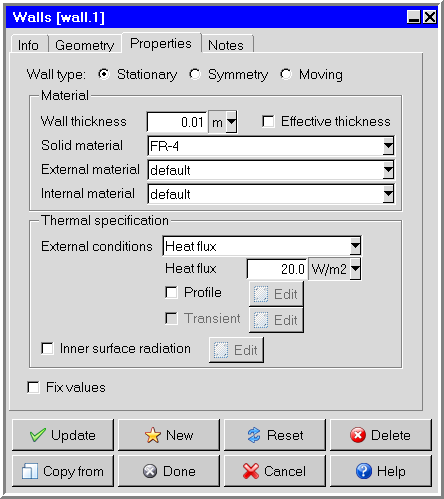

vi. Click **Update** and then **Done** to close the panel.

After creating the wall, the model looks as shown in Figure 4.9: Model with Wall Added (p. 113).

**Figure 4.9: Model with Wall Added**

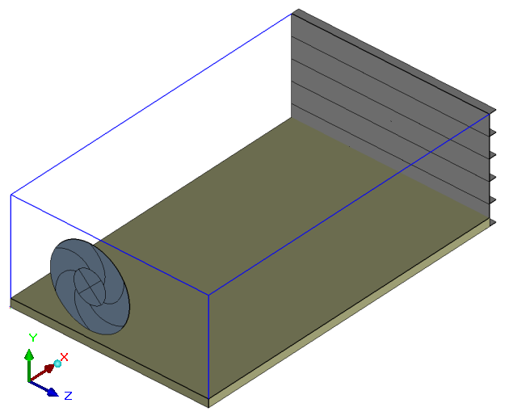

5. Create blocks.

In this step, you will create several types of blocks to represent different physics.

• Creation of Solid Blocks

Now, create four blocks that dissipate **5** W each and have a contact resistance of 0.005 C/W on their bottom faces.

a. Create a new block (

) , and retain the **Type** as **solid** and **Geom** as **Prism**. Enter the location values shown in the panel below:

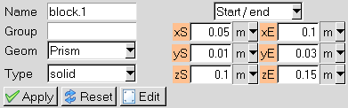

b. Edit the block and specify the following in the **Properties** tab:

i. In the **Surface specification** group box, click the **Individual sides** check box and click **Edit** (Figure 4.10: The Individual side specification (p. 114)).

A. Select **Min Y** and toggle **Thermal properties** and **Resistance**.

B. Under **Thermal condition**, retain the selection of **Fixed heat** and **Total power** of 0

W.

C. Select **Thermal resistance** from the drop-down menu next to **Resistance**.

D. Set **Thermal resistance** to **0.005** C/W.

E. Click **Accept** to close the panel.

**Figure 4.10: The Individual side specification**

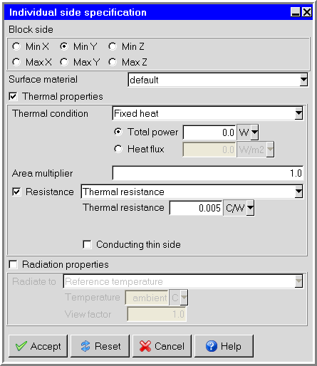

ii. In the **Thermal specification** group box in the **Properties** tab, retain the selection of **de-** **fault** for **Solid Material** (you can also select **Al-Extruded** which is the default).

iii. Set **Total Power** to 5 W.

iv. Click **Update** and **Done** to close the panel.

c. Next, make three copies of this block with an **X offset** of 0.08 m.

**Note:**

The previous tutorial showed you how to make a copy of an object.

**Figure 4.11: Creation of Solid Blocks**

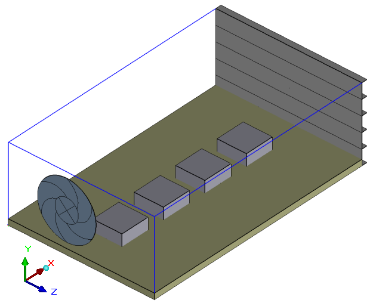

• Creation of Network blocks

Create four IC chips in the form of network blocks. To create a network block, create a **Block** object and change the block type to **Network** in the **Properties** tab. Each network block has junction- to-board, junction-to-case, and junction-to-sides thermal resistances. The values of these resistances are known beforehand.

a. Add a new block, and position it as shown in the panel below:

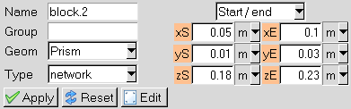

b. Edit the block to change the properties of this block:

– Ensure that the **Block type** is set to **Network**.

– Toggle **Star Network**.

→Enter the **Network parameters** as shown in Figure 4.12: The Properties Panel (p. 116).

**Figure 4.12: The Properties Panel**

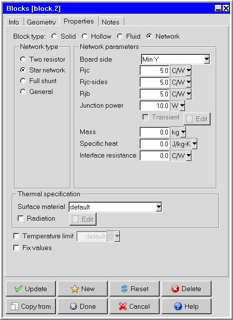

c. Now make three copies of this network block with an **X offset** of 0.08 m. This finishes the creation of the network blocks.

• Creation of a Hollow Block

**Note:**

Finally, to cut out a section of the cabinet from the computational domain, create a hollow block. This represents a region that does not directly affect heat transfer via solid conduction but that does, however, alter the flow patterns surrounding this region.

a. Create a new **Block**. Set the **Block type** as **Hollow**.

b. In the **Geometry** tab, go to the **Local coord system** drop-down menu.

c. Select **Create new** to open the **Local coords** panel.

d. Enter **X offset** = 0.1,**Y offset** = 0,**Z offset** = 0.

e. Click **Accept**. This is just to demonstrate the use of local coordinate system.

f. Further, size the block as follows:

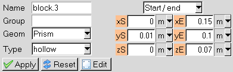

6. Now we will create the detailed heat sink. The heat sink base acts as a heat spreader for all the chips.

a. Click the **Create heat sinks** icon (

) and edit it. In the **Properties** tab, select **Detailed** in the **Type** drop-down menu. Entering its location and properties as shown in the following table:

**Table 4.2: Heatsink Properties**

| Geometry |  |
| --- | --- |
| Plane: | X-Z |
| xS / xE: | 0.05/0.34 |
| yS / yE: | 0.03/— |
| zS / zE: | 0.1/0.23 |
| Base height: | 0.01 m |
| Overall height: | 0.06 m |
| Properties |  |
| Type: | Detailed |
| Flow Direction: | X |
| Detailed Fin type: | Bonded fin |
| Fin setup |  |
| Fin spec: | Count/thickness |
| Count: | 8 |
| Thickness: | 0.008 m |
| Flow/thermal data |  |
| Fin material: | default |
| Base material: | Cu-Pure |

| Interface |  |
| --- | --- |
| Fin bonding: | Click the Edit button |
| Effective thickness: | 0.0002 m |
| Solid material: | default |

b. Click **Update** and **Done**. This completes the model building process. The complete model should

look like that shown in Figure 4.13: Final Model (p. 118).

**Figure 4.13: Final Model**

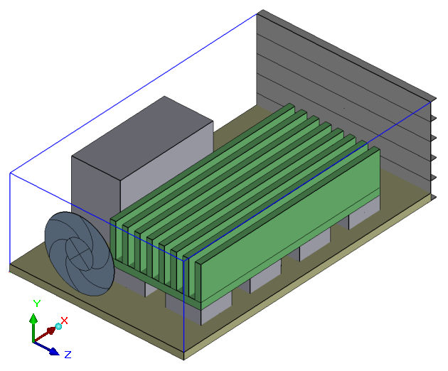

7. Check the definition of the modeling objects to ensure that you have specified them properly.

**View** **Summary (HTML)**

The summary report now appears in a web browser. The summary displays a list of all the objects in the model and all the parameters that have been set for each object. You can view the detailed version of the summary by clicking the appropriate object names or property specifications. If you

notice any incorrect specifications, you can return to the appropriate modeling object panel and change the settings in the same way that you originally entered them.

**Note:**

The summary report also shows the user-specified material properties for each of the objects to help identify the proper material specifications. Figure 4.14: Partial Table of Summary Report for Blocks (p. 119) shows the summary report for **block.1**, which includes its material specifications.

**Figure 4.14: Partial Table of Summary Report for Blocks**

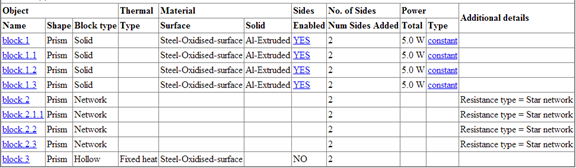

### 4.6. Step 3: Creating Separately Meshed Assemblies

One of the key aspects of modeling is to use a mesh with good quality and sufficient resolution for the model. We need to have a fine mesh in the areas where temperature gradients are high or flow is turning. Having too coarse of a mesh will not give you accurate results and having too fine a mesh may lead to longer run times. The best option is to explore the model carefully and look for opportunities to reduce mesh counts in the areas where the gradients are not steep. Creating non-conformal assemblies gives required accuracy along with reduced mesh count. Select a set of objects to create assemblies. Also decide suitable slack values for assembly bounding box. Your selection can be reviewed in the section below where we will create non-conformal meshed assemblies.

We will now create two non-conformal meshed assemblies.

1. To create the first assembly, first highlight all the blocks (except the hollow block) and the heat sink object in the **Model manager** window, then right-click them and choose **Create** and then **Assembly**.

2. Right-click and select **Rename** from the menu. Rename the assembly, as **Heatsink-packages-asy**.

3. To build the "bounding box" for the assembly called **Heatsink-packages-asy**, double-click it to edit the assembly.

4. In the **Meshing** tab of the **Assemblies** panel, toggle **Mesh separately**, and then set the **Slack** parameters as the following:

**Table 4.3: Slack Values for Heatsink-packages-asy Assembly**

**0.015** m **Max X** **0.005** m **Min X**

| Min Y | 0.005 m | Max Y | 0.005 m |
| --- | --- | --- | --- |
| Min Z | 0.005 m | Max Z | 0.005 m |

**Note:**

• Note that for the Heatsink-packages-asy, we have set a bounding box that is 0.005 m bigger than the assembly at five sides except **Max X** where the slack is defined higher (0.015 m) to capture the wake region of the flow.

5. Click **Update** and **Done** to complete the bounding box specifications for the assembly.

Following the same procedure above, create one more assembly for the fan object (name it **Fan-** **asy**). Use the following table to assign the **Slack** values for the **Fan-asy** assembly.

**Table 4.4: Slack Values for Fan-asy Assembly**

| Min X | 0 m | Max X | 0.005 m |
| --- | --- | --- | --- |
| Min Y | 0.002 m | Max Y | 0.002 m |
| Min Z | 0.002 m | Max Z | 0.002 m |

### 4.7. Step 4: Generate a Mesh

To generate the mesh:

1. Open the **Mesh control** panel, keep the default values for the mesh settings and ensure that **Mesh** **assemblies separately** is selected.

2. Click **Generate**. You may get a warning about minimum separation if the **Allow minimum gap** **changes** option is deselected in the **Misc** tab.

**Note:**

This warning appears because the **Minimum gap** (separation), which is like a tolerance setting for the mesher, is larger than 10% of the smallest feature in the model. When there are objects smaller than the mesher tolerance, those objects will not be meshed correctly. To avoid this, you need to change the value to modify the minimum gap to 10% of the smallest object. The prompt window that appears allows you to do this with the **Change value and mesh** option. This option is used for this particular tutorial and may not be applicable all the time. As the mesh separation setting is a useful tool designed to avoid unnecessary meshing due to inadvertent misalignments in the model (without modifying the geometry), we may use other options suitable to the model.

3. Click **Change value and mesh**.

4. Examine the mesh by taking plane cuts in all directions under the **Display** tab.

5. Go to the **Mesh control** panel, click the **Quality** tab and examine **Face alignment** (Figure 4.15: Graph of Face alignment (p. 121)). Due to differences among different machines, your numbers may not be exactly the same as those of Figure 4.15: Graph of Face alignment (p. 121).

**Figure 4.15: Graph of Face alignment**

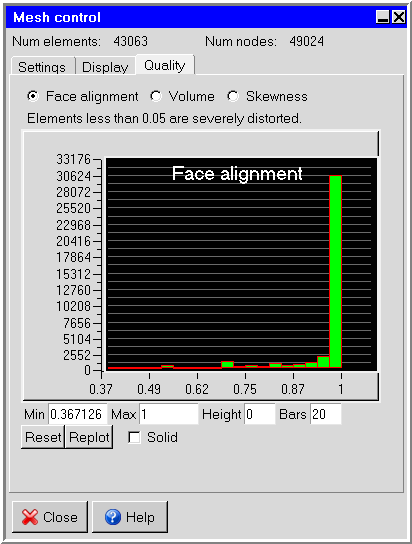

**Note:**

Recall from previous examples that Figure 4.15: Graph of Face alignment (p. 121) is a graph of cell number versus face alignment. For more information on face alignment as a measure of mesh quality, see Checking the Face Alignment from the Icepak User’s Guide.

6. Click **Close** when you are done.

### 4.8. Step 5: Setting up the Multiple Trials

Before we start solving the model, we will set up the parametric trials for the fan location parameter "zc".

1. Go to the **Solve menu** and select **Define trials**.

a. The **Parameters and optimization** panel pops up.

b. Toggle **Parametric trials** in the **Setup** tab.

c. Select the **Design variables** tab and next to **Discrete values**, type **0.165** following **0.1**, separ- ated by a space as shown in the Figure 4.16: The Parameters and optimization Panel (Design variables Tab) (p. 122):

**Figure 4.16: The Parameters and optimization Panel (Design variables Tab)**

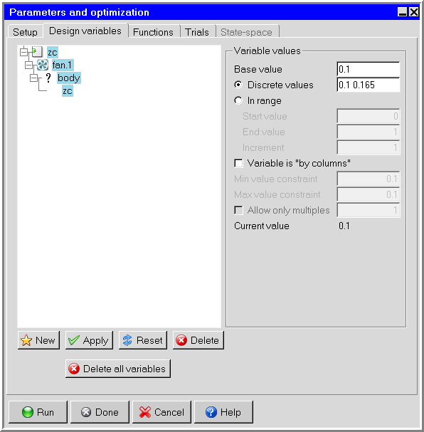

d. Click **Apply**.

**Note:**

After the first trial has been completed, Ansys Icepak has the option of starting the fol- lowing trial(s) from the default initial conditions specified in **Problem setup** panel, or from the solution(s) of the trial run(s) that have completed.

For this model, next go to the **Trials** tab and ensure the **Restart ID** is blank for the 2nd trial as shown in Figure 4.17: The Parameters and optimization Panel (Trials Tab) (p. 124). This instructs Ansys Icepak to start the 2nd run from the default initial conditions.

2. Click **Reset** button and select **Values** to use the base names for trial naming. Note that resetting automatically selects **tr_zc_0_1** for the second trial’s **Restart ID**. Delete this entry to make it blank again.

**Figure 4.17: The Parameters and optimization Panel (Trials Tab)**

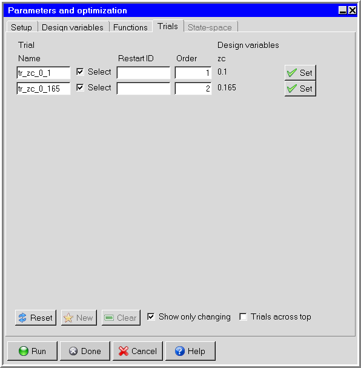

3. Click **Done** to close the **Parameters and optimization** panel.

### 4.9. Step 6: Creating Monitor Points

Create two monitor points by dragging and dropping (**block.1** and **grille.1**) into the **Points** folder to monitor the velocity in the grille and the temperature in one of the solid blocks. You can easily change the variables monitored by selecting them in the **Modify points** panel. Select **Velocity** for the grille and **Temperature** for the block.

**Figure 4.18: The Modify point Panel**

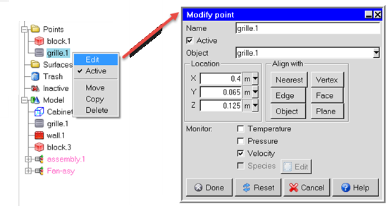

### 4.10. Step 7: Physical and Numerical Setting

First, use the **Basic settings** panel to determine the flow regime.

**Solution settings**

**Basic settings**

1. Enter **200** in the **Number of iterations** field in the **Basic settings** panel (Figure 4.19: The Basic settings Panel (p. 125)).

**Figure 4.19: The Basic settings Panel**

2. Click **Reset**. In the message window. Ansys Icepak recommends setting the flow regime to turbulent based on the approximate Reynolds and Peclet numbers.

3. Click **Accept** to accept the new settings.

Use the **Problem setup wizard** to set up the basic parameters of the problem.

1. Right-click

**Problem setup** in the **Model manager** window and select **Problem setup wizard**.

2. Follow the instructions as the **Problem setup wizard** panel guides you.

**Important:**

Do the following in the wizard (keep the rest of the settings at default): Select forced convection, set the flow regime to turbulent, use the zero equation turbulence model, include radiation heat transfer, and use the surface-to-surface radiation model.

3. Click **Done** when the panel is at step 14 of 14 to finish your problem setup.

**Note:**

You can edit the problem setup by expanding

**Problem setup** in the **Model manager**

window, then double-clicking **Basic parameters** (

). Figure 4.20: The Basic parameters Panel (p. 127) shows the panel that appears.

**Figure 4.20: The Basic parameters Panel**

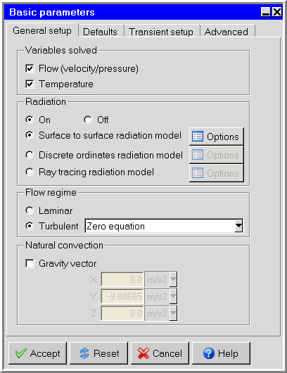

### 4.11. Step 8: Save the Model

Ansys Icepak saves the model for you automatically before it starts the calculation, but it is a good idea to save the model (including the mesh) yourself as well. If you exit Ansys Icepak before you start the calculation, you will be able to open the job you saved and continue your analysis in a future Ansys Icepak session. (If you start the calculation in the current Ansys Icepak session, Ansys Icepak will simply overwrite your job file when it saves the model.)

**File** **Save project**

Alternatively, click the save button (

) in the file commands toolbar.

### 4.12. Step 9: Calculate a Solution

**Solve** **Run solution**

In the **Results** tab of the **Solve** panel that appears, enable **Write overview of results when finished**, then click **Dismiss** to close the **Solve** panel. The **Solve** panel is used for single trials only; therefore, the solution can only be calculated from the **Parameters and optimization** panel.

**Solve** **Run optimization**

In the **Parameters and optimization** panel that appears (Figure 4.17: The Parameters and optimization Panel (Trials Tab) (p. 124)), click **Run** to calculate a solution for both trials.

### 4.13. Step 10: Examine the Results

Once the solutions converge, load the solution ID:

**Post** **Load solution ID**

Select the solution that corresponds to the first (parametric) run: zC = 0.1. Use the various post-processing features available in Ansys Icepak to display your solution. A description of how to generate plane cut and object face views can be found in Step 7: Examine the Results (p. 36) of the Finned Heat Sink tu- torial. In particular, use the following views:

1. **Plane cut** panel to display the velocity vectors on a plane through the cabinet

**Figure 4.21: Trial 1 Vector Plots at Constant Z Plane Cut**

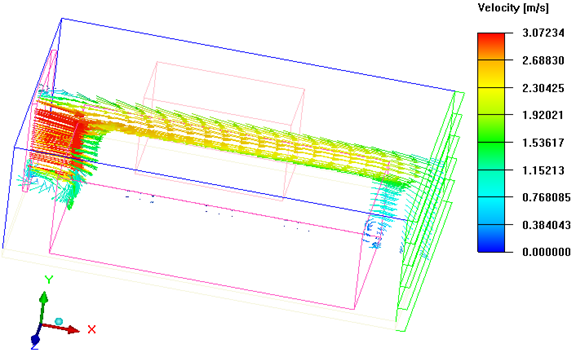

**Figure 4.22: Trial 2 Vector Plots at Constant Z Plane Cut**

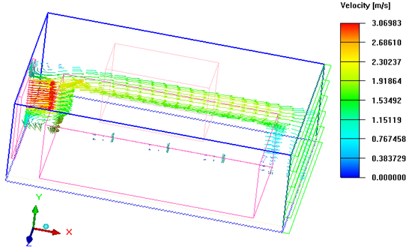

**Important:**

To view the 2nd parametric run, click the **Post** menu and select **Load solution ID**. Select the solution that corresponds to the second parametric run: zC = 0.165. The graphics display window updates automatically.

2. **Object face** panel to display temperature contours on wall.1 and on all blocks

**Figure 4.23: Trial 1 Temperature Contours on Blocks and PCB (wall.1)**

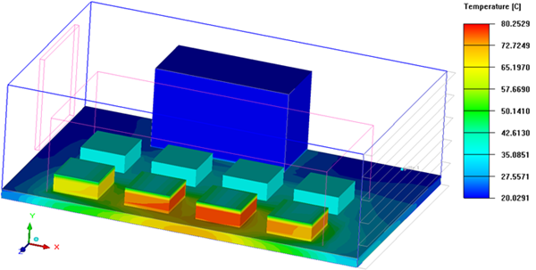

**Figure 4.24: Trial 2 Temperature Contours on Blocks and PCB (wall.1)**

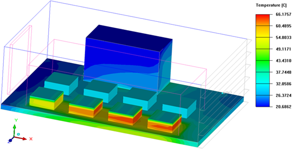

3. **Surface probe** panel to display the temperature values at a particular point

Examine the solution sets of both runs. You will find that, in the second run, the maximum temper- ature is lower than in the first run and that the network blocks are the hottest objects inside the cabinet. The second trial has the fan located at zC= 0.165 which is closer to the heat sink location. This increases the flow velocity over the heat sinks and thus increases the convective heat transfer coefficient, which leads to more heat transfer from the fins (blocks) and thus reduces the maximum temperature.

### 4.14. Step 11: Reports

1. Overview Report

At the end of the runs, Ansys Icepak automatically displays an overview report because you selected **Write overview of results when finished** in the **Solve** panel. This report has:

• fan operating point

• volume flow rate through the grille

• heat flow from the chips

• network junction temperatures

• heat flows for the wall and the grille.

Examine these results. Go to the **Report** menu and then select **Solution overview** and click **View** to display the desired overview report.

2. Summary Report

You can also create a single summary report containing the results of all the trial runs completed. Go to the **Solve** menu and select **Define report**. In the **Define summary report** panel, under **ID** **pattern**, enter the default filter, "*", which selects all the available solution IDs. Click **New** and then hold down **Ctrl**. Select block.1, block.1.1., block.2, block.2.1, and block.3 from the drop-down menu under **Objects**, click **Accept** and then click **Write**. Verify that the second trial gives lower maximum and mean temperatures.

### 4.15. Step 12: Summary

In this tutorial, you learned how to set up and solve multiple trials to optimize a parameter, specify a dynamically updating fan curve, create a new local coordinate system, and use separate meshed assem- blies to reduce mesh counts. The use of network blocks to model packages has been demonstrated as well as how to specify contact resistance using side specifications of a block object. You also learned how to generate a summary report for multiple solutions.

We repeat some of the tips and best practices found in this tutorial for your convenience:

1. Best Practices

a. Start a fan curve specification with a zero flow rate and end the specification with a zero pressure.

b. View the HTML summary report (**View** **Summary (HTML)**) to ensure proper specification of geometries, properties, and materials for each object.

c. Reduce mesh counts and consequently decrease run times in regions requiring less resolution by creating separately meshed assemblies when appropriate. Also select suitable slack values that improve the convergence rate while avoiding mesh bleeding.

d. Select the **Allow minimum gap changes** option in the **Misc** tab of the **Mesh control** panel to

allow Ansys Icepak to avoid unnecessary meshing due to inadvertent misalignments in the model. This is suitable for this tutorial but may not be in other projects.

e. Create monitor points of relevant quantities (temperature, pressure, or velocity) to help judge

convergence alongside residuals.

f. Use the **Problem setup wizard** for guided problem setup. Edit the problem setup if needed

using the

**Basic parameters** panel.

2. Tips and Tricks

a. Use the **RPM** under the **Swirl** tab as a fan's nominal RPM. Use the **Operating RPM** in the **Options** tab as the working RPM value, used in conjunction with the nominal RPM to update the fan curve according to the fan laws.

b. Display different types of shading to help visualize parts of your model better by editing an in-

dividual object in the **Model manager** window or by applying it globally (**View** **Default** **shading**).

c. Click near the edge of a face in the **Morph faces** mode if you have difficulty selecting faces. Clicking correctly should highlight the entire face in a red shading.

**Note:**

Use the left mouse button first to select a face, then accept the selection with the middle mouse button. Right-click to cancel your selection or to exit the **Morph faces** mode.

d. Create hollow blocks to cut out a section of the cabinet from the computational domain. Hollow

blocks only alter flow patterns and do not participate in solid conduction heat transfer.

e. Use the appropriate **Restart ID** for your trials' initial conditions when running a parametric op-

timization to improve convergence rate.

### 4.16. Step 13: Additional Exercise to Model Higher Altitude Effect

You can also use the final model to simulate the effects of higher altitudes. In order to model this cor- rectly, new air properties at the particular altitude need to be defined and assigned to the default fluid. The density of air is the most affected property and gets lower as altitude increases. The data for air properties at a different altitude is presented in many handbooks and may even include temperature change with it. For an altitude of 3000 m, you can select the available library material Air@(3000m). Note that you can create and store a custom material having any properties in the material library for use in any project.

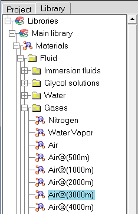

In the **Model manager** window, select

**Basic parameters** and assign the new air material to be the default fluid.

**Problem setup**

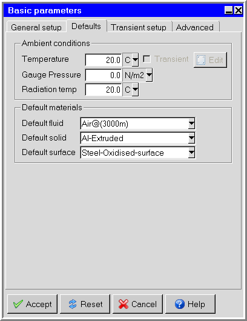

On the **Advanced** tab under **Altitude effects**, select **Altitude** and enter 3000 m. Then select **Update** **fan curves** to automatically update fan curves to account for altitude effects.

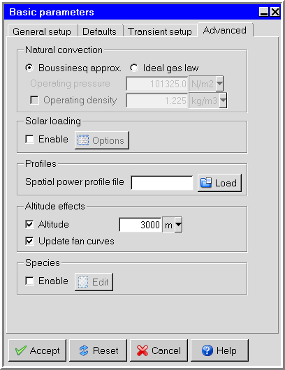

---

## Chapter 5: Cold-Plate Model with Non-Conformal Meshing

### 5.1. Introduction

This tutorial demonstrates how to model a cold-plate using Ansys Icepak.

In this tutorial you will learn how to:

• Use the meshing priorities of different objects to mesh complicated model setups in Ansys Icepak.

• Use multiple fluids in a single model.

• Account for external natural convection and internal forced convection.

• Create separately meshed assemblies to reduce the overall mesh count.

• Specify per-object meshing parameters.

**Note:**

Mesh counts and solution results may differ slightly due to enhancements to the meshing algorithm and Fluent solver, respectively.

### 5.2. Prerequisites

This tutorial assumes that you have reviewed Sample Session in the Icepak User’s Guide and tutorials Finned Heat Sink (p. 5) and RF Amplifier (p. 51) of this guide.

### 5.3. Problem Description

The model consists of a cold-plate, where the cold-plate fluid is transporting a significant fraction of the heat from two plates mounted on either side of it. The natural convection in the external air is also instrumental to heat transfer in this case. The model setup is shown in Figure 5.1: The Cold-Plate Mod- el (p. 136).

**Figure 5.1: The Cold-Plate Model**

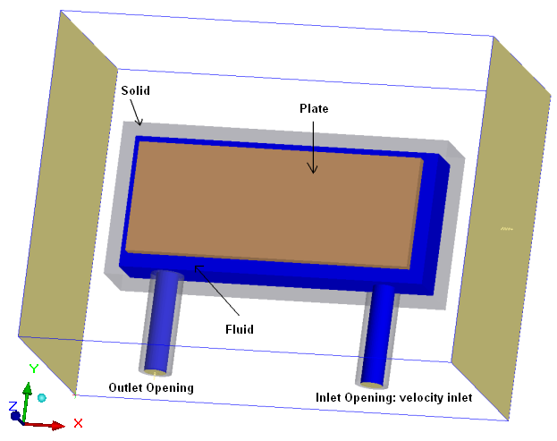

The objective of this exercise is to illustrate the use of two different fluids in Ansys Icepak. The model includes two heated plates, cooled by water circulating inside the cold-plate cavity, as well as by air driven by natural convection externally. Separately meshed assemblies will be employed to reduce the overall mesh count in the domain. The model will be constructed using the default metric unit system.

### 5.4. Step 1: Create a New Project

Create a new project called **cold-plate**.

### 5.5. Step 2: Build the Model

Construct the **cabinet** and all the other objects according to the following specifications. Note that during the model building, you may use the alignment tools. Remember that you can align the face, edge and vertex of one object with another. For example, you could align the bottom face of the cylinders to the cabinet (see Figure 5.1: The Cold-Plate Model (p. 136)). You may also use the align tools to create the openings on the cold-plate inlet and outlet regions.

• Cabinet (

)

Enter the following start and end locations for the cabinet:

**Table 5.1: Cabinet Start and End Values**

| xS | 0.0 m | xE | 0.4 m |
| --- | --- | --- | --- |
| yS | 0.0 m | yE | 0.3 m |

0.2 m **zE** 0.0 m **zS**

• Blocks (

)

Create a solid block,**block.1**, and a fluid block,**block.2**, with the specifications in Table 5.2: Specific- ations of block.1 and block.2 (p. 137). Note the specified materials for each block.

**Table 5.2: Specifications of block.1 and block.2**

| Object |  |  |  |  |
| --- | --- | --- | --- | --- |
| Name: block.1 | xS | 0.05 m | xE | 0.35 m |
| Geometry: Prism | yS | 0.08 m | yE | 0.22 m |
| Block type: Solid | zS | 0.07 m | zE | 0.13 m |
| Solid material: Al-Extruded |  |  |  |  |
| Name: block.2 Geometry: Prism Block type: Fluid Fluid material: Water(@280K) | xS yS zS | 0.06 m 0.09 m 0.08 m | xE yE zE | 0.34 m 0.21 m 0.12 m |

Because you have created **block.2** after **block.1**,**block.2** has a higher relative meshing priority.

**Note:**

Ansys Icepak meshes the objects according to their mesh priority; this is important when intersection between two or more objects occurs. If two or more objects intersect, you may not obtain the correct results with the default meshing priority. The ascending order of the model object nodes in the model manager window determines the mesh priority of the corresponding model objects. For example, the model object in the bottom node has the highest meshing priority. For more information on controlling meshing priority, see Controlling the Meshing Order for Objects in the Ansys Icepak User’s Guide.

**Note:**

Because **Al-Extruded** is set as the **Default solid** in the **Defaults** tab of the **Basic paramet-** **ers** panel, you can leave the material selection as **default** while creating the object instead of selecting the material each time when an object is being created.

Next, create 4 cylindrical blocks. While editing cylindrical blocks, first select the block shape as cylinder, then select the desired plane and finally enter the dimensions.

**Table 5.3: Cylindrical Block Specifications**

| Object | xC | yC | zC | Height | Radius | IRadius | Specifications |
| --- | --- | --- | --- | --- | --- | --- | --- |
| Name: block.3 Geometry: Cylinder Plane: X-Z | 0.1 m | 0.0 m | 0.1 m | 0.09 m | 0.015 m | 0.0 m | Block type: Solid Solid material: Al-Extruded |
| Name: block.4 Geometry: Cylinder Plane: X-Z | 0.3 m | 0.0 m | 0.1 m | 0.09 m | 0.015 m | 0.0 m | Block type: Solid Solid material: Al-Extruded |
| Name: block.5 Geometry: Cylinder Plane: X-Z | 0.1 m | 0.0 m | 0.1 m | 0.09 m | 0.01 m | 0.0 m | Block type: Fluid Fluid material: Water(@280K) |
| Name: block.6 Geometry: Cylinder Plane: X-Z | 0.3 m | 0.0 m | 0.1 m | 0.09 m | 0.01 m | 0.0 m | Block type: Fluid Fluid material: Water(@280K) |

Because the fluid blocks,**block.5** and **block.6**, are created after the solid blocks, they will have higher relative meshing priorities.

**Note:**

An alternative way to build the cylinders would be to create the solid block,**block.3**, and then the fluid block,**block.5**, group these together, and then copy them with an offset of **0.2** in the X direction. Note that the naming of the cylinders will not be consistent with the tutorial. However, you could rename the objects to their corresponding names in the tutorial by right-clicking each copied object in the **Model manager** window and selecting **Rename**.

• Plates (

)

**Table 5.4: Plate Specifications**

| Object |  |  |  |  | Specifications |
| --- | --- | --- | --- | --- | --- |
| Name: plate.1 Geometry: Rectangular Plane: X-Y Solid materi- al: Al-Extruded | xS yS zS | 0.07 m 0.1 m 0.06 m | xE yE zE | 0.33 m 0.2 m — | Thermal model: Conducting thick (0.01 m) Total power: 200 W |
| Name: plate.2 Geometry: Rectangular Plane: X-Y Solid materi- al: Al-Extruded | xS yS zS | 0.07 m 0.1 m 0.13 m | xE yE zE | 0.33 m 0.2 m — | Thermal model: Conducting thick (0.01 m) Total power: 200 W |

**Note:**

An alternative way to create **plate.2** is to copy **plate.1** with a Z offset of **0.07** m.

• Openings (

)

The openings at the liquid inflow and outflow regions of the cold-plate are:

**Table 5.5: Opening Specifications**

| Object | xC | yC | zC | Radius | Specifications |
| --- | --- | --- | --- | --- | --- |
| Name: opening.1 (outlet opening) Type: Free Geometry: Circular Plane: X-Z | 0.1 m | 0 m | 0.1 m | 0.01 m |  |
| Name: opening.2 (inlet opening) Type: Free | 0.3 m | 0 m | 0.1 m | 0.01 m | Y Velocity = 0.2 m/s |

**Geometry**: Circular

**Plane**: X-Z

**Note:**

You could also have made a copy of the outlet opening (**opening.1**) with an X offset of **0.2** m along with a specified **Y Velocity** = **0.2** m/s to create the inlet opening (**opening.2**). For agreement with the tutorial, ensure that you have placed the inlet and outlet in their correct positions by referring to Figure 5.1: The Cold-Plate Model (p. 136).

The openings at the cabinet boundary for external air natural convection are:

**Table 5.6: Openings at Cabinet Boundary Specifications**

| Object |  |  |  |  |
| --- | --- | --- | --- | --- |
| Name: opening.3 Type: Free Geometry: Rectangular Plane: Y-Z | xS yS zS | 0.4 m 0.0 m 0.2 m | xE yE zE | — 0.3 m 0.0 m |
| Name: opening.4 Type: Free Geometry: Rectangular Plane: Y-Z | xS yS zS | 0.0 m 0.0 m 0.2 m | xE yE zE | — 0.3 m 0.0 m |

**Note:**

Instead of creating the openings,**opening.3** and **opening.4** above, you could have edited **Cabinet** and changed the wall type on the **Min x** and **Max x** faces to **Opening**. Note, however, that you cannot rename the two resulting objects.

See Figure 5.1: The Cold-Plate Model (p. 136) for the final model.

**Note:**

Figure 5.1: The Cold-Plate Model (p. 136) displays different opacity, shading and color of some objects to make the objects easier to see.

### 5.6. Step 3: Create a Separately Meshed Assembly

To create a separately meshed assembly, highlight all the objects in the **Model manager** window *except* the **cabinet**,**opening.3**, and **opening.4**. Right-click them and choose **Create** and then **Assembly**. To enable separate meshing for the assembly, double-click **assembly.1** to edit the assembly. Under the **Meshing tab**, toggle the **Mesh separately** button and then enter the slack values as follows in the **Slack settings** box:

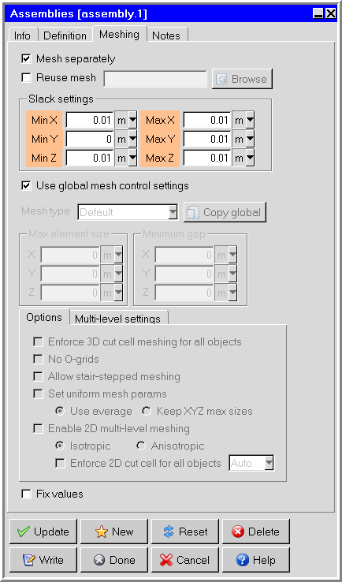

The bounding box of the assembly is larger than the original assembly by 0.01 m on five sides. The slack value for the min Y side of the assembly is set to be 0 m, since the min Y side of the assembly is at the bottom surface of the cabinet. Click **Update** and **Done** to complete editing the separately meshed assembly.

### 5.7. Step 4: Generate a Mesh

Open the **Mesh control** panel and ensure that your settings match those of Figure 5.2: Mesh control Panel Settings (p. 143). The mesh needs to be refined for the inner prismatic fluid block (**block.2**). In the **Misc** tab, use the settings shown in the below figure. Then toggle **Object params** and click **Edit** in the **Local** tab. Choose **block.2** and check **Use per-object parameters** and enter 30, 16, and 10 respectively for the X, Y, and Z counts for the mesh in the fluid block, as shown in the following figure. Click **Done** to close the **Per-object meshing parameters** panel.

**Note:**

The X, Y, and Z "counts" are also known as **element counts**, the number of divisions into which an edge is subdivided. In other words, an **element count** is the number of elements that lie along the edge. For more information on per-object meshing parameters, see Definitions of Object-Specific Meshing Parameters in the Ansys Icepak User’s Guide.

**Figure 5.2: Mesh control Panel Settings**

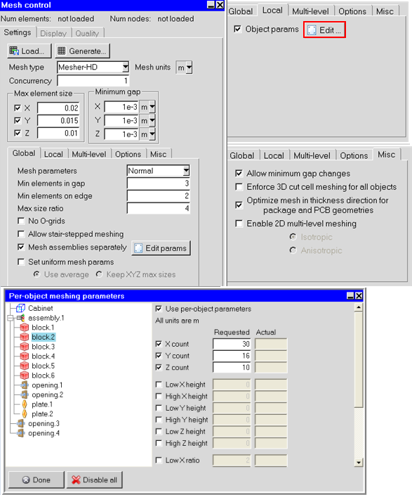

Click **Generate** to mesh the model. Visualize the mesh at plane cuts and surface displays from the **Display** tab. Note that if you have **Selected object** selected, you can only generate surface and volume mesh displays on the objects themselves and not an assembly. You may select several objects in order for several concurrent displays or you may select **All** to generate mesh displays for all objects automat- ically.

### 5.8. Step 5: Physical and Numerical Settings

Calculation of the Reynolds number based on properties of **Water(@280K)** and the inlet opening dia- meter shows that the problem is turbulent.

**Caution:**

Using the **Reset** button in the **Basic settings** panel to determine flow regime will give dimensionless numbers based on the default fluid material from the **Basic parameters** panel, which in this case is **Air**. Therefore, exercise caution when relying on Ansys Icepak to determine the Reynolds number.

**Note:**

Instead of accessing the

**Basic parameters** panel, you can instead use the **Problem setup** **wizard** to define your problem setup by double-clicking

**Problem setup** in the **Model** **manager** window. See Step 4: Physical and Numerical Settings (p. 28) in the Icepak Tutorials of the Finned Heat Sink tutorial for more instruction regarding the **Problem setup wizard**. You must still use the same settings described in this tutorial for the **Problem setup wizard**.

To set up turbulent flow, go to

**Basic parameters** and choose the **Zero** **equation** turbulence model for the **Flow regime** in the **General setup** tab.

**Problem setup**

Gravity acts in the negative x direction in this problem. To setup the effects of gravity, toggle the **Gravity vector** in the **General setup** tab. Enter the new values for the **Gravity vector** as X = **-9.80665** m/s2, Y = **0.0** m/s2, and Z = **0.0** m/s2. Now go to the **Transient setup** tab and set an initial **X velocity** of **0.005** m/s in the X direction.**Accept** all other defaults in the **Basic parameters** panel. These are shown in Figure 5.3: Switching on Gravity and Turbulent Flow (p. 145).

**Figure 5.3: Switching on Gravity and Turbulent Flow**

**Note:**

For steady-state natural convection cases, set a small initial velocity opposite to the gravity vector direction as this assists with the initial convergence of the model. For cases in which

there is no forced convection, clicking on **Reset** in the

**Basic** **settings** menu automatically sets a small initial velocity in the direction opposite to the gravity vector. This may not be necessary in this model though, because the flow will be forced through the cold plate. We will have mixed (forced and natural) convection heat transfer.

**Solution settings**

**Figure 5.4: Basic and Advanced Solver Settings**

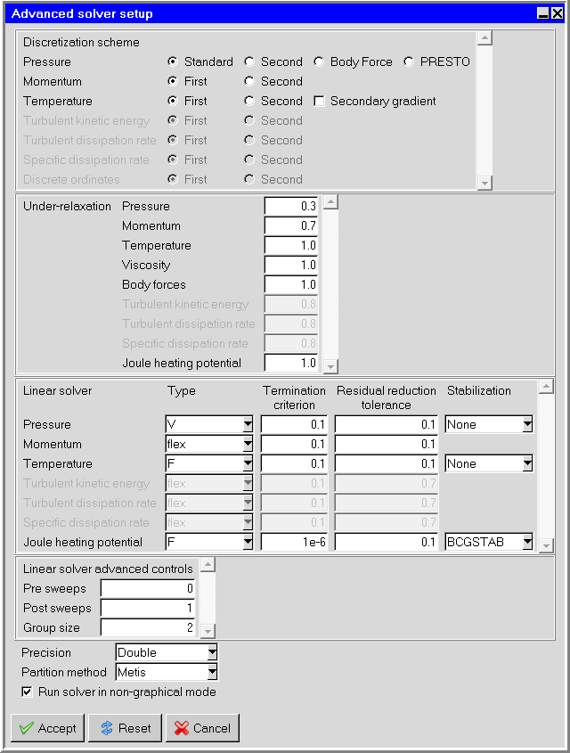

Select the **Basic settings** panel from the **Solution settings** branch of the tree and set the **Number of** **iterations** to **300**. Go to **Advanced settings** and make sure **Under-relaxation** factors for **Pressure**, **Momentum**, and **Temperature** are **0.3**,**0.7**, and **1.0**, respectively. Change the **Stabilization** under **Joule heating potential** to **BCGSTAB**, and select **Double** for the **Precision** drop-down list. The recom- mended basic settings and advanced solver setup for this model are shown in Figure 5.4: Basic and Advanced Solver Settings (p. 146).

Add three monitor points to the **Points** folder, one to monitor the velocity at the center of the **opening.1** (outlet opening), and two to monitor the temperature at the center of **block.2** and **plate.2**, respectively. The easiest way to create them is to select the objects from the **Model manager** window and then drag them to the **Points** folder of the tree. Ansys Icepak will then automatically monitor values at the centers of these objects. The default setting is to monitor **Temperature**. To change this, double-click the object under the **Points** folder and choose which variables to monitor at that location.

### 5.9. Step 6: Save the Model

Ansys Icepak automatically saves the model for you before it starts the calculation, but it is a good idea to save the model after the model building and meshing is complete.

**File** **Save project**

Alternatively, click the save button (

) in the file commands toolbar.

### 5.10. Step 7: Calculate a Solution

Select the **Solve** menu and click **Run solution**. In the **Solve** panel, under the **Results** tab toggle **Write** **overview of results when finished**, and then click **Start solution**.

### 5.11. Step 8: Examine the Results

Review the solution overview report created to ensure that mass (volume) flow rate and energy balances are satisfied. To postprocess the results, create the following object face and plane cut objects:

**Table 5.7: Object Face and Plane Cut Specifications**

| Object | Specifications/Display Attributes | Description |
| --- | --- | --- |
| face.1 | Object: all blocks (select the blocks using the Ctrl key or the Shift key and the left mouse button) | Object-face view of temperature on all the blocks. What is the maximum temperature? |
|  | Show contours/Parameters |  |
|  | Contours of: Temperature |  |
|  | Contours options: Solid fill and Smooth |  |
|  | Color levels: Calculated/Global limits |  |
| cut.1 | Set position: Z plane through center | Observation: Water is circulating through the internal channel, providing most of the cooling for the |
|  | Show vectors/ Parameters |  |

|  | Color by: Velocity Magnitude | model. On the outside, air flows over the system by natural convection. |
| --- | --- | --- |
|  | Color levels: Calculated/Global limits |  |
| face.2 | Objects: opening.1 (outlet) and open- ing.2 (inlet) | Observe the flow pattern from inlet opening to outlet opening passing through the cold plate. Animate the particle traces. |
|  | Show particle traces/ Parameters |  |
|  | Variable: Speed |  |
|  | Display options: Uniform: 30 |  |
|  | Particle options: Keep all the defaults |  |
|  | Style: Trail (Width = 1) and |  |
|  | Marker: (cone ) |  |
|  | Color levels: Calculated/ This Object |  |
| cut.2 | Set position: X plane through center | Observe the flow pattern in positive X direction. Animate the particle traces. |
|  | Show particle traces/ Parameters |  |
|  | Color variable: Speed |  |
|  | Display options: Uniform: 30 |  |
|  | Particle options: Keep all the defaults |  |
|  | Style: Trail (Width = 1) and |  |
|  | Marker (cone ) |  |
|  | Color levels: Calculated/ This Object |  |
| cut.3 | Set position: Y plane through center | Due to the nature of the problem, the temperature distribution is symmetric on the Y-Z plane. Verify this in the solution. |
|  | Show contours of Temperature. |  |

You can save the post-processing objects that you just created by clicking **Save post objects to file** option in the **Post** menu. Ansys Icepak will save these objects under the file named **post_objects** in the Icepak project folder.

### 5.12. Step 9: Summary

In this problem, you modeled a cold-plate that included two heat plates cooled by water circulating inside the cold-plate cavity as well as air driven by natural convection externally. This exercise has also demonstrated how to use the different meshing priorities of objects to model complicated model setups, model multiple fluids in a single model, account for external natural convection and internal forced convection, create separately meshed assemblies to reduce the overall mesh count, and specify per- object meshing parameters.

We repeat some of the tips and best practices found in this tutorial for your convenience:

1. Best Practices

a. Use the alignment and morph tools to position objects based on other existing objects. This can be faster than specifying object dimensions and coordinates in many situations.

b. Reduce mesh counts and consequently decrease run times in regions requiring less resolution

by creating separately meshed assemblies when appropriate. Also select suitable slack values that improve the convergence rate while avoiding mesh bleeding.

c. Use the **Problem setup wizard** for guided problem setup. Edit the problem setup if needed

using the

**Basic parameters** panel.

d. Create monitor points of relevant quantities (temperature, pressure, or velocity) to help judge

convergence alongside residuals.

2. Tips and Tricks

a. **Copy** similar objects then edit the copied objects to the desired specifications to eliminate re- dundancies. This may be faster than creating every object individually.

b. Display different types of shading to help visualize parts of your model better by editing an in-

dividual object in the **Model manager** window or by applying it globally (**View** **Default** **shading**).

c. Exercise caution when using the **Reset** button in the

**Basic settings** panel to determine the flow regime. Ansys Icepak only provides estimates, which may not necessarily be the correct value for your application. In some cases, you may want to perform a hand calculation to confirm.

### 5.13. Step 10: Additional Exercise

To see the cooling capacity or effectiveness of water, run the same model by replacing the fluid mater- ial of the fluid blocks with **Glycol-20**; that is, change all the water blocks into glycol blocks. You should see an increase in the maximum global temperature. Note that this fluid material is actually ethylene glycol.

---

## Chapter 6: Heat-Pipe Modeling and Nested Non-Conformal Meshing

### 6.1. Introduction

This tutorial demonstrates how to model simple heat pipes and an active heat sink using Ansys Icepak.

In this tutorial, you will learn how to:

• Create orthotropic solid materials.

• Use those materials to simulate a simplified heat-pipe in a system.

• Use of copy mirror and copy translate functions to create an array of objects.

• Create nested non-conformal assemblies.

**Note:**

Mesh counts and solution results may differ slightly due to enhancements to the meshing algorithm and Fluent solver, respectively.

### 6.2. Prerequisites

This tutorial assumes that you have little experience with Ansys Icepak, but that you are generally famil- iar with the interface. If you are not, review Sample Session in the Icepak User’s Guide and the tutorial Finned Heat Sink (p. 5) of this guide. Some steps in the setup and solution procedure will not be shown explicitly.

### 6.3. Problem Description

Heat-pipes are used to transport heat from a heat source area, where there is limited space for heat dissipation, to a place where it can be dissipated more easily. The objective of this exercise is not to model the detailed physics inside a heat pipe. Instead, you will model a heat pipe by using a series of cylindrical solid blocks that connect the heat source to an air-cooled heat sink. These blocks will have an orthotropic conductivity with a very large conductivity in the pipe axis direction along which the heat is carried away. The model will be constructed using the default metric unit system. You will also make use of nested non-conformal meshing using assemblies to reduce the cell count in the model.

**Figure 6.1: Heat-pipe Tutorial Base Model**

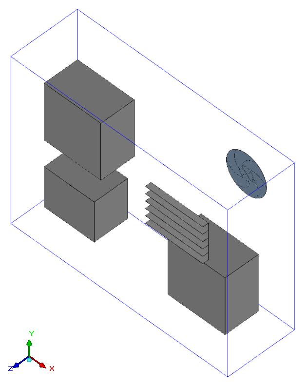

### 6.4. Step 1: Create a New Project

1. Set up a working directory on the computer you will be using.

2. Download the heat_pipe.zip file here.

3. Unzip the heat_pipe.zip file you have downloaded to your working directory.

4. Copy the file heat-pipe-nested-NC.tzr to your working directory.

5. Start Ansys Icepak, as described in Starting Ansys Icepak in the Icepak User’s Guide.

**Note:**

Ansys Icepak can be started in Ansys Workbench using the import .tzr feature or it can be opened as a stand-alone product.

6. Click **Unpack** in the **Welcome to Icepak** panel.

7. In the **File selection** panel, select the packed project file heat-pipe-nested-NC.tzr and click **Open**.

8. In the **Location for the unpacked project** file selection dialog, select a directory where you would like to place the packed project file, enter a project name in the **New project** text field, then click **Unpack**.

### 6.5. Step 2: Build the Model

**Note:**

In Ansys Icepak, the packed file feature compresses a model to the files needed to build, mesh and run the model (job, model, and problem files). In many of the tutorials, part of the model is already created and packed to speed up the learning process. The model originally has three blocks and only **block.1** has an assigned power (25 W). The model also has one fan and one grille. Next, build a heat sink in the area of the fan, grille and the heat pipe system to connect **block.1** to the heat sink.

1. Create materials utilizing Ansys Icepak’s orthotropic material conductivity feature. The idea is to have a material that has very high conductivity in the pipe heat removal directions but normal conductivity in the other directions.

• Click the material icon (

) in the object toolbar for each new material to be created.

• Right-click the material name and select **Edit** or double-click the material name to open the **Edit** panel.

• Go to the **Properties** tab and make sure to toggle **Material type** to be **Solid** and set the **Con-** **ductivity type** to be **Orthotropic** from the drop-down list.

• Deselect the **Edit** check box next to **Conductivity** and create the following materials with ortho- tropic conductivity properties using the template in Figure 6.2: Orthotropic Material Proper- ties (p. 154).

**Figure 6.2: Orthotropic Material Properties**

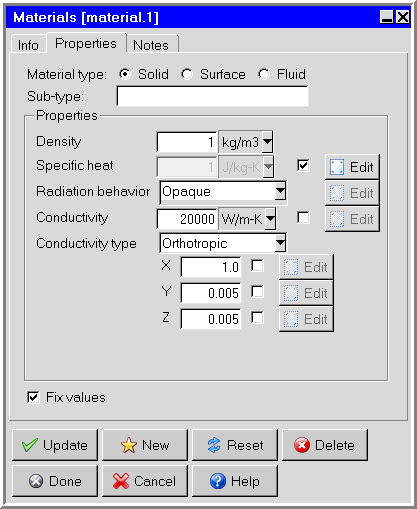

**Table 6.1: Orthotropic Properties**

| Name | Nominal Con- ductivity | Orthotropic multiplier |  |  |
| --- | --- | --- | --- | --- |
| material.1 | 20000 | X = 1 | Y = 0.005 | Z = 0.005 |
| material.2 | 20000 | X = 0.005 | Y = 1 | Z = 0.005 |
| material.3 | 20000 | X = 1 | Y = 1 | Z = 0.005 |

The above materials have “orthotropic conductivity”, which means conductivity is different per orthogonal direction. The effective conductivity in each orthogonal direction is equal to the nominal conductivity multiplied by the orthotropic multiplier in that direction.

2. After creating these heat pipe materials, we build the heat pipe made of cylindrical blocks and square joints.

• Create five block objects.

• Use the values in the following table (be sure to note the geometry)

**Table 6.2: Block Specifications**

| Object | Geometry | xC | yC | zC | Height | Radius | IRadius | Specifications |
| --- | --- | --- | --- | --- | --- | --- | --- | --- |
| pipe1 | Shape: Cylinder Plane: Y-Z | 0.05 m | 0.11 m | 0.1 m | 0.245 m | 0.01 m | 0.0 m | Type: solid Solid material: material.1 |
| pipe2 | Shape: Cylinder Plane: Y-Z | 0.325 m | 0.365 m | 0.1 m | 0.267 m | 0.01 m | 0.0 m | Type: solid Solid material: material.1 |
| pipe3 | Shape: Cylinder Plane: X-Z | 0.31 m | 0.125 m | 0.1 m | 0.225 m | 0.01 m | 0.0 m | Type: solid Solid material: material.2 |
| Object | Geo- metry | xS | yS | zS | xE | yE | zE | Specifications |
| Joint1 | Shape: Prism | 0.295 m | 0.095 m | 0.085 m | 0.325 m | 0.125 m | 0.115 m | Type: solid Solid material: material.3 |
| Joint2 | Shape: Prism | 0.295 m | 0.35 m | 0.085 m | 0.325 m | 0.38 m | 0.115 m | Type: solid Solid material: material.3 |

**Note:**

You can use the **Copy object** function to speed up the creation of the remaining objects after **pipe1** and **joint1** are created. However, the names will not be the same as the tutorial. To rename an object, right-click the object in the **Model manager** window and click **Rename**.

3. Next, we will also build the heat sink using block objects.

• Build the base and one pin according to the following

**Table 6.3: Base and Pin Specifications**

| Ob- ject | Geometry | xS | yS | zS | xE | yE | zE | Properties |
| --- | --- | --- | --- | --- | --- | --- | --- | --- |
| Base | Shape: Prism | 0.42 m | 0.35 m | 0.05 m | 0.592 m | 0.38 m | 0.15 m | Type: solid |

|  |  |  |  |  |  |  |  | Solid material: default |
| --- | --- | --- | --- | --- | --- | --- | --- | --- |
| Ob- ject | Geometry | xC | yC | zC | Height | Radius / Radi- us2 | IRadius / IRadi- us2 | Properties |
| Pin | Shape: Cylinder Plane: X-Z Nonuni- form selected (for a nonuniform radius) | 0.44 m | 0.38 m | 0.067 m | 0.04 m | 0.01 m / 0.006 m | 0 m / 0 m | Type: solid Solid material: default |

Note that the **Nonuniform** check box is available in the **Edit** window. Alternatively, you may find it also named **Nonuniform radius** in the **Geometry** tab of the **Blocks** panel as shown below. The **Plane** option is X-Z (Figure 6.3: Nonuniform Cylinder (p. 157)).

**Figure 6.3: Nonuniform Cylinder**

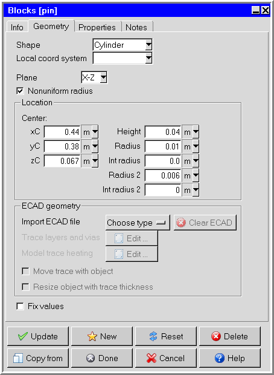

• Make two copies of **Pin** with an offset of **0.033** m in the Z direction (**Number of copies** = **2**, **Translate** with **Z offset** = **0.033** m).

• Highlight the three tapered fins (Pin, Pin.1 and Pin.2), make four copies of this highlighted group with an offset of **0.033** m in the X direction (**Number of copies** = **4**,**Translate** with **X offset** = **0.033** m).

• Group all the pins by highlighting them in the **Model manager** window, right-click and select **Copy** and finally make one copy as follows:**Number of copies** = **1**,**Translate** with **Y offset** = **-0.03**,**Mirror** with **Plane**: XZ and **About**: Low end.

The final model should appear as shown in Figure 6.4: Model with Heat Pipe and Heat Sink (p. 158).

**Figure 6.4: Model with Heat Pipe and Heat Sink**

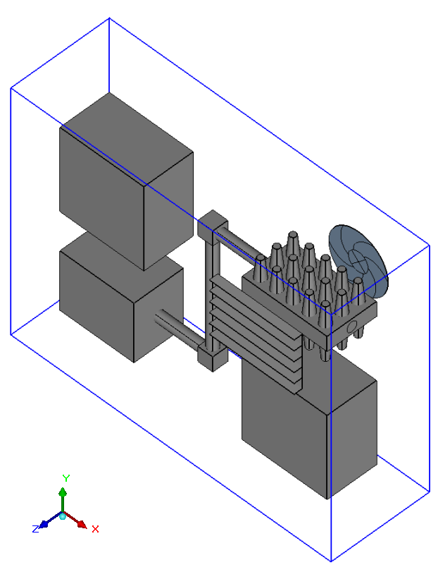

### 6.6. Step 3: Create Nested Non-conformal Mesh Using Assemblies

In this exercise, our goal is to reduce the overall cell count to a reasonable level while retaining a good cell resolution within the model, especially where the velocity and temperature gradients are higher.

1. Create three individual assemblies (one for the heat sink and the base, the second one for the vent, and the last one for the fan).

a. Highlight all the pins and the base in the model manager window.

b. Right-click and select **Create** then **Assembly**.

c. Rename the assembly as **Heatsink-asy**.

d. Double-click the assembly to open the **Edit** panel.

e. Under the **Meshing** tab, toggle the **Mesh separately** button.

f. Set the slack to the following values:

**Table 6.4: Slack Values for Heatsink-asy**

| Min X | 0.005 m | Max X | 0.005 m |
| --- | --- | --- | --- |
| Min Y | 0.005 m | Max Y | 0.005 m |
| Min Z | 0.015 m | Max Z | 0.005 m |

**Note:**

For the **Heatsink-asy**, you have set a bounding box that is 0.005 m bigger than the assembly at five sides except **Min Z** where the slack is defined higher (0.015 m) to capture the wake region of the flow. Also keep in mind that on the face **Min Z** is where the wake occurs because the fan is of type **Exhaust** rather than of type **Intake**.

g. Click **Update** and **Done**.

h. Following the same procedure above, create two more assemblies; one for **vent.1** (name it **Vent-**

**asy**) and one for the fan (name it **Fan-asy**).

i. Use the following tables to assign slack values for **Vent-asy** and **Fan-asy** assemblies, respectively.

**Table 6.5: Slack Values for Vent-asy**

| Min X | 0.01 m | Max X | 0.01 m |
| --- | --- | --- | --- |
| Min Y | 0.01 m | Max Y | 0.01 m |
| Min Z | 0.01 m | Max Z | 0 m |

**Table 6.6: Slack Values for Fan-asy**

| Min X | 0.01 m | Max X | 0.01 m |
| --- | --- | --- | --- |
| Min Y | 0.01 m | Max Y | 0.01 m |
| Min Z | 0 m | Max Z | 0.01 m |

2. Put the previously created assemblies into an outer assembly covering all.

a. Highlight all the three assemblies above and right-click your selection.

b. Select **Create assembly**.

c. Rename this main assembly **HS-vent-fan-asy**.

d. Assign the following slack values to the assembly.

**Table 6.7: Slack Values for HS-vent-fan-asy**

| Min X | 0.02 m | Max X | 0.02 m |
| --- | --- | --- | --- |
| Min Y | 0.02 m | Max Y | 0.02 m |
| Min Z | 0 m | Max Z | 0 m |

### 6.7. Step 4: Generate a Mesh

1. Go to **Model** **Generate Mesh** or use the toolbar shortcut (

) to open the **Mesh control** panel.

2. In the **Mesh control** panel, specify a global maximum element size of **0.025** m in all three directions (**Max X size** = **Max Y size** = **Max Z size** = **0.025**).

3. Verify that the **Coarse** option is selected next to **Mesh parameters** and change the **Max size ratio** from **10** to **5**.

4. Make sure that **Mesh assemblies separately** button is toggled.

5. Under the **Options** tab, set the **Init element height** to **0.003**.

**Figure 6.5: Mesh control Panel**

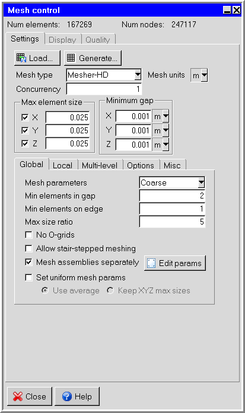

6. Click **Generate**. Visualize the mesh by making plane cuts and surface displays under the **Display** tab, especially between the heat sink pins and on the surface of the fan and grille objects. The meshing panel should look like the one in Figure 6.5: Mesh control Panel (p. 161) when finished.

### 6.8. Step 5: Physical and Numerical Settings

**Note:**

Instead of accessing the

**Basic parameters** panel, you can instead use the **Problem setup** **wizard** to define your problem setup by double-clicking

**Problem setup** in the model manager window. See 2.7. Step 4: Physical and Numerical Settings (p. 28) of the Finned Heat Sink tutorial for more instruction regarding the **Problem setup wizard**. You must still use the same settings described in this tutorial for the **Problem setup wizard**.

1. Go to

**Basic parameters**. In the **General setup** tab, change the **Flow regime** to be **Turbulent** and keep the default selection of **Zero equation**.

**Problem setup**

2. Go to the **Transient setup** tab and set the initial condition for the velocity in the Z direction to be -0.1 m/s to achieve faster convergence. If there is an initial guess at the start of the solution there is less of a chance of excessively large initial velocities in the first iteration.

Figure 6.6: Turbulent Flow and Initial Z Velocity (p. 162) shows these two steps. Click **Accept** for these changes to take effect.

**Figure 6.6: Turbulent Flow and Initial Z Velocity**

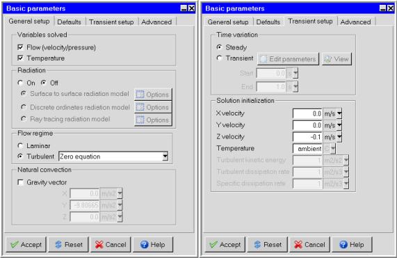

3. Under

**Basic settings**, set the **Number of iterations** to 200 (Figure 6.7: Ba- sic settings Panel (p. 163)).

**Solution settings**

**Figure 6.7: Basic settings Panel**

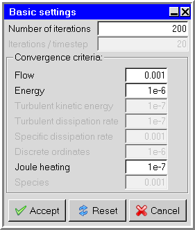

4. Click **Accept**.

### 6.9. Step 6: Save the Model

Ansys Icepak automatically saves the model for you before it starts the calculation, but it is a good idea to save the model (including the mesh) yourself as well.

**File** **Save project**

### 6.10. Step 7: Calculate a Solution

1. Add in two monitor points, one to monitor the velocity at the center of **vent.1** and one to monitor the temperature at the center of **block.1**.

a. Select **vent.1** and **block.1** from the list and then drag them to the **Points** branch of the tree. (Alternatively, one can create monitor points by simply selecting these objects in the **Model** **manager** window, clicking on the right mouse button and selecting **Create** and then **Monitor** **point**.)

b. Because Ansys Icepak will by default monitor the temperature at the centroid or center of these

objects, double-click **vent.1** under the monitor **Points** branch.

c. Select velocity as the variable to monitor and deselect temperature.

d. Accept the change.

2. Go to **Solve** **Run solution** or click the shortcut button (

). Start the solver by clicking **Start** **solution**.

### 6.11. Step 8: Examine the Results

To post-process the results for this exercise, create the following **Object face** and **Plane cut** objects:

**Table 6.8: Object face and Plane cut Specifications**

| Ob- ject | Specifications | Description |
| --- | --- | --- |
| face.1 | 1. In the Object field, select all blocks (Choose using the Ctrl and/or Shift keys and left mouse button) | Object face view of temperature contours on all the blocks. Observations: The view shows the flow of heat from the heated block (block.1) to the air-cooled heat sink. |
|  | 2. Select Show contours |  |
|  | 3. Click Parameters |  |
|  | 4. Contours of: Temperature |  |
|  | 5. Contour / Shading options: Solid fill / Smooth |  |
|  | 6. Color levels: Calculated (Global limits) |  |
| cut.1 | 1. Go to the Plane location box | Plane cut (X-Z) view of the velocity vector field. Observations: The view shows air flowing from the vent to the fan as the air passes through the array of fins. |
|  | 2. Set position: Y plane through center |  |
|  | 3. Click and drag the slider to around 0.800 |  |
|  | 4. Select Show vectors |  |
|  | 5. Click Parameters |  |
|  | 6. Color by: Velocity magnitude |  |

The post-processing objects **face.1** and **cut.1** should look similar to Figure 6.8: Temperature Contours on All Blocks (face.1) (p. 165) and Figure 6.9: Velocity Vector Field Around Fan and Heat Sink (cut.1) (p. 166).

**Figure 6.8: Temperature Contours on All Blocks (face.1)**

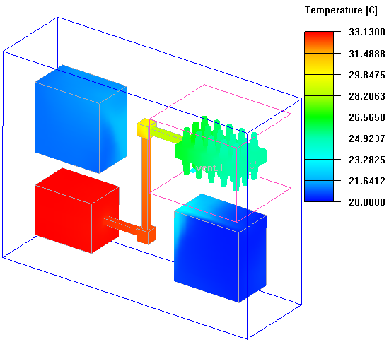

**Figure 6.9: Velocity Vector Field Around Fan and Heat Sink (cut.1)**

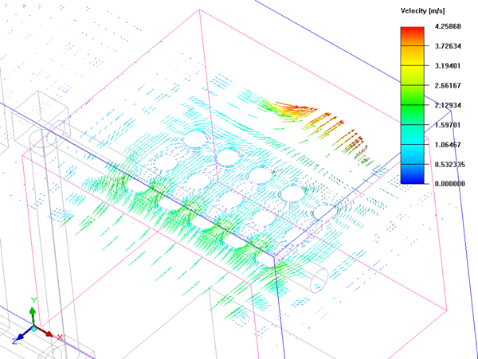

### 6.12. Step 9: Summary

In this problem, you have modeled a simplified heat pipe using cylindrical solid blocks of orthotropic conductivity. The exercise has also demonstrated the application of copy and mirror features as well as the use of nested non-conformal meshing using assemblies in Ansys Icepak.

We repeat some of the tips and best practices found in this tutorial for your convenience:

1. Best Practices

a. Reduce mesh counts and consequently decrease run times in regions requiring less resolution by creating separately meshed assemblies when appropriate. Also select suitable slack values that improve the convergence rate while avoiding mesh bleeding.

b. Increase slack values for faces with a wake region if using a separately meshed assembly. Do

this to model the wake more accurately.

c. Use the **Problem setup wizard** for guided problem setup. Edit the problem setup if needed

using the

**Basic parameters** panel.

d. Create monitor points of relevant quantities (temperature, pressure, or velocity) to help judge

convergence alongside residuals.

2. Tips and Tricks

a. Copy similar objects then edit the copied objects to the desired specifications to eliminate re- dundancies. This may be faster than creating every object individually.

b. Choose appropriate solution initializations to achieve faster convergence.

---

## Chapter 7: Non-Conformal Mesh

### 7.1. Introduction

This tutorial examines the effects of using a non-conformal mesh rather than a conformal mesh in a simple pin-fin heat-sink problem.

In this tutorial, you will learn how to:

• Generate a non-conformal mesh and related parameters such as slack values, maximum element sizes, and so on.

• Understand the effects of a non-conformal mesh on total mesh count and results.

• Generate and compare summary reports.

• Apply non-conformal rules and restrictions.

**Note:**

Mesh counts and solution results may differ slightly due to enhancements to the meshing algorithm and Fluent solver, respectively.

### 7.2. Prerequisites

This tutorial assumes that you are familiar with the menu structure in Ansys Icepak and that you have explored the Sample Session in the Icepak User’s Guide and the tutorial Finned Heat Sink (p. 5). For this reason, some steps in the setup and solution procedure will not be shown explicitly.

### 7.3. Problem Description

The model consists of a pin-fin heat sink composed of aluminum, which is in contact with a source dissipating 10 W, as shown in Figure 7.1: Problem Specification (p. 170). The source-heatsink assembly sits in the middle of a wind tunnel with a wind speed of 1.0 m/s. The ambient temperature is 20°C. The flow regime is turbulent.

The objective of this exercise is to become familiar with the non-conformal meshing methodology and its application. You will examine and compare the solution results of a conformal and a non-conformal mesh.

In Ansys Icepak, you can mesh assemblies of objects separately. First, you define a region around an assembly, then Ansys Icepak meshes this region independently of meshes external to your defined region.

This allows a fine mesh to be confined in a particular region of interest and helps to reduce overall mesh count without sacrificing the accuracy of the results.

**Figure 7.1: Problem Specification**

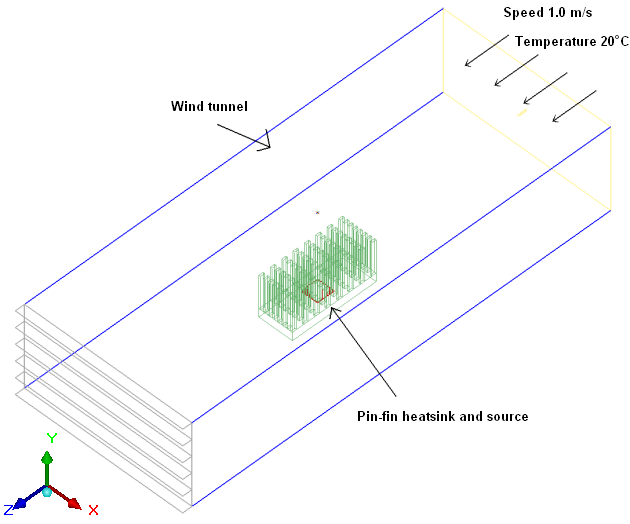

### 7.4. Step 1: Create a New Project

Open a new project and name it **non-conformal**.

### 7.5. Step 2: Build the Model

• Cabinet (

)

Enter the following start and end locations for the cabinet.

| xS | 0.3 m | xE | 0.7 m |
| --- | --- | --- | --- |
| yS | 0.5 m | yE | 0.7 m |
| zS | 0.0 m | zE | 1.0 m |

– Define an opening on the **Cabinet** boundary:

1. Open the **Cabinet** object panel.

2. In the **Properties** tab, change **Wall type** of **Min z** to **Opening**.

3. Click **Edit** to open the **Openings** panel.

4. In the **Properties** tab of the **Openings** panel, enter **1** m/s for the **Z velocity** and keep **Temper-** **ature** as **ambient** (which is 20°C). Refer to Figure 7.2: Openings Panel for Wall Min z (p. 171).

**Figure 7.2: Openings Panel for Wall Min z**

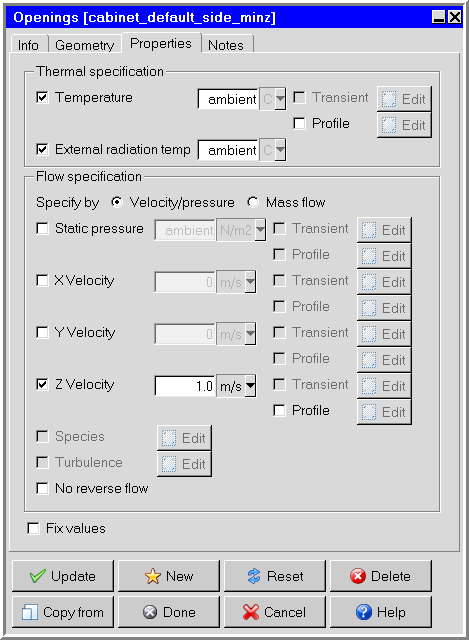

**Tip:**

You can edit the ambient temperature setting, among other default settings, in the

**Basic parameters** panel.

– Define a grille on the **Cabinet** boundary:

1. Under the **Properties** tab of the **Cabinet** panel, change the wall type of **Max z** to **Grille**.

2. Click **Edit** to open the **Grille** panel.

3. In the **Properties** tab of the **Grille** panel, change the **Free area ratio** to **0.8** and leave the other default property specifications.

**Figure 7.3: Grille Properties Specifications**

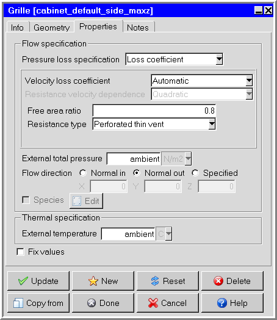

• Source (

)

Create a source using the following dimensions:

| Object |  |  | Specification |
| --- | --- | --- | --- |
| Name: source.1 | xS = 0.48 m | xE = 0.52 m | Total power: 30 W |
| Geometry: Rectangular | yS = 0.52 m | yE = — |  |
| Plane: X-Z | zS = 0.48 m | zE = 0.52 m |  |

• Heat sink (

)

Now, create a heat sink with the following geometrical and physical properties (Figure 7.4: Heat sinks Panel (Specifications for Geometry and Properties) (p. 173)):

**Figure 7.4: Heat sinks Panel (Specifications for Geometry and Properties)**

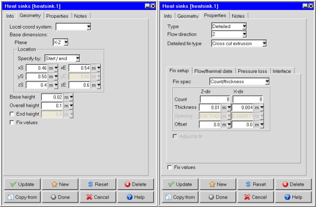

### 7.6. Step 3: Generate a Conformal Mesh

Generate a conformal mesh for the model.

1. Open the **Mesh control** panel using **Model** **Generate mesh** or the **Generate Mesh** button (

).

a. In the **Mesh control** panel, set the **Max element size** for **X** to 0.02 m, for **Y** to 0.01 m, and for **Z** to 0.05 m.

b. Under the **Global** tab, select **Normal** next to **Mesh parameters**.

c. Under the **Misc** tab, select **Allow minimum gap changes**.

d. Click **Generate**.

**Note:**

The minimum gap for X, Y, Z may adjust to 10% of the minimum dimension in respect- ive directions. Make a note of the number of elements, shown in the **Mesh control** panel, as well as the face alignment range, displayed in the **Message** window.

2. Examine the mesh.

a. Click the **Display** tab.

b. Select the **Cut plane** option.

c. In the **Set position** drop-down list, select **Y plane through center**.

d. Select the **Display mesh** option.

**Note:**

The mesh display plane is an X-Z plane cut through the center of the cabinet as shown in Figure 7.5: Conformal Mesh, Central Y Plane (p. 174). Note the clustered mesh lines ex- tending from the heat sink all the way across the domain in both the X and Z directions. The total number of cells is about 144000.

**Figure 7.5: Conformal Mesh, Central Y Plane**

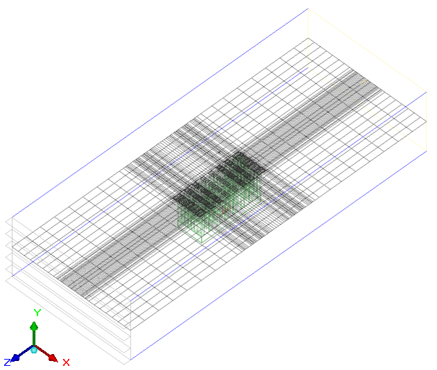

3. Disable the mesh display.

a. Deselect the **Display mesh** option.

b. Click **Close** to close the **Mesh control** panel.

### 7.7. Step 4: Physical and Numerical Settings

Before starting the solver, first review estimates of the Reynolds and Peclet numbers to check that Ansys Icepak is modeling the proper flow regime.

**Solution settings**

**Basic settings**

Click **Reset** in the **Basic settings** panel. Check the values printed to the **Message** window. The Reynolds and Peclet numbers are approximately 12600 and 8900, respectively, so the flow is turbulent.

**Note:**

Instead of accessing the

**Basic parameters** panel as described below, you can instead use the **Problem setup wizard** for guided problem setup by double-clicking

**Problem** **setup** in the model manager window. See 2.7. Step 4: Physical and Numerical Settings (p. 28) of the Finned Heat Sink tutorial for more instruction regarding the **Problem setup wizard**. You must still use the same settings described in this tutorial for the **Problem setup wizard**.

1. To set up turbulent flow, go to

**Basic parameters** and choose the **Zero** **equation** turbulence model under the **General setup** tab.

**Problem setup**

2. Forced convection is the predominant form of convection in this exercise. Natural convection is negligible, so do not enable gravity. Also ignore radiation heat transfer as it is also negligible in comparison to forced convection. This exercise is a steady-state analysis. Click **Accept** to accept the new solver settings.

**Basic settings** and set the **Number of iterations** to **300**.

3. Go to

**Solution settings**

4. Go to **Advanced settings** and specify **Under-relaxation** factors for **Pressure**,**Momentum,** and **Temperature** as **0.7**,**0.3**, and **1.0** respectively.

5. Define a monitor point by dragging the source object (**source.1**) into the

**Points** folder. This creates a monitor point for the temperature of the object, which can be used to judge convergence alongside the residuals.

**Tip:**

Speed up the convergence by initializing the solver with a Z velocity of **1.0** m/s in the **Transient setup** tab of the **Basic parameters** panel.

### 7.8. Step 5: Save the Model

Ansys Icepak saves the model for you automatically before it starts the calculation, but it is a good idea to save the model before the solution. The model can be saved using **File** **Save project**.

### 7.9. Step 6: Calculate a Solution

Start the calculation by clicking **Solve** **Run solution**. Specify "conformal" as the **ID**. Click **Start** **solution** to start the solver.

### 7.10. Step 7: Examine the Results

In this step, examine the maximum temperature using Ansys Icepak’s summary reporting tool.

**Report** **Summary report**

1. Define a report that will display temperature data for the source and the heat sink.

a. In the **Define summary report** panel, click **New**.

b. In the **Objects** drop-down list, select **heatsink.1** and click **Accept**.

c. In the **Value** drop-down list, select **Temperature**.

d. Repeat steps (a) through (c) for **source.1**.

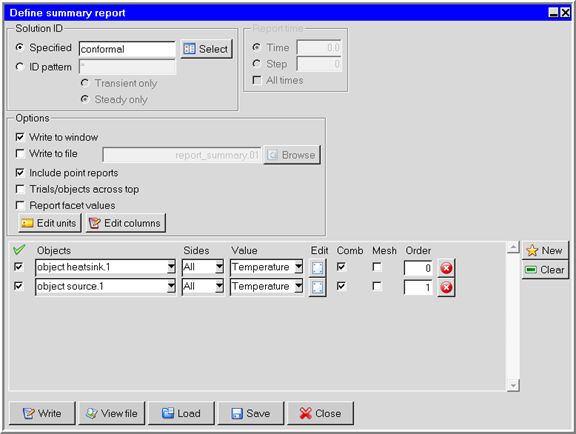

e. Click **Write** to generate a summary report.

Ansys Icepak opens the **Report summary data** panel, where minimum, maximum, and mean tem- peratures for the heat sink and source are displayed. Note that the maximum temperature is about 37° C.

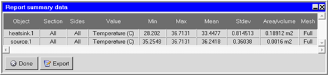

2. Click **Done** to close the **Report summary data** panel.

3. Click **Close** to close the **Define summary report** panel.

### 7.11. Step 8: Add an Assembly to the Model

You will now create an assembly out of the source and heat sink objects. The assembly will be meshed separately from the rest of the model.

**Note:**

Because you are changing the current model, thereby invalidating the post-processing data that has been loaded from the previous steps, you will need to generate a mesh (a non- conformal mesh) and calculate the solution again which is shown in steps 9 through 11.

1. Create an assembly consisting of the source and the heat sink objects.

a. Click the **Create assemblies** button (

) to create a new assembly. This creates an assembly node in the **Model manager** window under the **Model** node.

b. Select the **source.1** item under the **Model** node in the **Model manager** window, hold down the

**Ctrl** key, and then select the **heatsink.1** item.

c. Hold down the left mouse button, drag both highlighted items into the **assembly.1** node of the tree, then release the left mouse button.

**Note:**

You can also create assemblies by highlighting **source.1** and **heatsink.1** in the **Model** **manager** window, then right-clicking one of the highlights, going to **Create**, then finally selecting **Assembly**.

2. Edit the assembly and define its bounding box.

a. Select the **assembly.1** node in the **Model manager** window, and then click the **Edit object** button (

) to open the **Assemblies** panel.

b. Click the **Meshing** tab.

c. Select the **Mesh separately** option and enter the **Slack** parameters shown in Figure 7.6: Slack Values and Mesh Controls in the Separately Mesh Assembly (p. 178).

**Figure 7.6: Slack Values and Mesh Controls in the Separately Mesh Assembly**

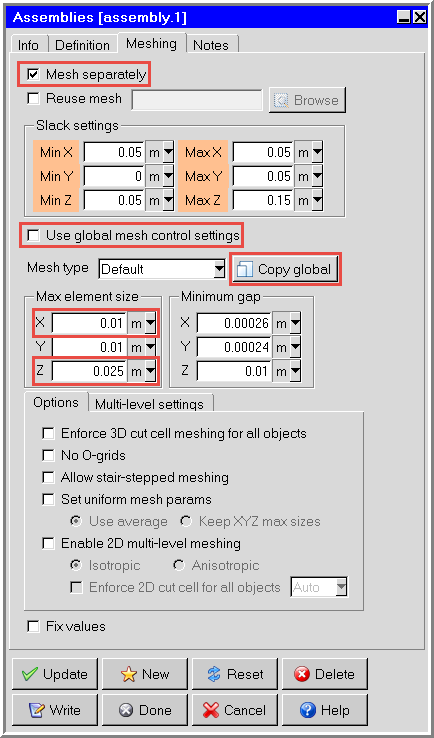

This creates a bounding box region that is 0.05 m larger than the assembly on four sides. Since **Min Y** is already at the bottom of the cabinet, no slack value can be provided for it. A larger slack value of 0.15 m has been provided in the **Max Z** direction to resolve the wake region. Un- check the **Use global mesh control settings** button. Click **Copy global** to copy the global mesh settings. Then, set the **Max X** element size as 0.01 and the **Max Z** element size as 0.025. This helps to refine the mesh within the separately meshed assembly.

d. Click **Done** to set the properties of the assembly and close the panel.

The new model is shown in Figure 7.7: The Source and Heat Sink in a Separately Meshed As- sembly (p. 179).

**Figure 7.7: The Source and Heat Sink in a Separately Meshed Assembly**

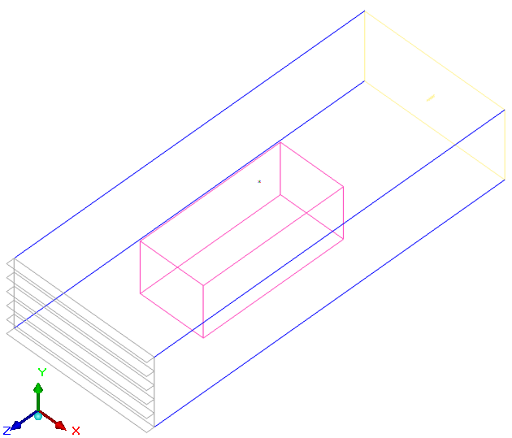

### 7.12. Step 9: Generate a Non-conformal Mesh

Ansys Icepak can now mesh **assembly.1** separately. The non-conformal mesh will limit the clustering to a region inside a bounding box slightly larger than the source-heatsink assembly.

1. Generate a non-conformal mesh for the model.

**Model** **Generate mesh**

a. In the **Mesh control** panel, keep the **Max element size** for **X** set to 0.02 m, for **Y** set to 0.01 m, and for **Z** set to 0.05 m.

b. Under the **Global** tab, make sure the **Mesh assemblies separately** option is checked.

c. Click **Generate** to create the mesh.

**Note:**

Make a note of the number of elements, shown in the **Mesh control** panel, as well as the face alignment range, displayed in the **Message** window.

2. Examine the mesh.

a. Click the **Display** tab.

b. Turn on the **Cut plane** option.

c. In the **Set position** drop-down list, select **Y plane through center**.

d. Turn on the **Display mesh** option.

The mesh display plane is an - plane cut through the center of the cabinet as shown in Fig- ure 7.8: Non-conformal Mesh (p. 180). Note the clustered mesh lines extending from the heat sink all the way across the domain in both the and directions only within the bounds of the as- sembly. The total number of cells is about 101000.

**Figure 7.8: Non-conformal Mesh**

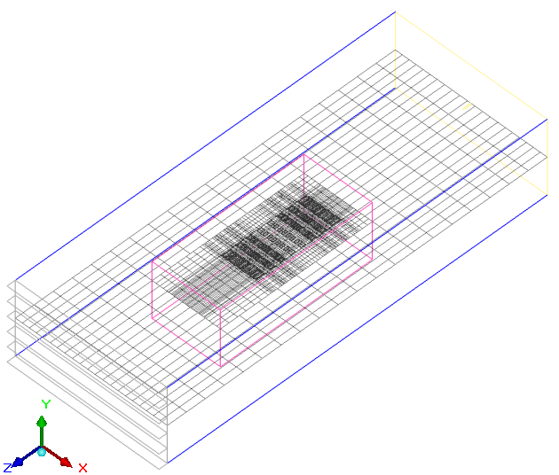

3. Turn off the mesh display.

a. Deselect the **Display mesh** option.

b. Click **Close** to close the **Mesh control** panel.

### 7.13. Step 10: Save the Model

Ansys Icepak will save the model for you automatically before it starts the calculation, but it is a good idea to save the model yourself as well.

**File** **Save project**

### 7.14. Step 11: Calculate a Solution

1. Retain the same **Number of iterations** (300) in the **Basic settings** panel.

2. Start the Solution.

**Solve** **Run solution**

a. Specify non-conformal as the solution **ID**.

b. Click **Start solution** to start the solver.

**Note:**

The monitor point that you already created is automatically used for the new solution.

Your residuals plot may look similar to Figure 7.9: Residuals Plot for the Non-Conformal Mesh (p. 182). Note that the number of iterations is less than that of the solution using the conformal mesh. The exact number of iterations required for convergence may vary on different computers.

**Figure 7.9: Residuals Plot for the Non-Conformal Mesh**

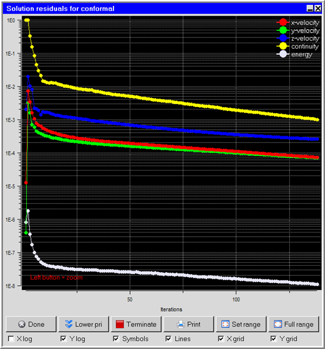

### 7.15. Step 12: Examine the Results

In this step, you will examine the maximum and minimum temperatures of the source and heat sink in the new version of the model.

**Report** **Summary report**

1. Define a report that displays temperature data for the assembly.

a. Retain the same temperature report of the source and the heat sink, as used in the version without the assembly.

b. Click **Write** to generate a summary report.

Note that the reported temperatures (Figure 7.10: Report summary data for the Non-Conformal Mesh (p. 183)) are very close to that obtained in the solution with the conformal mesh.

**Figure 7.10: Report summary data for the Non-Conformal Mesh**

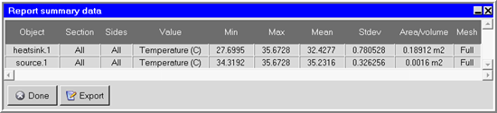

2. Click **Done** to close the **Report summary data** panel.

3. Click **Close** to close the **Define summary report** panel.

### 7.16. Step 13: Summary

In this tutorial, you generated both a conformal and a non-conformal mesh for a simple source-heatsink geometry and compared the two sets of results. You found an approximate 20 percent reduction in the number of cells for the non-conformal mesh with a negligible change in the temperature data. In the process, you learned how to use slack values to create an appropriate bounding box for your sep- arately meshed assembly.

We repeat some of the tips and best practices found in this tutorial for your convenience:

1. Best Practices

a. Reduce mesh counts and consequently decrease run times by creating separately meshed assem- blies that require a different mesh density. Also select suitable slack values that improve the convergence rate while avoiding mesh bleeding.

b. Increase slack values for faces with a wake region if using a separately meshed assembly. Do

this to capture the wake more accurately.

c. Use the **Problem setup wizard** for guided problem setup. Edit the problem setup if needed

using the

**Basic parameters** panel.

d. Create monitor points of relevant quantities (temperature, pressure, or velocity) to help judge

convergence alongside residuals.

2. Tips and Tricks

a. Copy similar objects then edit the copied objects to the desired specifications to eliminate re- dundant work. This is faster than creating every object individually.

b. Initialize the solution with reasonable values to achieve faster convergence.

---

## Chapter 8: Mesh and Model Enhancement Exercise

### 8.1. Objective

The objective of this exercise is to lead you through the decision making process involved in improving a model. The inferences from the exercise should help you make appropriate modeling choices during your next thermal modeling project.

**Note:**

Mesh counts and solution results may differ slightly due to enhancements to the meshing algorithm and Fluent solver, respectively.

### 8.2. Prerequisites

You should be familiar with:

• Ansys Icepak modeling objects

• Basics of meshing

• Non-conformal meshing

### 8.3. Skills Covered

In this tutorial, you will learn the following skills and be able to apply these skills in your own Ansys Icepak projects:

• Basic meshing techniques

• Non-conformal meshing

• Checking for and avoiding intersections between objects and assemblies

• Use of object separation setting

• Eliminating mesh bleeding

• Nested non-conformal meshing

### 8.4.Training Method Used

This tutorial uses a troubleshooting approach. You are provided with a model with potential for improve- ment. You will be given 15 minutes to try your hand at improving the model (you are not expected to complete all the improvements in this short time). This will help you familiarize yourself with the issues associated with the model. Then, an approach for improving the model is delineated in the form of step-by-step hints. Feel free to explore the software interface as you work through these steps.

### 8.5. Loading the Model

1. Set up a working directory on the computer you will be using.

2. Download the meshing_tutorial_start.zip file here.

3. Unzip the meshing_tutorial_start.zip file you have downloaded to your working directory.

4. Unpack and load the model named meshing-tutorial-start.tzr.

5. Rename it to any other name of your choice.

### 8.6. A 15 Minute Exploration

Without making any changes, the model results in about 700,000 elements. It is possible to reduce this mesh significantly without compromising accuracy. You are allowed to modify, delete, or add objects as long as the physics being modeled stays unchanged. You may want to refer to the power and ma- terial specifications to justify model changes. Non-conformal meshing is one of the techniques that will help you accomplish this task.

Work with this model for as long as you prefer within the allocated 15 minutes then stop and proceed to the next set of instructions.

**Hint:**

Start by generating the mesh without making any changes. View mesh cut planes at various orientations and locations to identify causes that result in unnecessary mesh clusters in non- critical regions. Then modify the model in order to tackle the issues you notice.

### 8.7. Step-by-Step Approach

• Save the model you have been working on to another name. (You may be revisiting this model to compare notes with the suggested approach)

• Reload the model you had unpacked earlier ("meshing-tutorial-start").

• Save it to another name of your choice.

### 8.4. Training Method Used

• Generate the mesh without modifying the model. You will see a mesh count of about 700,000 elements.

**Note:**

Ensure the mesh type is **Mesher-HD**.

• Create mesh cut planes in different orientations to identify the root cause for such a high mesh count. One such cut plane (**Z plane through center** set position) is shown in Figure 8.1: A Mesh Cut Plane View of the Given Model When Meshed Without Modifications (p. 187).

• Figure 8.1: A Mesh Cut Plane View of the Given Model When Meshed Without Modifications (p. 187) shows that the high mesh count is due to grid bleeding from the heat sink and the components cooled by it.

**Note:**

You can use non-conformal assemblies to avoid mesh bleeding in Ansys Icepak.

**Figure 8.1: A Mesh Cut Plane View of the Given Model When Meshed Without Modifications**

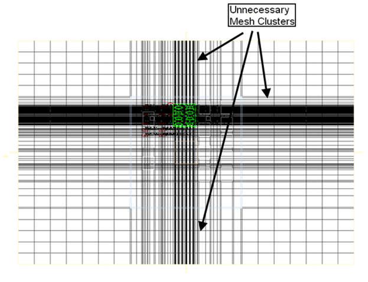

### 8.8. Modification 1: Non-Conformal Mesh of the Heat Sink and Components

1. Create an assembly containing the heat sink and the components cooled by it (green colored objects). Name it **HS-asy**.

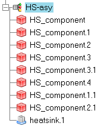

**Tip:**

• Inside the graphics window, hold the **Shift** key, then click and draw a box around the group of objects you would like to assemble.

• If you have trouble selecting the heat sink objects, you can make the mesh and some objects invisible.

• You can also select the objects in the **Model manager** window by selecting **heatsink.1** and then holding down **Shift** and clicking all objects with **HS_component** in their name.

2. Mesh the non-conformal assembly with nonzero slack values.

a. Select **Mesh separately** under the **Meshing** tab of the **Assemblies** panel for this assembly (**HS-** **asy**) and specify appropriate slack values (we recommend 1 mm on all sides as in Figure 8.2: Slack Values for HS-asy (p. 189)). Furthermore, it is usually best practice to have 2-3 cells within the slack region. You can verify the number of cells within a slack region by examining the mesh in that area.

b. Click **Copy global** and then enter **Max element size** values for **X**,**Y**, and **Z**, respectively, 0.015

m, 0.01 m, and 0.0075 m.

### 8.8. Modification 1: Non-Conformal Mesh of the Heat Sink and Components

**Figure 8.2: Slack Values for HS-asy**

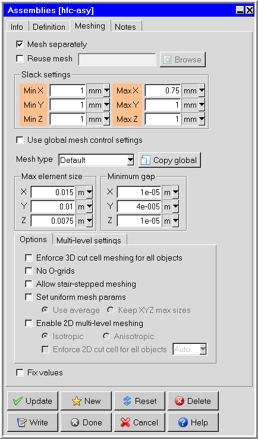

**Note:**

Make sure to update the units for the slack settings to mm.

**Tip:**

Use the **Case check** macro to ensure that no problematic assembly intersections exist. In the **Macros** menu, select **Productivity** **Validation** **Automatic Case Check** **Tool**. Click **Apply** for each case and note that there are no errors. Click **Close** when finished.

c. Generate the mesh again.

d. Observe the decrease in element count. The mesh count should be around 300,000 elements

compared to the previous 700,000 element count.

Figure 8.3: Comparison Between the Non-Conformal Mesh and the Conformal Mesh (p. 190) shows the difference between the non-conformal mesh and the conformal mesh you have generated. Notice that in the non-conformal mesh, mesh bleeding is minimal. In the conformal mesh, the mesh bleeds throughout the cabinet, resulting in a much higher overall mesh count.

**Figure 8.3: Comparison Between the Non-Conformal Mesh and the Conformal Mesh**

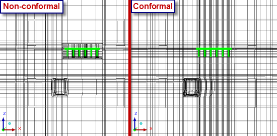

### 8.9. Modification 2: Non-Conformal Mesh for the hi-flux-comps Cluster

1. View cut planes of the mesh to see if you have any more unnecessary mesh bleeding. Figure 8.4: Mesh Bleeding After 1 Non-Conformal Region (p. 191) shows one such cut plane.

• This time the unwanted meshing bleeding originates from the clusters of components named **hi-** **flux-comp** (red colored objects).

**Figure 8.4: Mesh Bleeding After 1 Non-Conformal Region**

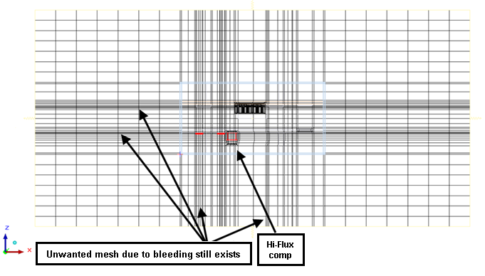

2. Create a non-conformal mesh around the cluster of components named **hi-flux-comp**.

Even though you are only interested in isolating the **hi-flux-comp** objects, there are two cylindrical objects very close to it. You have two choices.

• Avoid the cylinders by using zero slack value. This may be too small and create a small gap between the interface and the cylinders, which is not recommended because it can lead to cells with high aspect ratios.

• Include the cylinders to the assembly. This is the suggested approach.

3. Create a non-conformal assembly named **hfc-asy** that includes the objects with the names **hi-** **flux-comp**,**Tab**,**Die**, or **cylinder-comp**. See the objects highlighted in Figure 8.5: Objects for Assembly hfc-asy (p. 192). Note that the **Tab** and **Die** objects are physically contained within the **hi-flux-comp** objects.

**Figure 8.5: Objects for Assembly hfc-asy**

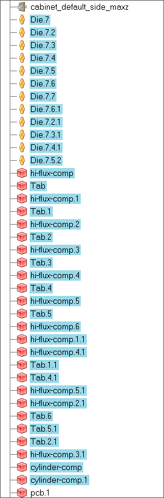

4. Edit the **hfc-asy** assembly and specify the slack settings as shown in Figure 8.6: Slack Settings for Assembly hfc-asy (p. 193):

**Figure 8.6: Slack Settings for Assembly hfc-asy**

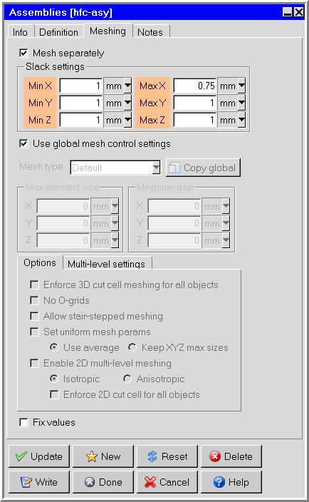

**Note:**

Make sure to update the units for the slack setting to mm.

5. Generate the mesh again.

6. Compare to the previous mesh and notice you have eliminated mesh bleeding originating from the **hi-flux-comp** cluster (Figure 8.7: Mesh Bleeding Reduction due to Modification 2 (p. 194)).

**Figure 8.7: Mesh Bleeding Reduction due to Modification 2**

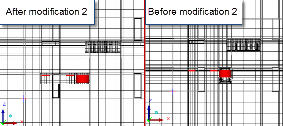

7. Repeat cut plane viewing. Figure 8.8: Mesh Bleeding from the Boards (p. 195) shows a cut plane view after creating the two separate mesh regions. You can still eliminate the mesh bleeding emanating from the boards.

**Figure 8.8: Mesh Bleeding from the Boards**

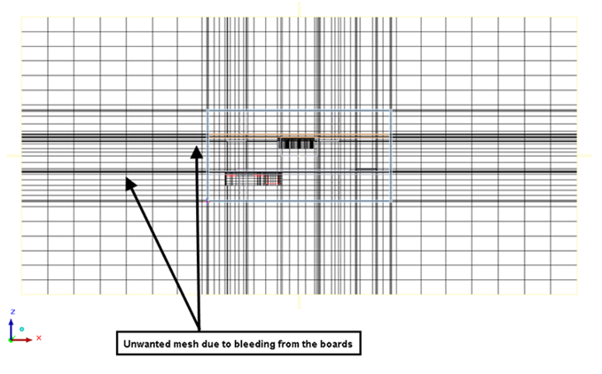

### 8.10. Modification 3: A Super Assembly

Reduce the mesh bleeding you see in Figure 8.8: Mesh Bleeding from the Boards (p. 195) by first creating a separately meshed assembly of everything inside the enclosure: all model objects excluding the cab- inet and the cabinet openings. Remember to mesh the assembly separately and use a slack value of **1** mm on all faces. Generate a mesh as you have previously. Notice that the mesh no longer bleeds beyond the enclosure. Consequently, the mesh count (170,000 elements) is significantly lower than it was pre- viously (300,000 elements).

Figure 8.9: Cut Plane View of Recursive Embedded Mesh (p. 196) shows the resultant Y-center cut plane of the mesh.

**Figure 8.9: Cut Plane View of Recursive Embedded Mesh**

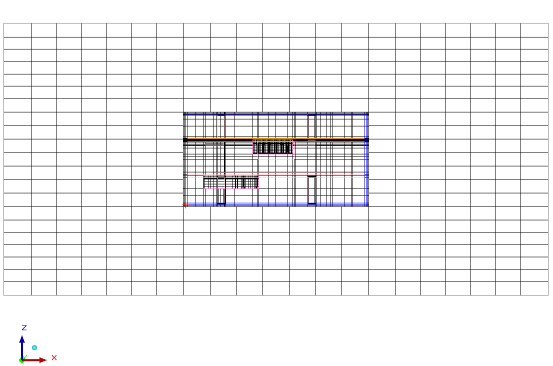

This method of creating a super assembly containing sub-non-conformal assemblies is called "nested non-conformal meshing" or "recursive embedded meshing".

### 8.11. Modification 4: Separation Tolerance and Minimum Gap Settings

• Revisiting the Separation Setting

By default, Ansys Icepak accepts all minimum gap changes. We shall revisit these changes now.

– In the **Mesh control** panel, set all the **Minimum gap** settings to **1e-4** m (Figure 8.10: Minimum

gap Settings (p. 197)).

**Figure 8.10: Minimum gap Settings**

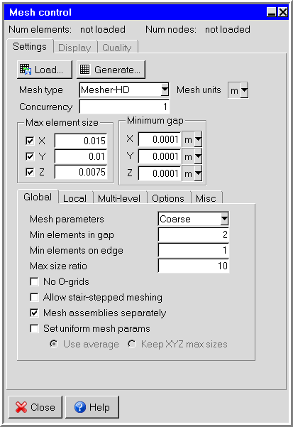

– In the **Misc** tab, deselect **Allow minimum gap changes**.

– Generate the mesh.

– The pop-up message as shown in Figure 8.11: Separation Warning (p. 198) will appear.

**Figure 8.11: Separation Warning**

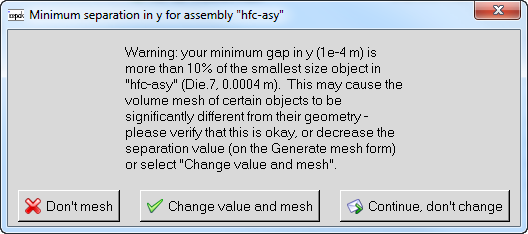

– This warning appears because the gap (think of it as a tolerance setting for the mesher) distance

is larger than 10% of the smallest feature in the model.

– When there are objects smaller than the mesher tolerance, those objects will not be meshed cor-

rectly.

– However, note that the minimum gap setting is a useful tool designed to avoid unnecessary

meshing in regions with inadvertent geometry misalignments (without modifying the geometry) or regions that do not require physical modeling.

– Look for the name of the object featured in the warning and its dimension.

– The warning is about the die objects, which are 0.0004 m in width.

**Note:**

Due to possibly different meshing priorities, you may get a warning for the object **Airgap** first as the object’s thickness is equal to the minimum gap settings. Select **Change value and mesh** if that warning appears.

→These objects are power generating components, which are thin conducting plates. The warning

is about the width of the packages.

→The surface area of the dies is a critical parameter affecting the temperature prediction for the

component. This cannot be simplified. Selecting **Continue, don’t change** would essentially ignore the small geometry of the dies during meshing.

→Hence, click **Change value and mesh** to accept the suggested change in the minimum gap

setting.

**Note:**

It is also possible to use a separation distance larger than the recommended 10% value. Values of up to 50% (of the smallest dimension) may be used in cases where reducing the mesh count is critical.

– You will now get a separation warning about the tabs. You cannot change the geometry of the

tabs, so accept the suggested change in separation settings again.

**Note:**

You may get a message in the text window such as "16 values were modified by less than minimum separation values to eliminate small gaps". The mesher is modifying the geometry itself to get rid of problematic small gaps due to misalignments. In this exercise, the modifications are negligible and thus do not cause a problem.

### 8.12. Additional Exercise: Local Mesh Refinement and Comparisons Between the Non-Conformal and Conformal Meshes

• Refine the mesh locally for regions with higher gradients and therefore with greater resolution re- quirements.

**Tip:**

The size of the first cells from critical heat-dissipating surfaces should be less than 1 mm for a first cut analysis.

– View the mesh cut plane on the wall of the enclosure object, the PCB, and the critical heat gener-

ating components to see if you are fulfilling the above requirement.

– Use the **Object params** control in the **Local** tab of the **Mesh control** panel to specify mesh refine-

ment near all the important surfaces mentioned above. The **Object params** panel allows localized, per-object mesh control. For an example, enter 0.001 for the Element height of the enclosure object. A similar approach can be taken for the pcb object.(Figure 8.12: Per-object Meshing Paramet- ers (p. 200)).

**Figure 8.12: Per-object Meshing Parameters**

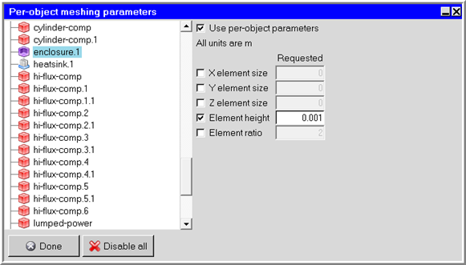

• Generate the mesh to verify your changes.

• Now compare the conformal and non-conformal meshes.

Deselect the **Mesh assemblies separately** option in the **Mesh control** panels and generate the mesh. The difference between the mesh with this check button selected and deselected is the effect of non- conformal meshing.

• Problem setup, solution, and post-processing are beyond the scope of this exercise and are therefore not explored.

• Compare the suggested approach to meshing with the approach you were attempting during the initial 15 minute period of this tutorial.

### 8.13. Conclusion

You have significantly reduced the mesh count of a model through successive modifications to the mesh. Consequently, the computing time and cost of the solution is much lower. Using approximate object choices and enhanced meshing strategies, you have improved both the model and the mesh. The approach delineated in this exercise can help reduce significant run time without compromising the physics being modeled. Use the techniques you have learned in this tutorial to improve your meshes in other projects.

We repeat some of the tips and best practices found in this tutorial for your convenience:

1. Best Practices

a. Maintain 2-3 cells within a slack region.

b. Identify problematic areas within your mesh by visually inspecting it.

c. Reduce the cell count by eliminating mesh bleeding and choosing appropriate minimum gap values.

d. Eliminate mesh bleeding by creating separately meshed assemblies.

e. Use the **Case check** macro to avoid intersections between different objects and/or assemblies.

f. Choose suitable slack values to avoid mesh bleeding while adequately reducing mesh count.

g. Ensure that the size of the first cells from critical heat-dissipating surfaces is less than 1 mm for

a first cut analysis.

2. Tips and Tricks

a. Make objects temporarily invisible or inactive when the objects obstruct your view in the graphics window.

b. Select appropriate minimum gap values to avoid unnecessary meshing in regions with inadvertent

geometry misalignments or in regions where physical modeling is unneeded.

---

## Chapter 9: Loss Coefficient for a Hexa-Grille

### 9.1. Introduction

This tutorial demonstrates how to define trials, run parametric solutions, and post-process the results. Often, there is a need to calculate the loss coefficient of grilles that have certain hole patterns. The purpose of the problem is to determine the minor loss coefficient of a grille that has hexagonal holes.

In this tutorial you will learn how to:

• Define a parameter to optimize the design.

• Define trials.

• Define primary and compound functions that you want to report.

• Calculate parametric solutions.

• Report and plot parametric results.

**Note:**

Mesh counts and solution results may differ slightly due to enhancements to the meshing algorithm and Fluent solver, respectively.

### 9.2. Prerequisites

This tutorial assumes that you are familiar with the menu structure in Ansys Icepak and that you have solved or read the tutorial Finned Heat Sink (p. 5). Some steps in the setup and solution procedure will not be shown explicitly.

### 9.3. Problem Description

The model includes a cabinet that is 160 mm in length with inlet and outlet openings at the two ends (with cross sectional area of 7.363 mm x 12.7 mm), and four symmetry walls at the other sides. The model also includes a part of the hexa-grille placed at the center of the channel in the streamwise dir- ection, as shown in Figure 9.1: Problem Specification (p. 204). The grille has one full hexagonal hole at the center and four quarter hexagonal holes placed around it. This pattern was selected because it forms a periodic region and is sufficient to calculate the loss coefficient. The solution obtained from this run can be replicated to form the solution for the entire domain.

**Figure 9.1: Problem Specification**

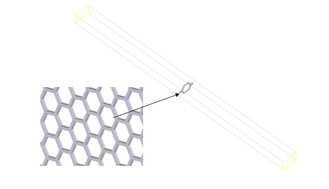

### 9.4. Step 1: Create a New Project

1. Set up a working directory on the computer you will be using.

2. Download the loss_coefficient.zip file here.

3. Unzip the loss_coefficient.zip file you have downloaded to your working directory.

4. Copy loss-coefficient.tzr to your working directory.

5. Start Ansys Icepak, as described in Starting Ansys Icepak.

6. When Ansys Icepak starts, the **Welcome to Icepak** panel opens automatically.

7. Click **Unpack** in the **Welcome to Icepak** panel.

8. The **File selection** panel appears.

9. In the **File selection** panel, select the packed project file loss-coefficient.tzr and click **Open**.

10. The **Location for the unpacked project** file selection dialog appears.

11. In the **Location for the unpacked project** file selection dialog, select a directory where you would like to place the packed project file, enter a project name in the **New project** text field, then click **Unpack**.

### 9.5. Step 2: Build the Model

This tutorial uses an existing model. Ansys Icepak displays the model in the graphics window, as shown in Figure 9.2: Loaded Model (p. 205).

**Figure 9.2: Loaded Model**

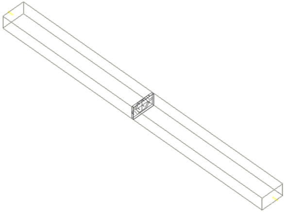

Save the problem to a new project file.

This enables you to expand on the problem without affecting the original file.

**File** **Save project as**

1. In the **Project** text box, enter the name loss-coefficient-new.

2. Click **Save**.

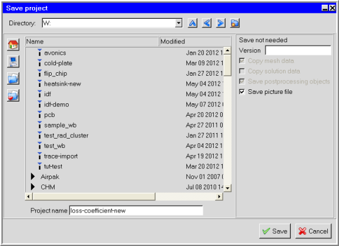

### 9.6. Step 3: Define Parameters and Trials

You will first define a summary report of data at the openings. Next, you will specify a parameter, the Reynolds number, and trials to vary the Reynolds number. You will also define primary and compound functions to be reported. Primary functions are reported directly from ANSYS Icepak, such as the static pressure or mean velocity at the inlet. Compound functions are composed of one or more primary functions, such as the loss coefficient.

1. Define the report that displays average velocity and pressure data at the inlet and outlet openings.

**Solve** **Define report**

**Note:**

The loss coefficient *K* is obtained by dividing the total pressure differential through the

domain by the average dynamic pressure, .

a. In the **Define summary report** panel, click **New**.

b. In the **Objects** drop-down list, select **cabinet_default_side_maxx** and click **Accept**.

c. In the **Value** drop-down list, select **UX**.

d. Repeat steps (a) and (b), then select **Pressure** in the **Value** drop-down list.

e. Repeat steps (a) through (d) for **cabinet_default_side_minx**.

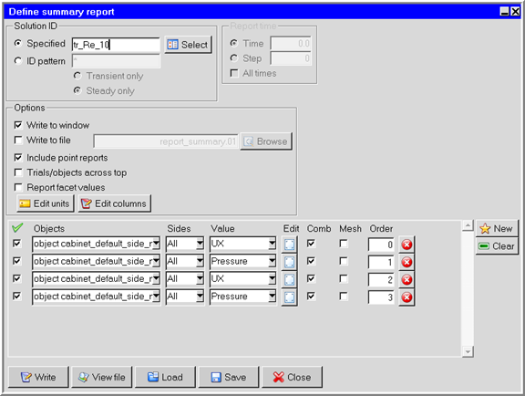

f. Click the **Close** button to accept the settings and close the panel.

2. Define a velocity parameter at the inlet opening in terms of the Reynolds number ( ).

**Note:**

The velocity at the inlet opening in terms of the Reynolds number ( ), which is custom- arily used in loss-coefficient plots in lieu of velocity, is calculated as , where the kinematic viscosity ν = 1.84e-5 kg/m.s, and the hydraulic diameter of the duct Dh = 9.322e-3 m.

a. Select the inlet opening,**cabinet_default_side_minx**, in the **Model manager** window, and then click the **Edit object** button (

) to open the **Openings** panel.

b. Click the **Properties** tab.

c. Select **X Velocity** and set the value to $Re*1.84e-5/9.322e-3.

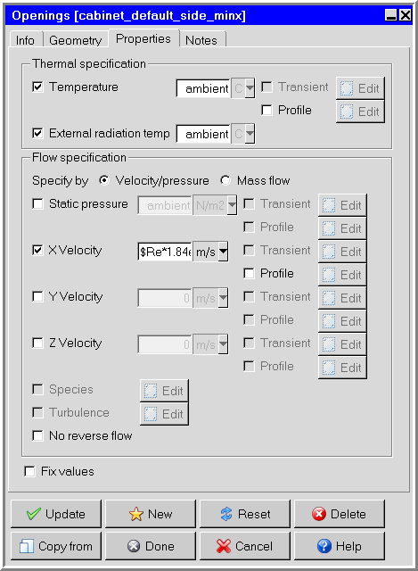

d. Click **Done** to set the properties of the opening. This opens the **Param value** panel.

e. Set the **Initial value of Re** to 10, and click **Done** to close both the **Param value** and the

**Openings** panels.

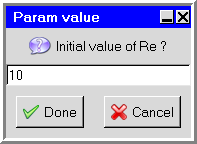

3. Define six trials according to the different values of the Reynolds number.

**Solve** **Define trials**

a. In the **Parameters and optimization** panel, ensure you have selected **Parametric trials** and **All** **combinations** in the **Setup** tab.

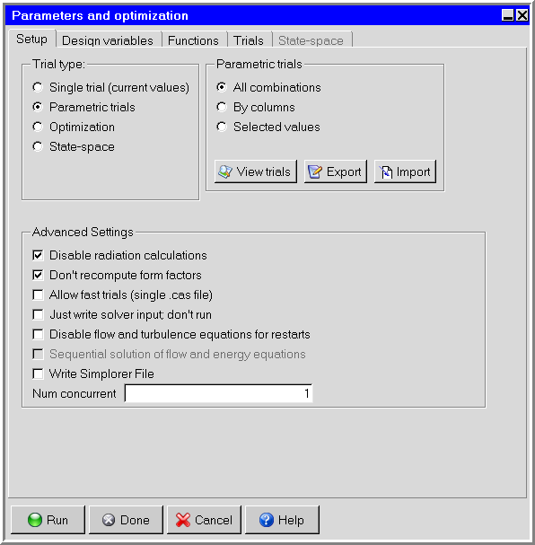

b. Click the **Design variables** tab, enter the following values for the Reynolds number in the box

next to the **Discrete values** field: 10 50 100 500 1000 1750.

Click **Apply** to accept the changes.

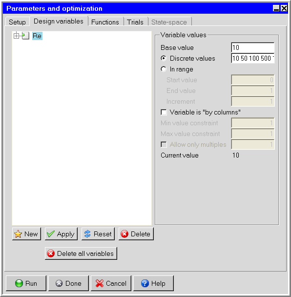

**Note:**

Parameters values can also be exported/imported by clicking the **Export** or **Import** button in the **Setup** tab of the **Parameters and optimization** panel. Clicking **Export** or **Import** opens a file selection dialog box and overrides any existing data.

c. Click the **Trials** tab to review the trials. Ensure the **Trials across top** option at the bottom of the tab is not selected, and click **Reset** to select **Values** instead of **Numbered** in order to use the base names as values.

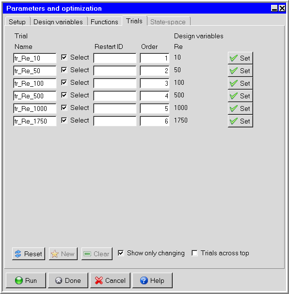

d. Do not close the panel yet. Proceed to the next step.

4. Set the parametric trials and define primary and compound functions.

a. While you are still in the **Parameters and optimization panel**, click the **Setup** tab.

b. Verify that the **Parametric trials** and **All combinations** options are selected.

c. Click the **Functions** tab.

d. Define four primary functions (Pstat_in, Pstat_out, Uave_in, and Uave_out).

**Note:**

These functions represent static pressures and average velocities at the inlet and outlet, respectively.

i. Under **Primary functions**, click the **New** button to open the **Define primary function** panel.

ii. In the **Define primary function** panel, enter Pstat_in for the **Function name**.

iii. Select **Report summary** from the **Function type** drop-down list and **cabinet_de-**

**fault_side_minx Pressure** from the **Item** drop-down list and retain the selection of **Max**.

iv. Click **Accept** to accept the changes and close the panel.

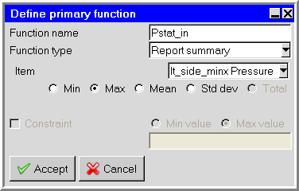

v. Repeat steps (i) through (iv) for the following three functions:

| Function name | Function type | Item | Max/Mean |
| --- | --- | --- | --- |
| Pstat out _ | Report summary | cabinet de- _ fault side maxx _ _ Pressure | Max |
| Uave in _ | Report summary | cabinet de- _ fault side minx UX _ _ | Mean |
| Uave out _ | Report summary | cabinet de- _ fault side maxx UX _ _ | Mean |

**Important:**

All function names are case-sensitive.

5. Define five compound functions (Pdyn_in, Pdyn_out, Ptot_in, Ptot_out, and Kfact).

a. Under **Compound functions**, click the **New** button to open the **Define compound function** panel.

b. In the **Define compound function** panel, enter Pdyn_in for the **Function name**.

c. Next to **Definition** enter 0.5*1.1614*$Uave_in*$Uave_in.

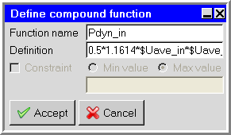

d. Click **Accept** to accept the changes and close the panel.

e. Repeat steps (a) through (d) for the following four functions:

| Function name | Definition |
| --- | --- |
| Pdyn out _ | 0.5*1.1614*$Uave out*$Uave out _ _ |
| Ptot in _ | $Pstat in+$Pdyn in _ _ |
| Ptot out _ | $Pstat out+$Pdyn out _ _ |
| Kfact | ($Ptot in-$Ptot out)/$Pdyn out _ _ _ |

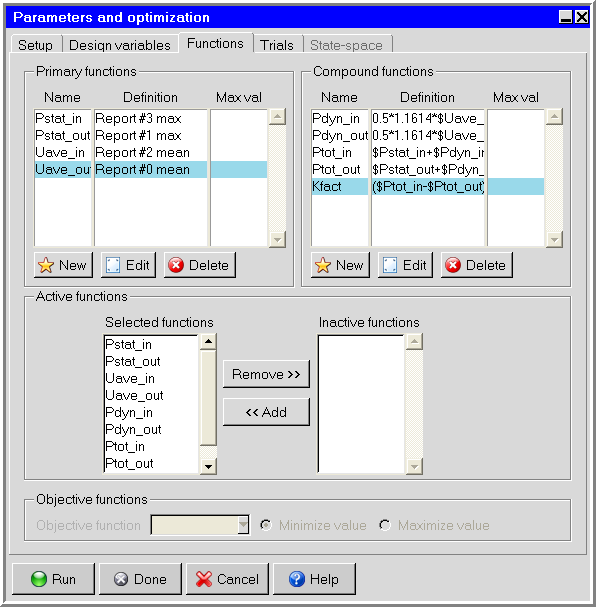

6. Click **Done** to close the **Parameters and optimization** panel.

### 9.7. Step 4: Generate a Mesh

For this model, you will generate the mesh in just one step. The resulting mesh will be sufficiently fine near object faces to resolve the flow physics properly.

**Model** **Generate Mesh**

1. Generate the mesh for the model.

a. Keep all the defaults in the **Mesh control** panel.

b. Click **Generate** in the **Mesh control** panel to generate the mesh.

2. Examine the mesh.

a. Click the **Display** tab.

b. Select the **Cut plane** option.

c. In the **Set position** drop-down list, select **Y plane through center**.

d. Select the **Display mesh** option.

**Note:**

The mesh display plane is an X-Z cut plane through the center of the cabinet as shown in Figure 9.3: Mesh on the X-Z Plane (p. 215).

**Figure 9.3: Mesh on the X-Z Plane**

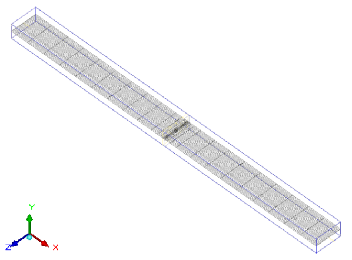

e. Deselect the **Cut plane** check box. Select the **Volume** check box.

f. In the **Surface/volume options** group box, select **Selected object**.

g. In the **Model manager** window, click **block.1**. View the volume mesh of the hex structure (Fig-

ure 9.4: Volume Mesh of Object block.1 (p. 216)).

**Figure 9.4: Volume Mesh of Object block.1**

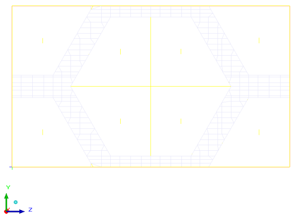

3. Deselect the **Display mesh** option to turn off the mesh display.

4. Click **Close** to close the **Mesh control** panel.

### 9.8. Step 5: Physical and Numerical Settings

**Note:**

Instead of accessing the

**Basic parameters** panel as described below, you can instead use the **Problem setup wizard** for guided problem setup by double-clicking

**Problem** **setup** in the model manager window. See 2.7. Step 4: Physical and Numerical Settings (p. 28) of the Finned Heat Sink tutorial for more instruction regarding the **Problem setup wizard**. You must still use the same settings described in this tutorial for the **Problem setup wizard**.

1. Confirm that Ansys Icepak solves for only the flow variables (velocity/pressure) and that the flow regime is laminar.

**Problem setup**

**Basic parameters**

a. Keep the default selection of **Flow (velocity/pressure)** under **Variables solved**.

b. Under **Radiation**, select **Off**.

c. Keep the default selection of **Laminar** for the **Flow regime**.

d. Click **Accept** to close the panel.

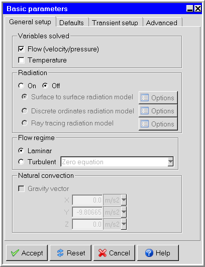

2. Increase the **Number of iterations** to 500.

**Solution settings**

**Basic settings**

a. Enter 500 in the **Number of iterations** field.

b. Click **Accept** in the **Basic settings** panel.

3. Confirm under-relaxation factors are correct.

**Solution settings**

**Advanced settings**

a. Make sure the **Precision** for the solver is **Double**.

b. Click **Accept** in the **Advanced solver setup** panel.

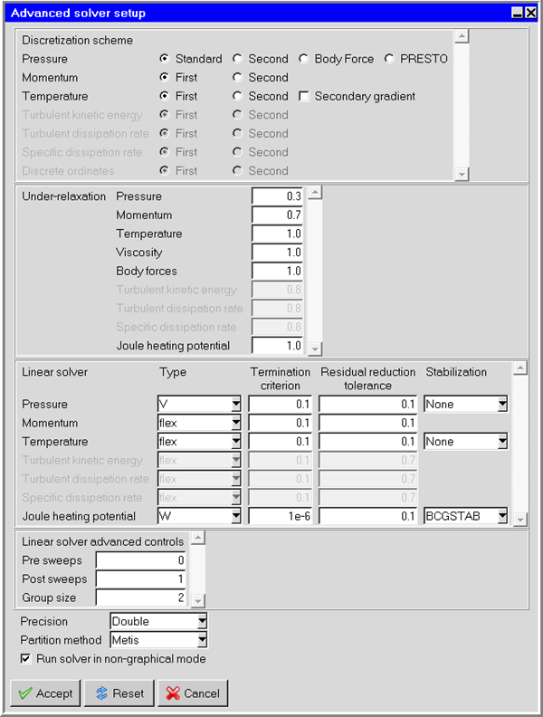

### 9.9. Step 6: Save the Model

Ansys Icepak will save the model for you automatically before it starts the calculation, but it is a good idea to save the model (including the mesh) yourself as well. If you exit Ansys Icepak before you start

the calculation, you will be able to open the project you saved and continue your analysis in a future Ansys Icepak session. (If you start the calculation in the current Ansys Icepak session, Ansys Icepak will simply overwrite your project file when it saves the model.)

**File** **Save project**

### 9.10. Step 7: Calculate a Solution

Start the calculation.

1. **Solve** **Run optimization**

**Note:**

Alternatively, you can click the

button in the **Model and solve** toolbar to display the **Parameters and optimization** panel.

2. Make sure **Allow fast trials (single .cas file)** is not selected in the **Setup** tab.

3. Click **Run** in the **Parameters and optimization** panel.

### 9.11. Step 8: Examine the Results

As Ansys Icepak starts performing the trials, the **Parametric trials** panel opens, displaying all the function values defined previously, as well as parameters and running times for each trial. You can also open the **Parametric trials** panel by selecting **Show optimization/param results** from the **Report** menu.

**Report** **Show optimization/param results**

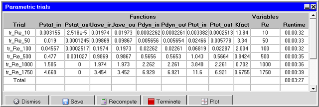

Plot the loss coefficient, Kfact, against the Reynolds number, Re.

1. In the **Parametric trials** panel, click the **Plot** button to open the **Selection** panel.

2. In the **Selection** panel, select **Re** as the axis variable, and click **Okay**.

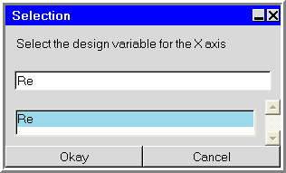

3. In another **Selection** panel, which automatically opens up, select **Kfact** as the *y* axis variable, and click **Accept**.

This displays the plot **Kfact vs Re**, as shown in Figure 9.5: Kfact vs Re Plot (p. 221)

**Figure 9.5: Kfact vs Re Plot**

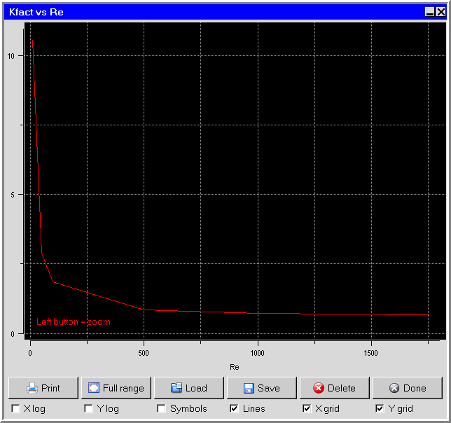

### 9.12. Step 9: Summary

In this tutorial, you have used the parameterization feature to calculate the loss coefficient of a grille as a function of a varying Reynolds number (Re). You also defined other functions, such as static pressures and velocities at the inlet and outlet, for Ansys Icepak to report as functions of the varying Reynolds

number. The results show that the loss coefficient decreases with an increasing Reynolds number. More explicitly, the loss coefficient decays into an asymptote as the Reynolds number increases.

We repeat some of the tips and best practices found in this tutorial for your convenience:

• Best Practice

– Use the **Problem setup wizard** for guided problem setup. Edit the problem setup if needed using

the

**Basic parameters** panel.

• Tips and Tricks

– Use the **Parameters and optimization** feature to perform a parametric analysis of your system.

– Create your own independent variable, such as a varying Reynolds number, in the **Design variables**

tab of the **Parameters and optimization** panel.

– Define your own customized quantities for Ansys Icepak to report in the **Functions** tab of the

**Parameters and optimization** panel.

---

## Chapter 10: Inline and Staggered Heat Sinks Comparison

### 10.1. Introduction

This tutorial demonstrates how to use the check-box (boolean) parameter control for design variables, and how to assign primary functions, in order to determine whether an inline or a staggered pin fin heat sink performs better in a single model. You will compare the resulting maximum temperatures on the package. Non-conformal meshing will also be used to reduce the cell count, required memory, and run time. In addition, you will generate particle traces during the post-processing of the results.

In this tutorial you will learn how to:

• Define a check-box parameter (design variable).

• Define different values for a design variable.

• Run and report parametric trials.

• Clip a plane cut to align it with the sides of a heat sink assembly.

• Display particle traces coming from the fan and the opening.

**Note:**

Mesh counts and solution results may differ slightly due to enhancements to the meshing algorithm and Fluent solver, respectively.

### 10.2. Prerequisites

This tutorial assumes that you are familiar with the menu structure in Ansys Icepak and that you have solved or read the tutorial Finned Heat Sink (p. 5). Some steps in the setup and solution procedure will not be shown explicitly.

### 10.3. Problem Description

The model includes the package assembly, containing a BGA package object (compact conduction model), inline or staggered assemblies consisting of the respective heat sink objects, PCB object, spreader plate, a fan at the exit, and an opening at the inlet of the wind tunnel. The model geometry is shown in Figure 10.1: Problem Specification (p. 224).

**Figure 10.1: Problem Specification**

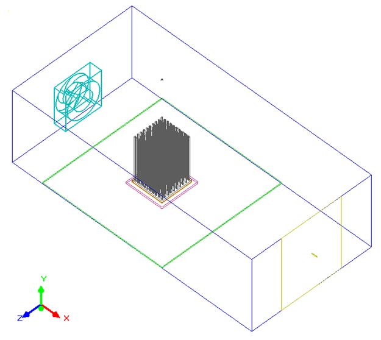

### 10.4. Step 1: Create a New Project

1. Set up a working directory on the computer you will be using.

2. Download the heat_sink.zip file here.

3. Unzip the heat_sink.zip file you have downloaded to your working directory.

4. Copy the file heat_sink2b.tzr to your working directory.

5. Start Ansys Icepak, as described in Section 1.5 of the User’s Guide.

**Note:**

When Ansys Icepak starts, the **Welcome to Icepak** panel will open automatically.

6. Click **Unpack** in the **Welcome to Icepak** panel.

**Note:**

The **File selection** panel will appear.

7. In the **File selection** panel, select the packed project file heat_sink2b.tzr and click **Open**.

**Note:**

The **Location for the unpacked project** file selection dialog will appear.

8. In the **Location for the unpacked project** file selection dialog, select a directory where you would like to place the packed project file, enter a project name in the **New project** text field, then click **Unpack**.

### 10.5. Step 2: Build the Model

**Note:**

This tutorial uses an existing model. Ansys Icepak will display the heat sink model in the graphics window. To view all components, expand all the assemblies of the model in the **Model manager** window.

**Note:**

You can rotate the cabinet around a central point using the left mouse button, or you can translate it to any point on the screen using the middle mouse button. You can zoom into and out from the cabinet using the right mouse button. To restore the cabinet to its default orientation, select **Home position** from the **Orient** menu.

Save the problem to a new project file.

**Note:**

This will allow you to expand on the problem without affecting the original file.

**File** **Save project as**

• In the **Project name** text box, enter the name heat-sink-new.

• Click **Save**.

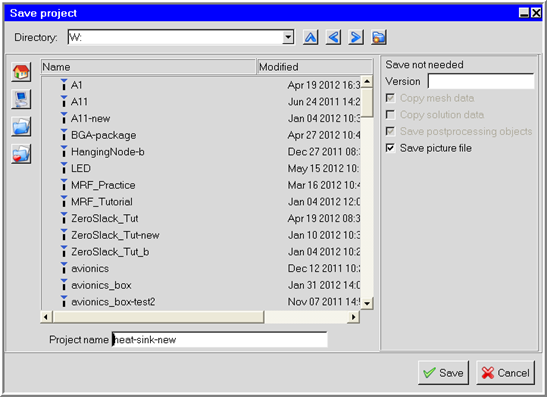

### 10.6. Step 3: Define Design Variables

**Note:**

For both heat sinks, you will define the HeatSink parameter, which will activate/deactivate heat sinks parametrically.

1. Define the HeatSink parameter for the **Inline** heat sink.

a. Select the **Inline** assembly in the **Model manager** window, and then click the **Edit object** button (

) to open the **Assemblies** panel.

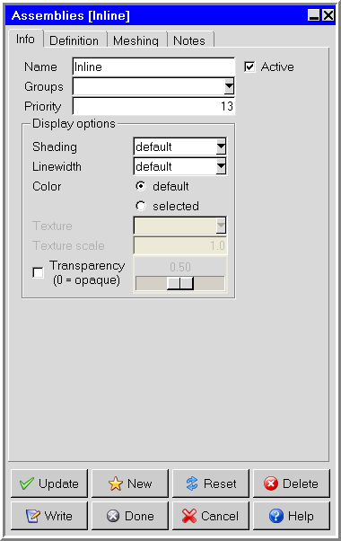

b. Right-click the **Active** check box to open the **Active parameter** panel.

c. Select **ON if variable is equal to this object’s name**.

d. Enter $HeatSink in the **Variable** field.

**Caution:**

Note that all function names are case sensitive.

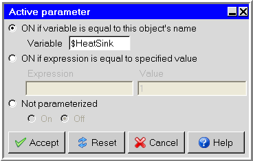

e. Click **Accept** in the **Active parameter** panel to accept the changes and close the panel.

f. Click **Update** in the **Assemblies** panel to open the **Param value** panel.

g. In the **Param value** panel, enter Staggered for the **Initial value of HeatSink**, and click **Done**

to close the panel.

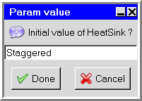

**Note:**

The word **Active** in the **Assemblies** panel became green. Also, note that the **Inline** assembly in the **Model manager** window is moved to the **Inactive** node.

h. Click **Done** in the **Assemblies** panel to close the panel.

2. Define the HeatSink parameter for the **Staggered** heat sink. Repeat the above steps for the **Staggered** assembly:

a. Select the **Staggered** assembly and open its **Assemblies** panel.

b. Right-click the **Active** check box.

c. Select **ON if variable is equal to this object’s name**.

d. Enter **$HeatSink** in the **Variable** field.

e. Click **Accept**.

f. Click **Done** to exit the **Assemblies** panel.

**Note:**

You do not have to specify the initial value of $HeatSink again.

### 10.7. Step 4: Define Parametric Runs and Assign Primary Functions

You will first define values for your design variable. Next, you will review parametric trials and define primary functions to be calculated and reported.

**Solve** **Run optimization**

**Tip:**

Alternatively, you can click the

button.

1. Define parameter values.

a. In the **Parameters and optimization** panel, click the **Design variables** tab.

b. Next to **Discrete values**, after "Staggered" type in "Inline". Make sure to separate the

two with a space.

c. Click **Apply** to accept the changes.

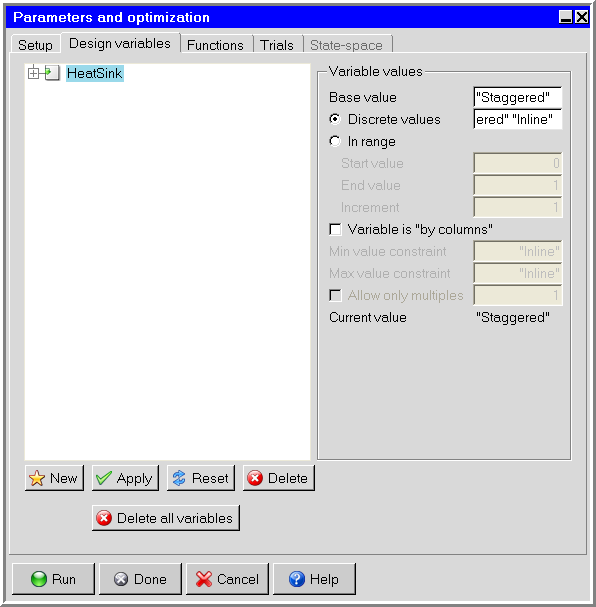

2. Review trials.

a. Click the **Trials** tab.

b. Make sure that the **Order** for **Staggered** is 1, and for **Inline** is 2.

c. Select **tr_HeatSink_Staggered** as the **Restart ID** for the **tr_HeatSink_Inline** trial as shown in the image below. This allows the second trial to use the first trial’s solution data to converge its own solution more quickly.

**Note:**

Double-click in the **Restart ID** field to open the **Restart ID selection** panel.

**Note:**

If necessary, click **Reset** and then **Values** in the **Trails naming** panel to clear the restart IDs.

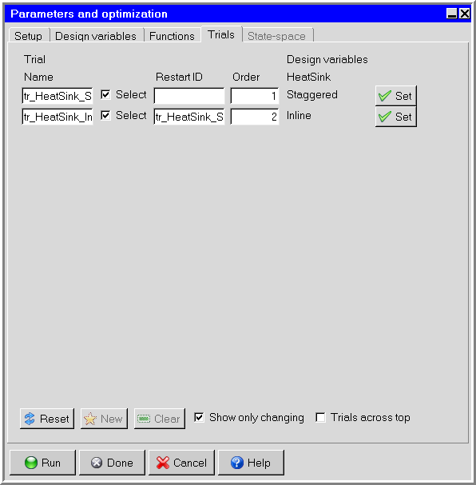

3. Define a primary function.

a. Click the **Functions** tab.

b. Click the **New** button in the **Primary functions** group box.

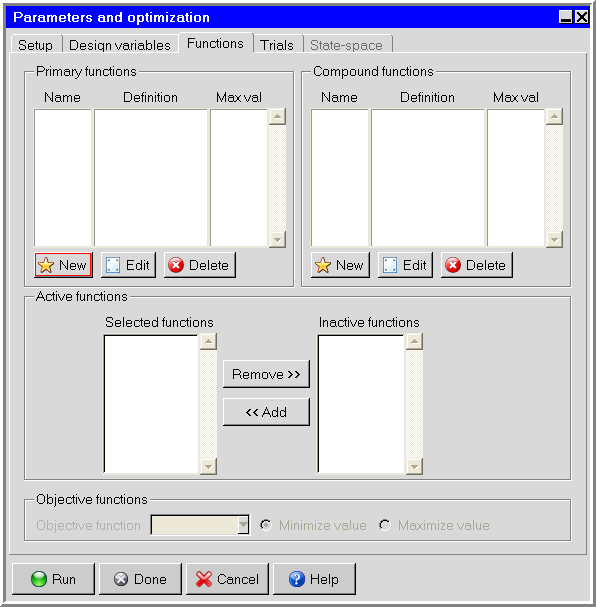

c. In the **Define primary function** panel, enter Tmax next to **Function name**.

d. In the **Value** drop-down list, select **Maximum temperature of objects**.

e. In the **Object** drop-down list, select the **700_BGA_40X40_5peripheral_p1.50** object in the

**Package** assembly, and click **Accept**.

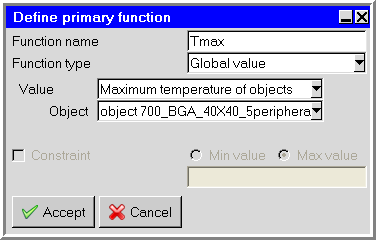

f. In the **Define primary function** panel, click **Accept** to save the changes and close the panel.

g. Click **Done** in the **Parameters and optimization** panel to close the panel.

### 10.8. Step 5: Generate a Mesh

For this model, you will not generate a mesh in advance. Meshing will be automatically performed for each design trial during the parametric trials.

**Model** **Generate Mesh**

1. Set the **Mesh type** to **Mesher-HD**.

2. In the **Global** tab, ensure that the **Mesh assemblies separately** option is selected.

3. Keep all other defaults in the **Mesh control** panel. Your panel settings should resemble those in Figure 10.2: Mesh control Panel Settings (p. 233).

**Figure 10.2: Mesh control Panel Settings**

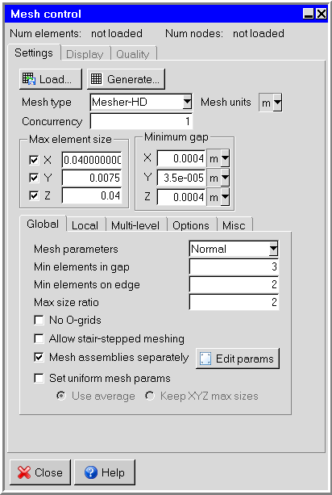

4. Click **Close** in the **Mesh control** panel to close the panel.

### 10.9. Step 6: Physical and Numerical Settings

**Note:**

Instead of accessing the

**Basic parameters** panel, you can instead use the **Problem setup** **wizard** to define your problem setup by double-clicking

**Problem setup** in the model manager window. See 2.7. Step 4: Physical and Numerical Settings (p. 28) of the Finned Heat Sink tutorial for more instruction regarding the **Problem setup wizard**. You must still use the same settings described in this tutorial for the **Problem setup wizard**.

1. Define basic parameters.

**Problem setup**

**Basic parameters**

a. In the **Radiation** box, select **Off**.

b. In the **Flow regime** box, select **Turbulent** and the **Zero equation** turbulence model.

c. In the **Natural convection** box, ensure the **Gravity vector** check box is not selected.

d. Your **Basic parameters** settings should resemble those in Figure 10.3: Basic parameters Panel

Settings (p. 234). Click **Accept** when you are done.

**Figure 10.3: Basic parameters Panel Settings**

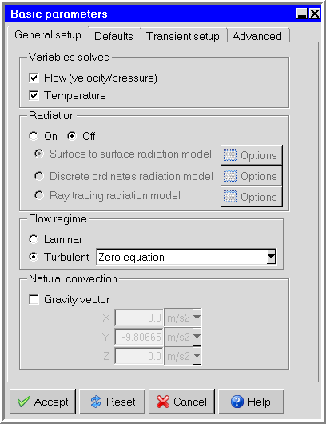

2. Define basic settings.

**Solution settings**

**Basic settings**

a. Set the **Number of iterations** to **300**.

b. Set **Energy** to **1e-8**.

c. Click **Accept** in the **Basic settings** panel to accept the settings and close the panel.

3. Define advanced settings.

**Solution settings**

**Advanced settings**

a. Set **Precision** to **Double**.

b. Click **Accept** in the **Advanced solver setup** panel to accept the settings and close the panel.

### 10.10. Step 7: Save the Model

Ansys Icepak will save the model for you automatically before it starts the calculation, but it is a good idea to save the model (including the mesh) yourself as well. If you exit Ansys Icepak before you start the calculation, you will be able to open the project you saved and continue your analysis in a future Ansys Icepak session. (If you start the calculation in the current Ansys Icepak session, Ansys Icepak will simply overwrite your project file when it saves the model.)

**File** **Save project**

### 10.11. Step 8: Monitor Points

Observe that monitor points have already been defined as shown in Figure 10.4: Monitor Points (p. 235). The monitor point for the **700_BGA_4** package object is set for temperature monitoring, and the **Xmax** opening object is set for velocity monitoring. You can set up your own monitor points by dragging and dropping an object into the **Points** node.

**Figure 10.4: Monitor Points**

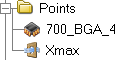

In addition to the residual plot, the monitor plot will display temperature at the center of the BGA package object during the solution process and provide another indication of convergence as the temperature settles on a fixed value.

### 10.12. Step 9: Calculate a Solution

1. Open the **Parameters and optimization** panel.

**Solve** **Run optimization**

**Note:**

You can click the

button in the **Model and solve** toolbar.

2. Click the **Setup** tab, and make sure that options **Parametric trials** and **All combinations** are selected. Deselect **Allow fast trials (single .cas file)**.

3. Click **Run** in the **Parameters and optimization** panel, to start the calculations.

**Note:**

As Ansys Icepak starts calculating solutions for the model, the **Solution residuals** window, displaying convergence history, and the **Temperature Point monitors** window will open. Also, the **Parametric trials** panel will open displaying the function values, as well as parameters and running times for both trials, as shown in Figure 10.5: The **Parametric** **trials** Panel (p. 236). The **Parametric trials** can also be opened by selecting **Show optim-** **ization/param results** from the **Report** menu.

**Figure 10.5: The Parametric trials Panel**

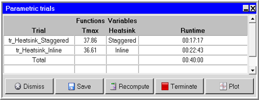

### 10.13. Step 10: Examine the Results

The results from **tr_HeatSink_Inline** will be examined in this section.

1. In the **Orient** menu, select **Orient negative Z**.

2. Display velocity vectors on a plane cut at the exit region of the heat sink.

**Post** **Plane cut**

**Tip:**

You can also open the **Plane cut** panel by clicking the

button.

a. In the **Name** field, enter the name cut_velocity.

b. In the **Set position** drop-down list, select **Vertical - screen select**.

c. Select a point in the graphics window between the fan and the heat sink assembly.

d. Select the **Show vectors** option, and click **Parameters** to open the **Plane cut vectors** panel.

e. Set the **Arrow style** drop-down list to **3D arrow heads**.

f. In the **Plane cut vectors** panel, in the **Color levels** group box, select **This object** from the **Cal-** **culated** drop-down list.

g. Your **Plane cut vectors** panel should resemble that in Figure 10.6: Plane cut vectors Panel (p. 237).

**Figure 10.6: Plane cut vectors Panel**

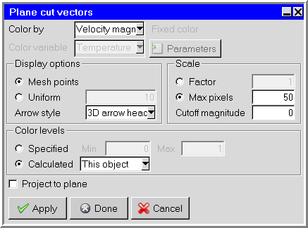

h. Click **Done** in the **Plane cut vectors** panel to accept the changes and close the panel.

i. In the **Orient** menu, select **Isometric view**.

**Note:**

The graphics window is updated, as shown in Figure 10.7: Velocity Vectors at the Exit Region of the Heat Sink (p. 238)

**Figure 10.7: Velocity Vectors at the Exit Region of the Heat Sink**

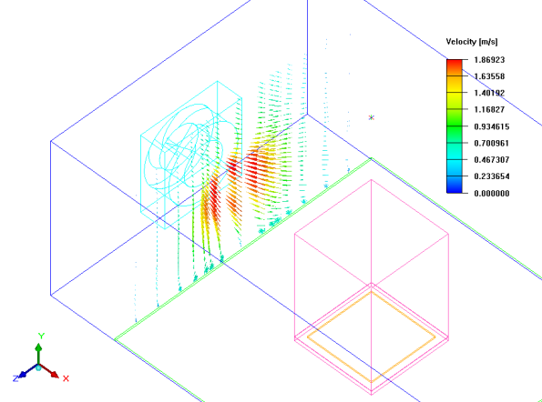

3. Move this plane cut through the model.

a. While holding down the **Shift** key, click and hold down the middle mouse button on an edge of the plane cut.

b. Drag the plane cut through the model in the graphics display window as shown below:

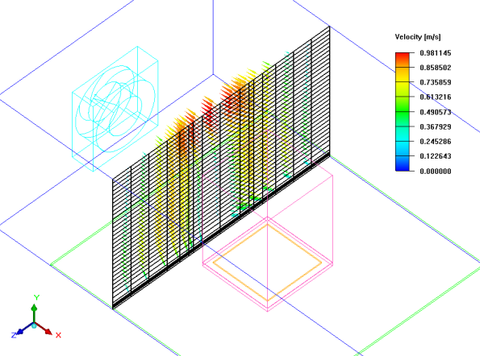

4. Clip the plane cut to align it with the sides of the heat sink assembly.

a. In the **Orient** menu, first select **Orient positive X**.

b. Click Rotate about screen normal

, and then **Scale to fit**.

c. In the **Plane cut** panel (that was already opened), select **Enable clipping**, then click **Max Y** in the orange region under **Clip to box**.

d. Click the top edge of the assembly in the graphics window.

e. In the **Plane cut** panel, click **Min Z** in the orange region under **Clip to box**.

f. Click the left edge of the assembly in the graphics window.

g. In the **Plane cut** panel, click **Max Z** in the orange region under **Clip to box**.

h. Click the right edge of the assembly in the graphics window.

i. Click the **Update** button.

**Note:**

The graphics window will be updated, as shown in Figure 10.8: Clipped Plane Cut (p. 240)

**Figure 10.8: Clipped Plane Cut**

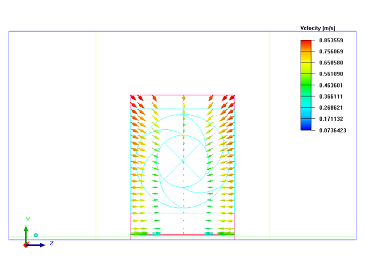

5. Display particle traces in a forward direction.

a. In the **Orient** menu, select **Isometric view**.

b. In the **Plane cut** panel, deselect **Show vectors** and **Enable clipping** and select **Show particle**

**traces**.

c. Click **Parameters** next to **Show particle traces** to open the **Plane cut particles** panel.

d. Select **Speed** from the **Color variable** drop-down list.

e. In the **Point distribution options** group box, keep the default selection of **Uniform**, and enter

50.

f. In the **Style** group box, ensure the **Trail** check box is selected. For **Width**, enter **3**.

g. In the **Color levels** group box, select **This object** from the **Calculated** drop-down list. Your

settings should match those in Figure 10.9: Plane cut particles Panel (p. 241).

**Figure 10.9: Plane cut particles Panel**

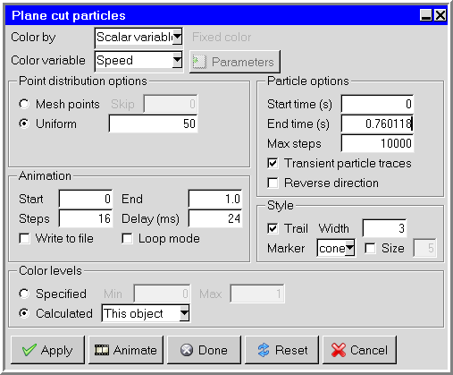

h. Click **Done** to update the graphics window.

**Note:**

The graphics window will display the particle traces in the forward direction, as shown in Figure 10.10: Forward Particle Traces (p. 242)

**Figure 10.10: Forward Particle Traces**

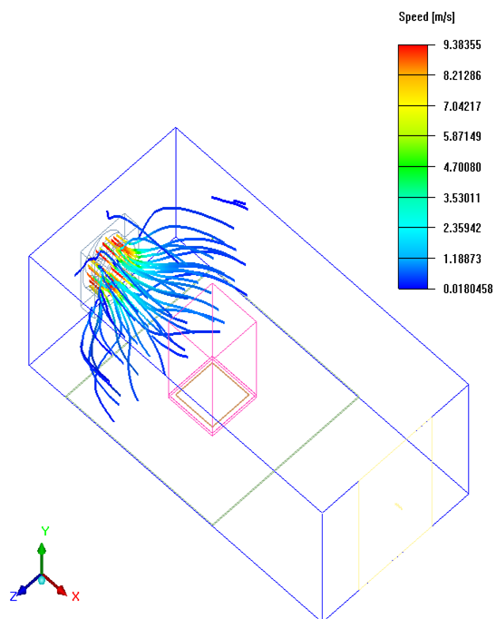

6. Display particle traces at the opening (**Xmax**).

a. In the **Orient** menu, select **Orient negative Z**.

b. In the **Plane cut** panel, deselect **Active** and click **New**.

c. In the **Name** field, enter the name opening-velocity.

d. In the **Set position** drop-down list, select **Vertical - screen select**.

e. Select a point in the graphics window near the opening (**Xmax**).

f. Select the **Show particle traces** option, and click **Parameters** to open the **Plane cut particles** panel.

g. Select **Speed** from the **Variable** drop-down list.

h. In the **display options** group box, keep the default selection of **Uniform**, and enter 70.

i. In the **Style** group box, keep the default selection of **Trail**. Type **3** for **Width**.

j. In the **Color levels** group box, select **This object** from the **Calculated** drop-down list.

k. Click **Done** in the **Plane cut particles** and **Plane cut** panels to close the panels and update the graphics window.

l. In the **Orient** menu, select **Isometric view**.

**Figure 10.11: Opening Particle Traces**

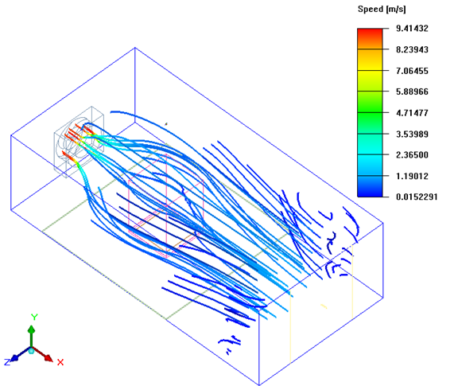

### 10.14. Step 11: Summary

In this tutorial, you have used the optimization tool to determine whether an inline or a staggered pin fin heat sink performs more effectively in this particular model. The resulting maximum temperature on the package was found to be higher in the case of the staggered heat sink.

We repeat some of the tips and best practices found in this tutorial for your convenience:

1. Best Practice

a. Use the **Problem setup wizard** for guided problem setup. Edit the problem setup if needed

using the

**Basic parameters** panel.

b. Create monitor points of relevant quantities (temperature, pressure, or velocity) to help judge

convergence alongside residuals.

2. Tips and Tricks

a. Select a preceding trial's name as the **Restart ID** for another trial to speed up the convergence.

b. Drag a plane cut through the model by pressing **Shift** while clicking the middle mouse button

on the edge of the plane cut.

---

## Chapter 11: Minimizing Thermal Resistance

### 11.1. Introduction

**Important:**

The Optimizers in Icepak and Workbench are add-on features that require additional licensing. Check your licensing information before starting this workflow.

Heat sink optimization is crucial in a variety of industrial applications. Usually, the challenge is to min- imize the thermal resistance (or to maximize the heat transfer) and the amount of material used for the heat sink. The objective of this tutorial is to minimize the thermal resistance for the big heat sink, while keeping the maximum temperature in the entire system below 70°C and ensuring that the total mass of the heat sinks does not exceed 0.326 kg.

In this tutorial you will learn how to:

• Set up an optimization problem.

• Define design variables.

• Define primary, compound, and objective functions.

• Set up an optimization problem and publish variables to Workbench for use in Ansys DesignXplorer.

**Note:**

Mesh counts and solution results may differ slightly due to enhancements to the meshing algorithm and Fluent solver, respectively.

### 11.2. Prerequisites

This tutorial assumes that you have little experience with Ansys Workbench but familiar with the menu structure in Icepak and that you have solved or read the tutorial Finned Heat Sink (p. 5).

### 11.3. Problem Description

The model is composed of an FR-4 board (**FR-4.1**) of 20.32 cm 30.48 cm and 1.59 mm thick with several components placed on the board (Figure 11.1: Problem Specification (p. 246)). Two grilles are placed at the upstream and downstream of the board with the free flow area ratios of 60% and 50%, respectively. There are also two components (**block.1.3** and **block.1.3.1**) dissipating 5 W each.

There is a CPU (**block.1**) dissipating 50W and a heat sink (**heatsink_small**) is placed on the top of it. Between the heat sink and the CPU, there is a thermal interface material (**TIM_1**) with a thermal con- ductivity of W/mK. These components and three small power caps (**power_cap_1.1,** **power_cap_1.1.1** and **power_cap_1.1.2**), dissipating 1 W each, form a non-conformal assembly (**hs_assembly_1**).

On the other side of the board, there are printed circuit boards racks, dissipating 20 W each, and a parallel plate heat sink (**heatsink_big**) is placed on the top of the chips. Similar to the case of the small heat sink, there is a thermal interface material (**TIM_2.1** and **TIM_2.1.1**) between the large heat sink and the chips with the same thermal conductivity. These components together form a non-conformal assembly (**hs_assembly_2**).

**Figure 11.1: Problem Specification**

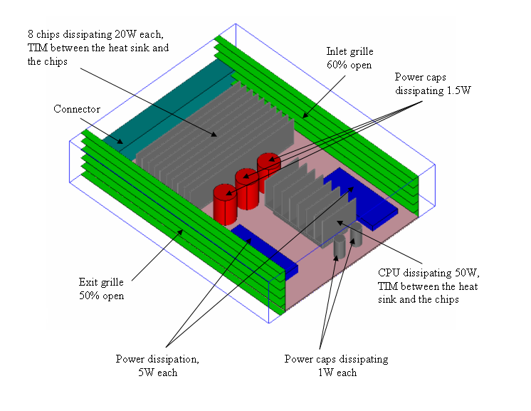

### 11.4. Step 1: Create a New Project

1. Set up a working directory on the computer you will be using.

2. Download the optimization.zip file here.

3. Unzip the optimization.zip file you have downloaded to your working directory.

4. Copy optimization.tzr to your working directory.

5. Start Ansys Icepak, as described in Starting Ansys Icepak in the Icepak User’s Guide.

When Ansys Icepak starts, the **Welcome to Icepak** panel opens automatically.

6. Click **Unpack** in the **Welcome to Icepak** panel.

The **File selection** panel appears.

7. In the **File selection** panel, select the packed project file optimization.tzr and click **Open**.

8. The **Location for the unpacked project** file selection dialog appears.

9. In the **Location for the unpacked project** file selection dialog, select a directory where you would like to place the packed project file, enter a project name in the **New project** text field, then click **Unpack**.

### 11.5. Step 2: Build the Model

This tutorial uses an existing model. Ansys Icepak will display the model in the graphics window. To view all components, expand all the assemblies of the model in the **Model manager** window.

**Note:**

You can rotate the cabinet around a central point using the left mouse button, or you can translate it to any point on the screen using the middle mouse button. You can zoom into and out from the cabinet using the right mouse button. To restore the cabinet to its default orientation, select **Home position** from the **Orient** menu.

Save the problem to a new project file (this enables you to expand on the problem without affecting the original file).

**File** **Save project as**

1. In the **Project name** text box, enter the name optimization-new.

2. Click **Save**.

### 11.6. Step 3: Define Design Variables

The large heat sink needs to be optimized in terms of the number of fins and fin thickness. Therefore, you will define the following design variables for the large heat sink: fin count (in the range from 2 to 18) and fin thickness (in the range from 0.254 mm to 2.032 mm).

1. Define the finCount and finThick design variables for the **heatsink_big** and specify their initial values.

a. Expand the **hs_assembly_2** node in the **Model manager** window.

b. Select the **heatsink_big** in the **Model manager** window and click the **Edit object** button (

) to open the **Heat sinks** panel.

c. Click the **Properties** tab.

d. Under the **Fin setup** tab, type $finCount next to **Count**, and press **Enter** to open the **Param**

**value** panel.

**Important:**

All function names are case-sensitive.

e. In the **Param value** panel, enter 15 for the **Initial value of finCount**, and click **Done** to close

the panel.

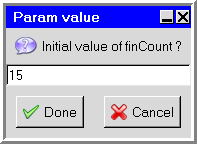

f. In the **Heat sinks** panel, under the **Fin setup** tab, type $finThick next to **Thickness**, and press **Enter** to open the **Param value** panel.

g. In the **Param value** panel, enter 0.762 for the **Initial value of finThick**, and click **Done** to close

the panel.

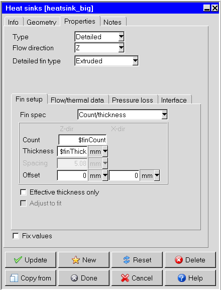

h. Click **Done** in the **Heat sinks** panel to close the panel.

2. Specify the constraint values for the design variables.

**Solve** **Run optimization**

**Tip:**

Alternatively, you can click the

button.

a. Turn on the **Optimization** option in the **Setup** tab. Then click on the **Design variables** tab.

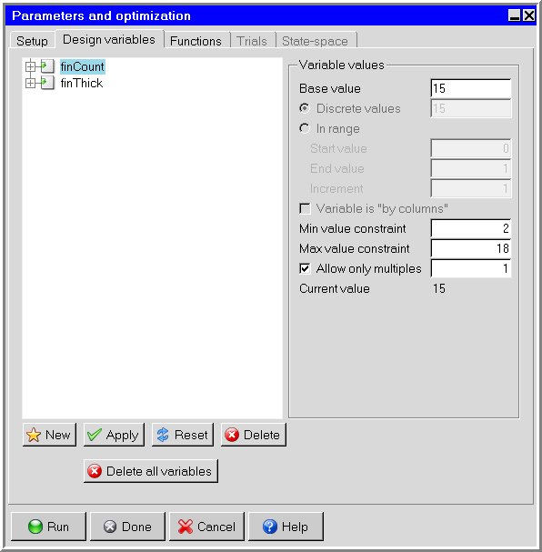

The design variables that you had defined will be listed in the panel, and their initial values will be shown in the **Base value** text box.

b. Select **finCount** from the list, then enter 2 for the **Min value constraint**, 18 for the **Max value**

**constraint**.

c. Select **Allow only multiples**, keep the default value of 1, and click **Apply**.

d. Select **finThick** from the list, then enter 0.254 for the **Min value constraint**, 2.032 for the

**Max value constraint**, and click **Apply**.

e. Make sure **Allow only multiples** is only activated for **finCount**, not **finThick**.

f. Click **Done** to close the **Parameters and optimization** panel.

### 11.7. Step 4: Generate a Mesh

For this model, you will not generate a mesh in advance. Meshing will be automatically performed for each design trial during parametric trials.

**Model** **Generate Mesh**.

1. Make sure that the **Mesh type** is **Mesher-HD** and the **Mesh assemblies separately** option is turned on.

2. Make sure the **Allow minimum gap changes** is enabled in the **Misc** tab.

3. Click **Close** in the **Mesh control** panel to close the panel.

### 11.8. Step 5: Physical and Numerical Settings

**Problem setup**

**Basic parameters**

1. Keep all the defaults in the **Basic parameters** panel.

2. Click **Accept** in the **Basic parameters** panel to accept the settings and close the panel.

**Solution settings**

**Basic Settings**

1. Make sure **Number of iterations** is 125.

2. Make sure the convergence criteria for **Flow** is 0.001, and for **Energy** is 1e-7.

3. Click **Accept** to close the **Basic settings** panel.

### 11.9. Step 6: Save the Model

Ansys Icepak will save the model for you automatically before it starts the calculation, but it is a good idea to save the model (including the mesh) yourself as well. If you exit Ansys Icepak before you start the calculation, you will be able to open the project you saved and continue your analysis in a future Ansys Icepak session. (If you start the calculation in the current Ansys Icepak session, Ansys Icepak will simply overwrite your project file when it saves the model.)

### 11.10. Step 7: Define Primary, Compound, and Objective Functions

**Note:**

The objective of this tutorial is to minimize the thermal resistance of the heat sink while keeping the maximum temperature for the entire system below 70°C and ensuring that the total mass of the heat sinks does not exceed 0.326 kg. Therefore, you will define the following primary functions: thermal resistance for the large heat sink (bighsrth), mass of the large heat sink (bighsms), mass of the small heat sink (smlhsms), and global maximum temper- ature of 70°C (mxtmp). You will also define a compound function, the total mass of the heat

sinks of 0.326 kg (totalmass). For the objective function, you will minimize the thermal resistance of the large heat sink (bighsrth).

1. Go to **Solve** **Run optimization** to open the **Parameters and optimization** panel.

2. In the **Functions** tab, define four primary functions.

a. Define the thermal resistance function for the large heat sink (bighsrth).

i. Click the **New** button under **Primary functions**.

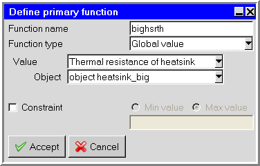

ii. In the **Define primary function** panel, enter bighsrth next to **Function name**.

iii. In the **Function type** drop-down list, keep the default selection of **Global value**.

iv. In the **Value** drop-down list, select **Thermal resistance of heatsink**.

v. In the **Object** drop-down list, select the **heatsink_big** object under **hs_assembly_2**, and click **Accept** to save the changes and close the panel.

b. Define the mass function for the large heat sink (bighsms).

i. Repeat step (a) for the bighsms as the **Function name**,**Global value** as the **Function type**, **Mass of objects** as the **Value**, and **heatsink_big** as the **Object**.

c. Define the mass function for the small heat sink (smlhsms).

i. Repeat step (a) for the smlhsms as the **Function name**,**Global value** as the **Function type**, **Mass of objects** as the **Value**, and **heatsink_small** as the **Object**.

d. Define a constraint function as the global maximum temperature of 70°C (mxtmp).

i. Click the **New** button under **Primary functions**.

ii. In the **Define primary function** panel, enter mxtmp next to **Function name**.

iii. In the **Function type** drop-down list, keep the default selection of **Global value**.

iv. In the **Value** drop-down list, keep the default selection of **Global maximum temperature**.

v. Select **Constraint** and keep the default selection of **Max value**.

vi. Enter 70 in the text entry field and click **Accept** to save the changes and close the panel.

3. Define a compound function.

a. Under **Compound functions**, click the **New** button to open the **Define compound function** panel.

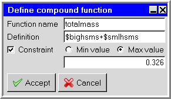

b. In the **Define compound function** panel, enter totalmass for the **Function name**.

c. Next to **Definition** enter $bighsms+$smlhsms.

d. Select **Constraint** and keep the default selection of **Max value**.

e. Enter 0.326 in the text entry field and click **Accept** to save the changes and close the panel.

4. Define an objective function.

a. In the **Parameters and optimization** panel, select **bighsrth** from the **Objective function** drop- down list.

b. Keep the default selection of **Minimize value**.

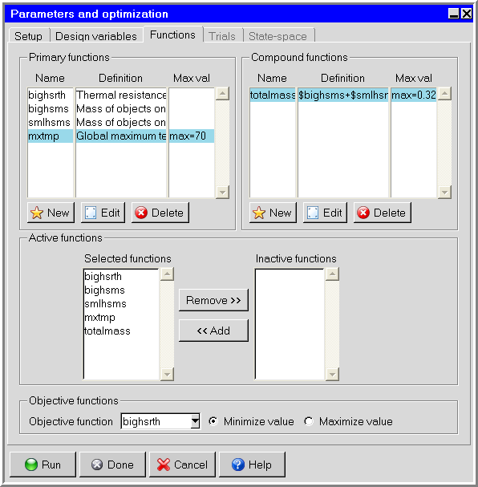

### 11.11. Step 8: Calculate a Solution

1. Open the **Parameters and optimization** panel, if it is not already opened.

**Solve** **Run optimization**

**Note:**

Alternatively, you can click the

button in the **Model and solve** toolbar.

2. Set up the optimization process.

a. In the **Parameters and optimization** panel, click the **Setup** tab.

b. Verify that the **Optimization** option is turned on, and keep all the defaults for this option.

c. Deselect **Allow fast trials (single .cas file)**.

**Note:**

Due to the geometry change based on the fin thickness and fin count, the fast trials option is not possible in this problem.

d. Select **Sequential solution of flow and energy equations**.

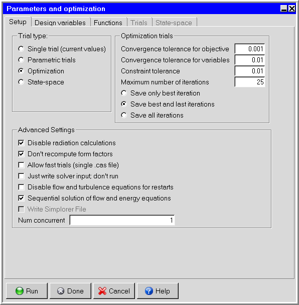

3. Click **Run** in the **Parameters and optimization** panel to start the calculations.

### 11.12. Step 9: Examine the Results

As Ansys Icepak starts calculating solutions for the model, the **Optimization run** window opens and Ansys Icepak displays the function values, design variables, and the running times for each optimization iteration. In addition, the function values and design variables are plotted versus iteration number, as shown in Figure 11.2: The Optimization run Panel (p. 256).

**Figure 11.2: The Optimization run Panel**

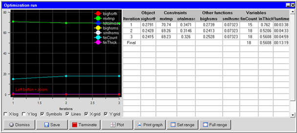

**Note:**

Each iteration takes three trials.

### 11.13. Step 10: Optimization in DesignXplorer

• Start Ansys Workbench.

**Note:**

When Ansys Workbench starts, the Toolbox and Project Schematic are displayed.

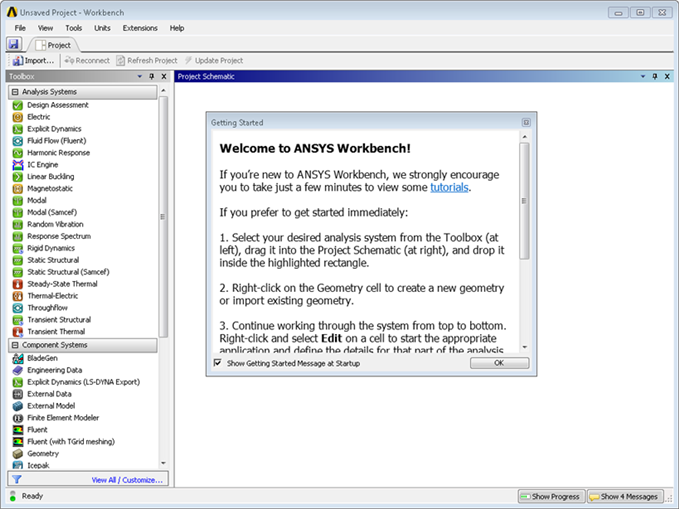

• Add an Icepak template by dragging the template from the Toolbar under the **Component Systems** node into the Project Schematic. Perform a right mouse click on the **Setup** cell. Select **Import Icepak** **Project** and **Browse** to import the optimization-new project and launch Icepak.

• The model appears in the graphics display window. Click the isometric toolbar icon (

) to display the isometric view of the model.

• Go to **Solve** **Run optimization** to open the **Parameters and optimization** panel. Click on **Publish** **to WB** to display the **Publish to WB** panel and select the green check marks to select all input and output variables. Output variables for Workbench are primary and compound functions in Icepak. Click **Accept** to save your specifications and click **Done** to close the panel.

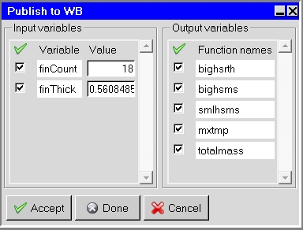

• In Workbench, the Parameter Set is displayed. Right-click on A1 and select **Update**. Double click the **Parameter Set** bar to display an outline of all parameters and the table of design points.

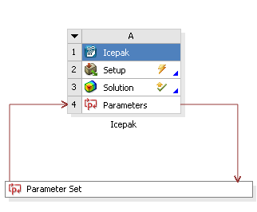

• Under the **Design Exploration** node in the Toolbox, add a **Response Surface Optimization** template by dragging the template into the Project Schematic.

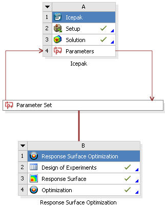

Double-click on the **Design of Experiments** cell. In the **Outline of Schematic**, select **finCount**. In the **Properties of Outline**, select **Discrete** for the **Classification** property. In the **Table of Outline**, create levels for 17, 18, and 19 fins. To minimize the time spent on the Design of Experiments, only three fin counts will be studied.

**Figure 11.3: finCount Setup**

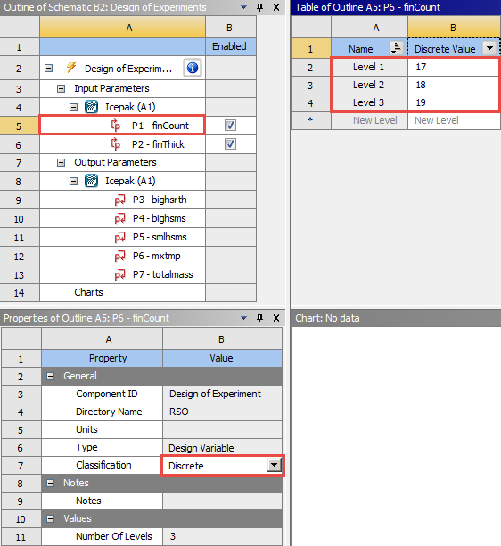

In the **Outline of Schematic**, select **finThick**. In the **Properties of Outline**, set a **Lower Bound** of 0.5 and **Upper Bound** of 0.625 and then select **Manufacturable Values** under **Allowed Variables**. In the **Table of Outline**, create a level of 0.5625. The fin thicknesses will use only common values rather than a fully continuous range.

**Figure 11.4: finThick Setup**

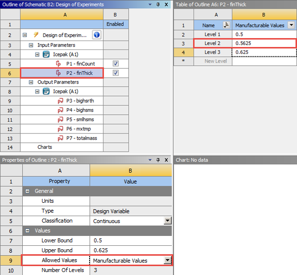

Select **Design of Experiments** in the **Outline of Schematic**. To minimize the design space, in the **Properties of Outline**, select **Box-Behnken Design** for **Design of Experiments Type**. Then click **Preview** to see a preview of design points.

Perform a right-mouse click on the **Design of Experiments** cell and select **Update** to run an optim- ization. The optimization data will provide information of the variable affected the most by the different combinations.

**Figure 11.5: Design of Experiments**

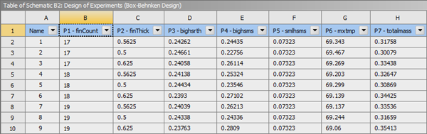

On the **Project** tab, right-click on the **Response Surface** cell and select **Update**. Then double-click on the **Optimization** cell to open it. Right-click on **Objectives** and **Contraints** to insert objectives. Then enter the objectives and constraints as shown in the figure below. Click **Update** to run an op- timization.

**Figure 11.6: Optimization Constraints**

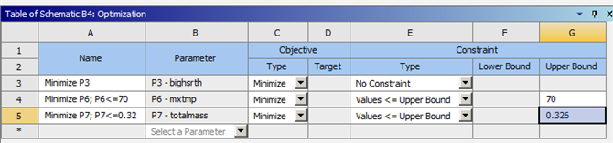

To see the **Candidate Points** selected, click on **Candidate Points** in the **Outline of Schematic**. The optimal fin count and thickness are determined.

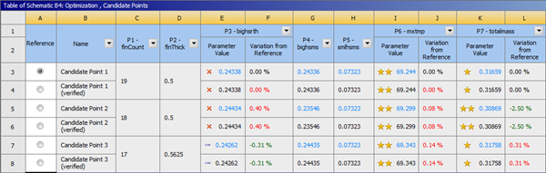

### 11.14. Step 11: Summary

In this tutorial, you used the optimization tool to minimize the thermal resistance for the big heat sink. The results show that Ansys Icepak predicts the best (optimized) case has a fin count of 19 and a fin thickness of 0.5 mm. In this case, the maximum temperature for the entire system is determined to be

69.244°C (with the constraint of 70°C) while the total mass is 0.31659 kg (with the constraint of 0.326 kg). The objective function (thermal resistance) is predicted as 0.24338°C/W.

If we compare the results from DesignXplorer to Ansys Icepak, you will find similar results. In addition further parametric and direct optimization methods can be tried.

### 11.15. Step 12: Additional Exercise

You can also try to optimize the fin count and the fin thickness of both heat sinks and the free flow area ratios of the inlet and exit grilles. A sample case may be as follows:

• Design variables

– Fin count for the large heat sink: 2-20

– Fin thickness for the large heat sink: 0.254-2.032mm

– Fin count for the small heat sink: 2-12

– Fin thickness for the small heat sink: 0.254-2.032 mm

– Free flow area ratio of the inlet grille: 30-80%

– Free flow area ratio of the exit grille: 30-80%

• Primary functions

– Thermal resistance for the large heat sink (bighsrth)

– Mass of the large heat sink (bighsms)

– Mass of the small heat sink (smlhsms)

– Maximum temperature for the entire system: 70°C (mxtmp)

• Compound function

– Total mass of the heat sinks: 0.45 kg (totalmass)

• Objective function

– Minimize the large heat sink thermal resistance (bighsrth)

---

## Chapter 12: Radiation Modeling

### 12.1. Introduction

This tutorial demonstrates how to model radiation in Ansys Icepak. In this tutorial, you will learn how to include the effects of radiation in a free convection environment with surface-to-surface (S2S), discrete ordinates (DO) and ray-tracing radiation models.

**Note:**

Mesh counts and solution results may differ slightly due to enhancements to the meshing algorithm and Fluent solver, respectively.

### 12.2. Prerequisites

This tutorial assumes that you have worked on Sample Session and the tutorials Finned Heat Sink (p. 5) and RF Amplifier (p. 51) in this guide.

### 12.3. Problem Description

Radiation heat transfer becomes significant at high temperatures and is typically more important for natural convection problems as compared to forced convection problems in electronics cooling applic- ations. Ansys Icepak provides three different models to solve for radiation effects: surface-to-surface (S2S), discrete-ordinates (DO) and ray-tracing. This tutorial involves a source with a heat sink placed on a printed circuit board (PCB) and is being cooled with natural convection. We will first solve the model without radiation, then use the surface to surface model followed by the discrete ordinates and the ray tracing models and lastly compare the results of all these four cases.

### 12.4. Step 1: Create a New Project

Open a new project and name it **hsink-rad**.

### 12.5. Step 2: Build the Model

1. Open the **Cabinet** panel by double-clicking the **Cabinet** object in the **Model manager** window. In the **Geometry** tab, enable the **Fix values** option to ensure the values are appropriately converted as we use different units. Change all the units from **m** to **mm**. Then, input the following dimensions in the **Geometry** tab of the **Cabinet** panel (Figure 12.1: Dimensions of the Cabinet and the Boundary Condition Specifications (p. 266)).

**Figure 12.1: Dimensions of the Cabinet and the Boundary Condition Specifications**

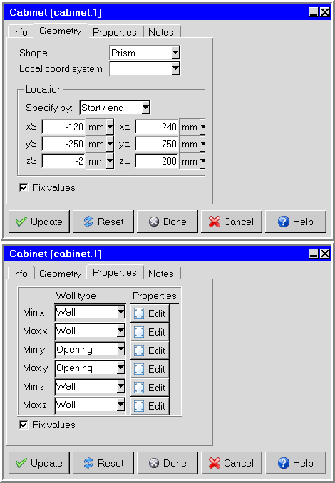

2. In the **Properties** tab of the **Cabinet** panel, define all the sides of the cabinet as shown above. The **Min y** and **Max y** sides are defined as openings while all the remaining sides are stationary walls.

3. Click **Done** to close the **Cabinet** panel.

4. The printed circuit board (PCB), heat sink base and the fins of the heat sink will be constructed using the block object in Ansys Icepak.

5. Create the PCB.

a. First, create a block and rename it as **PCB** in the **Info** tab of the **Blocks** panel.

b. Specify the dimensions of the block in the **Geometry** tab as shown below in Figure 12.2: Dimen-

sions of the PCB (p. 267).

**Figure 12.2: Dimensions of the PCB**

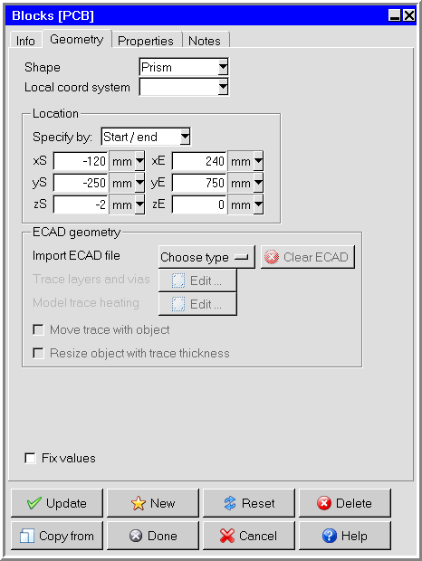

c. Click **Done** to close the **Blocks** panel.

6. Create a new material and assign it to the PCB.

a. Right-click the **Model** node and select **Create object** and then **Material**. A new node called **Materials** will appear.

b. Expand the **Materials** node until you reach **material.1**. Double-click **material.1** to open the

**Materials** panel.

c. In the **Properties** tab of the **Materials** panel, choose **Orthotropic** from the **Conductivity type** drop-down list.

i. Enter **40**,**40**, and **0.4** W/m-K for the X, Y, and Z directions, respectively.

d. Click **Done** to close the **Materials** panel.

e. In the **Model manager** window, double-click the **PCB** object we created to open the **Blocks**

panel again.

f. In the **Properties** tab of the **Blocks** panel, select **material.1** from the **Solid material** drop-down list as shown in Figure 12.3: Specifying material.1 as PCB Solid Material (p. 268).

**Figure 12.3: Specifying material.1 as PCB Solid Material**

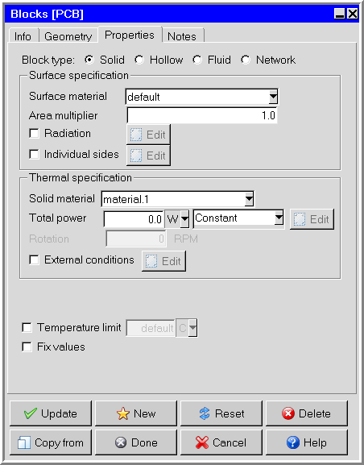

g. Click **Done** to close the **Blocks** panel.

7. Create the heat sink base.

a. Create a new block and rename it as **hs-base** in the **Info** tab of the **Blocks** panel.

b. Specify the dimensions of the block in the **Geometry** tab as shown below in Figure 12.4: Dimen-

sions of the hs-base (p. 269).

**Figure 12.4: Dimensions of the hs-base**

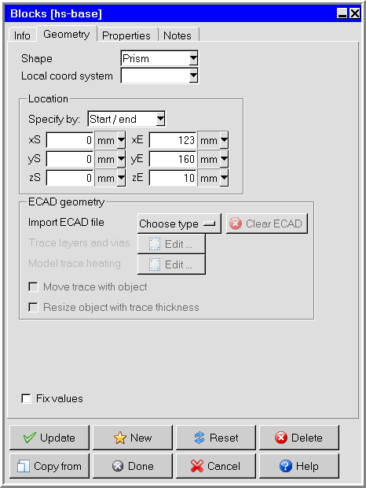

c. Click **Done** to close the **Blocks** panel.

8. Create the fins.

a. Create a new block and rename it as **hs-fin1.1** in the **Info** tab of the **Blocks** panel.

b. Specify the dimensions of the block in the **Geometry** tab as shown below in Figure 12.5: Heat

Sink Fin Dimensions (p. 270).

**Figure 12.5: Heat Sink Fin Dimensions**

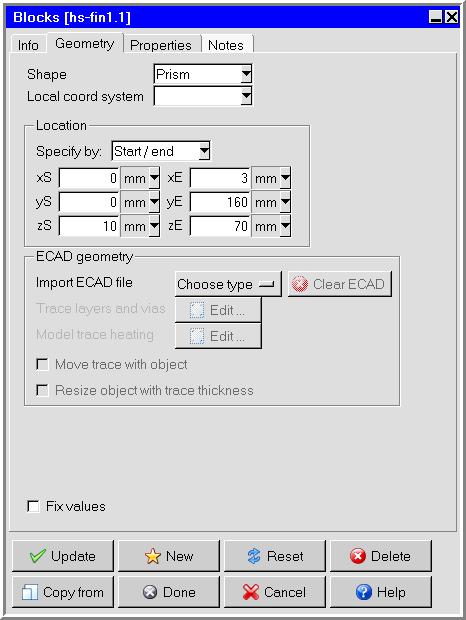

c. Leave all the other properties as their default values. Click **Done** to close the **Blocks** panel.

d. Create the remaining fins by using the copy feature.

i. Right-click the **hs-fin1.1** object in the **Model manager** window and select **Copy**. The **Copy** **block hs-fin.1.1** panel opens.

ii. Set **Number of copies** to **8**.

iii. Check the **Translate** option and set the **X**,**Y** and **Z offset** to **15**,**0**, and **0** mm respectively.

iv. Click **Apply** to close the **Copy block hs-fin.1.1** panel and create the new fins.

9. Create a 75 W, 2D source.

a. Create a source using the **Create sources** button in the model toolbar.

b. In the **Sources** panel, specify the geometry and properties of the source according to Fig-

ure 12.6: Source at the Bottom on the Heat Sink (p. 271).

**Note:**

Click **Update** for the panel to display a value of **0** m for **zE**.

**Tip:**

Alternatively, you can use the snapping tools from the geometry window to align the source’s dimensions to those of the **Min z** side of the **hs-base** block object. The snapping tools here are labeled by their respective faces, such as **xS**,**xE**,**yS**,**yE**, and so on.

c. Click **Done** to close the **Sources** panel and complete the creation of the model.

**Figure 12.6: Source at the Bottom on the Heat Sink**

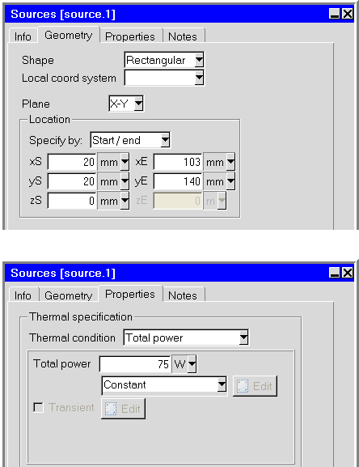

The final model should appear as shown in Figure 12.7: Schematic of the Model (p. 272).

**Figure 12.7: Schematic of the Model**

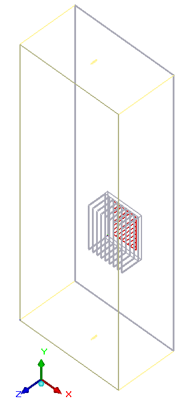

### 12.6. Step 3: Generate a Mesh

In order to generate a fine mesh on the heat sink and the neighboring regions while retaining a coarser mesh in the remaining part of the model, create a non-conformal assembly enclosing all the objects created and specify separate meshing parameters for this assembly.

1. Select the source (**source.1**), the base of the heat sink (**hs-base**), and all the fins (**hs-fin1.1.x**) in the **Model manager** window together, then right-click and select **Create** and then **Assembly**.

2. Double-click **assembly.1** in the **Model manager** window to open the **Assemblies** panel.

a. In the **Meshing** tab, click the **Mesh separately** button, and specify the slack values as well as the max element sizes in each of the coordinate directions for the assembly as depicted in Fig- ure 12.8: Meshing Parameters for assembly.1 (p. 274).

b. This refines the mesh inside the assembly and also prevents mesh bleeding by confining the

fine mesh to within the assembly.

c. Click **Copy global** and then enter the following **Max element size** for **X**,**Y**, and **Z**, respectively: 4, 10, and 4. Note that the unit should be specified as **mm**.

**Note:**

The units depicted in Figure 12.8: Meshing Parameters for assembly.1 (p. 274) are in mm and m.

**Figure 12.8: Meshing Parameters for assembly.1**

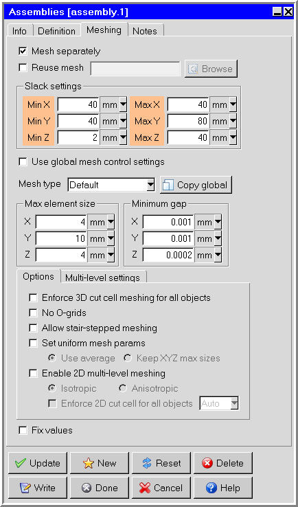

d. Click **Done** to close the **Assemblies** panel.

3. Once the assembly creation is complete, open the **Mesh control** panel by pressing the **Generate** button.

a.

Change the **Mesh units** to **mm**.

**Note:**

Doing so affects the parameters in the **Max element size** box.

b. Input the **Max element size** specifications according to Figure 12.9: Global Mesh Control

Parameters (p. 275).

**Figure 12.9: Global Mesh Control Parameters**

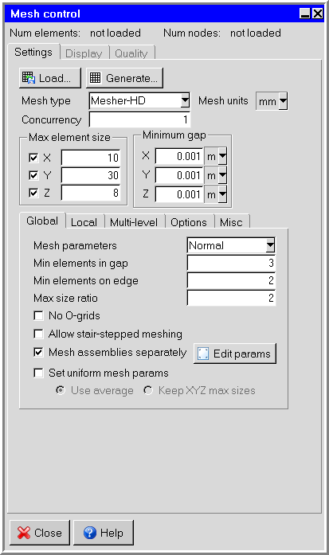

c. Keep all other parameters as their default values.

d. Make sure **Allow minimum gap changes** is checked under the **Misc** tab.

e. Press **Generate** to create the mesh.

f. You can view the mesh using the **Cut plane** and **Surface** options available in the **Display** tab.

g. Once you have finished viewing the mesh, make sure you deselect **Display mesh** in the

**Display** tab, and click **Close** to close the **Mesh control** panel.

### 12.7. Step 4: Physical and Numerical Settings

Once the model is meshed, we will solve it for different situations, that is, with radiation off followed by including the effects of radiation using both the surface-to-surface model as well as the discrete-or- dinates and ray-tracing methods available in Ansys Icepak 13 and later.

### 12.8. Step 5: Solving the Model Without Radiation

**Note:**

Instead of accessing the

**Basic parameters** panel, you can instead use the **Problem setup** **wizard** to define your problem setup by double-clicking

**Problem setup** in the model manager window. See 2.7. Step 4: Physical and Numerical Settings (p. 28) of the Finned Heat Sink tutorial for more instruction regarding the **Problem setup wizard**. You must still use the same settings described in this tutorial for the **Problem setup wizard**.

1. Go to

**Problem setup**

**Basic parameters**.

a. Under the **General setup** tab (Figure 12.10: Basic parameters Panel (p. 277)):

i. Ensure that you have selected both **Flow (velocity/pressure)** and **Temperature** in the **Variables solved** box.

ii. Because this is a natural convection problem select the **Gravity vector** check box.

iii. Select **Laminar** under the **Flow regime** group box.

**Note:**

Most natural convection models in electronics cooling are laminar, but it is always good practice to compute the Rayleigh number to verify the flow re- gime. For convenience, use the **Dimensionless Parameter Calculator** located under **Macros** > **Productivity**.

iv. Select **Off** in the **Radiation** box to disable radiation effects.

**Figure 12.10: Basic parameters Panel**

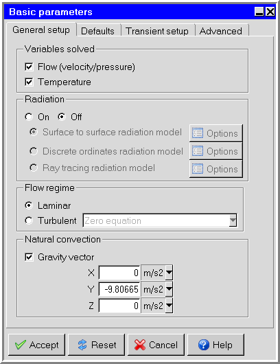

b. Under the **Defaults** tab

i. In the **Ambient conditions** group box, set the **Temperature** and the **Radiation temp** to **40** C.

**Note:**

**Temperature** is the temperature of the ambient fluid, and **Radiation temp** is the temperature of the surrounding enclosure surfaces used for radiation calculations.

c. Under the **Transient setup** tab

i. Enter a small velocity value for the **Y velocity** such as **0.01** m/s.

**Note:**

In free convection flow problems, you should set a small initial velocity opposite to the gravity vector’s direction.

ii. Retain the defaults for all other settings in the **Basic parameters** panel.

d. Press **Accept** to close the **Basic parameters** panel.

2. Go to

**Solution settings**

**Basic settings**.

a. Change your settings to match the values in Figure 12.11: Basic settings Panel (p. 278).

**Figure 12.11: Basic settings Panel**

b. Click **Accept** to close the **Basic Settings** panel.

3. Go to

**Solution settings**

**Advanced settings**.

a. In the **Advanced solver setup** panel ensure that the **Under-relaxation** parameters for **Pressure** and **Momentum** are **0.7** and **0.3**, respectively.

b. Select **Double** from the precision drop-down list at the bottom of the panel (Figure 12.12: Ad-

vanced solver setup Panel (p. 279)).

**Figure 12.12: Advanced solver setup Panel**

c. Keep all other default options in the **Advanced solver setup** panel.

d. Press **Accept** to close the **Advanced solver setup** panel.

### 12.9. Step 6: Save the Model

Ansys Icepak will save the model for you automatically before it starts the calculation, but it is a good idea to save the model (including the mesh) yourself as well.

**File** **Save project**

### 12.10. Step 7: Calculate a Solution: No Radiation

1. Go to **Solve** **Run solution** to bring up the **Solve** panel.

a. Enter norad as the solution **ID**.

b. Click **Start solution** at the bottom of the panel.

c. Once the solution residuals have converged you can post process the results using plane cuts and object faces. Note the maximum value of temperature for comparison with successive runs wherein radiative heat transfer will be enabled in the model.

**Note:**

You can check the maximum temperatures of each object by going to **Report**

**Solution overview** **Create** or by using the object summary report (**Report** **Summary report**).

**Figure 12.13: Temperature Results for the Model With Radiation Disabled**

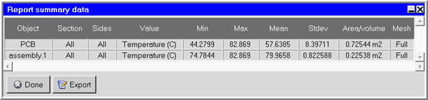

### 12.11. Step 8: Surface to Surface (S2S) Radiation Model

1. Go to

**Problem setup**

**Basic parameters**.

a. In the **Basic parameters** panel, select **On** in the **Radiation** group box.

b. Make sure the **Surface to surface radiation model** is selected.

c. Click **Accept** to close the **Basic parameters** panel.

2. To model radiation effects go to **Model** **Radiation form factors** or use the radiation icon (

) to open up the **Form factors** panel.

a. Under **Participating objects**, select all objects by clicking **All** and leave all other settings to their default values.

b. Press **Compute** to calculate the view factors.

i. You can display the view factors calculated in the text window by clicking each participating object listed under **Display object values**. Select the object **PCB** displays the various form factors of **PCB** in the graphics window (Figure 12.14: Form Factors of the PCB (p. 281)).

**Figure 12.14: Form Factors of the PCB**

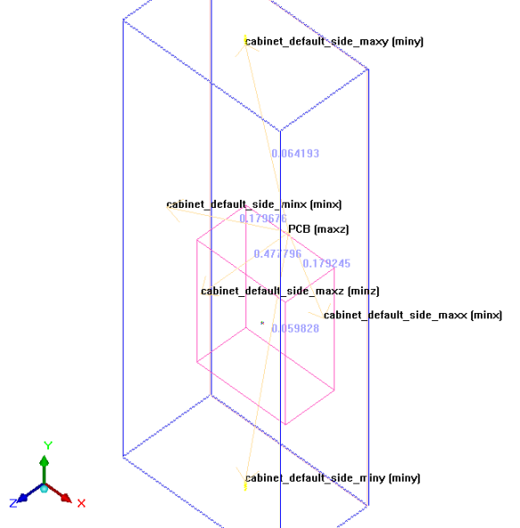

ii. After reviewing the view factors, select **Don’t recompute** in the **Form factor options** group box.

iii. The settings for the view factor calculations setup are shown in Figure 12.15: Enabling Radiation

in Ansys Icepak Model (p. 282).

c. Press **Close** to close the **Form factors** panel.

**Figure 12.15: Enabling Radiation in Ansys Icepak Model**

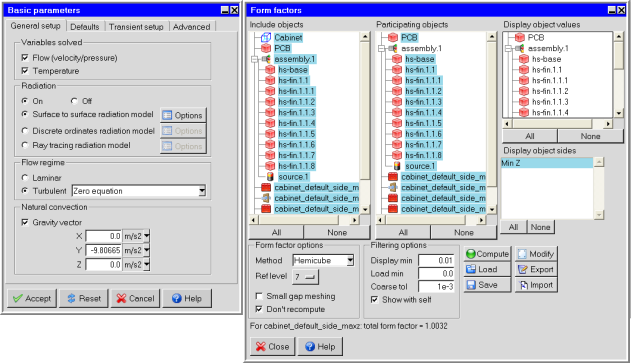

3. Go to **Solve** **Run solution** and start the solver with S2S as the solution **ID**.

4. Once the solution residuals have converged, make note of the maximum temperature (Fig- ure 12.16: Temperature Results for the Surface to Surface Radiation Model (p. 282)).

**Figure 12.16: Temperature Results for the Surface to Surface Radiation Model**

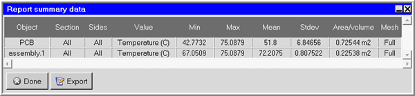

### 12.12. Step 9: Discrete Ordinates (DO) Radiation Model

Next, we will run the discrete ordinates radiation model.

1. Go to

**Problem setup**

**Basic parameters**.

a. Enable the **Discrete ordinates radiation model** option in the **Radiation** group box.

b. Press **Accept** to close the **Basic parameters** panel.

2. Start the solution again with DO as the solution **ID**.

3. Once the solution residuals have converged, make note of the maximum temperature (Fig- ure 12.17: Temperature Results for the Discrete Ordinates Radiation Model (p. 283)).

**Figure 12.17: Temperature Results for the Discrete Ordinates Radiation Model**

### 12.13. Step 10: Ray-Tracing Radiation Model

Next, we will run the ray tracing radiation model.

1. Go to

**Problem setup**

**Basic parameters**.

a. Enable the **Ray tracing radiation model** option in the **Radiation** group box.

b. Press **Accept** to close the **Radiation** panel.

2. Start the solution again with Ray as the solution **ID**.

3. Once the solution residuals have converged, make note of the maximum temperature.(Fig- ure 12.18: Temperature Results for the Ray-Tracing Radiation Model (p. 283))

**Figure 12.18: Temperature Results for the Ray-Tracing Radiation Model**

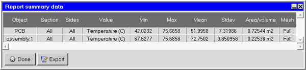

### 12.14. Step 11: Examine the Results

Compare the maximum temperature between the runs where radiative heat transfer was enabled versus the runs where it was not. You can clearly see that radiation is important in this model and there is a significant difference in the maximum temperature in the field with and without radiation. Further, there is reasonable agreement in the plane cut post processing objects obtained using the different radiation models. Figure 12.19: Plane cuts on the Z = 20 mm plane for (a) radiation disabled (b) S2S ra-

diation model (c) discrete ordinates radiation model and (d) ray-tracing radiation model (p. 285) compares the temperature fields for all the four cases.

**Note:**

In order to have the plane cuts located exactly at Z = 20 mm, go to the **Plane location** group box of the **Plane cut** panel. Type **0.02** for the field **PZ** to set the plane at Z = 0.02 m, or 20 mm.

**Figure 12.19: Plane cuts on the Z = 20 mm plane for (a) radiation disabled (b) S2S radiation model** **(c) discrete ordinates radiation model and (d) ray-tracing radiation model**

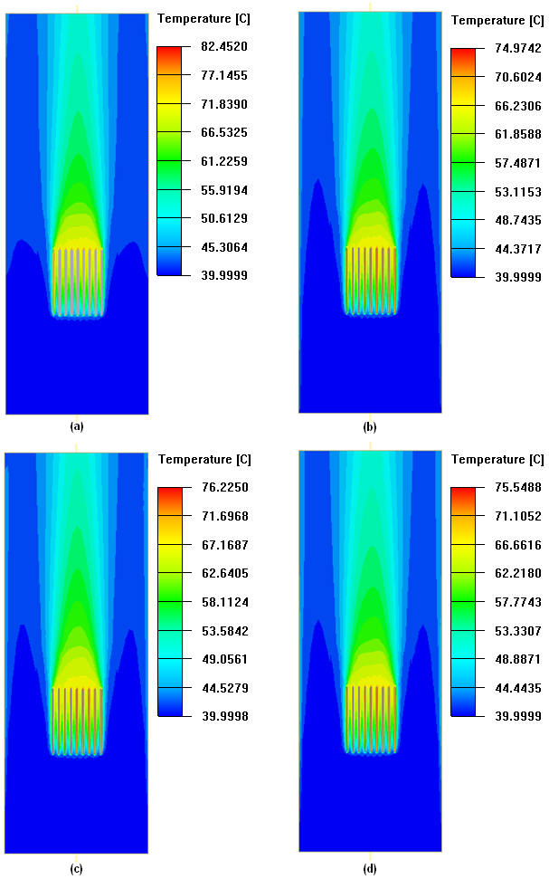

**Table 12.1: Maximum Source Temperature for Different Models**

| No radiation | 82.45°C |
| --- | --- |
| Surface to surface | 74.97°C |
| Discrete ordinates | 76.23°C |
| Ray tracing | 75.55°C |

Because the first case assumes no heat is rejected through radiation, there is less heat transfer and therefore a higher maximum temperature when neglecting radiation. The radiation models all produce similar results.

**Note:**

The actual values may differ slightly on different machines, so your values may not look exactly the same.

In general, the surface to surface model is the fastest of the three radiation models in Ansys Icepak. Therefore, you should use it for a first cut analysis. However, you *cannot* use the surface to surface model when CAD objects are present. Note that the discrete ordinates and ray tracing models are more accurate and better suited for more complex geometries. With a large number of participating surfaces, the surface to surface model and ray tracing model cost significantly more computationally than the discrete ordinates model.

### 12.15. Step 12: Summary

In this problem you have learned how to model radiation in Ansys Icepak. You first solved the model without radiation and then used the surface-to-surface model followed by the discrete ordinates and ray tracing methods and lastly compared the results of all four cases.

We repeat some of the tips and best practices found in this tutorial for your convenience:

1. Best Practice

a. Use the **Problem setup wizard** for guided problem setup. Edit the problem setup if needed

using the

**Basic parameters** panel.

b. Select the **Allow minimum gap changes** option in the **Misc** tab of the **Mesh control** panel to

allow Ansys Icepak to avoid unnecessary meshing due to inadvertent misalignments in the model. This is suitable for this tutorial but may not be in other projects.

c. Set a small initial velocity in an opposite direction to the gravity vector's direction when solving natural convection problems.

d. Use the surface to surface radiation model for a first cut analysis, but switch to the discrete or-

dinates or ray tracing radiation models for higher accuracy.

e. Use the discrete ordinates or ray tracing methods when using CAD objects or when you require

a higher fidelity solution than what the surface to surface model can provide.

2. Tips and Tricks

a. Select the **Don't recompute** option in the **Form factors** panel to re-use form factors and save computational time.

---

## Chapter 13: Transient Simulation

### Chapter 13:Transient Simulation

### 13.1. Introduction

The purpose of this exercise is to demonstrate how to model and post-process transient problems.

In this tutorial, you will learn how to:

• Define a transient problem

• Specify time-dependent parameters for objects

• Group and copy modeling objects

• Examine the results of a transient simulation, including animating results over time

**Note:**

Mesh counts and solution results may differ slightly due to enhancements to the meshing algorithm and Fluent solver, respectively.

### 13.2. Prerequisites

This tutorial assumes that you have worked on Sample Session and the first two Ansys Icepak tutorials of this guide (Finned Heat Sink (p. 5) and RF Amplifier (p. 51)).

### 13.3. Problem Description

The model involves a heat sink cooled by natural convection and heated by four heat sources attached to the bottom. The power dissipated by each of the four sources varies with time and peaks at 100 W.

### 13.4. Step 1: Create a New Project

1. Create a new project called **transient**.

2. From

**Basic parameters**, go to the **Transient setup** tab, select **Transient** under the **Time variation** group box. Then enter the **Start** and **End** times as 0 and 20 seconds, respectively.

**Problem setup**

3. Click **Edit parameters** and set the **Time step** increment to 1 s and the **Solution save interval** to 1. Click **Accept** in the **Transient parameters** panel and then the **Basic parameters** panel to save the new time parameters.

**Caution:**

The maximum allowable time step varies for each problem. Choosing an excessively large time step may result in an insufficient temporal resolution and consequently instability and divergence of the solution. However, choosing an excessively small time step may result in slow convergence without a significant increase in accuracy.

**Figure 13.1: Setting up the Model as Transient**

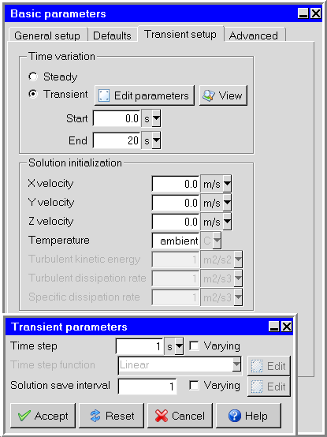

### 13.5. Step 2: Build the Model

Construct the model according to the following specifications. The final model is shown in Fig- ure 13.4: Schematic of the Model (p. 294).

• Cabinet (

)

| xS | 0.05 m | xE | 0.35 m |
| --- | --- | --- | --- |
| yS | 0.1 m | yE | 0.55 m |
| zS | 0.05 m | zE | 0.25 m |

Open the **Cabinet** object panel, go to the **Properties** tab, under **Wall type**, change **Min y** and **Max** **y** to **Opening**. Press **Done** and then **Shift**+**I** for an isometric view.

• Plate (

)

| Object |  |  | Properties |
| --- | --- | --- | --- |
| Name: plate.1 Geometry: Rectangular Plane: X-Y | xS = 0.1 m yS = 0.2 m zS = 0.12 m | xE = 0.3 m yE = 0.4 m — | Thermal model: Conducting thick Thickness: 10 mm Solid material: default (Al-Extruded) |

• Blocks (

)

| Object | xC | yC | zC | Height | Radius | IRadius | Properties |
| --- | --- | --- | --- | --- | --- | --- | --- |
| Name: block.1 Geometry: Cylinder Plane: X-Y Nonuniform radius | 0.15 m | 0.25 m | 0.13 m | 0.06 m | 0.02 m Radius2 0.012 m | 0.0 m IRadius2 0.0 | Block type: solid Solid material: default (Al-Extruded) |

Make two copies of the tapered fin (**block.1**), offset by **0.05** m in the X direction (**Number of copies** = 2 and **Translate** with **X offset** = **0.05** m). Select all three tapered fins, and make two copies of this group with an offset of **0.05** m in the Y direction (**Number of copies** = **2**, and **Translate** with **Y offset** = **0.05** m). Remember to right-click the icon in the **Model manager** window to copy objects or alternatively press **Ctrl** + **c** while the objects are selected. These tapered cones model a heat sink with tapered cone fins.

• Sources (

)

Create **source.1**, the first of four sources you will create, according to the specifications in the following table:

| Object |  |  | Specification |
| --- | --- | --- | --- |
| Name: source.1 Geometry: Rectangular | xS = 0.12 m yS = 0.22 m | xE = 0.18 m yE = 0.28 m | Total power = 100 W |

| Object |  |  | Specification |
| --- | --- | --- | --- |
| Plane: X-Y | zS = 0.12 m |  |  |

The 4 sources have a peak power of 100 watts each and a period of 20 seconds. The variation of power is according to the following exponential curve, , where and are constant and is the time.

In the **Properties** tab of the **Sources** panel, select **Transient**, click **Edit**, and enter **0** for **Start time** and **20** for **End time**. To specify the variation curve, click **Exponential** and set **a** = **0.025** and **b** = **100**. Click **Update** and **Done**, in the **Transient power** panel and then in the **Sources** panel.

**Figure 13.2: Defining Transient Power for the Sources**

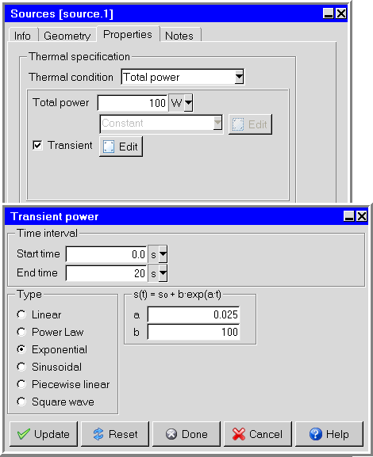

Now make one copy of **source.1** with an offset of 0.1 m in the X direction. Select **source.1** and **source.1.1**, then make one copy of these two sources with an offset of 0.1 m in the Y-direction to complete the construction of the sources.

To view the time-dependent power specified for the sources, go to

**Basic** **parameters**. Select the **Transient setup** tab and click **View** (next to **Edit parameters**) near the top of this panel. This displays the time variation of the power specified using sources.

**Problem setup**

**Figure 13.3: Viewing the Variation of Power on the Sources with Time**

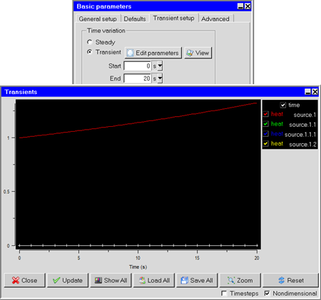

**Tip:**

A time dependent power profile such as a piecewise linear curve can also be imported/ex- ported by clicking **Save All** and **Load All** in the **Transients** panel. Clicking **Load All** will open the **Load all curves** file selection dialog box and override any existing data. Select the CSV file containing the curve data and click **Open**.

The final model should appear as that shown in Figure 13.4: Schematic of the Model (p. 294).

**Figure 13.4: Schematic of the Model**

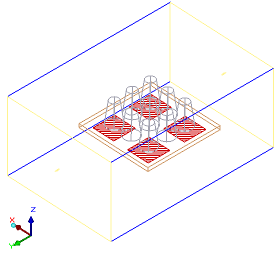

### 13.6. Step 4: Generate a Mesh

To generate a mesh for this model, go to **Model** **Generate mesh** and specify a global maximum element size of 0.02 m in the X, Y and Z directions in the **Max element size** group box. Across from **Mesh parameters**, select **Normal** and keep the default global mesh settings parameters. Then go to the **Options** tab and select **Init element height** and enter **0.005**. Then click **Generate** to create the mesh. Once the mesh is generated, display and examine the mesh from the **Display** tab. Remember to deselect the **Display mesh** option when you are done examining the mesh.

**Note:**

The **Init element height** is the first element’s height measured from the surface of the solid into the fluid. This can be used in a relatively simple model as this one to increase the boundary layer resolution. It is not recommended to be used for complex models as this can create very large mesh counts.

### 13.7. Step 5: Physical and Numerical Settings

**Note:**

Instead of accessing the

**Basic parameters** panel, you can instead use the **Problem setup** **wizard** to define your problem setup by double-clicking

**Problem setup** in the model manager window. See 2.7. Step 4: Physical and Numerical Settings (p. 28) of the Finned Heat Sink tutorial for more instruction regarding the **Problem setup wizard**. You must still use the same settings described in this tutorial for the **Problem setup wizard**.

Go to

**Basic parameters**. In the **General setup** tab, ensure **Laminar** is set for **Flow regime**, and select the default **Gravity vector** (**X** = **0**,**Y** = **-9.80665** m/s2,**Z** = **0**). In the **Transient** **setup** tab, give a small initial (global) velocity of **0.001** m/s in the Y direction to increase the conver- gence rate. Click **Accept** to accept the changes made and to exit this window.

**Problem setup**

Go to

**Basic settings** and click **Reset** to examine the estimated Rayleigh number. A good starting point for iterations per timestep is 20. For the purposes of this tutorial, we'll consider 20 iterations per timestep to be sufficient. Set **Iterations / timestep** to **20**. Press **Accept** to close the panel.

**Solution settings**

**Note:**

For real models, the number of iterations per timestep should allow the residuals to drop three orders of magnitude at each timestep.

**Advanced settings** and set the **Under-relaxation** factors to **0.7** for **Pressure**and **0.3** for **Momentum**. Also, ensure that **Double** is selected for **Precision**. Press **Accept** to close the panel.

Go to

**Solution settings**

**Figure 13.5: Basic settings Panel**

Create a monitor point to observe the temperature of **source.1** with respect to time by dragging and dropping **source.1** into the **Points** folder in the **Model manager** window.

### 13.8. Step 6: Save the Model

Ansys Icepak automatically saves the model for you before it starts the calculation, but it is a good idea to save the model (including the mesh) yourself as well.

**File** **Save project**

### 13.9. Step 7: Calculate a Solution

Go to **Solve** **Run solution**. In the **Results** tab, click **Write overview of results when finished** and click **Start solution**.

Figure 13.6: Convergence Plot (p. 297) shows the solution residuals for this exercise. Note that exact re- siduals and number of iterations may vary on different computers. Each dip corresponds to the conver- gence of an individual timestep, resulting in a total of 20 timesteps as you had initially specified.

**Figure 13.6: Convergence Plot**

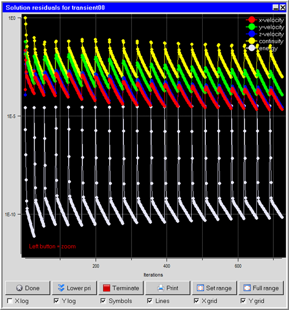

### 13.10. Step 8: Generate a Summary Report

1. Go to **Solve** **Define report**.

2. In the **Define summary report** panel, select **Specified**.

3. Select **All times** in the **Report time** group box.

4. Select **New**, hold down the Shift key and select all blocks in the **Objects** drop down list. Click **Accept**.

5. Click **Write** to display the **Report summary data** panel shown in Figure 13.7: Define summary report Panel (p. 298).

• Note that the average temperature of the block objects starts at 20°C and increases to about 27°C by the end of the 20 second duration.

**Figure 13.7: Define summary report Panel**

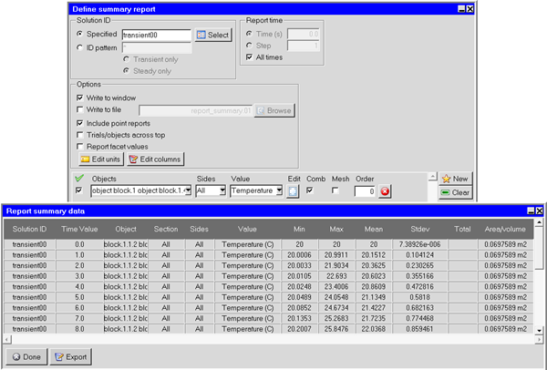

### 13.11. Step 9: Examine the Results

You can display the results of transient runs as still images or animations.

For still images, you can choose to display at a given time or a given time-step. To do so, after creating post objects in the same manner as in a steady-state run, you can go to **Post** **Transient settings** or

click the transient settings icon (

) to open the **Post-processing time** panel. To display at a given time-step, you can select **Time step** and click **Forward** or **Backward** to step through the time steps. To display at a given time, you can select **Time value**, input the time to begin the display and the time **Increment**, and select **Forward** or **Backward**.

To view these images in this model, create the following post-processing objects:

**Table 13.1: Object Face and Plane Cut Specifications**

| Object | Specifications | Description |
| --- | --- | --- |
| face.1 | Object: all blocks and plate.1 | Observation: The view shows the temperature distribution on the faces of all the blocks and the base plate. You can clearly see the conduction of heat from the sources through the fins of the heat sink. |
|  | Show contours / Paramet- ers |  |
|  | Contours of: Temperature |  |

| Object | Specifications | Description |
| --- | --- | --- |
|  | Contours options: Solid fill |  |
|  | Shading options: Smooth |  |
|  | Color levels: Calculated / Global limits |  |
|  | Post Transient set- tings: |  |
|  | Time step: 1 or Time value: 0 |  |
|  | Forward or Backward |  |
| cut.1 | Set position: Z plane through center Show vectors / Paramet- ers | Observation: The view shows air flowing from one opening to the other. Also notice that the velocity distribution changes with time. |
|  | Color by: Velocity magnitude |  |
|  | Transient: Same as the above |  |

Figure 13.8: Transient Temperature Contour and Velocity Distribution Results at Various Time Values (p. 300) shows the resulting static images at various time values. Note that at time = 0 the solver uses the solution initialization you had previously specified as the resulting velocity distribution. As time pro- gresses, heat dissipated by the sources spreads throughout the heat sink. Consequently, the overall magnitude of the velocities increases due to the stronger natural convection at higher temperatures.

**Figure 13.8: Transient Temperature Contour and Velocity Distribution Results at Various Time** **Values**

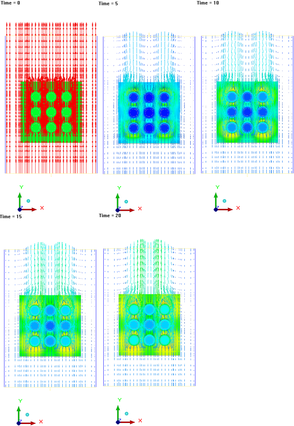

To animate the above post objects, go to **Post** **Transient settings** to open the **Post-processing** **time** panel. Click **Animate** to open the **Transient animation** window. To animate the current display on screen, click **Animate** in the **Transient animation** panel. The animation can be played once, from the start time to end time, or in the **Loop mode**.

**Tip:**

In addition to animating the display in screen, you can also write the animation to a file in MPEG, GIF, or other neutral formats to be played back later using a third-party software. To do that, go to **Post** **Transient settings**, then click **Animate** to open the **Transient anim-** **ation** panel. Select **Write to file**, then click **Write** to open the **Save animation** panel. Pick a file format, give it a file name, and then click **Save**. This sequence saves the entire display area with no scaling.

Alternatively, you can click the **Options** tab in the **Save animation** panel and modify the **Scale factor** in the **Save animation options** panel. Also available in **Save animation options** panel is **Print region**. Choose the default **Full screen** or **Mouse selection**. Choosing **Mouse** **selection** allows one to draw a rubber band and select only a part of the screen. To do so, choose **Mouse selection**, specify the file type and file name, then click **Save** in the **Save** **animation** panel. With the cursor showing a square and the red prompt at the bottom of the screen, draw a rectangular region with the left mouse to save it to the animation file.

You can examine how a variable changes over time at selected points using the **History plot** panel. To

open this panel, select **History plot** in the **Post** menu or click (

) in the post-processing toolbar.

In the **History plot** panel, enter 20 seconds for **End time**, click the **Add point** button and select source.1 for the point. Click the **Create** button to display the plot shown in Figure 13.9: History plot (p. 303).

**Figure 13.9: History plot**

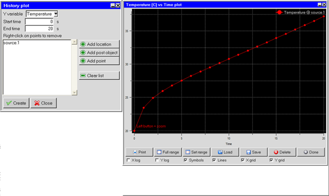

### 13.12. Step 10: Examine Transient Results in CFD-Post

You can also postprocess results using tools in Ansys CFD-Post. Go to the **Post** menu in Icepak and select **Workflow data** and click on**CFD Post/Mechanical data**. Enabling this option writes out a data file (fi- lename.cfd.dat) that can be loaded into CFD-Post.

To launch CFD-Post for a Windows system, click **Start > Ansys 2022 R1**>**Fluid Dynamics**>**CFD-Post** **2022 R1** or for a **Linux** system you can access CFD-Post using **~ansys_inc/v170/CFD-** **Post/bin/cfdpost**.

In Ansys CFD-Post, select **Load Results...** in the **File** menu to display the **Load Results File** dialog box. Select the filename.cfd.cas file that corresponds to the transient solution.

**Tip:**

Refer to the Ansys Icepak text window for the location and file name of the transient solution you have just saved.

**Figure 13.10: CFD-Post**

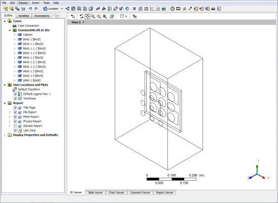

Once the results have been loaded into CFD-Post, there are several options to view and analyze a transient solution.

1. Display time history similar to what is displayed in Icepak.

a. Go to **Insert** **Text**

b. Enter the text,**Auto Annotation**.

c. In the **Definition** tab of the **Details** view, enter **Time** into the **Text String** field.

d. Select the **Embed Auto Annotation** option.

e. In the **Type** drop-down list, select **Timestep**.

f. Click **Apply**.

**Figure 13.11: Details of Auto Annotation**

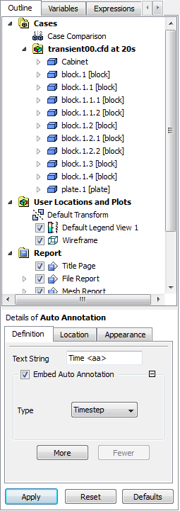

2. Create a contour.

a. Go to **Insert** **Contour** and create a new contour named TemperatureContours.

b. Update the settings for the **Geometry** tab of the **Details** view for TemperatureContours as

shown in Figure 13.12: Details of Temperature Contours (p. 306). Note that to select all of the blocks as shown in the figure, you must click the **...** button next to **Locations**, then you must

press **Shift** while selecting all of the block nodes in the panel that appears. Click **Apply** to create the contours (Figure 13.13: TemperatureContours Display (p. 307)).

**Figure 13.12: Details of Temperature Contours**

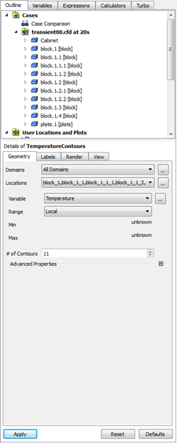

**Figure 13.13: TemperatureContours Display**

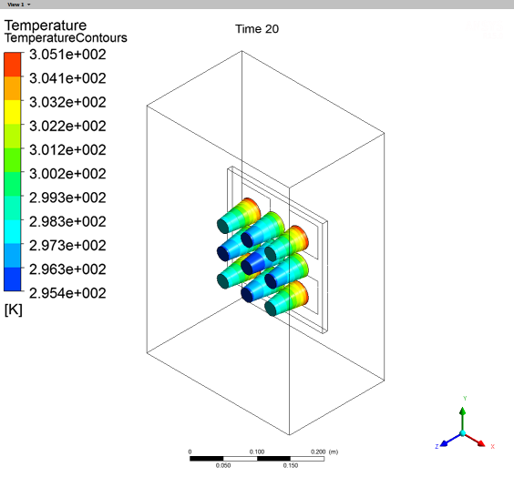

3. Display temperature at different time steps.

a. Click the timestep selector icon (

) to display the **Timestep Selector** panel. Double-click a timestep to view the corresponding temperatures. Figure 13.14: Timestep Selector Panel (p. 308) shows the selection of time 12.

**Figure 13.14: Timestep Selector Panel**

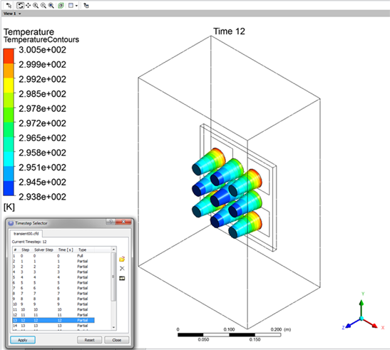

Additional options available in CFD-Post can be found in Postprocessing Using ANSYS CFD-Post (p. 465).

### 13.13. Step 10: Summary

In this tutorial, you set up and solved a transient model and used the animation technique to examine the results over time. Results were also examined in CFD-Post.

We repeat some of the tips and best practices found in this tutorial for your convenience:

1. Best Practices

a. Use the **Problem setup wizard** for guided problem setup. Edit the problem setup if needed

using the

**Basic parameters** panel.

b. Choose an appropriate time step to optimize the convergence rate while maintaining solution

stability.

c. Select an appropriate amount of iterations per time step for adequate temporal convergence. Note that an individual time step may require fewer iterations to converge than you specify.

d. Create monitor points of relevant quantities (temperature, pressure, or velocity) to help judge

convergence alongside residuals.

2. Tips and Tricks

a. Copy similar objects then edit the copied objects to the desired specifications to eliminate re- dundancies. This may be faster than creating every object individually.

b. Set a small initial velocity in an opposite direction to the gravity vector's direction when solving

natural convection problems.

c. Post-process your transient simulation results at specific times in static images or through the entire transient duration in animations.

d. Save your animations to a file in MPEG, GIF, or other neutral formats to be played back later using

a third-party software.

e. Load your results into ANSYS CFD-Post for even more post-processing capabilities.

---

## Chapter 14: Zoom-In Modeling in Ansys Workbench

### 14.1. Introduction

This tutorial demonstrates how to create and modify a zoom-in model (system sub-model) in Ansys Icepak. You will begin in Ansys Workbench and drag an Icepak template into the **Project Schematic** window. You will import an Icepak TZR file, modify the model, and solve it according to the instructions in this tutorial. The project will also include post-processing results in Ansys CFD-Post.

In this tutorial, you will learn how to:

• Create an Ansys Icepak analysis in Ansys Workbench

• Create a zoom-in model from a solved system-level model

• Run that model with more detail added

• Merge the detailed system-level model back into the system-level model

• Post-process results in CFD-Post

**Note:**

Mesh counts and solution results may differ slightly due to enhancements to the meshing algorithm and Fluent solver, respectively.

### 14.2. Prerequisites

This tutorial assumes that you have little experience with Ansys Icepak and Ansys Workbench, but that you are generally familiar with the interface. If you are not, review Finned Heat Sink (p. 5) and the ANSYS Icepak - Ansys Workbench Integration Tutorial (p. 447) in this guide.

### 14.3. Problem Description

The objective of this exercise is to become familiar with Ansys Icepak’s zoom-in modeling capabilities. You can solve detailed systems first with reasonable simplifications and then have more detailed sub- system models run from boundary conditions created from the region in question. For example, you can simplify multiple packages as one plate with the total power of all packages. You can then solve a system level model, resulting in a sub-region with the velocities and temperatures from the system- level model and have more detail on the board of interest. Essentially, you start with the most simplified and all-encompassing system, then you progressively refine individual components of that system using the results of the full, simplified system.

In this tutorial, you will run a simplified system-level model of a slotted chassis, learn how to create an Ansys Icepak zoom-in model, run that model and then merge the detailed section back into the original system.

**Figure 14.1: Problem Specification**

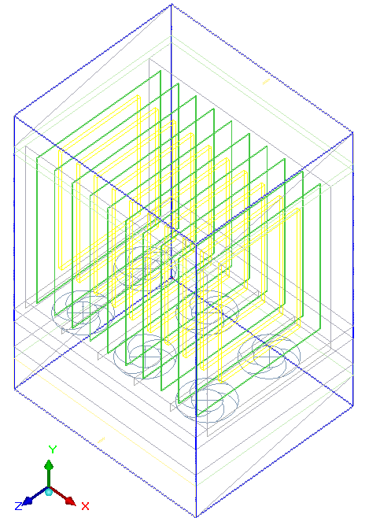

### 14.4. Step 1: Create a New Project

1. Set up a working directory on the computer you will be using.

2. Download the rack.zip file here.

3. Unzip the rack.zip file you have downloaded to your working directory.

4. Start Ansys Workbench.

**Figure 14.2: Ansys Workbench**

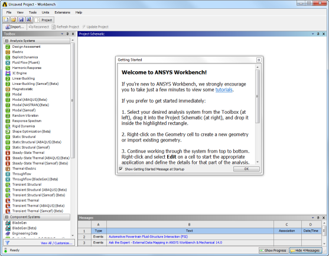

5. Copy rack.tzr to your working directory.

6. Drag and drop an **Icepak** template under **Component Systems** in the **Toolbox** window into the **Project Schematic** window.

7. Right-click the Icepak **Setup** cell (A2) and select **Import Icepak Project From .tzr**.

8. Select **Browse...** and the **File selection** panel appears. Select the packed project file rack.tzr and click **Open**.

9. The CAD model appears in the graphics window of Ansys Icepak. Click the isometric toolbar icon

(

) to display the isometric view of the model.

### 14.5. Step 2: Build the Model

**Note:**

Look at the specifications of the different components. The model has 10 pairs of plates (Figure 14.1: Problem Specification (p. 312)). If you examine any pair of plates,**plate.1.x** rep- resents the PCB and **plate.2.x** represents the components on that PCB. In actuality, each PCB would have many components mounted on it. We are simplifying the model by repres-

enting the components with a single plate. The thickness of these plates equals the average height of the components. All the PCBs have the same configuration and the same compon- ents. The total power of the components in each PCB is 30 W, so each of the plates (**plate.2.x**) dissipates 30 W.

Save the problem to a new project file while you are in Ansys Workbench. This will allow you to expand on the problem without affecting the original file.

**File** **Save project**

1. In the **Project** text box, enter the name rack-new.

2. Click **Save**.

### 14.6. Step 3: Generate a Mesh

For this model, you will generate the mesh in just one step. You will specify object-specific meshing parameters to ensure that the resulting mesh is sufficiently fine near object faces to resolve the boundary layers properly.

1. Go to **Model** **Generate Mesh** or use the toolbar shortcut (

) to open the **Mesh control** panel.

2. In the **Mesh control** panel, make sure **Mesher-HD** is selected as the **Mesh type**.

3. Set the **Max element size** for **X**,**Y**, and **Z** to 0.03 m if not already set.

4. Select the **Normal** option next to **Mesh parameters**.

5. In the **Local** tab, select **Edit** next to **Object params** (Figure 14.3: Object Parameters in the Mesh control Panel (p. 315)). Specify the individual localized mesh settings for the following objects using the values in the table:

| Object type | Object name | Parameter | Requested Value |
| --- | --- | --- | --- |
| Opening | All openings | Y count | 10 |
| Plate | All plates | Low end height High end height | 0.003 0.003 |
| Block | block.3 | Y count | 4 |

**Tip:**

You can specify the parameters of multiple objects simultaneously by selecting all the desired objects in the node tree of the **Per-object meshing parameters** panel then

making the required parameter specifications. Note that this can only be done to objects of similar type and orientation.

**Note:**

You can also set mesh parameters by right-clicking object in the **Model manager** window and selecting **Edit mesh parameters**.

**Figure 14.3: Object Parameters in the Mesh control Panel**

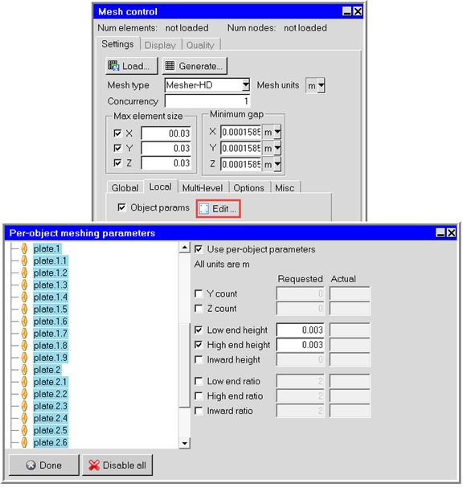

6. Press **Done** to close the **Per-object meshing parameters** panel.

7. In the **Settings** tab of the **Mesh control** panel,**Generate** the mesh and then display and visually inspect the mesh from the **Display** tab. Deselect the **Display mesh** option when you are done.

8. Examine the mesh quality by going to the **Quality** tab of the **Mesh control** panel. Click **Close** when you are done.

### 14.7. Step 4: Physical and Numerical Settings

1. Go to

**Advanced settings**. Verify that the following values are set for each parameter:

**Solution settings**

**Basic settings** and

**Solution settings**

| Basic settings | Specifica- tion |
| --- | --- |
| Number of iterations | 300 |
| Energy convergence criterion | 1e-7 |
| Advanced settings (Under-relaxation group box) |  |
| Pressure | 0.7 |
| Momentum | 0.3 |

2. Go to

**Basic parameters** and make sure the **Flow regime** is **Turbulent** and the turbulence model is **Zero equation** under the **General setup** tab. Also select **Off** in the **Radiation** group box. Click **Accept** to close the panel.

**Problem setup**

**Note:**

Instead of accessing the

**Basic parameters** panel, you can instead use the **Problem** **setup wizard** to define your problem setup by double-clicking

**Problem setup** in the model manager window. See 2.7. Step 4: Physical and Numerical Settings (p. 28) of the Finned Heat Sink tutorial for more instruction regarding the **Problem setup wizard**. You must still use the same settings described in this tutorial for the **Problem setup wizard**.

3. Now add two temperature point monitors for **plate2.1** and **plate2.2** into the **Points** folder to observe the progress of the solution at the center of the objects. To do this, highlight both objects in the **Model manager** window using the **Ctrl** key and the left mouse button, and then drag the objects into the **Points** folder. The default monitored parameter is temperature.

### 14.8. Step 5: Save the Model

Ansys Icepak saves the model for you automatically before it starts the calculation, but it is a good idea to save the model (including the mesh) yourself as well. If you exit Ansys Icepak before you start the calculation, you will be able to open the project you saved and continue your analysis in a future Ansys Icepak session. (If you start the calculation in the current Ansys Icepak session, Ansys Icepak will simply overwrite your project file when it saves the model.)

**File** **Save project**

### 14.9. Step 6: Calculate a Solution

1. Go to **Solve** **Run solution** menu and select **Sequential solution of flow and energy equations** in the **General setup** tab (Figure 14.4: The Solve Panel (p. 317)). Under **Solver options**, ensure that **Disable radiation** is selected.

**Figure 14.4: The Solve Panel**

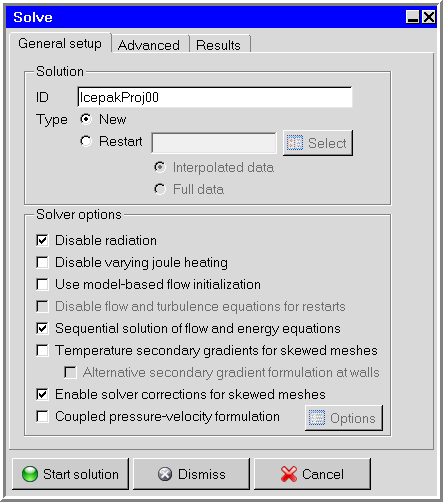

**Tip:**

When the gravity vector is not enabled in the solver, you have the opportunity to reduce solve time if desired by selecting **Sequential solution of flow and energy equations**. Since there are no buoyancy effects, there is no longer coupling of the Navier-Stokes and energy equations. Thus, you can completely converge the flow equations and then use that value in the energy equation instead of solving both on every iteration.

2. Click **Start solution** to run the solver.

### 14.10. Step 7: Examine the Results

1. After the solution has converged, create the following post processing objects with the settings specified in the images:

• **Object face**:**face.1**

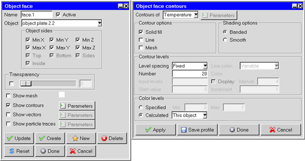

• **Object face**:**face.2**

Select all the fan objects for **face.2**.

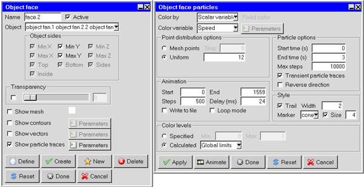

Click **Animate** in the **Object face particles** panel to see the fluid streamlines animated according to the steady-state velocity distribution.

• **Plane cut**:**cut.1**

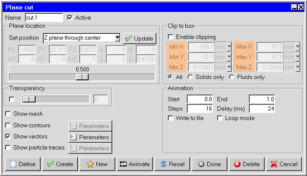

• **Plane cut**:**cut.2**

The post-processing objects **face.1** and **cut.1** should look similar to Figure 14.5: Object Face: face.1 (plate2.2 Temperature) (p. 320) and Figure 14.6: Plane Cut: cut.1 (Z Plane Through Center Velo- city) (p. 321).

**Figure 14.5: Object Face: face.1 (plate2.2 Temperature)**

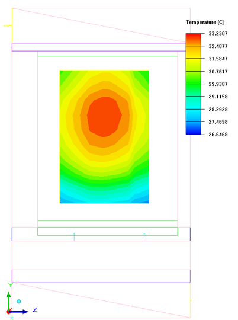

**Figure 14.6: Plane Cut: cut.1 (Z Plane Through Center Velocity)**

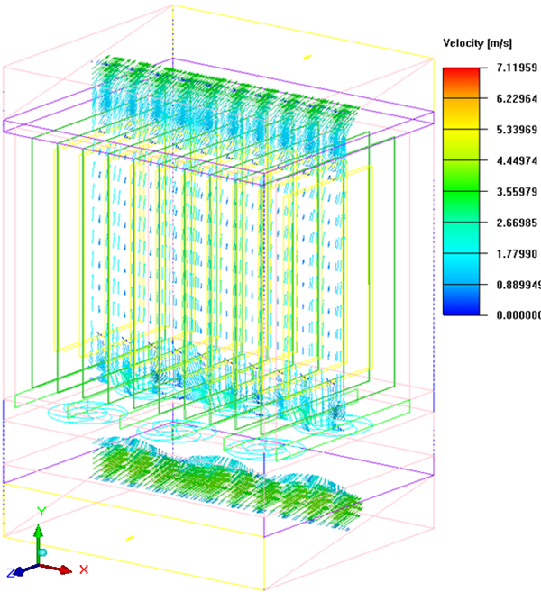

2. Save all the post-processing objects created. Go to **Post** **Save post objects to file**. Save it with the default file name **post_objects** to be used in the future.

### 14.11. Step 8: Create a Zoom-In Model

With a solution obtained for the main model, we can now zoom-in around one pair of PCB-components plates, namely **plate.1.2** and **plate.2.2**.

1. Go to **Post** **Create zoom-in model**. The **Zoom-in modeling** panel appears. The boundaries for the zoom-in also appear in the Ansys Icepak main window as a bold white box. By default this zoom- in box is coincidental with the cabinet.

2. Resize this box by entering the values shown in Figure 14.7: The Zoom-in modeling Setup Panel (p. 322) into the zoom-in window. Change **Max Y** to **Outflow** and both **Min Z** and **Max Z** to **Wall**. Note that the zoom-in box now surrounds plate.1.2 and plate.2.2 and includes portions of some on the remain- ing system-level model objects (Figure 14.8: Zoom-in Box (p. 324)). There needs to be one outflow to compensate for slight differences in flow with a pressure differential. The wall objects are created since the entire face on that side is created in a solid or on a solid surface.

**Note:**

The coordinates for each of the zoom-in boundaries can also be specified by clicking the **Select** button to the right of the appropriate text entry box and clicking the left mouse button on the desired point in the graphics display window. You may want to orient your view depending upon the coordinate being selected to ensure a more accurate selection. The boundaries of the zoom-in model will be displayed in the graphics window as you update them.

**Figure 14.7: The Zoom-in modeling Setup Panel**

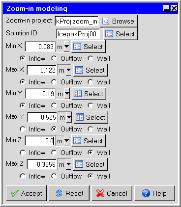

3. Click **Accept** to create the zoom-in model. Since many of the parts in the zoom-in model extend out of the zoom-in box, a warning message window should appear listing a set of objects that lie outside.

4. In the **Objects overlapping** dialog box, click the **Resize** button to resize these parts to fit into the zoom-in model. Ansys Icepak writes out a zoom-in model called **IcepakProj.zoom_in**. Ansys Ice- pak reports on the operations to construct the model and creates the profiles in the Ansys Icepak mes- sages window.

**Figure 14.8: Zoom-in Box**

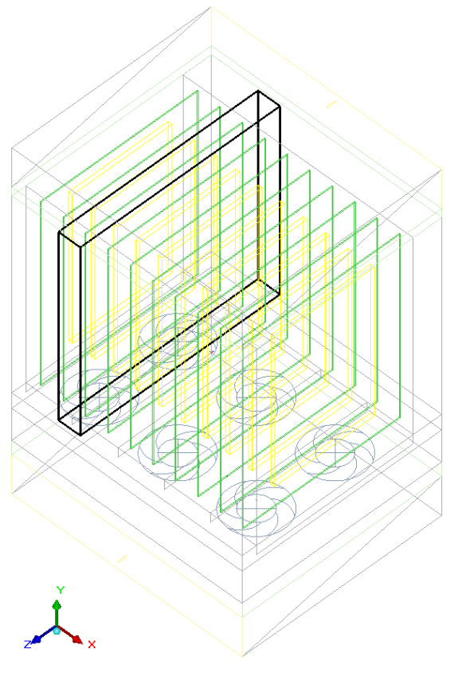

### 14.12. Step 9: Edit the Zoom-in Model

1. Drag and drop a new Icepak template into the same Ansys Workbench **Project schematic** window, then link a **Results** cell from the **Toolbox window** to this Icepak template (name it **Zoom-in**). The **Results** cell should link to the Icepak **Solution** cell as shown in Figure 14.9: Project Schematic (p. 325).

**Figure 14.9: Project Schematic**

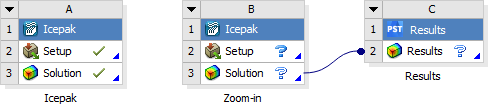

**Note:**

Click **Update Project** in Ansys Workbench to update the setup and solution data *before* creating a new Icepak template. This will mesh and solve your Icepak model again.

2. Right-click the Icepak **Setup** cell (B2), select **Import Icepak Project** and **Browse...**.

3. In the **Select Folder** file selection dialog, select the zoom-in model called **IcepakProj.zoom_in**. (It will be in the same location as the folder for the system-level model.) In the system-level model we used a single conducting thick plate to represent the components. We can now replace the **plate.2.2** by the individual components.

4. Double-click **plate.2.2** to open the **Plates** panel and make the following changes:

a. In the **Info** tab, type **Chip** for the **Name** field.

b. In the **Geometry** tab, change your settings to match those in Figure 14.10: Plates Panel for Object

Chip (Geometry Tab) (p. 326).

**Figure 14.10: Plates Panel for Object Chip (Geometry Tab)**

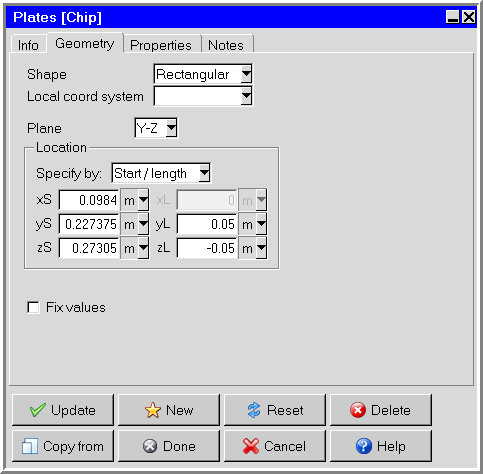

c. In the **Properties** tab, type **3.0** W in the **Total power** field.

d. Click **Done** to close the panel.

5. Create nine additional components in an array.

a. Right-click **Chip** and select **Copy**.

b. Create two copies of **Chip** with a **Z offset** of **-0.065** m.

c. Select and highlight all three **Chip** plates in the **Model manager** window.

d. Make three copies of the three plates with an **Y offset** set to **0.07** m in the same way you

copied the single chip.

e. View the geometry in isometric view (**Shift**+**I**).

f. Delete two of the components (**Chip.1.3** and **Chip.4**) and to form the pattern shown in Fig- ure 14.11: Schematic of the Completed Zoom-in Model (p. 327).

**Figure 14.11: Schematic of the Completed Zoom-in Model**

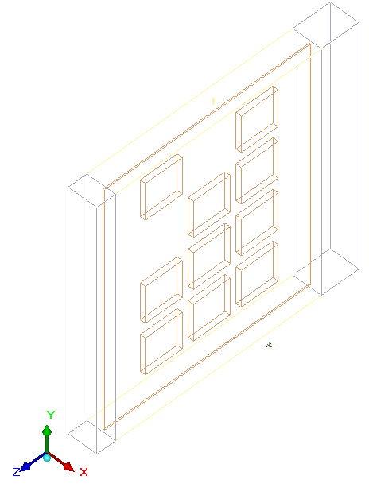

### 14.13. Step 10: Mesh the Zoom-In Model

1. Go to **Model** **Generate mesh**, and set the **Mesh type** to **Mesher-HD** and the **Mesh parameters** to **Coarse**.

2. In the **Local** tab, deselect the **Object params** check box.

3. While in the **Global** tab, change your mesh settings to those of Figure 14.12: Zoom-in Mesh control Panel (p. 328).

**Figure 14.12: Zoom-in Mesh control Panel**

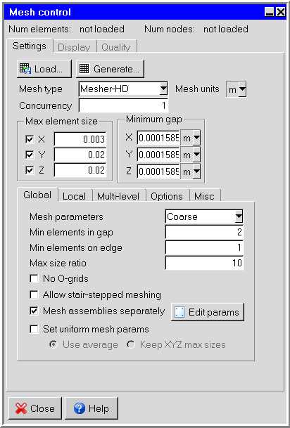

4. **Generate** the mesh and then display and check the mesh quality from the **Display** tab. Make sure to deselect the **Display mesh** option when you are done.

### 14.14. Step 11: Zoom-In Physical and Numerical Settings

1. Drag and drop the two chips (**Chip.5** and **Chip.2.3**) into the **Points** folder in the **Model manager** window to monitor their temperature.

2. Delete the monitor point **plate.2.2** brought in from the system-level model since it no longer exists as an object. Also delete any other monitor points beside **Chip.5** and **Chip.2.3**.

3. Go to

**Basic settings** to change the maximum number of iterations to **300**.

**Solution settings**

4. Solve the model by selecting **Solve** **Run solution** and by clicking **Start solution** under the **General setup** tab.

### 14.15. Step 12: Examine the Zoom-in Results

After the solution has converged, create the following post-processing objects and compare the results with the system-level models.

| Object | Specifications | Description |
| --- | --- | --- |
| face.1 | Object: all chips | Object-face view of temperature on all chips |
|  | Show contours / Para- meters | Observation: The temperatures are highest in the middle chips toward the lower Z end of the chip array. |
|  | Contours of: Temperature |  |
|  | Contours options: Solid fill |  |
|  | Shading options: Smooth |  |
|  | Calculated: This object |  |
| face.2 | Object: side opening.miny _ | Object-face showing the flow pattern |
|  | Show particle traces / Parameters | Animate the particle traces. Observation(s): The flow is relatively uniform along the lower Y end of the model and ultimately speeds up near the high Y and low Z end of the model. |
|  | Variable: Speed |  |
|  | Particle options |  |
|  | Start time: 0; End time: 1 |  |
|  | Point distribution op- tions: Uniform = 100 |  |
|  | Style: Trail selected; Marker: dot |  |

Figure 14.13: Object Faces face.1 and face.2 (p. 330) shows the two object faces simultaneously.

**Figure 14.13: Object Faces face.1 and face.2**

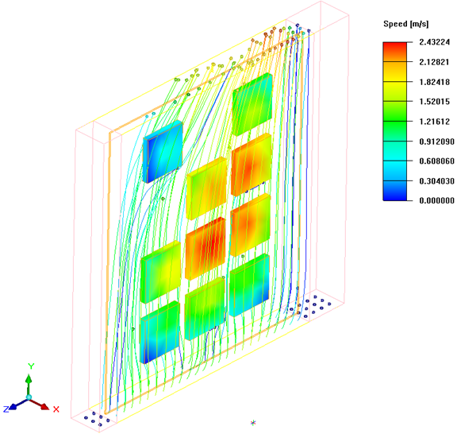

### 14.16. Step 13: Summary

If you were to model all the components in the system-level model, you would have ended up with a cell count of about ten times the size of the zoom-in model. The simplifications at the system-level enabled you to quickly solve the system-level model. The zoom-in model showed you the temperature variation at the sub-system-level, which was essential to identifying the correct locations of the hot spots.

We repeat some of the tips and best practices found in this tutorial for your convenience:

1. Best Practices

a. Use zoom-in modeling when analyzing a complicated system to refine the individual modeling of complex sub-systems.

b. Manage your project from Ansys Workbench when performing zoom-in modeling.

c. Specify object-specific meshing parameters for local mesh refinement in regions with high gradients.

2. Tips and Tricks

a. Specify the parameters of multiple objects simultaneously by selecting all the desired objects in the node tree of the Per-object meshing parameters panel then making the required parameter specifications. Note that you can only do this to objects of similar type and orientation.

b. Use the **Problem setup wizard** for guided problem setup. Edit the problem setup if needed

using the

**Basic parameters** panel.

c. Select **Sequential solution of flow and energy equations** in the **Solve** panel when you are not considering the effects of natural convection. This reduces the solution time required by converging the flow equations before the energy equation rather than simultaneous computation on each iteration.

### 14.17. Step 14: Additional Exercise 1

Set up this problem in a Workbench-based Icepak project. Then set up another Icepak component in the same Workbench project schematic and replace the PCB plate with a detailed PCB object and post- process the results in ANSYS CFD-Post.

You can then perform a comparison study in ANSYS CFD-Post by creating a third Icepak component. This time, duplicate the first Icepak component and link this component to the available **Results** com- ponent. Post-process the results in ANSYS CFD-Post and compare them to the results containing the PCB plate object.

### 14.18. Step 15: Additional Exercise 2

Perform this additional exercise to create a non-conformal mesh assembly surrounding the details of the third PCB in the main model. Then, compare the results obtained using a non-conformal meshed assembly to the results obtained using the main model with a conformal mesh and to the ones from the zoom-in modeling approach with a conformal mesh.

1. Save the **IcepakProj.zoom_in** model with a new model name such as **rack.zoom_in_merge**. Double-click the Icepak component module’s name (component B) and then enter **rack.zoom_in_merge** for the module name.

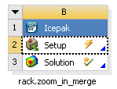

2. Delete all the components within the model except all the plates which represents the PCB and the chips and re-save the model. This version has all the unnecessary components for the system merge removed.)

3. Rename Icepak component module A as **rack-merge-NC** as shown:

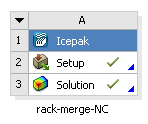

4. Open the main model rack.

5. Use **File** **Merge Project** to import **rack.zoom_in_merge** into this model with all the details of the chips.

**Note:**

There will be two projects in the **rack-new_files** folder,**IPK** and **IPK-1**. Select **IcepakProj** located at **dp0/IPK-1/Icepak**.

6. Deactivate the old components residing where the merged components are (**plate.1.2** and **plate.2.2**).

7. Create a non-conformal assembly containing all the chips and the board. Use slack values between **3**-**5** mm in every direction for the assembly. These are good values to start without violating any of the non-conformal meshing rules.

8. Finally, mesh and run the model with a different **Solution ID** and compare the results to the previ- ously obtained ones. Verify that the results are very comparable.

Figure 14.14: Temperature Comparison: Zoom-in Model with Conformal Meshing vs. System with Non-conformal Assembly (p. 333) shows a temperature comparison between the zoom-in model and the system-level model with a non-conformal assembly. While the temperatures are slightly different, the overall distribution (hot spots) stay the same.

**Figure 14.14: Temperature Comparison: Zoom-in Model with Conformal Meshing vs. System** **with Non-conformal Assembly**

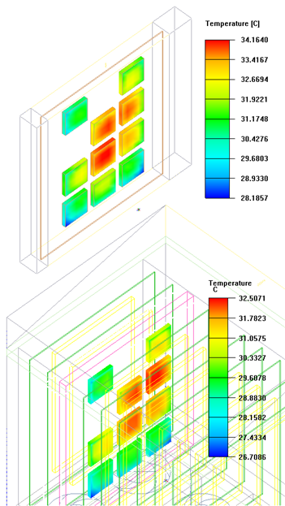

---

## Chapter 15: IDF Import

### 15.1. Introduction

This tutorial demonstrates the IDF import capability of Ansys Icepak.

In this tutorial, you will learn how to:

• Import IDF files.

• Apply the various options offered in Ansys Icepak’s IDF import capability.

**Note:**

Mesh counts and solution results may differ slightly due to enhancements to the meshing algorithm and Fluent solver, respectively.

### 15.2. Prerequisites

This tutorial assumes that you are familiar with the menu structure in Ansys Icepak and that you have solved or read the tutorial Finned Heat Sink (p. 5). If you have not, review Sample Session in the Icepak User’s Guide.

### 15.3. Problem Description

Intermediate Data Format (IDF) is a data exchange specification between ECAD and MCAD for the design and analysis of printed circuit boards. An IDF CAD model is generated by software such as Mentor Graphics. Typical IDF models include a board file and a library file. The board file includes board layout (board dimension and shape, location of the components), and the library file includes component in- formation (size, power dissipation, junction to case and junction to board thermal resistance, etc.). Ansys Icepak’s IDF import utility is designed to convert the IDF CAD data into an Ansys Icepak model automat- ically. Ansys Icepak imports the geometry as well as parameters such as power and material property based on the availability of such information.

This tutorial does not involve generating a mesh, calculating a solution or examining results. These steps will not be shown in this tutorial.

### 15.4. Step 1: Create a New Project

1. Start Ansys Icepak, as described in Starting Ansys Icepak on a Linux System and Starting Ansys Icepak on a Windows System of the User’s Guide.

When Ansys Icepak starts, the **Welcome to Icepak** panel opens automatically.

2. Click **New** in the **Welcome to Icepak** panel to start a new Ansys Icepak project.

The **New project** panel appears.

3. Specify a name for your project.

a. In the **Project name** text box, enter the name idf-demo.

b. Click **Create**.

### 15.5. Step 2: Build the Model

1. Set up a working directory on the computer you will be using.

2. Download the idf_import.zip file here.

3. Unzip the idf_import.zip file you have downloaded to your working directory.

To build the model, you will first import the board layout. The board and the associated library files have to be chosen at this step.

**File** **Import** **IDF file** **New**

**Figure 15.1: IDF Import Menu**

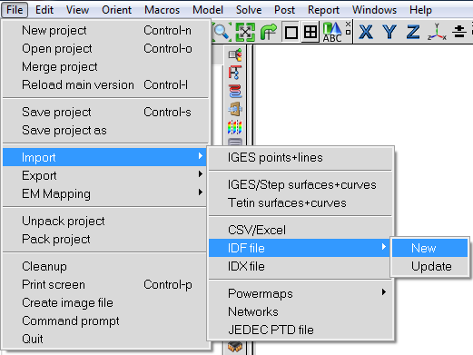

1. In the **IDF import** panel, click the **Browse** button next to the **Board file (ascii)** field and select the file brd_board.emn. Board files have the extension "*.emn," "*.bdf," "*.idb," or "*.brd". Note that the library file (brd_board.emp) is loaded automatically (Figure 15.2: IDF import Panel - Load files (p. 337)).

**Figure 15.2: IDF import Panel - Load files**

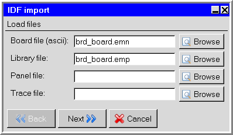

2. Click **Next** and go on to the **Layout options** section (Figure 15.3: IDF import Panel - Layout op- tions (p. 338)).

• **Import type** as **Detail**

• **Board plane** as **XY** - this is always detected automatically

• **Board shape** as **Rectangular**

• **Board properties** - Click **Edit** button to access the **Board properties** where you can enter details such as number of trace layers, coverage, layer thickness, and so on. Layer properties refer to the average properties of all internal layers. In this example, examine the defaults, and click **Cancel** to close the **Board properties** panel.

**Note:**

More advanced PCB models are covered in the introductory tutorial, RF Amplifier (p. 51), and the application tutorial, Trace Layer Import for Printed Circuit Boards (p. 347), located in the Icepak tutorials guide.

• Drilled holes are for positioning purposes and usually are not important to the thermal physics of the model. During the import, they can be ignored. By default, Ansys Icepak leaves the **Import** **drilled holes** check box deselected under **Detailed options** group box.

• Select **Make all components rectangular** under the **Detailed options** group box to convert all polygonal components to rectangular prisms.

**Figure 15.3: IDF import Panel - Layout options**

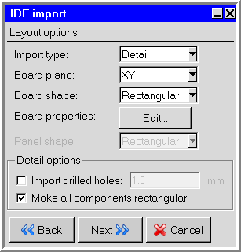

3. Click **Next** to go to the **Component filters** section (Figure 15.4: IDF import Panel - Component fil- ters (p. 339)). Components can be filtered either by size and power or by component type. For now, select **Filter by components** and **Import all components**. The other options will be explained in more detail at the end of the tutorial.

**Figure 15.4: IDF import Panel - Component filters**

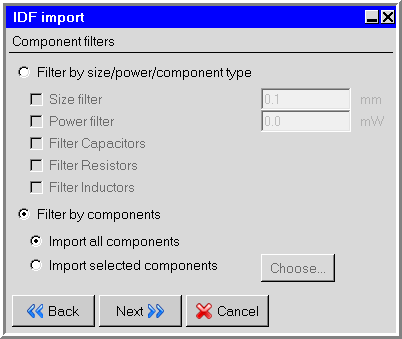

4. Click **Next** to go to the **Component models** section (Figure 15.5: IDF import Panel - Component models (p. 340)).

5. Select **Model all components as** and keep the default settings. The option **Choose specific com-** **ponent model** will be discussed later in the tutorial.

**Figure 15.5: IDF import Panel - Component models**

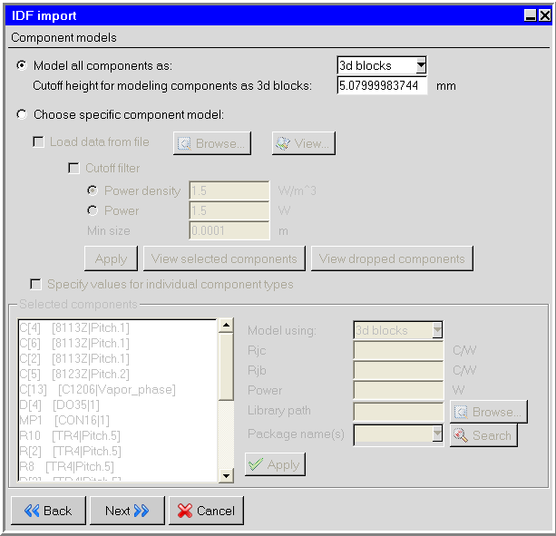

6. Click **Next** to go to the **Miscellaneous options** section (Figure 15.6: IDF import Panel - Miscellaneous options (p. 341)). Select **Append Part Name to Reference Designator** under the **Naming conventions** group box.

**Figure 15.6: IDF import Panel - Miscellaneous options**

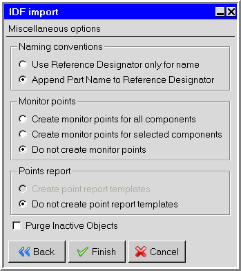

7. Click **Finish** to complete the import.

8. Examine the summary of the IDF import that appears (Figure 15.7: IDF Import Summary (p. 341)). Click **Dismiss** to close the panel.

**Figure 15.7: IDF Import Summary**

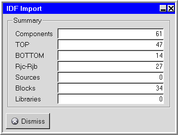

9. Examine the imported model (Figure 15.8: IDF Imported Model with All Components (p. 342)).

Observe:

• the different types of blocks

• the material properties of the PCB block (BOARD_OUTLINE.1)

• the power and resistance values of the network blocks, if any

Note that:

• The components form into groups according to types automatically.

• You can use the **Edit** feature under the

**Groups** node in the **Model manager** window to change the properties for all the components in the same group simultaneously.

• Check the text window for missing properties. Any missing values likely originate from the imported files. You may ignore them in this tutorial since you will not actually run the solver, but you can define them later if desired.

Figure 15.8: IDF Imported Model with All Components (p. 342) shows the Ansys Icepak model with components modeled as 3D objects (solid blocks or two-resistor network blocks). Appropriate boundary conditions need to be applied before starting thermal analysis. In addition, you can review power values by selecting the **Power and temperature limits** option in the **Model** menu.

**Figure 15.8: IDF Imported Model with All Components**

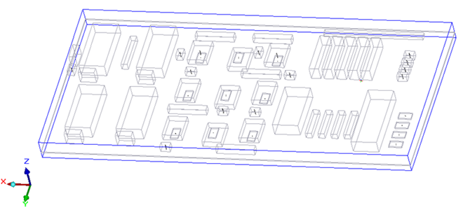

### 15.6. Step 3: Component Filtration Alternatives

1. If you choose **Filter by size/power** (Figure 15.9: IDF Import Panel - Components filters: Filter by size/power (p. 343)), the size filter and/or power filter may be specified. Only those components that are either larger than the specified size filter, or dissipate more than the specified power filter, are imported. If these fields are ignored, all components are imported.

**Figure 15.9: IDF Import Panel - Components filters: Filter by size/power**

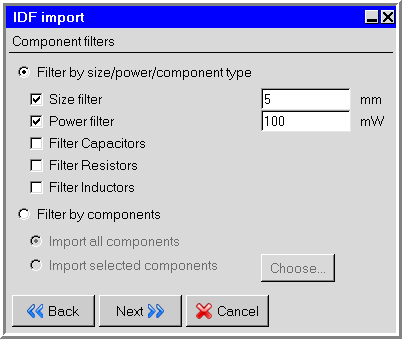

2. If **Filter by component type** is chosen (Figure 15.10: IDF Import Panel - Component filters: Filter by component type (p. 343)), the required components can be selected through the **Component selec-** **tion** panel (Figure 15.11: Component selection Panel (p. 344)); otherwise all the components are in- cluded during the import. The **Component selection** panel contains reference designators for all components.

**Figure 15.10: IDF Import Panel - Component filters: Filter by component type**

After clicking **Choose**, you can choose individual components from the panel in the figure below:

**Figure 15.11: Component selection Panel**

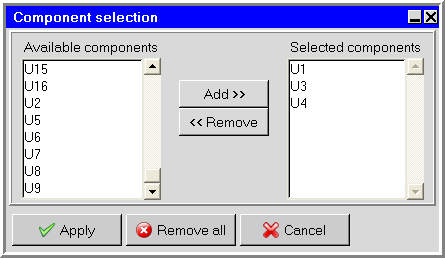

### 15.7. Step 4: Component Models Alternatives

1. The **Model all components as** option is available through both filtration mechanisms.

2. The **Choose specific component model** option is available when filtering by component type. Ansys Icepak allows the component property to be added if no thermal information is available from the IDF file (IDF 2.0), or modify properties if it is available (IDF 3.0).

3. Under **Choose specific component model**, properties of required components can be loaded from an existing file using the **Load data from file** option. The format for the file is:

Rjb (C/W) Rjc (C/W) Power (W) Reference designator

Figure 15.12: Set Component Property Using File (p. 344) shows a sample file. Objects not present in the file are imported with data already present in the IDF file, or as solid blocks with no power specification.

**Figure 15.12: Set Component Property Using File**

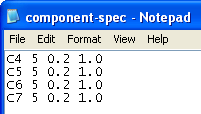

4. Component properties may also be edited manually by selecting the **Specify values for individual** **component types** option. The components to be imported are listed under **Selected components**. The component name is composed of the type and name and the number of copies, followed by a more descriptive part name (Figure 15.13: Manual Selection of Component Models (p. 345)). To manually set the component property, you can select the component in the **Selected components** list. Multiple selections can be made by pressing **Ctrl**, or **Shift**, along with the left mouse button. Then, you can choose the model type:**Rjc-Rjb** (two resistors),**3d blocks**, or **2d sources**. Furthermore, you can specify the power dissipation. For a two-resistor model,**Rjc** and **Rjb** values need to be specified as well. After inputting your specifications, click **Apply** to complete the modification.

**Figure 15.13: Manual Selection of Component Models**

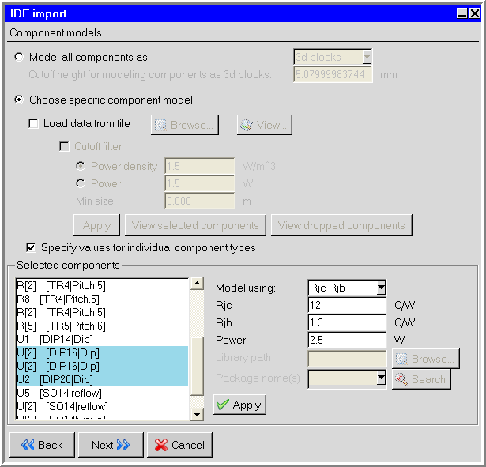

### 15.8. Step 5: Summary

You have used the IDF import feature of Ansys Icepak to import a board level model with all of its components. You observed that the board properties and component properties (where specified) were automatically updated in the Ansys Icepak model. Last, you have explored the components filtration and modeling alternatives that are available in the IDF import feature.

---

## Chapter 16: Trace Layer Import for Printed Circuit Boards

### Chapter 16:Trace Layer Import for Printed Circuit Boards

### 16.1. Introduction

A printed circuit board (PCB) is generally a multi-layered board made of dielectric material and several layers of copper traces. From the thermal modeling point of view, a PCB may be treated as a homogen- eous material with bi-directional thermal conductivity, i.e. thermal conductivity value is different in the normal-to-plane direction than that of the in-plane direction. This approach is reasonable as long as the trace distribution is more-or-less uniform in any given layer. However, with the continuing challenges to increase product functionality while decreasing product size, designers are compelled to place more and more functionality on individual PCB’s. As PCB’s become more densely populated, their trace layers are becoming more non-uniform and it is prudent to use locally varying thermal conductivity information on the board.

PCBs often have large copper spread in the power and ground planes, this along with the presence of vias (especially thermal vias) can be effectively used by the designer to spread heat from the package. A detailed conductivity map of the PCB is required to simulate heat transfer, which is possible in Ansys Icepak using the trace import feature.

Conducting a computational heat transfer simulation for each individual layer is costly and impractical for a system-level model. In Icepak, it is possible to import trace layout of the board and compute locally varying orthotropic conductivity ( , , , and ) on the board using a profile mesh size. The supported file formats are:

• ODB++

• EDB

• ANF

• Gerber (for windows only)

• BOOL+INFO

• IPC2581

For trace import licensing and configuration information, refer to Licensing Requirements for Importing Trace Files in the Icepak User's Guide.

In this tutorial, we will show :

• How to import trace layout of a typical PCB and solve two sample cases based on the trace layout information.

• How to use **Model layers separately** option for better accuracy.

**Note:**

Mesh counts and solution results may differ slightly due to enhancements to the meshing algorithm and Fluent solver, respectively.

### 16.2. Prerequisites

This tutorial assumes that you are familiar with the menu structure in Ansys Icepak and that you have solved or read the tutorial Finned Heat Sink (p. 5). Some steps in the setup and solution procedure will not be shown explicitly.

### 16.3. Problem Description

A PCB board, library files and traces are imported to create the model. The model is first solved for conduction only, without the components and then solved using the actual components with forced convection.

### 16.4. Step 1: Create a New Project

1. Start Ansys Icepak, as described in Starting Ansys Icepak in the Icepak User’s Guide.

When Ansys Icepak starts, the **Welcome to Icepak** panel opens automatically.

2. Click **New** in the **Welcome to Icepak** panel to start a new Ansys Icepak project.

The **New project** panel appears.

3. Specify a name for your project.

a. In the **Project name** text box, enter the name trace-import.

b. Click **Create**.

### 16.5. Step 2: Build the Model

1. Set up a working directory on the computer you will be using.

2. Download the traces.zip file here.

3. Unzip the traces.zip file you have downloaded to your working directory.

To build the model, you will first import the board layout. The board and the associated library files have to be chosen at this step and the trace file can be imported later.

**File** **Import** **IDF file** **New**

1. In the **IDF import** panel, select the board (A1.bdf). Specify the model directory using **Browse**.

The associated library files are imported automatically.

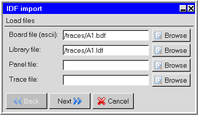

2. Select **Next** to see your **Layout options**. Keep Detail for the **Import type**, XY for the board plane and Rectangular for the board shape.

**Note:**

Because we import the trace information later, we do not need to edit the board properties at this time.

3. Select **Next** to see the **Component filtering** options. Ensure **Import all components** is selected.

**Note:**

You can filter certain components at this step by their size and power information, i.e. you can ignore the small components or the ones dissipating low power. We will import all of the components in this tutorial.

4. Select **Next** to see the **Component models** section. Select **Model all components as**. Keep the default selection of **3d blocks** and the default **Cutoff height for modeling components as 3d** **blocks**.

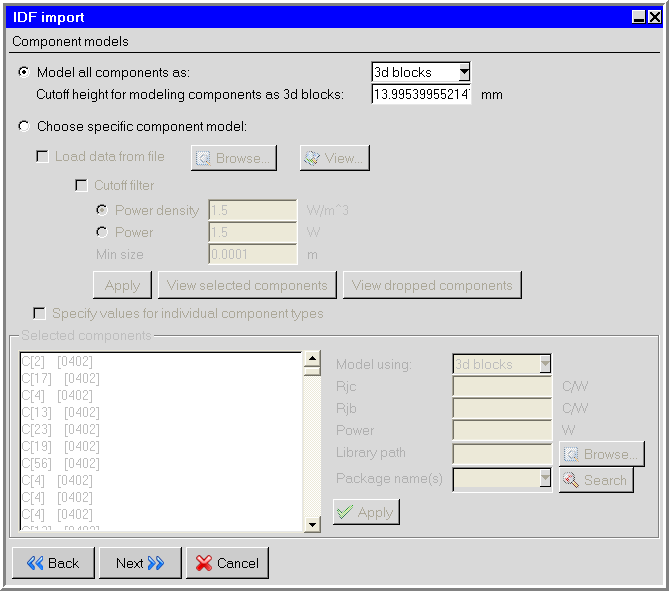

**Note:**

If you have thin components on your board, they can be modeled as 2D sources. In this tutorial, we would like to model all the components as rectangular blocks.

5. Click **Next** to go to the **Miscellaneous options** section where you can specify the naming and monitor options. Keep the default options and click **Finish** to start importing the files. This will take some time depending on the speed of your machine.

You have learned how to import board and library files, and in general you can import any IDF file by using the procedure above.

The next step in building the model is to import the trace files. A pre-built board model named "A11" (see Figure 16.1: A11 Board Layout (p. 354)) will be used to demonstrate the trace file import. This pre-built model was extracted from the previous board file (A11.brd), a number of small com- ponents were removed and a non-conformal assembly was formed.

a. Unpack A11.tzr file to your desktop and name the project "A11".

**Note:**

As mentioned earlier, the trace file can either be imported during the IDF file import or the trace layout information can be assigned to the board after importing the IDF file.

**Figure 16.1: A11 Board Layout**

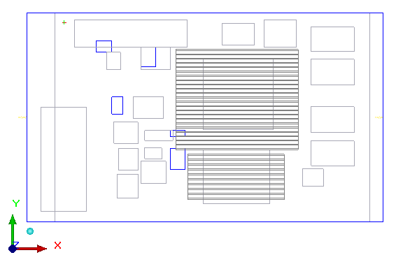

b. Right click BOARD_OUTLINE.1 located in the board assembly in the **Model manager** window

and click **Edit** to display the **Printed circuit boards** object panel.

To import the trace layout, follow the procedures below.

i. In the **Geometry** tab, select **Ansoft Neutral ANF** from the **Import ECAD file** drop down list (Figure 16.2: Printed circuit boards [BOARD_OUTLINE.1] Panel (p. 355)).

**Figure 16.2: Printed circuit boards [BOARD_OUTLINE.1] Panel**

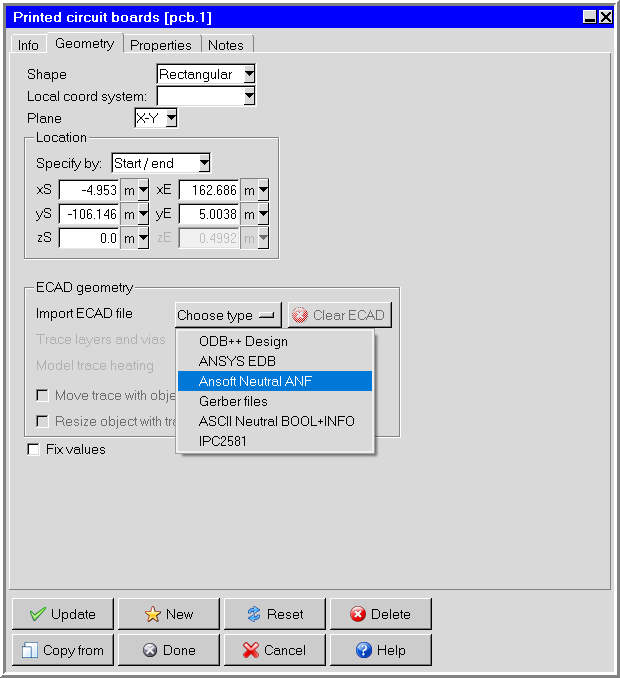

ii. Select A1.anf from the **Trace file** panel. This process may take a few minutes depending on the speed of your computer.

**Note:**

A1.anf can be found in the folder containing the input files downloaded for his tutorial.

iii. Once the import process is completed, you can edit the layer information in the **Board layer**

**and via information** panel (Figure 16.3: Importing Trace Layout and Editing Layer Informa- tion (p. 357)).

The number of layers in the board will automatically be imported to Ansys Icepak and you will have to enter the thickness of each layer and the material type. In this tutorial, the metal layers are pure Cu and the dielectric layers are FR-4.

iv. Enter the layer thickness as shown in Table 16.1: Thickness Information on the Board (Layer

1: Top, Layer 7: Bottom layers) (p. 356).

**Table 16.1: Thickness Information on the Board (Layer 1: Top, Layer 7: Bottom layers)**

| Layer | Thickness (mm) |
| --- | --- |
| Layer 1 | 0.04 |
| Layer 2 | 0.45364 |
| Layer 3 | 0.062 |
| Layer 4 | 0.467 |
| Layer 5 | 0.055 |
| Layer 6 | 0.442 |
| Layer 7 | 0.045 |

The grid density is specified **By count:** or **By size:**. For highest accuracy, the row and column sizing should equal the minimum trace width, or minimum via diameter. For coarse mesh accuracy, we can multiply the minimum trace width by four. For this model, the result is 0.508 mm. Select **By size:** and change the value of **rows** and **columns** to 0.508 mm. For best practices on accuracy and computational cost, refer to Importing Trace Files in the Icepak User's Guide.

**Figure 16.3: Importing Trace Layout and Editing Layer Information**

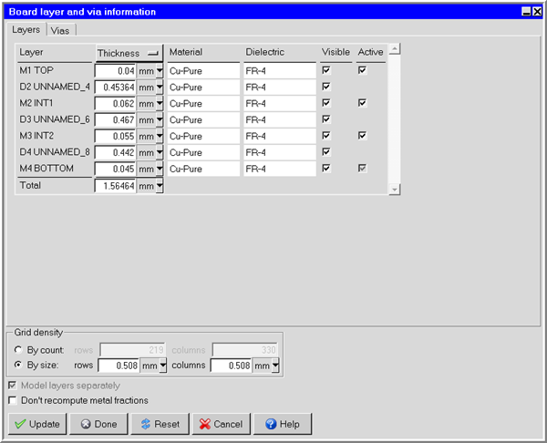

v. By default, the **Model layers separately** option is on when importing traces using a pcb object. Click **Update** and **Done** to close the panel. In the Printed circuit boards [BOARD_OUTLINE.1] panel, click **Edit...** across from **Trace layers and vias** to display the **Board layer and via information** panel. The **Model layers separately** option is on. Click the **Don’t recompute metal fractions** option to turn it off.

**Note:**

To accelerate the computation of metal fractions, enable **Use GPU fo metal** **fraction calculation** in the **Misc** preferences (**Edit** > **Preferences** menu). Not all graphics cards have the required framebuffer memory to accurately com- pute the metal fraction. Make sure your graphics cards have at least 2 GB (or more) of dedicated memory.

vi. **Via** information (for example, material, plating thickness, filled/un-filled, via diameter etc.) is

imported automatically (Figure 16.4: Vias Information (p. 358)), keep the default settings.

**Figure 16.4: Vias Information**

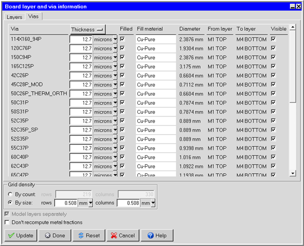

vii. Click **Update** and **Done** to save your settings.

**Note:**

The background mesh matrix (rows and columns) is used to compute the ortho- tropic conductivity on the board. The rows represent the division of the board in the y-direction, the columns represent the division of the board in the x-direction and the size field determines the divisions of the board and indicates the grid size in each direction. The values of , , , and on each cell are determined by the local trace density and the direction. Ansys Icepak does not include the trace geometry in the physical model; however, the locally varying orthotropic conduct- ivity is mapped from the background mesh to the physical model mesh. Once the trace file is imported and assigned to the board geometry, the trace layers are associated with the board and are moved (in translation and/or rotation) with the board object.

viii.Press **Done** to close the **Printed circuit boards** object panel.

ix. Right click on the object BOARD_OUTLINE.1 and go to **Traces** from the menu.

**Note:**

You can view the traces in three different ways, i.e.**single color**,**color by layer**, or **color by trace**. Each of the trace layers can be viewed separately by switching the visible option on or off in the layers part of the panel. (Figure 16.5: Displaying Traces on the Board (p. 359)).

**Figure 16.5: Displaying Traces on the Board**

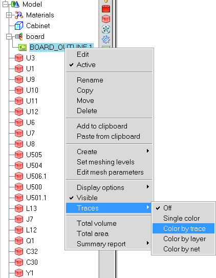

x. Select **color by trace**; the board traces are as shown in Figure 16.6: Trace Layout on the PCB with the Color by trace Option (p. 360).

**Figure 16.6: Trace Layout on the PCB with the Color by trace Option**

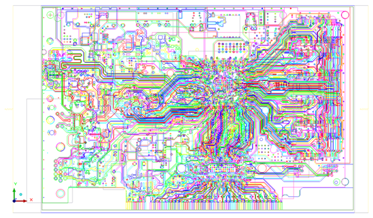

You can view the location of individual trace layers as shown in Figure 16.7: Displaying Trace Layers (p. 360) by enabling the **Display traces in 3D** option in the **Preferences** panel.

**Edit** **Preferences** **Display**

After enabling **Display traces in 3D** option, select **This project** in the **Preferences** panel, zoom in and display the positive Y view of your model.

**Figure 16.7: Displaying Trace Layers**

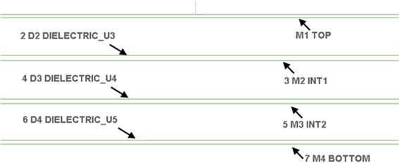

xi. View the fraction of metal traces based on the grid density entered above. Go to the **Model**

menu and select **Show metal fractions**. In the **Show metal fractions** panel, select

BOARD_OUTLINE.1 across from **Object with traces**. The other fields will be automatically filled with the PCB information.

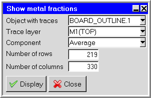

**Figure 16.8: Metal fractions display**

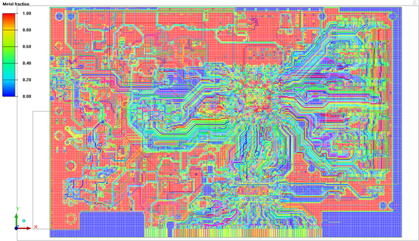

Click **Close** to go back to your previous display.

### 16.6. Conduction Only Model (PCB Without the Components)

Follow these steps for a conduction-only model:

### 16.7. Step 1: Generate a Mesh

You will generate a mesh for each sample problem. First we will consider a board without any compon- ents.

1. Make all objects (including the openings) inactive except the BOARD_OUTLINE.1 object.

2. Select the cabinet and select **Autoscale** from the **Edit** window to make the size of the board and the cabinet the same.

3. Go to the **Properties** tab of the **Cabinet** object panel, and select **Wall** from the **Min z** and **Max z** drop-down lists.

4. Press **Edit** next to **Min z** to open the **Walls** object panel.

a. In the **Properties** tab, select **Temperature** from the **External conditions** drop-down list, and keep the **ambient** temperature (20°C).

b. Press **Done** to close the panel.

5. Press **Edit** next to **Max z** to open the **Walls** object panel.

a. In the **Properties** tab, specify a **Heat flux** of 20000 W/m2 in the **Thermal specification** group box.

b. Press **Done** to close the panel.

**Note:**

The rest of the sides are insulated. The board will be simulated using a conduction-only model.

6. Press **Done** to close the **Cabinet** panel.

7. Go to **Model** **Generate mesh** to open the **Mesh control** panel.

a. Make sure the **Mesh type** is **Mesher-HD**.

b. Specify a **Max element size** for X, Y, and Z as 2.032, 2.032, and 0.05 mm respectively, and a

**Minimum gap** for X, Y, and Z as 1, 1, and 0.01 mm respectively.

**Note:**

To achieve accurate results, the PCB mesh and gridcut mesh should be refined at the same rate. A good balance of cost and accuracy is achieved when the PCB mesh is four times the gridcut mesh. For this model, that leads to 2.032 mm in the X and Y directions.

c. Keep all other defaults and click **Generate**.

8. Once the mesh has been created,**Close** the **Mesh control** panel.

### 16.8. Step 2: Set Physical and Numerical Values

1. Go to

**Problem setup**

**Basic parameters**.

a. Since this is a conduction only model, toggle off the **Flow** option in the **General setup** tab.

b. Make sure **Radiation** is **off** and keep all other default values.

c. Press **Accept** to close the **Basic parameters** panel.

2. Go to

**Solution settings**

**Basic settings**.

a. Keep the default **Number of iterations** and set the **Convergence criteria** for **Energy** to 1e-12.

b. Click **Accept** to close the panel.

3. Go to

**Solution settings**

**Advanced settings**.

a. Input the following for **Temperature** in the **Linear solver** group box:

i. Make sure **F** cycle is selected for **Type** .

ii. Enter 1e-6 for both the **Termination criterion** and **Residual reduction tolerance**.

b. Select **Double** for the solver **Precision**.

c. Press **Accept** to close the **Advanced solver setup** panel.

### 16.9. Step 3: Save the Model

Ansys Icepak saves the model for you automatically before it starts the calculation, but it is a good idea to save the model (including the mesh) yourself as well.

**File** **Save project**

### 16.10. Step 4: Calculate a Solution

Go to **Solve** **Run solution** or click on the shortcut button (

). Enter a Solution ID such as A11–0.508. Start the solver by clicking **Start solution**.

### 16.11. Step 5: Examine the Results

1. Once the model has converged,**Activate** cut.1 if not already activated.

2. **Edit** cut.1 and make sure that **Set position** is **Point and normal**.

3. Make sure that **PX**,**PY**,**PZ** are 0, 0, and 0.78232, respectively and the **NX**,**NY**, and **NZ** are 0, 0, and 1, respectively.

4. Press **Done** and view the model.

The mid-plane temperature distribution shows that the high temperature regions occur at the no-trace areas and low temperature regions occur at areas with a high trace concentration. This is expected as the copper content is directly proportional to the trace concentration. It is worth noting that if a compact or detailed PCB were used in lieu of the traced PCB, one would obtain a fixed temperature for the entire

mid-plane and this fixed temperature would be different from the average temperature of the traced PCB on the same plane.

**Figure 16.9: Temperature Distribution on the PCB (mid-plane)**

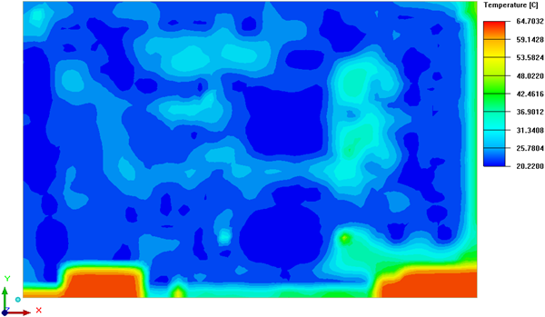

**Note:**

The spatially varying non-uniform conductivity of the board can also be viewed during post processing. The conductivities in the three direction , , and are available as post- processing variables with plane cuts and object faces. Figure 16.10: K_Z Distribution on the PCB (mid-plane) (p. 365) plots at the board mid-plane by selecting **K_Z** from the **Contours** **of** drop-down list from **Plane cut contours** panel of the cut.1 object. In the present case, because the layers are modeled separately, there is a variation of the conductivities in the board-normal direction.

**Figure 16.10: K_Z Distribution on the PCB (mid-plane)**

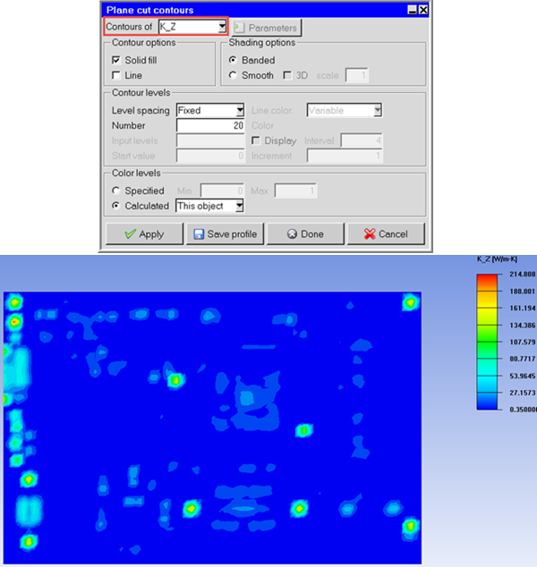

### 16.12. PCB With the Actual Components Under Forced Convection

Follow these steps for a model that has components:

### 16.13. Step 1: Generate a Mesh

1. In order to put the actual components back into the model, highlight all the components under the **Inactive** folder and drag them back into the **Model** folder. Highlight the two wall objects created for the "conduction only" model and drag them into the **Inactive** folder.

2. Click on the **Cabinet** and **Autoscale** it from the **Edit** window.

3. If not already defined, assign an **X Velocity** of -1.5 m/s in the **Properties** tab of the **Openings** panel for the **Max x** side of the cabinet (the minus sign shows that the flow is in the negative x direction).

4. Open the **Mesh control** panel and specify a **Max element size** for X, Y, Z as 9.5, 7, and 0.7 mm re- spectively.

5. Keep all other defaults and **Generate** the mesh.

### 16.14. Step 2: Set Physical and Numerical Values

1. Since we now have forced convection, go to

**Basic parameters** toggle on the **Flow** button. Keep and choose **Turbulent** and **Zero equation** for the flow regime and press **Accept** to close the panel.

**Problem Setup**

2. Go to

**Basic settings** and make sure the **Number of iterations** is 300 and that the **Convergence criteria** are the same as the last mode, and press **Accept** to close the panel.

**Solution settings**

3. Keep the same **Advanced settings** as the previous case.

### 16.15. Step 3: Calculate a Solution

Click **Solve** **Run Solution** to display the **Solve** panel. Enter a different solution id for the forced convection model (that is, A11-conv). Enable **Sequential solution of flow and energy equations** and click **Start solution**.

### 16.16. Step 4: Examine the Results

To display contours of temperature on the board, follow the procedures below.

1. Once the model has converged, deactivate cut.1 and go to **Post** **Object Face**.

2. Select BOARD_OUTLINE.1 from the **Object** drop-down list.

3. Turn on the **show contours** and click on **Parameters** button.

4. Keep the default selection of **Temperature**.

5. For **Color levels**, select **This object** from the drop-down list.

6. Press **Done** in the **Object face contours** panel and then the **Object face** panel to view the postpro- cessing object.

This shows the temperature distribution at the top of the surface of the board (Figure 16.11: Top Surface Temperature Distribution: PCB With Imported Traces in Forced Convection (p. 367)). There are hot spots underneath the high heat flux components.

**Figure 16.11: Top Surface Temperature Distribution: PCB With Imported Traces in Forced** **Convection**

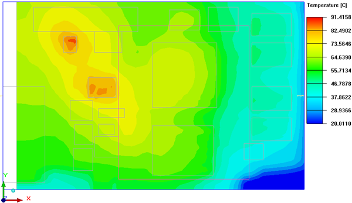

7. Deactivate the face.1 postprocessing object.

### 16.17. Summary

In this tutorial, you imported the board layout and trace files. Then you simulated the board using a conduction only model using a grid density by size of 0.508 mm for rows and columns. Postprocessing this model showed high temperature regions occurring at the no-trace areas and low temperature regions occurring at areas with a high trace concentration. Then you simulated the board with the components put back into the model and simulated under forced convection.

### 16.18. Additional Exercise 1

Using this model, you can determine the joule/trace heating of the imported traces. This problem is described in Tutorial Joule/Trace Heating (p. 369).

---

## Chapter 17: Joule/Trace Heating

### 17.1. Introduction

In the tutorial (Trace layer Imports for Printed Circuit Boards (p. 347)), you learned how to import a trace layout of a typical PCB using the ANF format and also learned how to model the trace layers separately for better modeling accuracy. In this tutorial, you will learn how to model resistive heating or Joule heating of the imported traces in the PCB.

Since PCB traces have electrical resistance, they heat up as current flows through them. Modeling this phenomenon will provide us with an accurate prediction of the temperature distribution in the PCB, which can be important, for example, in evaluating the performance of the cooling system.

**Note:**

Mesh counts and solution results may differ slightly due to enhancements to the meshing algorithm and Fluent solver, respectively.

### 17.2. Prerequisites

This tutorial assumes that you have completed the tutorial Trace layer Imports for Printed Circuit Boards (p. 347) of this guide. This same model is used to determine the Joule/trace heating capability in Ansys Icepak.

### 17.3. Problem Description

The model in the tutorial Trace layer Imports for Printed Circuit Boards (p. 347) contains imported traces and will be used in this tutorial. You will determine the Joule/trace heating capacity of the traces.

### 17.4. Step 1: Create a New Project

1. Set up a working directory on the computer you will be using.

2. Download the joule_heating.zip file here.

3. Unzip the joule_heating.zip file you have downloaded to your working directory.

4. Start Ansys Icepak, as described in Chapter 1 of the User’s Guide.

**Note:**

When Ansys Icepak starts, the **Welcome to Icepak** panel will open automatically.

5. Click **Unpack** in the **Welcome to Icepak** panel to start a new Ansys Icepak project.

**Note:**

The **File selection** panel will appear.

6. In the **File selection** panel, select the packed project file joule-heating.tzr (found in your working folder) and click **Open**.

7. In the **Location for the unpacked project** panel, select a directory where you would like to place the packed project file, enter a project name in the **New Project** text field, and click **Unpack**.

### 17.5. Step 2: Build the Model

Import the traces using A1.anf and change the thickness as described below. Keep the default values for **Grid density**.

**Table 17.1: Thickness Information on the Board (Layer 1: Top, Layer 7: Bottom layers)**

| Layer | Thickness (mm) |
| --- | --- |
| Layer 1 | 0.04 |
| Layer 2 | 0.45364 |
| Layer 3 | 0.062 |
| Layer 4 | 0.467 |
| Layer 5 | 0.055 |
| Layer 6 | 0.442 |
| Layer 7 | 0.045 |

You will work directly on the Joule heating capability in Ansys Icepak

1. Select BOARD_OUTLINE.1 from the **Model manager** window.

a. Right click on the object BOARD_OUTLINE.1 and click on **Traces** in the context menu. You can view the traces in three different ways and select **Off** to remove the display.

b. You can also view individual traces or nets by selecting **Traces** from the **View** menu and clicking

on **Trace info**. As you click on different areas in the graphics display window, the trace name and number will appear. Click on the right or middle mouse button when you are done. In the steps below, you will create a solid trace from one of these traces.

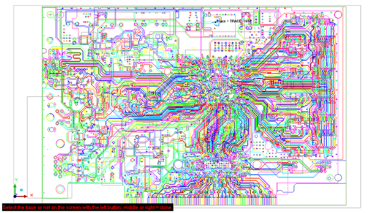

c. Open the BOARD_OUTLINE.1 edit panel. In the **Geometry** tab, click the **Edit** button next to **Model trace heating**. The **Trace heating** panel opens.

i. In the drop-down list under **Layers**, select **INT1_3**. The list in the **Display traces** group box shows available traces. You can filter the traces to view by setting a **Min Area** in the **Display** **traces filter** group box (the default in Ansys Icepak is 20% of the **Largest trace area**) and clicking the **Update** button. In this example, use an **Min Area** of **4124** mm2, as this will only show the significant traces.

**Note:**

The “trace area” of a trace is the area interior to that trace. The **Trace heating** panel lists the traces in each layer in order of descending area, see Figure 17.1: Trace Heating Panel Selection and Options (p. 372).

ii. Before you create a solid trace of trace A3V3_2261 (the appended number, in this case 2261, may vary), you need to modify the **Max angle** and the **Min length** to ignore the fine details in the trace geometry and reduce the mesh count. If you have not done so already, select trace A3V3_2261 and set the **Max angle filter** to **135** and the **Min length filter** to **1.0** mm. These settings determine the creation and geometry of a trace block modeling the trace.

**Figure 17.1: Trace Heating Panel Selection and Options**

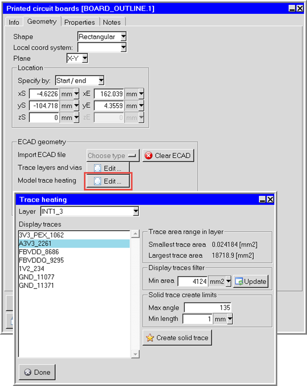

iii. Click the **Create solid trace** button. Ansys Icepak will create a polygonal solid block named

BOARD_OUTLINE.layer-3-trace-A3V3_2261 that contains the trace information. (The actual name may vary). Click **Done** to close the **Trace heating** panel.

**Note:**

You can try reducing the **Area filter** to **1000** mm2 to check how many traces appear. We are interested in the largest trace, trace A3V3_2261.

d. Click **Done** in the **Printed circuit boards** panel to close the panel and view the model ). Note

that the shaded object in the figure below is the block you have just created for trace A3V3_2261.

**Figure 17.2: Solid Block Created for Trace A3V3_2261**

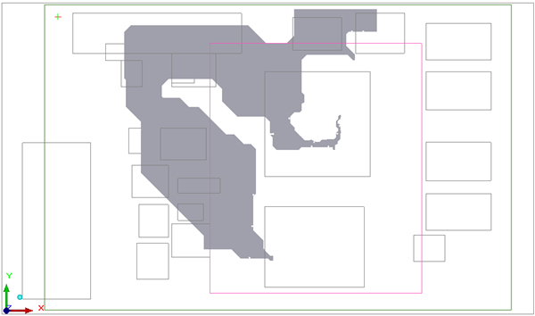

2. Select the polygonal trace just created from the **Model manager** window and open the **Blocks** panel.

a. In the **Geometry** tab of the **Blocks** panel, make sure there are approximately 184 vertices for the trace, as shown in Figure 17.3: Polygonal Trace Block (p. 374).

**Figure 17.3: Polygonal Trace Block**

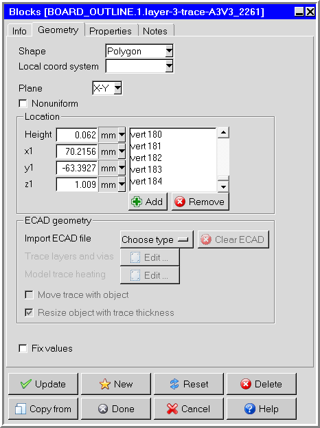

b. Go to the **Properties** tab.

i. Under **Thermal specification** next to **Joule heating**, click **Edit** to open the **Joule heating** **power** panel.

A. Make sure the **Resistivity**, temperature coefficient (**C**), and reference temperature (**Tref**)

are set as in Figure 17.4: Joule Heating Power Panel (p. 375).

**Note:**

These values differ by material type. The values shown represent annealed copper.

B. Make sure the **Properties** tab of the **Blocks** panel looks like those in Figure 17.4: Joule

Heating Power Panel (p. 375).

C. Press **Done** in the **Joule heating power** panel and then in the **Blocks** panel.

**Figure 17.4: Joule Heating Power Panel**

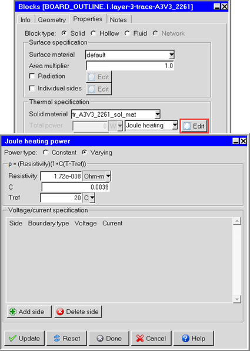

ii. Create two source objects on the BOARD_OUTLINE as shown in Figure 17.5: Source Geometry Definitions (p. 376).

**Figure 17.5: Source Geometry Definitions**

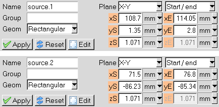

• One source is for the current source (source.1) and the other for the voltage source (source.2).

• Both sources are created at the same layer as the layer of the wire in. The area of the each source is the area to apply the voltage or the current.

• The recommendation of the source objects pair for joule heating is current-voltage pair or voltage-voltage pair.

**Figure 17.6: Source Geometry Definitions**

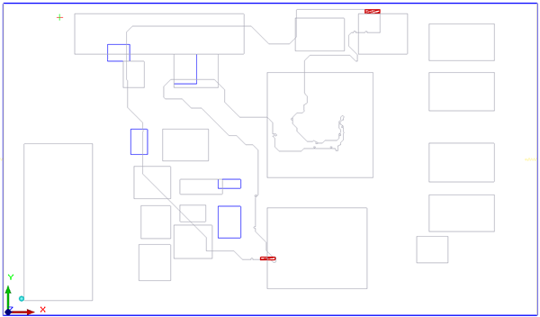

iii. Apply a current specification of 25 Amps to source.1 and a voltage specification of 0 V to

source.2 as shown in Figure 17.7: Source Geometry Definitions (p. 377). The current runs from source.1 through source.2.

**Figure 17.7: Source Geometry Definitions**

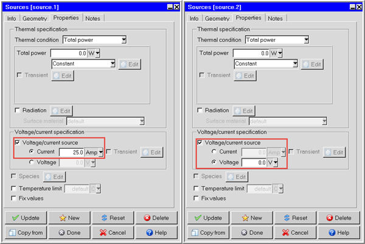

### 17.6. Step 3: Generate a Mesh

1. Create a non-conformal assembly for the trace. Since we are performing a joule heating calculation, it is necessary to have a high or medium mesh quality in case the joule heating calculation diverges. To create high quality mesh, we will create an assembly with the 3D trace geometry and set a small element size.

a. Select the BOARD_OUTLINE.1.layer-3-trace-A3V3_2261, source.1, and source.2 objects, right-click on them, and go to **Create** and then **Assembly**.

**Note:**

The mesh priority of the trace block must be greater than the mesh priority of the PCB.

b. Double-click the assembly you created to open the **Assemblies** panel.

i. In the **Meshing** tab, select **Mesh separately** and input the **Slack settings**,**Mesh type**,**Max** **element size**,**Min gap** and **Global** specifications settings as shown in Figure 17.8: Mesh Settings for the Trace Board (p. 378).

**Figure 17.8: Mesh Settings for the Trace Board**

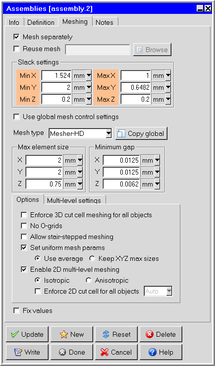

**Note:**

Ensure the **Mesh type** is **Mesher-HD**.

c. Press **Done** to close the **Assemblies** panel.

2. Go to **Model** **Generate mesh** to open the **Mesh control** panel.

a. Ensure that your settings match those in Figure 17.9: Mesh control Panel (p. 379).

**Figure 17.9: Mesh control Panel**

b. Click **Generate** to create the mesh.

c. Check the mesh quality for the trace and the overall model from the **Display** and **Quality** tabs.

### 17.7. Step 4: Physical and Numerical Settings

1. Double-click the cabinet_default_side_maxx object in the **Model manager** window to open the **Openings** panel.

a. In the **Properties** tab, ensure the **X Velocity** is **-1.5** m/s.

b. Press **Done** to close the panel.

2. Go to

**Problem setup**

**Basic parameters**.

**Note:**

Instead of accessing the

**Basic parameters** panel, you can instead use the **Problem** **setup wizard** to define your problem setup by double-clicking

**Problem setup** in the **Model manager** window. See 2.7. Step 4: Physical and Numerical Settings (p. 28) of the Finned Heat Sink tutorial for more instruction regarding the **Problem setup wizard**. You must still use the same settings described in this tutorial for the **Problem setup wizard**.

a. Since this is a forced convection problem, ensure that the **Flow** and **Temperature** check boxes and the **Turbulent** option are selected. Select **Zero equation** as the turbulence model.

b. Click **Accept** to close the panel.

3. Go to

**Solution settings**

**Basic settings**.

a. Make sure the **Convergence criteria** for **Flow** is **0.001**.

b. Set the **Number of iterations** to **200** and the **Convergence criteria** for **Energy** and **Joule**

**heating** to **1e-8**.

c. Press **Accept** to close the panel.

4. Go to

**Solution settings**

**Advanced settings**.

a. Input the following for **Temperature** in the **Linear solver** group box:

i. Choose **F** cycle from the **Type** drop-down list.

ii. Enter 1e-6 for both the **Termination criterion** and **Residual reduction tolerance**.

iii. Ensure that **BCGSTAB** is chosen as the **Stabilization** criterion for both **Temperature** and

**Joule Heating Potential**.

b. Make sure the **Precision** for the solver is **Double**.

Your settings should match those in Figure 17.10: Linear Solver Settings (p. 381).

**Figure 17.10: Linear Solver Settings**

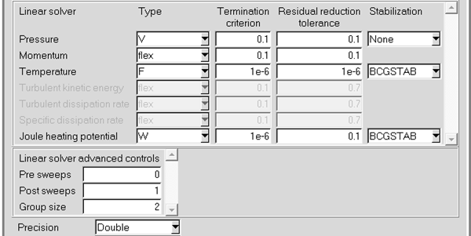

c. Press **Accept** to close the **Advanced solver setup** panel.

### 17.8. Step 5: Save the Model

Ansys Icepak will save the model for you automatically before it starts the calculation, but it is a good idea to save the model (including the mesh) yourself as well.

**File** **Save Project**

### 17.9. Step 6: Calculate a Solution

1. Click **Solve** **Run Solution**.

2. Click **Start solution**.

3. After your solution has converged, your residuals plot may look similar to Figure 17.11: Solution Residuals (p. 382).

**Figure 17.11: Solution Residuals**

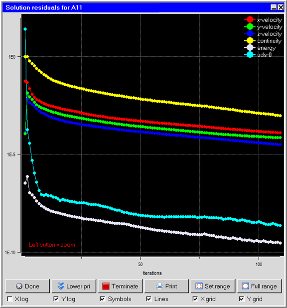

### 17.10. Step 7: Examine the Results

Once the model has converged, create an object face.

1. Double click on the object **cut.1** under post processing and click on the check box next to **Active** to deactivate it.

2. Select the trace and show the temperature contours.

a. Go to **Post** **Object face**.

b. In the **Object** drop-down list, select the trace (BOARD_OUTLINE.1.layer-3-trace-

A3V3_2261).

c. Select **Show contours** and click **Parameters**. In the **Object face contours** panel, select **Temper-** **ature** in the **Contours of** drop-down list and select **This object** next to **Calculated** in the **Color** **levels** group box. Click **Apply**.

d. Observe the trend of the temperature contour and how it varies from one side to other, and

compare the maximum temperature for the cases with and without trace modeling (Fig- ure 17.12: Trace Temperature Contours with Forced Convection (p. 384)).

**Figure 17.12: Trace Temperature Contours with Forced Convection**

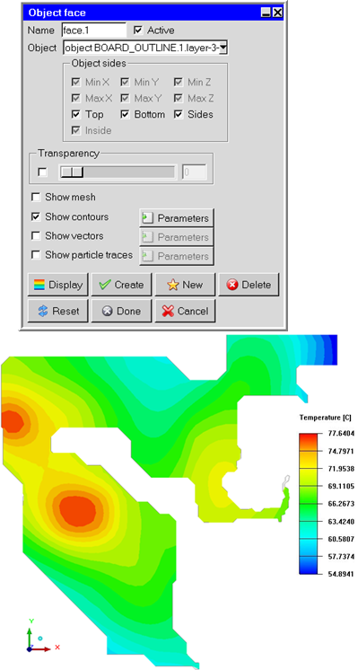

3. Now plot the electric potential of the same trace, Figure 17.13: Trace Electric Potential Contours with Forced Convection (p. 385).

**Figure 17.13: Trace Electric Potential Contours with Forced Convection**

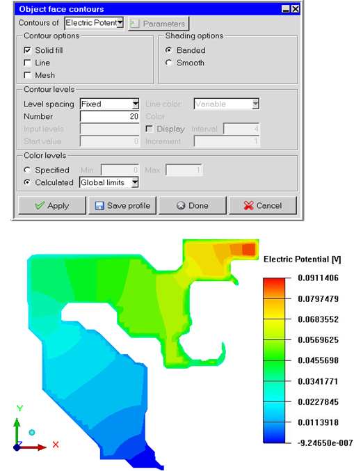

a. Click **Parameters** to open the **Object face contours** panel.

b. Select **Electric Potential** from the **Contours of** drop-down list and press **Apply**.

c. Observe the contours.

• Do you observe any similarity between the temperature and the electric potential contours?

• The temperature contours are closely related to the electric potential contours, which is a direct result of Joule heating of the trace.

d. Press **Done** in the **Object face contours** and **Object face** panels to close the panels.

### 17.11. Step 8: Summary

In the previous tutorial, Trace Layer Import for Printed Circuit Boards (p. 347), you learned how to import trace layers for a PCB and how to model them with various degrees of accuracy and detail. In this tu- torial, you have learned how to filter traces by their geometry and to model the Joule heating or resistive heating of desired traces in Ansys Icepak. This method allows you to determine an accurate prediction of the temperature distribution in a PCB.

We repeat some of the best practices found in this tutorial for your convenience:

• Filter out traces too small to be thermally significant. This can reduce unnecessary meshing and computational time.

• Check for current conservation manually.

• Use the hex-dominant mesher when you are using imported trace data.

---

## Chapter 18: Microelectronics Packages - Compact models

### 18.1. Introduction

This tutorial is a case study of a board design. A card supplier is making two package type changes to an existing commercial board. The objective of the thermal simulation project is to see if the selected new packages are likely to function without overheating. In the event of over heating, what kind of thermal management should be recommended?

In this tutorial, you will learn how to:

• Perform a board level simulation with appropriate package models.

• Determine if the selected new packages can function without overheating.

**Note:**

Mesh counts and solution results may differ slightly due to enhancements to the meshing algorithm and Fluent solver, respectively.

### 18.2. Prerequisites

This tutorial assumes that you have worked on Sample Session in the Icepak User’s Guide and the first two Ansys Icepak tutorials of this guide.

### 18.3. Problem Description

A designer is to select packages for a new design at the drawing board level. Available information about the board and packages is given. Determine cooling solutions in the event there is overheating.

**Figure 18.1: Problem Specification**

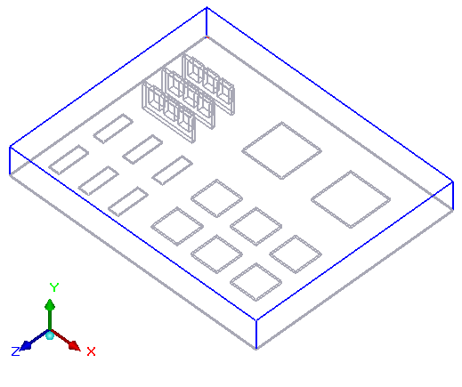

### 18.4. Step 1: Create a New Project

1. Set up a working directory on the computer you will be using.

2. Download the compact_package.zip file here.

3. Unzip the compact_package.zip file you have downloaded to your working directory.

4. Copy the file compact-package-modeling.tzr to your working directory.

5. Start Ansys Icepak, as described in Starting Ansys Icepak in the Icepak User’s Guide.

6. Click **Unpack** in the **Welcome to Icepak** panel.

7. In the **File selection** panel, select the packed project file compact-package-modeling.tzr and click **Open**.

8. In the **Location for the unpacked project** file selection dialog, select a directory where you would like to place the packed project file, enter a project name, such as test-1, in the **New project** text field then click **Unpack**.

### 18.5. Step 2: Build the Model

This tutorial uses an existing model. Ansys Icepak will display the model in the graphics window as shown in Figure 18.2: Layout of the board to be analyzed (p. 389). Available information about the board and packages is shown in Table 18.1: Available Details for Objects in the Model (p. 389) and Table 18.2: Available Information for 400 PBGA (p. 390). During the procedure, you will use these tables to edit existing objects and as well as to create new objects.

**Figure 18.2: Layout of the board to be analyzed**

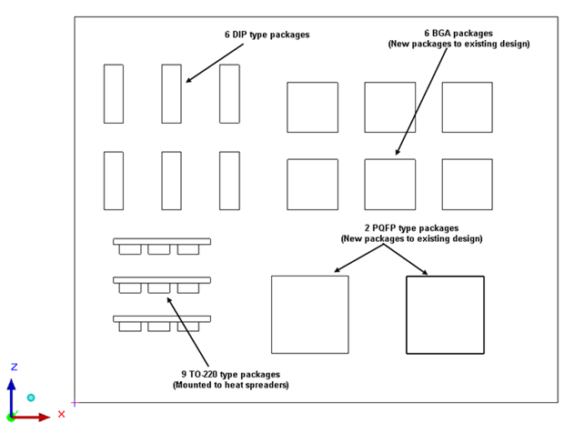

**Table 18.1: Available Details for Objects in the Model**

| Object | Number of Occurrences in Model | Available Information | Power (W) |
| --- | --- | --- | --- |
| PCB | 1 | 1.6 mm thick, FR4 Material, six 1 oz. layers of Copper, 30% coverage for all layers | 0 |
| Heat Spreader for TO-220 packages | 3 | Al-Extruded | 0 |
| TO-220 Packages | 9 | = 2.5° C/W | 1.5 |
| DIP | 6 | None | 0.5 |
| 400 PBGA (new package type to the existing board) | 6 | See Table 18.2: Available Information for 400 PBGA (p. 390) | 2.0 |

| Object | Number of Occurrences in Model | Available Information | Power (W) |
| --- | --- | --- | --- |
| 232 PQFP (new package type to the existing board) | 2 | 232 leads, 40 mm X 40 mm Footprint, 2 mm height | 3.5 |

**Note:**

An ounce of Copper is actually the thickness of 1 ounce/sq.ft of plane copper sheet. Using copper density this translates to a thickness of 0.035 mm.

**Table 18.2: Available Information for 400 PBGA**

| Feature | Size (mm) | Material/Conductivity (W/mK) | Other info | Where to input this info |
| --- | --- | --- | --- | --- |
| Overall package | 26 x 26 x 2.15 |  |  | Dimensions tab |
| Mold compound |  | 0.8 |  | Die/Mold tab |
| Die | 18 x 18 x 0.4 | Silicon material |  | Die/Mold tab |
| Die Flag | 18 x 18 x 0.035 (equivalent) | 80.0 (effective) |  | Die/Mold tab |
| Die Attach | 0.05 mm thick | Not mentioned |  | Die/Mold tab |
| Substrate | 0.4 mm thick | FR4 |  | Substrate tab |
| Substrate traces | 0.035 mm thick | Copper | 4 layers, top and bottom 30% coverage intermediate layers are 100% (plane layers) | Substrate tab |
| Vias | Unknown | Not mentioned | Number of vias unknown | Substrate tab (use 0 for vias) |
| Solder Balls | Standard | Solder | 20 x 20 count, full array | Solder tab |
| Wire Bonds | Not mentioned | Usually Gold |  | Die/Mold tab |

1. Create the PCB.

Create a PCB object by clicking the **Create printed circuit boards** button (

). Then edit the PCB by clicking the **Edit object** button (

) while the PCB object is selected in the **Model manager** window. Enter the following in the **Geometry** tab:

| Object type | Name | Shape/Type/Plane | Global Coordinates (m) XS— YS— ZS— XE— YE— ZE |
| --- | --- | --- | --- |
| PCB | pcb.1 | X-Z | 0.0 — 0.0 — 0.0— 0.25— N/A— 0.2 |

a. Go to the **Properties** tab. Enter the **PCB thickness** of **1.6** mm for **Substrate thickness**.

b. Change the default unit from **microns** to **Cu-oz/ft2** for high and low surface thickness and for

internal layer thickness under the **Trace layer parameters** group box.

2. Enter the material information for the PCB found in Table 18.1: Available Details for Objects in the Model (p. 389). This information can be entered for the selected PCB object as shown in Fig- ure 18.3: PCB Edit Form with input based on PCB information in the Table with Model Object Details above (p. 391).

**Figure 18.3: PCB Edit Form with input based on PCB information in the Table with Model** **Object Details above**

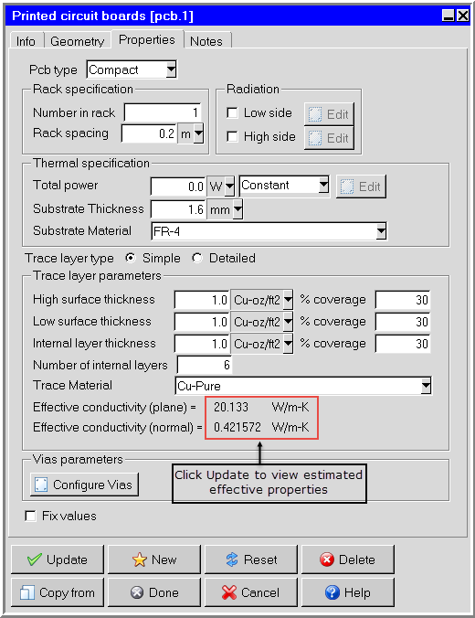

Now, you should see the PCB object overlapping the block called PCB. There is no more need for this block.

**Note:**

You recreated the PCB object geometry using coordinates of the imported PCB block.

3. Right-click the *block* named PCB and deselect **Active** to deactivate the block object.

4. Verify the material properties of the heat spreaders for the TO-220 devices.

a. Since the default solid material happens to be **Al-Extruded**, all three spreaders should have come into the model with the correct material specifications. Check this information by editing the spreaders.

5. Model the packages.

This model has four different types of objects. Based on the available information and our objectives, we shall use different compact package modeling capabilities in Ansys Icepak.

a. TO-220 type packages

i. There are 9 TO-220 device blocks. Select them all at once by drawing a selection box around them with **Shift** and the left mouse button (see Figure 18.4: Window Selecting Multiple Objects for Simultaneous Edit (p. 393)). Press **Shift**+**y** to get a positive Y orientated view as in the figure. Simultaneous selection can also be done in the **Model manager** window. Press the **Ctrl** key and click to select several objects.

**Figure 18.4: Window Selecting Multiple Objects for Simultaneous Edit**

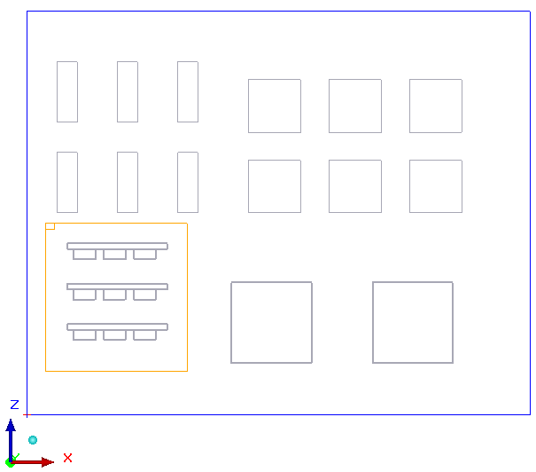

ii. You should see all **TO-220** devices highlighted in the **Model manager** window. Note that only **TO-220** objects should be selected. If you see other objects highlighted (such as the **Spreader** objects), deselect them by holding down the **Ctrl** key and clicking them in the **Model manager** window. You can simultaneously edit all of the remaining objects at once by right-clicking on any one of the selected **TO-220** objects in the **Model manager** window.

**Caution:**

You will not be able to edit the objects simultaneously if you still have the spreaders selected.

A. Select **Network** for the **Block type**.

B. Keep the default selection of **Two resistor** for the **Network type**.

C. In order to assign the resistance, you need to identify a reference side. This is the purpose

of the "board side" input. You want the resistance to be applied from the junction to the side in contact with the spreader (Max Z side). You can accomplish this in two ways:

• Designate **Min Z** as the **Board side** and assign the supplier provided resistance value (**2.5** C/W from Table 18.1: Available Details for Objects in the Model (p. 389)) to **Rjc**.

*or*

• Designate **Max Z** as the **Board side** and assign the supplier provided resistance value to **Rjb**.

**Note:**

Zero resistance means that there would not be any link and the resistance values are infinite. For more information regarding the two-resistor model, refer to Two-Resistor Model in the Icepak User’s Guide.

D. Input **1.5** W for the **Junction power**.

**Figure 18.5: TO-220 Properties Tab**

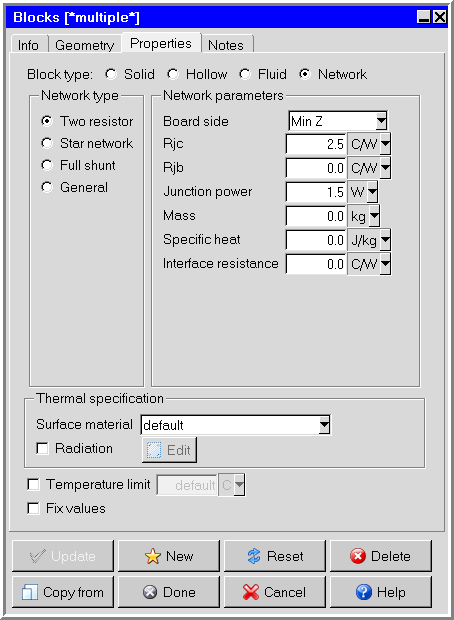

iii. Click **Done** to finish the operation.

b. DIP type packages

i. As you have done previously for the **TO_220** objects, select all the **DIP** objects and simultan- eously edit them.

ii. Select **default** for **Solid material** (however, any material would work because you are not interested in the temperature of the DIP packages).

A. Input **0.5** W in the **Total Power** field.

B. Click **Done**.

**Note:**

DIP is the package type for which you have the least information. So you are left with two options:

• Try to get additional information from the supplier.

*or*

• Perform a tentative simulation with the available information. The options are considered along with the following facts:

– The DIPs contribute a lower heat flux than the other components in the

board.

– This is an existing design in which the DIPs have been known to run well

below their specified temperature even at max power.

Based on the above reasoning, it is easier to perform a tentative simulation with the available power information than to obtain additional information from the supplier. In this context the purpose of the **DIP** package modeling is to appropriately account for air and PCB heating due to flow over the DIPs. Accurate prediction of the DIP-package temperature is therefore not an object- ive.

c. PQFP type packages

Internal details are unavailable for the **PQFP** type package. But based on the exterior details such as lead count, foot print size, and package height information, it is possible to construct a compact model of a typical package for screening analysis.

i. Go to the **Libraries** node by clicking the **Library** tab in the **Model manager** window. Right- click **Libraries** and select **Search packages**.

**Note:**

A package may also be created using either IC package macros or a package object.

ii. In the **Search package library** panel enter all known information about the package (Table 18.1: Available Details for Objects in the Model (p. 389)) as the search criteria. Clicking

the **Search** button should return [1] the closest matching packages from the library. Pick the package that is most similar in description to the 232-lead PQFP information available and select **Create**. Figure 18.6: Package Search Criteria (p. 396) depicts the package search settings and results.

**Figure 18.6: Package Search Criteria**

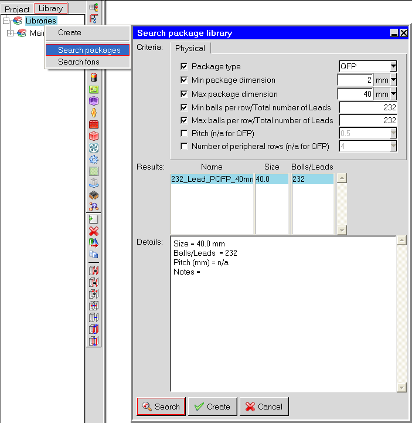

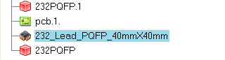

If search does not return a relevant package, click the package object icon to create a new package object. After entering the few known values, you may enter reasonable values or leave the remaining parameters as default.

[1]

iii. Go back to the **Project** tab and edit the newly created package object. Make sure that:

• The **Package type** is **QFP**.

• The **Package thickness** is 2.0 mm.

• The **Model type** is **Compact Conduction Model (CCM)**.

• The **Symmetry** is **Full**.

**Note:**

CCM is a compact model based on geometric simplifications that still preserve the

original heat transfer pathways of the package. It has been demonstrated [2] that CCM is fairly accurate and boundary condition independent. Other options under **Model type** are:

• To model the package in full detail. This option is meant for package level modeling. Using this in board or system design will create many more objects requiring meshing and thus increase the mesh size.

• To characterize junction-to-case and junction-to-board network resistances for a two resistance compact model. We have used this for the PBGA package.

iv. Select the **Die/Mold** tab. (The **Substrate** and **Solder** tabs show blank interface since QFP

type packages do not have soldering or substrates.) Enter **3.5** W for **Total power**.

v. Use all other defaults under the **Die/Mold** tab. Click **Done** to close the tab.

vi. The package created is in an arbitrary location. You may use the **Align face centers** button

(

) to position the base center of the created package object with that of the **232PQFP** block. The dimensions of the package should match the dimensions of the **232PQFP** block (select the block to see its dimensions):

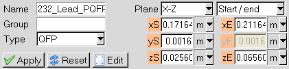

vii. Since there is no more need for the **232PQFP** block, deactivate it.

viii.There is another 232PQFP block (**232PQFP.1**). Create a copy of the first package object and

align it with the remaining 232PQFP block. Note that this second package is offset from the first in only the X direction by **–70** mm. Deactivate the second "232PQFP" block (**232PQFP.1**). The dimensions of the second package should be:

Karimanal, K.V. and Refai-Ahmed, G., "Validation of Compact Conduction Models of BGA Under An Expanded Boundary Condition Set", Proceedings of the ITHERM 2002, May 2002, San Diego, Ca, USA.

[2]

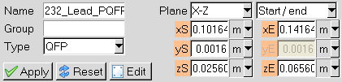

d. PBGA type packages

You have fairly comprehensive information about the PBGA type package from the supplier (see Table 18.2: Available Information for 400 PBGA (p. 390)). Using this information you can construct a CCM or characterize to determine Θjc and Θjb to model it as a two-resistor network model as shown here:

i. Select all the blocks named 400-PBGA and edit all of them simultaneously.

A. Select **Network** as the **Block type** and **Two resistor** as the **Network type**.

B. Set the **board side** as **Min Y**.

C. Input the estimated Θjc (1.4 C/W) and Θjb (6.75 C/W) values in the **Rjc** and **Rjb** fields

respectively.

D. Input a **Junction power** of 2.0 W.

E. Click **Done** to finish.

ii. Edit the **Cabinet**. In the **Properties** tab, you have the option to define the boundary condition (**Wall type**) for each side of the cabinet. Set the **Wall type** for **Min x** and **Max x** as **Opening**.

iii. Press **Edit** for the **Min x** side to open the **Openings** panel.

iv. In the **Properties** tab of the **Openings** panel, assign an **X velocity** of **1.0** m/s.

v. Click **Done** to close the **Openings** panel.

vi. The **Max x** side opening should have the default settings (free opening).

vii. All other cabinet boundaries should be **Default**.

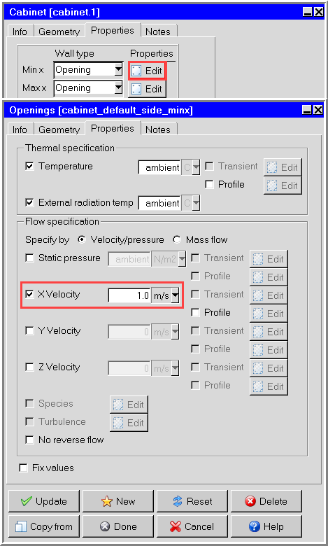

viii.Click **Done** in the **Cabinet** panel to confirm changes.

ix. You should see the openings on the min X and max X sides of the cabinet.

### 18.6. Step 3: Generate a Mesh

1. Click the mesh icon

.

a. Make sure **Mesher-HD** is selected as the **Mesh type** and **Normal** is selected for **Mesh** **parameters**.

b. Click **Generate** to create the mesh.

**Figure 18.7: Mesh control panel**

c. Evaluate your mesh from the **Display** and **Quality** tabs.

2. (*optional*) Create non-conformal assemblies around each package set to reduce mesh bleeding and consequently reduce the mesh count. As a start, use **3** mm slack values for all sides of each assembly. Resize the assemblies if necessary. With non-conformal assemblies, you can reduce the number of elements in the mesh significantly. Display and compare the conformal and non-conformal meshes.

### 18.7. Step 4: Physical and Numerical Settings

1. Go to

**Basic parameters** and set the **Flow regime** to **Turbulent** in the **General setup** tab.

**Problem setup**

Click **Accept** to close the panel.

2. Go to

**Basic settings** panel and click **Reset**. Set the number of iterations to **200** in the **Basic settings** panel and close the panel by clicking **Accept**.

**Solution settings**

### 18.8. Step 5: Save the Model

Save the model after the model building and meshing is complete.

**File** **Save project**

### 18.9. Step 6: Calculate a Solution

1. Define monitor points of temperature for the **232-Lead_PQFP_40mmX40mm** package and **DIP** object. A monitor point will be created to monitor the temperature change with iterations (Fig- ure 18.8: Monitor Point Definition (p. 402)).

**Figure 18.8: Monitor Point Definition**

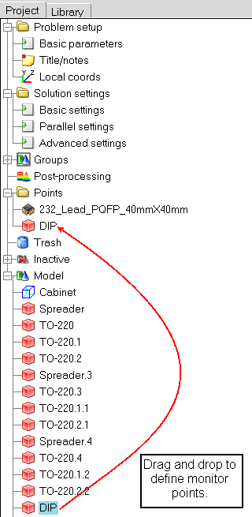

2. Go to **Solve** **Run solution** and select **Sequential solution of flow and energy equations**. Since you have neglected gravity, there is no coupling between the flow and energy equations. Therefore, sequential solution of the flow and energy equations is possible to speed up the convergence rate.

**Figure 18.9: Solve panel**

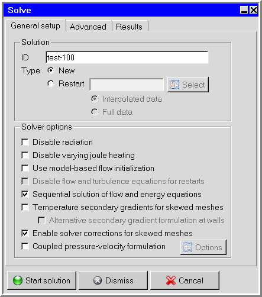

3. Click **Start solution**.

### 18.10. Step 7: Examine the Results

First observe the general temperature distribution pattern on the board.

1. Create temperature contours of **pcb.1** by clicking the **Object face** icon (

), selecting **Show contours**, clicking **Parameters**, and selecting **This object** for the **Calculated** drop-down list. Figure 18.10: Tem- perature Contours on pcb.1 (p. 404) depicts the object face you have just created.

**Figure 18.10: Temperature Contours on pcb.1**

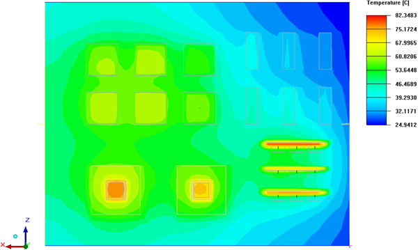

• Probe temperatures values at desired locations on the object face by using the **Surface probe**

feature (

).

• Note the higher temperatures in the parts of the PCB under the **PQFP** packages.

2. Go to **Report** **Network block values**. The text window lists all the network block temperatures. Network junction temperatures can also be obtained from the overview report.

3. The closeness of the **PBGA** objects relative to each other may be a potential cause for overheating. How much of the problem is due to the ambient temperature of the air flowing past these compon- ents?

• You can visualize the thermal boundary layer over the **PBGA** objects by taking an X-Y plane cut of temperature contours over the **PBGA** blocks (Figure 18.11: Temperature Contour Plane Cut (Z plane through center) (p. 405)). Note the higher temperatures in the wake region of the right-most block.

**Figure 18.11: Temperature Contour Plane Cut (Z plane through center)**

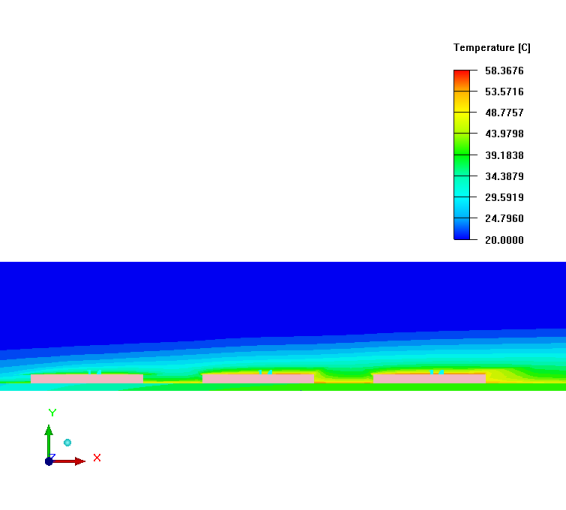

4. What is the cause for the relatively high temperatures of the **TO-220** devices?

• Are the heat spreaders too close? If so, the air flowing between the spreaders will overheat pre- venting further heat dissipation to the air. You can find out if this is the case by creating XZ cut planes of vectors and contours that cut across the spreader blocks. In Figure 18.12: Temperature Contour Plane Cut (Y plane through center) (p. 406), the boundary layers of the spreaders do not interfere with each other significantly. Therefore, their arrangement relative to each other is not problematic thermally.

**Figure 18.12: Temperature Contour Plane Cut (Y plane through center)**

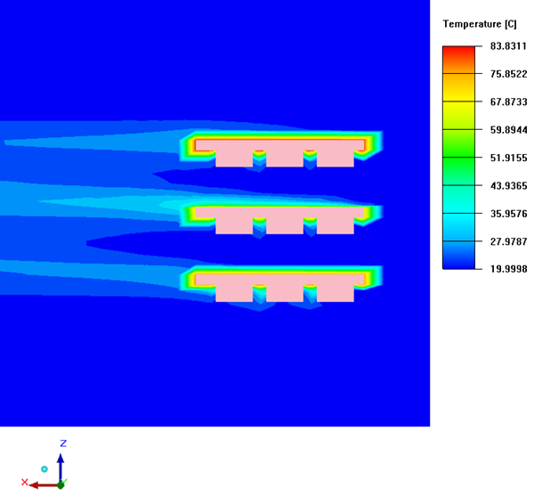

5. The highest temperatures are in the **400-PBGA** blocks. Effective cooling solutions can be designed by understanding heat flow pathways.

• Generate a summary report of heat flow for the **400-PBGA** blocks. By deselecting the check box under **Comb** in the **Define summary report** panel, generate an itemization of the heat flow through each side of the object. Figure 18.13: Summary Report for Object 400-PBGA (p. 407) shows the resulting summary report.

**Figure 18.13: Summary Report for Object 400-PBGA**

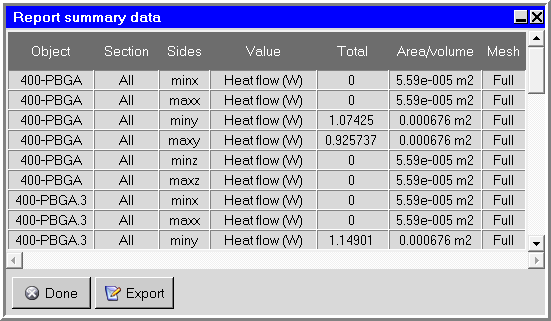

### 18.11. Step 8: Summary

In this tutorial, you performed a board level simulation and determined cooling solutions in the event there is overheating. In addition, you learned how to specify properties of PCBs, packages, and network blocks to model your system more accurately than possible with only block objects.

### 18.12. Step 9: Additional Exercise

Post-processing showed that the components of **400-PBGA** are the most critical objects since they are the hottest. Here are some cooling ideas to set up and perform Ansys Icepak simulations:

What if:

1. The flow is in the negative X direction?

2. The flow is in the negative X direction, and by judicious use of flow resistances, more flow is diverted toward the PBGA objects (for the same overall flow rate)?

3. The bottom side of the PCB is not dissipating any heat as a result of lying on a domain boundary. On the other hand, there seems to be plenty of space above the board. The main reason for the headroom above the PCB is the height of the spreader blocks. While there is room to move up the spreader by a little bit, more room can be gained if the spreader is longer in the X direction but shorter in its Y height. What if both sides of the PCB are exposed to airflow by moving the PCB up- ward?

4. A heatsink is mounted on the PBGA blocks? Will it be possible to use a heatsink in contact with all PBGA blocks? Are there any practical issues?

---

## Chapter 19: Multi-Level Meshing

### 19.1. Objective

The objective of this exercise is to use multi-level meshing to improve the mesh resolution and optimize the mesh count of a model that has CAD objects. The procedure from this exercise should help you make adequate modeling and meshing decisions during your thermal modeling projects.

**Note:**

Mesh counts and solution results may differ slightly due to enhancements to the meshing algorithm and Fluent solver, respectively.

### 19.2. Prerequisites

The trainee should be familiar with:

• Ansys Icepak modeling objects

• Basics of meshing

• Non-conformal meshing

### 19.3. Skills Covered

• Basic meshing techniques

• Non-conformal meshing

• Multi-level meshing

• Uniform mesh parameters option

### 19.4. Loading the Model

1. Set up a working directory on the computer you will be using.

2. Download the hanging_node.zip file here.

3. Unzip the hanging_node.zip file you have downloaded to your working directory.

4. Unpack and load the model named HangingNode.tzr.

5. Go to **File** **Save project as**.

• Rename the project to any name of your choice.

### 19.5. Step-by-Step Approach

Without any modifications, the model results in about 700,000 elements. Note that this mesh count results from using the non-conformal meshing technique, which reduces mesh bleeding and mesh count. However, this mesh does not fully resolve the fine-level geometric features of the CAD objects. You can reduce the mesh count and improve the mesh resolution on and around the CAD objects by using the multi-level meshing technique. This procedure starts with a coarse background mesh and resolves fine level features through a series of successive mesh refinements. By using multi-level meshing and the uniform mesh parameters feature, you can reduce the mesh count to approximately 500,000 elements and improve mesh resolution.

**Note:**

Multi-level meshing allows for gradually increasing resolution of fine-level features. For more information on multi-level meshing, see Meshing Options of the Icepak User’s Guide.

• Generate the mesh without modifying the model. You will see a mesh count of about 700,000 cells.

**Note:**

The mesh count may differ slightly on different machines.

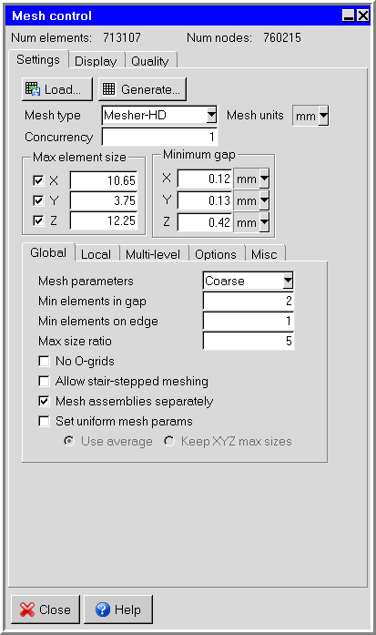

**Figure 19.1: Mesh of Flow Guide Without Multi-Level Meshing**

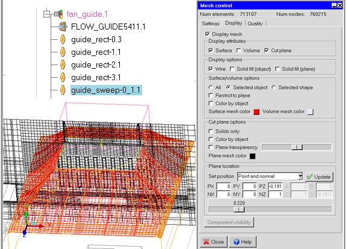

**Figure 19.2: Mesh of Sheetmetal_HS Without Multi-Level Meshing**

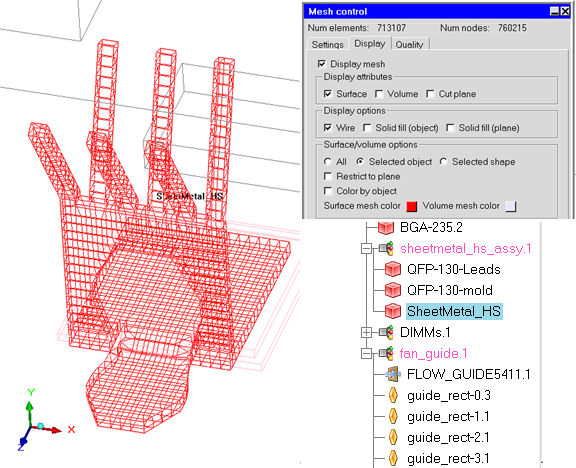

### 19.6. Modification 1: Multi-Level Meshing of the Fan_Guide

• In the **Meshing** tab of the fan_guide.1 assembly, retain the slack and minimum gap values. However, change the **Max element size** values to **4.0** mm.

• In the **Options** tab, select **Set uniform mesh params** and retain the selection of **Use average**.

• In the **Multi-level** tab, select **Allow multi-level meshing** and set **Max Levels** to **0**. Click **Edit levels** to open the **Multi-level meshing max levels** panel, and enter a value of 2 for FLOW_GUIDE5411.1 and guide_rect-0.3.

• Keep the default selection of **Proximity size function** and **Curvature size function**.

**Note:**

For more information on various multi-level meshing options, see Global Refinement for a Hex-Dominant Mesh of the Icepak User’s Guide.

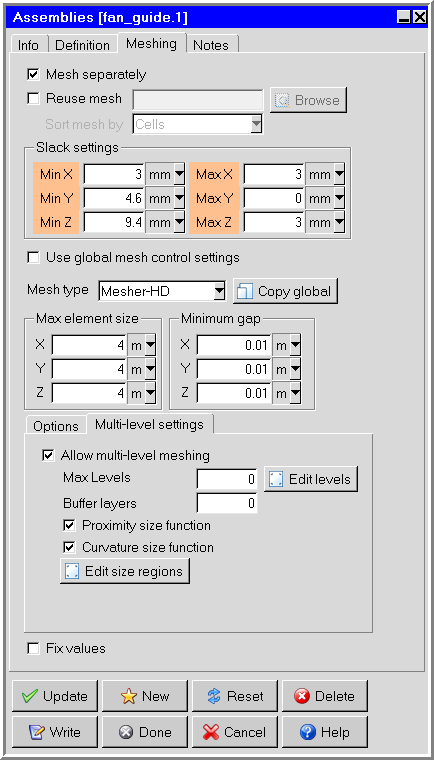

### 19.7. Modification 2: Multi-Level Mesh of the Sheetmetal_hs_assy.1

• In the **Meshing** tab of the Sheetmetal_hs_assy.1, retain the slack and minimum gap values. However, change the **Max element size** values to **3.5** mm.

• Select **Set uniform mesh params** and retain the selection of **Use average**.

• In the **Multi-level** tab, toggle **Allow multi-level meshing**, set **Max Levels** as **3**, and set **Buffer layers** to **1**.

• Keep the default selection of **Proximity size function** and **Curvature size function**.

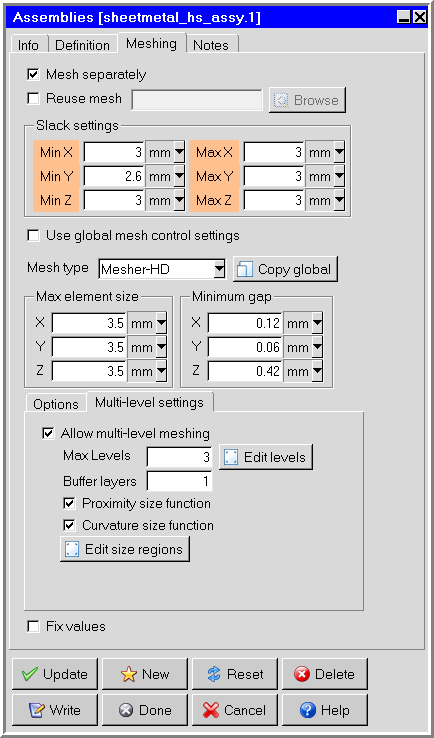

### 19.8. Generate a Mesh

• Generate a mesh with the modifications using the same settings as before.

• Observe the decrease in the number of mesh elements in the **Mesh control** panel.

• Display a cut plane of the mesh to examine the multi-level meshing around the fan guide.

Figure 19.3: Meshing Levels of the Fan Guide Objects (p. 417) shows a cut plane of the mesh through the fan guide. Observe the various levels of meshing starting from level 0 and refining to level 2 near the object interfaces.

**Figure 19.3: Meshing Levels of the Fan Guide Objects**

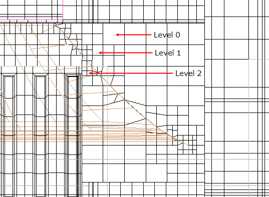

• Display the mesh of the plate object guide_sweep-0_1.1 and the block object SheetMetal_HS.

Figure 19.4: Surface Mesh of guide_sweep-0_1.1 (p. 418) shows the surface mesh on the flow guide for the plate object guide_sweep-0_1.1. Fine mesh resolution in some regions is necessary for a body fitted mesh. This can be clearly seen in the figure.

Figure 19.5: Surface Mesh of SheetMetal_HS (p. 419) shows the mesh on and around the sheet metal heatsink. It can be seen that the mesh resolution is fine in the fin region and coarser as we move away from the heatsink.

**Figure 19.4: Surface Mesh of guide_sweep-0_1.1**

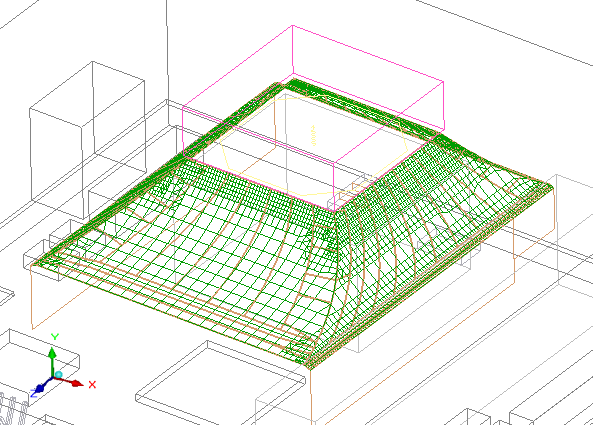

**Figure 19.5: Surface Mesh of SheetMetal_HS**

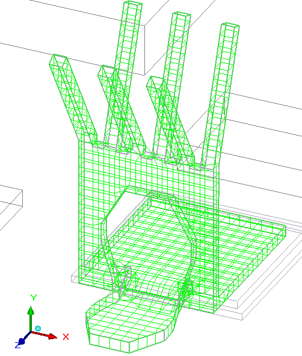

### 19.9. Conclusion

Using multi-level meshing, we were able to improve the mesh resolution and instantly transition to coarser meshes thus reducing the overall mesh count. Hence, this approach significantly reduces run time while enhancing the accuracy of the simulation.

In addition, we repeat here some of the tips found in this tutorial for your convenience:

• Use multi-level meshing for CAD objects.

– Set the level of each object by right-clicking it in the **Model manager** window. Manually specified

objects can have more levels than the maximum number of levels specified.

– Select multiple objects that require the same number of levels to set them simultaneously in the

**Model manager** window.

– Specify the max element size in each of the principal directions to achieve the desired resolution.

→For example, if you require a resolution of 1 mm and are using 2 levels, then your max element

size should be:

• Avoid applying multi-level meshing to the entire model by using non-conformal assemblies and then activating multi-level meshing in their individual **Assemblies** object edit panel (under the **Meshing** tab).

---

## Chapter 20: Characterizing a BGA-package by Utilizing ECAD Files

### 20.1. Introduction

In Tutorials Trace Layer Import for Printed Circuit Boards (p. 347) and Joule/Trace Heating (p. 369) you learned how to import trace layouts for a PCB. In this tutorial, you will learn how to import trace layouts on a BGA package substrate by using BOOL files.

In this tutorial, you will learn how to:

• Import trace layout of a BGA package substrate in BOOL format.

• Display traces using the **Color by trace** option.

• Plot temperature contours on the wirebonds.

• Determine junction-to-case resistance for the package.

**Note:**

Mesh counts and solution results may differ slightly due to enhancements to the meshing algorithm and Fluent solver, respectively.

### 20.2. Prerequisites

You should be familiar with the menu structure in Ansys Icepak and should have solved or read the tutorial Finned Heat Sink (p. 5) of this guide. Many basic steps found in the introductory tutorials will not be mentioned here.

### 20.3. Problem Description

In this tutorial, you will see how to determine temperature profiles on the wirebonds of a BGA package and junction-to-case resistance.

### 20.4. Step 1: Create a New Project

1. Start Ansys Icepak, as described in Starting Ansys Icepak in the Icepak User’s Guide.

2. Click **New** in the **Welcome to Icepak** panel to start a new Ansys Icepak project.

3. Specify a name for your project, such as **BGA-package**, and then click **Create**.

### 20.5. Step 2: Build the Model

To build the model, you will change the units, create the PCB, import the traces and resize the cabinet to its proper size. Then you will create a wall object.

1. Change the default unit of length to millimeter.

**Edit** **Preferences**

a. In the **Preferences** panel, click **Units**, under the **Defaults** node. In the **Category** box, scroll down and select **Length**, and under **Units**, select **mm**.

b. Click **Set as default**,**Set all to defaults**, and then **This project**.

2. Create the package object.

a. Click the packages object button (

) in the objects toolbar.

b. In the **Packages** panel, click the **Dimensions** tab and select **ASCII Neutral BOOL+INFO** from

the **Import ECAD file** drop-down list.

**Figure 20.1: The Packages Panel (Dimensions Tab)**

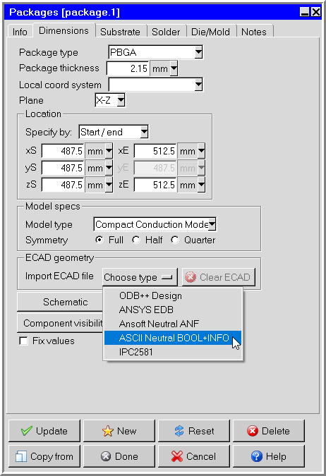

c. Select block_1.bool in the **Bool file** panel and click **Open**.

**Note:**

block_1.bool can be found on the ANSYS Help Site. The procedure to download the file is described below.

1. Set up a working directory on the computer you will be using.

2. Download the bga_package.zip file here.

3. Unzip the bga_package.zip file you have downloaded to your working dir- ectory.

d. Keep the settings for the layers and vias as they are and click **Update** and **Done** in the **Board**

**layer and via information** panel.

e. Click the **Die/Mold** tab and assign a die **Power** of 0.5 W.

f. Click **Done**.

**Note:**

If the **Objects outside** panel is displayed, click the **Resize Cabinet** button.

g. Click the **Cabinet** in the object tree and click the **Autoscale** button located in the edit window

in the lower right corner of the main menu.

**Note:**

Click the **Scale to fit** icon (

) to refocus your model.

h. If the graphics window does not already display the traces by color, right-click the package object

in the object tree, choose **Traces** **Color by trace** to display the traces.

**Figure 20.2: Display of Traces**

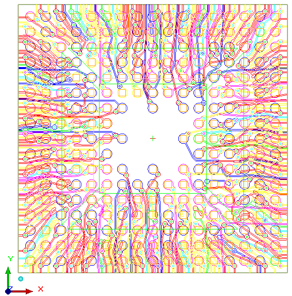

As can be seen in Figure 20.2: Display of Traces (p. 425), the wirebonds are lumped into polygonal plates by Ansys Icepak.

i. Change the cabinet **zS** to **-1.2** mm. If the **Objects outside** panel appears, click **Move** so that the package is fully inside the cabinet.

j. Create a PCB object and input the following in the **Geometry** tab:

| Plane | X-Y | Specify by | Start / end |
| --- | --- | --- | --- |
| xS | -7.03 mm | xE | 7.03 mm |
| yS | -7.03 mm | yE | 7.03 mm |
| zS | -1.2 mm | zE | — |

**Note:**

If the **Objects outside** panel appears again, select **Allow out** to ignore the error. You will fix the cabinet size later.

k. In the **Properties** tab, set the substrate thickness as **0.8** mm and then enter the following percent coverage of copper for the layers:

**Figure 20.3: Properties Tab of the Printed Circuit Boards Panel**

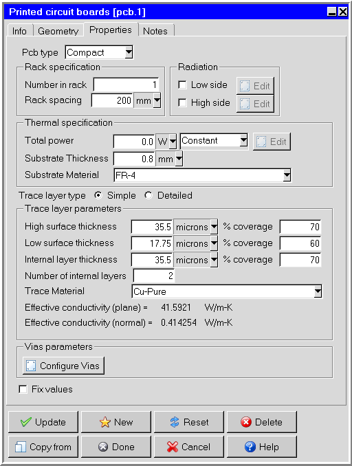

l. Click **Update**. Note that Ansys Icepak updates the thermal conductivity information, plane and normal, for the PCB object.

m. Press **Done** to close the panel.

n. Create a wall object with zero thickness in the Z direction. Name it **Bottom**. Enter the same di-

mensions for the wall object as you did for the PCB object created previously as shown in Fig- ure 20.4: Geometry Window for Object Bottom (p. 427).

**Figure 20.4: Geometry Window for Object Bottom**

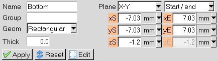

o. **Edit** the wall object and insulate it by keeping the heat flux as **0.0** in the **Properties** tab.

p. Make a copy of the wall and translate it in the Z direction by **2.95** mm and rename the new

wall to **Top**.

• Select the object **Cabinet** in the **Model manager** window and then click **Autoscale** in the geometry window so that all of the other objects are inside the cabinet.

We would like to specify the heat transfer coefficient on the top surface using the well-known

correlation in the literature, (Incropera et. al [1]). In order to do that, you can follow the procedure in Figure 20.5: Specifying the Heat Transfer Coefficient on the Top Wall (p. 428).

Frank Incropera and David DeWitt,*Fundamentals of Heat and Mass Transfer*, John Wiley & Sons, Inc., New York, 1981.

[1]

**Figure 20.5: Specifying the Heat Transfer Coefficient on the Top Wall**

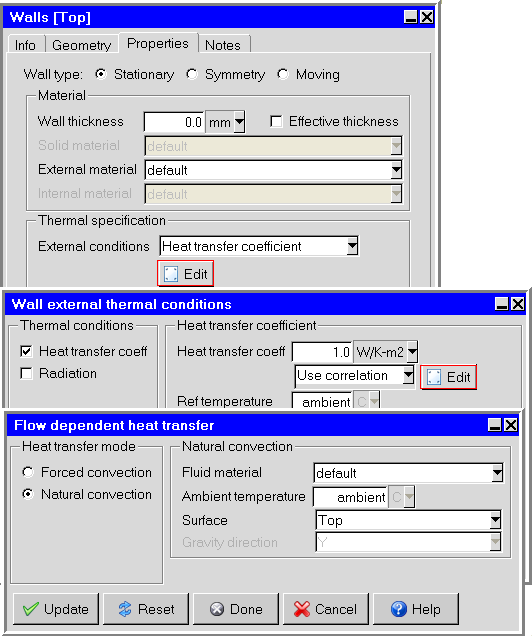

### 20.6. Step 3: Generate a Mesh

1. Click the **Generate mesh** button (

).

2. In the **Mesh control** panel (Figure 20.6: Mesh control Panel (p. 429)), enter **0.5** mm,**0.5** mm, and **0.14** mm for the **Max element size** for **X**,**Y**, and **Z**, respectively. Change the **Minimum gap** values

to **0.05** mm,**0.05** mm, and **0.01** mm for **X**,**Y**, and **Z**, respectively. In the **Misc** tab, deselect **Allow** **minimum gap changes**.

**Note:**

Ensure that **Mesh type** is **Mesher-HD**.

3. Click **Generate** and click **Change value and mesh** in the **Minimum separation** panels that appear.

**Figure 20.6: Mesh control Panel**

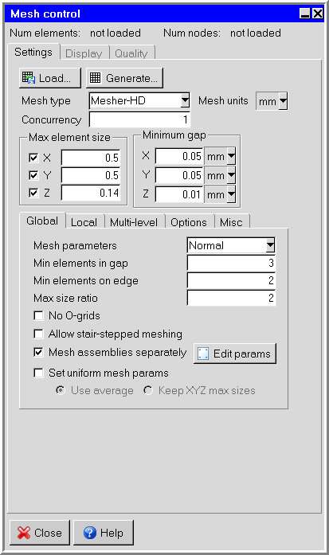

4. Click **Close** to close the panel once you have created the mesh.

### 20.7. Step 4: Physical and Numerical Settings

**Note:**

Instead of accessing the

**Basic parameters** panel, you can instead use the **Problem setup** **wizard** to define your problem setup by double-clicking

**Problem setup** in the **Model** **manager** window. See Physical and Numerical Settings of the Finned Heat Sink tutorial for more instruction regarding the **Problem setup wizard**. You must still use the same settings described in this tutorial for the **Problem setup wizard**.

1. Go to

**Problem setup**

**Basic parameters**.

a. Deselect **Flow (velocity/pressure)** in the **General setup** tab.

b. Select **Off** in the **Radiation** group box and then click **Accept** to close the panel.

**Note:**

Neglecting flow and radiation means that this is a pure conduction problem.

2. Go to

**Solution settings**

**Basic settings**.

a. Change the **Number of iterations** to 25 and the **Convergence criteria** for **Energy** to **1e-15**.

**Note:**

The absence of flow equations means the problem requires very few iterations to converge. Since Ansys Icepak is only solving for the energy equation, you require a very stringent convergence criterion for the energy residual.

b. Click **Accept** to close the panel.

3. Go to

**Solution settings**

**Advanced settings**.

a. Input the following for **Temperature** in the **Linear solver** group box:

i. Choose **F** from the **Type** drop-down list.

ii. Enter 1e-6 for both the **Termination criterion** and **Residual reduction tolerance**.

**Note:**

These settings aid in convergence when Ansys Icepak solves only the energy equation.

b. In the **Precision** drop-down list, select **Double**.

c. Click **Accept** to save your settings and close the panel.

### 20.8. Step 5: Save the Model

Ansys Icepak will save the model for you automatically before it starts the calculation, but it is a good idea to save the model (including the mesh) yourself as well. If you exit Ansys Icepak before you start the calculation, you will be able to open the project you saved and continue your analysis in a future Ansys Icepak session. (If you start the calculation in the current Ansys Icepak session, Ansys Icepak will simply overwrite your project file when it saves the model.)

**File** **Save project**

### 20.9. Step 6: Calculate a Solution

Go to **Solve** **Run solution**. Click **Start solution**.

### 20.10. Step 7: Examine the Results

1. When the model converges, plot the temperatures contours on the wirebond and view the vari- ation/symmetry of the temperature profiles.

a. Go to **Post** **Object face (node)** and choose the wirebonds under the package object.

**Figure 20.7: Object face Panel**

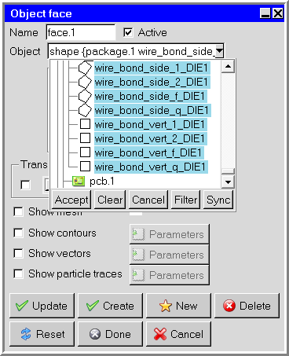

b. Select **Show contours** and click **Parameters**.

c. Select **This object** from the **Calculated** drop-down list.

d. Click **Done** in the **Object face contours** and **Object face** panels to close the panels and view

the temperature contours.

**Figure 20.8: Temperature Contours on the Wirebonds (Top View)**

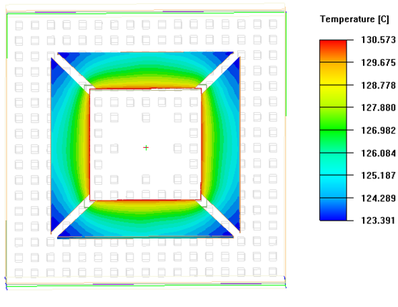

2. Go to the **Report** **Summary report** and click **New** twice.

a. Choose **source_DIE1** under the node for **package.1** for the first object and the wall object **Top** for the second object.

b. Keep the default selection of **Temperature** under **Value** for both.

c. Click **Write** to create the **Summary report**.

Maximum die and maximum top wall temperatures are determined to be 131.04°C and 127.6°C, re- spectively. Note that these values may differ depending on your machine. The top wall represents the case for the package. Therefore, junction-to-case resistance for this package is determined as:

(20.1)

Where is the die power (0.5 W in this case). Substituting these values, we can calculate the junction- to-case resistance like so:

(20.2)

### 20.11. Step 8: Summary

In this tutorial, you learned how to import trace layers from a BOOL file onto a BGA package substrate. You then used this package in conjunction with a PCB and two walls to solve a conduction heat transfer problem as well as to determine the junction-to-case resistance for the package.

---

## Chapter 21: Zero Slack with Non-Conformal Meshing

### 21.1. Introduction

This tutorial compares the mesh of a non-conformal assembly with and without slack values around a heat sink, package, and board. You will solve a model using zero slack values to determine the temper- ature distribution.

In this tutorial you will learn how to use zero slack values properly with a non-conformal mesh in Ansys Icepak.

**Note:**

Mesh counts and solution results may differ slightly due to enhancements to the meshing algorithm and Fluent solver, respectively.

### 21.2. Prerequisites

This tutorial assumes that you have reviewed Sample Session and the tutorials Finned Heat Sink (p. 5) and RF Amplifier (p. 51) of this guide.

### 21.3. Problem Description

The model consists of a detailed heat sink, a BGA package, a block with traces, and fluid blocks. The model setup is shown in Figure 21.1: Problem Schematic (p. 436).

**Figure 21.1: Problem Schematic**

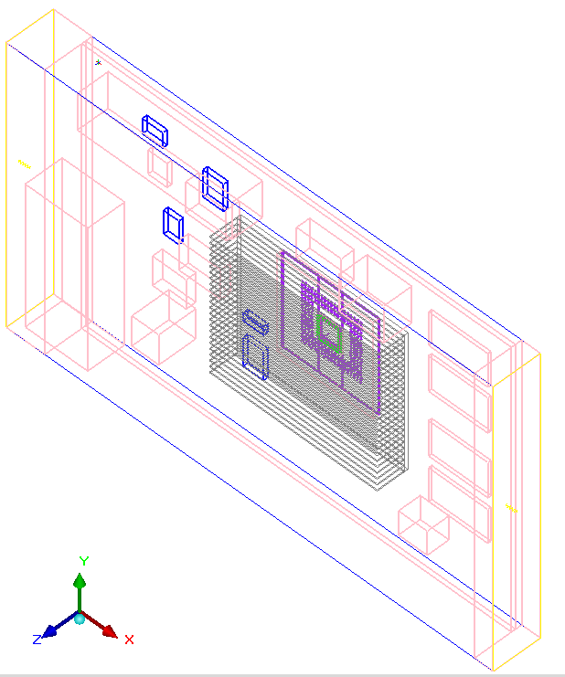

The objective of this exercise is to illustrate the advantage of using zero slack values for non-conformal assemblies. The model will be constructed using the default metric unit system.

### 21.4. Step 1: Create a New Project

1. Set up a working directory on the computer you will be using.

2. Download the zeroslack.zip file here.

3. Unzip the zeroslack.zip file you have downloaded to your working directory.

4. Copy the file ZeroSlack_Tut.tzr to your working directory.

5. Start Ansys Icepak, as described in Starting Ansys Icepak in the Icepak User’s Guide.

When Ansys Icepak starts, the **Welcome to Icepak** panel opens automatically.

6. Click **Unpack** in the **Welcome to Icepak** panel.

The **File selection** panel appears.

7. In the **File selection** panel, select the packed project file ZeroSlack_Tut.tzr and click **Open**.

The **Location for the unpacked project** file selection dialog appears.

8. In the **Location for the unpacked project** file selection dialog, select a directory where you would like to place the unpacked project file, enter a project name, such as zeroslack, in the **New** **project** text field, and then click **Unpack**.

### 21.5. Step 2: Default Units

Make sure the default unit of length is mm.

**Edit** **Preferences**

1. In the **Preferences** panel, click **Units** under the **Defaults** node. In the **Category** box, scroll down and select **Length**, and under **Units**, make sure mm has an asterisk next to it. If there is no asterisk next to mm:

a. Select mm from the **Units** box.

b. Click **Set as default**.

2. Click **Set all to defaults** and click **This project**.

### 21.6. Step 3: Build the Model

This tutorial uses an existing model. The model contains existing package, board, and heatsink assemblies.

### 21.7. Step 4: Import Traces

1. In the **Model manager** window, expand the **Board** assembly to display the object **pcb** if it is not already visible. Right-click pcb in the **Model manager** window and click **Edit** to display the **Blocks** panel.

2. In the **Geometry** tab, select **ASCII Neutral BOOL+INFO** from the **Import ECAD file** drop-down list.

**Important:**

You may need to unzip BOARD_OUTLINE_1.zip or extract the BOOL file within it before you can import the BOOL into Ansys Icepak.

3. In the **Bool file** panel, select BOARD_OUTLINE.bool. Deselect the **Reposition** and **Resize object** options because the PCB was imported using an IDF file, so the dimensions and location are already correct. This process may take a few minutes depending on the speed of your computer.

**Note:**

The **Reposition** and **Resize object** options are necessary when the board size and location are not known or an IDF file is not available.

4. Once the import is complete, you can edit the layer information in the **Board layer and via inform-** **ation** panel. Enter the layer thicknesses as shown in the table below.

| Layer | Thickness (mm) |
| --- | --- |
| 1 M1 TOP | 0.04 |
| 2 D2 DIELECTRIC U3 _ | 0.45364 |
| 3 M2 int1 | 0.062 |
| 4 D3 DIELECTRIC U4 _ | 0.467 |
| 5 M3 INT2 | 0.055 |
| 6 D4 DIELECTRIC U5 _ | 0.442 |
| 7 M4 BOTTOM | 0.045 |

5. By default, layers are lumped for each sub-grid. Therefore, the **Model layers separately** option is disabled and will need to be selected.

a. Click **Update** and **Done** to close the **Board layer and via information** panel.

b. Then click **Edit** next to **Trace layers and vias** in the **Blocks** panel to re-open the **Board layer**

**and via information** panel.

c. The **Model layers separately** option is now available. Select the option.

6. The via information is imported automatically, so keep the default settings.

7. Click **Update** and **Done** to save your settings.

**Note:**

• You can view the traces in four different ways:**Single color**,**Color by trace**,**Color by** **layer**, or **Color by net**.

• The meshing plates are placed at the location of the different layers; they are used to ensure the mesh resolution is high enough at each layer.

8. Click **Done** to close the **Blocks** panel.

### 21.8. Step 5: Add Slack Values

You will add slack values to the assembly **Heatsink**.

**Note:**

Non-conformal assemblies reduce mesh bleeding and lower the overall mesh count. This is particularly useful for regions where a coarser mesh is sufficient.

1. In the Assemblies panel **Meshing** tab, click **Copy global**.

2. Enter 0.05 for **Minimum gap Y** and 0.1 for **Minimum gap Z**.

3. Set the slack values for the heat sink assembly as shown in the figure below.

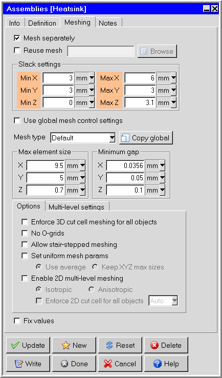

### 21.9. Step 6: Generate Mesh (with Slack Values)

Generate a mesh for the assembly **Heatsink** with slack values.

1. Go to **Model** **Generate mesh** to open the **Mesh control** panel.

2. Select **Mesher-HD** as the **Mesh type** if not already selected.

3. Make sure that the **Min elements in gap** is **2**, the **Min elements on edge** is **1**, and the **Max size** **ratio** is **3**.

4. Verify the local meshing parameters.

a. Go to the **Local** tab and click **Edit** next to **Object params**. You will see the following reques- ted values in the **Per-object meshing parameters** panel (scroll down to see the inside ratios):

**Table 21.1: Object Parameters**

| Object type | Object name | Parameter | Requested |
| --- | --- | --- | --- |
| block | pcb | X count | 25 |
|  |  | Z count | 5 |
| assembly | Heatsink | all inside ratios | 2 |
| assembly | Board | all inside ratios | 2 |
| assembly | Package | all inside ratios | 2 |

b. Click **Done** to close the **Per-object meshing parameters** panel.

5. Keep all other settings as default and click **Generate**.

6. Take note of the mesh count and view a cut plane of the mesh from the **Display** tab.

**Note:**

The package is not well resolved and it is divided between the heatsink and board assem- blies. Moreover, the mesh bleeds into the package’s edges significantly because of the nonzero slack values of the **Heatsink** assembly on the Min Z and Max Z faces. This prevents you from creating a separately meshed assembly for the package because non-conformal assemblies cannot intersect with each other in ANSYS Icepak. You can verify this by changing the view to the positive X orientation.

### 21.10. Step 7: Zero Slack

Next, we will consider a board with non-conformal meshing with zero slack values.

Non-conformal assemblies with zero slack help in resolving specific objects without extending the mesh to the rest of the cabinet. Also, zero slack non-conformal assemblies help to avoid intersections with other non-conformal assemblies. In this tutorial, the use of zero slack non-conformal assemblies allows us to have a separate non-conformal assembly for the package and to accurately resolve the mesh.

**Note:**

Currently, zero slack assemblies are unable to participate in radiation when a surface coincides with the assembly interface.

1. Change the slack values for the heat sink assembly as shown in the figure below.

2. In addition, select the **Mesh separately** option in the assemblies **Package** and **Board**. Do not change any other values in these assemblies. These other assemblies will have default slack values of zero. Figure 21.2: Package and Heatsink Assemblies (p. 443) shows the **Package** and **Heatsink** assemblies adjacent to each other without intersection due to the zero slack values in the Z direction for both assemblies.

**Figure 21.2: Package and Heatsink Assemblies**

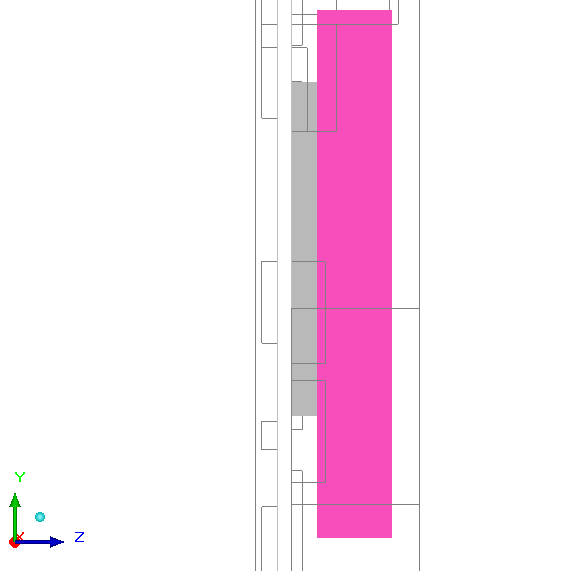

### 21.11. Step 8: Generate Mesh (with Zero Slack)

Generate a mesh with the same global mesh settings as in Step 6: Generate Mesh (with Slack Val- ues) (p. 440) so that you can compare the mesh count. Observe that the mesh count is significantly less than that of the mesh with slack values.

### 21.12. Step 9: Physical and Numerical Settings

1. In the **Model manager** window, go to

**Solution settings**

**Basic settings** and

**Solution**

**settings**

**Advanced settings**, and verify that the following values are set:

**Value** **Basic settings**

| Number of iterations | 200 |
| --- | --- |
| Energy (convergence criterion) | 1e- 7 |
| Advanced settings |  |
| Under-relaxation: Pressure | 0.7 |
| Under-relaxation: Momentum | 0.3 |

2. **Note:**

Instead of accessing the

**Basic parameters** panel, you can instead use the **Problem** **setup wizard** to define your problem setup by double-clicking

**Problem setup** in the **Model manager** window. See 2.7. Step 4: Physical and Numerical Settings (p. 28) of the Finned Heat Sink tutorial for more instruction regarding the **Problem setup wizard**. You must still use the same settings described in this tutorial for the **Problem setup wizard**.

Go to

**Basic parameters** and make sure the **Flow regime** is **Turbulent** and the turbulence model is **Zero equation** in the **General setup** tab. Also, input a small initial (global) **X velocity** of **–1.5** m/s in **Transient setup** tab. Click **Accept** to accept the changes made and exit the **Basic parameters** panel.

**Problem setup**

### 21.13. Step 10: Save the Model

Ansys Icepak saves the model for you automatically before it starts the calculation, but it is a good idea to save the model (including the mesh) yourself as well.

**File** **Save project**

### 21.14. Step 11: Calculate a Solution

Go to **Solve** **Run solution**. Click **Start solution**.

### 21.15. Step 12: Examine the Results

After the solution has converged, create the following post-processing objects:

| Object | Specifications | Description |
| --- | --- | --- |
| cut.1 (plane cut) | Set position: Y plane through center | Plane cut (X-Z) view of the velocity vectors in the X-Z plane. |
|  | Show vectors |  |
| face.1 (object face) | Object: pcb | Object-face view of temperature on pcb. Note the minimum and maximum temperatures as well as the temperature distribution. |
|  | Show contours / Parameters |  |
|  | Calculated: This object |  |

| Object | Specifications | Description |
| --- | --- | --- |
| face.2 (object face) | Object: pcb | Object-face showing the thermal conductivity in the X direction, K X. _ |
|  | Show contours / Parameters |  |
|  | Contours of : K X _ |  |

### 21.16. Step 13: Summary

The zero slack feature in Ansys Icepak alleviates some restrictions encountered when using non-con- formal assemblies. Zero slack non-conformal assemblies not only reduce mesh count but also allow the user to mesh specific objects separately. In this model, the zero slack capability allowed you to mesh the package object separately.

Nonetheless, there are certain limitations of zero slack non-conformal assemblies that you must keep in mind:

• Surfaces of objects that are coplanar with a zero slack non-conformal interface cannot participate in radiation.

• Zero slack assembly interfaces cannot touch 2D objects, such as fans, openings, grilles, conducting thin plates, and so on.

• Zero slack assembly interfaces cannot touch the sides of blocks with individual side specifications.

Always check that objects coplanar with a zero slack interface are correctly meshed.

---

## Chapter 22: Ansys Icepak - Ansys Workbench Integration Tutorial

### 22.1. Introduction

This tutorial demonstrates how to create and solve an Ansys Icepak analysis in Ansys Workbench. You will model a geometry using both Ansys DesignModeler and Icepak. You will then create a non-conformal mesh for the complex shapes. The project will also include postprocessing the results in Ansys CFD-Post and performing a static structural analysis in Ansys Mechanical.

In this tutorial, you will learn how to:

• Manage a project using Ansys Workbench

• Import and modify CAD geometry in Ansys DesignModeler

• Create an Ansys Icepak analysis through Ansys Workbench

• Postprocess results in Ansys CFD-Post

• Perform a thermo-mechanical analysis in Ansys Mechanical

**Note:**

Mesh counts and solution results may differ slightly due to enhancements to the meshing algorithm and Fluent solver, respectively.

### 22.2. Prerequisites

This tutorial assumes that you have little experience with Ansys Workbench and so each step will be explicitly described.

### 22.3. Problem Description

The graphics board contains a heat sink with extruded fins having airfoil cross section, a PCB, capacitors, memory cards and ports. These objects are placed in a setup as shown in the figure below.

**Figure 22.1: Problem Schematic**

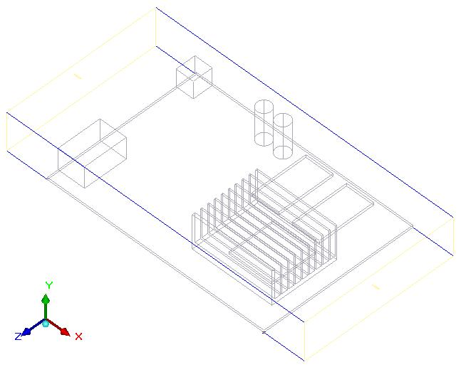

### 22.4. Step 1: Create a New Project

1. Start Ansys Workbench.

**Note:**

When Ansys Workbench starts, the **Toolbox** and **Project Schematic** are displayed.

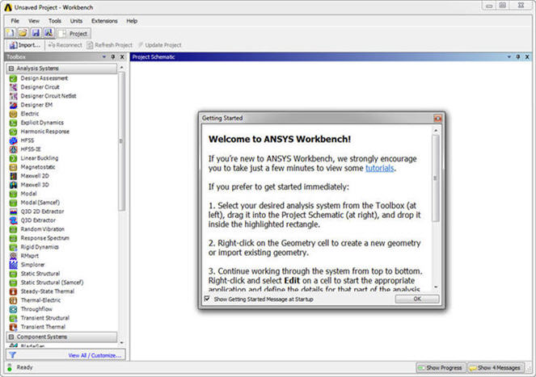

### 22.5. Step 2: Build the Model

1. Set up a working directory on the computer you will be using.

2. Download the workbench.zip file here.

3. Unzip the workbench.zip file you have downloaded to your working directory.

4. Add a **Geometry** template by dragging the template from the **Toolbar** under the **Component** **Systems** node into the **Project Schematic**. Right-click the **Geometry** cell (A2) and go to **Import** **Geometry**. Click **Browse** and select graphics_card_simple.stp to load the geometry.

**Note:**

A green check mark in the Geometry cell indicates you have imported the geometry successfully.

5. Right-click the **Geometry** cell (A2) and select **Edit Geometry in DesignModeler** as you need to edit the geometry first before exporting into Ansys Icepak.

a. Go to the **Units** menu and then select **Meter** as the desired length unit.

b. Click **Generate** to display the model.

c. Edit the geometry in DesignModeler using the **Electronics** option in the **Tools** menu. Select **Simplify** and choose the appropriate simplification level and select bodies.

1. Select **All bodies** for **Selection Filter**.

2. Keep the **Simplification Type** as **Level 2**. Your settings should resemble those in Figure 22.2: Details of Simplify1 (p. 450).

**Figure 22.2: Details of Simplify1**

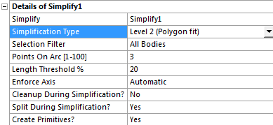

3. Click **Generate**.

Refer to the DesignModeler documentation for more detailed information on using the **Electronics** options.

**Note:**

The **Electronics** menu is shown only if the DesignModeler option **Enable** **Electronics Options** is selected.

d. Close DesignModeler and return to Ansys Workbench.

6. Drag and drop an **Icepak** template into the **Project Schematic** on top of the **Geometry** cell (A2) to transfer the geometry into Ansys Icepak.

7. Right-click the **Setup** cell (B2) and select **Edit** to launch Ansys Icepak.

1. The CAD model appears in the graphics display window and has been converted into Ansys

Icepak objects. Click the isometric toolbar icon (

) to display the isometric view of the model.

2. Rename the objects in the edit panel of each of the objects by going to the **Info** tab then changing the **Name** field. Enter the specifications in **Properties** tab. Table 22.1: Object Properties (p. 451) shows these specifications.

**Note:**

You can rename the objects in the edit panel of each of the objects by going to the **Info** tab then changing the **Name** field. To open the object edit panel, right-click the object and select **Edit**. After editing the object, you can press **Update** to save any changes and click a different object in the **Model manager** window to go to that object without closing the panel.

**Table 22.1: Object Properties**

| Object | New name | Solid material | Total power (W) |
| --- | --- | --- | --- |
| SERIAL PORT _ | no change needed | no change needed | no change needed |
| MEMORY1 | MEMORY 1 _ | Ceramic material _ | 5 |
| MEMORY1.1 | MEMORY 2 _ | Ceramic material _ | 5 |
| CAPACITOR | CAPACITOR 1 _ | no change needed | no change needed |
| CAPACITOR.1 | CAPACITOR 2 _ | no change needed | no change needed |
| KB | no change needed | no change needed | no change needed |
| HEAT SINK _ | no change needed | no change needed | no change needed |
| CPU | no change needed | Ceramic material _ | 20 |
| ALHPA MAIN PCB _ _ | PCB | Create material - PCB sol- id material _ Conductivity type: Orthotropic X = 20, Y = 0.4, Z = 20 | no change needed |

**Note:**

Edit the **Solid material** by selecting a material in the drop down list. To create a **Custom** material, select **Create material** in the drop-down list and click the **Properties** tab in the **Materials** panel. Enter the specifications above.

3. Resize the cabinet in the **Cabinet** object edit panel.

**Model** →

**Cabinet**

a. In the **Cabinet** panel, click the **Geometry** tab. Under **Location**, enter the following coordinates:

**Table 22.2: Coordinates for the Cabinet (Specify by: Start / end)**

| xS = -0.19 m | xE = 0.03 m |
| --- | --- |
| yS = 0 m | yE = 0.028487 m |
| zS = -0.11 m | zE = 0 m |

b. Edit the cabinet properties to specify **Min x** and **Max x** sides as openings.

i. In the **Properties** tab of the **Cabinet** object panel, select **Opening** from the drop-down list under **Wall type** for **Min x** and **Max x**.

ii. Select **Edit** to display the opening for the **Max x** object panel.

iii. In the **Properties** tab, specify the **X Velocity** to be **-2** m/s. Click **Done** in the

**Openings** and **Cabinet** panels to apply the changes and close the panels.

4. The final model should correspond to the one shown below.

**Figure 22.3: The Final Model Display**

### 22.6. Step 3: Generate a Mesh

1. Click the assembly toolbar icon (

) to create an assembly. Add the **HEAT_SINK** and **CPU** objects to the assembly and rename it **CPU_assembly**.

**Note:**

To add objects to an assembly, select one or more objects in the **Model manager** window and drag them into the desired assembly node.

2. Go to the **CPU_assembly** edit panel and click the **Meshing** tab. Select the **Mesh separately** option and enter the following slack values. Click **Done** to close the panel when finished.

**Table 22.3: Slack Values**

| Min X = 0.005 m | Max X = 0.005 m |
| --- | --- |
| Min Y = 0.0016 m | Max Y = 0 m |
| Min Z = 0.001 m | Max Z = 0.005 m |

3. Specify the overall mesh controls as shown in the **Mesh control** panel below.

**Model** → **Generate mesh**

**Note:**

For more information on how to refine a mesh locally, refer to Refining the Mesh Locally in the Icepak User’s Guide.

**Note:**

The **Mesh units** and **Minimum gap** values are in **mm**, and **Set uniform mesh params** is selected in the **Global** tab.

Click **Generate** to create the mesh. You can check the mesh by going to the **Display** and **Quality** tabs in the **Mesh control** panel. Click **Close** when you are done.

### 22.7. Step 4: Physical and Numerical Settings

**Note:**

Instead of accessing the

**Basic parameters** panel, you can instead use the **Problem setup** **wizard** to define your problem setup by double-clicking

**Problem setup** in the **Model** **manager** window. See Step 4: Physical and Numerical Settings (p. 28) of the Finned Heat Sink tutorial for more instruction regarding the **Problem setup wizard**. You must still use the same settings described in this tutorial for the **Problem setup wizard**.

**Problem setup** →

1. Go to

**Basic parameters** in the **Model manager** window.

a. In the **General setup** tab, make sure that both **Flow (velocity/pressure)** and **Temperature** are selected.

b. Select **Turbulent** and **Zero equation** for the **Flow regime** and select **Off** in the **Radiation** group

box to neglect radiation modeling.

c. Click **Accept** to close the panel.

**Solution settings** →

**Solution settings** →

2. Go to

**Advanced settings** in the **Model manager** window and verify that the following values are set for each variable:

**Basic settings** and

| Basic settings | User input |
| --- | --- |
| Number of iterations | 100 |
| Flow (convergence criterion) | 0.001 |
| Energy (convergence criterion) | 1e-7 |
| Advanced settings (Under-relaxation) |  |
| Pressure | 0.3 |
| Momentum | 0.7 |

### 22.8. Step 5: Save the Model

1. Go to **File** → **Save project**.

**Note:**

You can click the save icon (

) in the File commands toolbar.

The **Save As** panel appears.

2. Specify the name ice_wb for your project and click **Save**.

### 22.9. Step 6: Calculate a Solution

1. Go to **Solve** → **Run solution** to display the **Solve** panel.

2. Keep the default settings in the **Solve** panel.

3. Click **Start solution** to start the solver.

Ansys Icepak begins to calculate a solution for the model and a separate window opens where the solver prints the numerical values of the residuals. Ansys Icepak also opens the **Solution residuals** graphics display and control window, where it displays the convergence history for the calculation. Note that the actual values of the residuals may differ slightly on different machines, so your plot may not look exactly the same as the figure below.

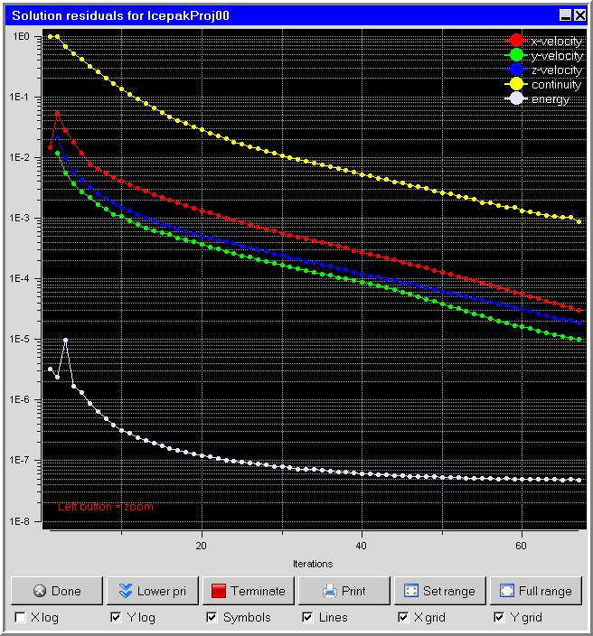

4. Once the solution converges, click **Done** in the **Solution residuals** window to close it.

### 22.10. Step 7: Examine the Results with CFD-Post

**Note:**

The postprocessing of results can be done within Ansys Icepak; however, you can also examine results in Ansys CFD-Post. This section will describe how to transfer information to Ansys CFD-Post and use its postprocessing options, so you may close Ansys Icepak.

1. After calculating a solution in Ansys Icepak, a green check mark will be displayed in the Icepak Solution cell in the **Project Schematic**. The green check mark indicates that all data is up to date. Select **Results** under the **Component Systems** node in the **Toolbox**. Drag the **Results** component system on top of the Icepak Solution cell (B3) to transfer the data.

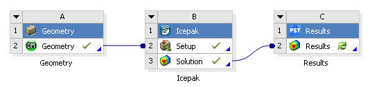

2. Double-click the C2 Results cell to launch Ansys CFD-Post. The model should appear in the display window.

3. To generate contours, do the following:

a. Go to **Insert** → **Contour** or click the **Contour** button

to create a contour. Retain the name **Contour 1** and click **OK**.

b. In the **Geometry** tab under **Details of Contour 1**:

i. Keep the default selection of **All Domains** in the **Domains** drop-down list.

ii. Click the **...** button next to **Locations** to display the **Location Selector** panel. Highlight all objects containing "CPU", "PCB", or "HEAT_SINK" in the name as shown in Fig- ure 22.4: Location Selector Panel (p. 460). Click **OK** to close the panel.

**Figure 22.4: Location Selector Panel**

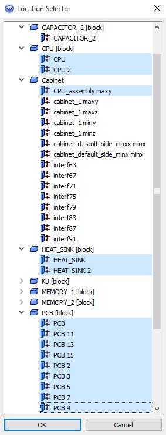

**Note:**

You can select multiple objects by pressing and holding either **Shift** or **Ctrl** while clicking the objects.

iii. Select **Temperature** in the **Variable** drop-down list.

iv. Select **Apply** to display the contour map (Figure 22.5: Contour 1 (p. 461)).

**Note:**

Ensure that the units are set to Celsius.

**Figure 22.5: Contour 1**

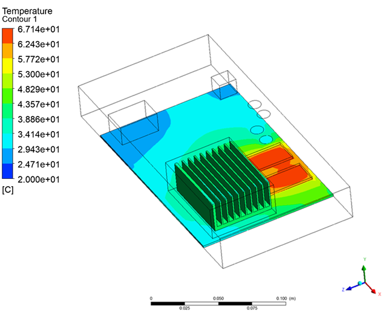

4. To generate a 3D streamline, do the following:

a. Go to **Insert** → **Streamline** or click the **Streamline** button

to create the streamline. Retain the name **Streamline 1** and then click **OK**.

b. In the **Geometry** tab under **Details of Streamline 1**:

i. Keep the default selection of **3D Streamline** in the **Type** drop-down list.

ii. Keep the default selection of **All Domains** in the **Domains** drop-down list.

iii. Select **cabinet_default_side_maxx minx** from the **Start From** drop-down list.

iv. Keep the default selection of **Velocity** in the **Variable** drop-down list.

v. Keep all other defaults and click **Apply** to display the streamline.

c. You can also animate the streamline. To animate the streamline, go to **Tools** → **Animation** or

click the animation button

.

• In the **Animation** panel that appears, select **Streamline 1** and then click the play button

(

). Click the stop button (

) then the **Close** button when finished.

5. When you are done examining the results, close Ansys CFD-Post and return to Ansys Workbench.

### 22.11. Step 8:Thermo-Mechanical Structural Analysis

In addition to solving this problem in Ansys Icepak, you can also perform a static structural analysis using Ansys Mechanical.

1. Select **Static Structural** from the **Toolbox**. Drag and drop this cell on top of the **Icepak** **Solution** cell (B3).

2. Click the **Geometry** cell (A2) and drag and drop it on top of the **Static Structural** **Geometry** cell (D3). You have now shared the geometry with the **Static Structural** component module as well as the **Icepak** module from earlier.

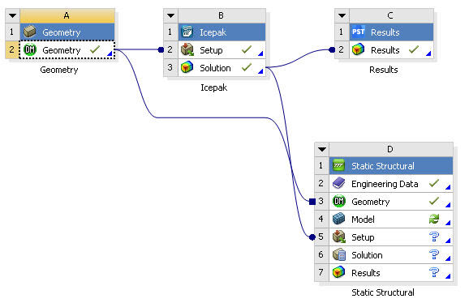

3. Right-click the **Setup** cell (D5) and then click **Update**. Allow Ansys Workbench to complete the update.

### 22.11. Step 8: Thermo-Mechanical Structural Analysis

4. Double-click the **Model** cell (D4) to launch Ansys Mechanical.

5. Expand the **Imported Load (Solution)** node in the **Outline** window then click the **Imported Body** **Temperature** object.

6. Under **Details of “Imported Body Temperature”**, ensure that the **Scoping Method** is **Geometry** **Selection**.

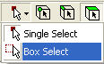

a. Click the **Box Select** button

. Hold down the **Ctrl** key and drag a box around the entire model to select it.

b. Click the cell to the right of **Geometry** and then click **Apply**. You should have nine bodies

now selected.

7. Select **All** from the **Icepak Body** drop-down list.

8. Click **Solve**.

### 22.12. Step 9: Summary

In this tutorial, you used Ansys Workbench to manage a multi-stage project using Ansys DesignModeler, Icepak, CFD-Post, and Mechanical. In particular, you used DesignModeler to import and modify CAD objects then shared the geometry with Ansys Icepak. You then used Ansys Icepak to determine temper- ature and flow results within the system. In CFD-Post, you post-processed the solution results from Ansys Icepak. Finally, you used Mechanical to perform a structural analysis of the system using the temperature data from Ansys Icepak. Ansys Workbench allows you to integrate these software for more control over the various aspects of your project.

---

## Chapter 23: Postprocessing Using Ansys CFD-Post

### 23.1. Introduction

This tutorial demonstrates the use of Ansys CFD-Post for post-processing results from Ansys Icepak analyses.

In this tutorial, you will learn how to:

• Create a workflow in Ansys Workbench.

• Postprocess Ansys Icepak results in Ansys CFD-Post.

**Note:**

Mesh counts and solution results may differ slightly due to enhancements to the meshing algorithm and Fluent solver, respectively.

### 23.2. Prerequisites

• Familiarity with the Ansys Workbench interface

• Familiarity with the Ansys Icepak interface

**Figure 23.1: Quick Reference - CFD Post Interface**

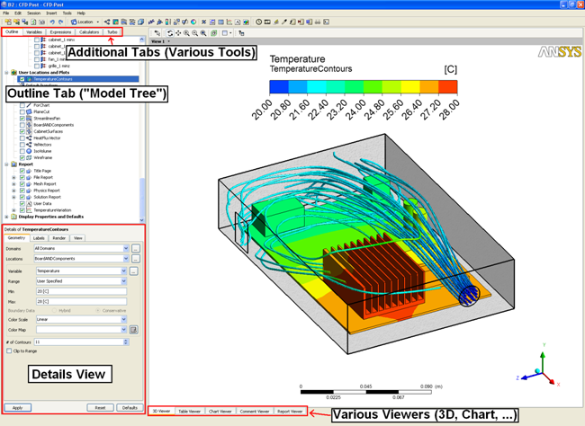

**Figure 23.2: Quick Reference - Mouse Button Mapping (default) in CFD Post:**

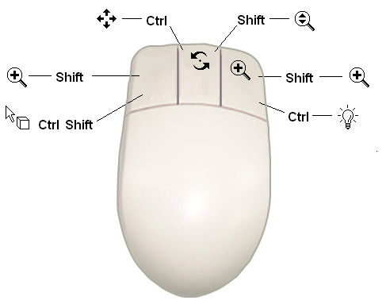

To adjust or view the mouse mapping options, go to **Edit** **Options**, then **Viewer Setup** **Mouse** **Mapping** in Ansys CFD-Post.

### 23.3. Problem Description

Figure 23.3: Problem Schematic - Graphics Card Model (two configurations) (p. 467) shows the Ansys Icepak model of a graphics card that contains a printed circuit board. The board components include memory cards, capacitors, CPU, and serial connectors for peripheral devices. The CPU is cooled by a heat sink. A fan and grille have been used to enhance the convective heat transfer within the system. Two configurations, varying the positioning of the fan and grille, will be considered for CFD analysis.

**Figure 23.3: Problem Schematic - Graphics Card Model (two configurations)**

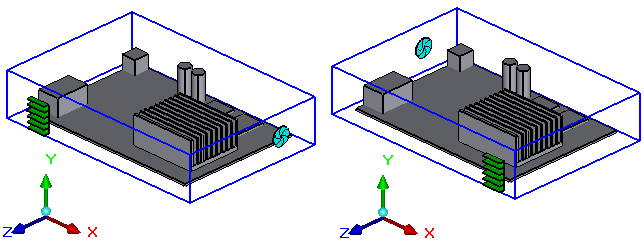

### 23.4. Step 1: Create a New Project

1. Create a workflow by linking Ansys Icepak and Ansys CFD-Post in Ansys Workbench.

a. Start a new Ansys Workbench session.

b. Drag an Ansys Icepak component module from the **Toolbox** and drop it on the **Project**

**Schematic** window as shown in Figure 23.4: Creating an Ansys Icepak Component (p. 468).

**Figure 23.4: Creating an Ansys Icepak Component**

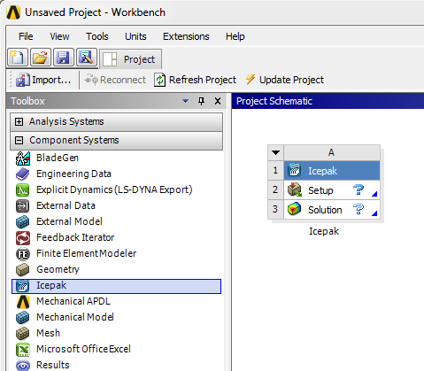

c. Rename the Ansys Icepak component module as Parametric Setup as shown in Figure 23.5: Re- naming the Ansys Icepak Component Module (p. 468). To rename the title, double-click the title

Icepak or click the down arrow (

) and select the **Rename** option from the drop-down list.

**Figure 23.5: Renaming the Ansys Icepak Component Module**

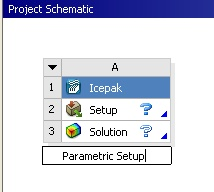

d. As shown in Figure 23.6: Linking the Results (Ansys CFD-Post) Component to the Ansys Icepak

Component (p. 469) and Figure 23.7: Final Project Schematic (p. 469), drag and drop a **Results** **(Ansys CFD-Post)** component module onto the **Solution** cell of the **Parametric Setup** to link the Ansys Icepak analysis to Ansys CFD-Post. Rename the **Results** component module to CFD Post.

**Figure 23.6: Linking the Results (Ansys CFD-Post) Component to the Ansys Icepak Component**

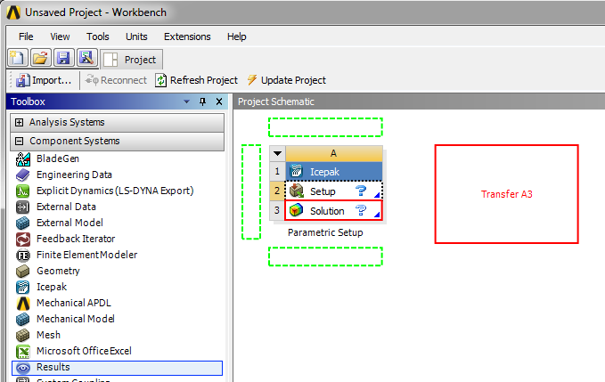

**Figure 23.7: Final Project Schematic**

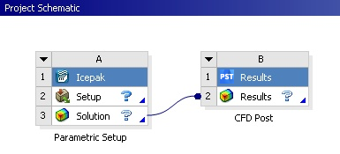

e. Save the project while in the Ansys Workbench interface. Name the project as ice-cfdpost.

2. Download the project file.

1. Download the cfd_post.zip file here.

2. Unzip the cfd_post.zip file you have downloaded to your working directory.

3. Copy the file ice-cfdpost.tzr to your working directory.

3. Open the project in Ansys Icepak

a. Right-click the Ansys Icepak **Setup** cell and import the packed Ansys Icepak project file ice- cfdpost.tzr located in the project directory.

b. The Ansys Icepak interface will launch with the imported project for modeling and analysis.

### 23.5. Step 2: Parametric Trials and Solver Settings

1. Go to **Edit** **Preferences** **Postprocessing** and confirm that the **Merge zones when possible** **for CFD-Post data** option is selected.

2. Go to **Solve** **Run solution** **Results** and verify that **Create heat flux vectors in CFD Post** is selected and then click **Dismiss**.

3. Go to **Solve** **Run optimization**.

a. In the **Design variables** tab, review the parametric setup. Note the variable values for fanxC and grille_xS.

b. In the **Trials** tab, note that two of the four trials will be considered for CFD analysis.

**Figure 23.8: Solution Trials**

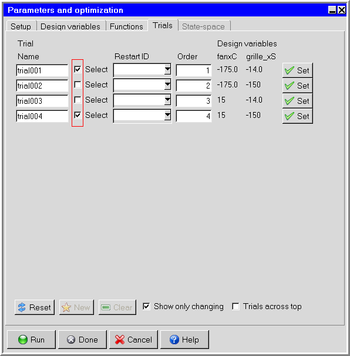

### 23.6. Step 3: Calculate a Solution

1. Click **Run** in the **Parameters and optimization** panel.

2. Ansys Icepak will run two trials and automatically write out the results for post-processing in Ansys CFD-Post at the end of each trial.

3. Save the project by going to **File** **Save project**.

4. Close Ansys Icepak by going to **File** **Close Icepak**.

### 23.7. Step 4: Postprocessing Using Ansys CFD-Post

1. Open the results in Ansys CFD-Post.

a. On the project schematic, double-click the **Results** cell (B2) to launch the Ansys CFD-Post interface.

b. Ansys CFD-Post automatically reads the most recent solution set (trial 004).

2. Create a **Surface Group** for the board and all the components.

a. Go to **Insert** **Location** **Surface Group**.

b. Name the group as BoardANDComponents.

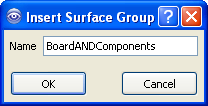

c. Go to the **Details** view located on the lower left hand side of the screen (see Figure 23.1: Quick Reference - CFD Post Interface (p. 466)).

**Figure 23.9: Details View for BoardANDComponents Surface Group**

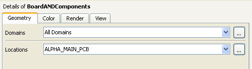

d. In the **Geometry** tab, click

next to **Locations** to open the **Location Selector** panel.

i. As shown in Figure 23.10: Selection for the BoardANDComponents Surface Group (p. 473), hold down **Shift** and the left mouse button to select all of the objects excluding the objects in the **Cabinet** node. You may need to press the **Ctrl** key also to select the objects.

**Figure 23.10: Selection for the BoardANDComponents Surface Group**

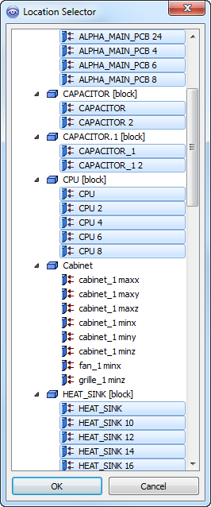

ii. Click **OK** to close the **Location Selector** panel and add the surfaces.

e. Click **Apply** in the **Details** view to apply the settings.

3. Create another **Surface Group** for the cabinet.

a. Go to **Insert** **Location** **Surface Group** and name the group CabinetSurfaces. Click **Apply** in the **Details** view.**CabinetSurfaces** should now appear in the **Outline** tree view.

**Figure 23.11: Listing of Surface Groups under User Locations and Plots**

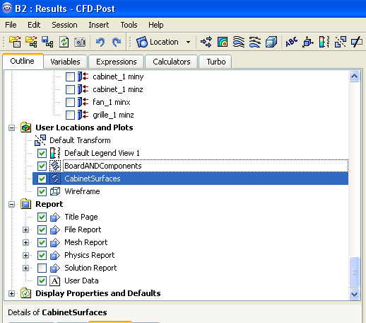

b. As before, open the **Location Selector** panel, but this time select only the objects in the **Cabinet**

node (Figure 23.12: Selection for the CabinetSurfaces Surface Group (p. 474)). Click **OK**.

**Figure 23.12: Selection for the CabinetSurfaces Surface Group**

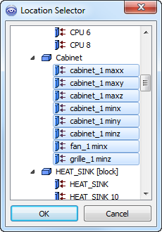

c. In the **Render** tab, apply the settings as shown in Figure 23.13: Rendering Details for the Cabin- etSurfaces Surface Group (p. 475) and click **Apply**.

**Figure 23.13: Rendering Details for the CabinetSurfaces Surface Group**

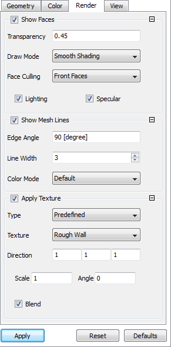

d. Deselect the object **BoardANDComponents** from the **User Locations and Plots** node in the

**Outline** tree view.

**Figure 23.14: Updated Model**

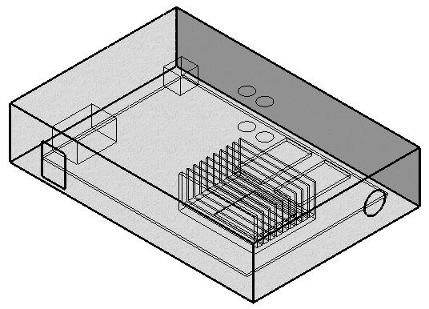

e. Note that these newly created Surface Groups are listed under **User Locations and Plots** in the

**Outline** tree view.

4. Plot **Contours** of **Temperature** on the **Surface Group** BoardANDComponents.

a. Change the **Units** for this postprocessing session.

i. Go to **Edit** **Options** **Units**.

ii. Set the **System** to **Custom**.

iii. Ensure that the unit for **Temperature** has been set to C.

**Figure 23.15: Setting Units in CFD Post**

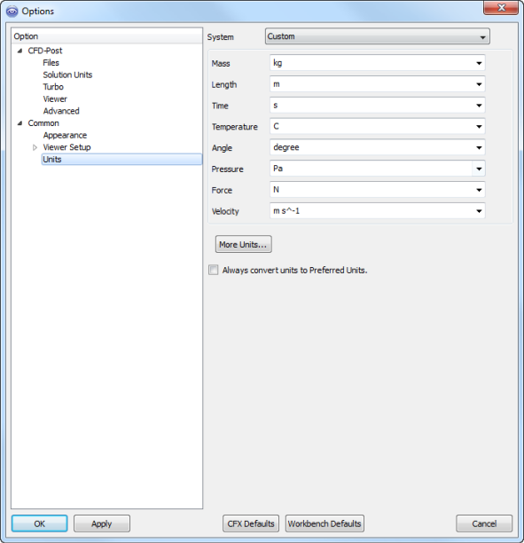

iv. Click **Apply** and then **OK** to set the units and close the panel.

b. Go to **Insert** **Contour** and create a new contour object named TemperatureContours.

c. For the contour TemperatureContours, update the settings for the **Geometry** tab of the **Details** view as shown in Figure 23.16: Geometry Settings for TemperatureContours (p. 478) and click **Apply**.

**Figure 23.16: Geometry Settings for TemperatureContours**

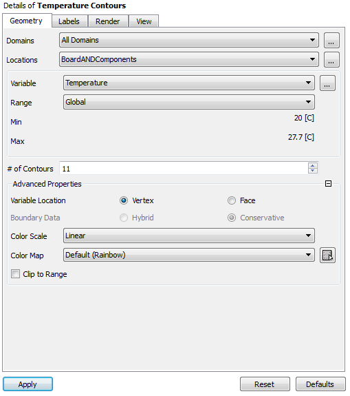

d. Click **Apply** to create the contour.

**Note:**

The object TemperatureContours is listed under the **User Locations and Plots** node in the **Outline** tree view.

5. Modify the display of the default legend view.

a. Double-click **Default Legend View 1** listed under the **User Locations and Plots** node (in the **Outline**) to access the corresponding **Details** view.

b. Verify that your settings in the **Definitions** and the **Appearance** tabs match those shown in

Figure 23.17: Settings for Default Legend View 1 (p. 479) and then click **Apply**.

**Figure 23.17: Settings for Default Legend View 1**

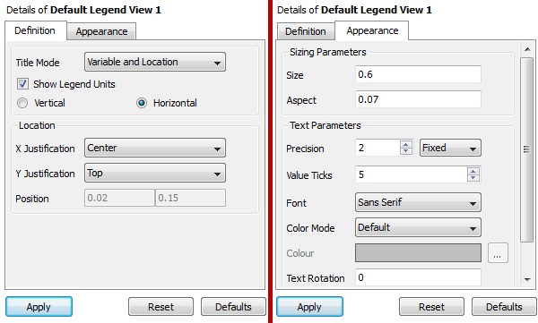

**Figure 23.18: Modified Legend View**

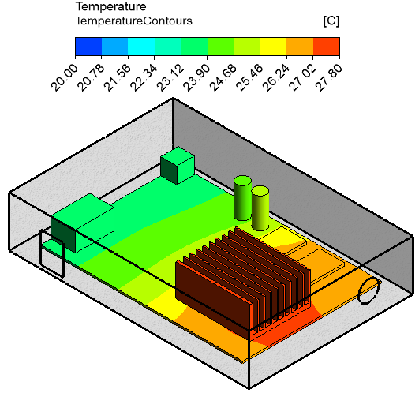

6. Plot **Vectors**, displaying heat flux on the **Surface Group** BoardANDComponents.

a. Deselect TemperatureContours in the **User Locations and Plots** node.

b. Go to **Insert** **Vector** and create a new **Vector** object named HeatFluxVectors and click **OK**.

c. Modify the **Geometry** tab of the **Details** view as shown in Figure 23.19: Geometry Settings for HeatFluxVectors (p. 480).

**Figure 23.19: Geometry Settings for HeatFluxVectors**

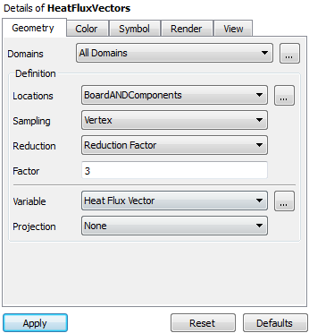

d. Go to the **Symbol** tab and input **2.5** for the **Symbol Size**. Click **Apply** and then observe the

updated model.

**Figure 23.20: Display of HeatFluxVectors**

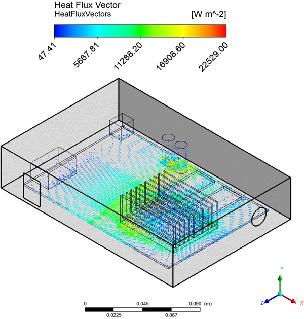

7. Plot **Thermal Chokepoint**, displaying regions of high heat flux on the **Surface Group** BoardAND- Components.

a. Deselect HeatFluxVectors in the **User Locations and Plots** node.

b. Go to **Insert** **Contour** and create a new **Contour** object named Chokepoint and click **OK**.

c. Open the **Location Selector** panel and select only the **ALPHA_MAIN_PCB** objects (Figure 23.21: Se- lection for Thermal Chokepoint (p. 482)). Click **OK** to close the **Location Selector** panel and add the surfaces.

**Figure 23.21: Selection for Thermal Chokepoint**

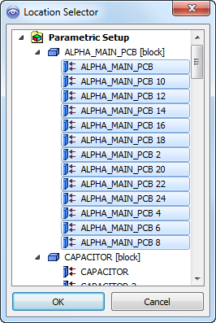

d. Modify the **Geometry** tab of the **Details** view as shown in Figure 23.22: Geometry Settings for

Chokepoint (p. 483) and click **Apply**.

**Figure 23.22: Geometry Settings for Chokepoint**

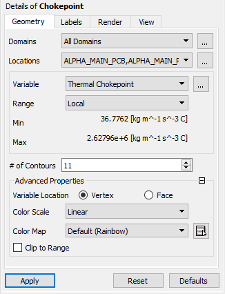

**Figure 23.23: Display of Chokepoint**

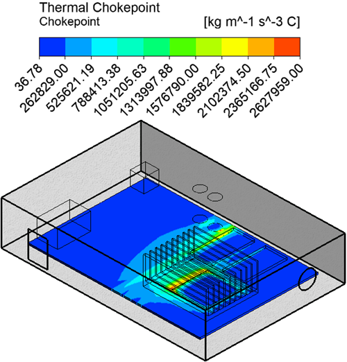

8. Plot **Streamlines** originating from the fan and colored by temperature.

a. Deselect **Chokepoint** and select **TemperatureContours** in the **User Locations and Plots** node.

b. Go to **Insert** **Streamline** and create a new **Streamline** object named StreamlinesFan and click **OK** to access the **Details** view panel.

c. Modify the **Geometry** tab as shown in Figure 23.24: Geometry Settings for StreamlinesFan (p. 485) and click **Apply**.

**Figure 23.24: Geometry Settings for StreamlinesFan**

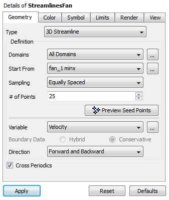

d. Modify the **Color** tab as shown in Figure 23.25: Color Settings for StreamlinesFans (p. 485) and

click **Apply**.

**Figure 23.25: Color Settings for StreamlinesFans**

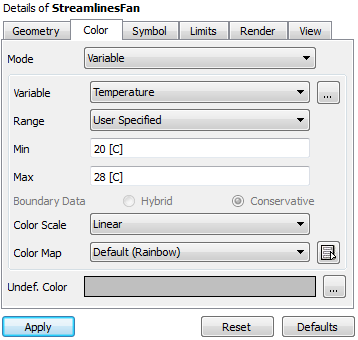

e. Modify the **Symbol** tab as shown in Figure 23.26: Symbol Settings for StreamlinesFan (p. 486) and

click **Apply**.

**Figure 23.26: Symbol Settings for StreamlinesFan**

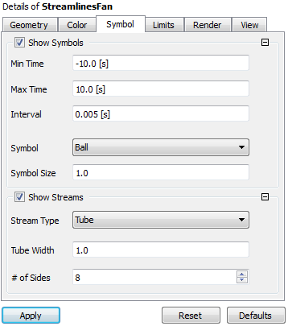

**Figure 23.27: Display of StreamlinesFan**

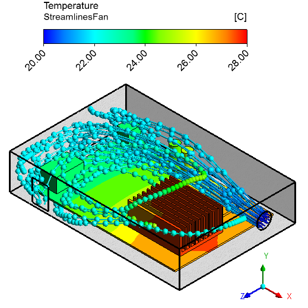

9. Create a **Keyframe Animation** of StreamlinesFan.

a. Go to **Tools** **Animation** and select **Keyframe Animation**.

b. Click the

button to insert a new frame called **KeyframeNo1** as shown in Figure 23.28: Keyframe Animation Panel (p. 488).

**Figure 23.28: Keyframe Animation Panel**

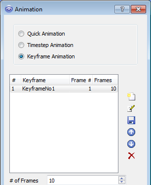

c. Right-click the background next to the model in the 3D viewer and select the **View From +Y** option under **Predefined Camera**.

**Figure 23.29: View From +Y**

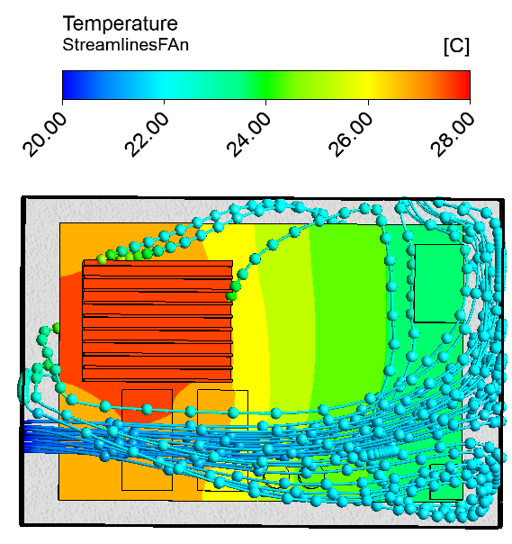

d. Add another keyframe called **KeyframeNo2** to the **Animation** panel.

e. Select the **Animate Camera** option on the **Keyframe Animation** panel (you may need to activate

the display of the lower half of the **Animation** panel using the drop-down arrow

).

f. Similarly, update the display and add new frames as follows:

i. **View From -Z** and add **KeyframeNo3**.

ii. **View From +X** and add **KeyframeNo4**.

iii. **Isometric View (Y up)** and add **KeyframeNo5**.

g. Click

to view the animation.

h. Click the **Options** button on the **Animation** panel to access the **Animation Options** panel.

i. Set the **Animation Speed** to **Slower** from the drop-down menu by a factor of 20 and click **OK**.

**Figure 23.30: Animation Options Panel**

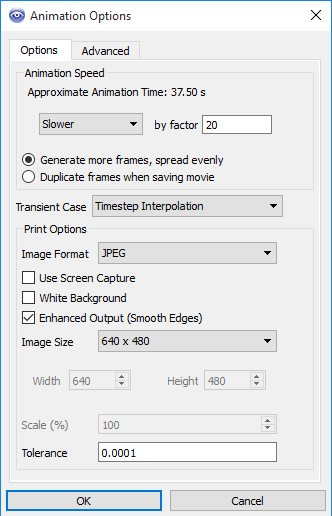

j. Replay the animation and note that the animation is less choppy compared to the original one.

k. Close the **Keyframe Animation** panel.

l. Deselect the TemperatureContours and StreamlinesFan objects under **User Locations** **and Plots**.

10. Create a **Plane** object displaying temperature contours and velocity vectors.

a. Go to **Insert** **Location** **Plane** and create a plane named PlaneCut.

b. Modify the **Details** view for PlaneCut as shown in Figure 23.31: Details for PlaneCut (p. 491)

and click **Apply**.

**Figure 23.31: Details for PlaneCut**

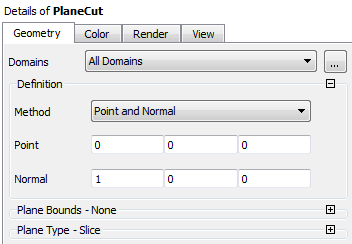

c. Deactivate the display of the plane by deselecting PlaneCut and activate the contour display by selecting TemperatureContours under **User Locations and Plots**.

d. Double-click TemperatureContours or right-click **Edit** to access the **Details** view. Update

the details as shown in Figure 23.32: Details for TemperatureContours (p. 492) and click **Apply**.

**Figure 23.32: Details for TemperatureContours**

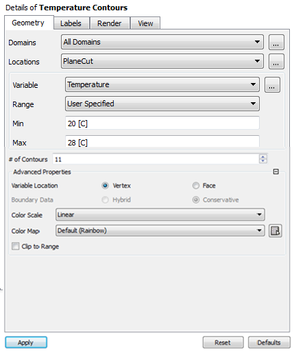

**Figure 23.33: Display of PlaneCut**

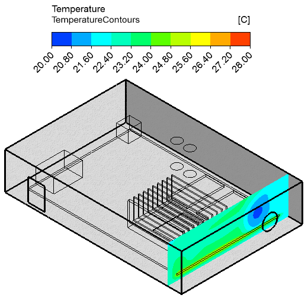

e. Go to the **Details** view for the PlaneCut (do not activate the display of the PlaneCut) and

make the following modifications:

i. Switch **Method** to XY Plane and click **Apply**.

ii. Use the scroll bar to change the **Z** location for PlaneCut.

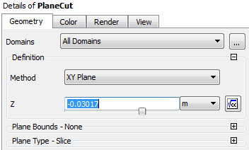

f. The plane cut can also be traversed across the domain using the animation tools in CFD-Post.

i. Go to **Tools** **Animation** and select **Quick Animation** (default) and highlight the PlaneCut object.

ii. Using the slider bar, adjust the number of frames for the animation (how fast or slow it plays)

as shown in Figure 23.34: Quick Animation Settings (p. 494) and click the

button.

**Figure 23.34: Quick Animation Settings**

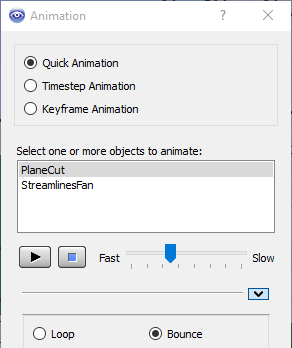

iii. The animation can be viewed on the screen or can be written out to an animation file by

checking the **Save Movie** option.

iv. Stop the animation by clicking the

button.

v. Click **Close** to exit the **Animation** panel.

g. Deactivate the display of the contours by deselecting the TemperatureContours object under

**User Locations and Plots**.

h. Go to **Insert** **Vector** and create a vector object named VelVectors.

i. Modify the **Details** view for VelVectors to set the **Locations** to PlaneCut and click **Apply**.

j. As before, use the **Details** view for the PlaneCut to manually traverse the plane displaying the vectors across the domain.

k. Deactivate the display of the vectors by deselecting Velvectors under **User Locations and** **Plots**.

11. Create an **Isosurface** of 27°C and 3 m/s.

a. Go to **Insert** **Location** **Isosurface** and create an **Isosurface** name HotSpots.

b. Modify the **Details** view for HotSpots to create an isosurface for 27[C] (**Variable**: Temperature,

**Value**: 27°C).

c. Similarly, modify the **Details** to create an isosurface for 3 m/s (**Variable**: Velocity,**Value**: 3 m/s).

d. Deactivate the display of the isosurface by deselecting HotSpots under **User Locations and**

**Plots**.

12. Create a **Volume** for values above 25°C.

a. Go to **Insert** **Location** **Volume** and create a **Volume** named IsoVolume.

b. Modify the **Details** view for IsoVolume as shown in Figure 23.35: Details of IsoVolume (p. 495)

and click **Apply**.

**Figure 23.35: Details of IsoVolume**

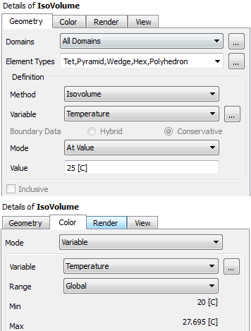

**Figure 23.36: Display of IsoVolume**

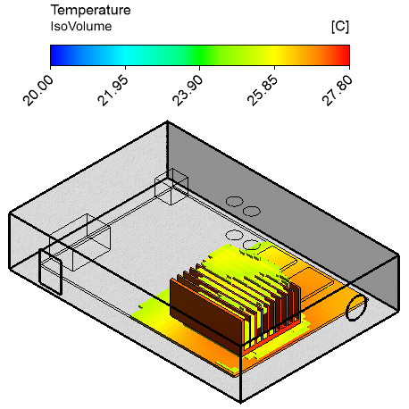

c. Deactivate the display of the volume by deselecting IsoVolume under **User Locations and** **Plots**.

13. Create a **Chart** of **Temperature** variation across a **Line**.

a. Go to **Insert** **Location** **Line** and create a **Line** named ForChart.

b. Modify the **Details** view for ForChart as shown in Figure 23.37: Details for Line ForChart (p. 496).

and click **Apply**.

**Figure 23.37: Details for Line ForChart**

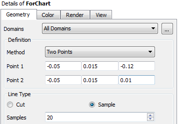

c. Deactivate the display of the line by deselecting ForChart under **User Locations and Plots**.

d. Go to **Insert** **Chart** to create a **Chart** named TemperatureVariation.

e. Modify the **Details** for TemperatureVariation as follows:

i. **General** tab: Set the **Type** to **XY**.

ii. **General** tab: Set the **Title** to Temperature Variation along Z axis.

iii. **Data Series** tab: Set **Location** to ForChart.

iv. **X Axis** tab: Set **Variable** to Z.

v. **Y Axis** tab: Set **Variable** to Temperature.

f. Leave all other settings as their defaults and click **Apply**.

**Figure 23.38: Plot of TemperatureVariation Along ForChart**

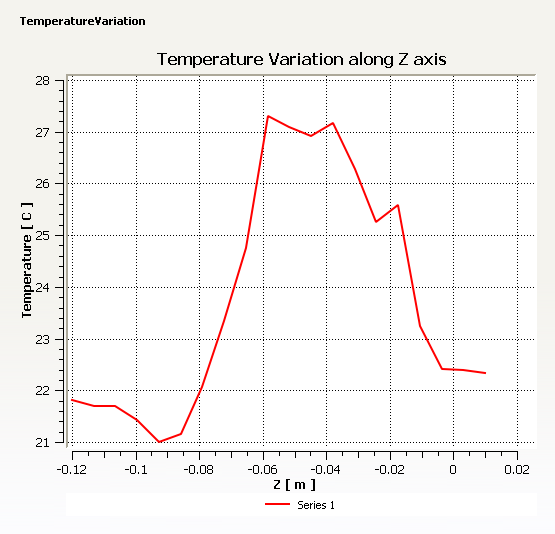

**Note:**

The chart TemperatureVariation is added under the **Report** node of the **Outline** tree.

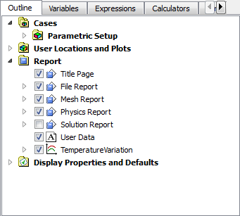

14. Create an **Expression** and **Variable** that can be used for postprocessing.

a. Switch to the **Expressions** tab (located next to the **Outline** tab) and review the list of available expressions.

i. Right-click in the white space and click **New** to create a new expression named VelocityR- atio.

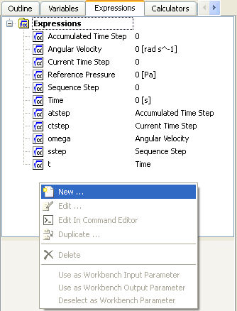

ii. Click **Ok** to access the **Details** view for VelocityRatio.

iii. Right-click the white space in the **Definition** tab to access the **Functions**,**Expressions**,

**Variables**,**Locations** and **Constants** which will be used to create the expression VelocityR- atio.

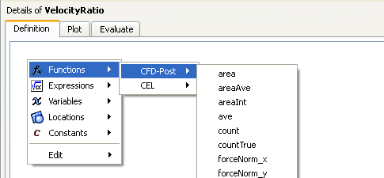

iv. Create the expression as shown in Figure 23.39: Expression for VelocityRatio (p. 499) and click

**Apply**.

**Figure 23.39: Expression for VelocityRatio**

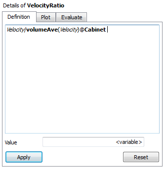

**Note:**

*Velocity* is found under **Variables**,**volumeAve**()@ is found under **Functions** **CFDPost**, and **Cabinet** is found under **Locations** **Other**.

b. Switch to the **Variables** tab and review the list of **Derived**,**Geometric**,**Solution**, and **User**

**Defined** variables.

i. Right-click the white space and click **New** to create a new variable named VelRatio.

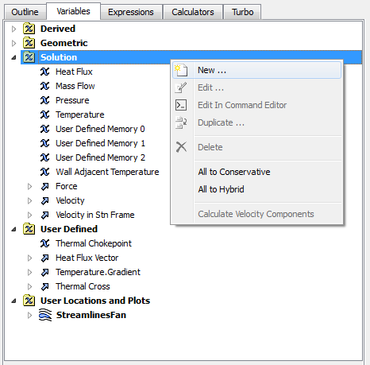

ii. Click **Ok** to access the details view for VelRatio.

iii. Select Expression for the **Method** and select VelocityRatio for the **Expression**.

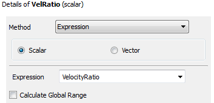

iv. Click **Apply** to create VelRatio.

**Note:**

VelRatio is listed under the **User-Defined** type of **Variables**.

c. You can now plot **Contours**,**Isosurfaces**,**Vectors**,**Charts**, and so on using the new variable **VelRatio**.

### 23.8. Step 5: Comparison Study

1. Open a new Ansys CFD-Post session

a. Go to **File** **Close CFD Post** to close the existing Ansys CFD-Post session.

b. In the Ansys Workbench project schematic, right-click the **Solution** cell of the parametric setup

component to transfer the solution data to a new **Results** component, as shown in Fig- ure 23.40: Creation of New Results Component (p. 502).

c. Rename the **Results** component to Comparison Study.

**Figure 23.40: Creation of New Results Component**

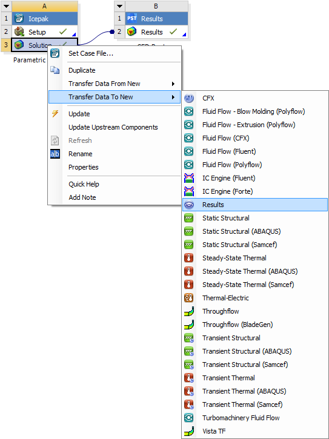

d. Double-click the **Results** cell of Comparison Study to launch a new Ansys CFD-Post session.

**Note:**

As before, Ansys CFD-Post automatically reads in the most recent solution set (trial 004).

2. As shown in Figure 23.41: The Load Results Panel (p. 503), go to **File** **Load Results** to load an additional solution set. Navigate to the ~ice-cfdpost_files/dp0/IPK/Icepak/IcepakProj folder to pick trial001.cfd.dat as the second solution set for the comparison study.

**Note:**

The root directory ~ice-cfdpost_files refers to the project folder in which you have saved the Ansys Workbench project for this tutorial.

**Figure 23.41: The Load Results Panel**

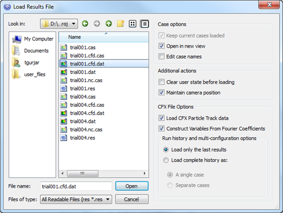

3. Set up the display of the two solution sets.

a. Synchronize the camera and the visibility in the displayed views by selecting the corresponding buttons from the **Shortcuts Toolbar** located directly above the models in the 3D viewer displays.

b. **Rotate**,**Zoom**, or **Pan** one of the displays and confirm that the other display follows suit.

c. Using the **Shortcuts Toolbar**, modify the display to a landscape view (switch from

to

)

4. As before, go to **Insert** **Location** **Surface Group** and create a **Surface Group** named BoardAndComponents.

**Important:**

The **Surface Group** in this Ansys CFD-Post session should include the board and compon- ent surfaces from *both* solution sets. Use the **Location Selector** to select all the objects excluding the cabinet objects for each list. The easiest way to do this is to select all the objects from both groups using **Shift** and the left mouse button, then deselecting the cabinet objects from both groups using **Ctrl** and the left mouse button. Click **Apply** to create the surface group.

**Figure 23.42: Display of BoardAndComponents**

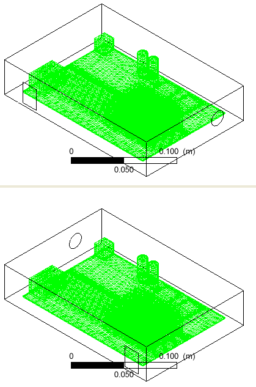

5. Deselect BoardAndComponents from **User Locations and Plots**.

6. As before, go to **Insert** **Contour** and create a new contour object named TemperatureCon- tours and set its **Locations** to the BoardAndComponents **Surface Group**. Set **Variable** to **Temperature** and click **Apply**.

7. Update the display of the **Default Legend View** (each display will need to be updated individually) as before.

**Figure 23.43: Display of Legend View**

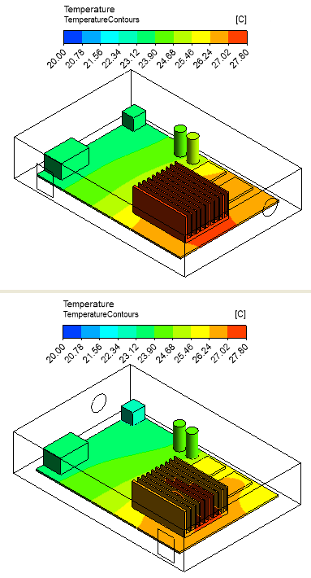

8. Go to **Insert** **Streamline** and create a **Streamline** object named StreamlinesFans and edit the **Details** as below:

a. **Geometry** tab: Select fan1_minx from both solution sets for **Start From** and set **# of Points** to 50.

**Tip:**

Click the button **...** next to **Start From** to select both fan1_minx objects more easily.

b. **Color** tab: Set **Mode** to Variable and select Temperature for **Variable**.

c. **Symbol** tab: Select **Show Symbols** and **Show Streams**. Set the **Interval** to 0.005 s.

d. Click **Apply**.

**Figure 23.44: Display of Streamlines Comparison**

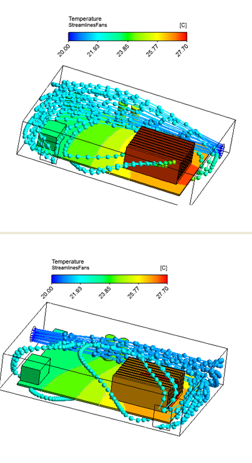

e. Perform a detailed comparison study using the various features (**Isosurface**,**Plane**,**Animation**

etc.) discussed earlier in this tutorial.

### 23.9. Step 6: Summary

In this tutorial, you learned how to import an Ansys Icepak project from a TZR file in Ansys Workbench. You then learned how to use a solution that was solved in Ansys Icepak and postprocess it in Ansys CFD-Post using various postprocessing options. You also learned how to compare parametric solutions side-by-side in Ansys CFD-Post.

---

## Chapter 24: High Density Datacenter Cooling

### 24.1. Introduction

This tutorial demonstrates how to model a datacenter using Ansys Icepak.

In this tutorial, you will learn how to:

• Use macros to create computer room air conditioning units (CRACs), server cabinets, power distribution units (PDUs), and perforated floor tiles in the datacenter.

• Organize the model using groups.

• Include effects of gravity and turbulence in the simulation.

• Define object-specific meshing parameters.

• Create contours, particle traces, iso-surfaces to better understand the airflow patterns and temperature stratification within the datacenter space.

**Note:**

Mesh counts and solution results may differ slightly due to enhancements to the meshing algorithm and Fluent solver, respectively.

### 24.2. Prerequisites

This tutorial assumes that you are familiar with the menu structure in Ansys Icepak and that you have solved or read the tutorial Finned Heat Sink (p. 5) of this guide. Some steps will not be shown explicitly.

### 24.3. Problem Description

This tutorial considers a 1200 sq. ft. datacenter with a slab to slab height of 12 ft as shown in Fig- ure 24.1: Geometry of the Datacenter Model (p. 510). The datacenter consists of a 1.5 ft underfloor plenum and a 2 ft ceiling plenum. The CRACs discharge cold air into the underfloor plenum. The cold air enters the main datacenter space mainly through the perforated floor tiles and returns back to the air conditioning units as shown in Figure 24.2: Expected Airflow Path (p. 510). The cooling load, as sum-

marized in Table 24.1: Size and Capacity of Heat Sources in Datacenter (p. 510) corresponds to the heat output from the server cabinets and the PDUs.

**Table 24.1: Size and Capacity of Heat Sources in Datacenter**

| Heat Source | Size | Power |
| --- | --- | --- |
| Server Cabinet | 2 ft x 3 ft x 7 ft | 3000 W |
| High Density | 2 ft x 3 ft x 7 ft | 7000 W |
| PDU | 4 ft x 2 ft x 5 ft | 3600 W |

**Figure 24.1: Geometry of the Datacenter Model**

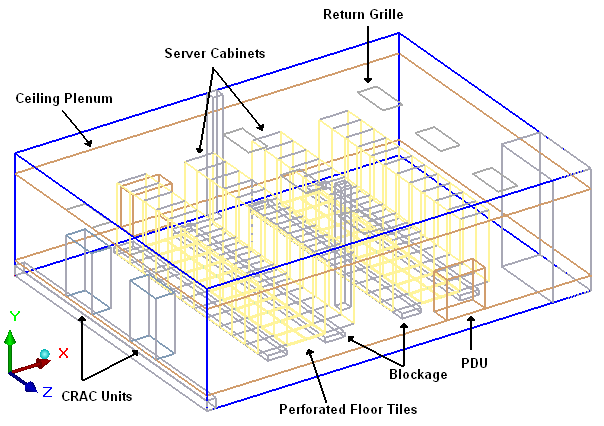

**Figure 24.2: Expected Airflow Path**

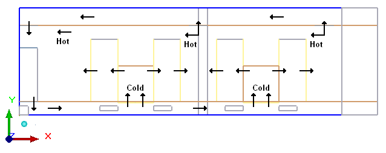

### 24.4. Step 1: Create a New Project

1. Start Ansys Icepak, as described in Starting Ansys Icepak in the Icepak User’s Guide.

2. Click **New** in the **Welcome to Icepak** panel to start a new Ansys Icepak project.

3. Specify a name for your project such as datacenter and click **Create**.

Ansys Icepak creates a default cabinet with the dimensions 1 m 1 m 1 m, and displays the cabinet in the graphics window.

**Note:**

You can rotate the cabinet around a central point using the left mouse button, or you can translate it to any point on the screen using the middle mouse button. You can zoom into and out from the cabinet using the right mouse button. To restore the cabinet to its default orientation, select **Home position** in the **Orient** menu.

### 24.5. Step 2: Set Preferences

1. Go to **Edit** **Preferences**. The **Preferences** panel opens.

2. Go to **Display** in the **Options** node.

a. Select **Float** for the **Color legend data format** and enter 2 under **Numerical display precision**.

3. Go to **Editing** in the **Options** node.

a. Set the **Default dimensions** to **Start/length**.

4. Go to **Object types** in the **Options** node.

a. Turn off **Decoration** for all object types and update line **Width** to 2 for blocks, fans, openings, plates, resistances and grilles.

**Figure 24.3: The Preferences Panel - Object types**

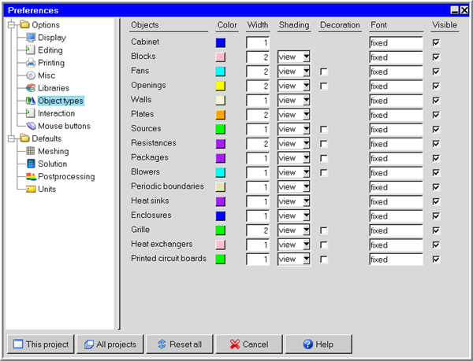

5. Go to **Units** in the **Defaults** node.

a. Click **Set all to Imperial**.

b. Click **This project** to apply the preferences to this project.

### 24.6. Step 3: Build the Model

To build the model, you will first resize the cabinet to its proper size. Then you will create the features of the datacenter, including CRACs (2), server cabinets (44), perforated floor tiles (44), raised floor (1), dropped ceiling (1), return grilles (8), PDUs (2), cable trays (4), columns (2) and miscellaneous blockage (1).

1. Resize the default cabinet.

a. Select the **Cabinet** in the **Model** tree and specify the following in the object geometry window:

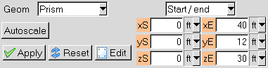

b. Press **Apply** to resize the cabinet.

c. Click the **Isometric view** button (

) to show a scaled-to- fit isometric view of the cabinet.

) and then the **Scale to fit** button (

**Note:**

The walls of the cabinet are adiabatic and do not participate in radiation by default. Radiation will not be considered for this analysis.

2. Create the raised floor.

a. Click the **Create plates** button (

).

Ansys Icepak creates a free rectangular plate in the x-y plane in the center of the cabinet. You need to change the orientation and size of the plate and its location within the cabinet.

b. In the object geometry window:

i. Set the **Name** to raisedfloor.

ii. Change the **Plane** to xz.

iii. Enter the following dimensions:

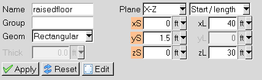

iv. Press **Apply** to resize and rename the object.

3. Create the first CRAC unit.

a. Go to **Macros** **Geometry** **Data Center Components** **CRAC** to open the **Create CRAC** panel.

b. Enter the dimensions as shown below in Figure 24.4: The Create CRAC Panel (p. 514).

c. Make sure the **Flow direction** is -Y.

d. Select **Mass flow rate** and input a value of 15.9 lbm/s.

e. Specify a **Supply temperature** of 55 F.

**Figure 24.4: The Create CRAC Panel**

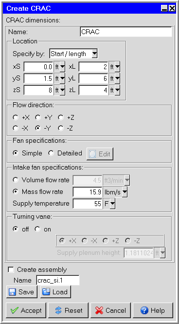

**Note:**

**Mass flow rate** has units of **lbm/s**.

f. Press **Accept** to create the **CRAC** unit.

**Figure 24.5: The CRAC Unit in the Graphics Window**

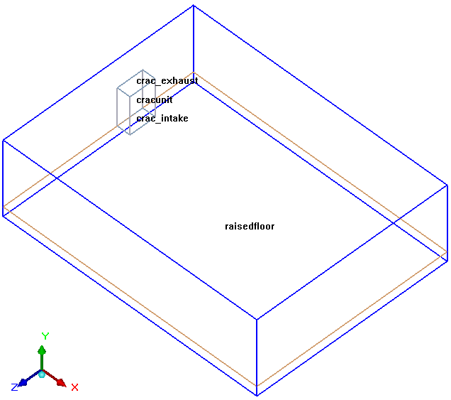

4. Set the per-object meshing parameters for the fans crac_intake and crac_exhaust.

a. Open the **Mesh control** panel by clicking the **Generate mesh** button (

).

b. In the **Local** tab, check **Object params** and press **Edit**.

i. In the **Per-object meshing parameters** panel,**Ctrl**+left click crac_exhaust and crac_intake to select both objects.

ii. Check the **Use per object parameters** option.

iii. Check the **X count** and **Z count** options and specify a **Requested** value of 4 for both options.

**Figure 24.6: Per-object Meshing Parameters for the Fans**

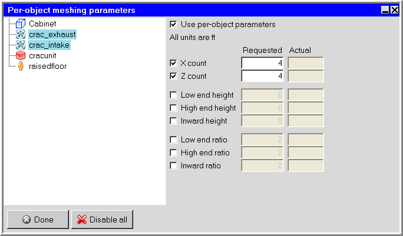

c. Click **Done** to close the **Per-object meshing parameters** panel.

d. Click **Close** to close the **Mesh control** panel.

5. Create a new group for the CRAC unit.

a. Select all the CRAC objects by **Shift**+left clicking cracunit and then crac_exhaust in the **Model manager** window.

b. Right click one of the selected objects and go to **Create** and then **Group**.

c. In the **Create group** panel, enter CRACs in the **Name for new group** text field.

d. Press **Done** to create the new group.

6. Create the second CRAC unit.

a. Expand the **Groups** node in the **Model manager** window.

b. Right click **CRACs** and select **Copy**.

c. In the **Copy group** panel, check **Group name** and enter CRACs.

d. Check **Translate** and set the **Z offset** to 10 ft.

**Figure 24.7: The Copy Group CRACs Panel**

e. Press **Apply** and **Done** to copy the CRAC unit and close the panel.

**Figure 24.8: Two CRAC Units in the Graphics Window**

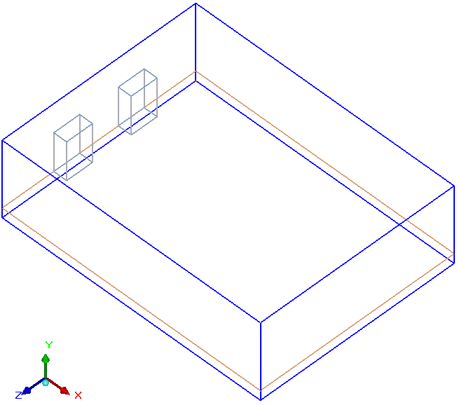

f. Now may be a good time to **Save** the project (

).

7. Create a row of server racks.

a. Go to **Macros** **Geometry** **Data Center Components** **Rack (Front to Rear)**.

b. Input the dimensions as show below in Figure 24.9: The Create Rack (Front to Rear) Panel (p. 519).

c. Set the **Flow direction** to -X.

d. Specify a **Heat load** of 3000 W.

e. Specify a **Volume flow** of 450 cfm.

f. Set the **Number of racks** to 11.

g. Under **Create additional racks along** select +Z.

**Figure 24.9: The Create Rack (Front to Rear) Panel**

h. Press **Accept** to create the server racks.

**Figure 24.10: Row of Server Racks in the Graphics Window**

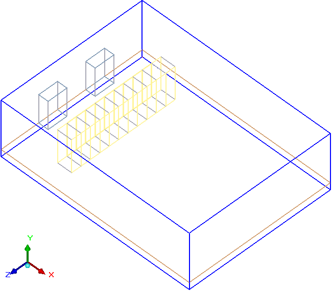

**Note:**

The volumetric flow rate input for the recirculation opening is converted by Ansys Icepak to a mass flow rate input to the computational stage of the analysis. For this conversion, Ansys Icepak uses the density specified for Air in the materials panel as shown below.

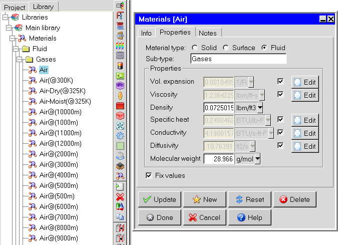

8. Create a new group for the server racks.

a. Select all the server rack objects by **Shift** + left clicking rack and then rack-opns.10 in the **Model manager** window.

b. Right click one of the selected objects and go to **Create** and then **Group**.

c. In the **Create group** panel, enter RACKs in the **Name for new group** text field.

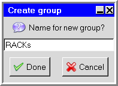

d. Press **Done** to create the new group.

9. Create a second row of server racks.

a. Right click **RACKs** in the **Groups** node and select **Copy**.

b. In the **Copy group** panel, check **Group name** and enter RACKs.

c. Check **Rotate** and **Translate** in the **Operations** group box.

d. Set the **Axis** to Y and the **Angle** to 180.

e. Set the **X offset** to 7 ft.

**Figure 24.11: The Copy Group RACKs Panel**

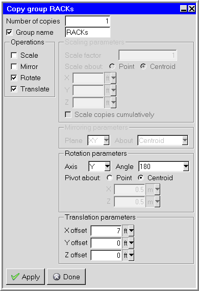

f. Press **Apply** and **Done** to copy the row of server racks and close the panel.

**Figure 24.12: Two Rows of Server Racks in the Graphics Window**

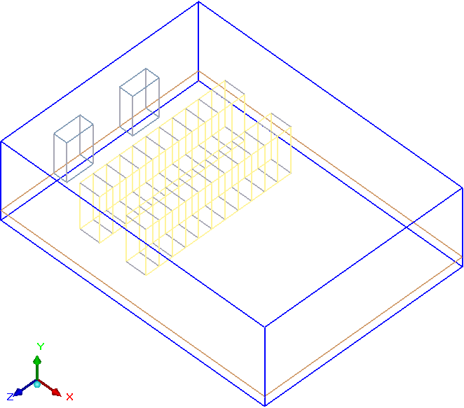

10. Create a row of high density server racks.

a. Go to **Macros** **Geometry** **Data Center Components** **Rack (Front to Rear)**.

b. Enter hdrack in the **Name** text field.

c. Input the dimensions as show below in Figure 24.13: The Create Rack (Front to Rear) Panel (p. 524).

d. Set the **Flow direction** to -X.

e. Specify a **Heat load** of 7000 W.

f. Specify a **Volume flow** of 1000 cfm.

g. Set the **Number of racks** to 11.

h. Under **Create additional racks along** select +Z.

**Figure 24.13: The Create Rack (Front to Rear) Panel**

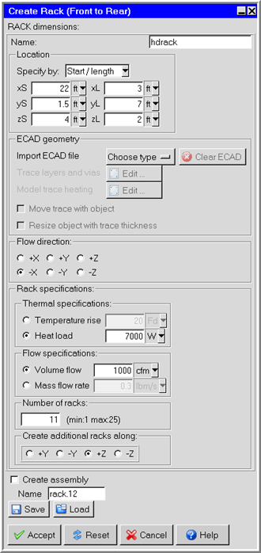

i. Press **Accept** to create the high density server racks.

11. Create a new group for the high density server racks.

a. Select all the high density server rack objects by **Shift**+left clicking hdrack and then hdrack- opns.10 in the **Model manager** window.

b. Right click one of the selected objects and go to **Create** and then **Group**.

c. In the **Create group** panel, enter HDRACKs in the **Name for new group** text field.

d. Press **Done** to create the new group.

12. Create a second row of high density server racks.

a. Right click **HDRACKs** in the **Groups** node and select **Copy**.

b. In the **Copy group** panel, check **Group name** and enter HDRACKs.

c. Check **Rotate** and **Translate** in the **Operations** group box.

d. Set the **Axis** to Y and the **Angle** to 180.

e. Set the **X offset** to 7 ft.

f. Press **Apply** and **Done** to copy the row of high density server racks and close the panel.

**Figure 24.14: Two Rows of High Density Server Racks in the Graphics Window**

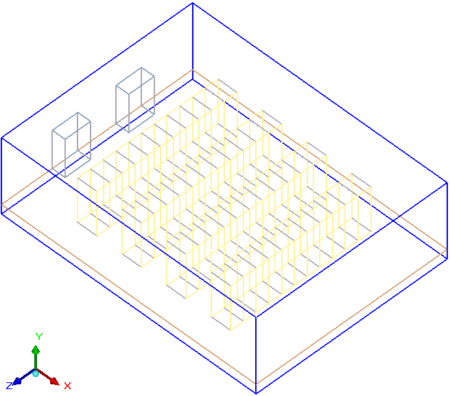

13. Create a row of perforated tiles.

a. Go to **Macros** **Geometry** **Data Center Components** **Tile**.

b. Set the **Number of tiles** to 11.

c. Enter the dimensions as show below in Figure 24.15: The Create Tile Panel (p. 526).

d. Choose +Z.

e. Enter 0.35 for **Uniform** under **% Open area**.

**Figure 24.15: The Create Tile Panel**

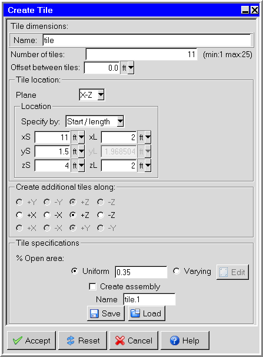

f. Press **Accept** to create the tiles.

**Figure 24.16: Row of Tiles in the Graphics Window**

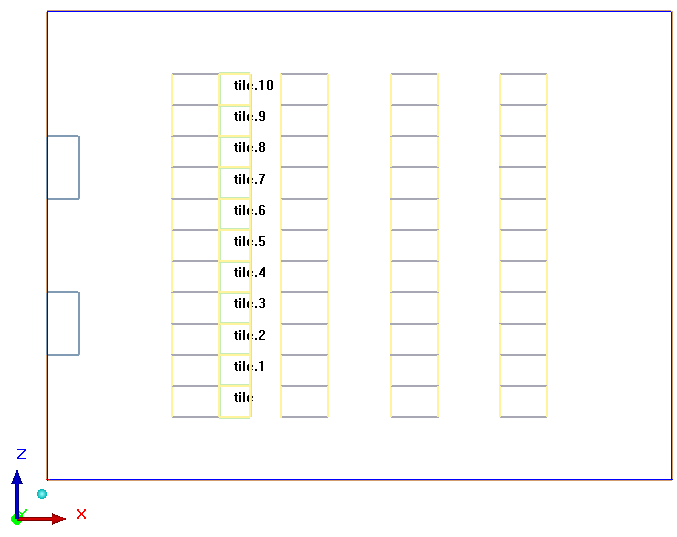

14. Set the per-object meshing parameters for all the resistance objects.

a. Open the **Mesh control** panel by clicking the **Generate mesh** button (

).

b. In the **Local** tab, press **Edit** next to the **Object params** option.

i. In the **Per-object meshing parameters** panel,**Shift**+left click tile and then tile.10 to select all the resistance objects.

ii. Check the **Use per object parameters** option.

iii. Check the **X count** and **Z count** options and specify a **Requested** value of 4 for both options.

iv. Check the **Y count** option and specify a **Requested** value of 3.

**Figure 24.17: Per-object Meshing Parameters for the Tiles**

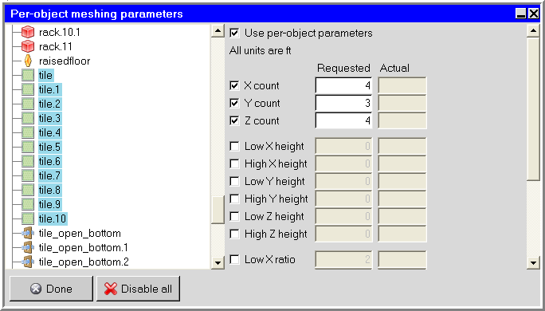

c. Click **Done** to close the **Per-object meshing parameters** panel.

d. Click **Close** to close the **Mesh control** panel.

15. Create a new group for the perforated tiles.

a. Select all the tile objects by **Shift**+left clicking tile and then tile_open_bottom.10 in the **Model manager** window.

b. Right click one of the selected objects and go to **Create** and then **Group**.

c. In the **Create group** panel, enter TILEs in the **Name for new group** text field.

d. Press **Done** to create the new group.

16. Create three more rows of perforated tiles.

a. Right click **TILEs** in the **Groups** node and select **Copy**.

b. In the **Copy group** panel, check **Group name** and enter TILEs.

c. Check **Translate** and set the **X offset** to 2 ft.

d. Press **Apply** and **Done** to copy the row of perforated tiles and close the panel.

e. Right click **TILEs** in the **Groups** node again and select **Copy**.

f. In the **Copy group** panel, check **Group name** and enter TILEs.

g. Check **Translate** and set the **X offset** to 14 ft.

h. Press **Apply** and **Done** to copy both rows of perforated tiles and close the panel.

**Figure 24.18: Four Rows of Tiles in the Graphics Window**

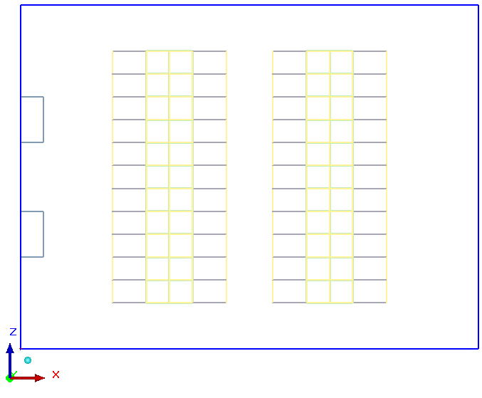

17. Create the ceiling plenum.

a. Click the **Create plates** button (

).

b. In the object geometry window:

i. Set the **Name** to ceilingplenum.

ii. Change the **Plane** to xz.

iii. Enter the following dimensions:

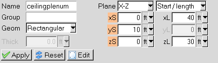

iv. Press **Apply** to resize and rename the object.

18. Create a return grille.

a. Click the **Create grille** button (

).

b. Double click the grille.1 object in the **Model manager** window to open the **Grille** panel.

c. In the **Info** tab, enter ceiling-return under **Name** and enter CEILING-RETURN under **Groups**.

d. In the **Geometry** tab, set the **Plane** to X-Z and enter the following dimensions:

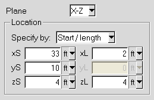

e. In the **Properties** tab, set the **Free area ratio** to 0.5.

f. Press **Done** to apply the settings and close the panel.

19. Create two rows of return grilles.

a. Right click **CEILING-RETURN** in the **Groups** node and select **Copy**.

b. Set the **Number of copies** to 2.

c. In the **Copy group** panel, check **Group name** and enter CEILING-RETURN.

d. Check **Translate** and set the **Z offset** to 9 ft.

e. Press **Apply** and **Done** to copy the return grille and close the panel.

f. Right click **CEILING-RETURN** in the **Groups** node again and select **Copy**.

g. In the **Copy group** panel, check **Group name** and enter CEILING-RETURN.

h. Check **Translate** and set the **X offset** to -14 ft.

i. Press **Apply** and **Done** to copy the row of return grilles and close the panel.

**Figure 24.19: Two Rows of Return Grilles in the Graphics Window**

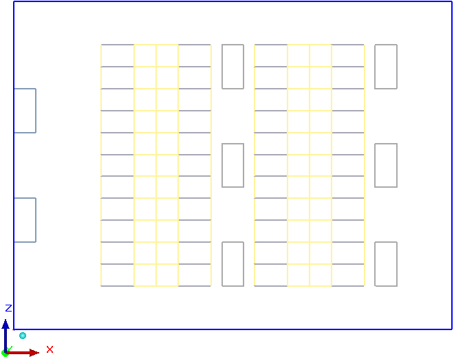

20. Create two more return grilles.

a. Click the **Create grille** button (

).

b. Double click the newly created object to open the **Grille** panel.

c. In the **Info** tab, enter ceiling-return-crac1 under **Name** and select CEILING-RETURN from the **Groups** drop-down list.

d. In the **Geometry** tab, set the **Plane** to X-Z and enter the following dimensions:

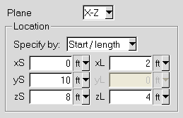

e. In the **Properties** tab, set the **Free area ratio** to 0.5.

f. Press **Done** to apply the settings and close the panel.

g. Right click the vent ceiling-return-crac1 from the **Model** tree and select **Copy**.

h. In the **Copy group** panel, check **Group name** and enter CEILING-RETURN.

i. Check **Translate** and set the **Z offset** to 10 ft.

j. Press **Apply** and **Done** to copy the return grille and close the panel.

k. Right click ceiling-return-crac1.1 and **Rename** the object to ceiling-return-crac2.

**Figure 24.20: Two CRAC Return Grilles in the Graphics Window**

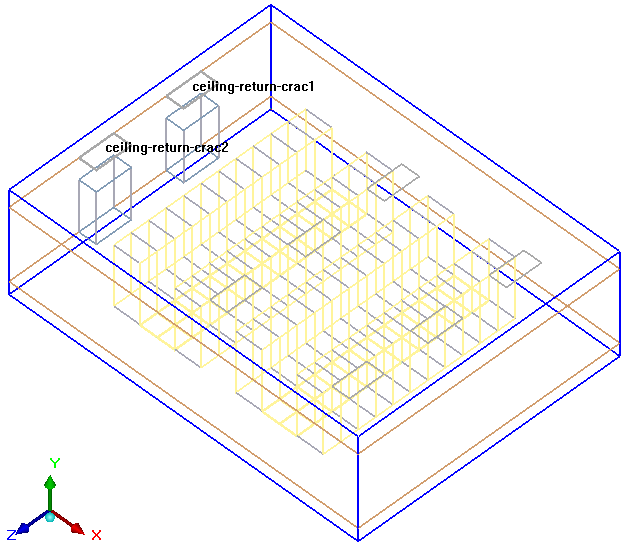

21. Set the per-object meshing parameters for the return grilles.

a. Open the **Mesh control** panel by clicking the **Generate mesh** button (

).

b. In the **Local** tab, press **Edit** next to the **Object params** option.

i. In the **Per-object meshing parameters** panel,**Shift**+left click ceiling-return and then ceiling-return.3 to select all the return grilles.

ii. Check the **Use per object parameters** option.

iii. Check the **X count** and **Z count** options and specify a **Requested** value of 4 for both options.

**Figure 24.21: Per-object Meshing Parameters for the Return Grilles**

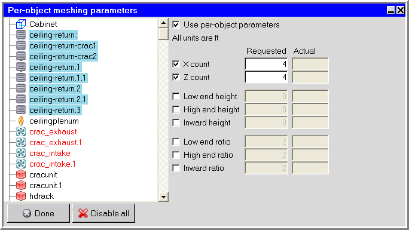

c. Click **Done** to close the **Per-object meshing parameters** panel.

d. Click **Close** to close the **Mesh control** panel.

22. Create a PDU.

a. Go to **Macros** **Geometry** **Data Center Components** **PDU** to open the **Create PDU** panel.

b. Enter the dimensions as shown below in Figure 24.22: The Create PDU Panel (p. 534).

c. Set the **PDU flow direction** to +Y.

d. Set the **Heat output** to 3600 W.

e. Set the **Percent open area on top** and the **Percent open area on bottom** to 0.25.

**Figure 24.22: The Create PDU Panel**

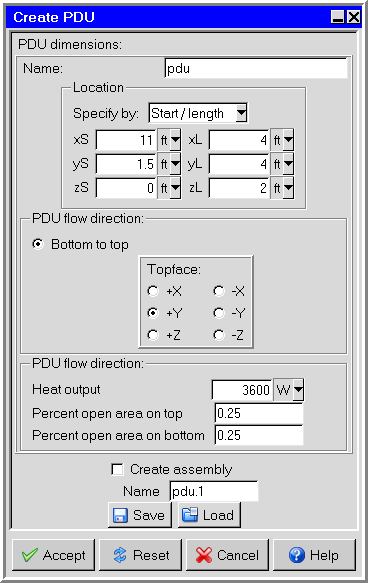

f. Press **Accept** to create the **PDU**.

23. Set the per-object meshing parameters for the grilles pdu_vent_in and pdu_vent_out.

a. Open the **Mesh control** panel by clicking the **Generate mesh** button (

).

b. In the **Local** tab, check **Object params** and press **Edit**.

i. In the **Per-object meshing parameters** panel,**Ctrl**+left click pdu_vent_in and pdu_vent_out to select both objects.

ii. Check the **Use per object parameters** option.

iii. Check the **X count** and **Z count** options and specify a **Requested** value of 4 for both options.

c. Click **Done** to close the **Per-object meshing parameters** panel.

d. Click **Close** to close the **Mesh control** panel.

24. Create a new group for the PDU.

a. Select all the PDU objects by **Shift**+left clicking pdu_unit and then pdu_part4 in the **Model** **manager** window.

b. Right click one of the selected objects and go to **Create** and then **Group**.

c. In the **Create group** panel, enter PDUs in the **Name for new group** text field.

d. Press **Done** to create the new group.

25. Create the second PDU.

a. Right click **PDUs** in the **Groups** node and select **Copy**.

b. In the **Copy group** panel, check **Group name** and enter PDUs.

c. Check **Translate** and set the **X offset** to 14 ft and the **Z offset** to 28 ft.

d. Press **Apply** and **Done** to copy the PDU and close the panel.

**Figure 24.23: Two PDUs in the Graphics Window**

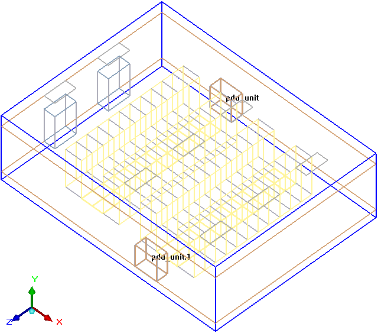

e. Now may be another good time to **Save** the project (

).

26. Create blockages.

a. Click the **Create blocks** button (

).

b. In the object geometry window:

i. Set the **Name** to piping and the **Group** to BLOCKAGE.

ii. Set the **Type** to **Hollow**.

iii. Enter the following dimensions:

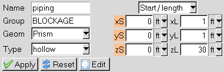

iv. Press **Apply** to resize and rename the object.

c. Click the **Create blocks** button (

).

d. In the object geometry window:

i. Set the **Name** to blockage and the **Group** to BLOCKAGE.

ii. Set the **Type** to **Hollow**.

iii. Enter the following dimensions:

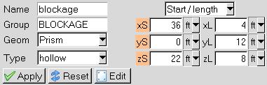

iv. Press **Apply** to resize and rename the object.

27. Create columns.

a. Click the **Create blocks** button (

).

b. In the object geometry window:

i. Set the **Name** to column1 and the **Group** to COLUMNS.

ii. Set the **Type** to **Hollow**.

iii. Enter the following dimensions:

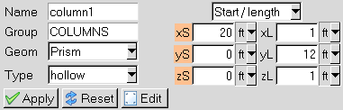

iv. Press **Apply** to resize and rename the object.

c. Click the **Create blocks** button (

).

d. In the object geometry window:

i. Set the **Name** to column2 and the **Group** to COLUMNS.

ii. Set the **Type** to **Hollow**.

iii. Enter the following dimensions:

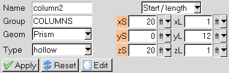

iv. Press **Apply** to resize and rename the object.

28. Create cabletrays.

a. Click the **Create blocks** button (

).

b. In the object geometry window:

i. Set the **Name** to cabletray1 and the **Group** to CABLETRAYS.

ii. Set the **Type** to **Hollow**.

iii. Enter the following dimensions:

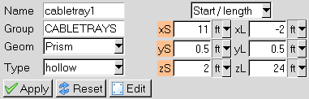

iv. Press **Apply** to resize and rename the object.

c. Create three more cabletrays.

i. Right click **CABLETRAYS** in the **Groups** node and select **Copy**.

ii. In the **Copy group** panel, check **Group name** and enter CABLETRAYS.

iii. Check **Translate** and set the **X offset** to 6 ft.

iv. Press **Apply** and **Done** to copy the cabletray and close the panel.

v. Right click **CABLETRAYS** in the **Groups** node again and select **Copy**.

vi. In the **Copy group** panel, check **Group name** and enter CABLETRAYS.

vii. Check **Translate** and set the **X offset** to 14 ft.

viii.Press **Apply** and **Done** to copy the cabletrays and close the panel.

**Figure 24.24: The Completed Model**

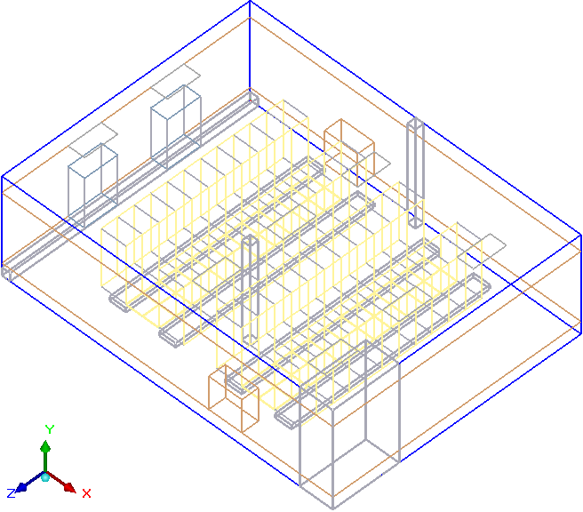

### 24.7. Step 4: Generate a Mesh

1. Click the **Generate mesh** button (

).

2. In the **Mesh control** panel, enter 2 ft, 0.5 ft, and 1 ft for the **Max element size** for x, y, and z, re- spectively. Change the **Minimum gap** values to 1 in, 0.36 in, and 1 in for x, y and z, respectively.

**Figure 24.25: Mesh Control Panel**

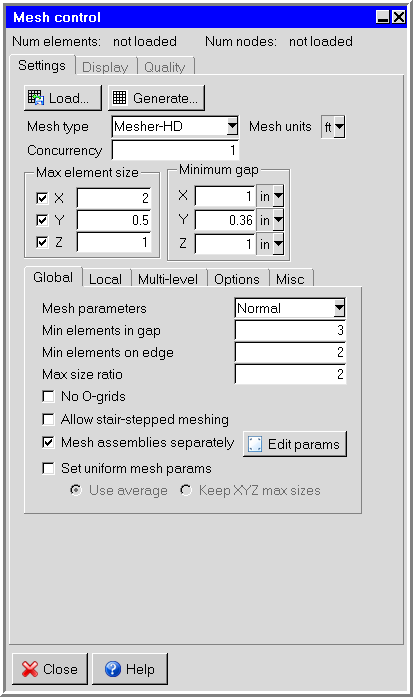

**Note:**

The units for the **Minimum Gap** values are in inches.

3. Click **Generate**.

4. Use the **Display** and **Quality** tabs to view the mesh and check the mesh quality.

5. Click **Close** to close the panel once you have finished viewing the mesh.

### 24.8. Step 5: Create Monitor Points

Create two temperature monitor points for the CRAC fans exhaust fans by dragging crac_exhaust and crac_exhaust.1 from the **Model** node to the **Points** node. Ansys Icepak will automatically monitor values at the centers of these objects. The default setting is to monitor **Temperature**. You can also monitor **Pressure** and/or **Velocity** by double clicking the monitor point in the **Points** folder and choosing which variables to monitor at that location.

**Figure 24.26: Creating Monitor Points**

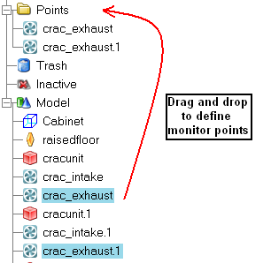

### 24.9. Step 6: Physical and Numerical Settings

1. Go to

**Problem setup**

**Basic parameters**.

a. In the **General setup** tab:

i. Turn **Off** the **Radiation**.

ii. Select **Turbulent** and **Zero equation** for the **Flow regime**.

iii. Enable the **Gravity vector**.

b. In the **Defaults** tab:

i. Select **Mica-Typical** from the **Insulators** section of the **Default solid** drop-down list.

ii. Select **Paint-non-metallic** from the **Paint** section of the **Default surface** drop-down list.

c. In the **Transient setup** tab:

i. Set the initial **Y velocity** to be 0.5 ft/s (a non-zero initial velocity is recommended for problems involving natural convection).

d. In the **Advanced** tab:

i. Select the **Ideal gas law** (recommended for problems involving significant temperature dif- ferences).

ii. Check **Operating density** and keep the default value.

iii. Select **Enable** for Species and keep default values in the **Species definitions** panel.

iv. Press **Accept** to apply the settings and close the panel.

e. Set the RH value for the crac-intake fans.

i. Select the crac-intake fans by **Ctrl**+left clicking crac_intake and then crac_intake.1 in the **Model manager** window.

ii. Right click and select **Edit** from the context menu.

iii. Select **Species** from the **Fan Flow** tab located within the **Fan’s [*multiple*] Properties** tab

and click **Edit**.

iv. In the **Species concentrations** panel, select **RH%** from the concentrations list and enter 50.

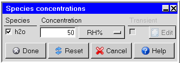

v. Click **Done** to save your settings and close the panel.

vi. Click **Done** in the **Fan’s [*multiple*]** panel.

2. Go to

**Solution settings**

**Basic settings**.

a. Change the **Number of iterations** to 1000 and the **Convergence criteria** for **Energy** to 1e-6.

b. Click **Accept** to apply the settings and close the panel.

3. Go to

**Solution settings**

**Advanced settings**.

a. Set the **Discretization scheme** for **Pressure** as **Body Force**.

b. Set the **Under-relaxation** to 0.2 for **Momentum** and to 0.1 for **Body forces**.

c. Set the **Precision** to **Double**.

d. Click **Accept** to apply the settings and close the panel.

### 24.10. Step 7: Save the Model

Ansys Icepak will save the model for you automatically before it starts the calculation, but it is a good idea to save the model (including the mesh) yourself as well. If you exit Ansys Icepak before you start

the calculation, you will be able to open the project you saved and continue your analysis in a future Ansys Icepak session. (If you start the calculation in the current Ansys Icepak session, Ansys Icepak will simply overwrite your project file when it saves the model.)

**File** **Save project**

### 24.11. Step 8: Calculate a Solution

1. Go to **Solve** **Run solution**.

2. In the **Results** tab, check **CFD Post/Mechanical data**.

3. Click **Start solution**.

Ansys Icepak begins to calculate a solution for the model, and a separate window opens where the solver prints the numerical values of the residuals. Ansys Icepak also opens the Solution residuals graphics display and control window, where it displays the convergence history for the calculation.

Upon completion of the calculation, your residual and monitor plots will look something like Fig- ure 24.27: Solution Residuals (p. 543) and Figure 24.28: Temperature Point Monitors (p. 544). You can zoom in the residual plot by using the left mouse.

**Note:**

The actual values of the residuals may differ slightly on different machines, so your plots may not look exactly the same as Figure 24.27: Solution Residuals (p. 543) and Fig- ure 24.28: Temperature Point Monitors (p. 544).

**Figure 24.27: Solution Residuals**

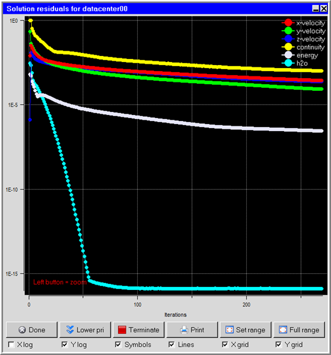

**Figure 24.28: Temperature Point Monitors**

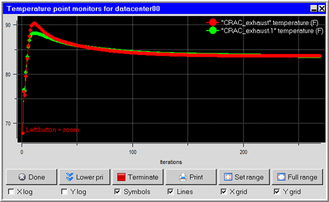

4. Click **Done** in the **Solution residuals** and **Temperature Point monitors** windows to close them.

### 24.12. Step 9: Examine the Results

The objective of this exercise is to consider the airflow patterns and identify problem areas such as hot spots, stagnant zones, and recirculation zones through out the datacenter. You will accomplish this by examining the solution using Ansys Icepak's graphical postprocessing tools.

1. Display contours of temperature on the CRACs, Racks, and PDUs.

a. Click the **Object face** button (

).

b. Enter surface-temp-contours in the **Name** field.

c. In the **Object** drop-down list, expand the **Groups** node and **Ctrl**+left click CRACs, HDRACKs, PDUs, and RACKs, and click **Accept**.

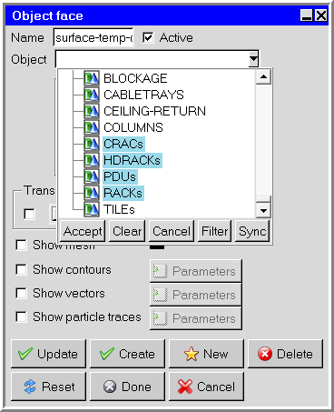

d. Check **Show contours** and click **Create**.

e. Click **Done** to close the panel.

**Figure 24.29: Object Face Temperature Contours**

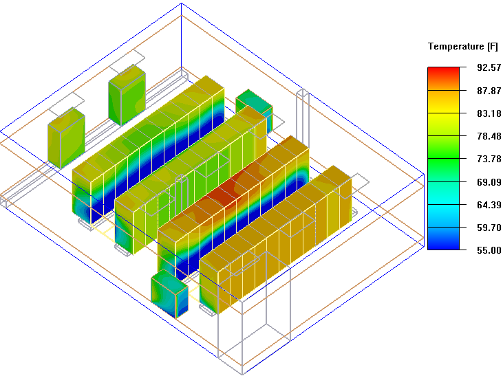

2. Display animated contours of temperature on plane cuts in all 3 coordinate planes.

a. Right click surface-temp-contours under the **Post-processing** node in the **Model manager** window, and make the object face inactive by unchecking **Active** in the context menu.

b. Click the **Plane cut** button (

).

c. Enter plane-temp-contours in the **Name** field.

d. Check **Show contours** and click **Create** to view a plane cut of the temperature contours.

**Figure 24.30: Plane Cut Temperature Contours**

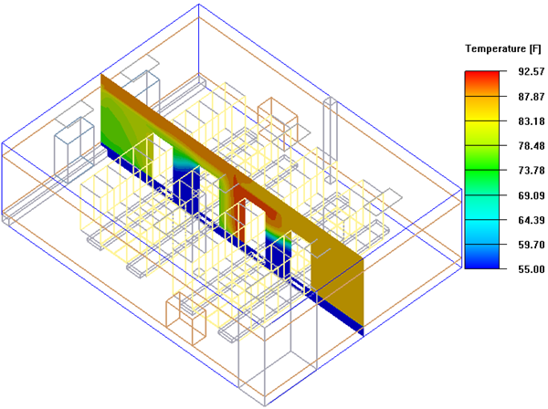

e. Check the **Loop mode** option and click **Animate** to display a loop of the plane cut traversing

from the min z to the max z side of the datacenter.

f. Click **Interrupt** on the progress bar to return to the **Plane cut** panel.

g. Repeat the above procedure for plane cuts in the Y-Z and X-Z planes by changing the **Set**

**position** to **X plane through center** and **Y plane through center** respectively.

h. Click **Done** to close the panel.

3. Display animated contours of temperature on an isosurface.

a. Right click plane-temp-contours in the **Model manager** window and make the plane cut inactive by unchecking **Active** in the context menu.

b. Click the **Isosurface** button (

).

c. Enter iso-temp in the **Name** field.

d. Enter 90 in the **Values** field.

e. Check **Show contours** and click **Create** to view the isosurface of 90°F.

**Figure 24.31: Isosurface of 90°F**

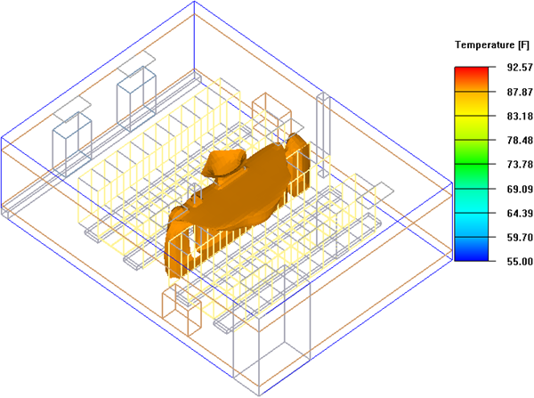

f. To view a loop of isosurfaces from 90°F to 80°F:

i. In the **Animation** group box, enter 90 for **Start**, 80 for **End**, and 10 for **Steps**.

ii. Check the **Loop mode** option and click **Animate**.

iii. Click **Interrupt** on the progress bar to return to the **Isosurface** panel.

g. Click **Done** to close the panel.

4. Display airflow patterns in the datacenter.

a. Right click iso-temp in the **Model manager** window and make the isosurface inactive by un- checking **Active** in the context menu.

b. Click the **Object face** button (

).

c. Enter airflow in the **Name** field.

d. In the **Object** drop-down list, expand the **Groups** node and **Ctrl**+left click CEILING-RETURN,

HDRACKs, PDUs, RACKs, and TILEs, and click **Accept**.

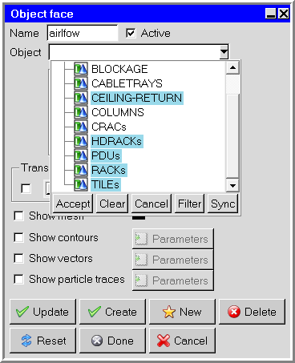

e. Check **Show particle traces** and click **Parameters**.

f. Set the **Point distribution options** to **Mesh points**.

g. Set the **End time** under **Particle options** to 5.

h. Check **Loop mode** under **Animation** and set the **Steps** to 50.

i. Click **Apply** to display the airflow patterns.

**Note:**

Ansys Icepak will take a few moments to generate the airflow patterns.

**Figure 24.32: Particle Traces**

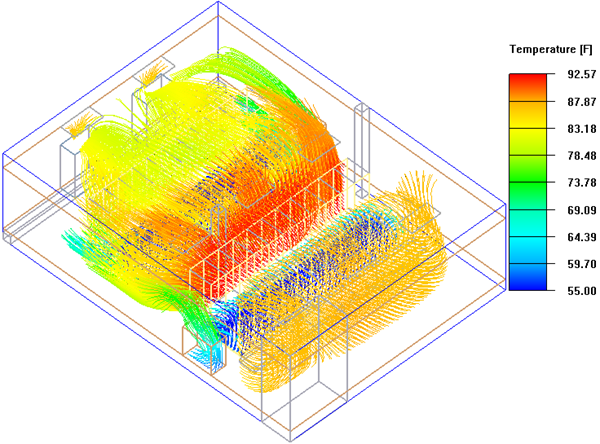

j. Click **Animate** to visualize the airflow patterns in a transient manner.

k. View the animated airflow patterns from various angles from the **Orient** menu.

l. Press **Interrupt** to stop the animation.

m. Click **Done** in the **Object face particles** and **Object face** panels to close them.

n. Right click airflow in the **Model manager** window and make the particle traces inactive by

unchecking **Active** in the context menu.

5. Report the volumetric flow rate distribution at the perforated floor tiles.

a. Go to **Report** **Summary report** to open the **Define summary report** panel.

b. Click **New** to get a new field to define the **Summary report**.

c. In the **Objects** drop-down list, expand the **Groups** node and select TILEs, and click **Accept**.

d. Select **Volume flow** from the **Value** drop-down list and deselect **Comb**.

e. Click **New** to get a new field to define the **Summary report**.

f. In the **Objects** drop-down list select crac_exhaust and crac_exhaust.1, and click **Accept**.

g. Select **Relative humidity** from the **Value** drop-down list and deselect **Comb**.

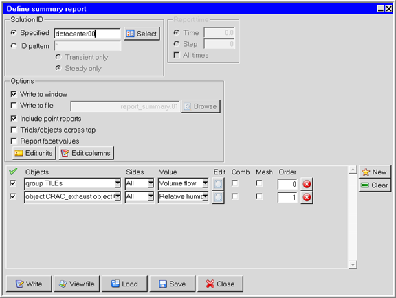

h. Click **Write** to display the summary report.

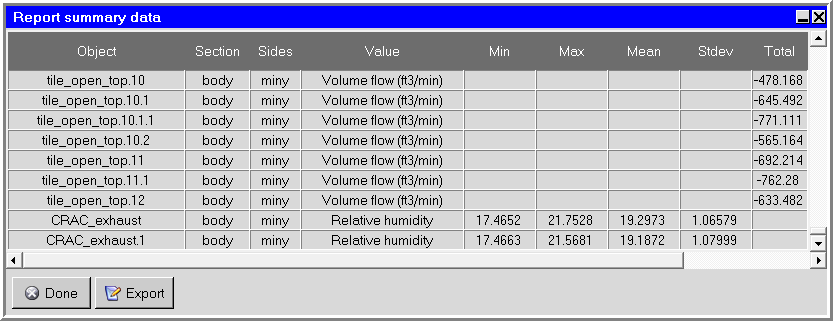

i. Click **Done** to close the **Report summary data** panel.

j. Click **Close** to close the **Define summary report** panel.

6. **Save** (

) the project and **Close** Ansys Icepak.

### 24.13. Step 10: Additional Exercise:Visualize and analyze the results in Ansys CFD-Post

In addition to using the postprocessing tools contained within Ansys Icepak, you can also postprocess using the advanced tools in Ansys CFD-Post through Ansys Workbench. See Postprocessing Using ANSYS CFD-Post (p. 465) for details on how to use the features in Ansys CFD-Post.

### 24.14. Step 11: Summary

In this tutorial, you learned how to model a datacenter using macros, and how to organize a model using groups. You also learned how to use animated postprocessing objects to examine the results.

### 24.13. Step 10: Additional Exercise: Visualize and analyze the results in Ansys CFD-Post

---

## Chapter 25: Design Modeler - Electronics

### 25.1. Introduction

This tutorial demonstrates how to use Ansys DesignModeler to convert a model for analysis in Ansys Icepak.

In this tutorial, you will learn how to:

• Use the **Slice**,**Opening**,**Fan**, and **Simplify** options in Ansys DesignModeler.

• Organize the model using **Parts**.

**Note:**

Mesh counts and solution results may differ slightly due to enhancements to the meshing algorithm and Fluent solver, respectively.

### 25.2. Prerequisites

• Familiarity with the Ansys Workbench interface

• Familiarity with the Ansys Icepak interface

### 25.3. Problem Description

You will convert an imported STEP file for use in Ansys Icepak. Figure 25.1: Comparison of the Geometry in Ansys DesignModeler and Ansys Icepak (p. 554) shows the geometry in Ansys DesignModeler before the conversion and in Ansys Icepak after conversion.

**Figure 25.1: Comparison of the Geometry in Ansys DesignModeler and Ansys Icepak**

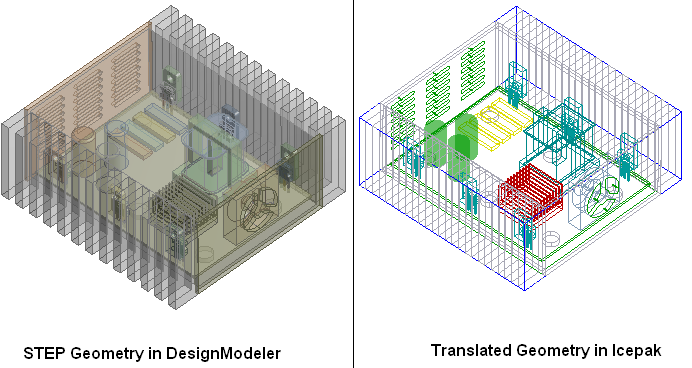

### 25.4. Step 1: Create a New Project

1. Open Ansys DesignModeler through Ansys Workbench.

a. Start a new Ansys Workbench session.

b. Drag a **Geometry** (Ansys DesignModeler) component module from the **Toolbox** and drop it on

the **Project Schematic** window as shown in Figure 25.2: Creating a Geometry Component Mod- ule (p. 555).

c. Rename the **Geometry** component module to STEP Import and DME to Icepak Translation. To rename the title, double-click the title Geometry, or click the down arrow

(

) and select the **Rename** option from the drop-down list.

**Figure 25.2: Creating a Geometry Component Module**

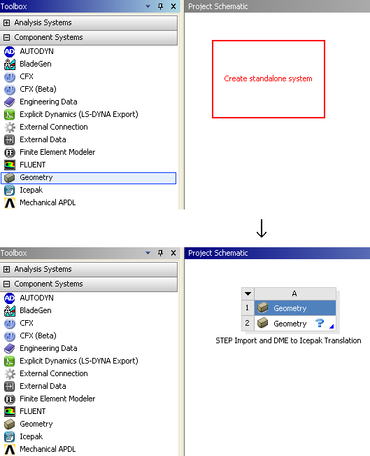

d. Save the project (name the project as DME).

e. Right-click the A2 cell and select **New DesignModeler Geometry**.

### 25.5. Step 2: Build the Model

1. Go to the **Units** menu.

a. Ensure that you have **Millimeter** selected as the desired length unit.

2. Go to **File** **Import External Geometry File** and select DME.stp and press **Open**.

**Note:**

DME.stp can be found on the ANSYS Help Site. The procedure to download this file is described below.

1. Set up a working directory on the computer you will be using.

2. Download the dme.zip file here.

3. Unzip the dme.zip file you have downloaded to your working directory.

3. Click

to create the model.

**Figure 25.3: Imported Model**

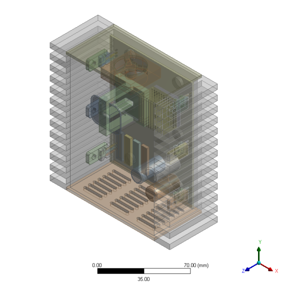

### 25.6. Step 3: Add Shortcuts to the Toolbar

Add a few shortcuts to the toolbar to aid in your design process.

1. Go to **Tools** **Options**

2. In the **Options** panel, go to **DesignModeler** **Toolbars**.

3. Set **Slice**,**Freeze**, and **Electronics** to Yes.

**Figure 25.4: Options Panel**

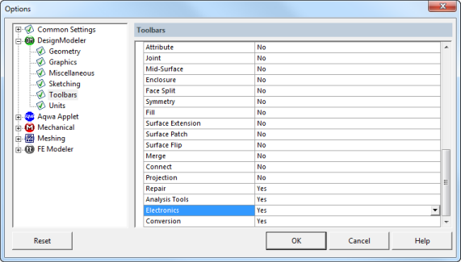

4. Press **OK** to add the options to the toolbar.

**Note:**

• The **Electronics** drop-down menu in the toolbar contains several options:

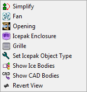

• You can also access the

option from the **Create** menu.

• You can also access the

and **Electronics** options from the **Tools** menu.

### 25.7. Step 4: Edit the Model for Ansys Icepak

1. Check which bodies are already recognized as Ansys Icepak objects.

a. Go to **Electronics** **Show Ice Bodies**. Only bodies with simple geometries recognized as Ansys Icepak objects will be visible.

**Figure 25.5: Bodies Recognized as Ansys Icepak Objects**

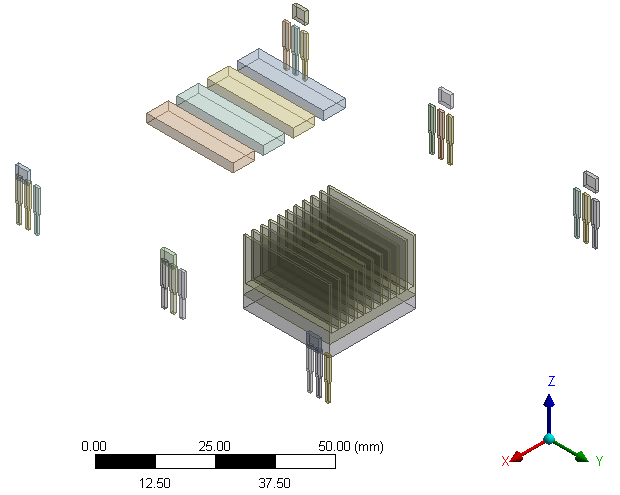

**Note:**

We will not have to make modifications to export these bodies into Ansys Icepak.

b. Go to **Electronics** **Show CAD Bodies**. Only bodies with complex geometries not recognized as Ansys Icepak native objects will be visible.

**Figure 25.6: Bodies not Recognized as Ansys Icepak Objects**

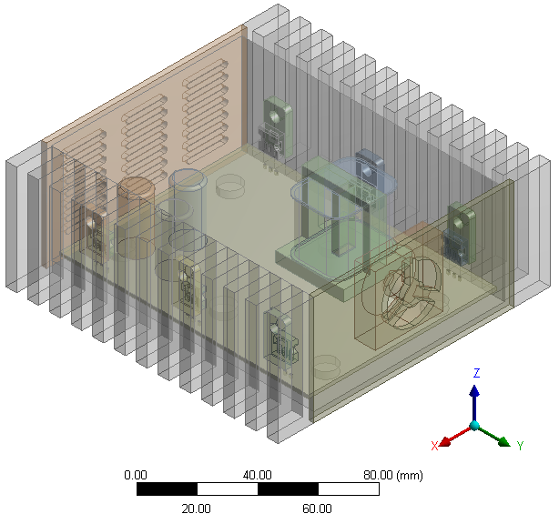

**Note:**

These are the bodies we will have to modify in order to export these bodies into Ansys Icepak.

c. Go to **Electronics** **Revert View** to return to the previous display.

2. Create a **Slice** for one set of fins.

a. In the **Tree Outline**, right-click **Housing** and select **Hide All Other Bodies**.

**Note:**

Expand the node **54 Parts, 54 Bodies** to see the **Housing** node.

b. Select

from the **Shortcuts** toolbar.

c. In the **Details** view, set the **Slice** feature name to FinsSlice1.

d. Select Slice by Surface for **Slice Type**.

e. Click the field to the right of **Target Face** and select the one of faces at the base of the fins, as

shown in Figure 25.7: FinsSlice1 Face Selection (p. 560) and click **Apply**.

**Figure 25.7: FinsSlice1 Face Selection**

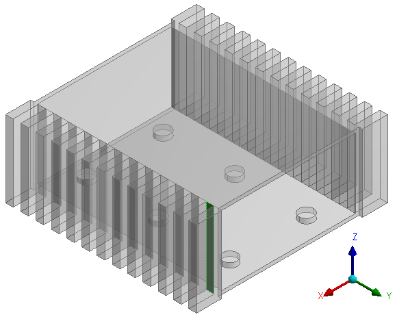

**Note:**

If you cannot select the face, try using the **Model Faces** selection filter (

).

f. Make sure **Slice Targets** is set to Selected Bodies.

g. Click the field to the right of **Bodies** and select the **Housing** body from the **Tree Outline**.

h. Click **Apply** and then

.

i. Verify that the **Details** view for **FinsSlice1** resembles Figure 25.8: Details View of FinsSlice1 (p. 560).

**Figure 25.8: Details View of FinsSlice1**

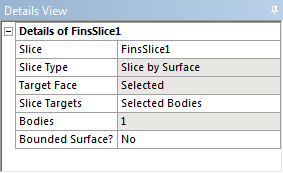

3. Likewise, create a **Slice** for the other set of fins.

a. Use the procedure described above on the other set of fins and name the second **Slice** FinsS- lice2.

**Note:**

The **Housing** should now appear in several parts in the **Tree Outline**. When se- lecting **Hide All Other Bodies**, select all of the **Housing** nodes first.

**Note:**

Make sure that the **Bodies** selection is the larger section of the housing containing the fins as shown in Figure 25.9: FinsSlice2 Bodies Selection (p. 561).

**Figure 25.9: FinsSlice2 Bodies Selection**

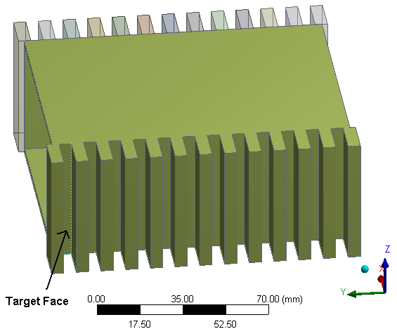

4. Create **Parts** for the sliced fins.

**Note:**

The **Parts** will become **Assemblies** in Ansys Icepak.

a. Press **+Y** on the **Triad** (the axes) to get a clear view of the fins.

b. Select **Box Select** from the **Shortcuts** toolbar.

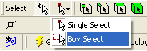

c. Select the **Bodies** selection filter (

).

d. Drag the bounding box around one set of fins, and rotate the model to make sure that all the

fins are selected as shown in Figure 25.10: Selecting a Row of Fins (p. 562) (you should have 13 bodies selected).

**Figure 25.10: Selecting a Row of Fins**

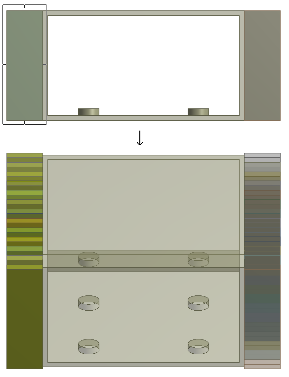

e. Right-click anywhere in the **Model View** and select **Form New Part**.

f. In the **Details** view, set the **Part** feature name to Fins1 and press **Enter** on the keyboard.

g. Repeat steps **a** to **f** for the other set of fins, except name the part Fins2.

5. Simplify the **Housing** body between the parts **Fins1** and **Fins2**.

a. Select the **Housing** body in the **Tree Outline**.

**Important:**

Note that this **Housing** body is located outside the parts **Fins1** and **Fins2**.

b. Go to **Electronics** **Simplify**.

c. In the **Details** view, rename the feature **HousingSimplify** and then press **Enter**.

d. In the **Simplification Type** field, select **Level 1** from the drop-down list.

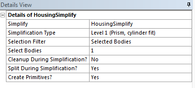

e. Click **Generate** to finish the simplify operation.

6. Create openings for the fan and the back panel.

a. Show all bodies again by right-clicking one of the objects in the **Tree Outline** and clicking **Show** **All Bodies**.

b. Use the **Single Select** option now along with the **Faces** selection filter.

c. Go to the **+Y** view and select the face as shown in Figure 25.11: FanOpenings Face Selec- tion (p. 564).

**Figure 25.11: FanOpenings Face Selection**

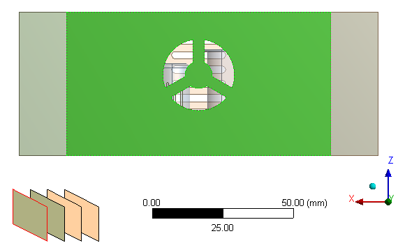

d. Go to the **–Y** view.

e. While holding down the **Ctrl** key, select the face as shown in Figure 25.12: BackOpenings Face

Selection (p. 564).

**Figure 25.12: BackOpenings Face Selection**

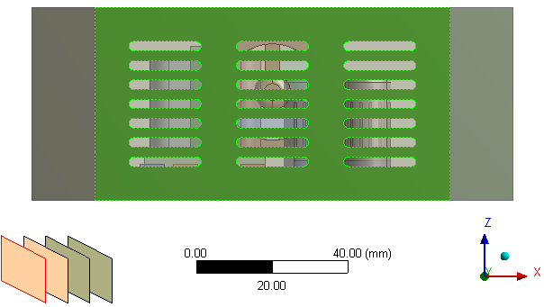

f. Go to **Electronics** **Opening**.

g. In the **Details** view, click **Apply** in the **Faces** field. You should have 2 to the right of **Faces**.

h. Click **Generate** to finish creating the feature.

7. Create a **Fan**.

a. Right-click the **Fan** body in the **Tree Outline** and select **Hide All Other Bodies**.

**Note:**

If you cannot view the object correctly, press **Zoom to Fit** (

).

b. Go to **Electronics** **Fan**.

c. In the **Details** view, set the **Fan** name to FanGeom.

d. Click the field to the right of **Body To Extract Fan Data**, select the entire fan body and click

**Apply**.

e. Click the field to the right of **Hub/Casing Faces** and select the faces as shown in Fig-

ure 25.13: Hub/Casing Faces Selection (p. 565).

**Figure 25.13: Hub/Casing Faces Selection**

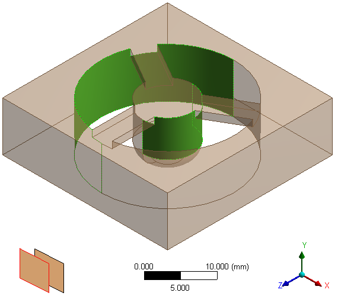

**Note:**

You can select multiple faces by simultaneously holding down **Ctrl** and clicking the objects.

f. Click **Apply** and

.

**Note:**

Although it may seem like there was no change, this step creates a fan object in Ansys Icepak. To confirm this, you can go to **Electronics** **Show Ice Bodies** and check if the fan is present.

g. Add the fan to the Front-Panel part.

i. In the **Tree Outline**, select the Front-Panel part and then simultaneous press **Ctrl** and click the **Fan** object.

ii. Right-click the **Fan** object and select **Form New Part**.

iii. In the **Details** view, rename the Front-Panel **Part** to Front-Panel-Fan.

8. Perform a **Simplify** operation on the **Housing**.

a. Show all bodies again by right-clicking one of the objects in the **Tree Outline** and clicking **Show** **All Bodies**

b. Go to **Electronics** **Simplify**.

c. In the **Details** view, set the **Simplify** feature name to HousingFrontBack.

d. In the field to the right of **Simplification Type**, select Level 1.

e. Click the field to the right of **Select Bodies** and select the front and the rear panels of the

**Housing** as shown in Figure 25.14: HousingFrontBack Bodies Selection (p. 567).

**Tip:**

Again, simultaneously press **Ctrl** and click each panel in order to make both selections.

**Figure 25.14: HousingFrontBack Bodies Selection**

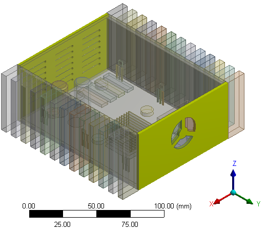

f. Click **Apply** and

.

9. Perform a **Simplify** operation on the **PWB** and the **T0220** objects.

a. Select all the **Housing**,**Fin**,**Panel**,**Opening**, and **Fan** objects from the bottom of the **Tree** **Outline** by holding down **Shift** and clicking the objects of interest as shown in Figure 25.15: Se- lection of Housings, Fins, Panels, Openings, and Fans (p. 568).

**Figure 25.15: Selection of Housings, Fins, Panels, Openings, and Fans**

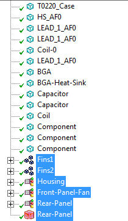

**Note:**

Selecting **Fins1**,**Fins2**,**Front-Panel**,**Rear-Panel**,**Housing** includes the selection of all the components inside of those nodes.

b. Right-click the selected objects and select **Hide Body** to view just the internal components.

c. Go to **Electronics** **Simplify**.

d. In the **Details** view, set the **Simplify** feature name to PWB_T0220.

e. In the field to the right of **Simplification Type**, select Level 1.

f. Click the field to the right of **Select Bodies** and select the **PWB** and all the **HS_AF0** and **T0220_Case** objects.

**Tip:**

You can either follow the steps immediately below to select the objects from the **Graphics** window, or you can select them directly from the **Tree Outline**.

i. Go to the **+Z** view.

ii. Make sure the **Select Mode** is **Single Select**.

iii. Hold down **Ctrl** and select the objects as shown in Figure 25.16: PWB, HS_AF0, and T0220_Case

Bodies Selection (p. 569).

**Figure 25.16: PWB, HS_AF0, and T0220_Case Bodies Selection**

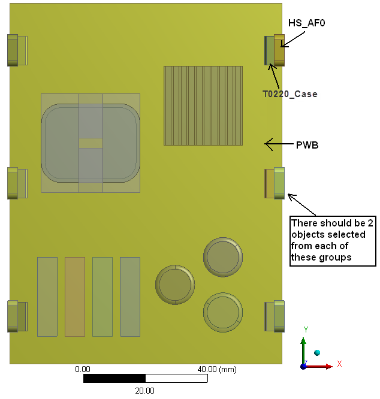

g. Click **Apply**. The **Select Bodies** field should now show 13 bodies selected.

h. Click

.

10. Add all the package objects to the **Parts**.

a. Change the **Selection Mode** to **Box Select** and make sure the selection filter is set to **Bodies**.

b. Select a package object as shown in Figure 25.17: Package Object Selection (p. 570). There should

be 7 bodies selected.

**Figure 25.17: Package Object Selection**

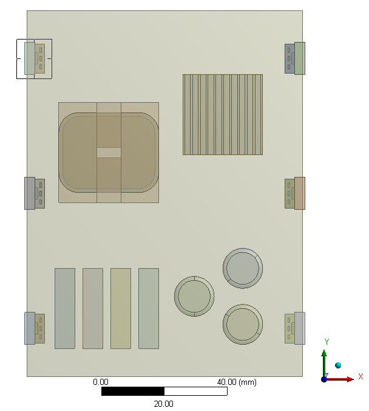

c. Right-click the model and select **Form New Part**. All the bodies will be added to the part.

d. Name the part T0220_Case1.

e. Repeat steps a to e for the rest of the packages, except naming the parts T0220_Case2,

T0220_Case3, etc.

11. Perform a **Simplify** on the **Coil**.

a. Go to **Electronics** **Simplify**.

b. In the **Details** view, set the **Simplify** name to CoilAssembly.

c. In the field to the right of **Simplification Type**, select Level 1.

d. Click the field to the right of **Select Bodies** and select the bodies as shown in Figure 25.18: Coil

Bodies Selection (p. 571). There should be 4 bodies selected.

**Figure 25.18: Coil Bodies Selection**

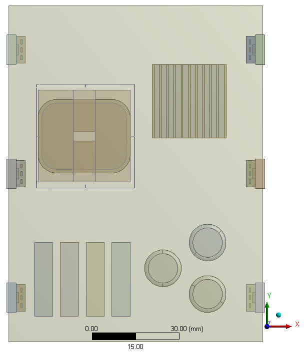

e. Click **Apply** and

.

12. Add the rest of the **Coil** bodies to the part.

a. Make sure the selection filter is set to **Bodies**.

b. Make the same selection as in the simplify operation. Notice that there are now 8 bodies instead

of 4.

c. Right-click the model and select **Form New Part**.

d. In the **Details** view, set the **Part** name to CoilAssembly2.

13. Perform a **Simplify** on the **Capacitors**.

a. Go to **Electronics** **Simplify**.

b. In the **Details** view, set the **Simplify** name to Capacitors.

c. In the field to the right of **Simplification Type**, select Level 3.

d. Click the field to the right of **Select Bodies** and select the bodies as shown in Figure 25.19: Ca-

pacitors Bodies Selection (p. 572). There should be 3 bodies.

**Figure 25.19: Capacitors Bodies Selection**

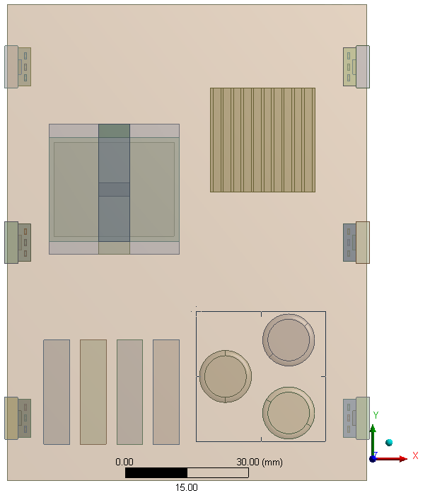

e. Click **Apply**.

f. Set the **Facet Quality** to Medium

g. Click

.

14. Form a part for the **Capacitors**.

a. Make sure the selection filter is set to **Bodies**.

b. Make the same selection as the simplify operation. There should still be 3 selected bodies.

c. Right-click the model and select **Form New Part**.

d. In the **Details** view, set the **Part** name to Capacitors.

15. Form parts for the **Heat Sink** and **Components**.

a. Make sure the selection filter is set to **Bodies**.

b. Follow the same steps as before to create a part called BGAHS for the **Heat Sink** and Compon-

ents for the **Components**:

**Figure 25.20: BGAHS and Components Parts Selections**

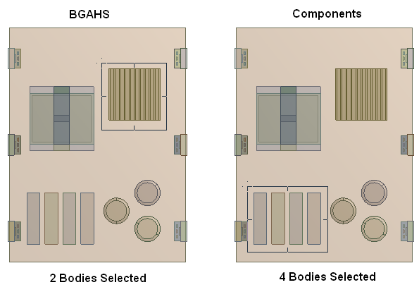

16. Right-click a body in the **Tree Outline** and select **Show All Bodies**. Your model should look like Figure 25.21: Final Model in Ansys DesignModeler (p. 574) and your **Tree Outline** should look like Figure 25.22: Final Tree Outline (p. 575).

**Figure 25.21: Final Model in Ansys DesignModeler**

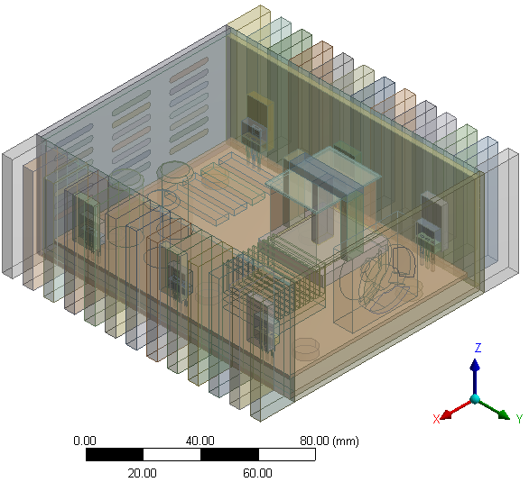

**Figure 25.22: Final Tree Outline**

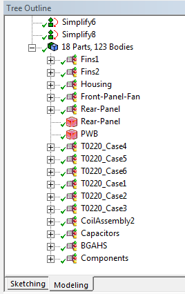

**Note:**

Some of your parts and bodies may be in a different order than what is shown in Fig- ure 25.22: Final Tree Outline (p. 575).

17. Check if all the bodies have been converted to Ansys Icepak objects.

a. Go to **Electronics** **Show CAD Bodies**.

b. Confirm that the view contains no bodies. This means all the bodies have been recognized by

Ansys Icepak.

18. The model is now ready to use in Ansys Icepak.

### 25.8. Step 5: Opening the Model in Ansys Icepak

1. Go to **File** **Save Project** and then **File** **Close DesignModeler**.

2. In Ansys Workbench, drag an Ansys Icepak component to cell A2 to create an Ansys Icepak component module.

**Figure 25.23: Creating an Ansys Icepak Component Module**

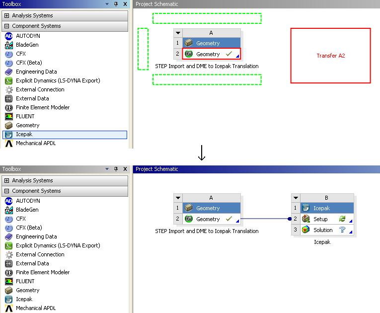

3. Double-click the **Setup** cell (B2) to open the model in Ansys Icepak.

4. In the **Model manager** window, right-click the **Model** node and select **Expand all** to view the geometry inside the assemblies.

5. Notice that the bodies have been successfully transferred into Ansys Icepak.

**Figure 25.24: Final Model**

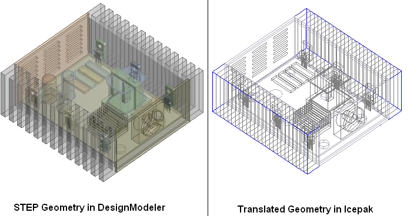

### 25.9. Step 6: Summary

In this tutorial, you learned how to get a CAD model ready for Ansys Icepak using Ansys DesignModeler. You used the slice, simplify, openings, and fan operations to convert the model.

---

## Chapter 26: CFD Modeling and Analysis of an Avionics Box

### 26.1. Introduction

This tutorial describes the procedure for setting up and running a CFD analysis for the ANSYS Icepak geometry that was created as a part of the Design Modeler - Electronics (p. 553) tutorial located in the Icepak Tutorial Guide.

**Note:**

Mesh counts and solution results may differ slightly due to enhancements to the meshing algorithm and Fluent solver, respectively.

### 26.2. Prerequisites

You should have the following before starting this tutorial:

• Ability to perform basic project analysis in Ansys Icepak

• Familiarity with the Ansys Icepak interface

### 26.3. Create a New Ansys Icepak Project

• Open a new, standalone Icepak session and click **Unpack**.

**Figure 26.1: Options Available for a New Icepak Session**

• In the file selection panel, select the packed project file tut26-Icepak.tzr and click **Open**.

**Note:**

The file tut26-Icepak.tzr can be found on the ANSYS Help Site. The procedure to download this file is described below.

1. Set up a working directory on the computer you will be using.

2. Download the avionics.zip file here.

3. Unzip the avionics.zip file you have downloaded to your working directory.

**Figure 26.2: File Selection Panel**

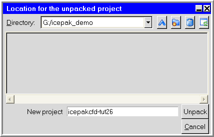

• In the location for the unpacked project file selection dialog, select a location where you would like to create the new Icepak project and click **Unpack**.

• Note that the faces of the cabinet align with the outermost boundaries of the rest of the model.

**Figure 26.3: Unpacked Model**

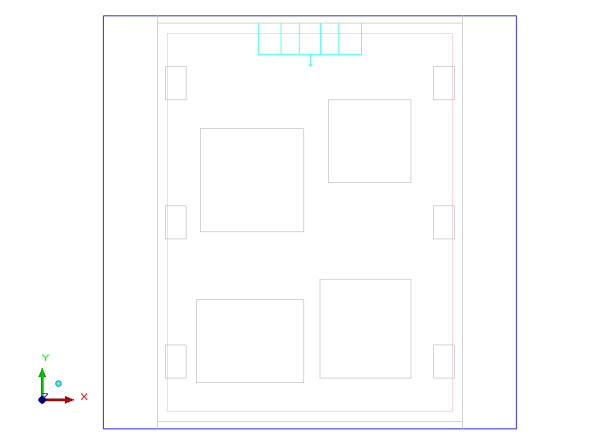

### 26.4. Create a Support for the Box and Resize Cabinet

• Click

to create a new block.

• From the **Model manager** window, double-click block.1 to open the edit panel.

• Using the **Info** tab, rename the block as **Support** and click **Update**.

• In the **Properties** tab, set the block type to **Hollow** as shown in the below figure:

**Figure 26.4: Block Type**

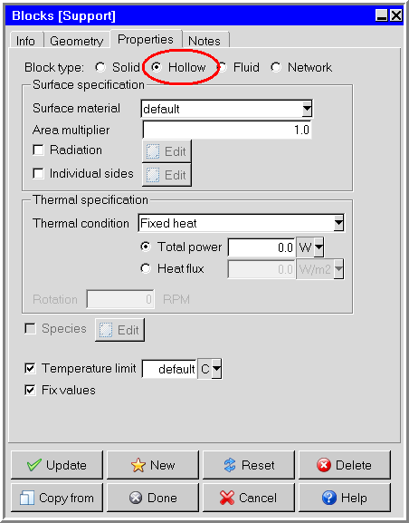

• In the **Geometry** tab, switch to **Start / length**, update the coordinates for the block as shown below and click **Done**.

**Figure 26.5: Block Dimensions**

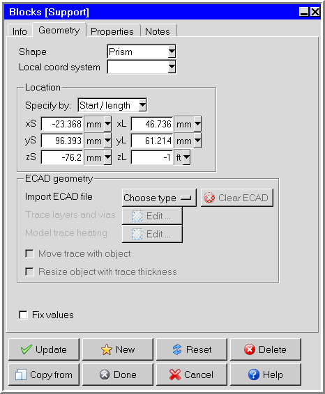

**Note:**

The **zL** dimension is in feet.

• A warning message (see below) comes up indicating that the support block is outside the cabinet.

• Click **Resize cabinet** to allow the cabinet to resize to include the support block within its extents.

**Figure 26.6: Warning Message**

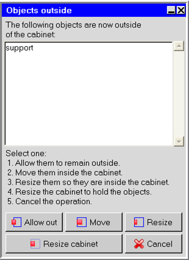

• From the **Model manager** window, double-click **Cabinet** and open the **Cabinet** edit panel.

• In the **Geometry** tab, modify the cabinet dimensions as shown below and click **Update**.

**Figure 26.7: Updated Cabinet Dimensions**

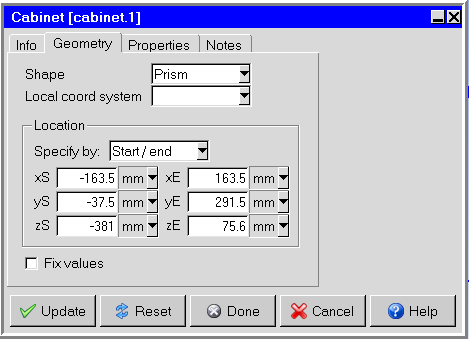

• Using the **Properties** tab, set the **Wall type** for the cabinet sides as shown below and click **Done**.

**Note:**

This setup will be used for a forced convection and a natural convection (fan failure) based analysis.

**Figure 26.8: Updated Properties Tab for Cabinet**

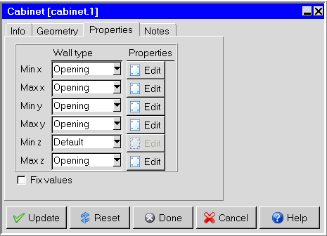

• Go to the **Orient** menu, select **Scale to Fit** to resize the view in the graphics window.

• Save using the **File** menu and click **Save project**.

### 26.5. Set Up the Model for Non-conformal Meshing

• Go to **Orient** menu and click **Orient Positive Y**.

• Keeping the **Shift** key pressed, left click and drag the mouse to draw a window around the box as shown below. Release the left click or **Shift** button to select the geometry fully enclosed within the box.

**Figure 26.9: Select the Box Geometry**

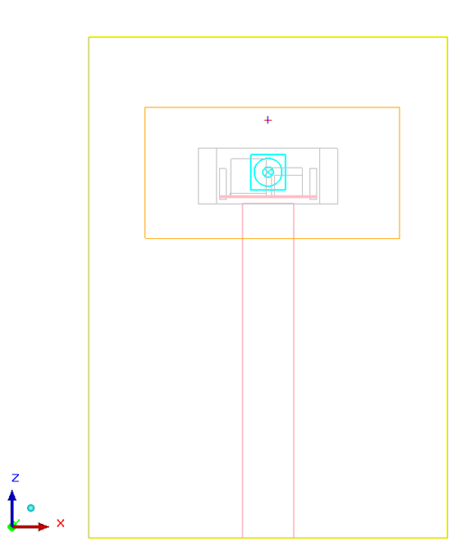

• Right-click the selected items (in the **Model manager** window) and select **Create assembly** from the menu items as shown below.

**Figure 26.10: Create an Assembly for the Box Geometry**

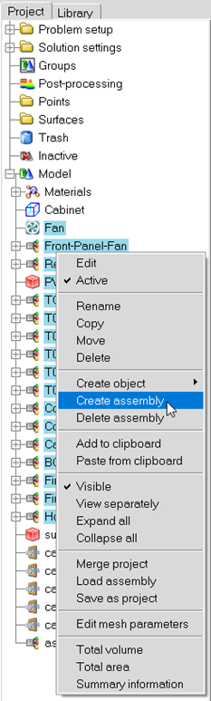

• In the **Model manager** window, expand assembly.1 by clicking the assembly node

(

).

• Note in the **Model manager** window that the **Fan** is listed outside the Front-Panel-Fan assembly node.

• Select the **Fan** from the **Model manager** window and drag it to the Front-Panel-Fan assembly as shown below.

**Figure 26.11: Move the Fan to the Front-Panel-Fan Assembly**

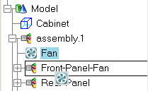

• The updated **Model manager** window is shown below.

**Figure 26.12: Updated Model manager Window**

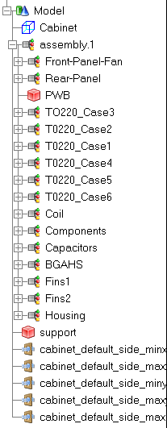

• On the **Model manager** window, double-click assembly.1 to open the edit panel for assembly.1.

• Go to the **Meshing** tab and then select **Mesh separately**. Modify the **Slack settings**,**Max element** **size**, and **Minimum gap** inputs as shown below and then click **Done**.

**Figure 26.13: Slack Settings and Max Element Size Inputs for assembly.1**

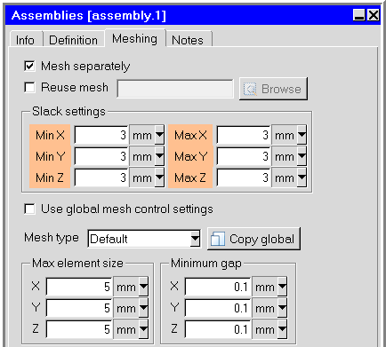

• Similarly, modify the slack values for the other assemblies as shown in Table 26.1: Slack Settings for the Remaining Assemblies (p. 590).

• Also, select the **Use global mesh control settings** for all assemblies listed in Table 26.1: Slack Settings for the Remaining Assemblies (p. 590).

**Note:**

As you have done for assembly.1, select **Mesh separately** in the **Meshing** tab for each of the assemblies in the table before entering the required inputs.

**Tip:**

To facilitate the specifications, click **Update** in the **Assemblies** panel after each specification and then click the next assembly object in the **Model manager** window. Doing this, you do not have to close and re-open the **Assemblies** panel repeatedly.

**Table 26.1: Slack Settings for the Remaining Assemblies**

| Assembly | Min X | Max X | Min Y | Max Y | Min Z | Max Z |
| --- | --- | --- | --- | --- | --- | --- |
| Rear-Panel | 0 | 0 | 1 | 1 | 1 | 1 |
| T0220 Case3 _ | 1 | 1 | 2.23 | 1 | 1 | 1 |
| T0220 Case2 _ | 1 | 1 | 1 | 1 | 1 | 1 |

| T0220 Case1 _ | 1 | 1 | 1 | 1 | 1 | 1 |
| --- | --- | --- | --- | --- | --- | --- |
| T0220 Case4 _ | 1 | 1 | 2.23 | 1 | 1 | 1 |
| T0220 Case5 _ | 1 | 1 | 1 | 1 | 1 | 1 |
| T0220 Case6 _ | 1 | 1 | 1 | 1 | 1 | 1 |
| Coil | 1 | 1 | 1 | 1 | 4.175 | 1 |
| Components | 1 | 1 | 1 | 1 | 4.175 | 1 |
| Capacitors | 1 | 1 | 2.271 | 1 | 4.175 | 2 |
| BGAHS | 1 | 1 | 1 | 1 | 4.175 | 1 |
| Fins1 | 1 | 0 | 1 | 1 | 1 | 1 |
| Fins2 | 0 | 1 | 1 | 1 | 1 | 1 |

**Note:**

You have not meshed the Housing assembly separately. Furthermore, you have set a few slack values to 0 for some assemblies. These are to avoid any assembly-assembly in- tersections, which Ansys Icepak does not allow.

• For the Front-Panel-Fan assembly, modify slack settings, max element sizes, and minimum gap settings and enable uniform mesh parameters and 2D multi-level meshing as shown in Figure 26.14: Fan Assembly Mesh Settings (p. 592)

**Figure 26.14: Fan Assembly Mesh Settings**

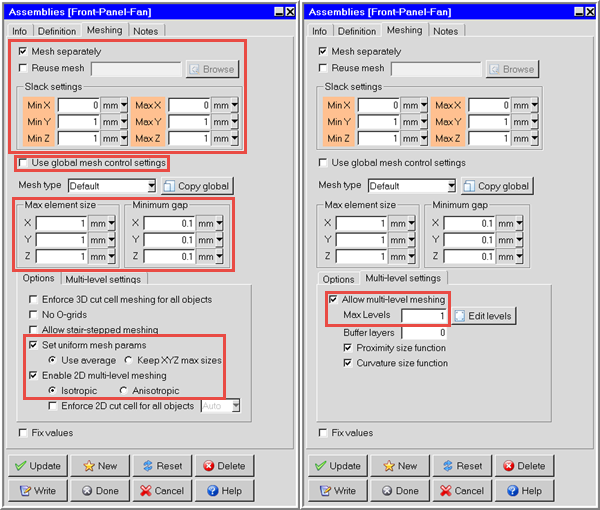

• Save the project by going to **File** then selecting **Save project**.

### 26.6. Generate the Mesh

• Go to the **Model** menu and click **Generate mesh**. Ensure the **Mesh type** is set to **Mesher-HD**.

• Change the **Max element size** and **Minimum gap** settings to those shown in Figure 26.15: Mesh Parameters (p. 593). Note that the **Minimum gap** settings are in mm.

**Figure 26.15: Mesh Parameters**

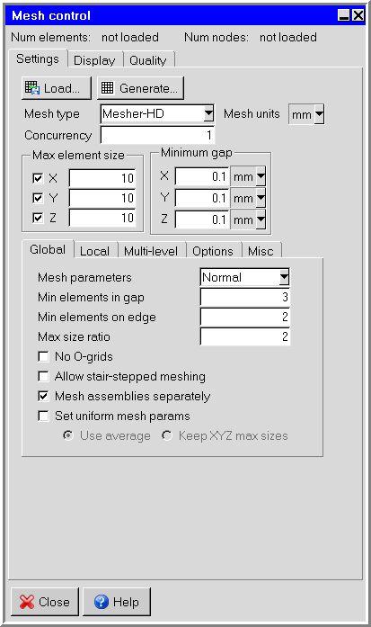

• Click **Generate**. The resulting mesh size should be between 500,000 and 600,000 cells. Observe in the **Message** window that no mesh exists for the **DIE_AF0** objects.

• Right-click the **Model** node from the **Model manager** window and select **Sort** **Meshing Priority**.

**Figure 26.16: Sorting the Model manager Window by Meshing Priority**

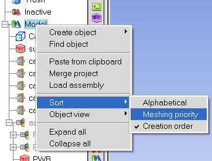

• From the **Model manager** window, expand the node for the assembly TO220_Case3. Note that DIE_AF0 is at the top of the list indicating that it has the least meshing priority.

• While holding down the **Shift** key, select TO220_Case_0 and TO220_Case_1 from the **Model** **manager** window. Drag and drop these above DIE_AF0 as shown in Figure 26.17: Modifying the Meshing Priority (p. 594). This automatically changes the respective meshing priority settings such that DIE_AF0 has a higher meshing priority than the TO220_Case blocks do.

**Note:**

For more information on meshing priority, see Controlling the Meshing Order for Objects of the Icepak User’s Guide.

**Figure 26.17: Modifying the Meshing Priority**

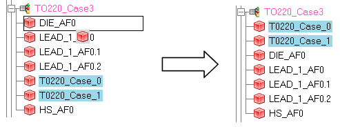

• Similarly, update the meshing priorities of the other DIE_AF0 blocks for all the TO220_Case assem- blies.

• Go to the **Mesh control** panel and click **Generate**. Confirm that the **Message** window does not display warnings for the meshing of the DIE_AF0 objects as it has earlier.

**Note:**

From the messages printed in the **Message** window, remeshing is limited to the TO220_Case assemblies only.

• Use the **Display** and **Quality** tabs to visualize mesh refinement and assess mesh quality.

• Save the project.

### 26.7. Power and Material Inputs

• Using the **Properties** tab of the edit panel, update the solid material and power inputs for the blocks as listed in Table 26.2: Material and Power Inputs (p. 595).

– You do not need to change the settings for blocks not included in this list.

**Tip:**

For objects that require similar material and power specifications, you can edit them sim- ultaneously to speed up the process. From the **Model manager** window, select all of the objects requiring the same material and power specifications, such as the DIE_AF0 objects, while holding down the **Ctrl** key. Right-click one of the selected objects and select **Edit** to open the shared object edit panel. You can now select the material and total power for all of the selected objects simultaneously. Click **Done** after you change the settings.

**Table 26.2: Material and Power Inputs**

| Node | Object name | Material | Total Power (W) |
| --- | --- | --- | --- |
| TO220 Case3 _ | DIE AF0 _ | Ceramic material _ | 2 |
| T0220 Case2 _ | DIE AF0.1 _ |  |  |
| T0220 Case1 _ | DIE AF0.2 _ |  |  |
| T0220 Case4 _ | DIE AF0.3 _ |  |  |
| T0220 Case5 _ | DIE AF0.4 _ |  |  |
| T0220 Case6 _ | DIE AF0.5 _ |  |  |
| Coil | Coil-2 | Cu-Brass |  |
| Components | Component | Mold material _ |  |
|  | Component.1 |  |  |
|  | Component.2 |  |  |
|  | Component.3 |  |  |
| Capacitors | Capacitor |  |  |
|  | Capacitor.1 |  |  |

|  | Capacitor.2 |  |  |
| --- | --- | --- | --- |
| BGAHS | BGA | Ceramic material _ | 5 |

### 26.8. Fan Inputs

• Specify the fan curve and swirl inputs for the **Fan** object as shown below. Remember that the object Fan is located in the Front-Panel-Fan node of the **Model manager** window.

**Note:**

Orient the fan in the negative Y direction by selecting **Negative** in the **Flow direction** group box.

**Figure 26.18: Fan Curve and Swirl Inputs for the Fan Object**

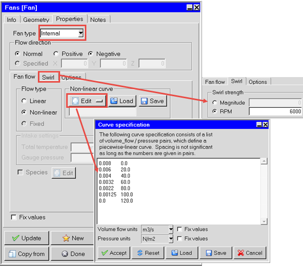

### 26.9. Physical and Numerical Settings

Set up the physical parameters of your model and the solver settings.

### Problem Setup

**Note:**

Instead of accessing the

**Basic parameters** panel, you can instead use the **Problem setup** **wizard** to define your problem setup by double-clicking

**Problem setup** in the **Model** **manager** window. See 2.7. Step 4: Physical and Numerical Settings (p. 28) of the Finned Heat Sink tutorial for more instruction regarding the **Problem setup wizard**. You must still use the same settings described in this tutorial for the **Problem setup wizard**.

• Modify the **General setup** tab for the **Basic parameters** (under the **Problem setup** node) as shown below.

**Figure 26.19: Basic parameters/General setup**

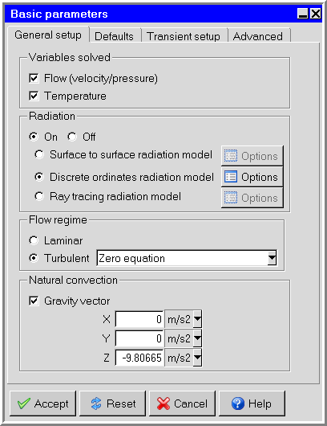

• Set the options for discrete ordinates radiation model as below and click **Accept**.

**Figure 26.20: DO Radiation Settings**

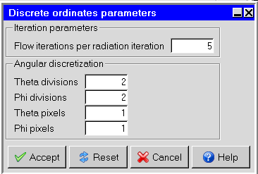

• Go to the **Defaults** tab and update the **Ambient conditions** as shown below.

**Figure 26.21: Basic parameters/Defaults**

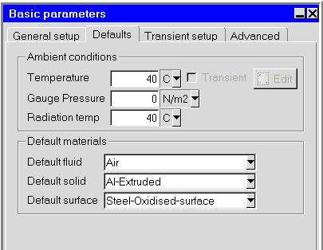

• Go to the **Transient setup** tab and set a **Solution initialization** **Z velocity** of 0.01 m/s as shown below. When gravity is turned on, it is good practice to initialize the flow field with a small velocity opposite to the gravity vector.

**Figure 26.22: Basic parameters/Transient Setup**

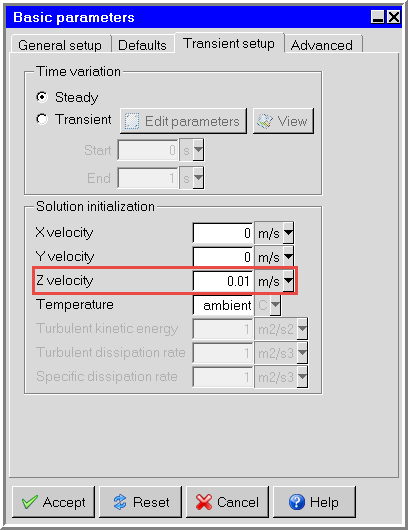

• Go to the **Advanced** tab, enable **Solar loading** and update the options for solar loading as shown below. Click **Accept**.

**Figure 26.23: Solar load model parameters Panel**

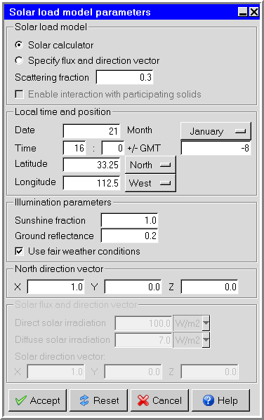

### Solver Setup

• Go to the **Solve** menu and click **Settings** **Basic**. Increase the **Number of iterations** to **500** and click **Accept**.

• Retain the defaults for the**Parallel** and the **Advanced settings**.

• Create a monitor point at the centroid of the BGA. There are two ways to do so:

**Method 1:**

– Drag and drop the BGA block from the BGAHS assembly node in the **Model manager** window to

the **Points** node as shown below.

– Double-click the newly created monitor point and accept the default settings.

**Figure 26.24: Creating a Point Monitor (Temperature) for the BGA Block - Method 1**

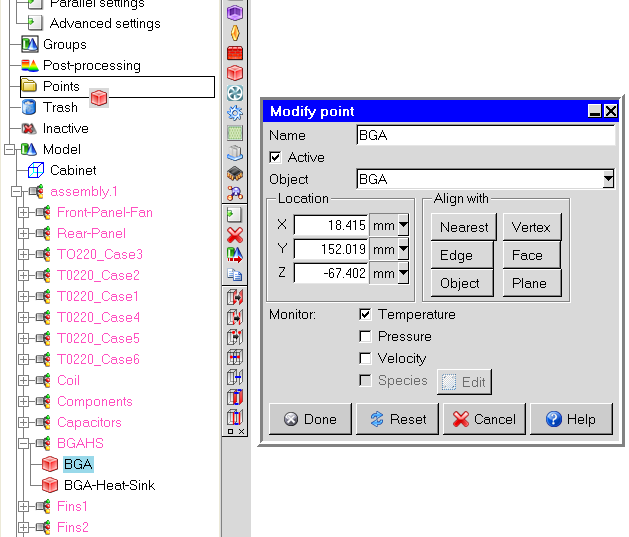

**Method 2:**

– From the **Model manager** window, as shown below, right-click the BGA block and click **Add to**

**Clipboard**.

– Right-click the **Points** node (see below) and select **Paste from Clipboard**.

– The BGA point monitor will be added to the **Points** node.

**Figure 26.25: Creating a Point Monitor (Temperature) for the BGA Block - Method 2**

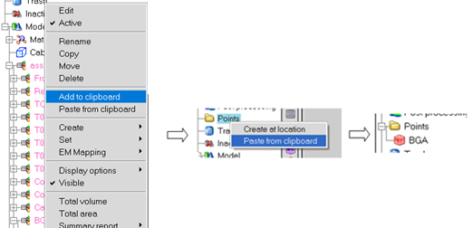

• Similarly, create monitor points for the opening objects Rear-Panel_18 and Rear-Panel_4, found in the Rear-Panel assembly node. Modify the corresponding monitor point panels to enable velocity and temperature monitoring during the solution process by selecting both **Temperature** and **Velocity** check boxes for each of the rear panel monitor points.

**Figure 26.26: Point Monitors (Temperature and Velocity) for the Openings Rear_Panel_18 and** **Rear_Panel_4**

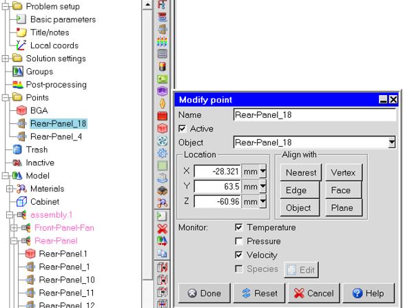

Save using the **File** menu and click **Save project**.

### 26.10. Calculate a Solution

• Go to the **Solve** menu and click **Run solution** to launch the **Solve** panel as shown below.

• Click **Start solution**.

**Figure 26.27: Run Solution**

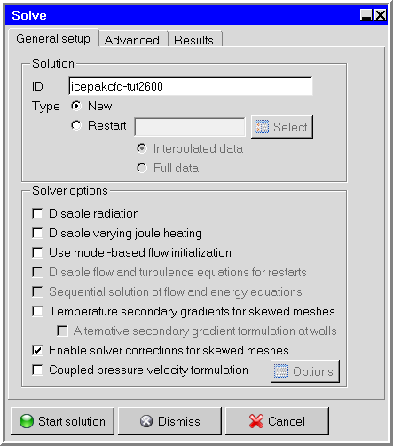

• The solution should converge in fewer than 150 iterations.

**Figure 26.28: Convergence and Point Monitor Plots**

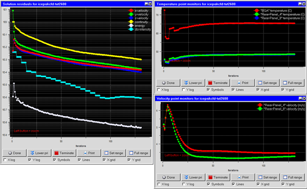

### 26.11. Examine the Results

Examine your results by creating postprocessing objects, such as temperature contours on the PWB and Component objects.

• Go to the **Orient** menu and click **Orient Negative Z** and then click **Zoom in** in the **Orient** menu to zoom-in on the graphical display on the box.

• As shown below, keeping the **Shift** key pressed, click and drag to draw a window that includes the PWB and all the components on the board.

– The selection will also include the support block and some of the Housing blocks (cylinder blocks

at the base of the housing).

**Figure 26.29: Selection for Postprocessing**

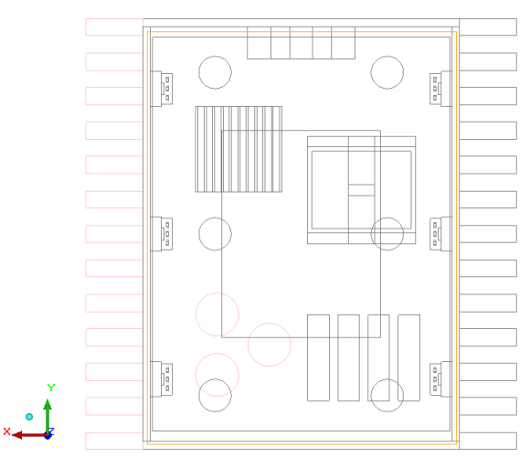

• Right-click the selection on the **Model manager** window and choose **Create** **Object Face(s)** **Combined** to create contours of temperature, the default variable, on the faces of the selected objects.

• Click **Done** on the **Object face** panel.

• Review the contours display (Figure 26.30: Display Contours of Temperature on Selected Objects (p. 606)).

– Note that the hot spots are located on the capacitors and the components.

– The max Y (west) side of the support block is directly exposed to solar radiation. This is confirmed

by the results. This side is ‘warmer’ than the other sides of the support block.

**Figure 26.30: Display Contours of Temperature on Selected Objects**

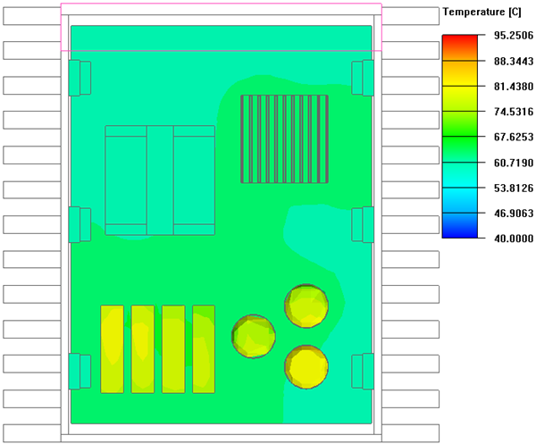

• Right-click face.1 from the **Post-processing** node (in the **Model manager** window) and then deselect **Active** to deactivate face.1.

**Figure 26.31: Contours of Temperature on Selected Objects**

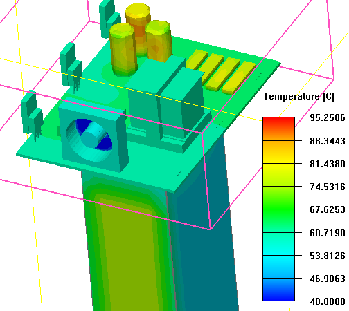

Temperature contours on a ‘clipped’ Plane Cut

• Go to the **Post** menu and click **Postprocessing units** and set the units for **Length** to mm.

• Go to the **Post** menu and click **Plane cut**.

• In the **Plane cut** panel, select **Point and normal** for **Set position**. Change the coordinates of the point and the normal vector direction according to Figure 26.32: Plane cut Panel Settings for cut.1 (p. 608). Click **Create**.

• Check **Enable clipping** and enter the extents for clipping as shown below (Figure 26.32: Plane cut Panel Settings for cut.1 (p. 608)) and click **Update**.

**Tip:**

You can also snap the extents of the clipping zone from the graphics window.

• Review the contours display.

• Use the scroll bar on the **Plane cut** panel or click the **Animate** button to traverse the plane cut across the box.

• Change the point and normal settings, in the **Plane location** group box, to visualize the contours in different orientations.

• Click **Parameters** (adjacent to **Show contours**) to change the variable, color level settings, and so on.

**Figure 26.32: Plane cut Panel Settings for cut.1**

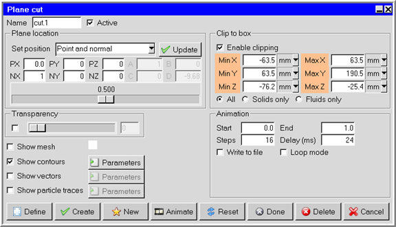

**Figure 26.33: Plane Cut of Temperature Contours within Avionics Box**

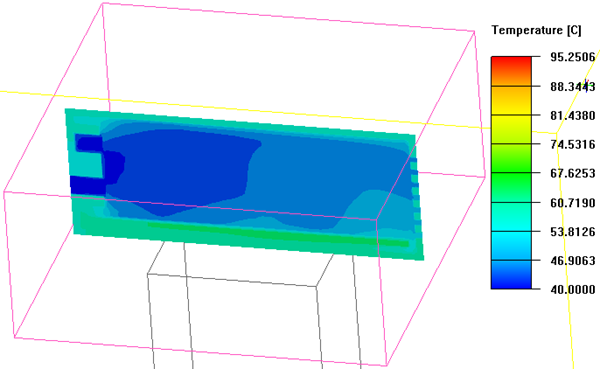

Create a field of velocity vectors on the clipped plane cut:

• Go to the **Orient** menu and select **Orient Negative Z** and then click **Zoom in** in the **Orient** menu to zoom in on the graphical display on the box.

• In the **Plane cut** panel for cut.1, turn off the display of contours by deselecting **Show contours**. Enable the display of vectors by selecting **Show vectors**.

• Update the point and normal settings for the plane cut as below:

**Figure 26.34: Updated Point and Normal Settings for cut.1**

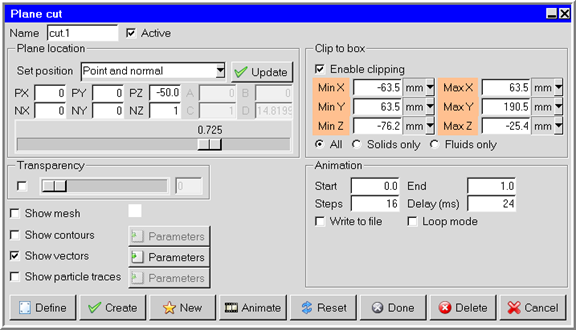

• Click **Parameters** (adjacent to **Show Vectors**), set the **Display options** to **Uniform** (**10000**), select the **Project to plane** option and click **Apply** then **Update**.

**Figure 26.35: Updated Plane Cut of Velocity Vectors**

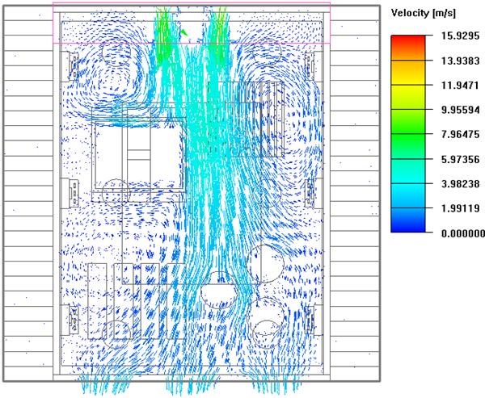

• Review the vectors display.

• Use the scroll bar on the **Plane cut** panel and/or the **Animate** button to traverse the plane cut across the box.

• Update the point and normal settings to visualize the vectors in different orientations.

• Right-click cut.1 from the **Post-processing** node and deselect **Active** to deactivate cut.1.

Streamlines from the Fan

• Expand the **Inactive** node on the **Model manager** window, right-click face.1 and click **Active** to display face.1 again.

• Go to the **Post** menu and click **Object face**.

• In the **Object face** panel (for face.2), using the drop-down menu select the **Fan** as the object.

• Check **Show particle traces** and click **Parameters**.

• Update the **Parameters** panel for the particle traces as below and click **Apply**.

**Figure 26.36: Updated Settings for face.2**

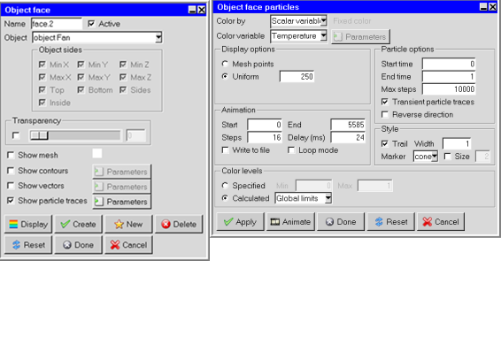

• Review the streamlines display.

**Figure 26.37: Updated Graphical Display**

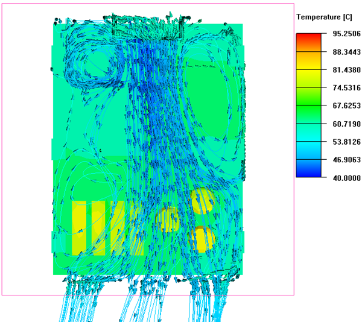

• Use the **Animate** button to visualize a dynamic 3D representation of the air flow beginning from the fan and exiting out of the openings on the rear panel.

– Adjust the steps input to modify the number of frames included in the animation.

• Deactivate face.1 and face.2.

Power and Temperature Values

• Go to the **Post** menu and select **Power and temperature values** to identify (and display) the objects which fail for specified maximum temperature criteria.

• Assume that the maximum temperature rating for the components in this setup is 85°C.

• In the **Power and temperature limit setup** panel, set the **Default temperature limit** to **85** C and click **All to default**.

• Click **Show too hot** to report (in the message window) and display (on the graphics window) the objects that fail this criterion.

– The graphical display will update for standard shape Icepak objects only. CAD objects will not be

highlighted in the graphics window but will be listed in the message window instead.

**Figure 26.38: Updated Graphical Display**

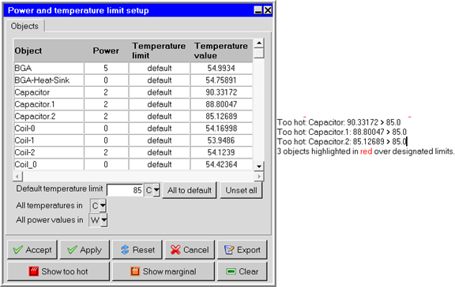

• Close the **Power and temperature limit setup** panel.

• Save using the **File** menu and click **Save project**.

### 26.12. Additional Exercises

Setup for natural convection (fan failure)

• From the **Model manager** window, double-click the object **Fan** to open its edit panel.

• In the **Properties** tab, go to the **Options** sub-tab and check the **Failed** option.

• Set the **Free area ratio** to 0.5 and click **Done**.

**Figure 26.39: Updated Fan Setup for Failure Mode**

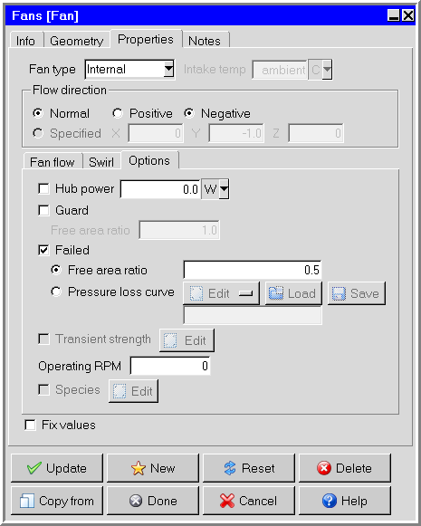

• Go to the **Solve** menu and select **Settings** **Advanced** and update the under-relaxation settings for **Pressure** and **Momentum** to **0.7** and **0.3** respectively.

• Go to the **Solve** menu and click **Run solution**, enter a unique **Solution ID** and click **Start solution**.

**Note:**

The ID **icepakcfd-tut2600** should not be used for the **Solution ID** as it has already been used for the forced convection, steady-state simulation setup.

• Postprocess the results as done previously.

### 26.13. Setup for Transient Analysis – Forced Convection Mode

**Note:**

This exercise considers a transient period of 24 hours for CFD analysis and hence will be a highly intensive undertaking from a computational standpoint. For the sake of understanding, you may choose to run the transient solution for a shorter time period.

• Go to the **Post** menu and select **Load solution ID**, select icepakcfd-tut2600 and click **Okay**.

• Go to the **Problem setup** menu and click **Basic parameters** **Transient setup** and set the **Time** **variation** to **Transient**.

• Set the **Start time** to **0** s and the **End time** to **86400** s (24 hours).

• Click **Edit parameters** for **Transient**, set the **Time step** to **60** s and the **Solution save interval** to **30**.

– Based on this setting, the solver will write out the results every 1800 seconds (30 minutes) during

the solution process.

• Click **Accept** to close the **Transient parameters** panel.

**Figure 26.40: Basic parameters and Transient parameters Panel Inputs**

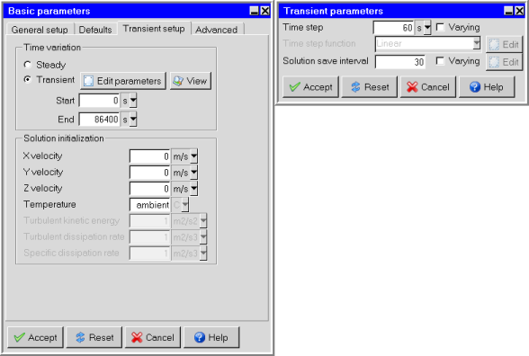

• Go to the **Defaults** tab.

• Set the **Ambient conditions** for **Temperature** to **1** C.

• Select the **Transient** option for **Temperature** and click **Edit** to open the **Transient temperature** panel.

• Select the **Piecewise linear** type for specifying the time dependant variation of **Ambient temperature**.

• Click the **Text editor** button and enter the **Time (s)** vs.**Ambient temperature** (°C) inputs as shown in Figure 26.41: Time Dependant Variation for Ambient Temperature (p. 616).

**Figure 26.41: Time Dependant Variation for Ambient Temperature**

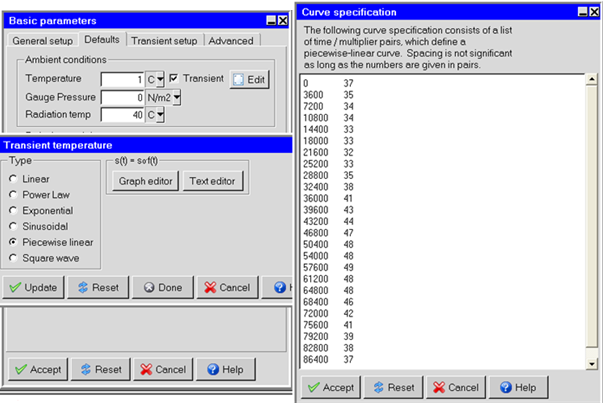

• Click **Accept**,**Done**, and **Accept** to close the **Curve specification**,**Transient temperature** and **Basic** **parameters** panels respectively.

• Go to **Solve** **Settings** **Basic** and set the **Iterations / timestep** to **200**.

• Go to the **Solve** menu and click **Run solution**, enter a unique **Solution ID**.

• As shown below, set the **Type** to **Restart** and select the ID for the forced convection, steady-state simulation (icepakcfd-tut2600) with the **Full data** option.

– Having an established flow field from the steady state analysis as a starting point will aid conver-

gence during the transient simulation.

**Figure 26.42: Use of Steady State Simulation as the Starting Point for the Transient Simulation**

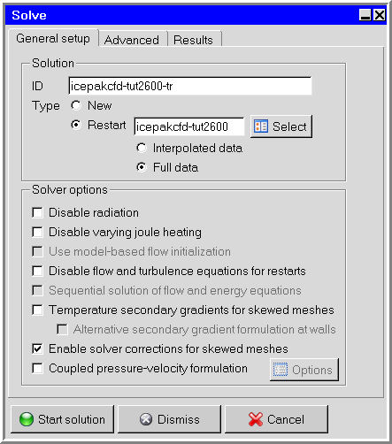

• Click **Start solution**.

• Postprocess the transient simulation as you have done previously.

– Use the **Post** menu and click **Transient settings** to march **Forward/Backward** in time (by Timesteps

or by increments of time) to get a time based variation for postprocessing objects such as **Plane** **cut**,**Object face** and **Isosurface**. The marching can be done manually using the **Forward/Backward** buttons (see below) or using the **Animate** option.

**Figure 26.43: Post/Transient Settings**

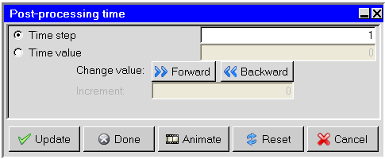

• Use the **Post** menu and click **History plot** to create a **Time vs Variable value** plot for a specified point location within the computational domain.

• Refer to the Transient Simulation (p. 289) tutorial located in the Icepak Tutorial Guide for more inform- ation on set-up and postprocessing of transient simulations using ANSYS Icepak.

---

## Chapter 27: SpaceClaim - Icepak Coupling

### 27.1. Introduction

This tutorial demonstrates how to use Ansys SpaceClaim to convert a model for analysis in Ansys Icepak.

In this tutorial, you will learn how to use the Pull, Slice, and Simplify tools in ANSYS SpaceClaim.

**Note:**

Mesh counts and solution results may differ slightly due to enhancements to the meshing algorithm and Fluent solver, respectively.

### 27.2. Prerequisites

This tutorial assumes that you have basic familiarity with the Ansys Workbench and Ansys Icepak inter- faces.

### 27.3. Problem Description

You will use ANSYS SpaceClaim to convert an imported STEP file for use in Ansys Icepak.

The input file DME.stp can be found on the ANSYS Help Site. The procedure to download this file is described below.

1. Set up a working directory on the computer you will be using.

2. Download the dme.zip file here.

3. Unzip the dme.zip file you have downloaded to your working directory.

### 27.4. Step 1: Create a New Project

1. Open a new session of Ansys SpaceClaim (**Start** > **All Programs** > **ANSYS** **2019 R2** > **SCDM** **2019** **R2**).

2. From the **File** menu, select **Open** to display the **Open** dialog.

3. Select **STEP** as the file type and navigate to your working directory where the DME.stp file is located.

4. Click **Open** with the default import options as shown in Figure 27.1: SpaceClaim Open Dialog (p. 620).

**Figure 27.1: SpaceClaim Open Dialog**

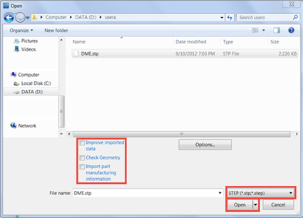

5. The imported geometry should appear as shown in Figure 27.2: Initial Geometry in SpaceClaim (p. 620).

**Figure 27.2: Initial Geometry in SpaceClaim**

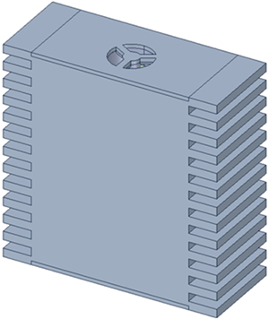

### 27.5. Clean Up the Geometry and Translate to Icepak Objects

1. Enter **Select** mode by activating it in the **Edit** toolbar, or by pressing **ESC**.

**Figure 27.3: SpaceClaim Edit Toolbar - Select Mode**

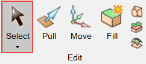

2. Select any face of the housing and then right-click it. From the right-click menu, select **Hide Others**.

**Note:**

Alternatively, select a face and press **Alt** + **H** to hide all other objects.**Ctrl** + **H** hides only the currently selected object.

**Figure 27.4: Housing Face Selection**

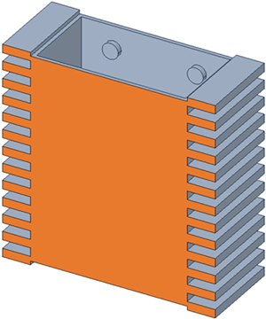

3. Use the **Split Body** tool to simplify the housing to prisms and cylinders.

**Figure 27.5: Split Body Button**

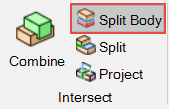

4. Select the housing body, then select one of the sides to split the fins.

**Figure 27.6: Splitting the Housing and Side Fins**

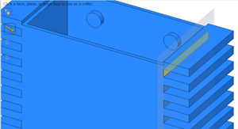

5. Press **ESC**.

6. Activate the **Split Body** tool again and select the other side to split the other set of fins.

7. Press **H** to go to the home view.

8. Select all the housing bodies and then right-click anywhere in the model display area.

9. From the right-click menu, select the color box and then **Randomize Colors**.

**Figure 27.7: Randomize Body Colors**

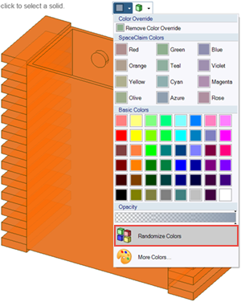

10. View the model. Each separate housing body now has a different color. This makes it very easy to visually identify separate bodies.

**Figure 27.8: Randomized Body Colors**

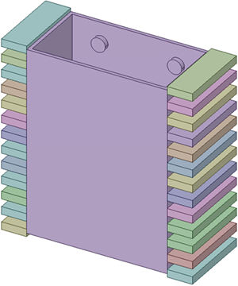

11. Select any face on the central part of the Housing and press **Alt** + **H** to hide the fins.

12. Perform the split body operation detailed above on the two faces shown in Figure 27.9: Splitting the Central Housing (p. 624).

**Figure 27.9: Splitting the Central Housing**

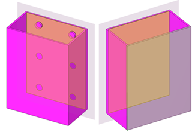

13. Select the newly split bodies and randomize their colors.

14. Press **Ctrl** + **Shift** + **H** to show all bodies.

**Note:**

Alternatively, you can right-click in the model display area and select **Show All**.

**Figure 27.10: All Bodies**

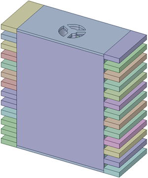

15. SpaceClaim has an auto-identify feature that quickly creates Icepak primitive objects for simple geometry. Go to the **Workbench** ribbon and click **Identify Objects**.

**Figure 27.11: Identify Objects**

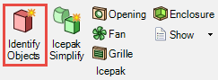

16. Click the green check mark button to automatically convert all the objects highlighted in red to Icepak primitives.

**Figure 27.12: Convert to Icepak Primitives**

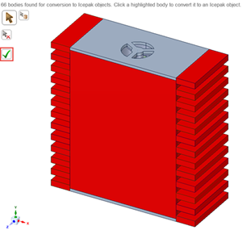

17. View the model. Notice that the icon changed in the structure tree for the bodies that were converted.

**Figure 27.13: Icepak Icons in Structure Tree**

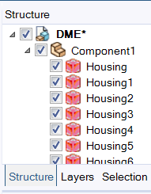

18. To display the objects that still require work, use the **Show** > **Non-Icepak Bodies** function.

**Figure 27.14: Non-Icepak Bodies**

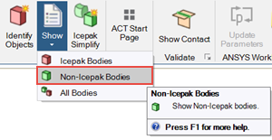

19. We will now use the **Icepak Simplify** feature to remove unnecessary geometry details and convert to Icepak objects. There are four different levels of simplification:

• Level 0: Converts geometry to a bounding box prism.

• Level 1: Converts geometry to a collection of prisms and cylinders.

• Level 2: Converts geometry to a polygonal approximation.

• Level 3: Keeps the geometry as-is. Use only for critical objects, as mesh count can increase substantially.

20. Select **Icepak Simplify** and use **Level 0** for the PCB and TO packages highlighted below.

**Figure 27.15: Simplify the PCB and TO Packages**

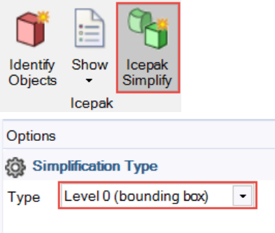

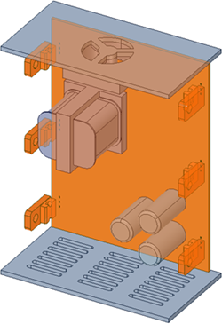

21. The objects can be selected one by one, or you can also use a rectangle select. Notice that the simplification automatically removes holes, chamfers, and fillets.

**Figure 27.16: Simplified PCB and TO Packages - Level 0 Simplification**

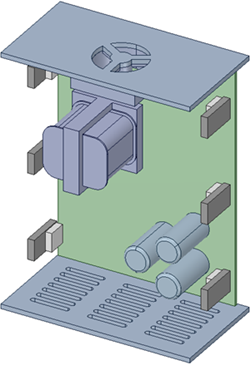

22. Now simplify the capacitors using **Level 1** without the **Cleanup** or **Allow Splitting** options.

**Figure 27.17: Simplified PCB and TO Packages**

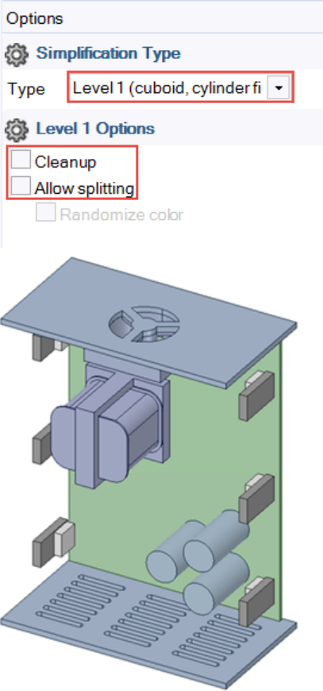

23. Use the **Show Non-Icepak bodies** command to see what remains.

**Figure 27.18: Remaining Non-Icepak Bodies**

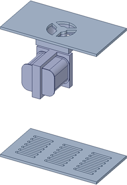

24. Press **ESC** to go back to the Select tool, draw a box around the transformer, and use **Alt** + **H** to hide other bodies.

**Figure 27.19: Transformer**

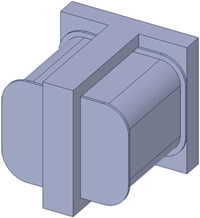

25. Use **Level 2** simplification to approximate the three coil objects as polygons. Make sure to enforce the Z axis as the extrusion direction, and disable the **Allow Splitting** option.

**Figure 27.20: Simplified Transformer - Level 2 Simplification**

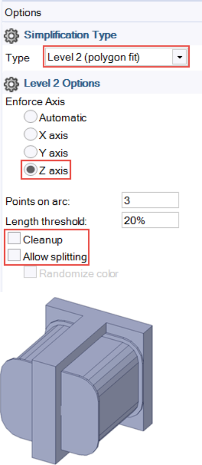

**Note:**

For these objects, the default **Points on Arc** and **Length Threshold** options create a reasonable approximation. When more detail is required, you can increase the **Points on** **Arc** and reduce the **Length Threshold**. However, keep in mind that polygons with ex- cessive vertices can lead to high aspect ratio mesh cells, which are usually detrimental to solver convergence and accuracy.

26. Select any face on the core body, and right-click and select **Hide Others**. If necessary, press **ESC** to go back to select mode.

**Note:**

If needed, press **Ctrl** + **Z** to undo any undesired geometry operation.

**Figure 27.21: Simplified Core Body**

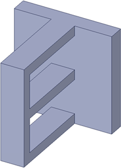

27. Use **Level 1** simplification and enable the **Allow Splitting** option on the core body.

**Figure 27.22: Simplified Core Body - Level 1 Simplification**

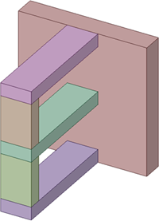

Sometimes the **Allow Splitting** option yields too many bodies. For these cases, it’s best to manually split the original geometry before using the **Simplification** tool. Use **Ctrl**+ **Z** to undo, and then use the **Split Body** tool to separate the core as shown below.

**Figure 27.23: Split the Core Body**

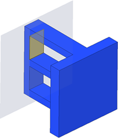

Go back to the **Level 1** simplification tool, enable **Allow Splitting**, and apply it to the two core bodies. The simplification now produces a satisfactory result without excessive bodies.

**Figure 27.24: Simplified Split Core Body - Level 1 Simplification**

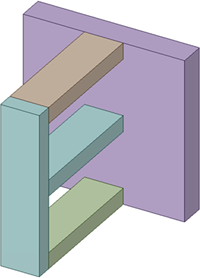

28. Use the **Show Non-Icepak bodies** function. Only three objects should be left: two chassis sides and a fan.

**Figure 27.25: Chassis and Fans**

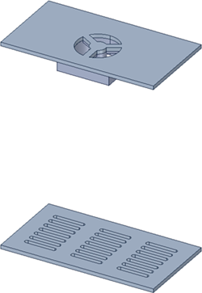

29. Select the chassis side with the slotted holes and hide all other bodies. It might be tempting to import this object as Level 3 CAD. For this model, it’s probably okay to do so, but for more complex models, importing too many objects as Level 3 can lead to a very large mesh count and a cumbersome meshing experience.

**Note:**

For simple objects like this chassis side, it’s best to use Icepak meshing priority to your advantage by creating openings for the slots and simplifying the block as a prism. Once in Icepak, by default, the openings have a higher meshing priority and cut out holes in the solid block.

30. Click on one face of the chassis as shown in the following image.

**Figure 27.26: Chassis Face**

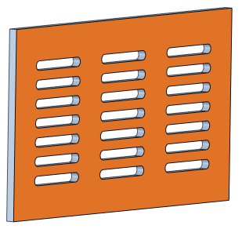

31. From the **Icepak** menu shown in the following image, select **Opening**. Then click on the face of the chassis that you had selected. Press **ESC** to exit the **Opening** tool.

**Figure 27.27: Opening Tool**

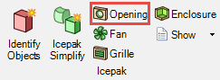

32. Use the **Icepak Simplify** **Level 0** option to convert the chassis side to a simple prism.

**Figure 27.28: Simplified Chassis Side**

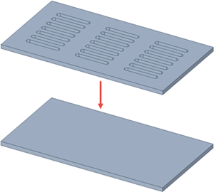

33. The openings previously created will cut holes through the solid chassis side prism.

34. We'll use a slightly modified approach for the remaining chassis side. Select the Front-Panel and hide all other bodies. Copy the curves on one side.

**Figure 27.29: Front Panel**

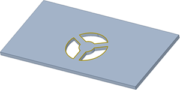

35. Create faces with the **Fill** tool by pressing **F**.

**Figure 27.30: Create Front Panel Faces**

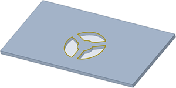

36. Select the three slotted faces and activate the **Pull** tool by pressing **P**.

**Figure 27.31: Select Front Panel Faces**

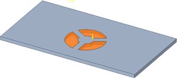

37. Turn on the **No merge** option. This ensures that SpaceClaim doesn’t merge the extruded bodies to yield a single solid prism.

**Figure 27.32: Enable No Merge**

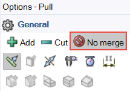

38. Select **Up to** in the **Pull** options as shown in Figure 27.33: Select Pull Option - Up To (p. 637).

**Figure 27.33: Select Pull Option - Up To**

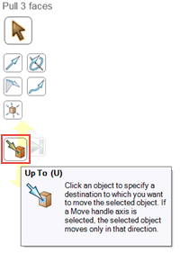

39. Select the face on the other side of the chassis to pull the full thickness length.

**Figure 27.34: Select Chassis Face**

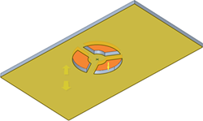

40. Rename the new solid blocks as **fluid_cutout.X** where **X** goes from 1 to 3.

**Note:**

To quickly find an object in the structure tree, right-click on any face and select **Locate in Structure Tree**.

41. Simplify the chassis side using **Level 0**.

42. Simplify the fluid cutouts using **Level 2**. Be sure to set the **Enforce axis** option to the Y axis. In Icepak, you will use meshing priority to ensure that the chassis side has these polygonal cutouts.

**Figure 27.35: Simplify the Fluid Cutouts**

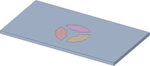

43. In the **Prepare** ribbon, select **Show Non-Icepak Bodies**.

**Figure 27.36: Non-Icepak Bodies**

44. Press **H** to display the home view. Only the fan body should be displayed.

**Figure 27.37: Fan Body**

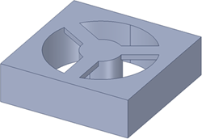

45. You will create the fan in Icepak. The fan CAD will only serve as reference geometry. Simplify the fan using the **Level 3** option.

**Figure 27.38: Simplified Fan - Level 3 Simplification**

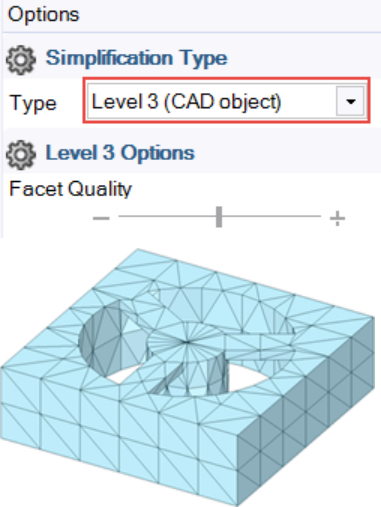

46. Facet quality is not important since you will delete this block once you create the Icepak fan object to replace it. For now, we can select faces and lines on the fan geometry in SpaceClaim and take note of the following dimensions that are displayed at the bottom of the interface:

• **Casing size**: 31.75 mm

• **Casing thickness**: 9.53 mm

• **Fan radius**: 12.7 mm

• **Hub radius**: 4.76 mm

• **Fan center**: 0 mm, 178.689 mm, -47.63 mm

**Figure 27.39: Fan Specifications**

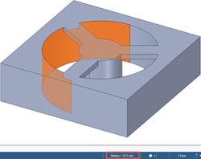

47. Use the **Show** > **Icepak Bodies** function and press **H** to display the home view. The final model should appear as displayed in Figure 27.40: Final Converted Model (p. 640).

**Figure 27.40: Final Converted Model**

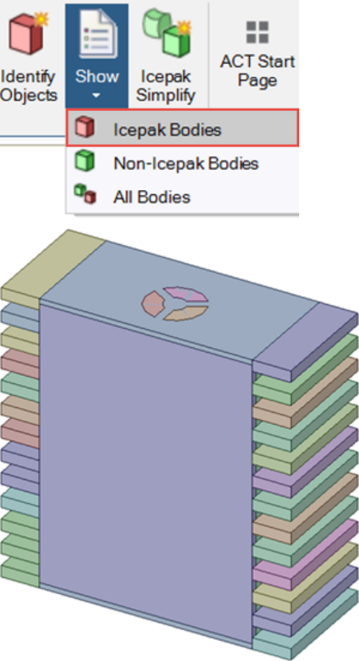

### 27.6. Open Icepak to Finalize Model Setup

1. All of the geometry is now translated to Icepak bodies. Now, launch Ansys Workbench by going to the **Prepare** ribbon and clicking **Workbench**.

2. Ansys Workbench opens and a **Geometry** cell is displayed in the **Project Schematic**.

3. Before proceeding, save the Workbench project by clicking **Save** from the **File** menu.

4. Right-click on cell **A2** and select **Transfer Data to New** > **Icepak**.

**Figure 27.41: Workbench - Transfer Data to Icepak**

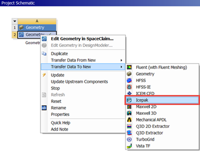

An **Icepak** module is added to the **Project Schematic**.

**Figure 27.42: Workbench - Linked Icepak Module**

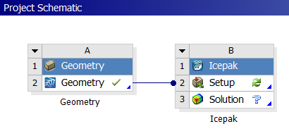

5. Double-click on cell **B2** to open Icepak.

6. The model is displayed in the **Model Display** window and the **Project** tree contains all the objects imported from SpaceClaim.

**Note:**

In Icepak, all objects must have unique names. If there were objects with the same name in SpaceClaim, they are automatically renamed in Icepak by appending a dot and a number.

**Figure 27.43: Model in Icepak**

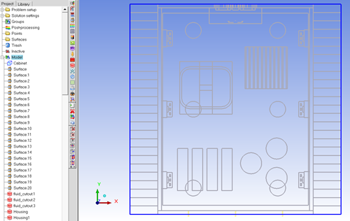

7. From the **Edit** menu, select **Preferences** and set the length units to mm. Select **Units** and **mm**. Click **Set as default**, click **Set all to defaults**, and then close the panel by clicking **This project**. This en- sures that all objects present in the model and those you will create going forward use **mm** as the unit of length.

**Figure 27.44: Edit Icepak Length Unit**

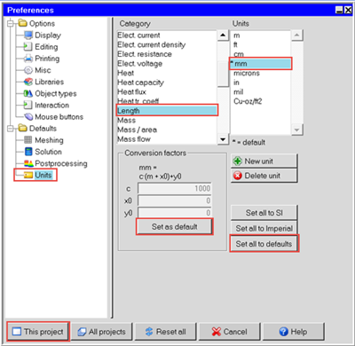

8. To create the fan, first click the fan icon

and double-click on the new fan in the model tree to open the **Edit** panel. On the **Geometry** tab, set the fan type to **3D**, position it in the **X-Z** plane, and use the hub and casing measurements noted in SpaceClaim.

**Figure 27.45: Edit Fan Object Geometry**

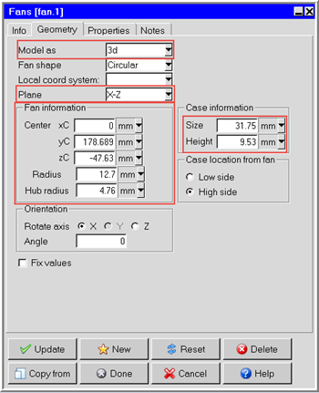

9. The fan is now positioned exactly as the original CAD fan. Delete the original CAD fan by selecting it in the **Project** tree, right-clicking it, and selecting **Delete**.

**Note:**

Ensure that you select the original CAD fan in the **Project** tree to delete the correct one. Alternatively, you can deactivate the CAD fan to keep it in the inactive node for future reference by right-clicking on it in the **Project** tree and deselecting **Active**.

**Figure 27.46: Delete the CAD Fan**

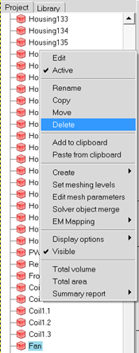

10. By default, all blocks are treated as solids. Select the fluid cutouts, right-click them, and select **Edit**. On the **Properties** tab, set the **Block type** as **Fluid**. Click **Done** to apply the change and close the **Edit** panel.

**Figure 27.47: Set Fluid Cutout Block Type**

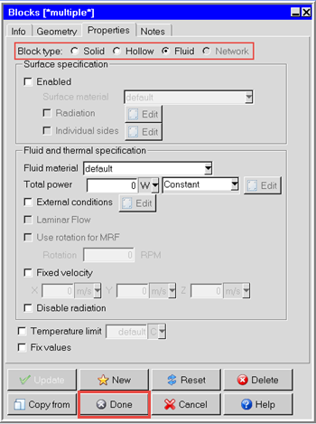

### 27.7. Generate a Mesh

Now that the model is complete, ensure that the meshing priority reflects the design intent.

1. Open the **Mesh control** panel and click **Generate** to generate a mesh. Meshing the model as is displays some issues that need to be resolved.

**Figure 27.48: Mesh Warnings**

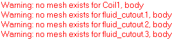

2. The fluid cutouts must have a higher meshing priority than the **Front-Panel** object. Reduce the meshing priority of the **Front-Panel** object by dragging it above the fluid cutouts in the **Project** tree.

**Figure 27.49: Adjust Front-Panel Mesh Priority**

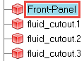

3. Similarly, the **Coil1** body needs a higher priority than the **Coil-2** object.

**Figure 27.50: Adjust Coil2 Mesh Priority**

4. Open the **Mesh control** panel and click **Generate** to generate a mesh again. With the issues resolved, the warnings do not appear.

**Note:**

Warnings are only displayed when an object is not meshed at all. Partially meshed objects will not trigger any warnings. It is good practice to inspect for adequate mesh resolution on all objects. The image below shows the Front- Panel mesh when the fluid cutouts have a higher meshing priority.

**Figure 27.51: Front-Panel Mesh with Fluid Cutouts**

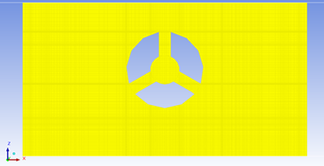

### 27.8. Step 6: Summary

In this tutorial, you learned how to prepare a CAD model for Ansys Icepak using Ansys SpaceClaim. You used the **Pull**,**Fill**,**Slice**, and **Simplify** operations to convert CAD shapes to Icepak bodies. Meshing priority was used to cut out holes in solids without incurring in the use of complex CAD shapes.

Details on more advanced geometry operations possible within SpaceClaim can be found at http:// www.spaceclaim.com/en/default.aspx. Topics include, but are not limited to:

• Using geometric parameters to create response surfaces.

• Creating complex flow regions for cold plates.

• Using power selection to reduce model prep time.

• Healing geometry issues due to translation errors.

• Creating mid-surfaces to approximate geometry and reduce mesh count.

• Modeling geometry with parametric equations.

• Using the blend tool to fix problematic geometry.

• Identifying and modeling sheet metal features.

• Working with faceted geometry (STL files).

---

## Chapter 28: Translation of MCAD Geometry to Icepak Native Geometry Using Ansys DesignModeler

### Chapter 28:Translation of MCAD Geometry to Icepak Native Geometry Using Ansys DesignModeler

### 28.1. Introduction

This tutorial will help familiarize the user with the Ansys Workbench (WB) and the Ansys DesignModeler (DM) interfaces. This tutorial uses a heat sink geometry to illustrate the various options that are available with the simplify feature of the Ansys DesignModeler - Electronics utility.

**Note:**

Mesh counts and solution results may differ slightly due to enhancements to the meshing algorithm and Fluent solver, respectively.

### 28.2. Prerequisites

• Familiarity with integration of Ansys Icepak into Ansys Workbench

• Familiarity with Ansys DesignModeler interface

### 28.3.Tutorial Outline

Part 1: General Topics

• Model Description

• WB Project Schematic

• DesignModeler

• Import CAD model

Part 2: Model Conversion from CAD to Icepak:

• Summary of Simplification

• Simplification into Icepak objects - Level 0

• Simplification into Icepak objects - Level 1

• Simplification into Icepak objects - Level 2

• Simplification into Icepak objects - Level 3

### 28.3. Tutorial Outline

### 28.4. Part 1: General Topics

### Model Description

Figure 28.1: Customized Heat Sink with all Detailed Features (p. 650) shows a customized heat sink which cools multiple components of different heights. This CAD model contains many detailed features which may not significantly affect the fluid flow and heat transfer behavior of the heat sink, such as through holes for screws to mount on the PCB. Hence, for CFD analysis using Icepak, removing such thermally unimportant features at the beginning of the project can reduce model setup time and unnecessarily fine meshing.

This simplification of CAD shapes offers the following benefits:

• You can more easily observe the model features than in the full, detailed CAD model.

• You can readily identify the features in the part that must be held constant and the portions where they have freedom to conduct parametric trials or design of experiment studies to improve the thermal and flow design.

• You will have less CAD-to-Icepak conversion work to do.

• You will have a better mesh with a lower mesh count.

Hence, we shall work with the defeatured CAD part shown in Figure 28.2: Defeatured customized heat sink (p. 651)

**Note:**

If you plan to perform a subsequent thermal stress analysis using the temperature data from Icepak results, you should retain the features that affect the stress analysis rather than sim- plify them.

**Figure 28.1: Customized Heat Sink with all Detailed Features**

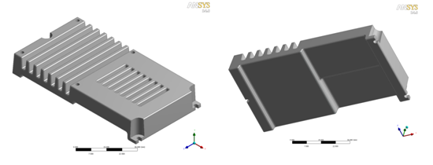

**Figure 28.2: Defeatured customized heat sink**

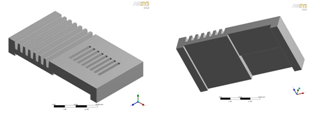

### 28.5. Ansys Workbench Project Schematic

• From the Windows **Start** menu, select **Start > Ansys 2022 R1 > Workbench 2022 R1** to start a new Ansys Workbench session.

• Go to **File** **Save** and save the project as **cust-hs**.

• Drag a **Geometry** component module from the **Toolbox** and drop it into the **Project Schematic** window as shown in Figure 28.3: Create the Geometry Component (p. 651) below.

**Figure 28.3: Create the Geometry Component**

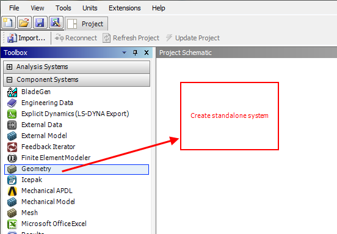

• Rename the **Geometry** component module to **STEP Import**. To rename the title, double-click the title Geometry or click the left mouse button on the down arrow and select the **Rename** option from the drop-down menu (highlighted in Figure 28.4: Rename the Geometry Component (p. 652) below).

**Figure 28.4: Rename the Geometry Component**

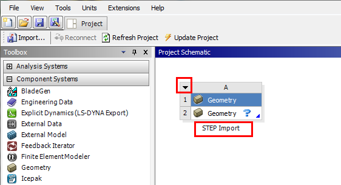

• Next, as shown in Figure 28.5: Create the Icepak Component (p. 652), select the Icepak component module from the toolbox and drop it on cell A2 of the geometry component to establish the link between **Geometry** (Ansys DesignModeler) and Ansys Icepak.

**Figure 28.5: Create the Icepak Component**

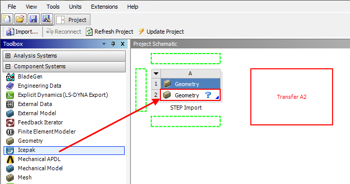

• This completes the schematic representation of the project workflow. The updated Project Schematic is shown in Figure 28.6: Updated Project Schematic (p. 653) below.

**Figure 28.6: Updated Project Schematic**

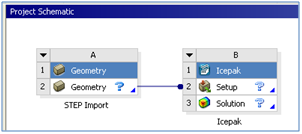

• Save the project using **File** **Save**.

### 28.6. DesignModeler

• In the Project Schematic, right-click the **Geometry** cell (A2) and select **New DesignModeler Geometry** to open DM.

• Go to **Tools** **Options**.

• In the **Options** panel, click the **Toolbars** sub-node under the **DesignModeler** node.

• Set **Slice**,**Freeze**, and **Electronics** to **Yes**.

• Click **OK** to exit the panel.

### 28.7. CAD Model Import

• Go to **File** **Import External Geometry File**, set file type to STEP (*.step;*.stp), select custom-heat_sink-simplified.stp and click **Open**.

**Note:**

The file custom-heat_sink-simplified.stp can be found on the ANSYS Help Site. The procedure for downloading this file is described below.

1. Set up a working directory on the computer you will be using.

2. Download the mcad_heatsink.zip file here.

3. Unzip the mcad_heatsink.zip file you have downloaded to your working directory.

• This creates a new import operation in the tree outline.

• Click **Generate** to complete the import operation.

**Tip:**

The key **F5** is the keyboard shortcut for **Generate**.

**Figure 28.7: Import Operation**

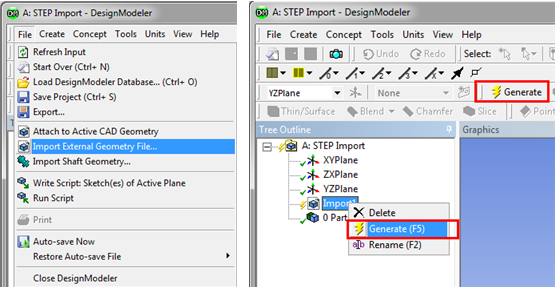

• Rotate the model and observe the various geometric features in the imported CAD body.

**Note:**

Generating the model is necessary to implement the last operation performed on the model. The **Graphics** window displays the changes.

• Note the updated status of the individual cells (A2 and B2) on the Workbench Project Schematic.

**Figure 28.8: Project Schematic – Updated Cell Status**

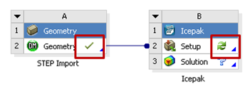

• In Workbench save the project using **File** **Save**.

### 28.8. PART 2: Model Conversion From CAD to Icepak

### Summary of Simplification

Simplification is the process of converting a CAD part into a geometric fit with Icepak primitive objects. Table 28.1: Simplification Types in DM for CAD-to-Icepak Conversion (p. 655) summarizes the four simplify choices available in the DM Electronics utility. In addition to the simplification of CAD parts, you will work with other DM tools that will be helpful in capturing the design intent in the Icepak model.

**Table 28.1: Simplification Types in DM for CAD-to-Icepak Conversion**

| Simplification Type | Description |
| --- | --- |
| Level 0 | • A single bounding box block is created for each part. • All features and internal faces are ignored. |
| Level 1 | • Internal faces are recognized - Part is split at these faces. • Resulting bodies are approximated as cuboids or cylindrical blocks. |
| Level 2 | • Similar to Level 1, except that the resulting block shapes are polygonal extrusions wherever applicable. |
| Level 3 | • The CAD part is transferred as is. • Results in an STL, or standard Tessellation language, representation as an Icepak CAD block or CAD plate. • Options for refinement of tessellation |

### 28.9. Ansys DesignModeler- Electronics

As shown in Figure 28.9: Accessing DesignModeler Electronics (p. 656) below, you can access the elec- tronics utility from the main menu as well as from the shortcuts toolbar (recommended).

**Figure 28.9: Accessing DesignModeler Electronics**

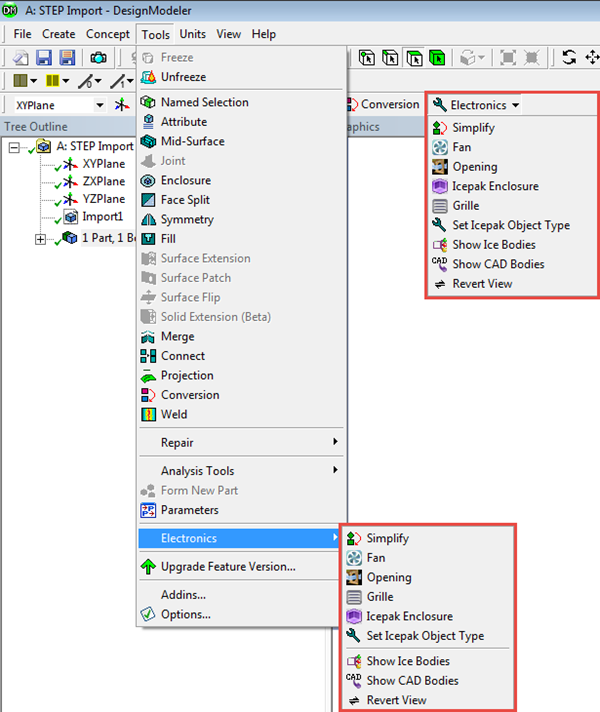

• Go to **Electronics** **Show Ice bodies**. The **Graphics** window will go blank. Now, go to **Electronics** **Show CAD bodies**. The **Graphics** window will show the heat sink geometry.

**Note:**

Regular Icepak shapes (rectangular prisms, cylinders, uniform polygons) are recognized as valid Icepak bodies automatically. The CAD bodies need to be converted to valid Icepak bodies using the **Electronics** utility.

### 28.10. Simplify - Level 0

### Steps in DM:

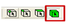

• From the shortcuts toolbar, change the geometry selection filter to **Bodies**.

• Select the heat sink body from either the **Tree Outline** or from the **Graphics** window (click the heat sink geometry).

**Figure 28.10: Tree Outline**

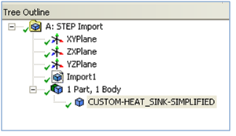

• Go to **Electronics** **Simplify**.

• Note that Simplify1 shows up in the Tree Outline and the **Details view** is populated with the simplified form. Go to the **Details** view.

• Click **Apply** in the **Select Bodies** row.

• Go to the **Simplify** input field and then add the prefix **L0_** to the existing name so that the feature is named L0_Simplify1. Press **Enter**.

• Set the **Simplification Type** to **Level 0** using the drop-down list.

• Click

to generate the model.

• A single block (corresponding to extents of the Heat Sink geometry) should appear in the **Graphics** window.

**Figure 28.11: Simplification Type: Level 0**

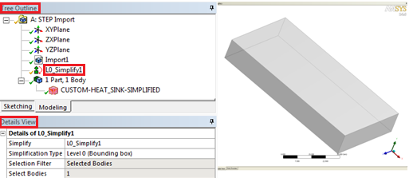

### Steps in Workbench

• Go to the Workbench **Project Schematic**.

• Change the title below the Icepak module to **Icepak-Simplify-Level0**. To do so, double-click the title or select the **Rename** option using the drop-down menu.

• Double-click cell B2 (Setup for the Icepak module) to open Icepak.

**Figure 28.12: Updated Project Schematic**

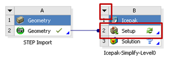

### Steps in Icepak

• Observe that the Icepak model contains one Icepak block, the default object type for the DM Elec- tronics utility.

**Figure 28.13: Icepak Interface for Icepak-Simplify-Level0**

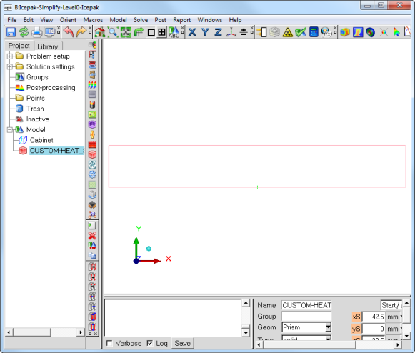

• Close the Icepak session.

### Steps in Workbench

• Go back to the Workbench **Project Schematic**. Select the link from the STEP Import module to the Icepak-Simplify-Level0 module. Press the **Delete** key on the keyboard to delete the link and then click **OK** to ignore the warning message that appears.

**Figure 28.14: Updated Project Schematic**

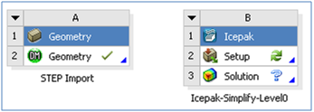

• Save the project using **File** **Save**.

### 28.11. Slice Tool in DM

• Go to DM. In the **Tree Outline**, right-click the L0_Simplify1 feature and click **Suppress**. This will return you to the original heat sink CAD geometry.

• Change the **Graphics** window orientation to the positive-Z orientation by clicking the +Z arrow in the global coordinate axes, as in Figure 28.15: Heat sink (p. 660) (a).

• Observe that the fins on the left side are polygonal profiles extruded through the heat sink length.

• Now rotate the model so that the top is just visible, as in Figure 28.15: Heat sink (p. 660) (b). Notice that the right side contains rectangular pockets. To capture the heat sink features accurately, we will model the left half with polygonal fit, and the right half with cuboidal fit.

**Figure 28.15: Heat sink**

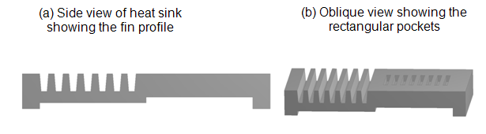

• From the shortcuts toolbar, click **Slice**.

• In the **Details** view, set the **Slice type** to **Slice by Surface**.

• Re-orient the model to expose the heat sink bottom as in Figure 28.16: Selection of Slice Surface (p. 661).

• Select the median face (highlighted in green on the Graphics window) as in Figure 28.16: Selection of Slice Surface (p. 661).

**Note:**

The geometry selection filter is automatically set to **Faces**.

• Click **Apply** on the **Details** view to confirm this selection as the target face for the slice operation.

**Figure 28.16: Selection of Slice Surface**

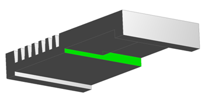

• Set the **Slice Targets** field to **Selected Bodies** (click the field to the right of **Slice Targets**). Select the yellow bodies field (right box). The selection filter is automatically set to bodies. Select the heat sink body. Click the **Apply** button to complete the selection.

**Figure 28.17: Details View for Slice Operation**

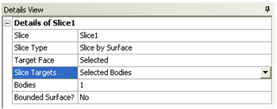

• Click **Generate** to generate the slice feature.

• Observe that the original heat sink is sliced into two bodies as in Figure 28.18: Updated Tree Outline and Graphics Window (p. 661).

**Figure 28.18: Updated Tree Outline and Graphics Window**

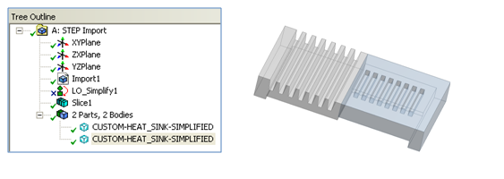

• Confirm that the left side of the heat sink is recognized as a valid Icepak body by going to **Electronics** **Show Ice Bodies**. The right side of the heat sink becomes invisible with this selection.

**Note:**

In the **Tree Outline**, the icon for a valid Icepak body (left half of heat sink) is similar to the icon used for the corresponding primitive, a block in this case, in Icepak.

**Figure 28.19: Show Ice Bodies, Updated Tree Outline and Graphics Window**

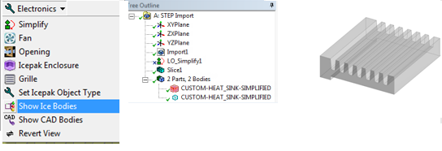

• Next, go to **Electronics** **Show CAD Bodies** and confirm that only the right hand side of the heat sink is visible with this selection.

**Figure 28.20: Show CAD Bodies, Updated Tree Outline and Graphics Window**

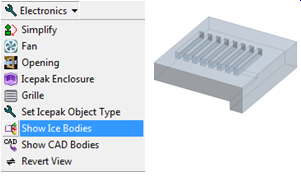

• Go to **Electronics** **Revert View** to make both bodies visible.

– Or select **Show All Bodies** from any of the context menus (right-click within the **Tree Outline** or

the **Graphics** window) to also make both bodies visible.

**Figure 28.21: Revert View and Context Menus**

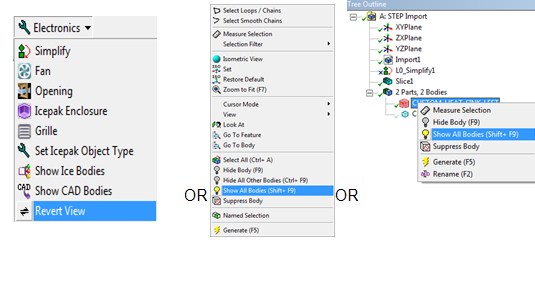

• As shown in Figure 28.22: Rename the Bodies After the Slice Operation (p. 663), right-click the names of the bodies and rename the two bodies as **CUSTOM-HEAT_SINK-SIMPLIFIED-LEFT** and **CUS-** **TOM-HEAT_SINK-SIMPLIFIED-RIGHT**.

– The key **F2** can also be used for renaming the bodies.

**Figure 28.22: Rename the Bodies After the Slice Operation**

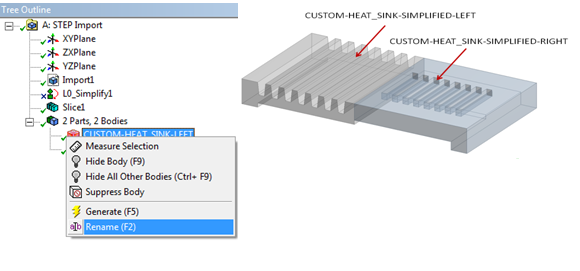

• In the next section, we shall use different simplify operations on the child bodies (created as a result of the **Slice** operation).

### 28.12. Simplify - Level 1

### Steps in DM

• In DM, set the geometry selection filter to **Bodies**.

• Select CUSTOM-HEAT_SINK-SIMPLIFIED-RIGHT.

• Start a new simplify operation using **Electronics** **Simplify**.

• In the **Details** view, click **Apply** in the **Select Bodies** field.

• Rename the **Simplify** field as **L1_Simplify2**.

• Set **Simplification Type** to Level 1.

• Click **Generate** to generate the feature.

• Observe the changes in CUSTOM-HEAT_SINK-SIMPLIFIED-RIGHT (see Figure 28.23: Updated Tree Outline and Graphics window (p. 664)). The original body is replaced with several cuboidal child bodies.

• A new part named CUSTOM-HEAT_SINK-SIMPLIFIED-RIGHT, containing the above cuboid bodies, is created in the **Tree Outline**. This occurs whenever a body is fitted with multiple child bodies.

**Figure 28.23: Updated Tree Outline and Graphics window**

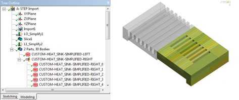

### Steps in Workbench:

• Go to the Workbench Project Schematic.

• Create a new Icepak component as shown below. Rename the Icepak component to **Icepak-Sim-** **plify-Level1** and establish a link between STEP Import (A2) and Icepak-Simplify-Level1 (C2).

**Figure 28.24: Updated Project Schematic**

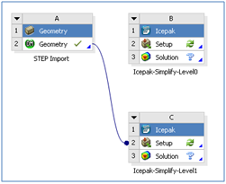

• Save the project using **File** **Save**.

• Double-click cell C2 (**Setup** for the Icepak module Icepak-Simplify-Level1) to open Icepak.

### Steps in Icepak:

• Observe the Icepak model.

• Notice that CUSTOM-HEAT_SINK-SIMPLIED-LEFT is automatically translated to a corresponding polygonal block shape in Icepak.

– Recall that **Simplify** operation is not required for regular Icepak shapes such as prisms, cylinders,

uniform polygons, and so on.

– If you do not wish to apply the automatically recognized shape, you can use DM to simplify the

CAD geometry as required.

– It is good practice to use simplification operations for all bodies that must be transferred to Icepak.

• The part CUSTOM-HEAT_SINK-SIMPLIED-RIGHT shows up as an Icepak assembly with the same name. Expand the assembly to view the contents on the **Model manager** window and the graphics window as shown in Figure 28.25: Icepak interface for Icepak-Simplify-Level1 (p. 666).

**Figure 28.25: Icepak interface for Icepak-Simplify-Level1**

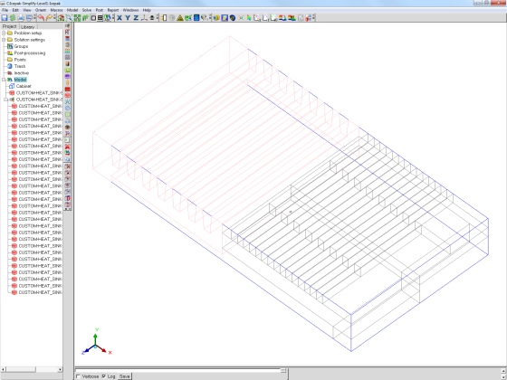

• Close Icepak.

### Steps in Workbench

• Go back to the Workbench **Project Schematic**. Select the link from STEP Import to Icepak- Simplify-Level1 module. Press the **Delete** key to delete the link and click **OK** to ignore the warning message that appears.

**Figure 28.26: Updated Project Schematic**

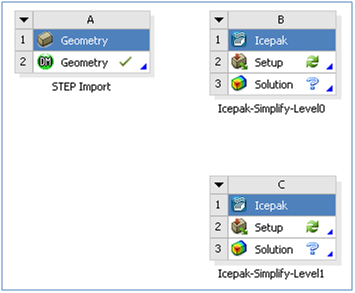

• Save the project using **File** **Save**.

### 28.13. Simplify - Level 2

• Recall that the **Simplify - Level 2** feature is similar to **Simplify - Level 1**, except that the resulting block shapes are polygonal extrusions whenever applicable.

• The procedure for **Simplify - Level 2** is identical to the procedures discussed above for **Simplify -** **Level 0** or **Simplify - Level 1**, with the exception of the **Simplification Type** field, which must be set to **Level 2**.

• For this project, only the body at the left of Figure 28.18: Updated Tree Outline and Graphics Win- dow (p. 661) has a meaningful polygonal shape. Since Ansys Icepak automatically recognizes this shape as a polygon block, the default shape, you do not need to define the simplification for this body explicitly.

### 28.14. Simplification into Icepak Objects – Level 3

• Go to DM. Suppress the Slice1 feature, which also suppresses L1_Simplify2. This brings back the original heat sink geometry.Figure 28.27: Updated Tree Outline (p. 668) shows the updated **Tree** **Outline**.

• Rename the heat sink part as **CUSTOM-HEAT_SINK_SIMPLIFIED**.

**Figure 28.27: Updated Tree Outline**

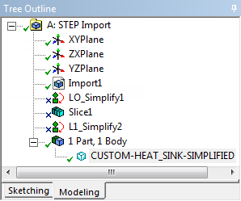

• Set the geometry selection filter to **Bodies**.

• Select the heat sink body and create a new **Simplify** operation.

• In the **Details** view, click **Apply** in the select bodies field.

• Rename the **Simplify** field as **L3_Simplify3**.

• Set the **Simplification Type** to **Level 3**.

• Set the **Facet Quality** to **Very coarse**.

• Click **Generate** to create the feature.

• Toggle between **Electronics** **Show Ice Bodies** and **Electronics** **Show CAD Bodies** to confirm that the entire heat sink geometry has been converted to a valid Icepak body. You should not see any objects in the **Graphics** window after selecting **Show CAD Bodies**.

**Figure 28.28: Updated Tree Outline and Details View for L3_Simplify3**

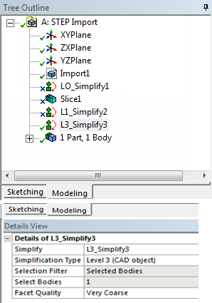

### Steps in Workbench

• Go to the Workbench **Project Schematic**.

• Create a new Icepak component as shown below. Rename the Icepak component to **Icepak-Sim-** **plify-Level3** and establish a link between STEP Import (A2) and Icepak-Simplify-Level3 (D2).

**Figure 28.29: Updated Project Schematic**

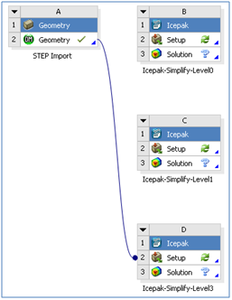

• Save the project using **File** **Save**.

• Double-click cell D2 (**Setup** for the Icepak component **Icepak-Simplify-Level3**) to open Icepak.

### Steps in Icepak

• Examine the Icepak model.

• Notice that the model is identical to the original CAD import.

• Check the Icepak geometry information of the only block- note that the shape is set to CAD. This is an Icepak CAD block.

**Note:**

Since all the sides of this part were planar, the facet quality of very coarse was sufficient. On the other hand, if the original CAD part contained more complex surfaces, such as b- spline, torus, or partial or toroid cylinders, a finer resolution option might be required.

**Figure 28.30: Icepak Interface for Icepak-Simplify-Level3**

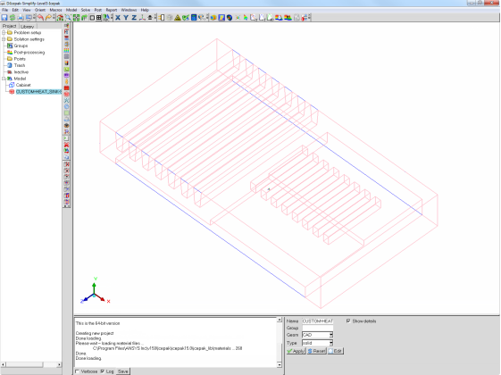

• Close Icepak.

### Steps in Workbench

• Go back to Workbench and save the project using **File** **Save**.

### 28.15. Conclusion

In this tutorial, you:

• Learned how to use DM to convert a CAD part into an Icepak model

• Became better acquainted with the different levels of simplification available within the DM **Electronics** utility

• Used the **Slice** feature multiple times in DM

---

## Chapter 29: Simple Geometry Import Using SpaceClaim

### 29.1. Introduction

This tutorial demonstrates how to use Ansys SpaceClaim to convert a heat sink model for analysis in Ansys Icepak.

In this tutorial, you will learn how to use the Icepak Simplify and Split Body tools in ANSYS SpaceClaim.

**Note:**

Mesh counts and solution results may differ slightly due to enhancements to the meshing algorithm and Fluent solver, respectively.

### 29.2. Prerequisites

This tutorial assumes that you have basic familiarity with the Ansys Workbench and Ansys Icepak inter- faces.

### 29.3. Problem Description

You will use ANSYS SpaceClaim to convert an imported STEP file for use in Ansys Icepak.

The input file custom-heat_sink-simplified.stp can be found on the ANSYS Help Site. The procedure to download this file is described below.

1. Set up a working directory on the computer you will be using.

2. Download the mcad_heatsink.zip file here.

3. Unzip the mcad_heatsink.zip file you have downloaded to your working directory.

### 29.4. Step 1: Create a New Project

1. Open a new session of Ansys SpaceClaim (**Start** > **All Programs** > **ANSYS** **2019 R2** > **SCDM** **2019** **R2**).

2. From the **File** menu, select **Open** to display the **Open** dialog.

3. Select **STEP** as the file type and navigate to your working directory where the custom- heat_sink_simplified.stp file is located.

4. Click **Open** with the default import options as shown in Figure 29.1: SpaceClaim Open Dialog (p. 674).

**Figure 29.1: SpaceClaim Open Dialog**

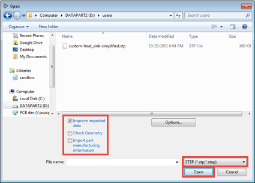

5. The imported geometry should appear as shown in Figure 29.2: Initial Geometry in SpaceClaim (p. 674).

**Figure 29.2: Initial Geometry in SpaceClaim**

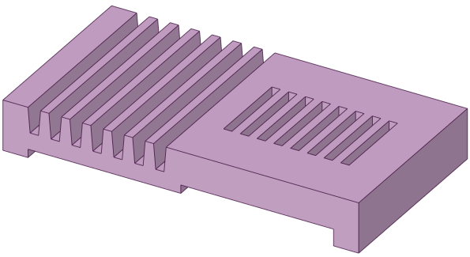

### 29.5. Simplify - Level 0

### Steps in SpaceClaim:

First, oversimplify the geometry as just a bounding box.

1. On the **Workbench** tab in the **Icepak** toolbar, click **Icepak Simplify**.

**Figure 29.3: Icepak Simplify**

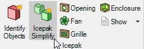

2. Under **Simplification Type** in the **Options**, select **Level 0 (bounding box)**.

3. Under **Level 0 Options**, select **Preserve original**.

**Figure 29.4: Simplification Options -Level 0**

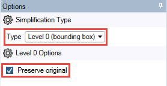

4. In the graphics window, click on the heat sink geometry. A single block (corresponding to extents of the Heat Sink geometry) appears in the graphics window, and a block is added to the **Structure** tree.

**Figure 29.5: Simplification Type: Level 0**

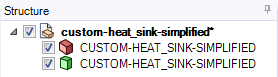

5. In the **Icepak** toolbar, select **Icepak Bodies** from the **Show** drop-down list.

**Figure 29.6: Simplification Type: Level 0**

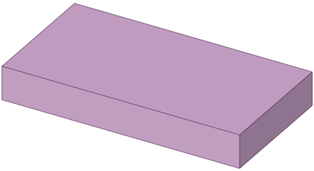

6. In the **Ansys Workbench** toolbar, click the **19.0** button to start Ansys Workbench.

### Steps in Workbench:

1. Go to the Workbench **Project Schematic**.

2. Rename the **Geometry** component module to **STEP Import**. To rename the title, double-click the title Geometry or click the left mouse button on the down arrow and select the **Rename** option from the drop-down menu

3. Select the Icepak component module from the toolbox and drop it on cell A2 of the geometry component to establish the link between **Geometry** (SpaceClaim) and Icepak. Alternatively, you can right-click on cell A2, select **Transfer Data to New** > **Icepak**.

4. Name the Icepak component module **Icepak-Simplify-Level0**.

5. Double-click cell B2 (Setup for the Icepak module) to open Icepak.

**Figure 29.7: Updated Project Schematic**

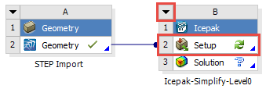

### Steps in Icepak:

1. Observe that the Icepak model contains one Icepak block, the default object type for SpaceClaim.

**Figure 29.8: Icepak Interface for Icepak-Simplify-Level0**

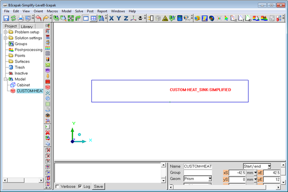

**Note:**

You can display object names by going to **View** > **Display** > **Object names**. To change the background color go to **Edit** > **Preferences** > **Display**.

2. Close the Icepak session.

### Steps in Workbench:

1. Go back to the Workbench **Project Schematic**. Select the link from the STEP Import module to the Icepak-Simplify-Level0 module. Press the **Delete** key on the keyboard to delete the link and then click **OK** to ignore the warning message that appears.

**Figure 29.9: Updated Project Schematic**

2. Save the project using **File** > **Save**.

### 29.6. Split Body Tool in SpaceClaim

1. Go to SpaceClaim.

2. In the **Structure** tree, select the CUSTOM-HEAT_SINK-SIMPLIFIED Icepak body with the red block icon and press **Delete**. Then, select the CUSTOM-HEAT_SINK-SIMPLIFIED non-Icepak body. If this body is not visible in the **Graphics** window, select the checkbox next to its name in the **Structure** tree.

3. On the **Design** tab in the **Clipboard** toolbar, click the copy button and then the paste button. A copy of the CUSTOM-HEAT_SINK-SIMPLIFIED body appears in the **Structure** tree. You can also select the body in the **Structure** tree and use the shortcuts **Ctrl**+**C** followed by **Ctrl**+**V** on the key- board.

4. Right-click on one of the CUSTOM-HEAT_SINK-SIMPLIFIED bodies and select **Rename**. Rename the body to CUSTOM-HEAT_SINK-SIMPLIFIED-ORIGINAL.

5. In the **Structure** tree, deselect the check box next to CUSTOM-HEAT_SINK-SIMPLIFIED-ORI- GINAL to hide the body.

6. Change the **Graphics** window orientation to the positive-Z orientation by clicking the +Z arrow in the global coordinate axes, as in Figure 29.10: Heat sink (p. 678) (a). Observe that the fins on the left side are polygonal profiles extruded through the heat sink length.

7. On the **Design** tab in the **Orient** toolbar, select **Spin**. You can also directly spin the model with the middle mouse button.

8. Now rotate the model so that the top is just visible, as in Figure 29.10: Heat sink (p. 678) (b). Notice that the right side contains rectangular pockets. To capture the heat sink features accurately, we will model the left half with polygonal fit, and the right half with cuboidal fit.

**Figure 29.10: Heat sink**

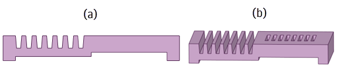

9. Re-orient the model to expose the heat sink bottom as in Figure 29.11: Selection of Surface (p. 679).

10. In the **Intersect** toolbar, click **Split Body**.

11. Click the heat sink geometry to select it as the target body, anad then select the median face (highlighted in orange in the graphics window) as in Figure 29.11: Selection of Surface (p. 679). The geometry is split in the graphics window, and the **Structure** tree is updated.

**Figure 29.11: Selection of Surface**

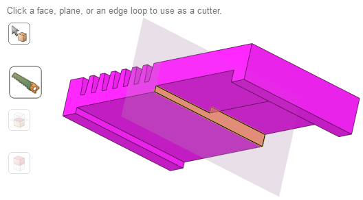

12. Press **Esc** on the keyboard to exit the **Split Body** tool.

13. On the **Workbench** tab in the **Icepak** toolbar, click **Identify Objects**.

**Figure 29.12: Convert to Icepak Primitives**

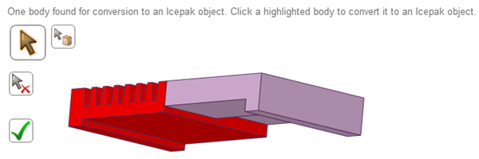

14. Click the green checkmark button to convert the identified body to an Icepak object. The **Structure** tree is updated.

15. Press **Esc**.

16. In the **Icepak** toolbar, select **Icepak Bodies** from the **Show** drop-down list.

**Figure 29.13: Show Icepak Bodies, Updated Structure Tree, and Graphics Window**

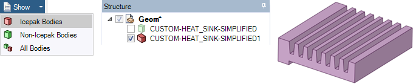

17. In the **Structure** tree, select the check box next to CUSTOM-HEAT_SINK-SIMPLIFIED to show the body.

18. On the **Design** tab in the **Orient** toolbar, click **Home**.

19. In the **Structure** tree, rename both sides of the heat sink as shown in Figure 29.14: Show Icepak Bodies, Updated Structure Tree, and Graphics Window (p. 680).

**Figure 29.14: Show Icepak Bodies, Updated Structure Tree, and Graphics Window**

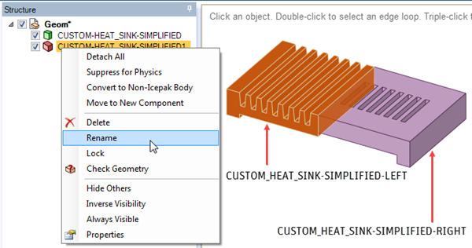

In the next section, we will use different simplify operations on the child bodies (created as a result of the Split Body operation).

### 29.7. Simplify - Level 1

### Steps in SpaceClaim

1. On the **Workbench** tab in the **Icepak** toolbar, click **Icepak Simplify**.

2. Under **Simplification Type** in the **Options**, select **Level 1 (cuboid, cylindrical fit)**.

3. Under **Level 1 Options**, ensure that **Preserve original**,**Allow splitting**, and **Randomize** color are selected.

4. In the graphics window, click on the CUSTOM-HEAT_SINK-SIMPLIFIED-RIGHT geometry.

5. Press **Esc**.

6. In the **Structure** tree, use the **Shift** button to select all of the newly created bodies. Right-click on the selection and select **Move to New Component**. The newly created bodies are listed under a new component. Rename the component to CUSTOM-HEAT_SINK-SIMPLIFIED-RIGHT.

7. In the **Icepak** toolbar, select **Icepak Bodies** from the **Show** drop-down list.

**Figure 29.15: Level 1 Simplification - New Component**

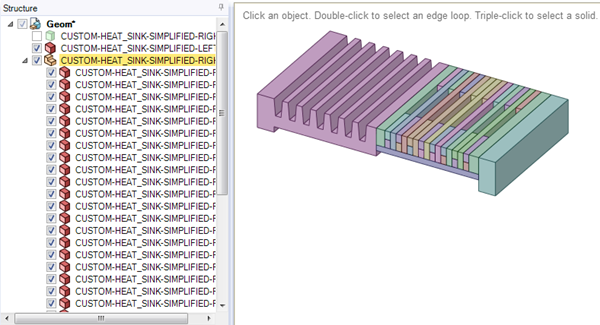

8. On the **File** tab, click **Save**.

### Steps in Workbench

1. Go to the Workbench **Project Schematic**.

2. Right-click on the **Geometry** cell A2 and select **Update**.

3. Create a new Icepak component as shown below. Rename the Icepak component to **Icepak-** **Simplify-Level1** and establish a link between STEP Import (A2) and Icepak-Simplify- Level1 (C2).

**Figure 29.16: Updated Project Schematic**

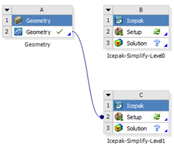

4. Save the project using **File** > **Save**.

5. Double-click cell C2 (**Setup** for the Icepak module Icepak-Simplify-Level1) to open Icepak.

### Steps in Icepak:

1. Observe the Icepak model.

2. Notice that CUSTOM-HEAT_SINK-SIMPLIED-LEFT is automatically translated to a corresponding polygonal block shape in Icepak.

• Recall that **Icepak Simplify** operation is not required for regular Icepak shapes such as prisms, cylinders, uniform polygons, and so on.

• If you do not wish to apply the automatically recognized shape, you can use SpaceClaim to sim- plify the CAD geometry as required.

• To reduce mesh count and increase mesh quality, it is good practice to use simplification operations for all bodies that must be transferred to Icepak.

3. The part CUSTOM-HEAT_SINK-SIMPLIED-RIGHT shows up as an Icepak assembly with the same name. Expand the assembly to view the contents on the **Model manager** window and the graphics window as shown in Figure 29.17: Icepak interface for Icepak-Simplify-Level1 (p. 683).

**Figure 29.17: Icepak interface for Icepak-Simplify-Level1**

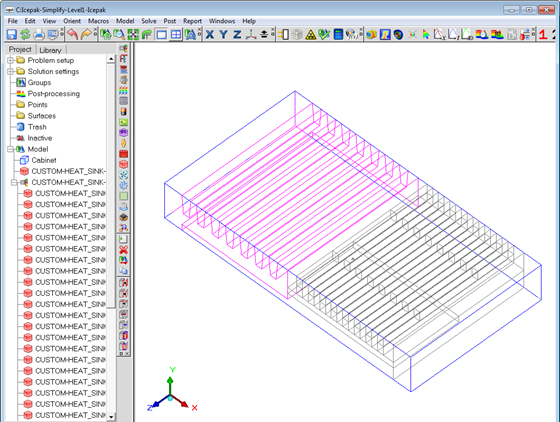

4. Close Icepak.

### Steps in Workbench

1. Go back to the Workbench **Project Schematic**. Select the link from STEP Import to Icepak- Simplify-Level1 module. Press the **Delete** key to delete the link and click **OK** to ignore the warning message that appears.

**Figure 29.18: Updated Project Schematic**

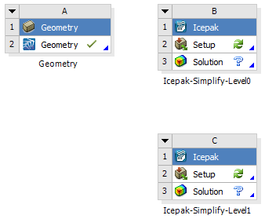

2. Save the project using **File** > **Save**.

### 29.8. Simplify - Level 2

• Recall that the **Simplify - Level 2** feature is similar to **Simplify - Level 1**, except that the resulting block shapes are polygonal extrusions whenever applicable.

• The procedure for **Simplify - Level 2** is identical to the procedures discussed above for **Simplify -** **Level 0** or **Simplify - Level 1**, with the exception of the **Simplification Type** field, which must be set to **Level 2**.

• For this project, only the body at the left of Figure 28.18: Updated Tree Outline and Graphics Win- dow (p. 661) has a meaningful polygonal shape. Since Ansys Icepak automatically recognizes this shape as a polygon block, the default shape, you do not need to define the simplification for this body explicitly.

• In some cases you must explicitly use **Simplify - Level 2** and enforce the axis in the correct direction to obtain the desired polygonal extrusion.

### 29.9. Simplification into Icepak Objects – Level 3

### Steps in SpaceClaim

1. In the **Structure** tree, delete the CUSTOM-HEAT_SINK-SIMPLIED-LEFT and CUSTOM- HEAT_SINK-SIMPLIED-RIGHT bodies.

2. Select the check box next to CUSTOM-HEAT_SINK-SIMPLIED-ORIGINAL to display the orignal geometry.

3. On the **Workbench** tab in the **Icepak** toolbar, click **Icepak Simplify**.

4. Under **Simplification Type** in the **Options**, select **Level 3 (CAD object)**.

5. Under **Level 3 Options**, move the **Facet Quality** slider to the left to set a very coarse facet quality.

**Figure 29.19: Simplification Options -Level 3**

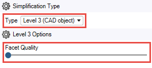

6. In the graphics window, click on the CUSTOM-HEAT_SINK-SIMPLIFIED-ORIGINAL geometry. A preview of the facets is displayed on the body and remain visible until you exit the tool.

**Figure 29.20: Updated Project Schematic and Facets Preview**

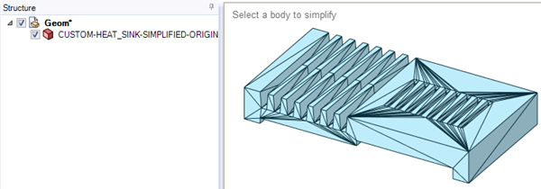

7. Press **Esc**.

8. On the **File** tab, click **Save**.

### Steps in Workbench

• Go to the Workbench **Project Schematic**.

• Right-click on the **Geometry** cell A2 and select **Update**.

• Create a new Icepak component as shown below. Rename the Icepak component to **Icepak-Sim-** **plify-Level3** and establish a link between STEP Import (A2) and Icepak-Simplify-Level3 (D2).

**Figure 29.21: Updated Project Schematic**

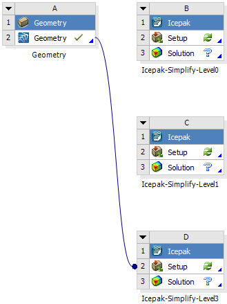

• Save the project using **File** **Save**.

• Double-click cell D2 (**Setup** for the Icepak component **Icepak-Simplify-Level3**) to open Icepak.

### Steps in Icepak

– Examine the Icepak model.

– Notice that the model is identical to the original CAD import.

– Check the Icepak geometry information of the only block- note that the shape is set to CAD. This

is an Icepak CAD block.

**Note:**

Since all the sides of this part were planar, the facet quality of very coarse was sufficient. On the other hand, if the original CAD part contained more complex surfaces, such as b-spline, torus, or partial or toroid cylinders, a finer resolution option might be required. It is good practice to examine CAD object facet quality in Icepak by setting the display type to Solid.

**Figure 29.22: Icepak Interface for Icepak-Simplify-Level3**

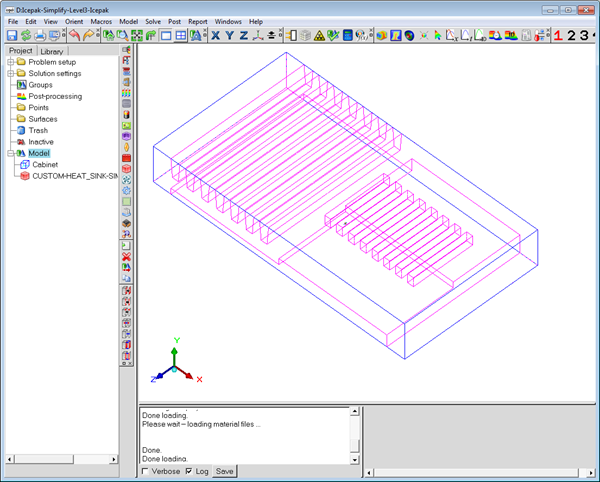

– Close Icepak.

### Steps in Workbench

• Go back to Workbench and save the project using **File** >**Save**.

### 29.10. Step 6: Summary

In this tutorial, you:

• Learned how to use SpaceClaim to convert a CAD part into an Icepak model

• Became better acquainted with the different simplification levels available within SpaceClaim

• Used the **Split Body** feature in SpaceClaim

Details on more advanced geometry operations possible within SpaceClaim can be found at http:// www.spaceclaim.com/en/default.aspx. Topics include, but are not limited to:

• Using geometric parameters to create response surfaces.

• Creating complex flow regions for cold plates.

• Using power selection to reduce model prep time.

• Healing geometry issues due to translation errors.

• Creating mid-surfaces to approximate geometry and reduce mesh count.

• Modeling geometry with parametric equations.

• Using the blend tool to fix problematic geometry.

• Identifying and modeling sheet metal features.

• Working with faceted geometry (STL files).

---

## Chapter 30: Translation of System-Level MCAD Geometry to Icepak Native Geometry Using Ansys DesignModeler

### Chapter 30:Translation of System-Level MCAD Geometry to Icepak Native Geometry Using Ansys DesignModeler

### 30.1. Introduction

This tutorial describes procedures in Ansys DesignModeler (DM) that enable you to work more efficiently with assembly-level CAD models. The tutorial will discuss various aspects of model organization in DM as well as illustrate the use of DM toward conversion of the CAD geometry to a native Ansys Icepak representation.

**Note:**

Mesh counts and solution results may differ slightly due to enhancements to the meshing algorithm and Fluent solver, respectively.

### 30.2. Prerequisites

To use this tutorial more effectively, you should have the following:

• Completion of the tutorial Translation of MCAD Geometry to Icepak Native Geometry Using Ansys DesignModeler (p. 649) in the Icepak Tutorials

• Familiarity with the Ansys Workbench (WB) and DM interfaces

– Ansys Icepak - Ansys Workbench Integration Tutorial (p. 447) in the Icepak Tutorials

– Design Modeler - Electronics (p. 553) in the Icepak Tutorials

• Familiarity with the conversion of CAD objects into Icepak native objects

### 30.3.Tutorial Outline

This tutorial covers the following topics:

• Description of the model

• Import of the CAD model

• Studying of the CAD model

• Organization and simplification of the imported CAD model

### 30.3. Tutorial Outline

### 30.4. Model Description

This tutorial will consider a system-level electronics box (see figure below) for efficient conversion to Icepak native geometry. The box consists of several parts such as the chassis, motherboard, CPU box, fan system, memory, and so on.

**Figure 30.1: Electronics Box Model**

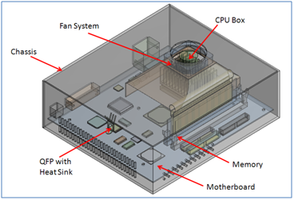

### 30.5. Getting Started – Ansys Workbench, Project Schematic

• From the Windows **Start** menu, select **Start > Ansys 2022 R1 > Workbench 2022 R1** to start a new Ansys Workbench session.

• Go to **File** **Save** and save the project as **DME-Icepak-SystemLevel**.

• Go to **Tools** **Options** **Appearance**. Scroll down and select the **Beta Options** check box.

– This tutorial requires the use of the **Solid Extension** feature, which is currently available as a beta

feature in DM.

**Figure 30.2: Turning On Beta Options**

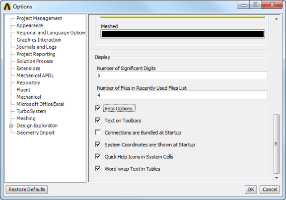

• Drag a **Geometry** component module from the **Toolbox** and drop it into the **Project Schematic** window as shown in Figure 30.3: Create the Geometry Component (p. 692).

**Figure 30.3: Create the Geometry Component**

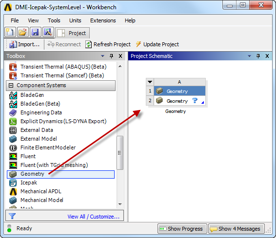

• Rename the Geometry component module to **MCAD**.

• Select the Icepak component module from the **Toolbox** and drop it on cell A2 of MCAD to establish a link between Ansys DesignModeler and Ansys Icepak.

• Rename the Icepak component module to **CFD**.

• This completes the schematic representation of the project workflow. Figure 30.4: Updated Project Schematic (p. 692) shows the updated **Project Schematic**.

**Figure 30.4: Updated Project Schematic**

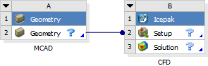

• Save the project using **File** **Save**.

### 30.6. Getting Started - Ansys DesignModeler

• In the Project Schematic, right-click cell A2, of the MCAD component module, and select **New** **DesignModeler Geometry** to open DM.

• Go to **Tools** **Options**. Click the **Units** node and select **Millimeter** for the **Length Unit**.

• While you are still in the **Options** panel, go to the **Toolbars** node. Set **Slice**,**Freeze**,**Electronics**, **Analysis Tools**,**Repair**,**Face Delete** and **Concept Modeling** to **Yes** to make these utilities available in the **Shortcuts Toolbar** as shown below.

**Figure 30.5: Sample Layout for DM Shortcuts Toolbar**

### 30.7. Import of CAD Geometry

• In DM, go to **File** **Import External Geometry File...**, set file type to STEP (*.step;*stp), select generic-electronic-box.stp and click **Open**.

**Note:**

The file generic-electronic-box.stp can be found on the ANSYS Help Site. The procedure for downloading this file is described below.

1. Set up a working directory on the computer you will be using.

2. Download the mcad_board.zip file here.

3. Unzip the mcad_board.zip file you have downloaded to your working directory.

• This creates a new import operation in the **Tree Outline**.

• In the **Shortcuts Toolbar**, click **Generate** to complete the import operation.

**Figure 30.6: Updated Tree Outline and Graphics Window**

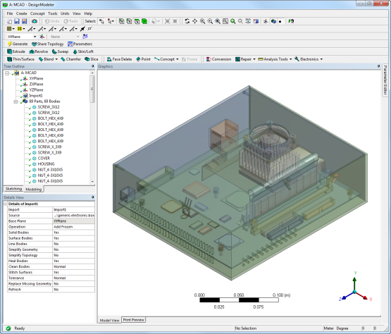

### 30.8. Initial Model Review

• Observe the various geometric features in the imported CAD geometry.

– Use mouse movements and context menu options (**Hide Body**,**Hide All Other Bodies**,**Show**

**Body**, and **Show All Bodies**) as needed.

• In the **Tree Outline**, go to the **69 Parts, 69 Bodies** node.

• The description indicates that there are 69 Parts and 69 Bodies in this setup.

• Expand the **69 Parts, 69 Bodies** node and observe that although the node shows 69 parts, these are not multi-body parts.

– For all practical purposes, the DM geometry, at this point, does not contain any parts. With DM,

this is true for any newly imported CAD geometry.

**Note:**

As a part of the import operation in DM, all the CAD parts from the original CAD model are retained in the correct locations as DM Bodies. However, the organization of the CAD assemblies (irrespective of the import source) cannot be preserved in DM.

**Figure 30.7: Tree Outline**

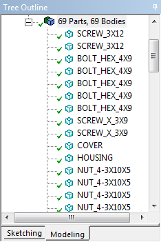

• Examine which objects are already recognized as compatible with Icepak native geometry.

1. Go to **Electronics** **Show Ice Bodies**. This feature displays only those CAD bodies that have been recognized by DM as valid for translation to Icepak.

2. Since no simplify operations have been performed yet, only the simple shape bodies are recognized as valid for translation to Icepak at this instance.

3. Figure 30.8: DM Bodies Compatible with Icepak Native Geometry (p. 696) shows the bodies that can be directly converted to Icepak native geometry without simplification in DesignModeler.

**Figure 30.8: DM Bodies Compatible with Icepak Native Geometry**

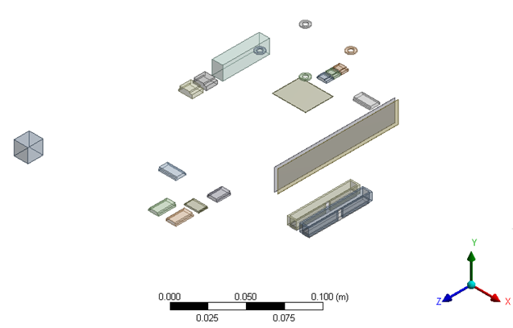

4. Go to **Electronics** **Revert View** to return to the full model view.

**Note:**

Using **Show Ice Bodies** also updates the icons for the Icepak-compatible bodies in the **Tree Outline**.

### 30.9. CAD Geometry Information and Repair Utilities

*Key Question*: Is there a need to repair the imported MCAD geometry?

• CAD-to-DM translation can return incomplete, corrupt, or disconnected geometry.

• As shown below, the **Analysis Tools** and **Repair** utilities in DM can be used to fix incomplete or corrupt geometry and connect disconnected geometry.

**Note:**

The geometry used in this tutorial does not need any repair.

**Figure 30.9: Repair and Analysis Tools Utilities in DM**

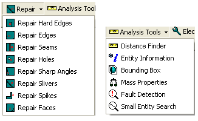

### 30.10. Suppress Non-Essential Bodies

*Key Question*: Is it necessary to model all the bodies present in the CAD setup?

• Objects like screws, bolts, nuts, washers, springs, and so on have negligible influence on the heat transfer physics of a given problem and hence can be completely ignored for the CFD analysis.

• From the **Tree Outline**, holding down the **Ctrl** key, click all of the screws, bolts, nuts, and washers to select them simultaneously.

• Right-click the selection and click **Form New Part**.

• Rename the newly formed part to **Fasteners**.

• Right-click Fasteners and click **Suppress Part** to deactivate the geometry for the rest of the ana- lysis.

**Figure 30.10: Create and Suppress Fasteners, Updated Graphical Display**

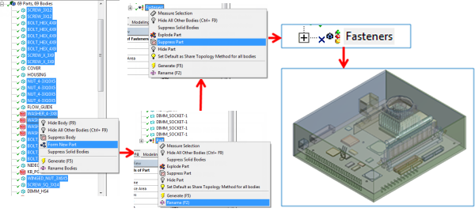

**Note:**

Generally, fasteners are non-essential for the CFD analysis. However, you must be careful to include any heat spreading objects. Also, if combined thermo-mechanical analysis with Ansys Icepak and Ansys Mechanical is planned, it is possible that some of the fasteners are important for FEA purposes. In this case, you should include these fasteners in both Ansys Icepak and Ansys Mechanical.

### 30.11. Functionality Based Grouping

*Key Question*: What functionality does the object serve? Can bodies be grouped by functionality?

• The overall design of a product is usually conducted in terms of the different modules in the product, each module performing a unique task. In the lifetime of a product, changes in design are likely to be conducted in terms of the various functional modules.

• For a system-level setup, models can be quickly organized in terms of the functionality of the various bodies.

• Since Ansys Icepak addresses the thermal and flow design aspects of the overall product design, it is adequate to create DM parts that approximately correspond to the different functional modules. Often, a functional module can be modeled by itself for detailed analysis.

• Based on this understanding, create additional parts as shown below:

**Figure 30.11: Collapsed and Expanded Views for Newly Created Parts**

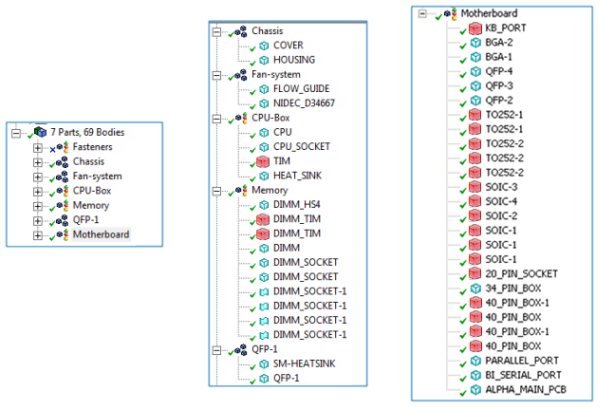

**Note:**

During the creation of parts, in case any objects are missed, create a separate part out of those and then merge this part with the intended part. To merge multiple parts, which can be a combination of suppressed and unsuppressed parts, hold down the **Ctrl** key while selecting the parts that need to be merged, and then right-click the selection and select **Form New Part** to complete the merging of the parts. Rename the newly formed part as appropriate.

• This completes the initial review and organization of the CAD model for efficient translation to native Ansys Icepak geometry.

• Save the project using **File** **Save Project** in DM.

### 30.12. Simple Shapes vs. Complex Shapes

*Key Question*: Are all the bodies simple shapes? Are there any complex shapes?

• Icepak primitive shapes are recognized as simple shapes for the DM-Icepak translation.

• Level 0, 1, or 2 from the **Electronics** **Simplify** operation in DM can be used for the translation of simple shapes to Icepak native geometry.

• Simple shapes such as rectangular prisms, cylinders, and uniform polygons are automatically converted over to Icepak (the default Icepak primitive is the solid block type).

• Go to WB and double-click cell B2 (the **Setup** cell from CFD module) to open the Icepak interface.

• In Icepak, go to the **Orient** menu and select the **Isometric view** and then **Scale to fit** to reorient the graphics display.

• Observe that the valid Ice bodies have been successfully converted to Icepak block objects.

**Figure 30.12: Show Ice Bodies in DM (left) and Model with Same Objects in Icepak (right)**

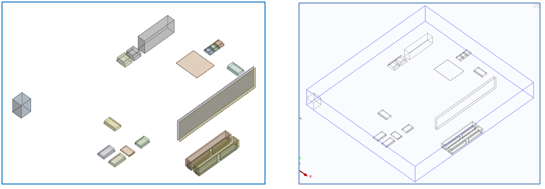

• Save the project using **File** **Save project** in Icepak.

• Go back to the DM interface.

• Go to **Electronics** **Show CAD Bodies**. This feature displays only those CAD bodies that need ad- ditional work (modification of CAD geometry and/or defeaturing of CAD geometry and/or use of Electronics/Simplify utility in DM).

**Figure 30.13: Show CAD Bodies – Updated Graphics Display for DM**

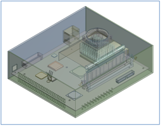

• The **Level 3 Simplify** feature is used only for complex shapes which cannot be modeled as Icepak primitive shapes.

– You must use the hex-dominant mesher (**Mesher-HD**) to mesh these shapes in Icepak.

– Typically, complex shapes require more meshing effort. You should investigate the possibility of

approximating a complex-shaped CAD body by a simpler shape without noticeably affecting the heat transfer physics.

**Figure 30.14: Examples of Complex Shapes from Tutorial Geometry - Sheet Metal Heat Sink for** **QFP1 Package and Flow Guide for Fan System**

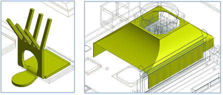

### 30.13.Translation of CAD Bodies to Ansys Icepak

• In DM, on the Tree Outline, collapse all part nodes as shown below.

**Figure 30.15: Updated Tree Outline/Parts, Bodies View**

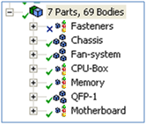

• For the sake of clarity, it is useful to display only the part that is currently of interest and hide all other parts and bodies.

• A “Periphery to Center Marching” strategy will be employed to target the easily visible CAD bodies for translation to Icepak native geometry progressively.

### •Translating the Chassis geometry

– In the **Tree Outline**, right-click the Chassis part and select **Hide All Other Bodies** so that only

the Chassis geometry is visible in the graphics display.

### 30.13. Translation of CAD Bodies to Ansys Icepak

**Figure 30.16: Retain Only the Chassis Geometry in the Graphics Display Window**

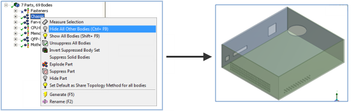

### – Chassis: DM – Electronics/Opening

→Observe the circular through-hole at the top of the chassis and the two grilles made of rectan-

gular and circular hole patterns on the side walls of the chassis. These will be represented as free openings in Icepak.

→Go to **Electronics** **Opening**.

→From the graphics window, select the three chassis faces as shown below in Figure 30.17: Opening

Operation for Chassis – Selection of Candidate Faces (p. 702).

**Figure 30.17: Opening Operation for Chassis – Selection of Candidate Faces**

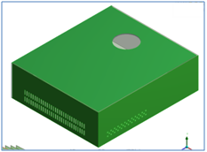

→In the **Details** view for the opening operation, click **Apply** to accept this selection for the **Faces**

field.

→Click **Generate** to create the openings.

→Observe the new entries in the **Tree Outline**. One new surface body and two new parts have

been created.

→From the **Tree Outline**, right-click each of these newly created parts and surface body listings

to rename them as shown below.

**Figure 30.18: Newly Created Parts and Surface Body**

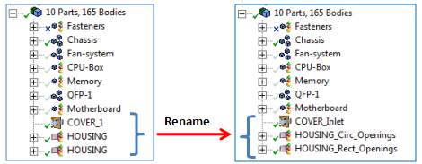

→Merge COVER_Inlet, HOUSING_Circ_Openings, and HOUSING_Rect_Openings with

the Chassis part.

• To merge the parts, select all four parts, Chassis; COVER_Inlet; HOUSING_Circ_Open- ings; and HOUSING_Rect_Openings, right-click and then select **Form New Part**. Rename the part as **Chassis**.

**Figure 30.19: Updated Tree Outline/Parts, Bodies View**

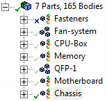

### – Chassis: DM – Electronics/Simplify

→On the**Shortcuts Toolbar**, set the **Selection Filter** to **Bodies**.

→From the graphics display area, select the two Chassis bodies, as shown in Figure 30.20: Select-

ing Chassis Cover and Housing (p. 704), by holding down the **Ctrl** key.

• The same selection can also be made by expanding the node corresponding to the Chassis part listing in the **Tree Outline** and selecting the bodies (using the **Shift** key) COVER and HOUSING.

**Figure 30.20: Selecting Chassis Cover and Housing**

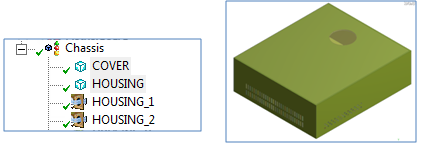

• Go to **Electronics** **Simplify** and click **Apply** in the Details view to accept this selection.

• In the **Details** view, set the **Simplification Type** to **Level 1**

• Click **Generate**.

• In the **Tree Outline**, select **Chassis** and the two new parts, COVER and HOUSING, and right- click the selection. From the right-click menu, select **Form New Part**. Ensure the name of the part is **Chassis**.

• Observe the simplified representation of the Chassis on the graphics display.

**Figure 30.21: Updated Graphical Display in DM**

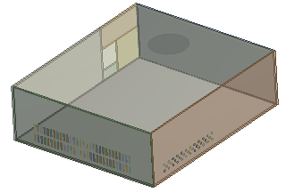

### – Chassis: DM – Suppress All Other Parts

→Collapse the **Chassis** node on the **Tree Outline**.

→From the **Tree Outline**, as shown below, select all the parts other than Chassis and

Fasteners, right-click the selection and click **Suppress Body**. The Fasteners part need not be selected as it is already in a suppressed state.

→The suppressing of all other parts allows the selective transfer of the (simplified) Chassis geometry

to Icepak.

**Figure 30.22: Suppressing All Parts Other Than Chassis and Updated Tree Outline View**

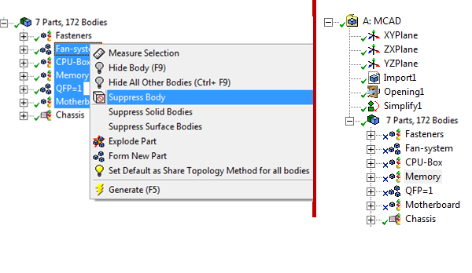

### – Chassis: Icepak – Chassis Import

→Go to the Icepak interface.

→Go to **File** **Refresh Input Data** and click **Replace model** on the Refresh input data pop-up screen (see below) to replace the existing Icepak model.

→**Figure 30.23: Replace the Existing Icepak Model**

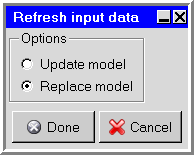

→In Icepak, verify that only the Chassis assembly shows up in the **Model manager** window.

→From the **Model manager** window, expand the Chassis assembly node to view the contents.

→Verify, from the **Model manager** window and from the graphics display, that all the Chassis

bodies, surface bodies and solid bodies, have been correctly translated to corresponding opening and block objects in Icepak.

→Figure 30.24: Updated Icepak Graphics Display (p. 706) shows the isometric view of the Chassis

representation in Icepak:

**Figure 30.24: Updated Icepak Graphics Display**

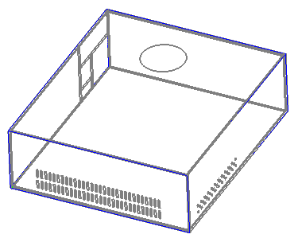

→Save the project using the **File** menu and select **Save project** in Icepak.

→Go to **File** **Close Icepak** to close the Icepak interface.

### – Chassis: WB – Update Project Schematic

→Go back to the WB interface and delete the link between the MCAD and the CFD modules as

shown in Figure 30.25: Delete Link Between MCAD and CFD Modules (p. 706).

• Doing so preserves the simplified Chassis geometry representation in Icepak for separate analysis despite any new changes to the MCAD module.

**Figure 30.25: Delete Link Between MCAD and CFD Modules**

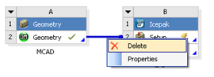

• Rename the CFD module as **CFD-Chassis**.

• Drag a new Icepak component from the WB **Toolbox** and drop on cell A2 of the MCAD module to create a new DM-Icepak link.

• Rename the newly created Icepak module as **CFD-Motherboard**.

**Note:**

This new link will be used to process the Motherboard part in DM for translation to native Icepak geometry.

• Save the project using **File** **Save** in WB.

**Figure 30.26: Updated WB Project Schematic**

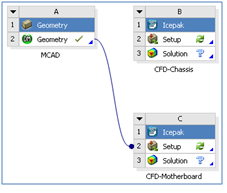

• Go back to the DM interface.

• In the **Tree Outline**, right-click the Chassis part and select **Suppress Part**.

• Next, as shown below right-click the Motherboard part and select **Unsuppress Part** to make only the Motherboard part geometry visible on the graphics display and available for further processing.

**Figure 30.27: Unsuppress Motherboard Part and Updated Graphics Display**

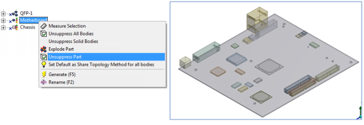

### – Motherboard: DM – Electronics/Simplify

→In the **Shortcuts Toolbar**, set the **Selection Filter** to **Bodies**.

→Also, as shown in Figure 30.28: Set Select Mode to Box Select (p. 708), on the **Shortcuts Toolbar**,

set the **Select Mode** to **Box Select**. Note the change in the cursor display.

**Figure 30.28: Set Select Mode to Box Select**

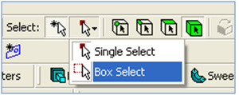

→Draw a box to include all the Motherboard part geometry. As shown below, the selected

geometry will be shaded solid (zero transparency).

**Note:**

You can also select the Motherboard bodies by selecting the node Motherboard from the **Tree Outline**.

**Figure 30.29: Use Box Select to Select All the Geometry From the Motherboard Part**

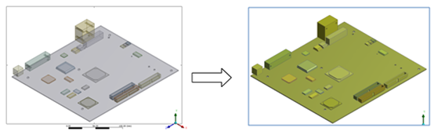

→Go to **Electronics** **Simplify** and click **Apply** in the **Details** view to accept this selection.

→In the **Details** view, set the **Simplification Type** to **Level 0**.

→Click **Generate**.

→Observe the simplified representation of the Motherboard part geometry in the graphics display.

→You have successfully converted all the bodies from the Motherboard part to valid Ice bodies.

→Go to **Electronics** **Show CAD Bodies** and confirm that the corresponding graphics display is empty.

→Go back to **Electronics** **Show Ice Bodies**.

**Figure 30.30: Simplified Representation of Motherboard Part Geometry**

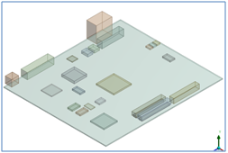

### – Motherboard: Icepak – Import Motherboard Geometry

→Go back to the WB interface

→Double-click cell C2 (the Setup cell for the CFD-Motherboard module) to open Icepak.

→In Icepak, verify that only the Motherboard assembly is visible in the **Model manager** window.

→From the **Model manager** window, expand the Motherboard assembly node to view the

contents.

→Verify that all the bodies from the Motherboard part in DM have been correctly converted to

corresponding block objects in Icepak.

→The isometric view of the Motherboard representation in Icepak is shown below.

**Figure 30.31: Updated Icepak Graphics Display**

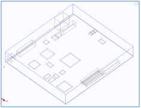

→Go to **File** menu and select **Close Icepak** to close the Icepak interface.

### – Motherboard: WB – Update Project Schematic

→Go back to the WB interface and delete the link between the MCAD and the CFD-Motherboard

modules.

→Drag a new Icepak component from the WB Toolbox and drop on cell A2 of the MCAD module

to create a new DM-Icepak link.

→Rename the newly created Icepak module as **CFD-QFP1**.

→This new link will be used to process the QFP-1 part in DM for translation to native Icepak

geometry.

→Save the project using **File** **Save** in WB.

**Figure 30.32: Updated WB Project Schematic**

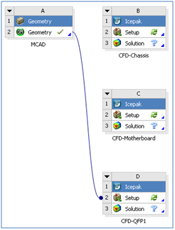

### •Translating the QFP-1 Part Geometry

– Go back to the DM interface.

– In the **Tree Outline**, suppress the Motherboard part and unsuppress the QFP-1 part.

**Figure 30.33: Updated Graphics Display in DM**

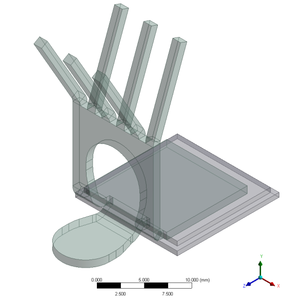

### – QFP-1: DM – Electronics/Simplify

→From the **Tree Outline**, expand the node corresponding to the QFP-1 part.

→Observe that there are two bodies (SM-HEATSINK and QFP-1) listed under this part. Here, SM-

HEATSINK represents the sheet metal heatsink and QFP-1 represents the IC package.

→Simplify the SM-HEATSINK body with a level 3 **Simplify** operation.

• In the **Details** view for this **Simplify** operation, set the **Facet quality** to **Fine**. Click **Generate** to complete the simplify operation.

→Simplify the QFP-1 body using a level 0 **Simplify** operation. Click **Generate** to complete the

simplify operation.

**Figure 30.34: Updated Tree Outline Listing and Simplified Representation for QFP-1 Part**

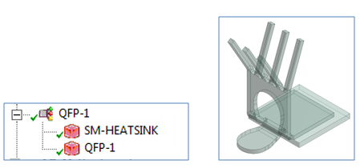

– Using cell D2 (the Setup cell for the CFD-QFP1 module) from the WB **Project Schematic**, open

Icepak.

– Verify that all the bodies from the QFP-1 part in DM have been correctly converted to corresponding

block objects in Icepak.

– Double-click SM-HEATSINK from the **Model manager** window to access the **Edit** panel for this

block. Go to the **Geometry** tab and note that the geometry shape is set to CAD.

→This will always be the case when the level for simplification in DM is set to **Level 3**.

– Click **Done** to close the **Edit** panel for SM-HEATSINK.

– The isometric view of the QFP-1 representation in Icepak is shown below.

**Figure 30.35: Updated Icepak Graphics Display**

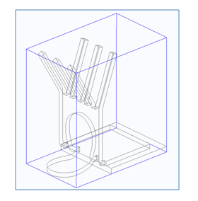

– Go to the **File** menu and select **Close Icepak** to close the Icepak interface.

### – QFP-1: WB – Update Project Schematic

→As before, delete the link between the MCAD and the CFD-QFP1 modules.

→Link a new Icepak module named **CFD-CPU-Box** to MCAD.

→Save the project using **File** **Save** in WB.

**Figure 30.36: Updated WB Project Schematic**

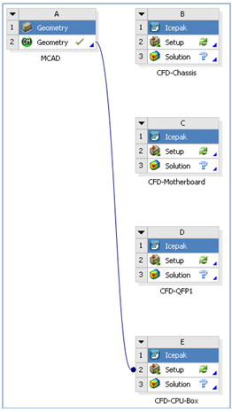

### •Translating the CPU-Box Part Geometry

– Go back to the DM interface.

– In the **Tree Outline**, suppress the QFP-1 part and unsuppress the CPU-Box part.

– Review the CPU-Box part geometry

→From the **Tree Outline**, expand the node corresponding to the CPU-Box part.

→As shown below, the **CPU-Box** part consists of four bodies.

**Figure 30.37: Updated Tree Outline View and Graphics Display in DM (Iso and +Z views)**

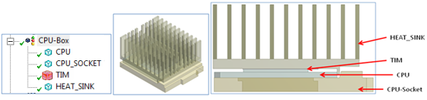

→Display one body at a time using the **Hide** function. Since the bodies contain geometric features

that are important for thermal analysis, it is a good practice to examine them and determine how to capture the features in the CFD model.

→**CPU_Socket**: Observe that CPU_Socket contains a cavity in the center. When the CPU is

mounted, the air pocket in this cavity reduces the heat flow from the CPU to the PCB. It is im- portant to capture the effect of this air pocket. Simplification using the level 1 simplification scheme will not recognize this cavity automatically. A new volume body will be created to model the cavity explicitly.

**Figure 30.38: CPU_Socket Body**

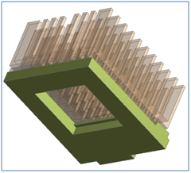

→**TIM**: Note the small thickness of TIM between the heat sink base and the CPU case. To avoid

unnecessary mesh refinement due to this small thickness, the TIM body will be set up as a contact resistance plate in Icepak.

### – CPU-Box: DM - Filling the Cavity Within CPU_SOCKET

→Use the **Hide All Other Bodies** function so that only the CPU_SOCKET body is visible on the

graphics display.

→Use **Single Select** again instead of **Box Select**.

→Set the selection filter to **Faces**.

→Using the **Ctrl** key, select all the inside faces that correspond to the cavity. The selected faces

are highlighted in green (see below) in the graphics display.

**Note:**

You should have 8 faces selected in total. Rotate the model in order to select all of the faces.

**Figure 30.39: CPU_Socket Body – Select Cavity Faces**

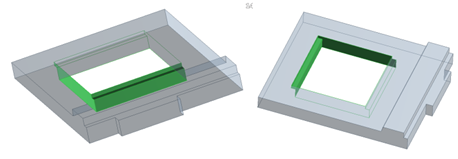

→Go to **Tools** **Fill** and click **Apply** in the corresponding **Details** view (see below) to accept the selection.

→Click **Generate**.

**Figure 30.40: Details View for Fill Operation**

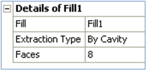

→In the **Tree Outline**, select the newly generate body named Solid and verify that it accurately

represents the cavity within the CPU_SOCKET body.

→Rename the body Solid to **Socket_Cavity**.

**Figure 30.41: Body Representing Cavity in CPU_SOCKET**

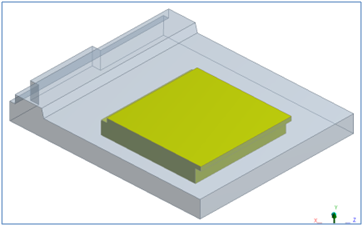

→Merge the body Socket_Cavity with the CPU-Box part by selecting both of them in the

**Tree Outline** and then clicking **Form New Part**.

**Figure 30.42: Updated Tree Outline Node — CPU-Box**

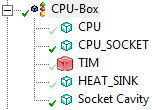

### – CPU-Box: TIM as a Surface Body in DM (Plate in Icepak)

→Hide CPU_SOCKET and Socket_Cavity. Show CPU and TIM again.

**Figure 30.43: Updated Graphics Display**

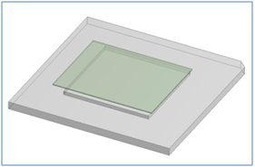

→Select the **Selection Filter** to **Edges**.

→Select any one of the short edges (corresponding to the thickness) of the body TIM.

→Go to **Tools** **Analysis Tools** **Entity Information** to report the detailed information for the selected edge in the **Details** view.

→Note that the length of the edge, or the thickness of TIM, is 0.254 mm.

→Right-click the body CPU and select **Hide All Other Bodies**.

→Suppress the TIM body.

**Figure 30.44: Use of Analysis Tools to Find Out TIM Thickness**

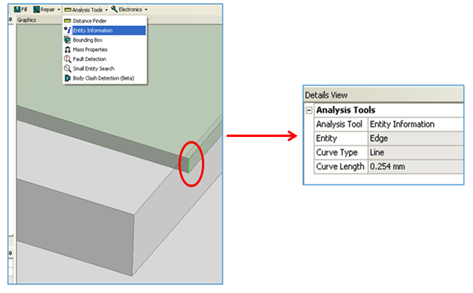

→Reducing TIM into a 2D representation (surface body in DM and plate in Icepak) will leave a

0.254 mm gap, which must be filled by one of the neighboring objects (HEAT_SINK or CPU).

→Hence, placement of the 2D TIM surface body on the CPU body will require extension of the

HEAT_SINK base by 0.254 mm.

• The additional 0.254 mm of aluminum (the HEAT_SINK material) only marginally increases the overall thermal resistance and hence is an acceptable approximation.

• Alternatively, the placement of the 2D TIM on the HEAT_SINK body, which requires the ex- tension of CPU, or somewhere in-between, which would require the extension of both CPU and HEAT_SINK, can also be considered.

→Go to the main menu and then select **Concept** **Surface from Faces**.

→Select the top side of the CPU body (as shown below).

→Click **Apply** in the **Details** view to accept this selection.

→Click **Generate**.

**Figure 30.45: Creation of Surface Body for TIM**

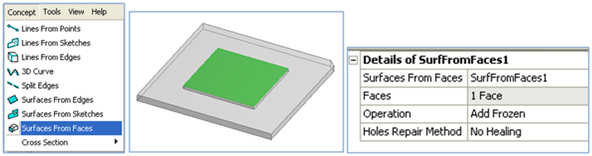

→Note that a new surface body named CPU shows up within the CPU-Box part in the **Tree Outline**.

→Rename the new surface body as **TIM_plate**.

**Figure 30.46: Updated Tree Outline View**

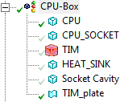

### – CPU-Box: DM - Extend Heat_Sink Body

→Right-click the HEAT_SINK body and hide all other bodies.

→Set the **Selection Filter** to **Faces**.

→Select the bottom face of the HEAT_SINK body as shown below.

→Go to **Tools** **Solid Extension** (Beta).

→In the **Details** view, click **Apply** to accept the face selection.

→Set the **FD1, Offset** field to **0.000254** m.

→Click **Generate**.

**Figure 30.47: Use of Solid Extension**

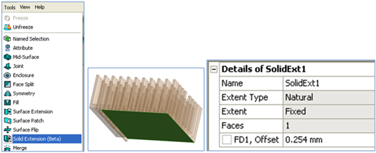

→Go back to the +Z view.

→Right-click the CPU body and select **Show Body**.

→Note that the gap (introduced due to the suppressing of the original TIM body) is now filled

with HEAT_SINK body material as shown in Figure 30.48: Before and After Use of Solid Exten- sion (p. 719).

**Figure 30.48: Before and After Use of Solid Extension**

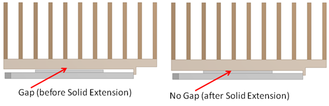

### – CPU-Box: DM - Electronics/Simplify

→From the **Tree Outline**, right-click the part CPU-Box and then select **Show All Bodies**.

→Go back to the +Z view.

→Go to **Electronics** **Simplify**.

→Using **Box Select**, select all the visible bodies from the graphical display. You should have 5

bodies selected.

→Click **Apply** in the **Details** view to accept the selection.

→Set the **Simplification Level** to **Level 1**.

→Click **Generate**.

**Figure 30.49: Level 1 Simplification for CPU-Box Part**

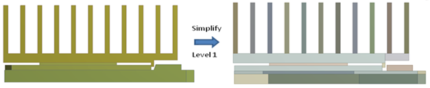

→From the **Tree Outline**, note the newly created parts.

→Merge the newly created parts with the CPU-Box part as shown in Figure 30.50: Merge Newly

Created Parts into CPU-Box Part, Updated Tree Outline View (p. 720).

**Figure 30.50: Merge Newly Created Parts into CPU-Box Part, Updated Tree Outline View**

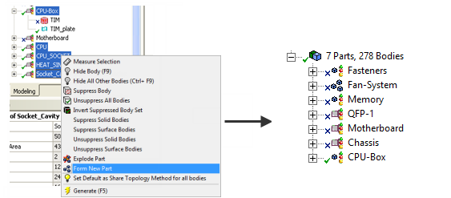

### – CPU-Box: Icepak - Import CPU-Box Part Geometry

→Using cell E2 (the **Setup** cell for the CFD-CPU-Box module) from the WB **Project Schematic**,

open Icepak.

→Verify that all the bodies (except the TIM_plate body) from the CPU-Box part in DM have

been correctly converted to corresponding block objects in Icepak.

**Note:**

The TIM_plate surface body is represented as a plate object in Icepak.

→The isometric view of the CPU-Box part representation in Icepak is shown in Figure 30.51: Updated

Icepak Graphics Display (p. 721).

• The TIM_plate plate object has been highlighted using **View** **Default shading** **Selected** **solid** feature in Icepak.

**Figure 30.51: Updated Icepak Graphics Display**

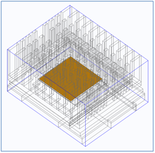

→Go to the **File** menu and select **Close Icepak** to close the Icepak interface.

### – CPU-Box: WB- Update Project Schematic

→As before, delete the link between the MCAD and the CFD-CPU-Box modules.

→Link a new Icepak module named CFD-Fan-System to MCAD.

→Save the project using the **File** menu, click **Save** in WB.

**Figure 30.52: Updated WB Project Schematic**

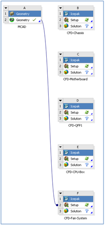

### •Translating the Fan-System Part Geometry

– Go back to the DM interface

– In the **Tree Outline**, suppress the CPU-Box part and unsuppress the Fan-system part.

– Review the Fan-system part geometry

→From the **Tree Outline**, expand the node corresponding to the Fan-system part.

→Observe that the Fan-system part consists of two bodies:FLOW_GUIDE and NIDEC_D34776,

the fan.

**Figure 30.53: Updated Tree Outline View and Graphics Display in DM (Iso view)**

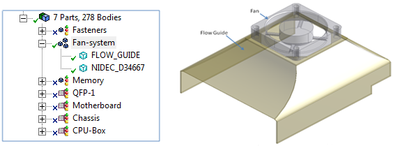

### – Fan-system: DM - Electronics/Fan

→Go to **Electronics** **Fan**.

→Note that the **Selection Filter** has automatically switched to **Bodies**.

→Observe the **Details** view.

→In the **Shortcuts Toolbar**, set **Select Mode** to **Single Select**. Note the change in the cursor display.

→For the **Body to Extract Fan Data** field, select the fan housing geometry from the graphics display

as shown in Figure 30.54: Electronics/Fan – Selection of Body to Extract Fan Data (p. 723). Altern- atively, you can simply select NIDEC_D34667 from the **Tree Outline**.

**Figure 30.54: Electronics/Fan – Selection of Body to Extract Fan Data**

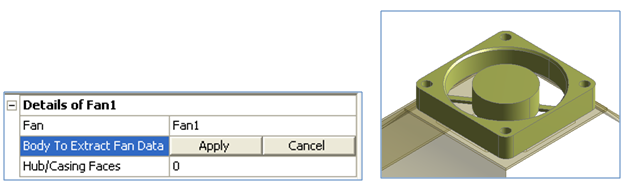

→Click **Apply** to accept the selection.

→In the **Details** view, go to **Hub/Casing Faces**. This corresponds to the cylindrical faces of the

fan bore and the hub. These will be converted into the fan radius and hub radius in the corres- ponding Icepak fan object.

→While holding down the **Ctrl** key, select the two faces as shown in Figure 30.55: Electronics/Fan

– Selection of Hub/Casing Faces (p. 724). The order of face selection does not matter.

**Figure 30.55: Electronics/Fan – Selection of Hub/Casing Faces**

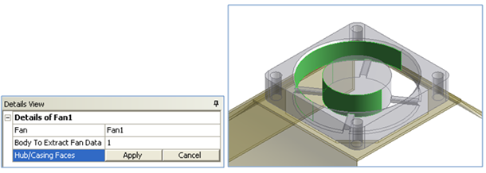

→Click **Apply** to accept the selection.

→Click **Generate**.

→Go to **Electronics** **Show CAD Bodies**.

→Observe that the NIDEC_D34667 fan geometry is no longer visible. This indicates that you have

successfully translated the fan geometry between DM and Icepak.

**Figure 30.56: Updated Graphics Display in DM (Iso view)**

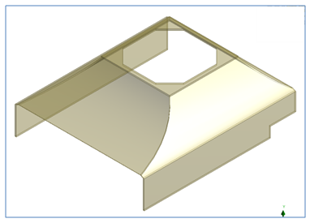

### – Fan-system: DM - FLOW_GUIDE - Simplification Strategy

→Review the FLOW_GUIDE geometry.

→The FLOW_GUIDE is a thin body with a thickness of 1 millimeter or less.

→The top of the flow guide is planar and has an opening. The sides expand non-uniformly and

with a curvature. The final “base” sides are also planar.

→To minimize the mesh, the FLOW-GUIDE body will be represented using zero thickness plate

objects in Icepak.

• The planar sides and the top opening will be modeled as simple Icepak objects.

• The expansion has a complex shape which can only be modeled as a CAD plate.

→To retain the exact flow volume within the FLOW_GUIDE, the plates will be constructed using

inner faces of the FLOW_GUIDE body.

### – Fan-system: DM - FLOW_GUIDE Top Side

→In DM, set the **Selection Filter** to **Faces**.

→Select the inner face of the top side of the FLOW_GUIDE body as shown in Figure 30.57: Inner

Face of the Top Side of the FLOW_GUIDE Body, Electronics/Opening (p. 725).

**Figure 30.57: Inner Face of the Top Side of the FLOW_GUIDE Body, Electronics/Opening**

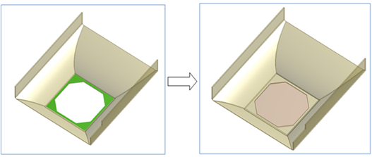

→Go to **Electronics** **Opening**.

→In the **Details** view, click **Apply** to accept the selection.

→Click **Generate**.

→Note that a new surface body named FLOW_GUIDE_1 has been created.

→From the **Tree Outline**, merge this surface body with the Fan-system part.

**Figure 30.58: Updated Tree Outline**

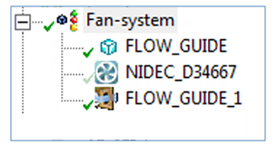

→Set the **Selection Filter** to **Edges**.

→As shown below in Figure 30.59: FLOW_GUIDE – Selection of Outer Edges for Inner Face of Top

Side (p. 726), select the four outer edges, highlighted in green, of the inner face of the top side of the FLOW_GUIDE body. You should have 4 edges selected.

**Figure 30.59: FLOW_GUIDE – Selection of Outer Edges for Inner Face of Top Side**

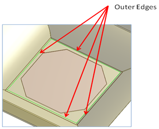

→Go to the **Concept** menu and select **Surfaces From Edges**.

→In the **Details** view, click **Apply** to accept the selection.

→Click **Generate**.

→Note that a new surface body named Surface Body has been created at the bottom of the

**Tree Outline**.

**Figure 30.60: FLOW_GUIDE – New Surface Body Created Using ‘Surfaces from Edges’**

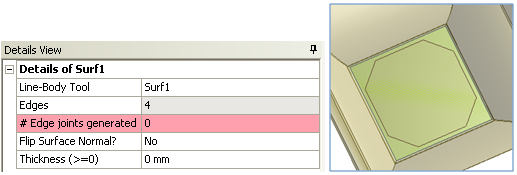

→Rename Surface Body as **Flow_Guide_Top_Face**.

→From the **Tree Outline**, merge Flow_Guide_Top_Face with the Fan-system part.

**Figure 30.61: Updated Tree Outline**

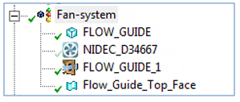

### – Fan-system: DM - FLOW_GUIDE - Non-Uniform and Base Sides

→Set the **Selection Filter** to **Faces**.

→From the graphics display as shown below, select the inner faces of the non-uniform sides of

the FLOW_GUIDE body. You should have 4 faces selected.

**Figure 30.62: Inner Faces of Non-Uniform Sides of FLOW_GUIDE Body**

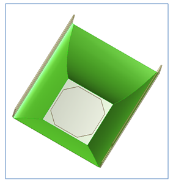

→Go to the **Concept** menu and select **Surface From Faces**.

→In the **Details** view, click **Apply** to accept the selection.

→Click **Generate**.

→From the **Tree Outline**, note that a new surface body named FLOW_GUIDE has been created

within the Fan-system part.

→Rename this surface body to **Flow_Guide_Non-Uniform-Face**.

→Go to the **View** menu and select **Wireframe** to better visualize the newly created surface body.

**Figure 30.63: Newly Created Surface Body – Flow_Guide_Non-Uniform-Face**

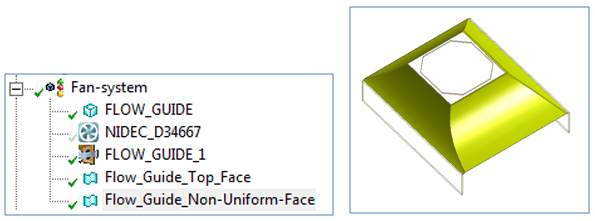

→Using the same procedure, create surface bodies using the inner faces of the base sides of the

FLOW_GUIDE body.

**Note:**

You should have had 2 faces selected.

→After clicking **Generate**, rename the resulting surface bodies as shown in Fig-

ure 30.64: FLOW_GUIDE Base Sides – Newly Created Surface Bodies (p. 729).

**Figure 30.64: FLOW_GUIDE Base Sides – Newly Created Surface Bodies**

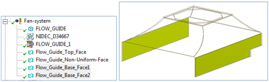

→Using the level 3 **Simplify** operation, convert the Flow_Guide_Non-Uniform-Face surface

body to a CAD plate representation in Icepak.

• Set the **Facet Quality** in the **Details** view to **Very Fine** for this simplify operation. Click **Gen-** **erate** to complete the **Simplify** operation.

→The surface bodies Flow_Guide_Base_Face1 and Flow_Guide_Base_Face2 are simple

shapes and hence are automatically recognized as plates in Icepak.

→Go to **Electronics** **Show CAD Bodies** and note that only the original FLOW_GUIDE body is visible.

→Suppress the FLOW_GUIDE body.

→Go to **Electronics** **Show Ice Bodies**.

→Go back to the **Shaded Exterior and Edges** view using the **View** menu.

**Figure 30.65: Updated Tree Outline and Graphics Display**

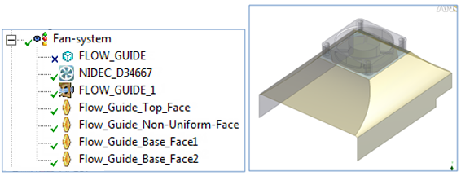

### – Fan-system: Icepak - Import Fan-system Part Geometry

→Using cell F2 (the **Setup** cell for the CFD-Fan-System module) from the WB **Project Schem-**

**atic**, open Icepak.

→Verify that all the bodies from the Fan-system part in DM have been correctly converted to

the corresponding fan, opening, and plate objects in Icepak.

**Note:**

The Flow_Guide_Non-Uniform-Face plate object has a CAD-type geometry.

→The isometric view of the Fan-system part representation in Icepak is shown below.

• The **View** **Default Shading** **Solid** feature is used to show the solid rendering of the Icepak geometry:

**Figure 30.66: Updated Icepak Graphics Display**

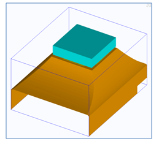

→Go to the **File** menu and select **Close Icepak** to close the Icepak interface.

### – Fan-system: WB - Update Project Schematic

→As before, delete the link between the MCAD and the CFD-Fan-System modules.

→Link a new Icepak module named **CFD-Memory** to MCAD.

→Right-click the white space in the **Project Schematic** window and select the **Fit** option to resize

the Project Schematic display.

→Save the project using **File** **Save** in WB.

**Figure 30.67: Updated WB Project Schematic**

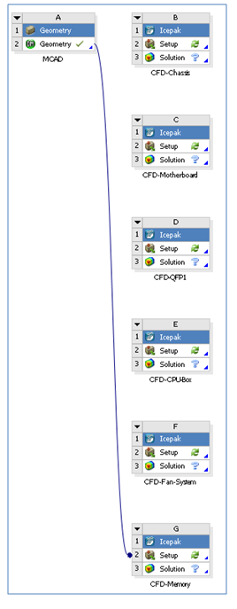

### •Translating the Memory Part Geometry

– Go back to the DM interface.

– In the **Tree Outline**, suppress the Fan-system part and unsuppress the Memory part.

– Review the Memory part geometry.

→From the **Tree Outline**, expand the node corresponding to the Memory part.

→As shown below, the Memory part consists of several bodies.

**Figure 30.68: Updated Tree Outline View and Graphics Display in DM (Iso and +Z views)**

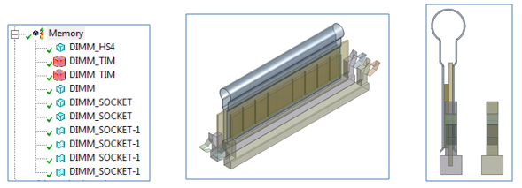

– **Note:**

The DIMM_SOCKET-1 surface bodies will not be used in the Icepak setup and hence can be suppressed.

Suppress the four DIMM_SOCKET-1 surface bodies.

**Figure 30.69: Updated Tree Outline View**

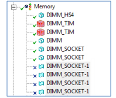

### – Memory: DM - Electronics/Simplify Level 1

→From the **Tree Outline**, hide the DIMM_HS4 body and the two DIMM_TIM bodies.

→Use the level 1 **Simplify** operation to simplify the DIMM body and the two DIMM_SOCKET

bodies.

**Figure 30.70: Level 1 Simplification of DIMM, DIMM_SOCKET Bodies**

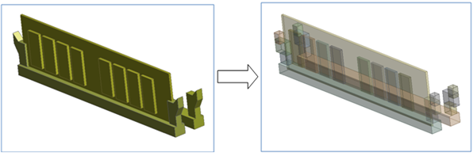

→From the **Tree Outline**, merge the newly created parts, as shown in Figure 30.71: Updated Tree

Outline View (p. 734), with the Memory part. Name the merged part **Memory** again.

**Figure 30.71: Updated Tree Outline View**

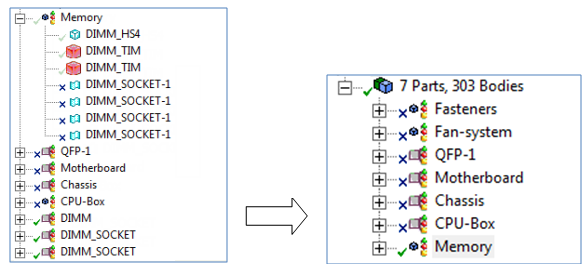

→Rename the DIMM_8 body as **DIMM_PCB** and the remaining DIMM bodies as **DIMM_IC** as shown:

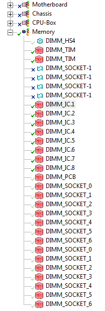

### – Memory: DM - Surface Bodies for DIMM_TIM

→Select the two DIMM_TIM bodies.

→Right-click the selection and click **Hide All Other Bodies** as shown in Figure 30.72: Updated Tree

Outline and Graphics Display (p. 736).

**Figure 30.72: Updated Tree Outline and Graphics Display**

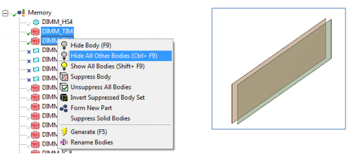

→The DIMM_TIM bodies will be modeled as contact resistance plates in Icepak and hence need

to be represented as surface bodies in DM.

→Set the **Selection Filter** to **Faces**.

→While holding down the **Ctrl** key, select the inner faces for the two DIMM_TIM bodies as shown

in Figure 30.73: Selection of Inner Faces for DIMM_TIM Bodies (p. 736). The inner surfaces are in contact with: the casing tops of all the DIMM_IC bodies and the opposite side of DIMM_PCB. The design intent is to model the contact resistances at these locations; therefore it is important to select the two inner faces for this feature operation.

**Figure 30.73: Selection of Inner Faces for DIMM_TIM Bodies**

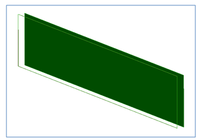

→Use the **Concept** menu and select **Surfaces From Faces** to create corresponding surface bodies.

Click **Apply** in the **Details** view and then click **Generate**.

→Note that two new surface bodies named DIMM_TIM are now listed within the Memory part

listing in the **Tree Outline**.

• Since the newly created surface bodies are simple shapes, they are automatically recognized as valid Icepak plate objects.

→Rename these bodies to **DIMM_TIM_Plate1** and **DIMM_TIM_Plate2** respectively.

→Suppress the two original DIMM_TIM bodies.

**Figure 30.74: Updated Tree Outline and Graphics Display**

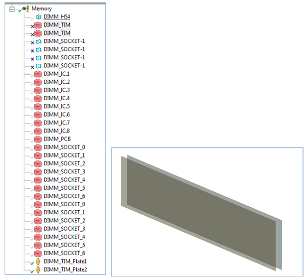

### – Memory: DM - Recreate DIMM_HS4 and Simplify Using Electronics/Simplify Level 3

→Show the DIMM_HS4 body. Now the DIMM_HS4, DIMM_TIM_Plate1, and DIMM_TIM_Plate2

bodies are visible.

→Go back to the +Z view and zoom in as shown in Figure 30.75: Updated Graphics Display and

Zoom-in +Z View (p. 738).

**Figure 30.75: Updated Graphics Display and Zoom-in +Z View**

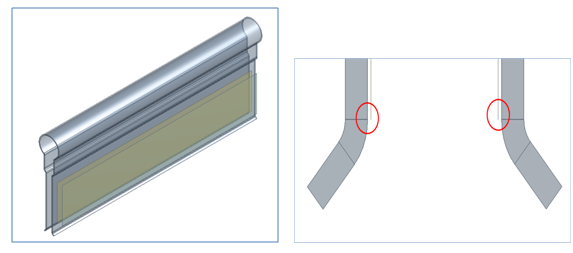

→Note that there is a small gap between the DIMM_TIM_Plate surface bodies and the DIMM_HS4

body.

→This gap equals the thickness of the original DIMM_TIM body, which is 0.0776 mm.

• This gap can be measured using **Analysis Tools** /**Distance Finder** or **Analysis Tools** /**Entity** **Information**.

→This gap will be removed by re-creating the heatsink.

→Pick any thin edge of the DIMM-HS4 body and find its thickness using **Analysis Tools** /**Entity**

**Information**.

• It is 0.5 mm thick. Thus the total thickness from the outer surface of DIMM_HS4 to the DIMM_TIM_Plate (nearest to the selected surface) is 0.0005776 m.

→Set the **Selection Filter** to **Faces**.

→From the graphics display, as shown below, select any outer face of DIMM_HS4.

→From the **Shortcuts** toolbar use the **Extended Selection** feature (see Figure 30.76: Recreating

the Heatsink Geometry (p. 739)) and select **Extend to Limits**. This will select all the outer faces of Heat sink.

→Go to the **Create** menu and select **Thin/Surface**.

→In the **Details** view, set the **Selection Type** to **Faces to Keep**.

→Click **Apply** in the **Details** view to accept the face selection.

• Make sure that 17 faces are selected.

→Set the **Direction** field to **Inward** and the field **FD1, Thickness (>=0)** to **0.5776** mm.

→Click **Generate**.

**Figure 30.76: Recreating the Heatsink Geometry**

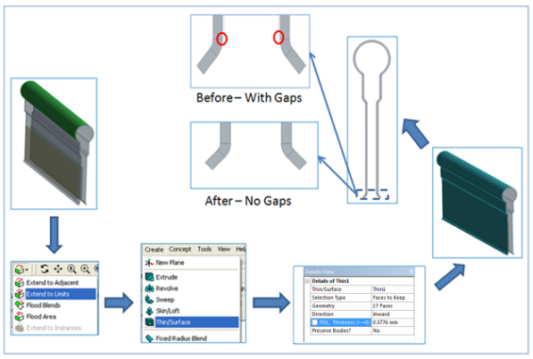

→Observe that the gap between the DIMM_HS4 body and the DIMM_TIM_Plate surface bodies

no longer exists.

→Using the level 3 **Simplify** operation, simplify the DIMM_HS4 body for a CAD-type block repres-

entation in Icepak.

• Set the **Facet Quality** in the **Details** view to **Very Fine** for this **Simplify** operation. Click **Generate** to complete this operation.

### – Memory: Icepak - Import Memory Part Geometry

→Using cell G2 (the **Setup** cell for the CFD-Memory module) from the WB **Project Schematic**,

open Icepak.

→Verify that all the bodies from the Memory part in DM have been correctly converted to the

corresponding block and plate objects in Icepak.

**Note:**

The DIMM_HS4 block object has a CAD-type geometry.

→The isometric view of the Memory part representation in Icepak is shown in Figure 30.77: Updated

Icepak Graphics Display (p. 740).

• The **View** **Default shading** **Solid**/**Wire** feature was used to display the solid rendering in Icepak.

**Figure 30.77: Updated Icepak Graphics Display**

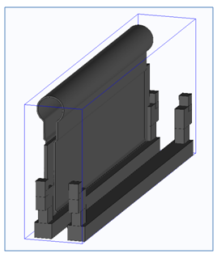

→Go to the **File** menu and select **Close Icepak** to close the Icepak interface.

### – Memory: WB – Update Project Schematic

→As before, delete the link between the MCAD and the CFD-Memory modules.

→Link a new Icepak module named CFD-System to MCAD.

→Right-click the white space in the **Project Schematic** window and select the **Fit** option to resize

the **Project Schematic** modules.

→Save the project using **File** **Save** in WB.

**Figure 30.78: Updated WB Project Schematic**

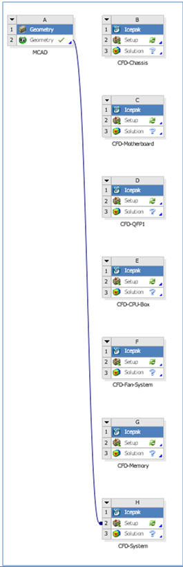

### •System-Level Setup in Icepak

– Go back back to the DM interface.

– Unsuppress all of the parts except for Fasteners.

– Go to the WB interface.

– Using cell H2 (the **Setup** cell for the CFD-System module) from the WB **Project Schematic**, open

Icepak.

– Verify that all the bodies from the DM setup have been correctly converted to corresponding block,

plate, fan, opening objects in Icepak.

**Figure 30.79: Updated DM Tree Outline, DM Graphics Display, Icepak Graphics Display**

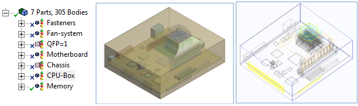

– Go to the **File** menu and select **Close Icepak** to close the Icepak interface.

– Save the project using **File** **Save** in WB.

– The MCAD-Icepak translation for this system-level electronics box setup is now complete.

– Exit out of WB using **File** **Exit**.

### 30.14. Summary

In this tutorial, the following features/capabilities have been discussed:

• Use of Ansys Workbench to integrate DM with Icepak

• Import and organization of assembly level CAD models in DM

• Use of DM for modification and simplification of imported CAD geometry

• Translation of CAD geometry to Icepak primitive objects using DM Electronics

---

## Chapter 31: MRF Tutorial

### 31.1. Introduction

The purpose of this tutorial is to provide guidelines and recommendations for the Moving Reference Frame (MRF) fan modeling technique in Ansys Icepak. These guidelines and recommendations concern the areas of

• Problem Setup

• Meshing strategy, and

• Solver settings

**Note:**

Mesh counts and solution results may differ slightly due to enhancements to the meshing algorithm and Fluent solver, respectively.

### 31.2. Prerequisites

• Familiarity with Icepak interface, and having a good understanding of basic problem setup and solution procedure.

An Icepak 3D fan object may sometimes behave differently from real fan behavior. Typically this is due to flow features like swirl and centrifugal spread resultant from the spinning fan rotor as well as the rotor blade geometry. In an Icepak fan based setup, this swirl is estimated and calculated off a 2D an- nular flow face rather than off the physical surfaces of the blade.

The MRF approach allows for a more accurate representation of the internal geometry of the fan and therefore results in a better modeling of the flow features. In Icepak MRF simulations, the actual blade geometry is modeled as a CAD block object and a fluid cylinder rotates into contact with the surfaces to create a spinning flow.

In this tutorial, you will use a previously built Icepak model of fan blades (Figure 31.1: A 3D Icepak Fan Object Assembly (p. 744)a) and create the rotating MRF fluid blocks to create flow in the model. You will learn the proper problem setup and solution settings for an MRF model, as well as a good meshing technique to insure good results.

As an added bonus, a 3D Icepak fan object assembly (Figure 31.1: A 3D Icepak Fan Object Assembly (p. 744)b) can be activated and run to see the difference in flow patterns and results.

**Figure 31.1: A 3D Icepak Fan Object Assembly**

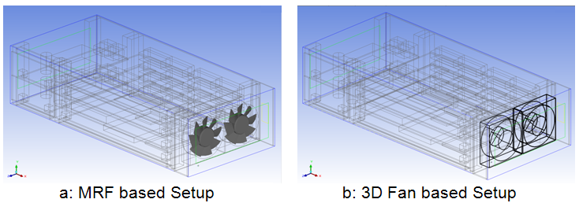

### 31.3. Opening the Project

• Start Icepak by either double clicking the shortcut on your desktop or by going to Start >> All programs >> ANSYS 2019 R2 and selecting the independent ANSYS Icepak.

• Once Icepak has launched, click on the **Unpack** button.

**Note:**

In Icepak, models can be compressed into a specialized zip file with the extension tzr. This is called “packing” a project. The essential files needed to properly re-build the model, in- cluding the mesh settings, are saved in this compressed file. A model has been previously created to reduce the time needed to properly teach the MRF techniques in Icepak and will be opened out of this packed file.

• Download the file “MRF_Tutorial.tzr” and select this file to unpack. You will then be able to create a project folder for this tutorial. Choose the location and name the project “MRF_Practice”.

**Note:**

MRF_Tutorial.tzr can be found on the ANSYS Help Site. The procedure for downloading this file is described below.

1. Set up a working directory on the computer you will be using.

2. Download the mrf.zip file here.

3. Unzip the mrf.zip file you have downloaded to your working directory.

• Next, go to the **Model** menu and select **CAD data**. Click **None** under Families to turn off the CAD display.

• Set the orientation to the isometric view to display the model geometry as shown below.

**Figure 31.2: Unpacked Model Geometry**

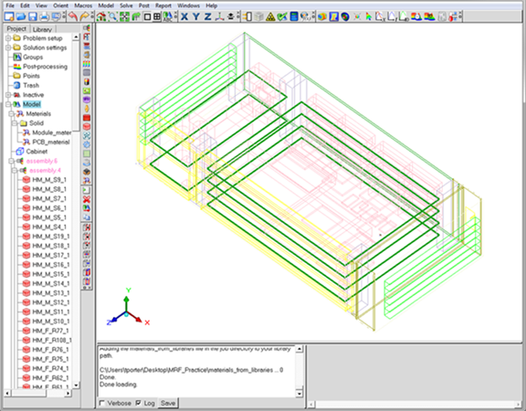

### 31.4. Modifying the Geometry

• Under the **Inactive** node in the **Model** tree, there are four assemblies. Two are remnants of the openings used to create the inlet and exhaust grilles. The others are the MRF fan and Icepak 3D fan assemblies.

• Select the “FANS_CAD.1” assembly and activate it.

**Note:**

You can activate the assembly by selecting it and then using the **Ctrl** A shortcut or by right clicking and selecting **Active**.

• An assembly containing the CAD fan blades (rotors), fan casing blocks, and fan tray cutout blocks should appear.

• Expand the FANS_CAD.1 assembly node on the **Model** tree to view the fan blade geometry.

• Click on any object inside of the FANS_CAD.1 assembly and create two fluid blocks surrounding the fan blades and cutting through the casing blocks using the information provided in Table 31.1: Fluid Block Settings for MRF Setup (p. 746) below.

**Table 31.1: Fluid Block Settings for MRF Setup**

| Name | Shape | Plane | Center | Height | Radius | Type |
| --- | --- | --- | --- | --- | --- | --- |
| FluidA | Cylinder | Y-Z | xC:141.3 mm yC:133.04 mm zC:130.6 mm | 20.0 mm | 34.0 mm | Fluid |
| FluidB | Cylinder | Y-Z | xC:141.3 mm yC:133.04 mm zC:56.6 mm | 20.0 mm | 34.0 mm | Fluid |

**Note:**

If your current object selection is not inside of the assembly, the new fluid cylinders would appear outside and have to be dragged into the assembly. This is saving this extra step. Another time saver would be to create FluidA and then copy the object. You would just need to change the name of the copy to FluidB and change the zC location.

• As shown in Figure 31.3: Fluid Blocks Surrounding Fan Blade Geometry (p. 747), the fluid cylinder blocks will be created at the bottom of the assembly list. This is because Icepak will, by default, give the newest objects the highest meshing priority. The fluid blocks need to have a higher priority than the case blocks but a LOWER priority than the fan rotor so that the rotor will be fully meshed. To automatically change the meshing priority, highlight both these fluid cylinders in the **Model** tree, and drag them above the fan blades (drop them on top of the upper most blade). The assembly should now look like Figure 31.4: Updated Model Tree View (p. 747).

• Double click on FluidA in the **Model** tree. Under the **Properties** tab, select **Use rotation for MRF** and set a rotational speed of 6000 as seen in Figure 31.5: MRF Settings (p. 748). Repeat this for FluidB.

### Important notes for MRF fan modeling technique:

• Using the exact fan blade geometry is critical for the accuracy of the MRF fan modeling technique. If the fan housing contains straightening vanes, these must also be modeled with their exact geomet- ries.

• The rotation rpm here refers to the rotation of the fan rotor and blades. The direction follows the right hand thumb rule.

**Figure 31.3: Fluid Blocks Surrounding Fan Blade Geometry**

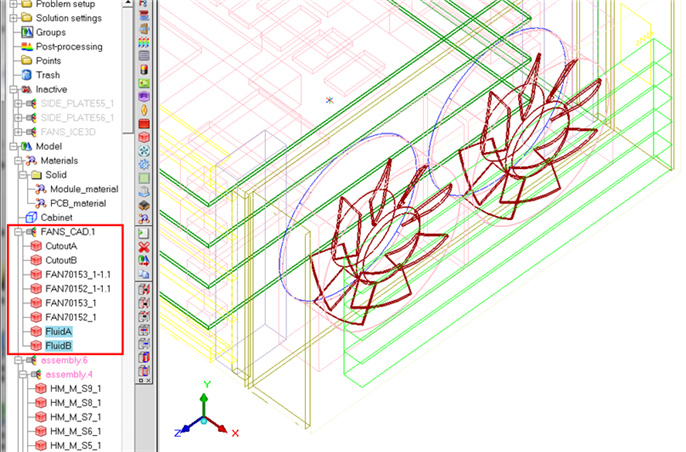

**Figure 31.4: Updated Model Tree View**

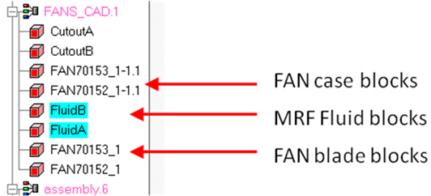

**Figure 31.5: MRF Settings**

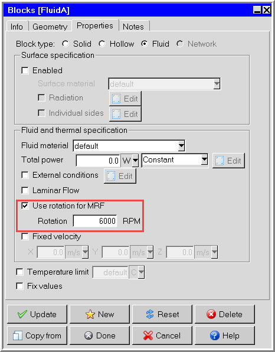

### 31.5. Generating the Mesh

• To start, go to the global mesh settings panel by clicking on the

shortcut and ensure the mesh type is **Mesher-HD**.

• Set the **Minimum gap** values to 1 mm in all directions and update the dialog to look like Fig- ure 31.6: Global Mesh Settings (p. 749).

**Note:**

HD meshing starts with a default hexa-unstructured mesh, and progressively uses other element types (tetrahedral, etc.) in areas where geometric complexity does not allow for

a good mesh with hexa elements. This “mesh mixing” occurs automatically in the meshing algorithm.

**Note:**

Proper resolution of CAD objects requires more mesh. Resolving surfaces with curvatures typically requires more mesh than planar faces.

**Figure 31.6: Global Mesh Settings**

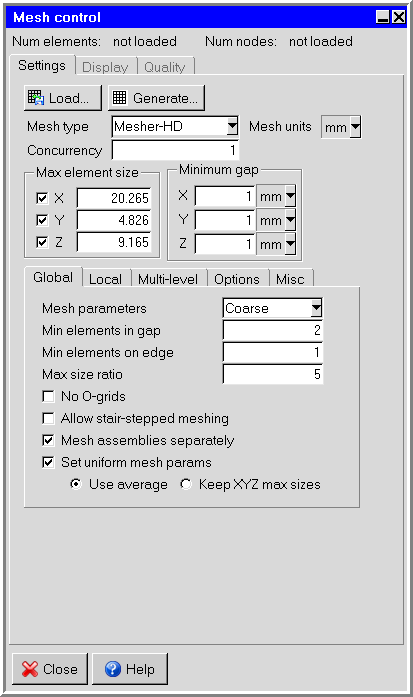

### Meshing the MRF Fans

• To keep the mesh count as low as possible, change the **Block type** of the two rotor blocks (FAN70153_1–1.1 and FAN70152_1–1.1) to **Hollow**.

• To restrict the finer mesh to the region immediately surrounding the fans, a non-conformal mesh should be used. Double click the “FANS_CAD.1” assembly and go to the **Meshing** tab. Select the **Mesh separately** option and enter the slack settings as shown in Figure 31.7: Non-conformal Mesh Settings for FANS_CAD.1 Assembly (p. 751). Then, deselect **Use global mesh control settings**, click **Copy global**, and enter max element sizes and minimum gap settings as shown in Figure 31.7: Non- conformal Mesh Settings for FANS_CAD.1 Assembly (p. 751).

**Note:**

The positive slack values define the distance off the outermost surfaces of all objects in the assembly. While Ansys Icepak v13.0 does allow for zero slack specification, you should use a positive value in MRF cases to ensure good mesh transition from solid surfaces into the fluid.

• Turn on the **Allow multi-level meshing** option, ensure **Proximity size function** and **Curvature size** **function** are selected. Ensure the **Set uniform mesh params** option is enabled and set to **Use average**.

**Note:**

The **Set uniform mesh params** option will block off regions around complex geometries and allow for a better mesh transition.

• Click on the **Edit levels** button in the **Multi-level** tab and set the meshing levels as shown in Fig- ure 31.8:“Edit Levels” Settings for FANS_CAD.1 Assembly (p. 752).

**Note:**

Multi-level meshing allows the user to control the mesh sizing near the surfaces of CAD objects without filling the entire non-conformal region with small elements. It is also known as a hanging node mesh where a cell edge is split into two smaller edges as the mesh gets closer to the surface. Thus each face is split into four smaller faces, and each cell into eight smaller cells.

**Note:**

In Figure 31.7: Non-conformal Mesh Settings for FANS_CAD.1 Assembly (p. 751), the max sizes in all three directions are the largest elements. The levels value set per object is the number of times that element size will be split in half. For example, with 4 mm being the largest element, 2 levels would correspond to a refinement of 4/2 = 2 mm for the first split and 2/2 = 1 mm for the smallest element on that object.

**Figure 31.7: Non-conformal Mesh Settings for FANS_CAD.1 Assembly**

**Figure 31.8: “Edit Levels” Settings for FANS_CAD.1 Assembly**

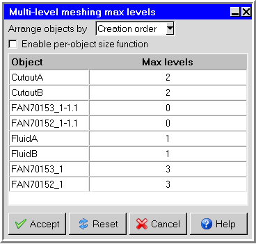

• You are now ready to generate the mesh. Go back to the global settings and click on the **Generate** button near the top of the pop-up window.

### 31.6. Examine the Mesh

• Display the surface mesh on the rotors by selecting them in the **Model** tree and going to the **Display** tab of the **Mesh** panel. Here, select **Display mesh**,**Surface**,**Wire** and **Solid fill (object)** as options. This will show the mesh on the surface of the fan rotor as a colored surface with lines showing the individual elements as seen in Figure 31.9: Surface Mesh of Fan Rotors (p. 753).

**Note:**

It is especially important to check the surface meshes of CAD objects. If too large of an element is being used near the surface, you may see bad elements protruding away from or into the surface.

**Figure 31.9: Surface Mesh of Fan Rotors**

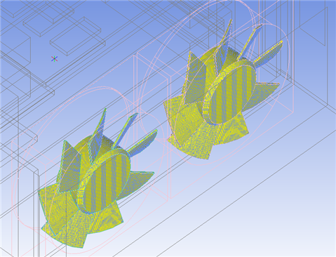

• Next, create a plane cut of the mesh through the center of one of the fan rotors on the z axis. The mesh display should look similar to Figure 31.10: Mesh Display - Cut Plane Through Rotor Center (p. 753) (Switch off the previous surface display).

**Note:**

To do this properly, press **Shift**-x to look at the x axis, select the **Cut plane** option in the **Display** tab under meshing, click on the drop down menu next to **Set position**, select **Vertical - screen select** and click on the center of either fan hub. This will draw a vertical line through the selected point. Press **Shift**-z to look at the plane through that line.

**Figure 31.10: Mesh Display - Cut Plane Through Rotor Center**

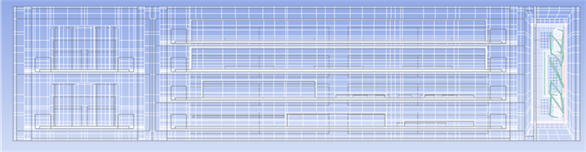

• Save the project.

### 31.7. Solution Settings for MRF Fan Model

• When running a MRF model, the zero equation turbulence model will not suffice as it does not properly capture the swirl effects of the rotor blades. It is recommended that the **Realizable two** **equation** turbulence model be used.

• Go to **Problem setup** **Basic Parameters** and under **Flow regime** change the turbulence model in the drop down menu to **Realizable two equation** as shown in Figure 31.11: Modify Choice for Turbulence Model (p. 754).

**Figure 31.11: Modify Choice for Turbulence Model**

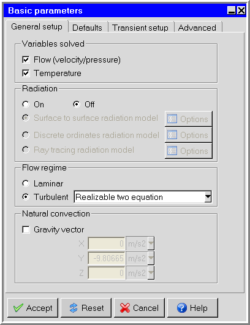

• Go to **Solution settings** **Basic settings** under the **Model** tree and set the **Number of iterations** to 1000 (adequate for this model).

• Also, set the flow convergence criteria to 1e-5 and input the changes as shown in Figure 31.12: Basic Solution Settings (p. 755).

**Note:**

When using MRF, the solver typically needs a larger number of iterations to completely converge. When running the initial solution it is recommended that you set the number of iterations to something on the order of 2000 or more to see where the convergence finally occurs. You can lower the number of iterations in subsequent solutions with the use of solution restart. It is also recommended to lower the convergence criteria to ensure this convergence.

**Figure 31.12: Basic Solution Settings**

### Point Monitors

• When running any simulation you should also include a few temperature and a few velocity monitor points to ensure that there is complete convergence. In a steady state problem, you can have greater confidence in the solution convergence, when the monitor values do not change for an extended number of iterations.

• In an MRF problem, there should be multiple velocity point monitors between different blades and located in the fluid. To do this, go the tree, right click the **Points** branch and select the **Create at** **location** option.

• An easy method of creating such points is to first create a plane cut display of the mesh, as shown in Figure 31.13: Easy Method to Snap Point Monitors to the Mesh Display (p. 756). Specify the monitor point name and variable in the **Create point** panel. Finally use the **Nearest** option to snap the point

to a grid location. The location of point monitors used in this tutorial are presented in Table 31.2: Location of Point Monitors (p. 756).

**Table 31.2: Location of Point Monitors**

| Point Monitor | Location (X, Y, Z) mm | Monitor |
| --- | --- | --- |
| a | 163.3, 159.0, 62.41 | Velocity |
| c | 172.7, 133.04, 93.6 | Velocity |
| d | 163.3, 133.04, 110 | Velocity |
| mon pt 1 _ _ | 172.7, 137.9, 135.3 | Velocity |
| mon pt 2 _ _ | -232.6, 105.1, 98.5 | Temperature |
| mon pt 3 _ _ | -232.6, 139.9, 79.99 | Temperature |
| mon pt 4 _ _ | -219.5, 148.4, 26.85 | Temperature |

### Solve the Model

• Click on

in the shortcuts toolbar to bring up the **Solve** panel. Click on the **Start solution** button to run the computations.

• If the model is set up properly as per the instructions, then the residual plots and the monitor plots should look like Figure 31.14: Residuals Plot (p. 757).-Figure 31.16: Velocity Monitors (p. 758)

**Figure 31.13: Easy Method to Snap Point Monitors to the Mesh Display**

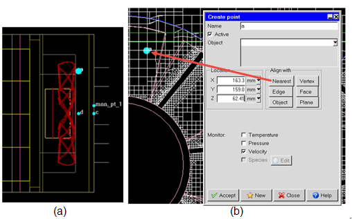

**Figure 31.14: Residuals Plot**

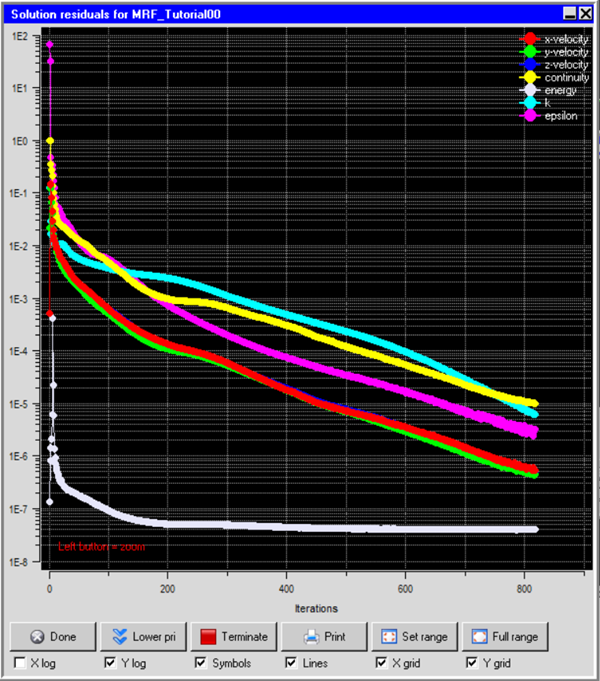

**Figure 31.15: Temperature Monitors**

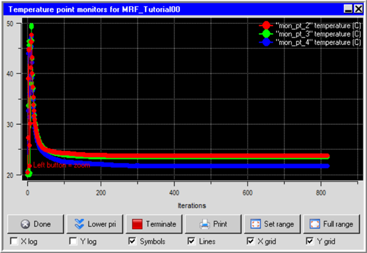

**Figure 31.16: Velocity Monitors**

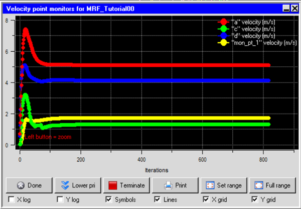

### 31.8. Post-processing the Results

• Create an object face with the

shortcut. Select all of the solid objects (blocks) other than those in the fan assembly and select **Show contours**. Click on the **Parameters** button, leave the default

contours of **Temperature**, and change the color levels to **Calculated** **This object**. The temperature contour should look similar to Figure 31.17: Surface Temperature Contours (p. 759).

• Deactivate the temperature object face (right click and click on **Active**) from the **Post** node on the **Model** tree.

• Create a plane cut with the shortcut

and leave it at the default **z plane through center** location. Select Contours of speed and set the color levels to be specified from 0 to 3 (velocities higher than 3 m/s will show up as red). The MRF speed contour display should look similar to Figure 31.18: Contour of Speed at Center of Z with MRF (p. 759).

**Figure 31.17: Surface Temperature Contours**

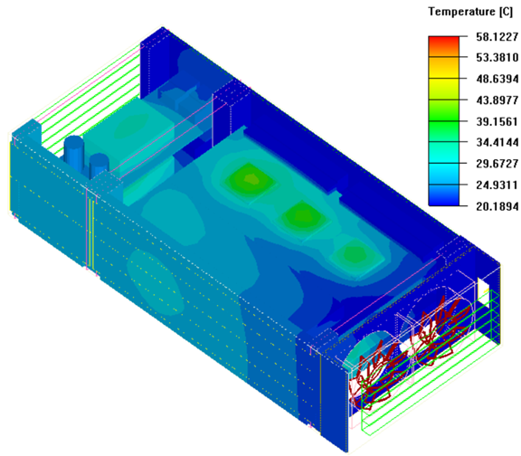

**Figure 31.18: Contour of Speed at Center of Z with MRF**

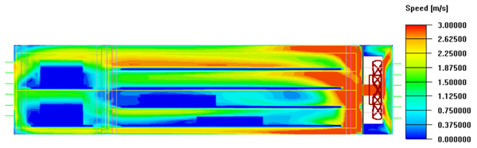

### 31.9. BONUS SECTION: Comparing MRF to 3D Icepak Fans

• Deactivate the “FANS_CAD.1” assembly and activate the “FANS_ICE3D” assembly.

• Go to **Solution settings** **Basic settings** and change the flow criteria to 1e-4.

• Go to the **Solve** panel and make sure that the **Solution ID** is different than the once used for the MRF run. It will take much less time to run this model. You can terminate the model once the residuals and monitor points all level off.

• Create the same speed contour as you did in the MRF run. The contour should resemble Fig- ure 31.19: Contour of Speed at Center of Z with Icepak 3D Fan Object (p. 760). Compare this flow pattern to Figure 31.18: Contour of Speed at Center of Z with MRF (p. 759).

**Figure 31.19: Contour of Speed at Center of Z with Icepak 3D Fan Object**

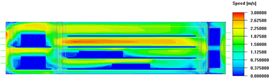

---

## Chapter 32: Modeling an Airborne Electronics System at Altitude

### 32.1. Introduction

There are numerous methods for cooling electronics systems and the choice of technique is generally a function of the design, application, reliability requirements and power dissipation. For avionic elec- tronics, one common approach is to use ambient or chilled air ducted over the sealed chassis of the system in a cold wall. Heat from the components conducts through the PCB to the card guides that are clamped to the chassis and removed via the cold wall.

This technique also removes any risk to the actual electronics arising from dust, moisture etc… in the air flow, and thus increases the operating reliability.

Operating conditions of such equipment vary considerably due to the density variation of air from sea level to cruising altitude. As the altitude increases, the density decreases, and consequently the mass flow rates of the fan(s) are also reduced.

In this exercise a cold-wall cooled avionics unit will be modeled and the cooling efficiency evaluated at both sea level and altitude.

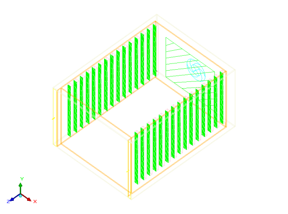

This exercise assumes you have had already created some models in Icepak, and in particular have ex- perience in meshing assemblies separately and also in setting up parametric simulations.

**Note:**

Mesh counts and solution results may differ slightly due to enhancements to the meshing algorithm and Fluent solver, respectively.

### 32.2. Opening the Project

Unpack and load the model called avionics_box.tzr.

**Note:**

The file avionics_box.tzr can be found on the ANSYS Help Site. The procedure to download this file is described below.

1. Set up a working directory on the computer you will be using.

2. Download the altitude.zip file here.

3. Unzip the altitude.zip file you have downloaded to your working directory.

This is the basic cold wall geometry with two parametric runs defined. The first assumes a uniform loading of 30 W per PCB, giving a total dissipation of 450 W for the cards. This is applied uniformly to the card edges on both sides of the chassis.

An additional 30 W is applied to the front of the unit opposite the fan to represent any additional load from additional equipment. The total power can be viewed in the **Power and temperature limit setup** panel as shown below.

**Figure 32.1: Total Power**

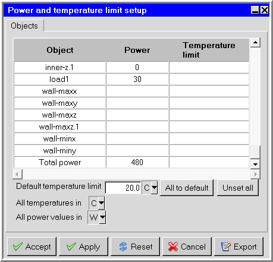

Heat can only be conducted out of the unit, so the interior air is not modeled, and replaced by a hollow block. Recall that within a hollow block no equations are solved, and no mesh is generated, so this methodology reduces the problem down to a worst case scenario.

Next, you need to add two heat sinks to represent the finned cold walls on the sides of the unit.

### 32.3. Adding the Fins

The easiest way to add the fins is to generate two heat sinks, one for each of the cold wall ducts. Create the heat sink objects using the information in the figures below. Also name the objects as in the figures shown below. Note that the first two figures refer to heat_sink_minx while the second two figures refer to heat_sink_maxx.

**Figure 32.2: Object Geometry Edit Panel for heat_sink_minx**

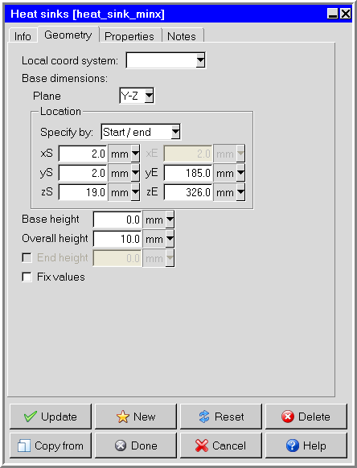

**Figure 32.3: Object Properties Edit Panel for heat_sink_minx**

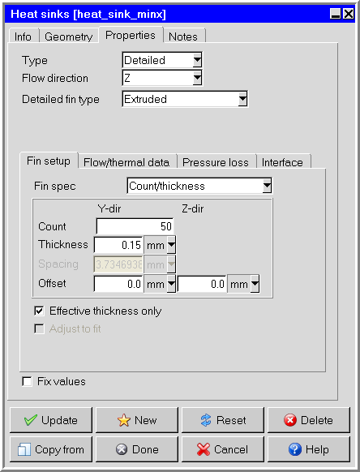

**Figure 32.4: Object Geometry Edit Panel for heat_sink_maxx**

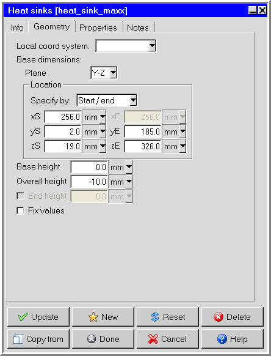

**Figure 32.5: Object Properties Edit Panel for heat_sink_maxx**

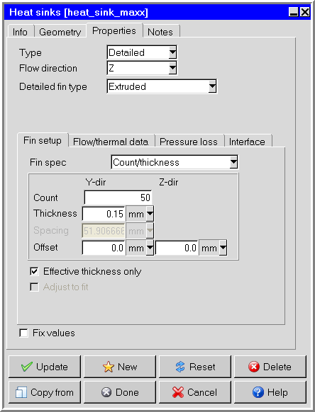

Create an assembly for each heat sink and choose to mesh each assembly separately and apply appro- priate slack values. Slack values are displayed in Figure 32.6: Heat Sink Assembly Slack Values (p. 768).

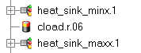

**Note:**

Rename your assemblies to match the heat sinks’ names as shown above.

**Figure 32.6: Heat Sink Assembly Slack Values**

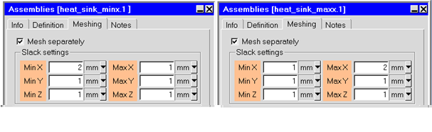

**Tip:**

You could have also made the second heat sink by copying the first and then using the alignment tools to re-position it.

### 32.4. Modeling the effects of Altitudes

In the **Basic parameters** panel, click the **Defaults** tab. Select Air as the **Default fluid**.

**Figure 32.7: Default Fluid**

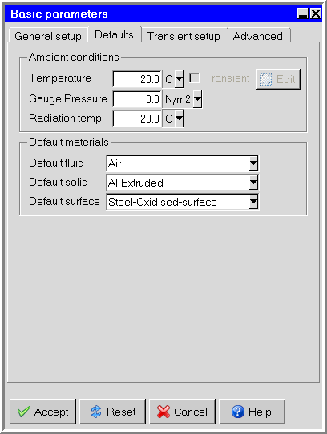

Go to the **Advanced** tab. Select the **Altitude** check box and ensure that the **Update fan curves** check box is also selected. Enter **$Elevation** for the **Altitude** field. This creates a variable for altitude that you will soon specify. Change the units to m. The **Basic parameters** panel should resemble that of Figure 32.8: The **Advanced** Tab of the **Basic parameters** Panel (p. 770).

**Figure 32.8: The Advanced Tab of the Basic parameters Panel**

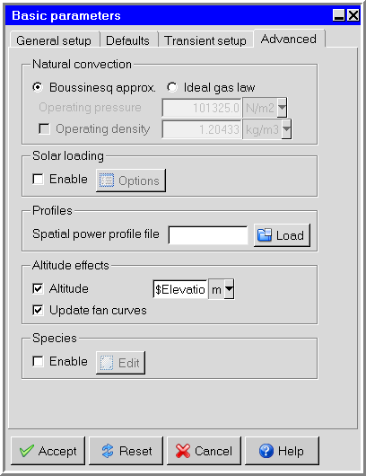

The **Param value** panel will appear upon opening the **Parameters and optimization** panel. Enter **10000** in the text box. This assigns an initial value of 10 kilometers for the variable Elevation.

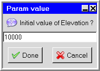

Select the **Design variables** tab and then the **Elevation** node in the **Parameters and optimization** panel. Next to **Discrete values**, type **0**, separated by a space before **10000** as shown in Figure 32.9: As- signing Variable for Altitude (p. 771).

**Figure 32.9: Assigning Variable for Altitude**

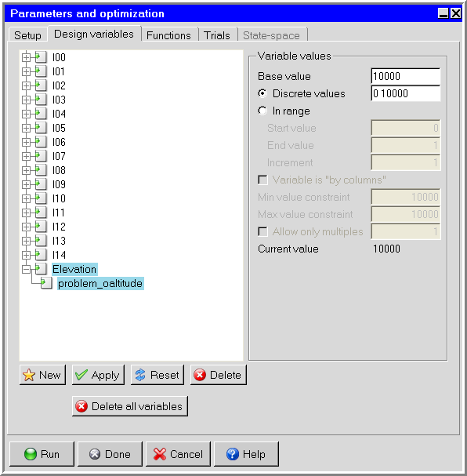

Now edit the fan object (fan.1) in the model. At altitude the inlet temperature will be very different from the same flow rate at sea level. Assign a parameter for the inlet temperature as shown in the **Fans** panel of Figure 32.10: Assigning Parameters for Inlet Temperature (p. 772). Initialize the variable **Flow_T** with a value of **-5** after updating the fan object. The temperature parameter should take the values 20 and -5 ºC as shown in the **Parameters and optimization** panel of Figure 32.10: Assigning Parameters for Inlet Temperature (p. 772). Apply these settings, and reset the trials. Check that the correct combin- ation of parameters for sea level, and 10 Km for elevation have been assigned.

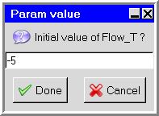

**Figure 32.10: Assigning Parameters for Inlet Temperature**

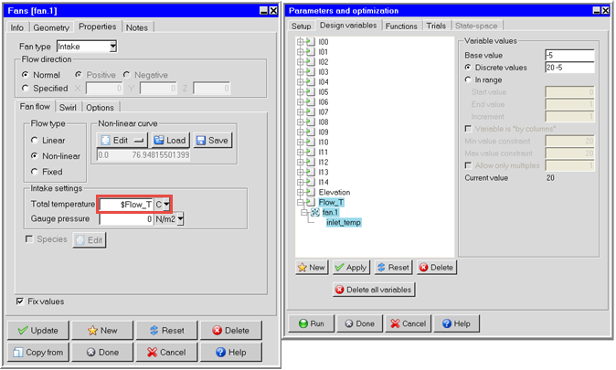

In the **Functions** tab of the **Parameters and optimization** panel, create three functions, one to report the global maximum temperature and the other two to calculate the pressure drop across each of the heat sinks. Figure 32.11: Primary Functions (p. 773) and Table 32.1: Functions (p. 773) show the functions’ names and specifications.

**Figure 32.11: Primary Functions**

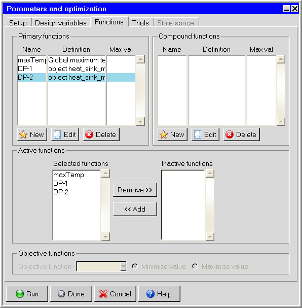

**Table 32.1: Functions**

| Function name | Function type | Value | Object, Variable, Direction |
| --- | --- | --- | --- |
| maxTemp | Global value | Global maximum temperature |  |
| DP-1 | Difference |  | object heat sink minx, Pressure, Low Z - High _ _ Z |
| DP-2 | Difference |  | object heat sink maxx, Pressure, Low Z - High _ _ Z |

Click **Run** to run the trials and then analyze the two simulations to compare results. Generate some particle tracks from the fan through the system and display the object faces of the two heat sinks.

Create a summary report for both runs for the temperatures of the sources. Combine these into an HTML report.

**Figure 32.12: Parametric Trials**

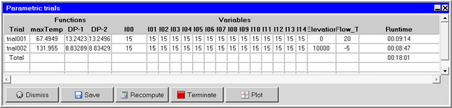

shortcut. In the **Object face** panel that appears, select object fan.1 and select the **Show particle traces** option. Click the **Parameters** button and leave the default settings. Change the color levels to **Calculated** **This object**. The particle traces should look similar to Figure 32.13: Particle Traces (p. 774).

Create particle traces with the

**Figure 32.13: Particle Traces**

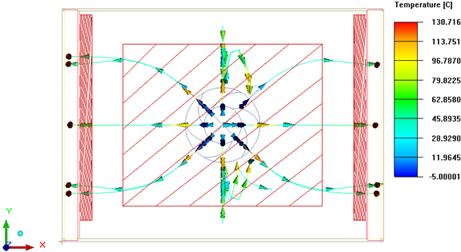

Deactivate the temperature object face (right-click face.1 in the **Model manager** window and deselect **Active**).

Create an object face to display temperature contours on the heat sink objects. The object face should look similar to those in Figure 32.14: Temperature Contours on heat_sink_minx and heat_sink_maxx (p. 775).

**Figure 32.14: Temperature Contours on heat_sink_minx and heat_sink_maxx**

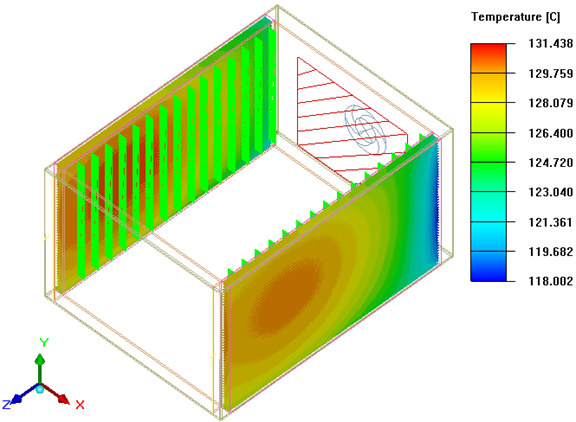

### 32.5. Summary

In this tutorial, you learned how to model the effects of altitude in ANSYS Icepak by using the **Parameters** **and optimization** panel to create parametric variables.

---

## Chapter 33: Maxwell and Ansys Icepak Coupling Tutorial

### 33.1. Introduction

This tutorial demonstrates how heat loss data can be transferred between Maxwell and Ansys Icepak in Ansys Workbench. This tutorial involves an eddy current solver of Maxwell to calculate heat losses which are then applied to Ansys Icepak to simulate natural convection.

In this tutorial, you will learn how to:

• Create a Maxwell and Ansys Icepak coupling analysis in Ansys Workbench.

• Transfer heat loss data bi-directionally between Maxwell and Ansys Icepak using the Feedback Iterator.

**Note:**

Mesh counts and solution results may differ slightly due to enhancements to the meshing algorithm and Fluent solver, respectively.

### 33.2. Prerequisites

This tutorial assumes that you have little experience with Ansys Workbench and so each step will be explicitly described. A Maxwell license is needed to perform this tutorial.

### 33.3. Problem Description

A simple model is used in this tutorial to demonstrate multiphysics coupling. Heat flow is calculated on the Stock object in Maxwell and is transferred to Ansys Icepak.

### 33.4. Step 1: Create a New Project

1. Start Ansys Workbench.

**Note:**

*When Ansys Workbench starts, the Toolbox and Project Schematic are displayed.*

### 33.5. Step 2: Build the Model

You will import an existing Maxwell project into Workbench. To import a Maxwell file,

• Specify a name for your project (that is, maxwell2wb) and save the Workbench project file.**File**>**Save** **As...**

• Select the menu item **File**>**Import** in Workbench.

• Change the file type to Ansys Electronics Desktop Project File (*.aedt) and browse to the location of the tutorial input file.

• Select the file **Maxwell_Icepak_Coupling.aedt** and open it.

**Note:**

The file Maxwell_Icepak_Coupling.aedt can be found on the ANSYS Help Site. The procedure to download this file is described below.

1. Set up a working directory on the computer you will be using.

2. Download the maxwell.zip file here.

3. Unzip the maxwell.zip file you have downloaded to your working directory.

• Double-click the **Setup** cell of the Maxwell3DDesign1 system to launch Maxwell.

In this step you will set the conductivity of the aluminum plate as function of temperature. This will enable you to get the temperature from Icepak and recalculate the losses based on temperature de- pendent properties. To set temperature dependent properties,

• Select the **Stock** object from the history tree, right-click and select **Assign Material**.

**Figure 33.1: Assign Material for Stock Object**

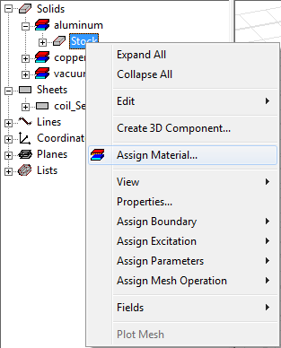

• In the **Select Definition** panel, select **View/Edit Materials...**.

**Figure 33.2: Select Definition Panel**

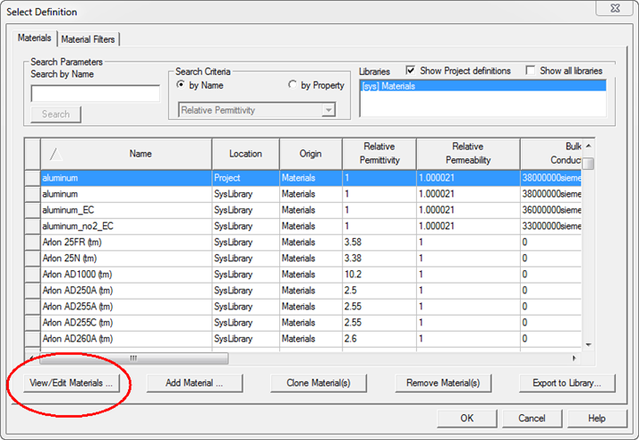

• In the **View/Edit Material** panel,

– Enable **Thermal Modifier**.

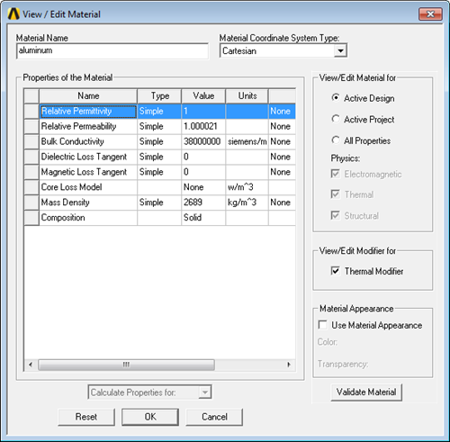

– Go to the **Thermal Modifier** column for bulk conductivity and select **Edit** from the drop-down

menu.

– In the **Edit Thermal Modifier** panel,

→Set modifier as: if (Temp <=22, 1, 1/(1+0.0039*(Temp-22)))

→Click **OK**.

**Figure 33.3: Edit Thermal Modifier**

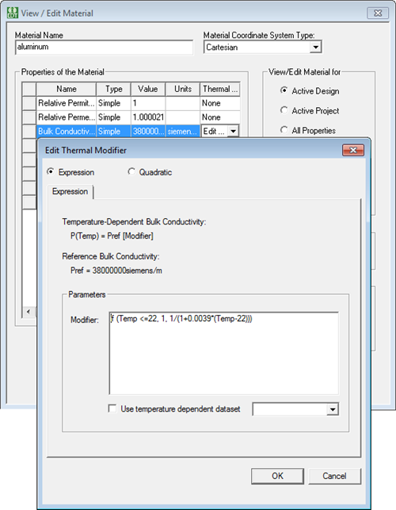

– Click **OK** to close the **View/Edit Material** and the **Select Definition** panels.

In this step, you will enable the temperature feedback.

• From the **Maxwell 3D** menu, select **Set Object Temperature**.

• In the **Temperature of Objects** panel, enable **Include Temperature Dependence** and **Enable** **Feedback**.

• Click **OK**.

**Figure 33.4: Temperature of Objects Panel**

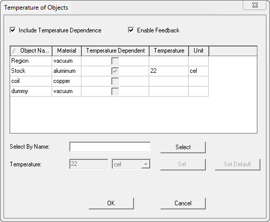

Verify Maxwell settings.

• Expand the **Project Manager** tree and **Analysis**.

• Double-click on **Setup1** to display the **Solve Setup** panel.

• In the **Solve Setup** panel, ensure the following settings are defined:

– **General** tab,**Percent Error**: 0.1

– **Convergence** tab,**Refinement Per Pass**: 50%

– **Solver** tab,**Adaptive Frequency**: 200Hz

– Click **OK**.

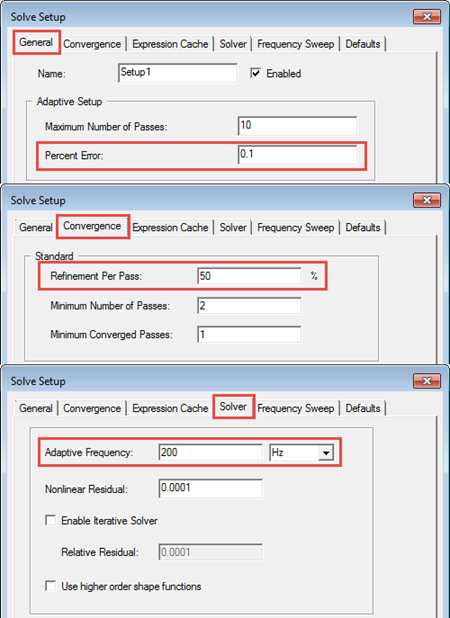

**Note:**

After entering the specifications, the Geometry and Setup cells in the Maxwell system should appear as follows:

**Figure 33.5: Maxwell 3D system**

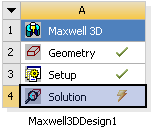

Validate the model.

• From the **Maxwell 3D** menu, select **Validation Check**.

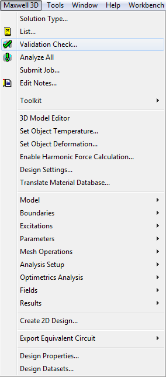

Click the **Close** button.

**Note:**

To view any errors or warning messages, use the message manager.

To start the solution process:

• From the **Maxwell 3D** menu, select **Analyze All**.

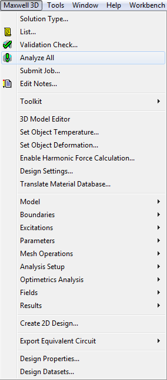

Calculate Ohmic losses in Stock.

• From the **Maxwell 3D** menu, select **Fields** > **Calculator**.

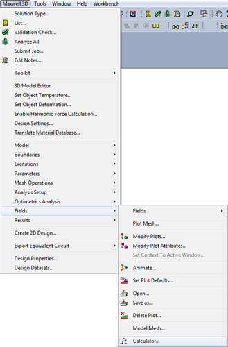

– Select **Input** > **Quantity** > **OhmicLoss**

– Select **Input** > **Geometry** > **Volume** > **Stock**

– Select **Scalar** >

**integrate**

– Select **Output** > **Eval**

• The Ohmic losses in Stock volume are around 8.7 Watts.

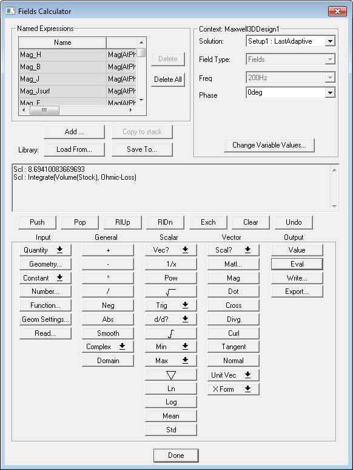

• Click **Done** to exit.

Close Maxwell.

• From the **File** menu, select **Close Desktop**.

**Note:**

After solving, the Maxwell3DDesign1 system should have green check mark in the **Solution** cell. If not, select **Update** from the context menu of the **Solution** cell.

Save the project.

• Return to Workbench project window.

• Select the menu item **File**>**Save**.

In the project schematic, drag and drop a Geometry system on top of the Maxwell 3D Geometry cell (A2). Right-click the Geometry cell (B2) and select **Update**. Right-click the Geometry cell and select **Edit** **Geometry in DesignModeler** to launch DesignModeler. Click **Generate** to create the objects.

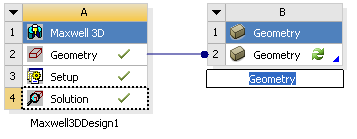

Suppress Geometry

• On the tree outline, right-click on the **coil_Section1** object and click **Suppress Body**.

• Repeat this same procedure with the **dummy** object.

**Figure 33.6: Suppress Bodies**

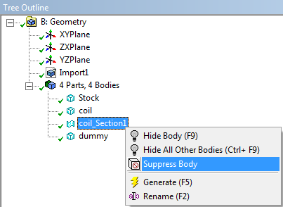

Simplify Geometry

• Set the geometry selection filter to bodies and select the Coil object. Go to the **Tools** menu. Select **Electronics**> **Simplify**. Note that Simplify1 shows up on the tree outline and the **Details view** is populated with the simplified form. Go to the **Details** view.

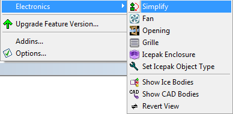

• Click **Apply** across from the **Select Bodies** field.

• Change the **Simplification Type** to **Level 3 (CAD Object)**. Ensure **Selected Bodies** is selected for the **Selection Filter** and choose **Fine** for **Facet Quality**.

**Figure 33.7: Simplify1 – Coil Object**

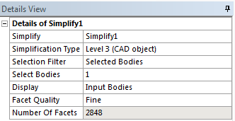

• Click **Generate**.

**Note:**

The coil object has now been converted into a simple shape and hence is automatically recognized as a CAD block object in Icepak.

• Next, simplify the Stock object using **Level 2 (Polygon fit)** for the **Simplification Type**. See the figure below.

**Figure 33.8: Simplify2 – Stock Object**

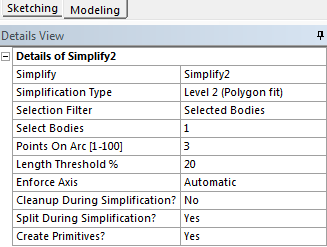

Save the project in Ansys DesignModeler and close the application.

Drag and drop an Icepak system on top of the Geometry cell to transfer the geometry. Click on the Maxwell 3D Solution cell (A4) and drag and drop it onto the Icepak Setup cell (C2) as shown below.

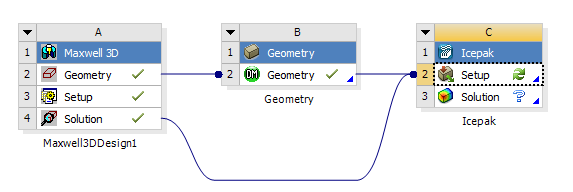

Right-click on the Maxwell3DDesign1 Solution cell (A4) and select **Update**.

Double-click the Icepak Setup cell (C2) to open Icepak. You will see that the geometry has been imported.

**Figure 33.9: Imported Geometry in Icepak**

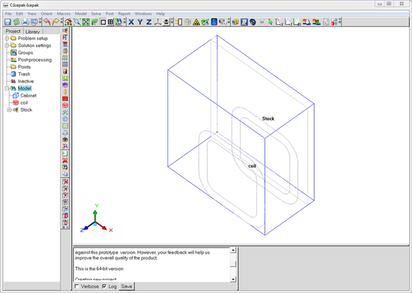

• Resize the cabinet as shown in the figure below.

**Figure 33.10: Resize Cabinet**

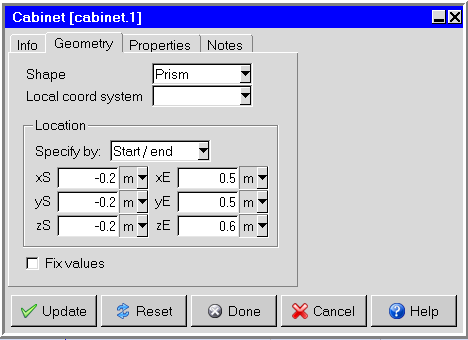

• In the **Cabinet** panel, click the **Properties** tab and assign **Openings**. Change the **Min z** and **Max z** **Wall type** to **Opening**.

**Figure 33.11: Cabinet Properties**

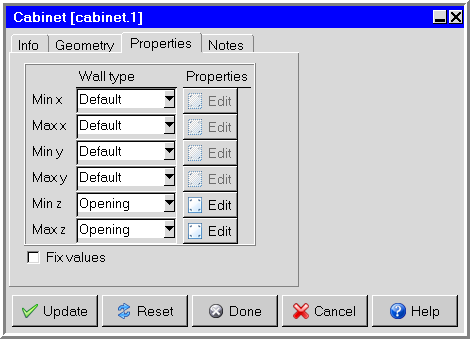

• Change the material of Coil object.

– In the **Properties** tab, specify the **Solid material** as Copper (Cu-Pure).

**Figure 33.12: Coil Material**

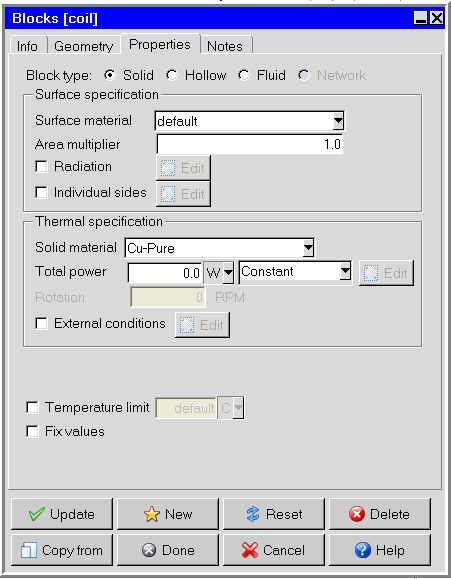

The material for the Stock object is Aluminum; therefore keep the selection of **default** for the Stock object.

### 33.6. Step 3: Generate a Mesh

Open the **Mesh control** panel and enter the specifications as shown below, ensuring Multi-level meshing is used. Keep the default settings for all other inputs.

**Figure 33.13: Mesh control Panel**

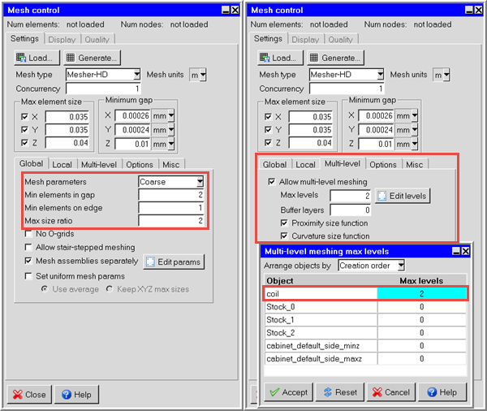

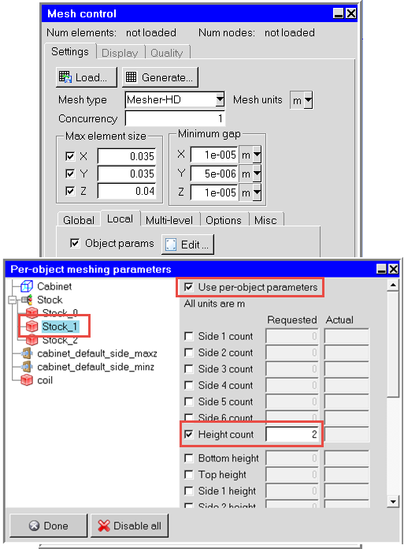

Click **Generate** to mesh the model. Visualize the mesh at plane cuts and surface displays from the **Display** tab.

### 33.7. Step 4: Physical and Numerical Settings

• Go to

**Problem setup**

**Basic parameters**. In the **General setup** tab, select **On** under **Radiation**.

1. Select **Discrete ordinates radation model** and click **Options**.

2. Under **Iteration parameters**, enter 5 for **Flow iterations per radiation iteration** and click **Accept**.

• Enable the **Gravity vector** and make sure that gravity in the z-direction is -9.80665 m/ . Set the y- direction **Gravity vector** to 0.

• On the **Transient setup** tab under **Solution initialization**, enter 0.01 m/s for **Z velocity**.

• Under

**Solution settings**

**Basic settings**, enter 200 for the **Number of iterations**.

• Click **Accept** and close the **Basic settings** panel.

• Go to

**Solution settings**

**Advanced settings**.

1. Under **Under-relaxation**, enter 0.7 for **Pressure**.

2. Under **Under-relaxation**, enter 0.3 for **Momentum**.

3. Make sure the **Precision** for the solver is **Double**.

4. Click **Accept** in the **Advanced solver setup** panel.

• Go to the **File** menu, select **EM mapping** and **Volumetric heat losses**.

– Select **Stock_0**,**Stock_1**, and **Stock_2**.

– Retain the default **Solution ID** and select the **Frequency (Hz)** as displayed in Figure 33.14: Volu-

metric heat losses (p. 798).

**Figure 33.14: Volumetric heat losses**

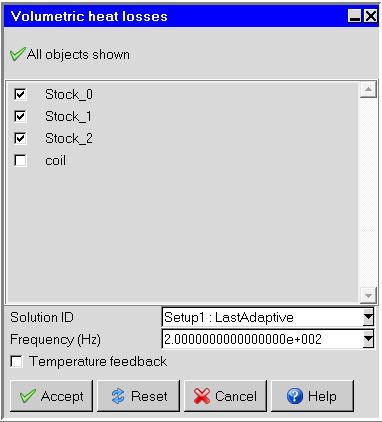

– Click **Accept** to close the panel.

### 33.8. Step 5: Save the Model

Ansys Icepak automatically saves the model for you before it starts the calculation, but it is a good idea to save the model (including the mesh) yourself as well.

**File** **Save project**

### 33.9. Step 6: Calculate a Solution

1. Go to **Solve** → **Run solution** to display the **Solve** panel.

2. Keep the default settings in the **Solve** panel.

3. Click **Start solution** to start the solver.

### 33.10. Step 7: Examine the Results

1. After calculating a solution in Ansys Icepak, a green check mark will be displayed in the **Icepak** **Solution** cell in the Project Schematic. The green check mark indicates that all data is up to date.

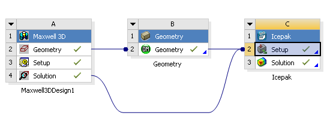

2. In Icepak, go to the **Solve** menu and select **Define report**. In the **Define summary report** panel, keep the default specifications. Select **New** and select the **Stock** objects in the **Objects** drop-down list. Click **Accept**. For the **Value**, select **Heat flow**. Click **Write** to display the **Report summary data** panel shown in Figure 33.16: Report summary data Panel (p. 800). Note that the Heat flow is 8.7 Watts.

**Figure 33.15: Define summary report Panel**

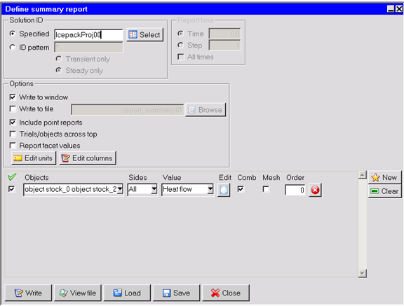

**Figure 33.16: Report summary data Panel**

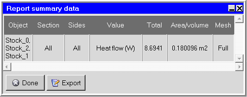

3. Click **Done** to close the **Report summary data** panel and **Close** to exit the **Define summary report** panel.

### 33.11. Step 8: Iterate in Workbench

1. In Icepak, select **File** > **EM Mapping** > **Volumetric Heat Loss** to open the **Volumetric Heat Losses** panel. Select **Temperature Feedback** and click **Accept**.

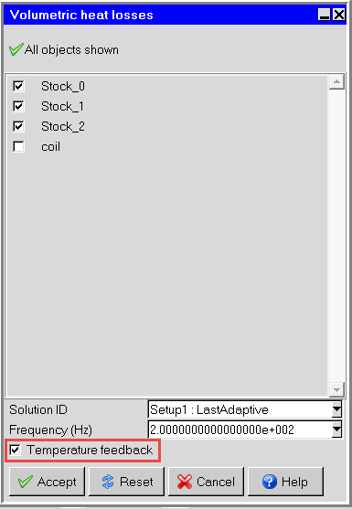

2. From the **Solve** menu, select **Run Solution** to open the **Solve** panel. Rename the **Solution ID** as "Feedback_Iterator_Run" and click **Dismiss**.

3. From the **File** menu, select **Save project**.

4. From the **File** menu, select **Close Icepak**.

5. In Workbench, select a Feedback Iterator component and drag it onto the Maxwell project's Setup cell.

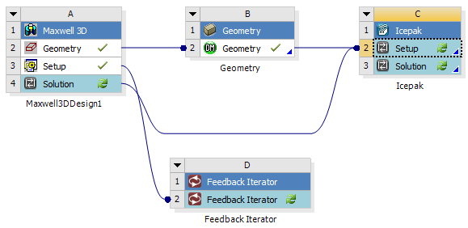

6. Right-click the Feedback Iterator cell (D2) select **Properties** and edit the following properties:

• **Max Iterations**: 4

• **Target Delta Temperature %**: 5

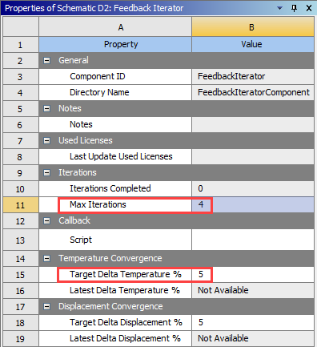

•

7. Right-click the Feedback Iterator cell (D2) select **Single Iteration Update**. Wait until the Icepak solution has completed.

8. In Icepak, click **Done** to close the solution residuals panel.

9. From the **File** menu, click **Close Icepak**.

10. After the single iteration update is complete, right-click the Feedback Iterator cell (D2) and select **Update**.

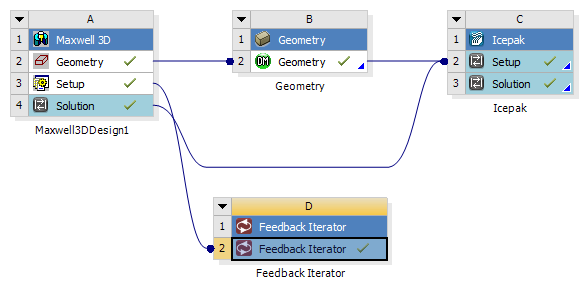

### 33.12. Step 9: Examine Feedback Iterator Run Results

After the iterations complete, examine the Ohmic loss in Maxwell and the Heat flow in Icepak.

1. In Workbench, double-click the Maxwell3DDesign1 Solution cell to launch Maxwell.

2. From the **Maxwell 3D** menu, select **Fields** > **Calculator**.

• Select **Input** > **Quantity** > **OhmicLoss**

• Select **Input** > **Geometry** > **Volume** > **Stock**

• Select **Scalar** >

**integrate**

• Select **Output** > **Eval**

3. The Ohmic losses in Stock volume are around 8.8 Watts.

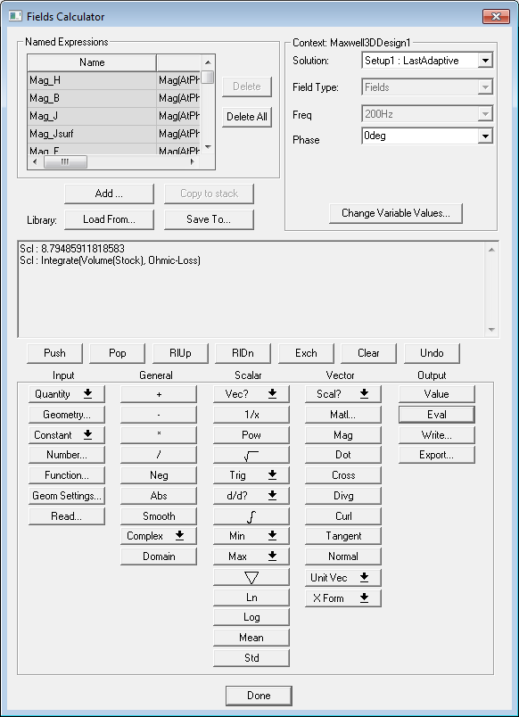

4. Click **Done** to exit.

5. From the **File** menu, select **Close Desktop**.

6. In Icepak, go to the **Solve** menu and select **Define report**. In the **Define summary report** panel, click **Write**. The Heat flow for the stock objects is around 8.8 Watts.

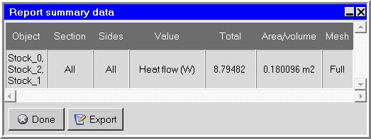

### 33.13. Step 10: Summary

In this tutorial, heat losses are transferred from Maxwell to Ansys Icepak using Ansys Workbench. Using one-way couping, the heat flow indicated in the **Report summary data** panel is around 8.4 for the Stock which is the same value calculated in Maxwell using the **Fields calculator**. Using the Feedback Iterator to create bi-directional iterative coupling, Maxwell and Icepak report an increase in heat flow. Icepak reports a heat flow of around 8.5 for the Stock which is the same value calculated in Maxwell using the **Fields calculator**.

---

## Chapter 34: Icepak – HFSS Coupling

### 34.1. Introduction

This tutorial demonstrates how to model an Ansys Icepak– HFSS workflow.

In this tutorial you will learn how to:

• Perform an HFSS analysis.

• Understand the volumetric and surface losses on a hybrid ring plate.

• Compare losses in HFSS and Ansys Icepak to validate the data transfer.

**Note:**

Mesh counts and solution results may differ slightly due to enhancements to the meshing algorithm and Fluent solver, respectively.

### 34.2. Prerequisites

This tutorial assumes that you have basic familiarity with the setup and solution of HFSS and Ansys Icepak simulation.

### 34.3. Problem Description

The hybrid ring plate is considered for understanding the effect of volumetric and surface losses on the temperature prediction of the ring.

**Figure 34.1: Problem Specification**

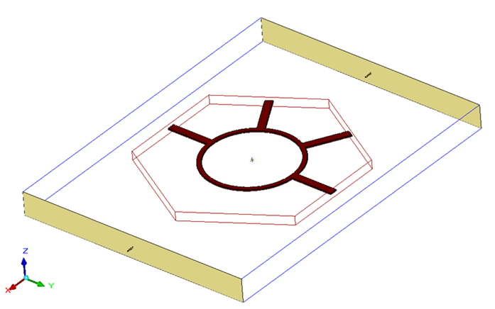

### 34.4. Step 1: Create a New Project

In Workbench, go to **File** menu and select **Restore Archive** to open the project, icepak-hfss-tutorial.wbpz.

The procedure to download this file is described below.

1. Set up a working directory on the computer you will be using.

2. Download the hfss.zip file here.

3. Unzip the hfss.zip file you have downloaded to your working directory.

### 34.5. Step 2: Build the Model

1. An HFSS project is present in the schematic. Perform a right mouse click on the **Geometry** cell (A2) and go to **Transfer Data To New** > **Geometry**. The geometry is directly shared from HFSS Geometry using a DM connection.

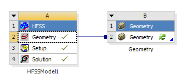

2. Double-click the **Geometry** cell (A2) to open HFSS. Observe the geometry which opens in HFSS.

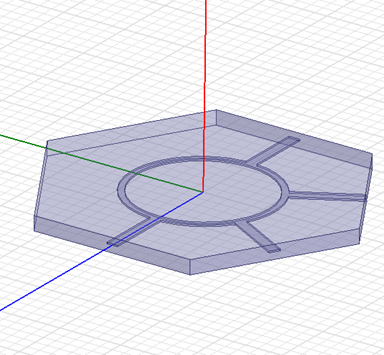

3. Minimize HFSS, right-click on the **Geometry** cell (B2) and select **Refresh**.

4. Right-click the **Geometry** cell (B2) and select **Edit Geometry in DesignModeler** to open Design- Modeler as you need to edit the geometry first before exporting into Ansys Icepak.

a. Click **Generate** to display the model.

b. Expand the node containing the parts and bodies. Suppress bodies Port, Port_1, Port_2 and

Port_3.

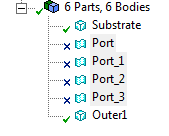

c. Edit the geometry in DesignModeler using the **Electronics** option in the **Tools** menu.

• Select **Simplify** and choose Level 3 simplification for Outer1.

• Make sure to select **Very Fine** for the facet quality.

• Click **Generate**.

• Select **Simplify** and choose Level 2 simplification for the Substrate.

• Click **Generate**.

• Close DesignModeler and return to Ansys Workbench.

**Note:**

The Electronics menu is shown only if the DesignModeler option **Enable Electronics** **Options** is turned on.

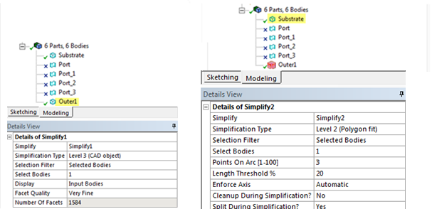

5. Drag and drop an Ansys Icepak template onto the project schematic on top of the **Geometry** cell (B2) to transfer the geometry into Ansys Icepak. Connect the HFSS Solution cell to the Icepak Setup cell.

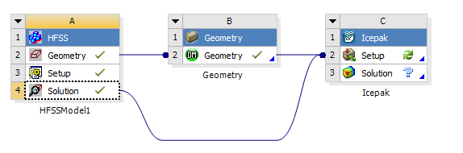

6. Right-click the HFSS **Solution** cell (A4) and select **Update** to run the HFSS analysis.

7. Right click on the **Setup** cell (C2) and select **Edit** to launch Ansys Icepak.

a. Resize the cabinet using the following dimensions in meters.

**Table 34.1: Cabinet Geometry**

| xS | -0.04 | xE | 0.04 |
| --- | --- | --- | --- |
| yS | -0.03 | yE | 0.03 |
| zS | -0.003 | zE | 0.003 |

b. Create openings on the sides of the Cabinet for the flow inlet (Min x) and outlet (Max x). Specify

X velocity of 0.1 m/s for opening in min-x direction.

### 34.6. Step 3: Generate a Mesh

1. Update the mesh priority so Outer1 has higher priority than the Substrate. The **Edit priorities** option can be found under the **Model** menu.

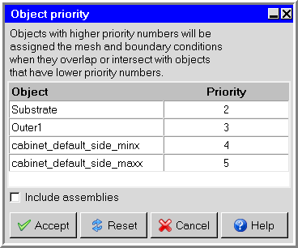

2. In the **Mesh control** panel, specify **Mesher HD** for this model as it contains CAD objects.

3. Select **Set uniform mesh params** under the **Global** tab.

4. Select **Allow multi-level meshing** under the **Multi-level** tab.

5. Click the **Generate** button to generate the mesh.

### 34.7. Step 4: Physical and Numerical Settings

Before starting the solver, you will first check that the proper flow regime is being modeled.

**Problem setup** →

1. Go to

**Basic parameters** in the **Model manager** window.

a. In the **General setup** tab, make sure that both flow and the temperature fields are switched on.

b. Select **Laminar** for the **Flow regime** and turn **Off** the **Radiation**.

c. Click **Accept** to close the panel.

**Solution settings** →

**Solution settings** →

2. Go to

**Advanced settings** in the **Model manager window** and verify that the following values are set for each variable:

**Basic settings** and

**Basic settings**

No. of iterations = 500

Flow = 0.001

Energy = 1e-7

**Advanced settings**

Discretization scheme (Momentum and Temperature) = First order

Precision = Double

### 34.8. Step 5:Volume/Surface Mapping

1. Go to **File** → **EM Mapping** →**Volumetric heat losses**.

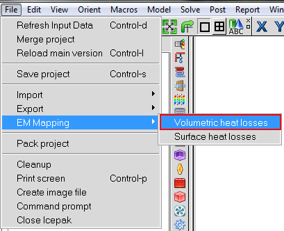

2. Select **Outer1** and **Substrate** for which losses needs to be applied.

3. Set the **Frequency (Hz)** as displayed in the image below.

4. Click **Accept**.

### 34.8. Step 5: Volume/Surface Mapping

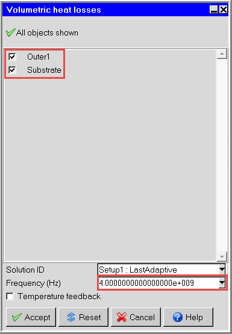

### 34.9. Step 6: Save the Model

Ansys Icepak automatically saves the model for you before it starts the calculation, but it is a good idea to save the model (including the mesh) yourself as well. If you exit Ansys Icepak before you start the calculation, you will be able to open the job you saved and continue your analysis in a future Ansys Icepak session. (If you start the calculation in the current Ansys Icepak session, Ansys Icepak will simply overwrite your job file when it saves the model.)

**File** → **Save project**

**Note:**

Alternatively, you can click the

button in the **File commands** toolbar.

### 34.10. Step 7: Calculate a Solution

1. Solve the Ansys Icepak model by updating in Ansys Workbench or by clicking **Solve** in Ansys Icepak.

**Note:**

Solution completes approximately after 60 iterations.

### 34.11. Step 8: Examine the Results

Create a summary report for heat-flow of substrate in Ansys Icepak.

1. Select **Report** → **Summary Report**

a. Click **New** and select **Substrate** in **Objects** box. (Dielectric losses are predominant in Substrate).

b. Select **Heat Flow** for **Value**.

2. Click **Write** to obtain the heat-flow.

Ansys Icepak reports 0.2408 Watts

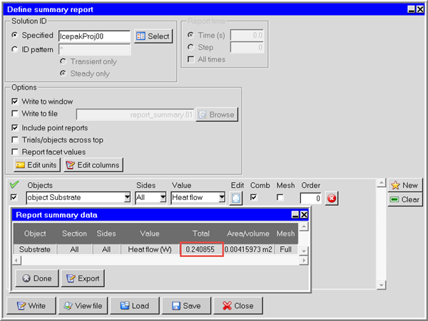

Evaluate volume loss for substrate in HFSS.

1. Open the HFSS application and select the HFSS model. From the menubar,**HFSS** →**Fields** →**Calcu-** **lator**

a. Under**Input**, click on **Quantity** and select **VolumeLossDensity** . Then click **OK**.

b. Under **Input**, click on **Geometry** and select **Volume** and then **Substrate**. Then click **OK**.

c. Select **Scalar** >

**integrate**.

d. Click on **Eval** to report the total volume loss density of substrate.

2. HFSS reports 0.24353 Watts.

**Note:**

Heat flow value from HFSS can also be obtained from uns_out file.

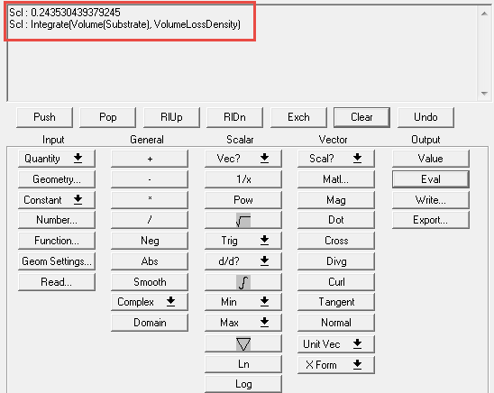

Evaluate surface/conductor losses in Ansys Icepak.

1. Go to **File** → **EM Mapping** →**Volumetric heat losses**.

2. Un-check the bodies selection from **Volumetric heat losses** panel.

3. Click **Accept**.

4. Select **File**>**EM Mapping**>**Surface heat losses** option.

5. Select body **Outer1** for which losses needs to be applied.

**Note:**

**Outer1** is selected as conductor losses are predominant in this body.

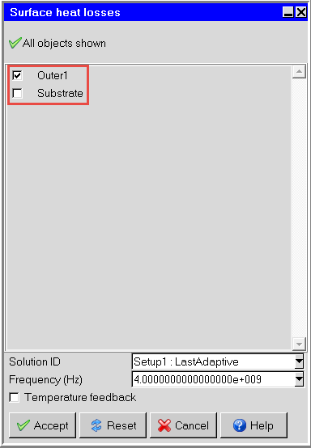

6. Click **Accept**.

7. Retain all other settings in the solve panel.

8. Enter new **Solution ID** and solve the Ansys Icepak model.

Create a summary report for heat-flow from the openings of the cabinet.

1. Heat flow from cabinet boundaries represent surface heat loss as no other device is generating heat.

Select **Report** →**Summary Report**

1. Select **minx** and **maxx** openings in the objects list.

2. Select **Heat Flow** for **Value**.

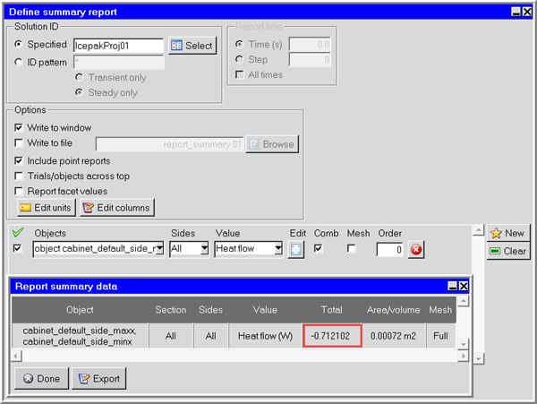

Click **Write** to obtain the heat flow.

Ansys Icepak reports 0.712 Watts

Evaluate surface loss for **Outer1** surface in HFSS.

Select **HFSS**→ **Fields**→**Calculator**

1. Under **Input**, click **Quantity** and select **SurfaceLossDensity**. Then click **OK**.

2. Under **Input**, click **Geometry** and select **Surface** and then **Outer1**. Then click **OK**.

3. Select **Scalar** >

**integrate**.

4. Click on **Eval** to report the total surface loss density of substrate.

HFSS reports 0.712 Watts.

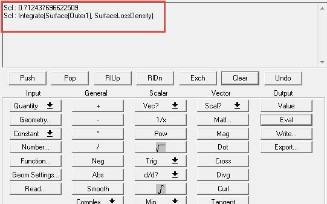

**Note:**

Heat flow value from HFSS can also be obtained from uns_out file.

Evaluate volumetric and surface losses in Ansys Icepak

1. Go to **File** → **EM Mapping** →**Volumetric heat losses**.

2. Select **Volumetric heat losses** option.

a. Select the **Substrate** only to solve for which losses needs to be applied.

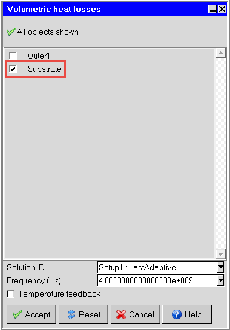

3. Click **Accept**.

4. Retain all other settings in the solve panel.

5. Enter new **Solution ID** and solve the Ansys Icepak model.

Comparison of Total Loss (Volumetric and Surface)

1. Create a summary report for heat-flow from the openings of the cabinet.

• Heat flow from cabinet boundaries represent total heat loss as no other device is generating heat.

2. Select **Report** →**Summary Report**

a. Select **minx** and **maxx** openings in the objects list.

b. Select **Heat Flow** in Values.

3. Click **write** to obtain the heat-flow.

4. Ansys Icepak reports 0.95563 Watts.

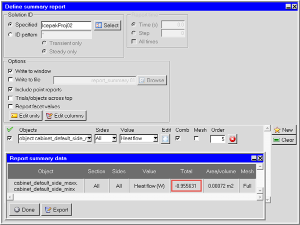

5. Evaluate surface loss for **Outer1** surface in HFSS.

• HFSS reports 0.712 Watts.

6. Evaluate volume loss for **Substrate** in HFSS.

• HFSS reports 0.24353 Watts

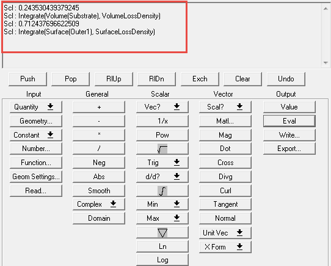

7. Summation of above losses equals to 0.95 Watts.

**Note:**

Heat flow value from HFSS can also be obtained from uns_out file.

### 34.12. Step 9: Summary

In this tutorial, volumetric and surface losses are transferred from HFSS to Ansys Icepak using the Ansys Workbench connection. A validation/comparison is performed between the data in HFSS with Ansys Icepak.

---

## Chapter 35: SIwave - Icepak Coupling

### 35.1. Introduction

This tutorial demonstrates how to perform an Ansys SIwave - Ansys Icepak workflow. SIwave is used to compute Joule heating in a printed circuit board. The SIwave heat load is imported in Icepak to solve for the temperature field using heat transfer coefficient boundary conditions. We iterate among the two solvers until power and temperature fields converge.

In this tutorial, you will learn how to:

• Perform two-way coupling between SIwave and Icepak and examine results.

• **Note:**

Mesh counts and solution results may differ slightly due to enhancements to the meshing algorithm and Fluent solver, respectively.

### 35.2. Prerequisites

This tutorial assumes that you have basic familiarity with the setup and solution of SIwave and Icepak simulations.

### 35.3. Problem Description

The board layout is used for performing a DC IR drop computation.

### 35.4. Step 1: Create a New Project

1. Open a new session of Ansys SIwave. When SIWave starts, the **Welcome to Ansys SIwave** panel opens.

2. Select **Open Project** from the Start panel. Select DCIR.siw from the file selection panel and click **Open** to load the project.

This file is located on the Ansys Help Site. The procedure to download this file is described below.

1. Set up a working directory on the computer you will be using.

2. Download the siwave.zip file here.

3. Unzip the siwave.zip file you have downloaded to your working directory.

### 35.5. Step 2: Run an SIwave Simulation

1. From the Common Functions, click the **SIwave Workflow Wizard** button.

**Figure 35.1: SIwave Workflow Wizard Button**

The **SIwave Workflow Wizard** is displayed.

**Figure 35.2: SIwave Workflow Wizard**

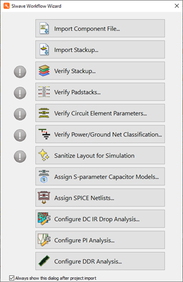

2. Optional: click **Verify Stackup**. The **Layer Stack-up Editor** is displayed.

a. Verify that all layers imported correctly.

**Note:**

When coupling with Ansys Icepak, it is recommended to delete any non-metal and dielectric layers.

b. Click **OK** to return to the **SIwave Workflow Wizard**.

**Figure 35.3: Layer Stack-up Editor**

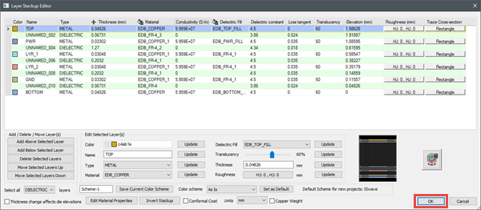

3. Optional: click **Verify Padstacks**. The **Padstack Editor** is displayed.

a. **Via Plating** determines the amount of conductor plating inside of a via. Select a padstack and use the slider bar to change the **Ratio** percentage. SIwave defaults all via plating to 100% for all padstacks. Alternatively, you can select **Absolute** to specify wall thickness.

b. Click **Cancel** to discard the changes and return to the **SIwave Workflow Wizard**.

**Figure 35.4: Padstack Editor**

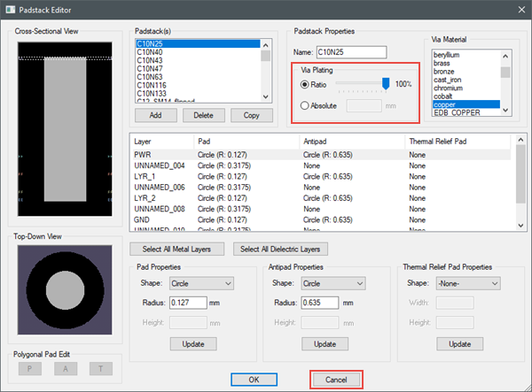

4. Optional: click **Verify Circuit Element Parameters**. The **Circuit Element Properties** panel is displayed.

**Figure 35.5: Circuit Element Properties Panel**

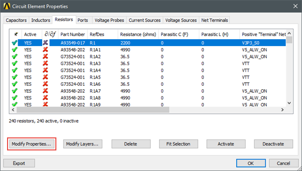

**Note:**

Inductors and Resistors are important for DC operation.

a. On the **Inductors** and **Resistors** tabs, verify that they have been imported properly.

b. On the **Resistors** tab, select the first resistor named R1 and click **Modify Properties**. The **Set**

**Resistor Parameters** panel is displayed.

c. In the **Set Resistor Parameters** panel, you can change the **Name** or the associated **Part Number**.

**Figure 35.6: Circuit Element Properties Panel**

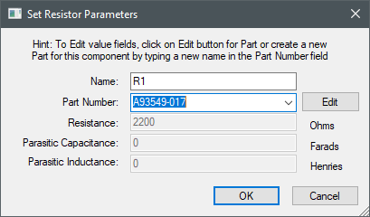

d. Click **Cancel** to close the **Set Resistor Parameters** panel and click **Cancel** to return to the **SIwave**

**Workflow Wizard**.

5. Optional: click **Verify Power/Ground Net Classification**. The **Power/Ground Net Classification** panel is displayed.

**Note:**

SIwave automatically classifies any net defined with polygons or shapes as **Power/Ground** **Nets**. SIwave does not automatically classify nets with only traces and padstacks as **Power/Ground Nets**.

a. In the **Power/Ground Net Classification** panel, you can move nets in and out of the classification using the up and down arrow buttons.

b. Click **Auto Identify** to return the classification to the default and click **OK** to return to the **SIwave**

**Workflow Wizard**.

**Figure 35.7: Power/Ground Net Classification Panel**

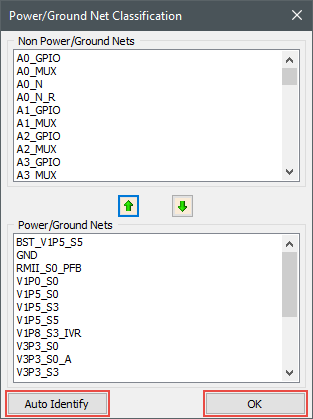

6. In the **SIwave Workflow Wizard**, click **Configure DC IR Drop Analysis**. The **DC IR Configuration** panel is displayed.

**Figure 35.8: DC IR Configuration Panel**

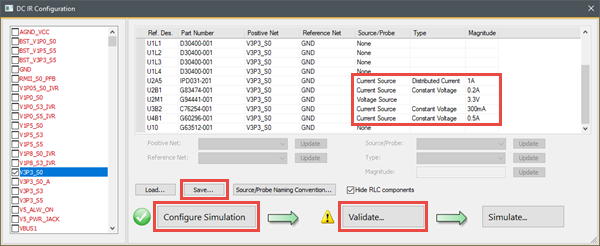

a. Select the check box next to net V3P3_S0. Any active devices connected to this net are displayed.

b. Deselect **Hide RLC components** to see passive devices and select it again to hide them.

c. Verify that the current and voltage sources are set as shown in Figure 35.9: Current and Voltage Sources (p. 829).

**Figure 35.9: Current and Voltage Sources**

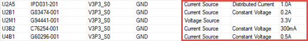

d. Click **Save** to save a flow configuration file (.fcf). Choose a file name and save it in your working

directory. This can be loaded for subsequent simulations.

e. Click **Configure Simulation** to apply pin groups and excitations to the design.

f. Click **Validate**. The **Launch Validation Check** panel is displayed.

**Figure 35.10: Launch Validation Check Panel**

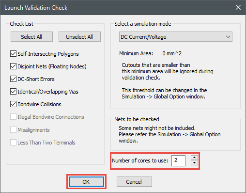

**Note:**

The validation check analyzes the entire setup to ensure it is ready for simulation.

g. Use the up arrow button to increase the **Number of cores to use**. Use as many cores as are

available.

h. Click **OK** to start the validation check. After the validation check is complete, the **Validation**

**Check Results** panel is displayed.

**Figure 35.11: Validation Check Results Panel**

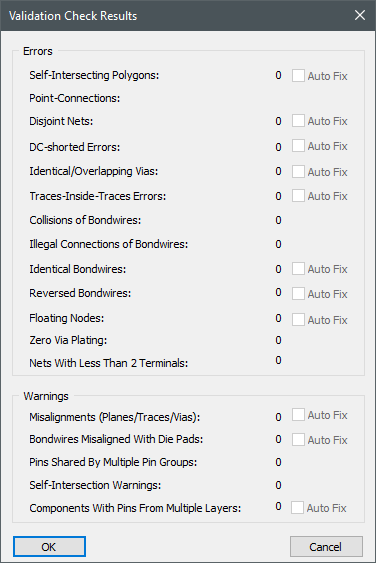

**Note:**

If there are certain geometry problems, such as disjointed nets or overlapping vias, you can resolve them by selecting the **Auto Fix** check box and clicking **OK**.

i. Click **OK** to close the **Validation Check Results** panel and return to the **DC IR Configuration** panel.

**Figure 35.12: DC IR Configuration Panel**

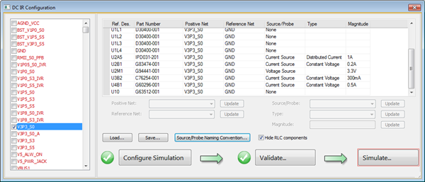

j. Click **Simulate**. The **Compute DC Current and Voltage Distribution** panel is displayed.

**Figure 35.13: Compute DC Current and Voltage Distribution**

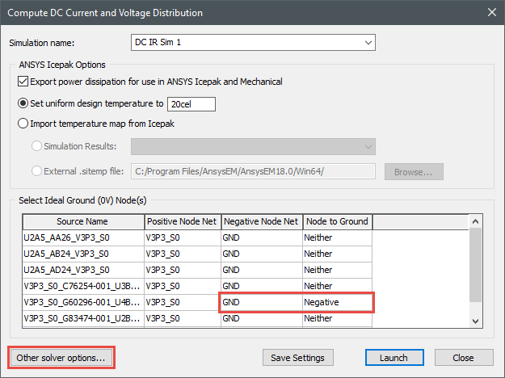

k. Ensure that the **Compute DC Current and Voltage Distribution** options are set as they are in Figure 35.13: Compute DC Current and Voltage Distribution (p. 832).

l. Click **Other solver options**. The **SIwave Options** panel is displayed.

**Figure 35.14: SIwave Options Panel - DC Tab**

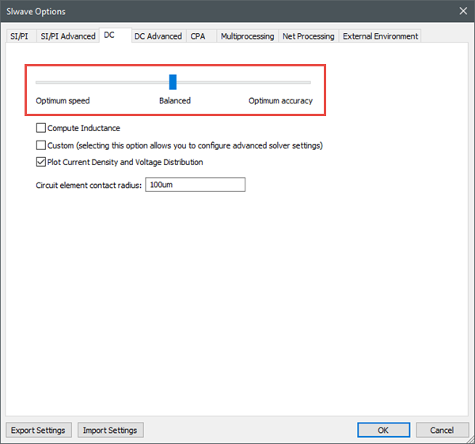

m. On the **DC** tab, move the slider bar to the different options and click on the **DC Advanced** tab

to view which settings are affected.

n. When you are finished, use the slider bar to select **Balanced**.

o. On the **DC Advanced** tab, note that we are meshing vias and performing adaptive mesh refine-

ment for planes and traces.

**Figure 35.15: SIwave Options Panel - DC Advanced Tab**

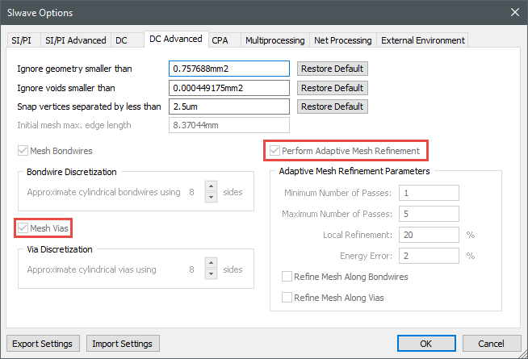

**Note:**

For a DC simulation, High Performance Computing can distribute the solver across multiple cores. A High Performance Computing license is required to use multiple cores.

p. On the **Multiprocessing** tab, click the up arrow to increase the **Number of cores to use**.

q. Ensure that the **Multiprocessing** options are set as they are in Figure 35.16: SIwave Options

Panel - Multiprocessing Tab (p. 835).

**Figure 35.16: SIwave Options Panel - Multiprocessing Tab**

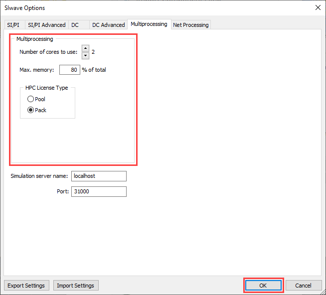

r. Click **OK** to close the **SIwave Options** panel.

s. On the **Compute DC Current and Voltage Distribution** panel, click **Launch**.

**Figure 35.17: Compute DC Current and Voltage Distribution**

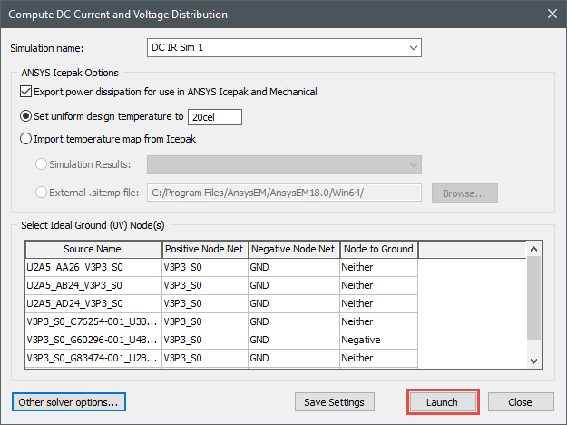

t. The **Process Monitor** displays the simulation status and steps taken by the solver.**Information/Er-** **rors/Warnings**displays any potential issues that may arise during the solution process.

**Figure 35.18: Process Monitor and Information/Errors/Warnings Panels**

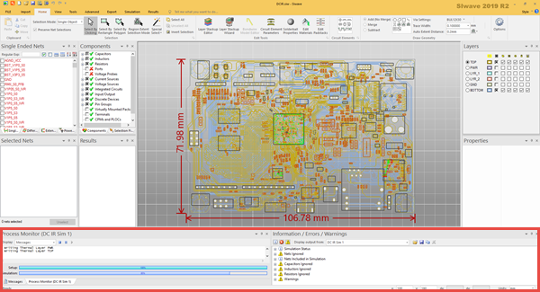

7. From the SIwave **Export** tab, click **ANF in...** and select **Generic Format**. In the **Save As** panel, save the .anf file as Coupling_anf.anf in your working directory.

**Figure 35.19: Export ANF File in Generic Format**

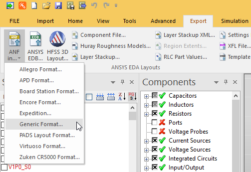

### 35.6. Step 3: Run an Icepak Simulation (Conduction Only)

1. On the SIwave **Simulation** tab, click **Icepak**.

**Figure 35.20: SIwave Simulation Tab**

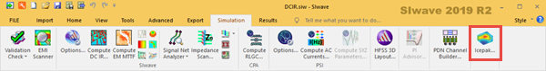

2. In the **Icepak Simulation Setup** dialox box, specify a **Setup Name** for the simulation.

**Figure 35.21: Icepak Simulation Setup Dialog Box - Simulation Setup Tab**

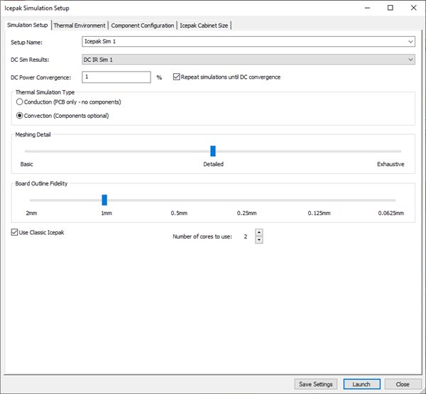

3. For **DC Sim Results**, note that the initial DC IR solution is automatically selected.

4. For **DC Power Convergence**, retain the default and ensure **Repeat simulations until DC convergence** is enabled.

5. Under **Thermal Simulation Type**, select **Conduction (PCB only - no components)**.

6. Retain the settings for **Meshing Detail** and **Board Outline Fidelity**.

7. Select **Use Classic Icepak**.

8. If High Performance Computing licensing is available, increase the **Number of cores to use**.

9. On the **Thermal Environment** tab, retain the settings for **Forced Convection**.

**Figure 35.22: Icepak Simulation Setup Dialog Box - Thermal Environment Tab**

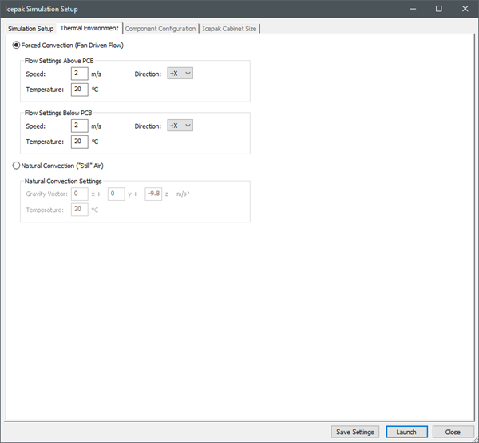

**Note:**

Conduction-only modeling sets wall boundary conditions based on flow inputs. Inputs can be based on forced convection (forced airflow) or natural convection (bouyancy- based).

• **Forced Convection** has separte top and bottom flow rate and temperature inputs.

• **Natural Convection** uses the board orientation only (gravity direction) and ambient temperature.

**Note:**

As this is a conduction-only simulation, there are no components or cabinet size settings to define.

10. Click **Launch** to start the Icepak simulation. The simulation progress is displayed in the **Process** **Monitor**.

**Figure 35.23: Process Monitor**

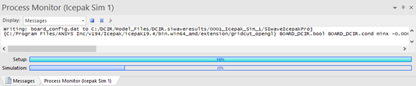

11. When the simulation loop is complete (after DC IR Sim 2), right-click on the Icepak simulation in the **Results** pane (Icepak Sim 1) and select **Display Temperature** to show the temperature contours.

**Figure 35.24: Results Pane**

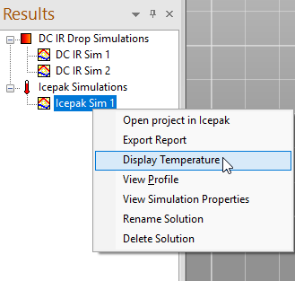

**Figure 35.25: Temperature Contours**

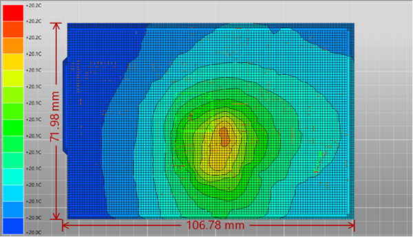

### 35.7. Step 3: Run an Icepak Simulation (Forced Convection)

1. On the SIwave **Simulation** tab, click **Icepak**.

2. In the **Icepak Simulation Setup** dialox box, specify a new **Setup Name** for the simulation, such as Icepak Sim 1 - Convection.

**Figure 35.26: Icepak Simulation Setup Dialog Box - Simulation Setup Tab**

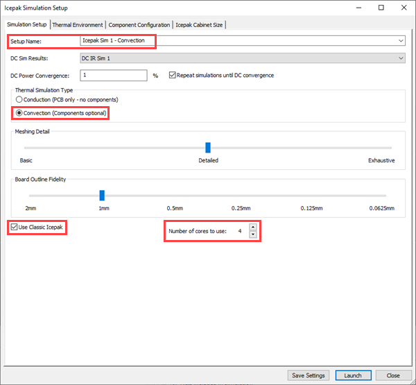

3. For **DC Sim Results**, note that the initial DC IR solution is automatically selected.

4. For **DC Power Convergence**, retain the default and ensure **Repeat simulations until DC convergence** is enabled.

5. Under **Thermal Simulation Type**, select **Convection (Components optional)**.

6. Retain the settings for **Meshing Detail** and **Board Outline Fidelity**.

7. Select **Use Classic Icepak**.

8. If High Performance Computing licensing is available, increase the **Number of cores to use** to 4.

9. On the **Thermal Environment** tab, retain the settings for **Forced Convection**.

**Figure 35.27: Icepak Simulation Setup Dialog Box - Thermal Environment Tab**

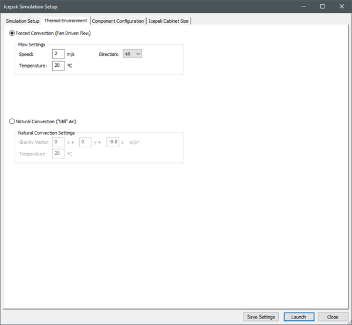

10. On the **Component Configuration** tab, click the **Heat Sink** column header to deselect all check boxes in the column. Also click the **Include**column header twice to deselect all check boxes in column to match conduction-only settings.

**Figure 35.28: Icepak Simulation Setup Dialog Box - Component Configuration Tab**

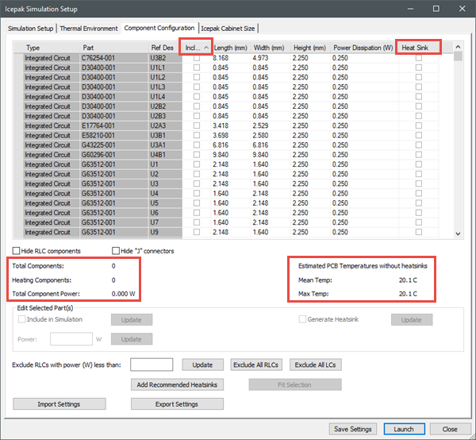

**Note:**

Component **Type**,**Part**, and **Reference Designator** information is displayed in the table.**Length** and **Width** should be accurate. Verify the **Height** and **Power Dissipa-** **tion**.

11. On the **Icepak Cabinet Size** tab, enter the padding settings under **Size Relative to Board Dimension** as displayed in the image below.

**Figure 35.29: Icepak Simulation Setup Dialog Box - Icepak Cabinet Size Tab**

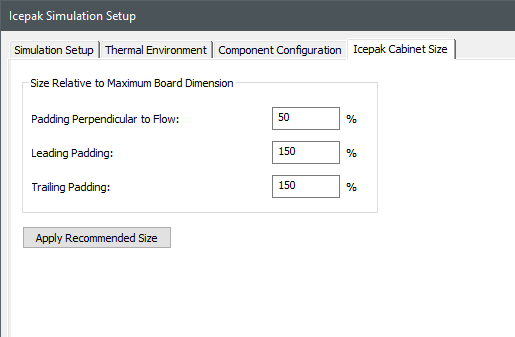

12. Click **Save Settings**.

13. Click **Launch** to start the Icepak simulation. The simulation progress is displayed in the **Process** **Monitor**.

14. When the simulation loop is complete (after DC IR Sim 2), right-click on the Icepak simulation in the **Results** pane (Icepak Sim 1 - Convection) and select **Display Temperature** to show the temperature contours.

**Figure 35.30: Results Pane**

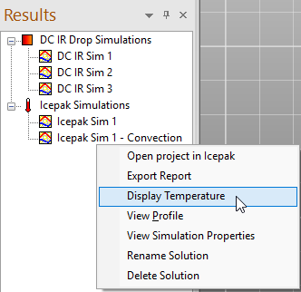

**Figure 35.31: Temperature Contours - Forced Convection**

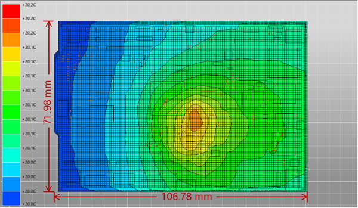

**Note:**

Temperature distribution is slightly different due to true fluid flow calculations rather than an estimated boundary condition (as in conduction-only modeling).

### 35.8. Step 4: Run a Single Board Setup in Icepak

Use the **Export** **Icepak** functionality to run a full system loop in Ansys SIwave and Ansys Icepak, starting with a single board setup.

1. In your working directory, create a new folder named IceSingle.

2. Copy and paste the DCIR_solved.siw file and DCIR_solved.siwaveresults folder into the IceSingle folder.

**Note:**

The loop from Icepak creates separate files that should be run in their own location. If you choose to re-run the DCIR simulation, re-run in a new folder.

3. In SIwave, open the DCIR_solved.siw project.

**Important:**

At this point, we are no longer using the DCIR.siw project. Ensure you are working with the DCIR_solved.siw project.

4. On the **Export** tab, click **Icepak**.

**Figure 35.32: SIwave Export Tab**

5. In the **Icepak Export** dialox box, specify the **Project Directory** as SingleIceRun within the IceSingle.

**Figure 35.33: Icepak Export Dialog Box - Simulation Setup Tab**

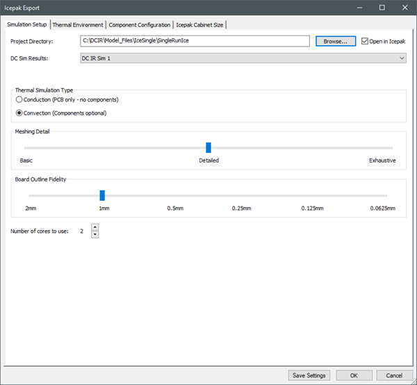

6. For **DC Sim Results**, note that the initial DC IR solution is automatically selected.

7. Under **Thermal Simulation Type**, select **Convection (Components optional)**.

8. Retain the defaults for **Meshing Detail** and **Board Outline Fidelity**.

9. Set the **Number of cores to use** as 2.

10. On the **Thermal Environment** tab, retain the settings for **Forced Convection**.

**Figure 35.34: Icepak Export Dialog Box - Thermal Environment Tab**

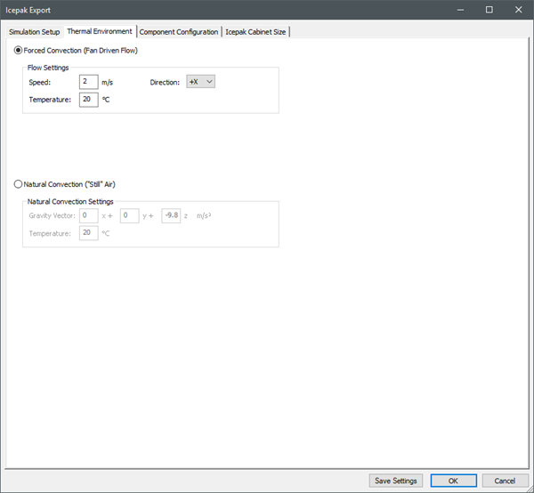

11. On the **Component Configuration** tab, click the **Include** column header to deselect all check boxes in the column. Also ensure the check boxes in the **Heat Sink**column are deselected.

12. For the following components, select the **Include** check box and define the **Height** and **Power** **Dissipation (W)** settings as shown.

**Figure 35.35: Components To Include and Modify**

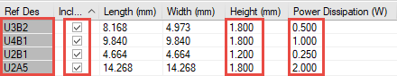

13. On the **Icepak Cabinet Size** tab, enter the padding settings under **Size Relative to Board Dimension** as displayed in the image below.

**Figure 35.36: Icepak Export Dialog Box - Icepak Cabinet Size Tab**

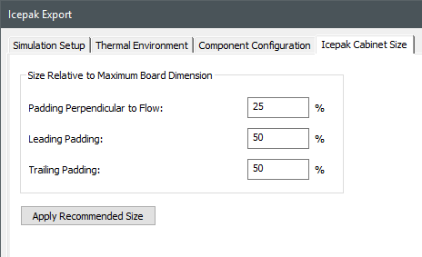

14. Click **Save Settings** and then **OK**. An initial Icepak project launches with base geometry, mesh and solver settings.

15. Save the Icepak project and close Icepak.

**Note:**

To run the **SIwave Icepak Coupling** > **PCB Iterator** macro, Icepak must be running in a standalone instance.

16. Open the saved project in Icepak.

17. In the Icepak **Project** tree, right-click on the **OUTER** assembly and select **Expand all**.

18. Delete the **inlet** and **outlet** openings. Examine the model in the graphics window.

**Figure 35.37: Model in the Icepak Graphics Window**

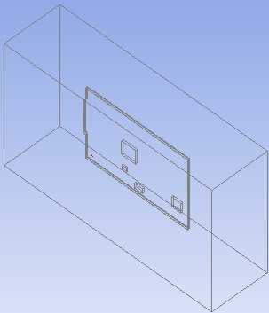

19. In the **Project** tree, expand **Problem setup** and double-click **Basic Parameters** to open the **Basic** **parameters** panel.

20. Under **Flow regime**, select **Turbulent** and select **Zero equation**.

**Figure 35.38: Basic Parameters Panel**

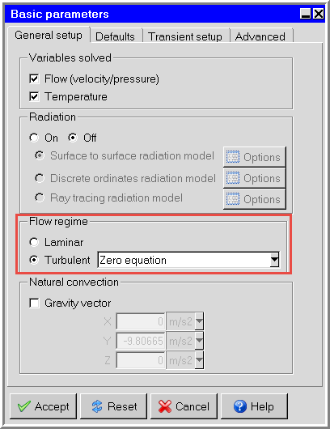

21. In the **Project** tree, double-click the **Cabinet** to open the **Cabinet** panel.

22. On the **Geometry** tab, edit the **Location** information as shown in the image below.

**Figure 35.39: Cabinet Panel - Geometry Tab**

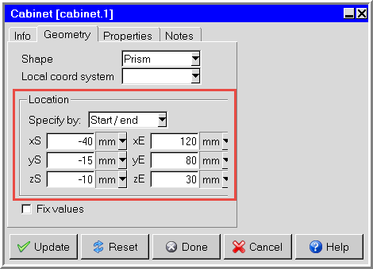

23. On the **Properties** tab, change **Max X** to a **Grille** and click **Edit** to open the **Grille** panel

**Figure 35.40: Cabinet Panel - Properties Tab**

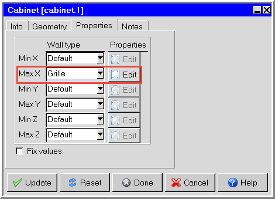

.

24. On the **Properties** tab, enter a **Free area ratio** of 0.75 to add a pressure drop to the system.

**Figure 35.41: Grille Panel - Properties Tab**

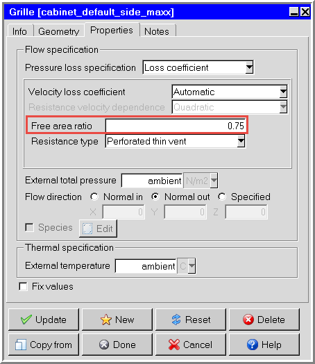

25. In the **Project** tree, double-click the **BOARD_DCIR_solved** PCB object to open the **Printed Circuit** **Boards** panel.

26. On the **Properties** tab under **Thermal specification**, click ensure **SIwave profile** is selected and click **Edit**.

**Figure 35.42: Printed Circuit Boards Panel - Properties Tab**

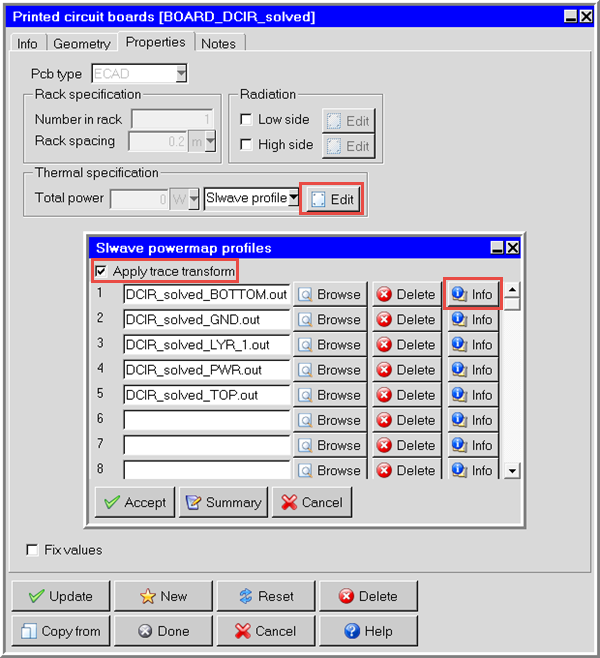

27. In the **SIwave powermap properties** panel, select **Apply trace transform** and click **Browse** and navigate to dcthermal in SingleIceRun results directory. Repeat for the other four layers and then click **Info** for the first layer listed. Power locations are displayed in the graphics window, and inform- ation is displayed in the **Powermap Info** panel.

**Figure 35.43: Powermap Locations and Information**

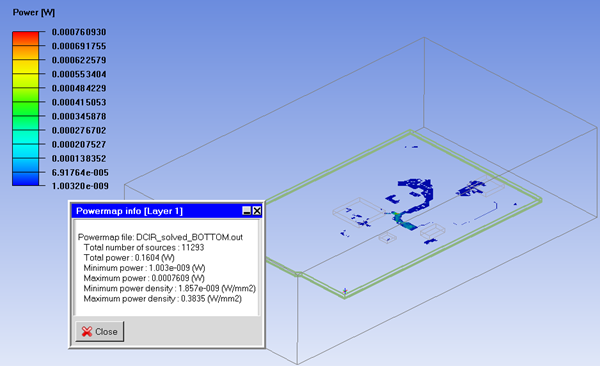

28. Close the **Powermap Info** panel and click **Accept** in the **SIwave powermap properties**.

29. Click **Done** to close the **Printed Circuit Boards** panel.

30. Click on the **Fan** button to create a fan, and then double-click on the fan object in the **Project** tree to open the Fans panel.

31. On the **Geometry** tab, define the settings as shown in the following image. Note that the units are set to mm.

**Figure 35.44: Fan Panel - Geometry Tab**

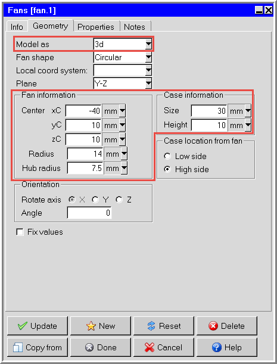

32. On the **Properties** tab, define the settings as shown in the following image. Note that the unit for flow is set to cfm.

**Figure 35.45: Fan Panel - Properties Tab**

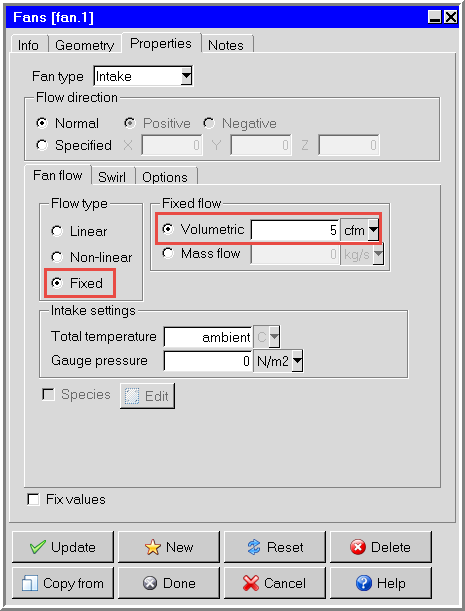

33. Click **Done** to save the settings and close the **Fans** panel.

34. In the **Project** tree, right-click on the fan object and select **Copy**.

35. In the **Copy fan** panel, select **Translate** under **Operations** and enter a **Y offset** of 45 mm.

**Figure 35.46: Copy Fan Panel**

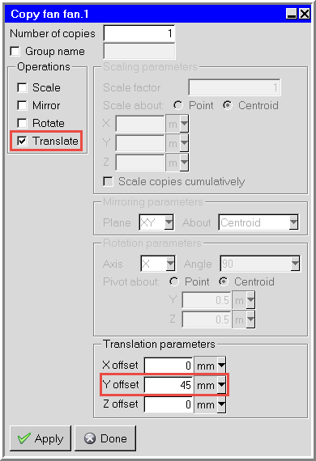

36. Click **Apply** to close the **Copy fan** panel and create the copied fan object.

37. In the **Project** tree, use the Shift key to select both fans. Right-click and select **Create** > **Assembly**. The new assembly appears in the **Project** tree.

38. Double-click the assembly to open the **Assemblies** panel.

39. On the **Info** tab, enter a **Name** of FANS.

40. On the **Meshing** tab, define the settings as shown in the following image. Note that the units are set to mm.

**Figure 35.47: Assemblies Panel - Meshing Tab**

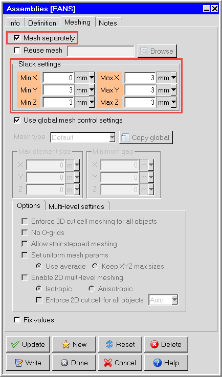

41. Click **Done** to save the settings and close the **Assemblies** panel.

42. From the **Model** menu, select **Generate mesh** to open the **Mesh control** panel.

43. Retain the settings created by SIwave and click **Generate** to create the mesh.

44. When the mesh is generated, click the **Display** tab and define the settings as showin in the following image to inspect the mesh.

**Figure 35.48: Mesh Control Panel - Display Tab**

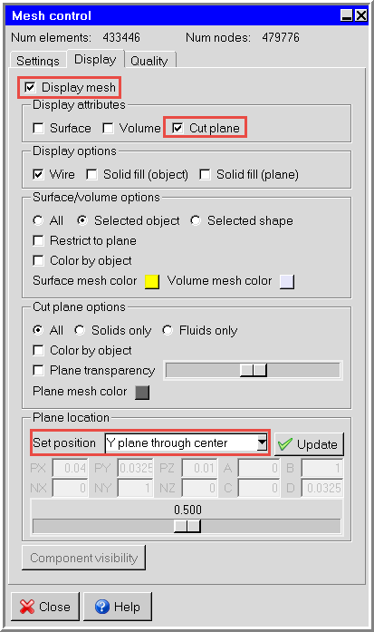

45. From the **Orient** menu, select **Orient Positive Y**. The mesh should be similar to that shown in the following image.

**Figure 35.49: Model Mesh**

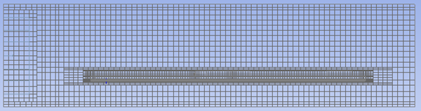

46. Disable **Display mesh** to hide the mesh and click **Close**.

47. From the **Macros** menu, select **Modeling** > **SIwave Icepak Coupling** > **PCB Iterator**.

**Note:**

This macro can be used for existing setups of single or multiple boards.

48. In the **SIwave-Icepak Coupling Iterator for Single and Multiple PCBs** panel, click **New**.

49. Select the **BOARD_DCIR_solved** PCB object and DCIR_solved SIwave project and set the **Termin-** **ation Convergence Criteria** as shown in the image below.

**Figure 35.50: SIwave-Icepak Coupling Iterator for Single and Multiple PCBs Panel**

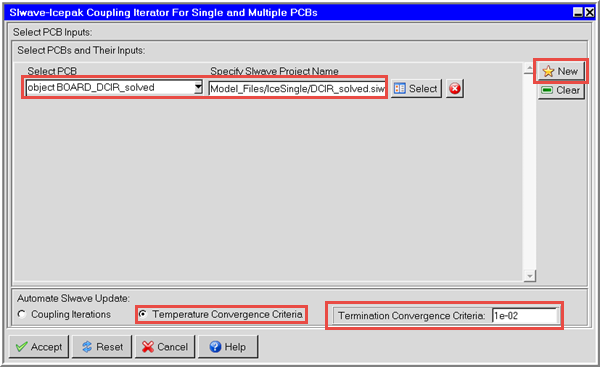

50. Click **Accept** to run the simulation. When the simulation is complete, the following panel appears.

**Figure 35.51: Instructions Panel**

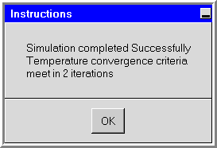

51. In the **Project** tree, right-click **Model** and select **Expand all** to display all model objects in the graphics window.

52. Using the Shift key to select the PCB object and four components (as shown in the image below), right-click and select **Create** > **Object faces** > **Combined**.

**Figure 35.52: Project Tree - Object Selection for Object Face**

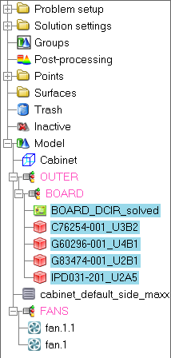

53. In the **Object face** panel, enter a **Name** of Temp.

54. Ensure **Show contours** is enabled and click **Parameters**.

55. In the **Object face contours** panel, select This object from the **Calculated** drop-down list.

**Figure 35.53: Object Face and Object Face Contours Panels**

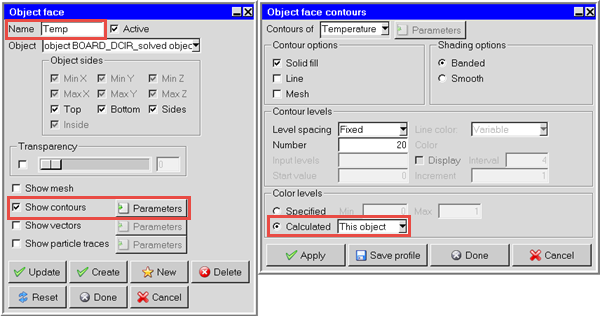

56. Click **Done** in both panels to display the updated temperature values.

**Figure 35.54: Object Face - Temperature Contours**

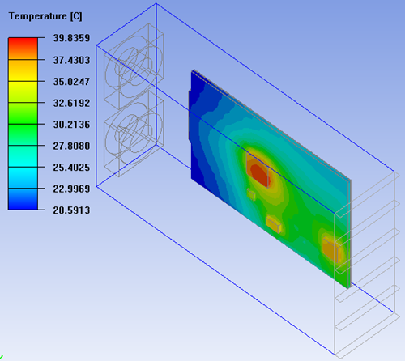

57. In the **Project** tree under **Post-processing**, right-click **Temp** and select **Active** to hide the object face.

58. From the horizontal toolbar, click the Object face button to create a new object face to display flow data.

59. In the **Object face** panel, enter a **Name** of Flow.

60. From the **Object** drop-down list, select the fan items from both fan objects and click **Accept** (see the following image).

61. Select **Show particle traces** and click **Parameters**.

62. In the **Object face particles** panel, define the settings as shown in the following image.

**Figure 35.55: Object Face and Object Face Particles Panels**

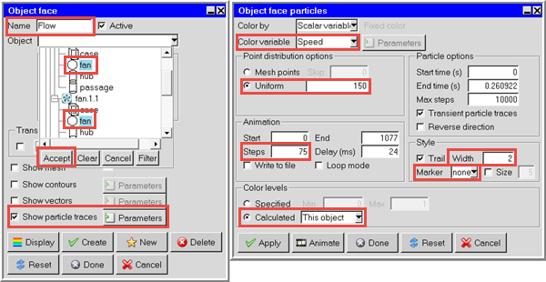

63. Click **Animate** to display the particle traces.

**Figure 35.56: Object Face - Speed Particle Traces**

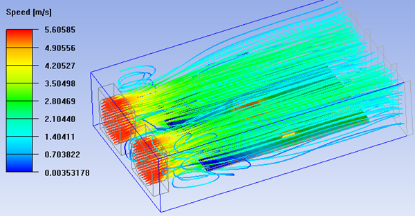

64. From the **File** menu, select **Pack project**.

65. In the **File selection** panel, create a new folder named IceMult on the same level as IceSingle. Save the project as SingleRunIce.tzr.

You have now added more system detail to a generic SIwave convection run to test real-life board DCIR conditions for a single board.

**Note:**

Offset and rotation of the board in Icepak will automatically adjust to the correct location in SIwave.

### 35.9. Step 5: Run a Multi-Board Setup in Icepak

1. Copy and paste the DCIR_solved.siw file and DCIR_solved.siwaveresults folder into the new IceMult folder.

2. In Icepak from the **File** menu, select **Unpack project**.

3. In the **File Selection** dialog box, navigate to the IceMult folder, select the SingleRunIce.tzr, and click **Open**.

4. In the **Location for the unpacked project** panel, enter a project name of MultRunIce and click **Unpack**.

5. From the **File** menu, select **Save project**.

6. In the **Project**, tree, right-click the **OUTER** assembly and select **Copy**.

7. In the **Copy assembly** panel, select **Translate** and enter a **Z offset** of 15 mm.

**Figure 35.57: Copy Fan Panel**

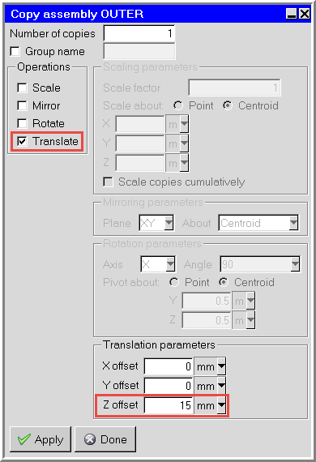

8. Click **Apply** to create the copy of the assembly.

**Note:**

The board trace properties are automatically copied to the new board with unique names.

9. From the **Macros** menu, select **Modeling** > **SIwave Icepak Coupling** > **PCB Iterator**.

10. In the **SIwave-Icepak Coupling Iterator for Single and Multiple PCBs** panel, click **New**.

11. Select the **BOARD_DCIR_solved** PCB object and DCIR_solved SIwave project and set the **Termin-** **ation Convergence Criteria** as shown in the image below.

12. Click **New** again and select the copied PCB object (**BOARD_DCIR_solved.1**) and DCIR_solved SIwave project.

13. Set the **Termination Convergence Criteria** as shown in the image below.

**Figure 35.58: SIwave-Icepak Coupling Iterator for Single and Multiple PCBs Panel**

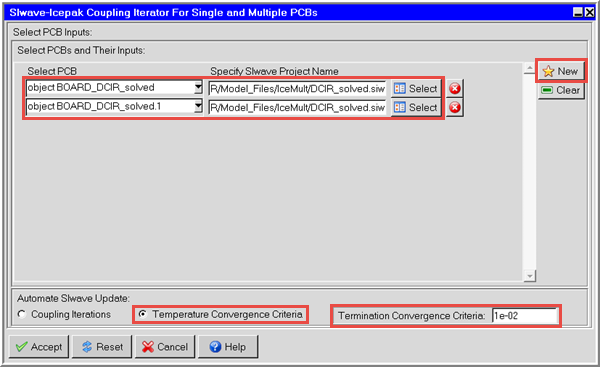

14. Click **Accept** to run the simulation. When the simulation is complete, the following panel appears.

15. Create the same two object faces for temperature and flow, while selecting all objects in both the **BOARD** and **BOARD.1** assemblies.

**Figure 35.59: Object Face - Temperature Contours**

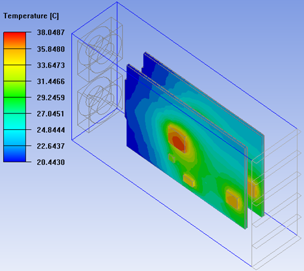

**Figure 35.60: Object Face and Object Face Particles Panels**

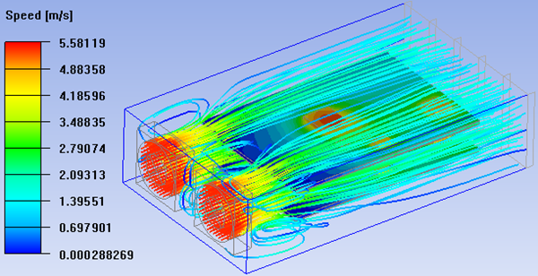

### 35.10. Step 6: Summary

In this workshop, we performed a coupled simulation using Ansys SIwave and Ansys Icepak. The following outlines the main steps:

• We ran a DC IR simulation in SIwave.

• We ran a coupled conduction-only simulation with Icepak using the initial DC IR results.

• We ran a coupled forced convection simulation with Icepak using the initial DC IR results.

• We displayed the temperature distrbutions from the coupled simulations in SIwave.

• We exported the SIwave project and launched it in Icepak.

• We ran the forced convection simulation defined in SIwave in the Icepak application on a single board.

• We created a new Icepak project and copied the board to run a forced convection simulation on multiple boards.

---

## Chapter 36: TEC Macro Tutorial

### Chapter 36:TEC Macro Tutorial

### 36.1. Introduction

This tutorial demonstrates how to model a thermoelectric cooler (TEC) in Ansys Icepak.

In this tutorial, you will learn how to:

• Load a TEC object from the Ansys Icepak Library

• Model a TEC using the **Run TEC** macro

• Postprocess the results of a model that includes a TEC

### 36.2. Prerequisites

This tutorial assumes that you have little experience with Ansys Icepak but that you are generally famil- iar with the interface. If you are not, review Sample Session in the Icepak User's Guide and the tutorial Finned Heat Sink of this guide. Some steps in the setup and solution procedure will not be shown ex- plicitly.

### 36.3. Problem Description

A heat-generating IC package is on a PCB. Heat spreaders and a TEC are placed to cool the package.

**Figure 36.1: TEC in Ansys Icepak**

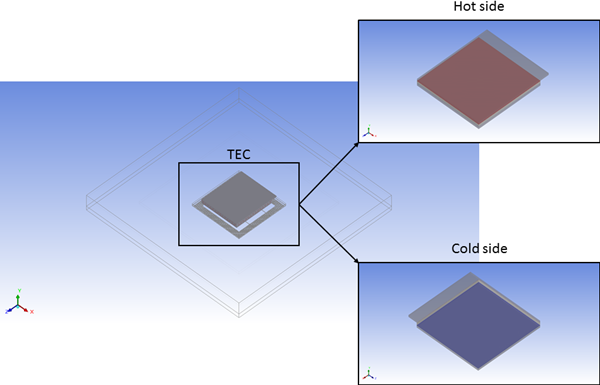

### 36.4. Step 1: Create a New Project

1. Open a new session of Ansys Icepak. When Icepak starts, the **Welcome to Icepak** panel opens.

2. Select **Unpack** and browse to your working directory.

3. In the **File selection** panel, select the file **TEC_Tutorial.tzr** and click **Open** to load the project.

This file is located on the ANSYS Help Site. The procedure to download this file is described below.

1. Set up a working directory on the computer you will be using.

2. Download the tec_tutorial.zip file here.

3. Unzip the tec_tutorial.zip file you have downloaded to your working directory.

4. In the **Location for the unpacked project** panel, browse to your working directory, enter a name for your project, and click **Unpack**.

5. Inspect the model. Observe that an IC package is sitting on a PCB.

**Figure 36.2: IC Package on PCB**

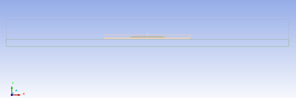

6. Expand the **Package** assembly, right-click on the **Package** object, and select **Edit** to view its prop- erties. On the **Dimensions** tab, note the **Package type** and **Package thickness**.

**Figure 36.3: Package Object - Dimensions Tab**

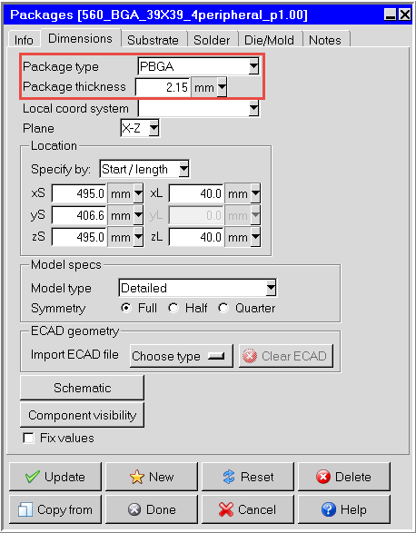

7. View the information in each of the other tabs in the **Packages** panel. Note the **Die** **Total power** on the **Die/Mold** tab.

**Figure 36.4: Package Object - Die/Mold Tab**

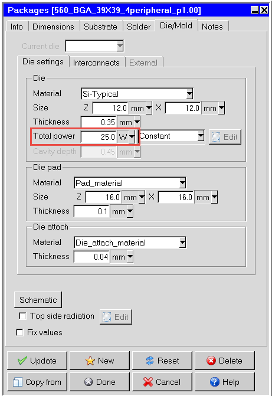

### 36.5. Step 2: Build the Model

We will use Thermoelectric Coolers (TECs) and heat spreaders as a primary means to cool this IC package.

1. To create a heat spreader on top of the package, create a block object and open its edit panel.

**Note:**

Ensure this block is not created inside an assembly.

2. On the **Info** tab, enter a **Name** of **HeatSpreader1**.

3. On the **Geometry** tab, set the geometry specifications as shown in Figure 36.5: HeatSpreader1 - Geometry Tab (p. 878).

**Figure 36.5: HeatSpreader1 - Geometry Tab**

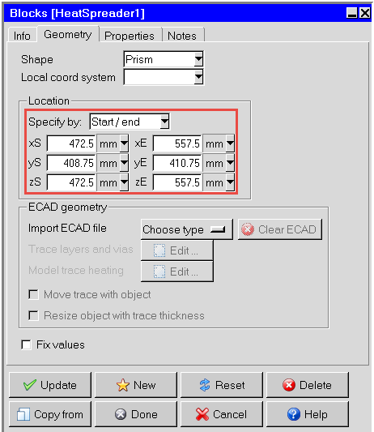

4. On the **Properties** tab, confirm the **Block type** is **Solid** with default materials selected.

**Figure 36.6: Model with Heatspreader1 Added**

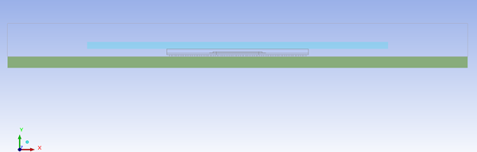

5. Next, place a TEC on the heat spreader. This TEC will cool the IC package’s hot spot. Go to the **Library** tab.

6. Expand **Libraries**,**Main library**, and **TECs**.

**Figure 36.7: TECs Library**

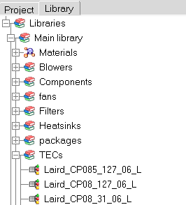

7. Locate the **Laird_HT4_12_F2_3030** TEC and double click on it. The TEC is created in the model. Return to the**Project** tab and confirm that the TEC is in the **Model manager** and **Model Display** windows.

8. In the **Model manager**, right-click the **Laird_HT4_12_F2_3030.1** assembly and select **Move**. Set Rotate and Translate operations as shown in Figure 36.8: Move the TEC (p. 880).

**Note:**

You can use the **Distance** tool in the **View** menu to confirm the TEC is centered above the package die.

**Figure 36.8: Move the TEC**

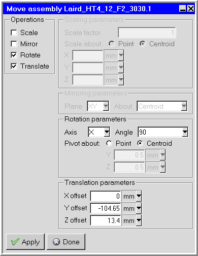

9. In the **Model manager**, expand the **Laird_HT4_12_F2_3030.1** assembly and view the objects composing the TEC.

**Figure 36.9: Model with TEC Added**

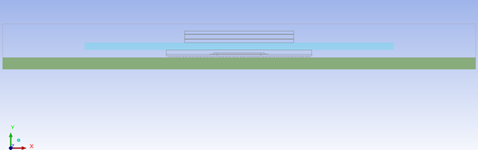

10. Create a heat spreader on top of the TEC (for the TEC hot side). Create another block object and open its **Edit** panel.

11. On the **Info** tab, enter a **Name** of **HeatSpreader2**.

12. On the **Geometry** tab, set the geometry specifications as shown in Figure 36.10: HeatSpreader2 - Geometry Tab (p. 881).

**Figure 36.10: HeatSpreader2 - Geometry Tab**

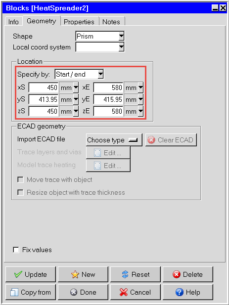

13. On the **Properties** tab, confirm the **Block type** is **Solid** with default materials selected.

**Figure 36.11: Model with Heatspreader2 Added**

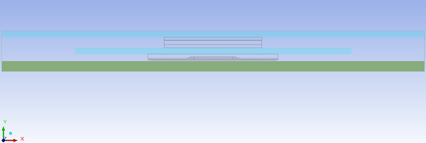

14. Next, create wall objects that will allow heat to escape the domain. We will create 2 walls, one below the PCB that represents natural convection in air, and one on top of the heat spreader that represents a cold plate.

a. Create a wall object and open its **Edit** panel.

b. On the **Info** tab, name the wall object **LowerWallBoundary**, and in the **Geometry** tab, set

the geometry specifications as shown in Figure 36.12: LowerWallBoundary - Geometry Tab (p. 883).

**Figure 36.12: LowerWallBoundary - Geometry Tab**

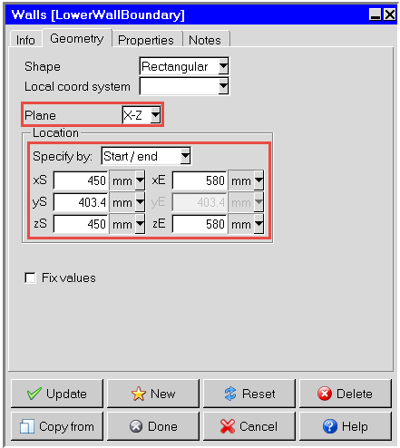

c. In the **Properties** tab under Thermal specification, click **Edit** and specify a 15 W/K-m2 **Heat** **transfer coefficient** as shown in Figure 36.13: LowerWallBoundary - Property Tab (p. 884).

**Figure 36.13: LowerWallBoundary - Property Tab**

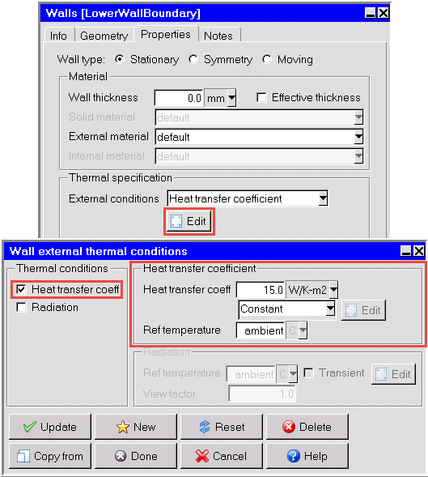

d. Create another **Wall** object and open its **Edit** panel.

e. On the Info tab, name the wall object **UpperColdPlateWallBoundary**, and in the **Geometry**

tab, set the geometry specifications as shown in Figure 36.14: UpperColdPlateWallBoundary - Geometry Tab (p. 885).

**Figure 36.14: UpperColdPlateWallBoundary - Geometry Tab**

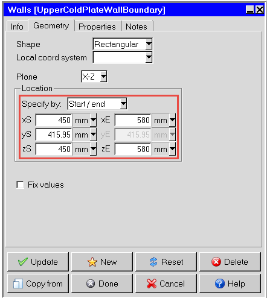

f. In the **Properties** tab under **Thermal specifications**, specify a 20C temperature boundary condition as shown in Figure 36.15: UpperColdPlateWallBoundary - Property Tab (p. 886).

**Figure 36.15: UpperColdPlateWallBoundary - Property Tab**

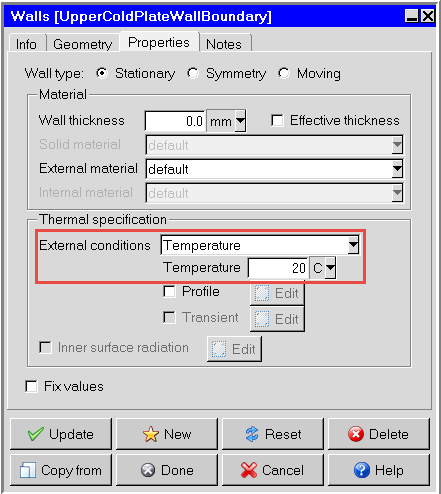

.

15. In the **Model manager**, right-click the **Cabinet** and select **Autoscale** to resize it. Notice the air-solid object already included in the model. This will be a conduction-only model and fluid flow effects will be ignored.

**Figure 36.16: Autoscaled Cabinet**

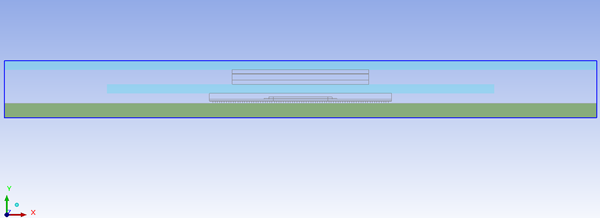

### 36.6. Step 3: Creating Separately Meshed Assemblies

At this stage, we will apply non-conformal mesh settings.

1. In the **Model manager**, right-click on the **Laird_HT4_12_F2_3030.1** assembly and select **Create** **assembly**.

2. Double-click on the new assembly and enter a **Name** of **TECs** on the **Info** tab.

3. On the **Meshing** tab, enter the **Slack settings** as shown in Figure 36.17: TECs Assembly - Meshing Tab (p. 888).

**Figure 36.17: TECs Assembly - Meshing Tab**

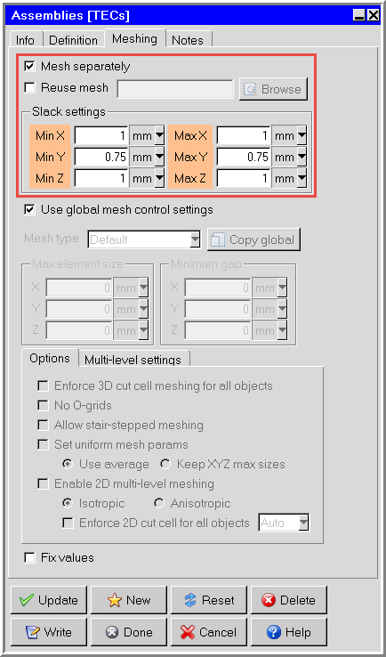

4. Leave the other default mesh settings. Click **Update** and **Done**.

5. In the **Model manager**, double-click the **Package** assembly and go to the **Meshing** tab.

6. Select **Mesh separately** and view the **Slack settings**.

**Figure 36.18: Package Assembly - Meshing Tab**

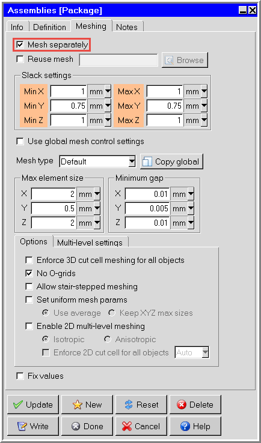

7. Click **Update** and **Done** to close the **Assemblies** panel. The Model manager should appear as shown in Figure 36.19: Model Manager (p. 890).

**Figure 36.19: Model Manager**

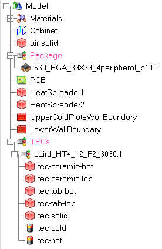

**Note:**

Before continuing to generate a mesh, ensure the Model manager appears as it does in the image above. If an object is included in an assembly erroneously, move it outside the assembly before continuing.

.

### 36.7. Step 4: Generate a Mesh

1. Click the **Generate mesh** button (

) to open the **Mesh control** panel.

2. Click **Generate**.

**Figure 36.20: Mesh Control Panel**

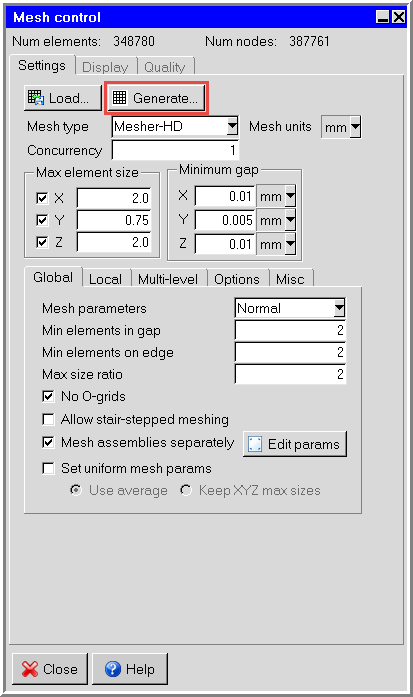

3. Use the **Display** tab and inspect the mesh in the **Graphics Display** window. Also, use the **Quality** tab to confirm the mesh is of reasonable quality.

### 36.8. Step 5: Create Monitor Points

Create temperature monitor points by right-clicking on the tec cold source (**tec-cold**) and the package object (**560_BGA_39X39_4peripheral_p1.00**) and selecting **Monitor point** from the **Create** menu.

**Figure 36.21: Monitor Points Folder**

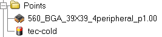

**Note:**

Alternatively, you can click on these objects and drag them into the **Points** folder in the **Model manager**.

**Note:**

By default, monitor points are created as temperature monitor points. No further edits are required.

### 36.9. Define Physical and Numerical Settings

In the **Model manager** under **Problem setup**, double-click **Basic parameters**. Review the settings on the **General setup** tab. Note that the model will solved for temperature only. Click **Accept**.

**Figure 36.22: Basic Parameters Panel**

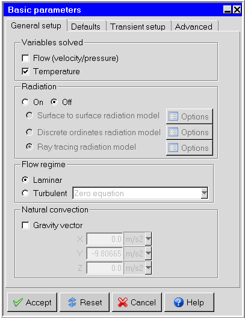

### 36.10. Step 5: Save the Model

Ansys Icepak automatically saves the model for you before it starts the calculation, but it is a good idea to save the model (including the mesh) yourself as well. If you exit Ansys Icepak before you start the calculation, you will be able to open the job you saved and continue your analysis in a future Ansys Icepak session. (If you start the calculation in the current Ansys Icepak session, Ansys Icepak will simply overwrite your job file when it saves the model.) From the **File** menu, select **Save project**.

**Note:**

Alternatively, you can click the

button in the **File commands** toolbar.

### 36.11. Calculate a Solution

To solve a model containing TEC objects, you must use the **Run TEC** macro.

1. Open the Run TEC panel as shown in Figure 36.23: Run TEC Macro (p. 894).

**Figure 36.23: Run TEC Macro**

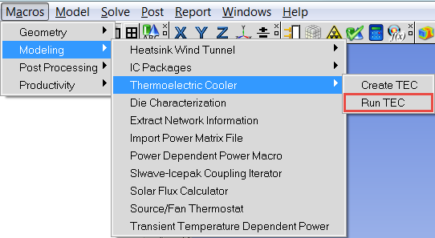

2. In the **Run TEC** panel under **Material properties**, select **Use Laird properties**.

**Note:**

Alternatively, you can select **Specify material properties** and set the **Seebeck** **coefficient**,**Electrical resistivity**, and **Thermal Conductivity**.

3. Under **TEC Simulation Mode** select **Specify I and calculate T**. This will operate the macro in tem- perature-hunting mode.

4. In the **TEC Objects List**, specify 1.5 A for **Operating Current**. Leave the default values for **G-factor** and **# of TEC Couples**.

5. Specify a **Solution ID** and click **Accept** to launch the solver.

**Figure 36.24: Run TEC Panel**

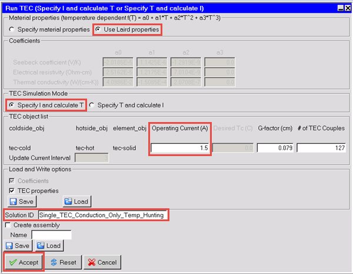

**Figure 36.25: Solution Residuals**

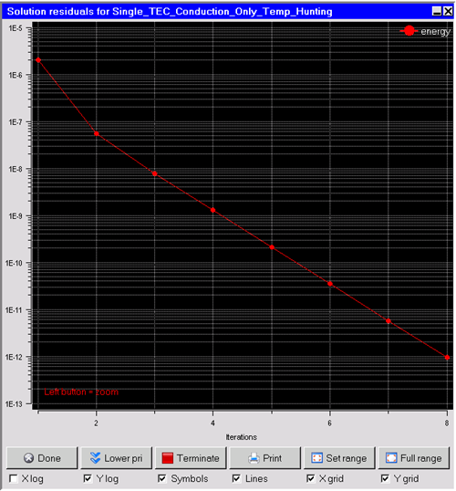

**Figure 36.26: Temperature Monitor Point Plot**

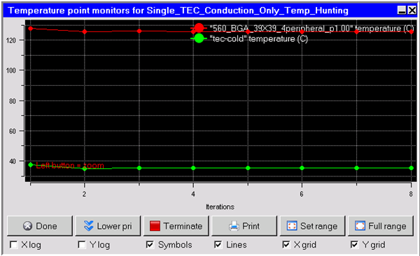

### 36.12. Examine the Results

1. Create a plane cut to display temperature contours.

a. Click the **Plane cut** button (

) to open the **Plane cut** panel.

**Figure 36.27: Plane Cut Panel**

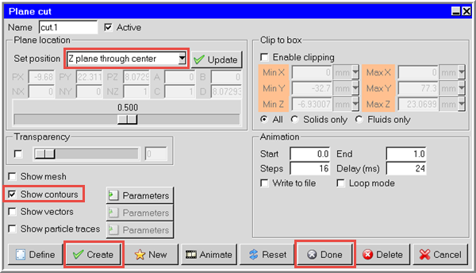

b. For **Set position**, select **Z plane through center**.

c. Select **Show contours**. Temperature is the default contour selection.

d. Click **Create** and **Done**.

**Figure 36.28: Plane Cut**

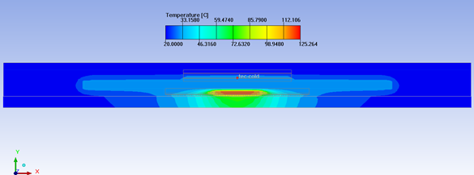

2. Create a **Summary report** of the temperatures on the top and bottom ceramic objects along with the heat flow in the cold and hot source objects.

a. In the **Model manager**, select **tec-ceramic-bot**,**tec-ceramic-top**,**tec-cold**, and **tec-hot**, right-click the selection, and select**Separate** from the **Summary report** menu. The **Define** **summary report panel** is displayed.

**Figure 36.29: Define Summary Report Panel**

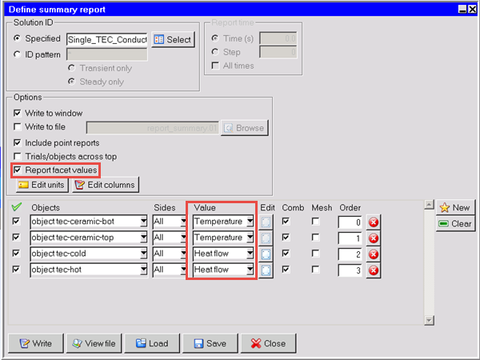

b. Select **Report facet values**.

c. Select **Temperature** as the **Value** for the ceramic objects and **Heat flow** as the **Value** for the source objects.

d. Click **Write** to create the summary report.

**Figure 36.30: Summary Report**

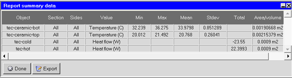

e. From the **File** menu, click **Save project**.

### 36.13. Step 6: Summary

In this tutorial, you used the **Run TEC** macro to model an IC package being cooled via a thermoelectric cooler (TEC).

Some tips and best practices used in this tutorial are listed below:

• Ensure adequate heat sinking at the TEC hot side.

• Ensure adequate mesh resolution on the TEC objects. If necessary, this can be achieved through per-object parameters and non-conformal meshing.

• Ensure correct TEC properties are entered in the **Run TEC** macro panel.

• Use monitor points on the TEC object to monitor convergence.

• Once a TEC is brought into your Icepak model, perform Move operations on the entire TEC as- sembly.

• Make use of the Icepak Library to quickly insert TEC objects into your model. Also, note that the **Create TEC** macro can be used to create custom TECs.

• Individual settings inside the edit panels of TEC objects should not be modified manually.

---

## Chapter 37: Icepak-Twin Builder Coupling

### 37.1. Introduction

This tutorial demonstrates how to create and use a Reduced Ordered Model (ROM) using Ansys Icepak and Ansys Twin Builder.

There are two steps to create ROM model:

• Create the step response files. These files can be created automatically using Icepak. This tutorial demonstrates how to create the required step response files in Icepak.

• Create the ROM in Twin Builder. This tutorial also presents the procedure needed to create a state-space model in Twin Builder.

### 37.2. Prerequisites

This tutorial assumes that you have basic familiarity with the Ansys Icepak and ANSYS Twin Builder in- terfaces.

### 37.3. Problem Description

In this workshop, we have four FET’s (Field-effect transistor) placed on a board and a heat sink mounted on one of the FET. These FET’s generate heat which gets dissipated into the environment. Forced con- vection is used for thermal management of the system.

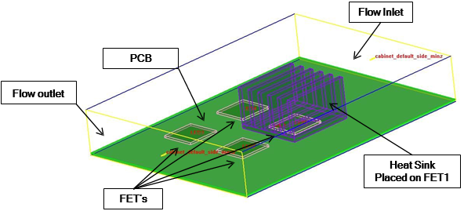

We are interested in temperature rise at the four FET’s due to its power dissipation. From a system point of view, power dissipation from the FET’s are the inputs and the temperature rise at the four FET’s are

the outputs. We will create a ROM which can efficiently calculate temperatures at the pre defined outputs under any transient heat dissipation scenario.

The state-space approach is generally valid for linear systems consisting of forced convection flow and insignificant radiative heat transfer.

The input file Icepak_TwinBuilder.tzr can be found on the ANSYS Help Site. The procedure to download this file is described below.

1. Set up a working directory on the computer you will be using.

2. Download the twinbuilder.zip file here.

3. Unzip the twinbuilder.zip file you have downloaded to your working directory.

### 37.4. Step 1: Unpack the TZR File

1. Create a working directory. Copy the file Icepak_TwinBuilder.tzr to your working directory.

2. Start Ansys Icepak, When Icepak starts, the **Welcome to Icepak** panel opens.

3. Click **Unpack**.

**Figure 37.1: Welcome to Icepak**

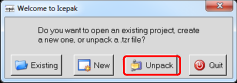

4. The **File selection** panel appears. In the **File selection** panel, select the Icepak_TwinBuilder.tzr file from your working directory and click **Open**.

**Figure 37.2: File Selection Dialog**

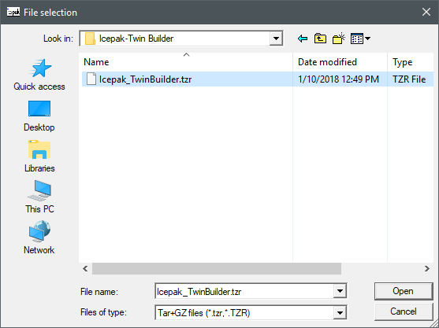

5. The **Location for the unpacked project** dialog appears. Select the working directory where you would like to place the unpacked project file, a project name, such as Icepak-Twin Builder- Project, in the**New project** text field, and then click **Unpack**.

**Figure 37.3: Location for the Unpacked Project Dialog**

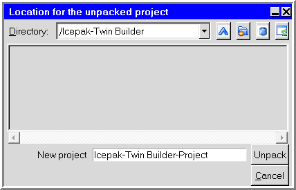

**Note:**

Mesh and solver settings have already been defined for this model.

### 37.5. Step 2: Set up the State-space Trials

1. From the **Solve** menu, select **Run optimization** to open the **Parameters and optimization** panel.

**Figure 37.4: Parameters and Optimization panel**

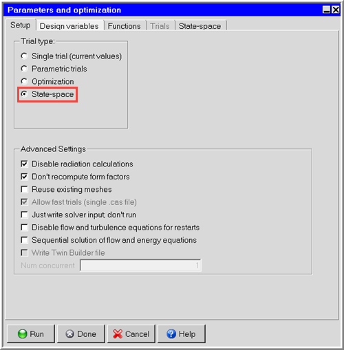

**Note:**

Ensure that **Write Twin Builder file** is disabled.

2. For **Trial type**, select **State-space**.

### 37.6. Step 3: Enter Inputs and Outputs for State-space

1. On the **Parameters and optimization** panel, click the **State-space** tab.

2. From the **Input** drop-down, select **FET1**,**FET2**,**FET3**, and **FET4** and click **Accept**.

**Figure 37.5: State-space Inputs**

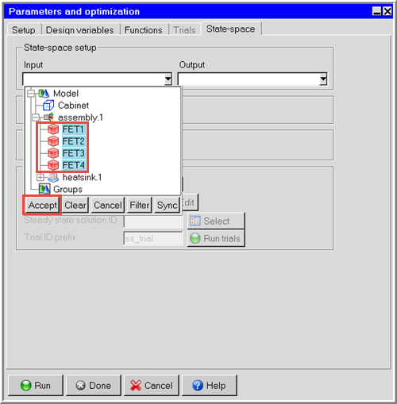

3. From the **Output** drop-down, select **FET1**,**FET2**,**FET3**, and **FET4** and click **Accept**.

**Figure 37.6: State-space Outputs**

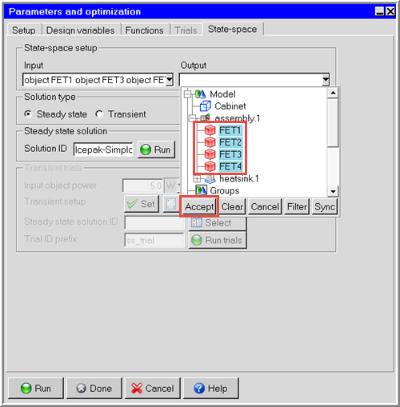

**Note:**

The inputs can also be selected from the list of monitor points. When Icepak objects are selected as inputs, Icepak will automatically create monitor points for these components.

**Note:**

The inputs and the outputs can be different.

### 37.7. Step 4: Run a Steady State Solution

1. On the **Parameters and optimization** panel **State-space** tab, enter a **Solution ID**.

2. Click **Run** to run the steady state solution.

**Figure 37.7: Enter a Solution ID and Run the Solution**

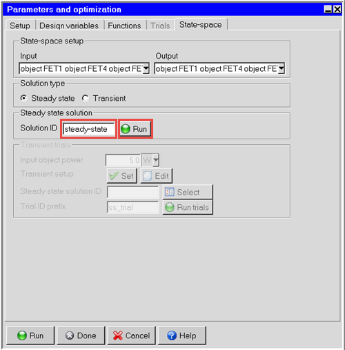

**Note:**

The steady-state solution residuals appear as in the following images. Ensure that the the solution is converged.

**Note:**

You can use parallel solve can for this solution. For parallel, ensure that **Specify** **monitor point output frequency** is disabled in the **Parallel settings** panel.

**Figure 37.8: Steady State Solution Residuals**

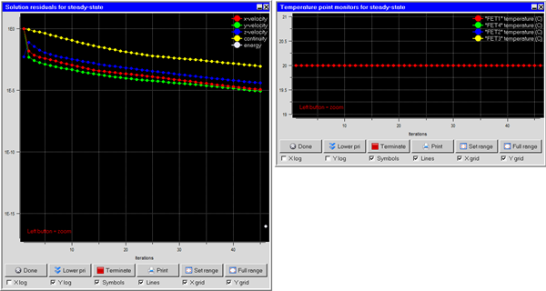

3. Click **Done** to dismiss the solution residuals panels.

### 37.8. Step 5: Run Transient Trials

1. On the **Parameters and optimization** panel **State-space** tab under **Solution type**, select **Transient**.

2. Enter **5.0 W** for the **Input object power**.

3. Next to **Transient setup**, click **Set** to automatically set the time step size and duration.

**Note:**

The automatic Set option sets simulation duration of 10,000 seconds to make sure that the system reaches a steady state. This also uses smaller time step size at the start to capture in initial transient behavior. Edit option can be used to change these settings.

4. Next to **Steady state solution**, click **Select** to open the **File selection** dialog and browse for the steady-state.fdat file.

**Note:**

Icepak restarts from a full data steady state solution and runs a transient energy only solution (no flow).

**Note:**

Icepak generates step response data.

5. Enter a **Trial ID prefix** and click **Run trials**.

**Figure 37.9: Set Up Transient Trials**

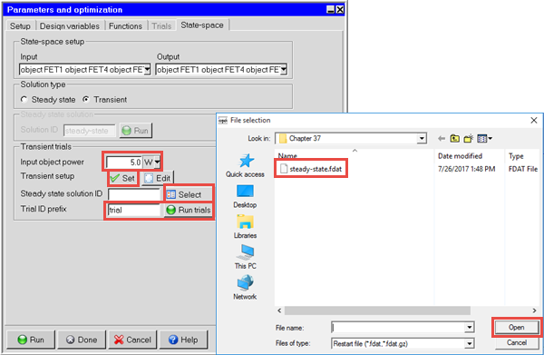

**Note:**

For every input, Icepak runs one solution. For every output, Icepak creates step re- sponse curves within each solution.

**Note:**

The concurrent solving ability in Icepak is not used for these runs.

6. Note the trials residuals in the images below. Ensure that the solution is converged. The temperature monitor point curves must be flat at the end.

**Figure 37.10: Transient Trials Residuals**

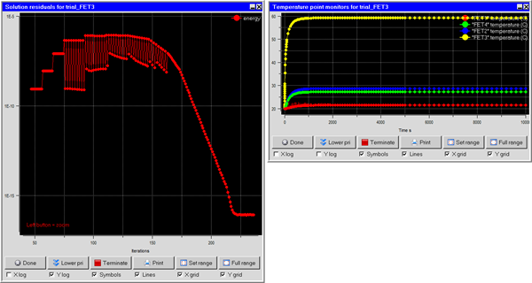

**Note:**

Icepak generates 16 monitor files, which are the step responses of the system. These (.out) files are saved in the project directory within a directory named Twin BuilderFiles. The following files are generated:

• [InputObjectName].[OutputObjectName].out

• [SolutionID].gif

• [SolutionID].simpinfo

• InputPortNames.txt

• InputStepInputValues.txt

This completes the generation of the step response data using Icepak. In the next section, we will use the step response data to create a state-space model in Twin Builder.

### 37.9. Step 6: Create the ROM in Twin Builder

In Twin Builder, we will create a ROM model from the Icepak data and run the ROM for simple inputs.

1. Open ANSYS EM Suite > ANSYS Twin Builder.

2. From the **Twin Builder** menu, select **Toolkit** > **Thermal Model Identification**.

**Figure 37.11: Thermal Model Identification**

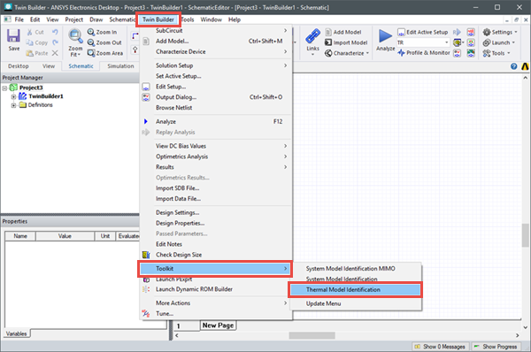

3. In the **Thermal Model Identification** dialog, do the following:

**Figure 37.12: Thermal Model Identification Dialog**

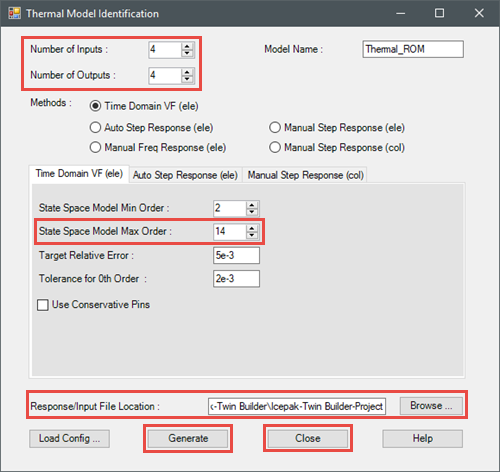

a. For **Number of Inputs**, enter 4.

b. For **Number of Outputs**, enter 4.

c. For **State Space Model Max Order**, enter 14.

**Note:**

The maximum order for State Space Model Max Order is 40. It can be optimized to smaller than 14 when possible.

d. Next to **Response/Input File Location**, click **Browse**.

e. In the **Browse for Folder** dialog, browse to and select the Icepak project working dir-

ectory.

**Figure 37.13: Browse for Folder Dialog**

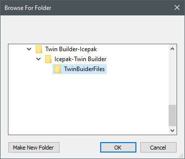

f. Click **OK** to return to the **Thermal Model Identification** dialog.

g. Click **Generate**. After the ROM has been created, a message appears. Press any key to

close the message window.

**Figure 37.14: ROM Creation Message**

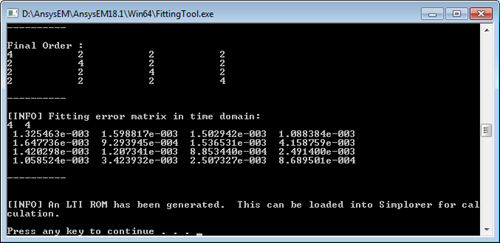

h. Click **Close** to close the **Thermal Model Identification** dialog.

**Note:**

Check the Message Manager after the ROM is created. If there are any warnings or error messages, the accuracy of the result in Twin Builder is not ensured.

### 37.10. Step 7: Place the ROM in Twin Builder

1. In the **Project Manager**, expand **Definitions** and then **Components**.

**Figure 37.15: Thermal ROM SML Component**

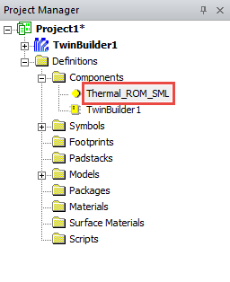

2. Click and drag **Thermal_ROM_SML** into the workspace. Click to place it in the workspace and then press the ESC key.

**Figure 37.16: Thermal ROM SML in the Workspace**

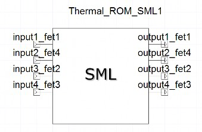

### 37.11. Step 8: Enable Outputs

1. From the **Twin Builder** menu, select **Output Dialog**.

2. Under **Add/Remove**, expand **Thermal_ROM_SML1**.

3. Select all four outputs as shown in the image below.

**Figure 37.17: Output Dialog**

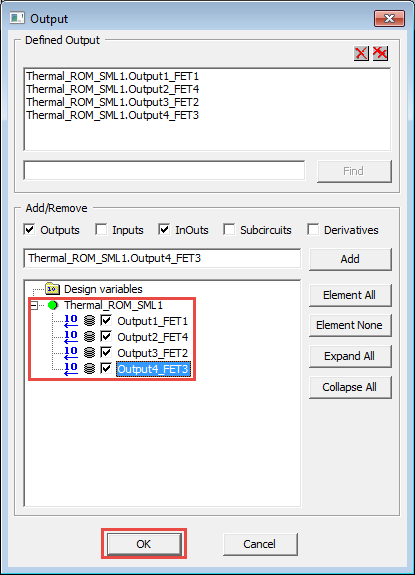

4. Click **OK** to close the **Output Dialog**.

### 37.12. Step 9: Specify Inputs

**Note:**

If the **Component Libraries** window is not displayed, click **View** > **Component Libraries**.

1. On the **Components** tab of the **Component Libraries** window, expand **Simplorer Elements** > **Basic** **Elements** > **Blocks** > **Sources Blocks**.

2. Click and drag **CONST: Constant Value** to the workspace and connect it to **input1_fet1**. Click with the left mouse button to place the block.

3. Repeat the previous step to connect **CONST: Constant Value** blocks to **input2_fet4** and **input3_fet2**.

4. In the **Component Libraries** window, expand **Simplorer Elements** > **Basic Elements** > **Tools** > **Time Functions**.

5. Click and drag **TRAPEZ: Trapezoidal Wave** to the workspace and connect it to **input4_fet3**. Click with the left mouse button to place the block.

**Figure 37.18: ROM Schematic**

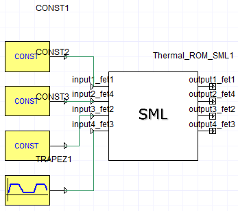

6. Double-click the **CONST1** block to open its **Parameters** panel.

7. Under **Parameters** next to **Value**, enter 1.5 to specify the power dissipation (in Watts) for the ROM and click **OK**.

**Figure 37.19: CONST1 Parameters Dialog**

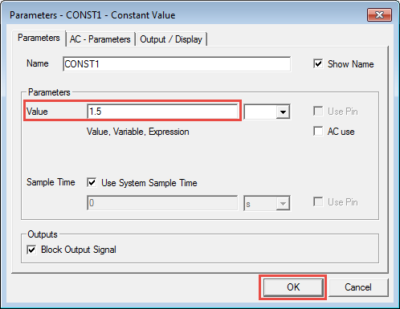

8. Repeat the previous step for **CONST2** and **CONST3**.

9. Double-click the **TRAPEZ1** block to open its **Parameters** panel.

**Figure 37.20: TRAPEZ1 Parameters Dialog**

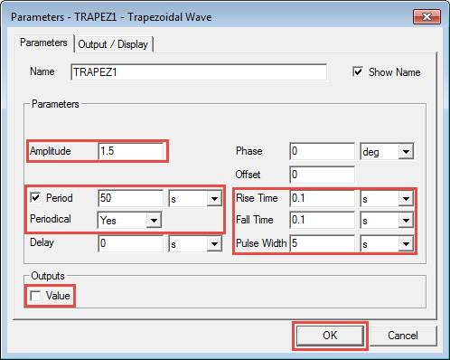

10. Under **Parameters**, do the following:

a. For **Amplitude**, enter 1.5.

b. Select **Period** and enter 50.

c. For **Periodical**, select **Yes**.

d. For **Rise Time**, enter 0.1.

e. For **Fall Time**, ente 0.1.

f. For **Pulse Width**, enter 5.

11. Under **Outputs**, deselect **Value**.

### 37.13. Step 10: Plot Outputs

1. In the **Project Manager**, right-click **Results** and select **Create Standard Report** > **Rectangular Plot**.

**Figure 37.21: Create a Rectangular Plot Report**

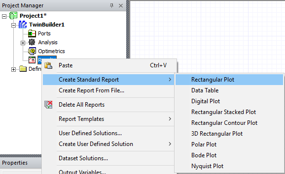

2. In the **Report** dialog under **Quantity**, select all four outputs as shown in the image below.

**Figure 37.22: Report Dialog**

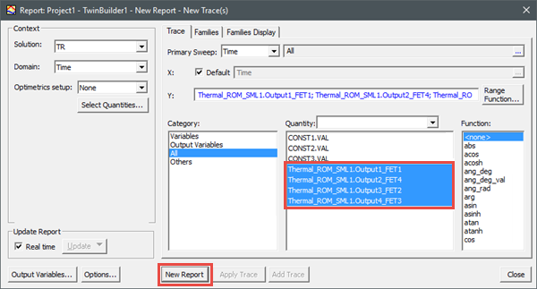

3. Click **New Report**.

### 37.14. Step 11: Simulate ROM

1. In the **Project Manager**, expand **Analysis** and double-click **TR** to open the **Transient Analysis** **Setup** dialog.

**Figure 37.23: Transient Analysis Setup Dialog**

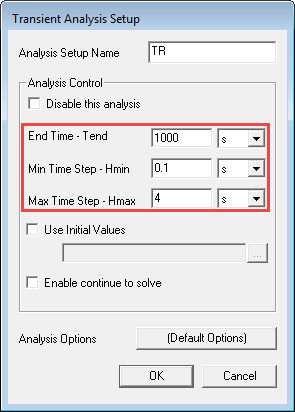

2. Under **Analysis Control**, do the following:

**Note:**

Ensure that you select second as the unit for the following entries.

a. For **End Time - Tend**, enter 1000 s.

b. For **Min Time Step - Hmin**, enter 0.1 s.

c. For **Max Time Step - Hmax**, enter 4 s.

3. Click **OK** to close the **Transient Analysis Setup** dialog.

4. In the **Project Manager**, right-click on **TR** and select **Analyze**.

**Figure 37.24: Analyze the ROM**

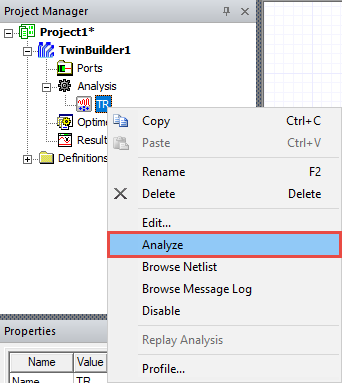

5. Under **Results**, select the XY Plot to display the temperature change.

**Figure 37.25: XY Plot with Temperature Results**

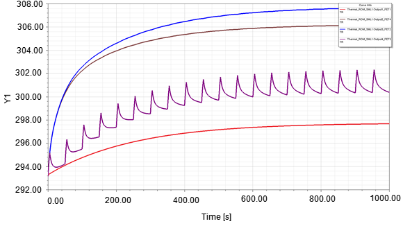

**Note:**

Temperatures are dispalyed in Kelvin. The XY plot created is based on both step responses created by Icepak and the inputs of Twin Builder.

### 37.15. Step 6: Summary

In this tutorial, we created a reduced order model in Ansys Twin Builder and the step response files necessary to create and analyze a state-space model in Ansys Icepak.

---

## Chapter 38: CTM Import and RedHawk Back Annotation

### 38.1. Introduction

This workshop serves to demonstrate the Ansys Icepak portion of the ANSYS Chip-Package-System (CPS) thermal workflow. In this tutorial, you will:

• Begin with an existing Icepak project that contains a PCB with some components, including a detailed IC package

• Import a CTM-based power map onto the detailed package die

• Perform a system level thermal simulation

• Export the relevant system-level thermal information for import to a chip-level thermal analysis tool

Review the components of the model components in the following image.

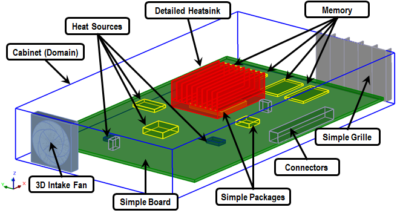

**Note:**

Mesh counts and solution results may differ slightly due to enhancements to the meshing algorithm and Fluent solver, respectively.

### 38.2. Unpack the Ansys Icepak Project

• Open a new, standalone Icepak session and click **Unpack**.

**Figure 38.1: Options Available for a New Icepak Session**

• In the file selection panel, select the packed project file IPK_RH.tzr and click **Open**.

**Note:**

The file IPK_RH.tzr can be found on the ANSYS Help Site. The procedure to download this file is described below.

1. Set up a working directory on the computer you will be using.

2. Download the chip-package-system.zip file here.

3. Unzip the chip-package-system.zip file you have downloaded to your working directory.

**Figure 38.2: File Selection Panel**

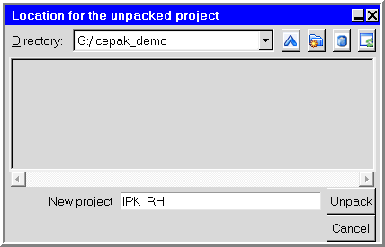

• In the location for the unpacked project file selection dialog, select a location where you would like to create the new Icepak project and click **Unpack**.

**Note:**

A directory with the project name will be created. All project data will be saved in this directory.

• **Figure 38.3: Unpacked Model**

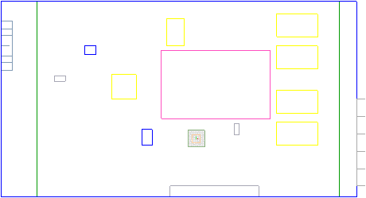

### 38.3. Set Project Units

1. From the **Edit** menu, select **Preferences**.

2. Under **Defaults**, select **Units**.

3. Under **Category**, select **Length**.

4. Ensure that **Length** is set to **mm** and **Volume Flow** is set to **cfm**.

**Figure 38.4: Preferences Panel**

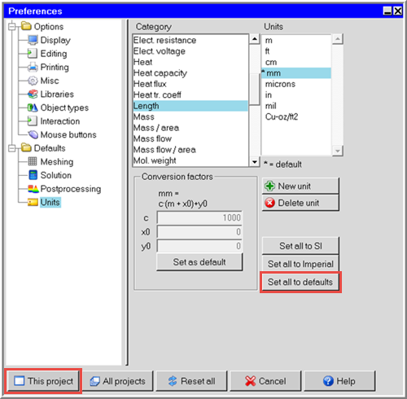

5. Click **Set all to defaults**.

6. Click **This project**.

### 38.4. Check Custom Material Properties

Confirm that the properties of the custom package materials, which have already been defined. These materials should be consistent with those specified in the chip-level thermal analysis.

1. In the model tree, expand **Materials** and **Solid**.

2. Expand Dielectric, Ic-pkg_custom, and Solder_custom.

**Figure 38.5: Custom Materials**

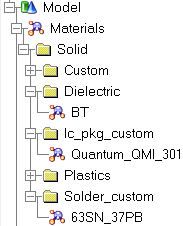

3. Double-click the materials under each to verify the material settings in the images below.

**Figure 38.6: Materials Panel (BT)**

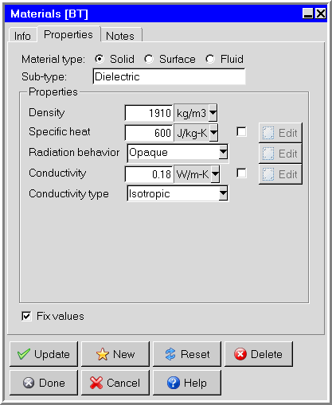

**Figure 38.7: Materials Panel (Quantum QMI 301)**

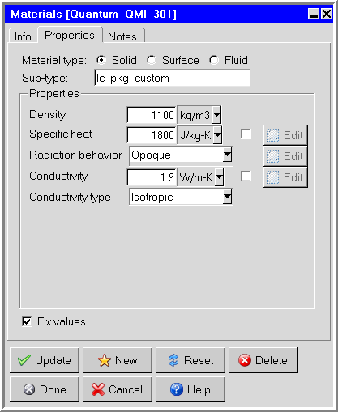

**Figure 38.8: Materials Panel (64SN 37PB)**

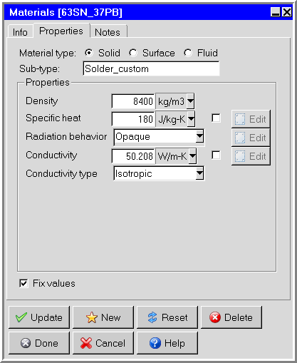

### 38.5. Review the Package Object

Review the package object properties, display traces, and view the metal fractions.

1. On the model manager **Project** tab, double-click the **fccsp** package object.

2. Ensure the settings on the **Package** panel **Dimensions**,**Substrate**,**Solder**, and **Die/Mold** tabs match those in the images below.

**Figure 38.9: Package Panel (Dimensions Tab)**

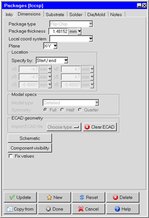

**Figure 38.10: Package Panel (Substrate Tab)**

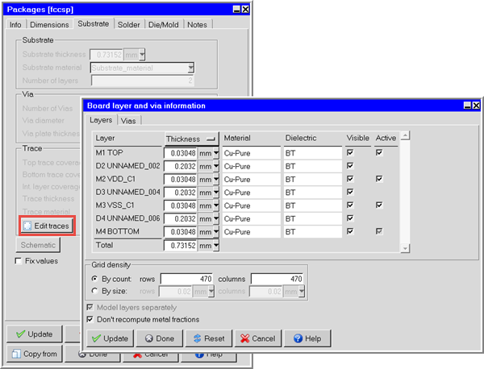

**Figure 38.11: Package Panel (Solder and Die/Mold Tabs)**

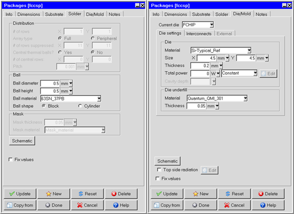

3. Right-click on the package in the model tree.

4. From the right-click menu, select **Traces** > **Color by trace** to display the traces in the Graphics window.

**Figure 38.12: Traces**

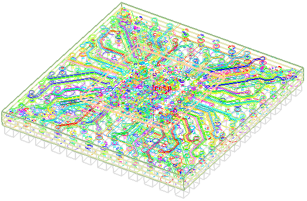

Icepak uses the package traces to determine detailed, layer-by-layer, local metal fractions in the package. The metal fractions are then used to determine local thermal properties (for ex- ample, thermal conductivity). Hence detailed thermal pathways in the package object are re- solved.

5. From the **Model** menu, select **Show metal fractions** to open the **Show metal fractions** panel.

6. From the **Object with traces** drop-down list, select **fccsp**.

7. From the **Trace layer** drop-down list, select M1 (TOP) and click **Display**.

**Figure 38.13: Show Metal Fractions Panel**

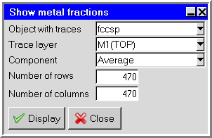

8. Examine the metal fractions in the Graphics window.

**Figure 38.14: Metal Fractions (M1 TOP)**

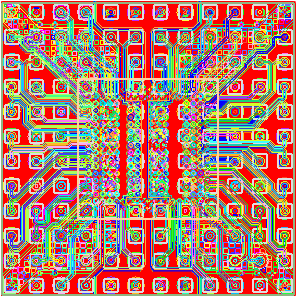

9. Review each layer's metal fractions by selecting them in the **Trace layer** drop-down list and then close the panel.

### 38.6. Import RedHawk CTM Profile

1. From the **File** menu, select **Import** > **Powermaps** > **RedHawk CTM profile** to open the **Import** **CTM profile files** panel.

2. From the **Die Block** drop-down list, expand the **fccsp** package, select **flipdie_block_FCHIP**, and click **Accept**.

3. Next to **CTM file**, click **Browse** and use the **CTM file** dialog box to locate and select the CTM file.

4. Click **Load** to load the file.

**Figure 38.15: Import CTM Profile Files Panel**

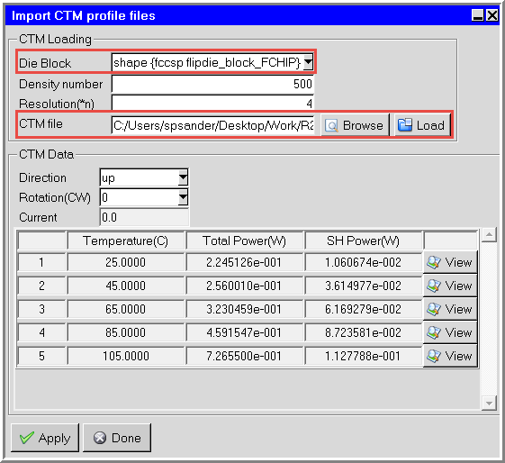

**Note:**

If you have a Pd map, you can import it as an altnernative to the CTM profile. Open the **Import Apache Sentinal TI profile** panel from **File** > **Import** > **Powermaps** > **Apache Sentinel TI profile**. For flip-chip packages, select **Face down**.

5. Under **CTM Data**, click **View** for one of temperature points to open the **Powermap info** panel.

6. Zoom in on the die to view the power profile at the selected temperature. The CTM viewer plots the power map as a function of temperature on 10 micron x 10 micron cells.

**Figure 38.16: Powermap Info Panel**

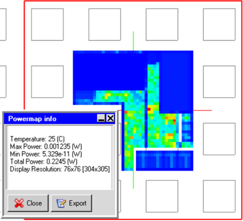

7. In the **Import CTM profile files** panel, view the power profile at each temperature point. Note that, as temperature increases, power also increases.

8. For **Density number** as **101** and the **Resolution(*n)** as **4**.

**Figure 38.17: Powermap**

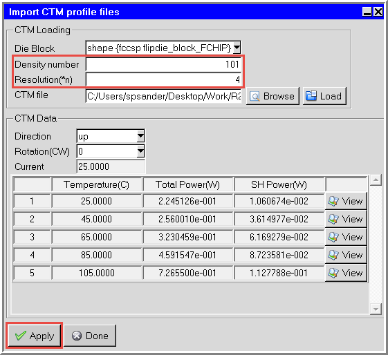

9. Click **Apply** to generate the powermap. The powermap is displayed in the Graphics window, and source objects are created in an assembly in the model tree.

**Note:**

After creating the powermap, the associated files are created in the project folder. The current powermap can be replaced by changing the **Density number** in the **Import CTM profile files** panel and clicking **Apply**.

**Figure 38.18: Powermap**

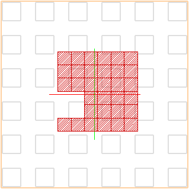

10. Ensure that the powermap corresponding to **Density number** 101 is loaded, and click **Done** to close the **Import CTM profile files** panel.

11. Adjust the location of the powermap to center it and place it on the bottom of the die. First, double-click the fccsp package object in the model tree and click the **Dimensions** tab.

12. Click **Component visibility** to open the **Component Visibility** panel, ensure only **Die** is selected, and click **Done** in both panels.

**Figure 38.19: Packages Panel - Dimensions Tab**

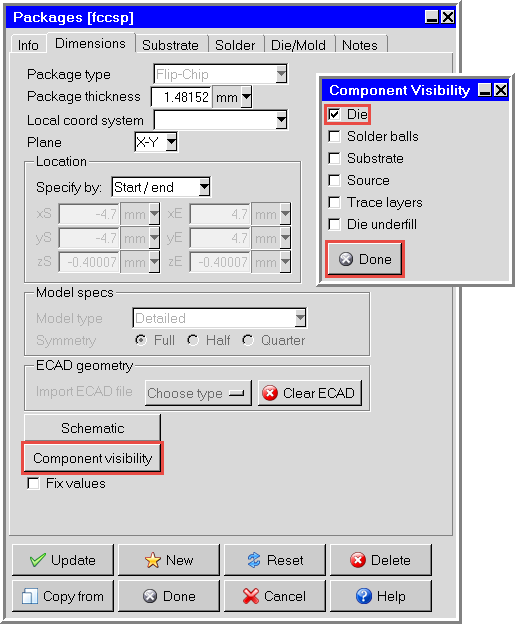

13. Click Align Face Centers (

) and use the tool to select the powermap assembly and the bottom face (-Z direction) of the die to move it to the bottom face.

**Note:**

You can use the View/Distance tool to ensure that the powermap is centered on the bottom face.

**Figure 38.20: Align Face Centers**

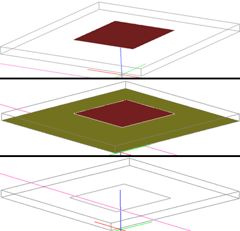

14. Double-click the **fccsp** package object in the model tree and edit the **Component visibility** settings to display all components.

### 38.7. Generate the Mesh

Before generating the mesh, define non-conformal mesh settings to avoid mesh bleeding and minimize cell count as well as per-object mesh settings to ensure a good grid transition between the assembly non-conformal mesh and the background mesh.

1. Create an assembly that includes the fccsp package and the powermap assembly. Press and hold the Ctrl key to select the **fccsp-powermap** assembly and the **fccsp** package object. Right- click and select **Create Assembly**. Change the name of the newly created assembly to **fccsp-** **assembly**.

2. Double-click the **fccsp-assembly** to open the assemblies panel. On the **Meshing** tab, select **Mesh separately** and ensure the settings match those in the following image.

**Figure 38.21: Assemblies Panel - Meshing Tab (fccsp-assembly)**

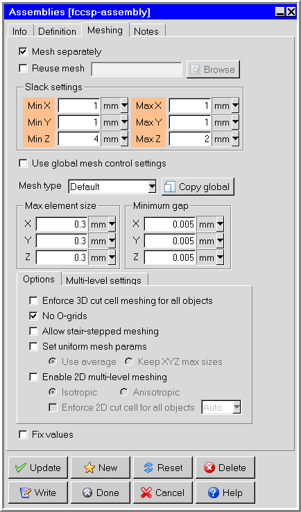

3. Double-click the **fccsp-powermap** assembly to open the assemblies panel. On the **Meshing** tab, select **Mesh separately**and ensure the settings match those in the following image.

**Figure 38.22: Assemblies Panel - Meshing Tab (fccsp-powermap)**

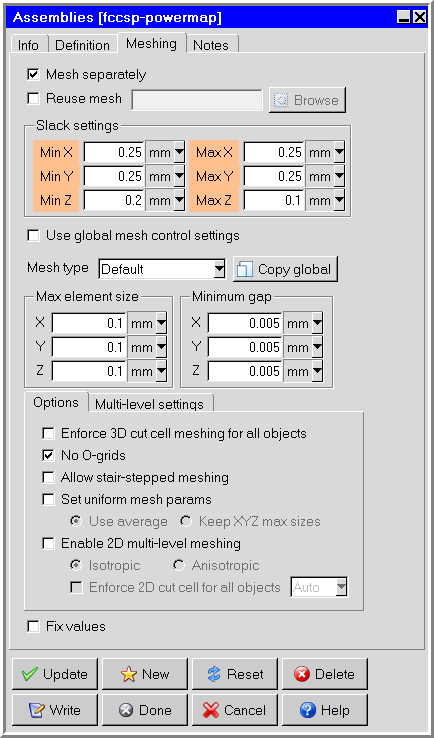

4. Ensure the model tree appears as it does in the following image.

**Figure 38.23: Updated Model Tree**

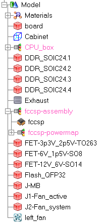

5. Click the **Generate mesh** button (

) to open the **Mesh control** panel.

6. On the **Local** tab, click **Edit params** to open the **Per-object meshing parameters** panel.

7. Select the **fccsp-assembly**, and select the **Outside X count** and **Outside Y count** check boxes,

8. Enter **10** for the requested values, and click **Done**.

**Figure 38.24: Per-object Mesh Settings**

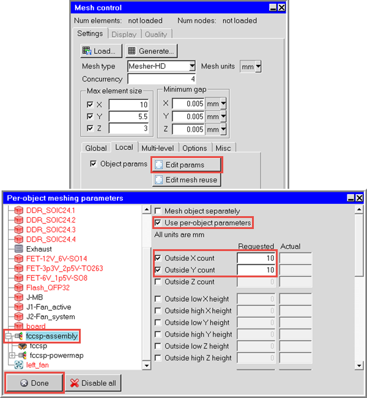

9. On the **Mesh control** panel, click **Generate** to generate the mesh.

10. After the mesh is generated, click the **Display** tab, select **Display mesh**.

11. Under **Display attributes**, select **Cut plane**.

**Figure 38.25: Mesh Cut Plane**

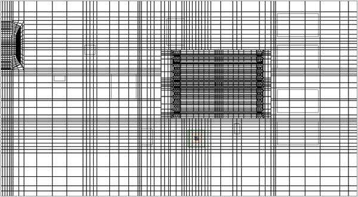

**Note:**

It is recommended that you perform a grid sensitivity study when working with your own models. For the purposes of this tutorial, we will assume the mesh is acceptable.

### 38.8. Run the Simulation

The solution settings and parameters are already defined by the unpacked archive (.tzr) file. If desired, open the **Basic parameters** and **Basic settings** panels to review them. Also, three monitor points are also already defined. If desired, review in the model tree in the **Points** folder.

1. From the **Solve** menu, select **Run solution** to open the **Solve** panel.

**Figure 38.26: Solve Panel**

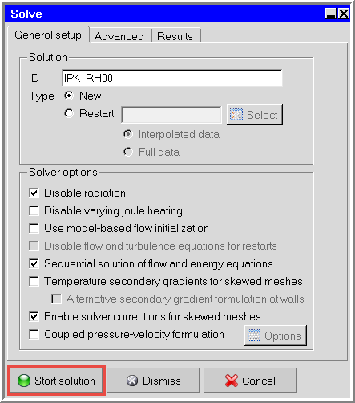

**Note:**

**Sequential solution of flow and energy equations** speeds up forced convection problems.

2. Click **Start solution** to run the simulation.

**Figure 38.27: Solution Residuals Panel**

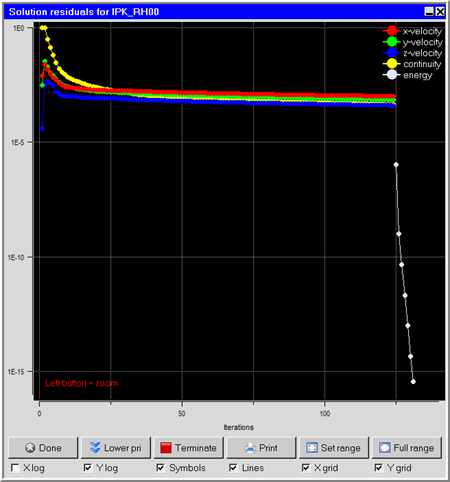

**Figure 38.28: Monitor Panels**

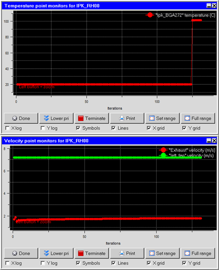

### 38.9. Post-Process the Solution

Post-process the solution by creating object faces and a summary report.

1. Click the object face button (

) to open the **Object face** panel.

2. From the **Object** drop-down select the **fccsp-powermap** assembly and click **Accept**.

3. Select **Show contours** and click **Parameters** to open the **Object face contours** panel.

**Figure 38.29: Object Face Panel**

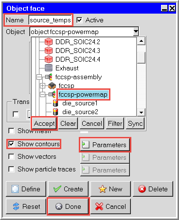

4. In the **Object face contours** panel, ensure **Temperature** is selected, and select **This object**.

**Figure 38.30: Object Face Contours Panel**

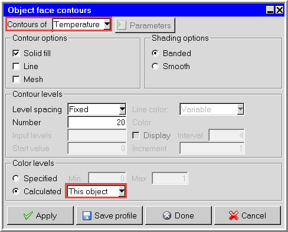

5. Click **Done** in the **Object face contours** panel and then **Done** again in the **Object face** panel to display the temperature contours.

**Figure 38.31: Powermap Temperature Contours**

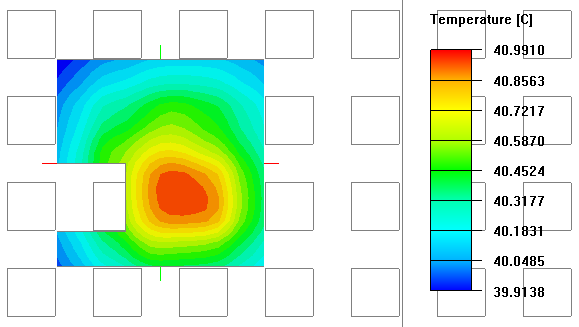

6. To determine the heat transfer coefficient range on the package object, create a summary report by selecting **Report** > **Summary** report to open the **Define summary report** panel.

7. Define the report entries as shown in the image below, selecting the substrate an die objects under the fccsp package and setting **Heat tr coefficient** as the **Value**.

**Figure 38.32: Define Summary Report Panel**

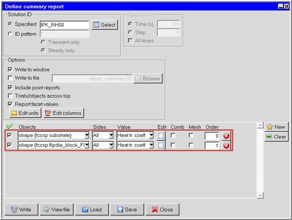

8. Click Write to display the summary report.

**Figure 38.33: Report Summary data Panel**

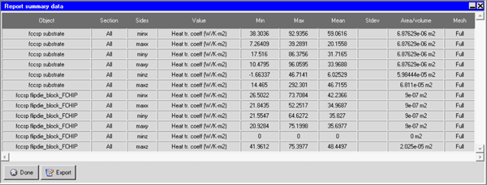

9. Note the minimum and maximum values in the report (0 and 295.756, respectively). We will input these values when creating an object face to display the heat transfer coefficient on the substrate and die blocks. Click **Done** to close the summary report, and click **Close** to close the **Define summary report** panel.

**Note:**

Negative values correspond to heat entering the object at that surface.

10. From the Post menu, select **Object face (facet)** to open the **Object face (facet)** panel.

11. Enter a **Name** of **fccsp-htc**.

12. In the **Object** drop-down list, expand the **fccsp** package and select the substrate and three die objects.

13. In the **Contours of** drop-down list, select **Heat transfer coefficent**.

14. Under **Color levels**, select **Specified** and enter **295.756** for the **Max** value.

**Figure 38.34: Object Face (Facet) Panel**

15. Click **Display** to display the object face in the Graphics window.

**Figure 38.35: Heat Transfer Coefficient Contours**

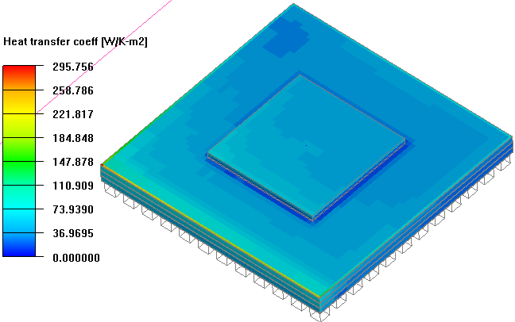

16. Close the **Object face (facet)** panel.

17. If desired, create additional post-processing objects, such as a cut plane displaying velocity vectors as displayed in the following image.

**Figure 38.36: Heat Transfer Coefficient Contours and Cut Plane of Velocity Vectors**

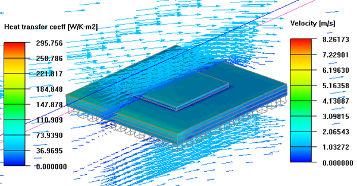

### 38.10. Export Data

You can export temperature data at each tile to RedHawk. Also, the heat transfer coefficient on the package boundary computed by Icepak can be used as the new boundary condition in the chip-level thermal analysis in Sentinel-TI.

1. From the **Report** > **Export** menu, select **RedHawk Back Annotation** to open the **RedHawk** **Back Annotations** panel.

2. In the **Back annotation file** field, specify a location for saving the exported data.

**Figure 38.37: RedHawk Back Annotations Panel**

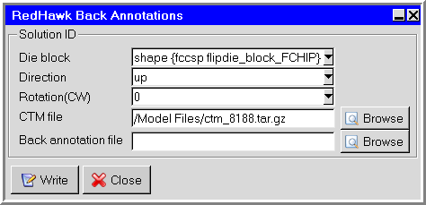

3. Click **Write** to export the data.

4. From the **Report** > **Export** menu, select **Sentinel TI HTC File** to open the **Export Sentinel TI** **HTC file** panel.

5. For **Package top object**, expand the **fccsp** package object and select **flipdie_block_FCHIP**.

6. For **Package substrate** object, expand the **fccsp** package object and select **substrate**.

7. For **Package bottom** object, expand the **fccsp** package object and select any solder ball.

**Figure 38.38: RedHawk Back Annotations Panel**

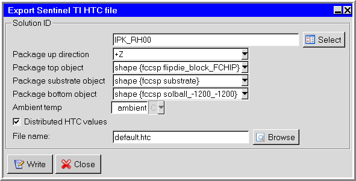

8. Enter a **File name** and click **Write** to export the data.

### 38.11. Summary

In this tutorial, you have:

• Imported the CTM-based, temperature-dependent chip power map onto the IC package die

• Setup, meshed, and solved the Icepak model as a standard Icepak project

• Postprocessed the Icepak chip-aware model

– Viewed temperature profile on the chip power map

– Viewed heat transfer coefficients on the IC package boundary

• Exported the system-level thermal information for chip-level thermal analysis

Chip-Package-System (CPS) thermal analysis using Ansys Icepak is important:

• Chip-level thermal simulation is coupled to the system level thermal environment (Icepak)

• Provides more accurate chip-level thermal results (i.e. system aware chip design) compared to using assumed environment conditions

– For example, averaged and/or assumed htc on the package boundary, or uniform and/or

assumed die temperature

• Provides more accurate system-level thermal results (i.e. chip-aware system thermal design)

• Provides convenient, straight-forward method to accurately identify hot spots in chip and package

• Offers the ability to perform chip/package thermal optimization

• Capability of chip-level tool (RH-CTA) to take into account thermal results from Icepak to compute chip-level thermal phenomena offers an unequaled level of accuracy for thermal design of chips and packages

---

## Index

IDF,335,349 trace layer,353,437 individual side specification,114

### A Airborne Electronics System,761 Avionics Box,579

### J Joule heating,369

### L loss coefficient,203

### B BGA-package,223,421-422

loss coefficient vs Re,220

### C CFD Post,465 CFD Post in Workbench,465 cold-plate,135-136 CTM Import,925

### M Maxwell and Icepak,777 MCAD Geometry

Design Modeler,649 mesh exercise,185 microelectronics,387 modeling

### D Datacenter cooling

radiation,280 monitor point,402 mouse conventions,2 MRF,743 multi-level meshing,409,413

high density,509 Design Modeler

electronics,553 MCAD Geometry,649 Dimensions tab,423

### N non-conformal

### E Edit object panel,8 Electronics

assembly,141 mesh,169,177,179 nested,158

Design Modeler,553

### F finned heat sink,5,19 Functions

### O object parameters,315 obtaining support,2 optimization run,256 orthotropic material properties,154

compound,251 objective,251 primary,251

### P param value,248 parameterization,103 parametric runs,228 parametric trials

### H heat pipe,151,158 heat sink,65

finned,5,19 inline or staggered,223 heat transfer coefficient,428 help

multiple trials,122

### R radiation model

obtaining support,2

discrete ordinates,265,282 ray tracing,283 rf amplifier,51,69

### I Icepak in Workbench,447 Icepak – HFSS coupling,807 Icepak-Twin Builder coupling,901 import

### S search fan library,66 SIwave - Icepak coupling,823 SpaceClaim - Icepak coupling,619,673 summary report,176 support

obtaining help,2 System

Electronics,761 System-Level Geometry

Translation,689

### T TEC macro,873 Thermal Resistance,245 trace heating,369 trace layer,347

import,353,437 transient simulation,289 Translation

MCAD Geometry,689 typographical conventions,2

### W Workbench

Icepak,447 Maxwell and Icepak,777

### Z zero slack,190,435,441 zoom-in modeling,311,321

---

